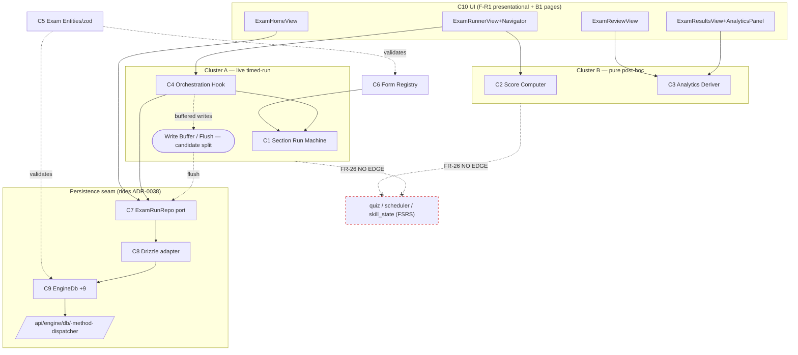

# Logical Components — Exam module (official-rules durable test suite)

> Stage 2 of the arch-* sweep · **review mode** · one Figure-8-6 cycle pass
> Prereq met: [characteristics worksheet](../../worksheets/exam-module-official-rules/characteristics-worksheet.md)
> **Review-mode note:** the exam module does **not exist yet** (evidence sweep found no
> `components/exam/**`, no `exam_run_repo`, no `test_exam_isolation.test.ts`). So there is
> no *actual-vs-intended drift* to report — this pass validates the **intended** split
> (plan §1) before it is built, and audits its reuse of *existing* seams (cited).

## 1. Identification — approach: **Workflow**, Actor/Action overlay

Actors: **Learner**, **System** (auto-submit on expiry, grade-once), **Persistence
boundary** (BFF + durable engine). Major workflows mapped (minors left to evolve):

- **W1 Take a section** · **W2 Resume** (reload/2nd device) · **W3 Review finished** ·
  **W4 See analytics** (results + progress panel) · **W5 Persist/flush** (buffered).

No Entity-Trap names present: the new units are behavior/verb-named (reducer, scoring,
analytics, orchestration hook, repo, registry). The one "Engine"-named surface
(`EngineDb`/`HttpEngineDb`/`pgEngineDb`) is the **inherited** ADR-0038 seam
([engine_db.ts:73](../../../frontend/lib/adapters/engine/db/engine_db.ts#L73)), not a
new component — renaming it is out of scope.

## 2. Component table (intended) + story assignment

| # | Component (file) | Role (one sentence) | Stories | Cluster |
|---|---|---|---|---|
| C1 | **Section Run Machine** `components/exam/exam_section_reducer.ts` | Govern in-section state under official rules (nav/answer/clear/flag + dwell + deadline→expired). | FR-1,13–24 | A (live) |
| C2 | **Score Computer** `components/exam/exam_scoring.ts` | Compute the official score of a finished attempt (raw/scale/composite, honest nulls). | FR-7,8,27,28 | B |
| C3 | **Analytics Deriver** `components/exam/exam_analytics.ts` | Derive facets/pacing/recommendations from finished items (RULES-as-data). | FR-30–33 | B |
| C4 | **Section Orchestration Hook** `components/exam/use_exam_section.ts` | Drive one section's lifecycle vs the repo, buffering writes + surfacing save state. | FR-5,21 | A |
| C5 | **Exam Entities** `lib/wire/exam_entities.ts` | Define + validate the exam wire contracts (zod). | FR-9 | contract |
| C6 | **Form Registry** `lib/adapters/engine/exam_forms/` | Provide validated form content; reject malformed forms at load. | FR-6,9 | content |
| C7 | **Exam Run Repo (port)** `lib/ports/engine/exam_run_repo.ts` | Durable, learner-scoped port for runs/attempts/items. | FR-1–4,27 | seam |
| C8 | **Drizzle Exam Run Repo** `repos/drizzle_exam_run_repo.ts` | Implement C7 over `EngineDb` (typed narrowing of the 41-method surface). | — | seam |
| C9 | **EngineDb exam methods (+9)** *(on the inherited seam)* | Idempotent, owner-scoped run/attempt/item writes. | FR-1–4,12,27,28,25,30 | seam |
| C10 | **Exam Views ×7 + 3 route pages** | Presentational render (F-R1); pages are thin `'use client'` glue (B1). | FR-10–12,17,23–29,34 | UI |

**Story→shared-component conversion (the visible one):** analytics is required on *two*
screens — the run results page (FR-34) **and** `/learn/progress`'s "Exam performance"
panel (FR-34). Rather than duplicate aggregation, both consume the single **C3 Analytics
Deriver** — duplication correctly converted to coupling (two consumer edges into one pure
component). ADR-0040's rationale names this exact move; it is the right call.

## 3. Roles & responsibilities — conjunction test

Two role statements fail the "and/also" test and yield **split candidates** (presented as
trade-offs, per the gate):

- ★ **C4 Section Orchestration Hook** — "begin, submit **and** buffered/debounced flush
  **and** offline not-saved state." The **write-buffer / flush transport** concern is
  separable from **begin/submit lifecycle**. → *Candidate split:* extract a **Write Buffer
  / Flush** unit (pure, testable with the in-memory port fake the plan already wants,
  T-C). **Recommended.** It isolates the **FR-5 Recoverability path** — the module's
  highest-risk locus (stage 5) — into its own asserted unit, and drops C4's fan-out.
- **C1 Section Run Machine** — bundles answer/nav/flag state *and* per-question **dwell**
  (monotonic clock + `visibilitychange`). → *Candidate split:* a **Dwell Tracker**.
  **Optional / lean-against.** Dwell transitions fire on the *same* nav events as answer
  state, so they are genuinely cohesive; splitting risks the "too-small → more coupling"
  tell (`Modularity`: dividing a cohesive module increases coupling). Flag, don't force.

C2 (per-section scoring **+** per-run composite) and C3 (facets/pacing/recommendations)
show mild altitude spread but stay cohesive (all pure, one input set) — leave intact.

*(Seal respected: the book's worked-answer splits were not consulted — this is a real
system, not the kata.)*

## 4. Characteristics-per-component (which -ility stresses which component unevenly)

| Driving char (worksheet) | Concentrated in | Split signal |
|---|---|---|
| Data Integrity | C9 (upsert/monotonic-max/finish-once), C7/C8 | none — correctly located in the seam |
| Correctness/Auditability | C1 (deadline), C2, C3 | none — spread across pure domain |
| Durability/Continuity | C9 + server `started_at` (begin) + resume (C4→C7) | none |
| **Recoverability** | **C4 disproportionately** (offline buffer/flush) | → the C4 split above |
| Modularity/isolation | the **exam ⟂ practice** boundary (cross-cutting, not one component) | → governance, not a split |
| Confidentiality | BFF dispatcher + C7/C8 ownership joins (inherited) | none |

## 5. Restructure + coupling / connascence pass

**Coupling findings** (tagged to this workspace's Frontend-Ring catalog + generic CR-*):

- **C8 is a legitimate Law-of-Demeter win, not a passthrough.** The domain (C4) depends on
  the *9-method typed port C7*, not on `EngineDb`'s 41-method surface — efferent coupling
  is genuinely reduced (matches [drizzle_session_repo.ts:18](../../../frontend/lib/adapters/engine/repos/drizzle_session_repo.ts#L18)). **Holds only if C4→C7, never C4→EngineDb directly** (plan T-C tests the port via an in-memory fake — good).
- **C9 raises the `EngineDb` god-interface fan-in** (32→41). Intentional (ADR-0040 option E
  rejected per-method handlers), but it creates two connascences to watch:
  - **Connascence of position** — dispatcher `LEARNER_ARG` map is positional (`learnerId`-first) ([route.ts:28](../../../frontend/app/api/engine/db/[method]/route.ts#L28)); every new method's signature must keep learnerId at arg 0 or FR-3 isolation silently breaks.
  - **Connascence of name/count** — the conformance test pins the count exactly (`toHaveLength(32)` → 41) ([conformance.test.ts:33](../../../frontend/lib/adapters/engine/db/http_engine_db.conformance.test.ts#L33)); adding 8 not 9 fails loudly (intended friction).
- ★ **Connascence of algorithm across the client/server boundary (FR-4).** Dwell
  `monotonic-max` must be identical in C1/C4 (client accumulation) and C9
  (`dwell_ms = max(old,new)` on replay). If one side *sums*, replays corrupt dwell silently
  → **stage-5 risk input.** Recommend a *shared* dwell-merge helper referenced by both
  sides, or a fixture asserting the two agree.
- **Module-boundary reach-in (CR-01) is the whole ballgame here:** the exam ⟂ practice
  isolation (FR-26) is the sharpest line and is **unenforced today** → C-level governance
  item, carried to stage 6.

## Trade-off close

This is **not** the final design. The least-worst set for this pass: keep C1/C2/C3 intact
(cohesive), **adopt the C4→Write-Buffer split** (isolates the top-risk FR-5 path at the
cost of one new edge), treat the Dwell-Tracker split as optional. Everything else in
plan §1 stands and reuses existing seams faithfully.

---

## GATE: ✅ ACCEPTED — 2026-09-02 (Rajnish Khatri)

- **10-component set: ACCEPTED.**
- **★ C4 → Write-Buffer/Flush split: ADOPTED** — the FR-5/R2 offline-buffer path becomes its own tested unit (one added edge).
- **Dwell-Tracker split: DECLINED** — dwell stays in the C1 reducer (cohesive; splitting would add coupling).
- **Connascence-of-algorithm flag (dwell merge): carried** → Stage-5 **R6** (one shared dwell-merge fn/fixture).
