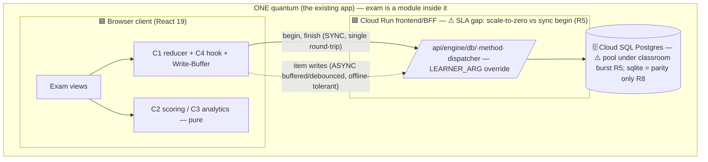

# Validation & Governance — Exam module (official-rules durable test suite)

> Stage 6 of the arch-* sweep · **review mode** · closing artifact
> Depends on stages [1](characteristics-worksheet.md) · [2](../../components/exam-module-official-rules/logical-components.md) · [3](style-decision.md) · [4](decide-audit.md) · [5](../../risk/exam-module-official-rules/risk-report.md)

## 1. Diagram set

**Context view.**
```mermaid
flowchart LR
  L([Learner — authenticated, WorkOS]) -->|takes timed sections, reviews, sees analytics| EX[Exam module]
  EX -. FR-26 NO integration .x P[Practice quiz / FSRS scheduler]
```

**Container view** (quantum boundary + sync/async + SLAs). *Key: solid = sync, dotted = async; 🟦 deployable, 🗄 datastore.*

Both diagrams pass the six guideline checks (title/lines/shapes/labels/key) and the
misinterpretation test. The **async item-write edge is the load-bearing decision** (stage 3):
it decouples the live-run from store availability.

## 2. Nine-intersections walk (aligned / misaligned / unknown — with evidence)

| # | Intersection | Verdict | Evidence / note | Owner if not aligned |
|---|---|---|---|---|
| 1 | **Implementation** (components ↔ code) | ⚪ **unknown-until-built** | Nothing exists yet (evidence sweep). Intended mapping to plan §1 is clean; the *probe that resolves it* is the R1 isolation guard + the layering test extended to `components/`. | verified at build; fitness fn below |
| 2 | **Infrastructure** | 🟠 **misaligned (minor)** | The sync `begin` durability point assumes a warm backend, but no min-instances / pool policy is recorded; Cloud Run scale-to-zero + Cloud SQL warm-up = R5/OPS-1/OPS-9. | arch-style/ops → `decisions.md` |
| 3 | **Data topology** | 🟢 **aligned** (placement) / 🟠 parity-fidelity | One quantum, one store, `exam_*` tables, computed-not-stored analytics (stage 3). But sqlite parity can't exercise concurrency (R8) and the parity test is shape-only (R15). | arch-components → fitness fn |
| 4 | **Engineering practices** | 🟢 **aligned & strong** | Red-green TDD, arch tests, `make check`, totality-test friction — mature. One ordering gap: the R1 guard must be written **first**, not after the code it polices. | this stage (sequencing) |
| 5 | **Team topology** | 🟢 **aligned** | Solo/small team, one module, one owner — Conway-consistent with one quantum; no cross-team coordination surface. | — |
| 6 | **Integration** | 🟠 **aligned-by-design but UNENFORCED** | Reuses dispatcher (no new route family) + timer utils + Grader; feeds `/learn/progress` a distinct panel. The crux — exam ⟂ practice (FR-26) — has **no live guard** (R1); dispatcher scoping is R4. | this stage (isolation fitness fn) |
| 7 | **Enterprise** | 🟢 **aligned** | Respects root invariants (frontend-only; no Python/`trust/`/graph-node; no new deps), rides ADR-0038, follows the ADR ratchet (ADR-0040/OKF). Note: `adr_home→docs/adr/` means arch-* ADRs must carry OKF frontmatter/index/log (binding seam). | binding (already flagged) |
| 8 | **Business** | 🟢 **aligned** / 🟠 record-gap | Serves "official-behaving, study-guiding practice exam." Gaps: ADR-0040 business value implicit (stage-4 B1); R3 (cheatable client-key exam) is a *business-credibility* risk. | arch-decide (B1, R3) |
| 9 | **GenAI** | 🟢 **aligned / N/A by design** | No LLM anywhere; deterministic rules + honest nulls (demand-side lens). No AWS AI/ML → `aws-ai-validate` not invoked. **Future seam:** when LLM narratives arrive, this axis re-opens — `ExamAnalytics` is its clean input. | future iteration |

## 3. Governance table (ADR compliance + fitness-function seeds + stage-5 mitigations)

Platform tools: **ts-morph / TSArch + vitest** (frontend TS); the root Python
`tests/architecture/` (import-linter) does not reach frontend TS (evidence sweep).

| Governed property | Mechanism | Tool | State |
|---|---|---|---|
| **FR-26 exam ⟂ practice isolation** | no import edge exam↔quiz/scheduler/`skill_state` (both dirs) + no `skill_state` write | `test_exam_isolation.test.ts` (ts-morph, **resolved graph** incl. type-only + dynamic imports) + a **red fixture** | 🔴 **UNGOVERNED / UNBUILT — R1 blocking; automate FIRST** |
| **FR-3 cross-learner isolation** | every exam method JOINs `learner_id=claim`; `LEARNER_ARG` completeness; dispatcher default=deny | per-method foreign-`run_id`→empty tests + a `LEARNER_ARG`-completeness test | 🟠 partial (inherited dispatcher) → **extend per exam method (R4)** |
| EngineDb method count | `toHaveLength(32→41)` | vitest conformance | 🟢 automated (inherited) |
| dual-dialect parity | schema pg↔sqlite | `schema.parity.test` | 🟠 automated but **shallow — deepen to constraints (R15) + real-pg concurrency (R8)** |
| idempotency / dwell monotonic-max | upsert applied once; `max(old,new)`; keep-first | L2 upsert tests + **one shared dwell-merge fixture across client+server (R6)** | 🟠 specced; **cross-boundary fixture missing** |
| honest-null (scale/composite/insufficient_data) | null never coerces to a numeric default | L1 golden per trigger (R12) | 🟠 specced (FR-7/8) → **add "null≠0" assertion** |
| scoring fidelity | raw over scored; composite `round(mean)`,.5up | L1 `exam_scoring` | 🟢 specced |
| deadline / begin fidelity | server-anchored deadline; **`begin` keep-first upsert (R5)** | L1 reducer + L2 begin-retry test | 🟠 specced; **keep-first begin is a gap** |
| **buffer durability** | flush on `pagehide`/`visibilitychange` (sendBeacon) + `localStorage` mirror + retry; block scored finalize while unflushed | new L1/L4 tests (R2) | 🔴 **UNGOVERNED — only FR-5 "not saved" today; R2 blocking-adjacent** |
| form-registry load safety | empty form/section + unsupported `choice_count` throw at load | L1 (FR-6) | 🟢 specced |
| root invariants / no new deps | frontend-only; no `package.json`/`pyproject` change | existing CI guards | 🟢 automated |
| Test Mode non-regression | `/learn/test` untouched + its e2e green | existing e2e | 🟢 automated (keep in release checklist) |

## 4. Team checklist (small, earns its keep)

Automation is strong, so only one non-procedural, error-prone process needs a checklist —
the **exam-module release checklist** (automate items out over time):

1. `test_exam_isolation.test.ts` green **incl. its red-fixture** (proves it can fail).
2. Migration `0005` ran on pg **and** `schema.parity.test` green (constraint-level).
3. `/learn/test` Test-Mode e2e still green (non-regression).
4. Multi-device read-back smoke (plan §3) — begin on device A, resume/read on device B.
5. **Answer-key posture (R3) decision recorded** before enabling the nav entry.

## 5. Retrospective — did the design serve its top-3 characteristics?

| Top-3 (stage 1) | Served by structure? | Unclosed gap the storm found |
|---|---|---|
| **Data Integrity** | Yes — upsert/isolation/finish-once on the seam | **R1** (isolation guard unbuilt) + **R4** (per-method scoping) |
| **Correctness/Auditability** | Yes — server-anchored deadline + pure scoring/analytics | **R5** (begin not keep-first) + **R7** (lazy-only finalize) |
| **Durability/Continuity** | Yes — durable tables + server `started_at` | **R2** (in-memory buffer loss — the weakest link) |

The design **serves its top-3 in structure**, but each has exactly one concrete unclosed
gap — R1, R5/R7, R2 — which is the must-close list handed to implementation.

## GATE: ✅ SIGNED OFF (all nine intersections) — 2026-09-02 (Rajnish Khatri)

- **All 9 verdicts accepted.** The three amber axes are covered by ratified items:
  - #2 Infrastructure → accepted **R5** (min-instances≥1 + pool) + a `decisions.md` line.
  - #3 Data topology → accepted **R8/R15** (real-pg concurrency + constraint-level parity).
  - #6 Integration → committed **R1** (isolation guard first).
  - #8 Business → **D4 done** (business line in ADR-0040); **R3** routed to arch-decide.
- Governance table + release checklist accepted.

*Signed off. Sweep complete.*
