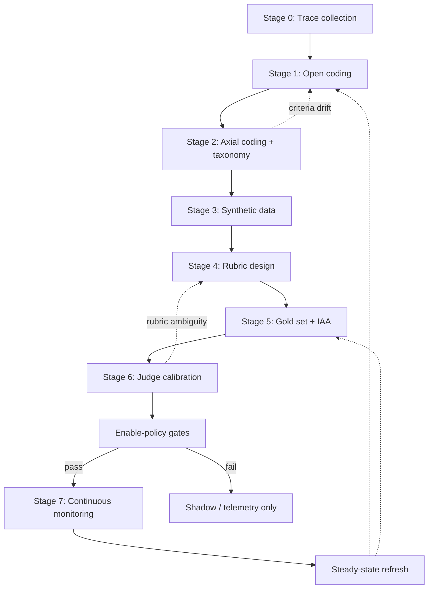
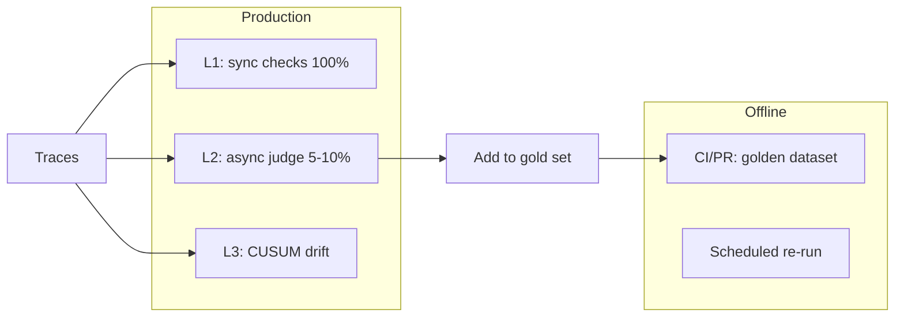

# LLM Eval Grounded-Theory Pipeline

Handbook for building a trustworthy LLM-as-judge from real traces: qualitative error analysis → taxonomy → rubric → gold set → calibration → production monitoring.

> **Docs mirror.** Canonical Cursor install: [`.cursor/skills/llm-eval-grounded-theory/`](../../../.cursor/skills/llm-eval-grounded-theory/). This folder versions the skill with the repo for PR review and discovery.

**Deep reference:** [reference.md](reference.md) — IAA tables, enable-policy template, bias catalog, bibliography.

**Worked example (this repo):** [examples-goaljudge.md](examples-goaljudge.md)

**Implementation plan:** [docs/plans/llm_eval_pipeline_skill.plan.md](../../plans/llm_eval_pipeline_skill.plan.md)

---

## When to use

Apply this skill when:

- Starting eval work on a new agent feature or product surface
- Designing a failure taxonomy, rubric, or golden dataset
- Calibrating an LLM judge before it gates outcomes
- Integrating offline regression + online monitoring

**Do not skip error analysis before writing judge prompts.** Practitioner consensus (R1–R3): error analysis is the most important step — more important than the judge itself.

---

## Cardinal rules

1. **Trace is ground truth; narration is a suspect claim.** Ground verdicts in observable tool outputs, state, and termination — not agent prose (R10).
2. **LLM proposes, human disposes.** Never delegate first-pass open coding to an LLM (R3).
3. **Three orthogonal axes:** agent behavior / environment confound / judge reliability. Never fold confounds into agent-failure counts.
4. **Criteria drift is structural.** Budget re-coding loops; freeze the test split each cycle (R4).
5. **Class-specific metrics, not accuracy.** Gate on precision/recall of the action-triggering class (R15, R19).
6. **Default-off until calibrated.** Shadow/telemetry first; action gates only after enable-policy clears.

---

## Pipeline overview



---

## Stage 0: Trace collection

**Goal:** Collect annotatable trajectories before any coding.

### Checklist

- [ ] Full trajectories: tool inputs + outputs + intermediate state + final answer (not final answer alone)
- [ ] Environment posture verified before coding (garbage-in guard — blocked tools, missing paths invalidate failure counts)
- [ ] Cheap trace viewer or export for domain experts (R3)
- [ ] Stable IDs on every run (`trace_id`, `user_id`, `task_id`) for join integrity
- [ ] Separate **coding sample** (~100 representative) from **gold-set sample** (stratified later)

### Artifacts

Flat table: `trace_id`, `task_input`, `final_answer`, evidence digest, empty `open_code_note`.

---

## Stage 1: Open coding

**Goal:** Inductive notes on traces before imposing categories.

### Checklist

- [ ] Domain expert reads ≥100 traces end-to-end
- [ ] Brief open-ended notes per trace (Langfuse `TEXT` scores work well — R13)
- [ ] **First-failure discipline:** code only the first deviation as primary (R2)
- [ ] Resist priors; seed codes are bootstrap only — let categories emerge (R12)
- [ ] Track saturation: stop when ~20 consecutive traces add no new code type (R2)
- [ ] Initial pass is human-only — no LLM first pass (R3)

### Optional assist (Stages 1–2)

- LLM-assisted codebook generation (R21) — human validates all codes
- Open-code diagnostics without ground truth: coverage, novelty, coherence (R22)

### Artifact template

| code | definition | first_seen_case | provenance |
|------|------------|-----------------|------------|
| | | | production / synthetic |

---

## Stage 2: Axial coding + failure taxonomy

**Goal:** Cluster open codes into testable failure categories; pick one mode for first rubric.

### Workflow

1. Cluster **agent-behavior codes only** into 5–6 named, **testable** categories
2. Export notes → LLM proposes clusters → human renames, rejects untestable buckets (R3, R12)
3. Split non-behavior codes: **confound** (environment) vs **judge-reliability** (verdict defect)
4. Build per-case axial matrix with first-failure discipline
5. Frequency tables on **environment-corrected** rows only
6. IAA on category assignment (see [reference.md](reference.md))
7. Pick **one** top failure mode (biggest + cleanest); gate before rubric work

### Gate before Stage 4

- [ ] Top mode selected with documented rationale
- [ ] IAA ≥ 0.80 on category assignment (or pre-declared threshold)
- [ ] Confounds documented and excluded from frequency ranking

### Optional assist

Ensemble-LM axial coding (R23): clustering + intrinsic metrics alongside human alignment.

---

## Stage 3: Synthetic data for scarce strata

**Goal:** Cover rare failure modes production traces won't supply.

### Principles (R3, R16)

- [ ] **Generate inputs, not outputs** — run through real system
- [ ] **Structured dimensions** (domain × feasibility × target behavior × stratum), not "give me test queries"
- [ ] **Hybrid:** live runs for elicitable modes; deterministic fixtures for rare/dangerous strata (CoT-gaming, premature-impossible)
- [ ] **Coverage verification:** record mismatches as data; do not re-roll until target code appears
- [ ] **Contamination firewall:** synthetic → dev split only; never held-out test

### Artifact template

Dimension spec (D1–Dn), prompt matrix, provenance tags (`live` / `synthetic`), coverage map per stratum.

Seed codes: see [reference.md](reference.md) — use as bootstrap only.

---

## Stage 4: Rubric design

**Goal:** Analytic, evidence-grounded criteria encoded as judge prompt + output schema.

### Principles

| Principle | Rationale |
|-----------|-----------|
| **Analytic** (criterion-by-criterion) | Prevents halo/conflation; per-criterion κ (R5) |
| **Evidence-grounded** | Observable span per criterion; anti-gaming (R10) |
| **Binary pass/fail** | Likert 3.2–3.8 clusters poorly; weak calibration signal (R15) |
| **Conservative binarization** | Partial/impossible → fail for action-gating; metadata separate |
| **Anchor examples** | Concrete pass/fail exemplars lock boundaries (R6) |
| **Co-construct with labels** | Validate against gold-set labels, not in vacuum (R4) |

### Ship posture

- **PROVISIONAL rubric** → shadow/telemetry immediately
- **Confirmation gate** → action stays off until Stage 6 clears enable-policy
- Split: **Code gate** (ship provisional prompt) vs **Confirmation gate** (scientific establishment)

### Artifact template

Rubric spec: criterion ↔ taxonomy category ↔ testable check ↔ expected verdict fields.

---

## Stage 5: Gold set creation

**Goal:** Stratified, double-labeled trust anchor for calibration.

### Contract

- [ ] **Size:** ~200–300 items (~250 for ~80% agreement at 95% CI — R19)
- [ ] **Stratification:** taxonomy defines strata; oversample action-trigger class
- [ ] **Split:** ~60/40 dev/test; **never tune on test**
- [ ] **Double-label + adjudicate;** α ≥ 0.80 on primary gate field (R7, R20)
- [ ] **Multi-axis schema:** gate field + graceful-failure/partial metadata + `failure_mode` + evidence spans
- [ ] **Provenance:** tag `production` vs `synthetic`; report production-only test metrics
- [ ] **Version:** `gold-v1`, `gold-v2` — label changes are production risk (R15)

### Three-tier rollout

1. Pilot (~50) — instrument validation
2. Confirmation — κ + behavioral shadow
3. Full gold set — calibration on frozen test

---

## Stage 6: LLM judge calibration

**Goal:** Validate judge against gold set; earn enable-policy clearance.

### Default path: prompt + rubric (not fine-tuning)

| Approach | When |
|----------|------|
| Prompt + few-shot calibration | Starting out; human corrections → exemplars (R24) |
| Fine-tuning / distillation | Only after prompt path plateaus; larger labeled set |

Target **75–90% judge–human alignment** on pilot before scaling (R15).

### Metrics to report

- [ ] Precision / recall / F1 on **action-triggering negative class**
- [ ] κ or α vs human labels (prerequisite before trusting P/R)
- [ ] ECE diagnostic only (R18)
- [ ] CoT-gaming red-team flip rate (R10)
- [ ] Per-`failure_mode` breakdown

### Enable-policy

Use [reference.md](reference.md) template. Example precision-first profile:

| Gate | Threshold |
|------|-----------|
| Precision on trigger class | ≥ 0.90 |
| False-action rate on clean successes | ≤ 2% |
| Recall on trigger class | ≥ 0.70 |
| Red-team flip rate | ≤ 5% |
| Judge–human κ | ≥ 0.6 |
| Posture | shadow/off until all met |

### Rollout

Shadow → dev eval enable → production enable. Never iterate prompt on test split.

---

## Stage 7: Continuous monitoring

**Goal:** Offline regression + online drift detection after gates clear.



### Operational loops

- [ ] Every production failure → candidate golden entry after human review
- [ ] Version datasets; treat label changes as production risk
- [ ] Quarterly gold refresh; alert if κ drops below floor
- [ ] **Per-category fail rates** — not single global threshold (R15)
- [ ] Criteria drift in prod → re-open-code (Stage 1)

Details: [reference.md](reference.md) monitoring stack.

---

## Master workflow checklist

Copy and track across the engagement:

```
Stage 0 — Traces
- [ ] Full trajectories exported with stable IDs
- [ ] Environment posture verified
- [ ] Trace viewer available to annotators

Stage 1 — Open coding
- [ ] ≥100 traces coded with open notes
- [ ] First-failure discipline applied
- [ ] Saturation log shows ~20 traces with no new codes

Stage 2 — Axial coding
- [ ] Agent-behavior taxonomy (5–6 testable categories)
- [ ] Confounds and judge errors split out
- [ ] Frequency table on corrected rows
- [ ] IAA on categories ≥ threshold
- [ ] Top mode selected for rubric

Stage 3 — Synthetic
- [ ] Dimension spec for scarce strata
- [ ] Coverage map complete
- [ ] Contamination firewall enforced (dev only)

Stage 4 — Rubric
- [ ] Analytic, evidence-grounded criteria in prompt
- [ ] Anchor examples included
- [ ] PROVISIONAL rubric in shadow mode

Stage 5 — Gold set
- [ ] ~250 stratified, double-labeled items
- [ ] α ≥ 0.80 on gate field
- [ ] Frozen test split hashed

Stage 6 — Calibration
- [ ] Class-specific P/R/F1 on trigger class
- [ ] Red-team flip rate measured
- [ ] All enable-policy gates pass on test split

Stage 7 — Monitoring
- [ ] CI golden regression wired
- [ ] Production sampling + drift alerts live
- [ ] Trace-to-dataset loop operational
```

---

## Anti-patterns

| ID | Anti-pattern | Fix |
|----|--------------|-----|
| AP-1 | Skip open coding; jump to judge prompt | Error analysis first (R1–R3) |
| AP-2 | Count environment blocks as agent failures | Three-axis split |
| AP-3 | Global accuracy as gate metric | Class-specific P/R on trigger class |
| AP-4 | Tune rubric on test split | Dev only; freeze test |
| AP-5 | Synthetic data in held-out test | Dev split only |
| AP-6 | Trust judge confidence / ECE for gating | κ/α + class P/R only |
| AP-7 | Always-pass judge in production | Shadow until gates clear |
| AP-8 | Holistic Likert rubric | Analytic binary criteria |
| AP-9 | Re-roll synthetic until code appears | Record mismatches; fix dimensions |
| AP-10 | Delegate first-pass open coding to LLM | Human first pass only |

---

## Testing pyramid (agentic systems)

When implementing in a layered codebase:

- **L1:** Pure schema validation of verdict + label types
- **L2:** Record/replay of eval capture; dataset CRUD; mock providers only
- **L3:** Mocked judge + offline red-team fixtures; rubric evals marked slow
- **L4:** Gate failure-mode matrix; rejection tests before acceptance

Never run live LLM calls in default CI. Live flip-rate diagnostics are opt-in only.

---

## Additional resources

- Metrics, IAA, enable-policy, bibliography: [reference.md](reference.md)
- GoalJudge worked example (this repo): [examples-goaljudge.md](examples-goaljudge.md)
