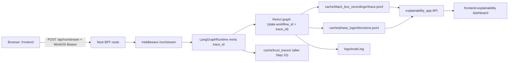

# End-to-End Explainability Tracing Plan (Revised)

## Scope

Live exercise of all four runtime surfaces with real WorkOS sign-in:

- Chat app: `[frontend/](frontend/)` on `http://localhost:3000`
- Dev middleware / LangGraph runtime: `[middleware/__main__.py](middleware/__main__.py)` on `http://localhost:8000`
- Explainability API: `[explainability_app/__main__.py](explainability_app/__main__.py)` on `http://localhost:8001`
- Explainability dashboard: `[frontend-explainability/](frontend-explainability/)` on `http://localhost:3001`

User selections that drive this plan:

- Cache and logs are NOT wiped; we keep prior artifacts.
- Optional `TrustTraceRecord` plane WILL be wired and verified.
- WorkOS auth is real (no bypass).

## Flow

## Step-Gated Runbook

Each step ends with a one-line evidence record `{step, command, observed_trace_id, artifact_path, status}` and a pause for confirmation before the next step.

### 1. Preflight

- List terminals folder to avoid duplicating running servers.
- Verify presence (no values printed) of: `OPENAI_API_KEY`, `AGENT_FACTS_SECRET`, `WORKOS_API_KEY`, `WORKOS_CLIENT_ID`, `WORKOS_COOKIE_PASSWORD`, `NEXT_PUBLIC_WORKOS_REDIRECT_URI`. Stop and report any missing key.
- Check ports 8000, 8001, 3000, 3001 are free.
- Confirm `pnpm` is installed and dependencies present in both `[frontend/](frontend/)` and `[frontend-explainability/](frontend-explainability/)` (otherwise schedule `pnpm install`).
- Confirm `uvicorn` is importable for `[explainability_app](explainability_app/__main__.py)`.
- Do NOT wipe `cache/` or `logs/`.

### 2. Read live `/run/stream` body shape

- Read `[middleware/__main__.py](middleware/__main__.py)` `run_stream` handler and `[agent_ui_adapter/adapters/runtime/langgraph_runtime.py](agent_ui_adapter/adapters/runtime/langgraph_runtime.py)` `run()` signature.
- Confirm exactly which input keys the BFF sends (`thread_id`, `input`, etc.) so the patch in Step 3 does not collide with `task_input` or messages already in state.

### 3. Patch trace correlation

- The "one-liner" from the guide is insufficient. Nodes in `[orchestration/react_loop.py](orchestration/react_loop.py)` read `workflow_id` from state, not from `configurable`. Patch must seed both planes.
- In `[agent_ui_adapter/adapters/runtime/langgraph_runtime.py](agent_ui_adapter/adapters/runtime/langgraph_runtime.py)` `LangGraphRuntime.run()`:
  - Mint `trace_id`, `run_id` as today.
  - Inject into the input dict passed to `astream_events`:
    - `workflow_id = trace_id`
    - `task_id = run_id`
    - `registered_agent_id = identity.agent_id`
  - Pass `configurable`:
    - `thread_id`, `trace_id`, `user_id = identity.owner`, `registered_agent_id = identity.agent_id`
- Do not change `[trust/models.py](trust/models.py)` (no AgentFacts re-signing).

### 4. Verify the patch

- Run: `pytest tests/architecture/ tests/middleware/ tests/services/test_explainability_service.py tests/orchestration/ -q`.
- Architecture tests MUST pass. Fix any new failures the patch introduced before proceeding.

### 5. Start middleware

- `python -m middleware` from repo root.
- Verify: `curl http://localhost:8000/healthz` returns dev profile payload.
- If the server auto-shifts off port 8000, stop; either set `PORT_STRICT=1` and free 8000 or set `MIDDLEWARE_URL` for the BFF.

### 6. CLI smoke run

- `python cli.py "What is the capital of France?"` to exercise the same graph + governance pipeline without the browser.
- Confirm a fresh workflow directory under `cache/black_box_recordings/` whose name equals the printed `workflow_id`.
- This de-risks the browser flow and pre-populates the dashboard.

### 7. Start the chat frontend

- `pnpm dev` in `[frontend/](frontend/)`.
- Browse `http://localhost:3000`; sign in via real WorkOS.
- Confirm the chat shell renders.

### 8. Send one live chat message

- Prompt: `What is the capital of France?`.
- In Chrome DevTools: Network -> filter `stream` -> open the request -> EventStream tab.
- Capture `raw_event.trace_id` from the first `RUN_STARTED` event.
- Confirm middleware terminal shows `stream_ended ... trace=<trace_id>` matching that value.
- One paid LLM call expected; abort if errors stack up.

### 9. Inspect backend artifacts

- `cache/black_box_recordings/<trace_id>/trace.jsonl` exists and is parseable JSONL.
- `cache/phase_logs/<trace_id>/decisions.jsonl` exists and shows routing + evaluation decisions.
- `logs/black_box.log`, `logs/phases.log`, `logs/guards.log`, `logs/prompts.log`, `logs/evals.log` reference the same `workflow_id`.
- Verify hash chain via `[services/governance/black_box.py](services/governance/black_box.py)` `BlackBoxRecorder.export(trace_id)["hash_chain_valid"]`.

### 10. Wire optional `TrustTraceRecord` plane

- In `[middleware/__main__.py](middleware/__main__.py)`, construct `TraceService(sinks=[JsonlFileTraceSink(cache_dir / "trust_traces")])` and pass `trace_emit=trace_service.emit` into `LangGraphRuntime(...)`.
- Restart middleware; resend a single prompt; capture new `trace_id`.
- Verify `cache/trust_traces/` contains the matching `TrustTraceRecord` for `run_started` and `run_finished`.

### 11. Start the explainability API

- `python -m explainability_app`.
- `curl http://localhost:8001/healthz` -> ok.
- `curl 'http://localhost:8001/api/v1/workflows'` -> includes the new workflow id.
- `curl http://localhost:8001/api/v1/workflows/<trace_id>/events` -> returns events.
- CORS is locked to `http://localhost:3001` (see `[explainability_app/server.py](explainability_app/server.py)`); browser calls from any other origin will fail.

### 12. Start the explainability dashboard

- `pnpm dev` in `[frontend-explainability/](frontend-explainability/)` (default port 3001).
- Validate:
  - `/` dashboard KPI + recent runs lists the workflow.
  - `/traces/<wf_id>` shows event detail.
  - `/decisions/<wf_id>` shows phase decisions.
  - `/compliance/<wf_id>` shows compliance bundle and integrity status.
  - `/agents`, `/guardrails` render data.
- Fallback: if no live workflow appears, run `[explainability_app/dev_seed.py](explainability_app/dev_seed.py)` to seed synthetic workflows and re-validate UI behavior, then explain the gap.

### 13. Final report and teardown

- Produce evidence table per step, correlation chain (browser SSE -> middleware log -> black-box dir -> phase log -> eval capture -> trust traces -> dashboard view), and any blockers.
- Teardown order: dashboard -> explainability API -> frontend -> middleware. If a port is stuck, capture `lsof -i:<port>` output before killing.

## Operating Rule

After switching to Agent mode, I will run exactly one step at a time, summarize the evidence, and ask before proceeding to the next step.

## Cost and Risk Notes

- Steps 6, 8, and 10 each make a real LLM call (~$0.0024 each per the walkthrough's example). Cap at one prompt per cycle.
- Step 3 changes runtime wiring; Step 4 must pass before Step 5.
- Wiping cache/logs is intentionally NOT done in this plan; existing workflow ids will remain visible in the dashboard.

