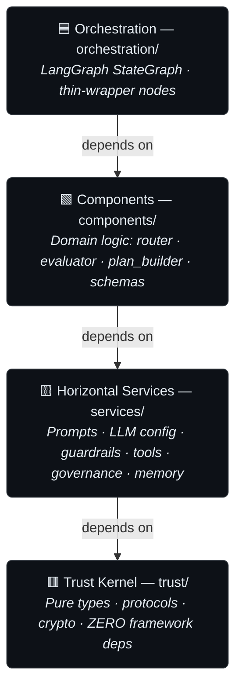

<div align="center">

# 🛡️ Trust-Native ReAct Agent Framework

**A trustworthy-by-construction AI agent: enforced architecture, a cryptographically-signed trust kernel, defense-in-depth guardrails, and a full governance audit trail — so you can always answer "why did the agent do that?"**

[](https://github.com/rajnishkhatri/AgentsFramework/actions/workflows/python-tests.yml)
[](#-testing--quality)
[](#-architecture)
[](#-quick-start)
[](#-architecture)
[](#reproducible-builds)

[Quick Start](#-quick-start) · [Why This Exists](#-why-this-exists) · [Mission & Soul](#-mission--soul) · [Features](#-features) · [Architecture](#-architecture) · [Governance & Explainability](#-governance--explainability) · [Presentations](#-presentations)

</div>

---

## 💡 Why This Exists

Most agent frameworks make you choose between shipping **fast** and shipping **safe**. They hand you a clever ReAct loop and leave trust, auditability, and security as exercises for the reader — which is exactly why so many agent projects can't survive a security review or a regulator's "explain this decision."

This framework bakes safety into the **architecture itself**:

- When a layer tries to violate a boundary, **the test suite fails the build** — trust isn't a guideline, it's enforced.
- Every authorization decision flows through a **dependency-free, cryptographically-signed trust kernel**.
- Three independent guardrail layers screen input, tool calls, and output.
- Every LLM call, routing decision, and guardrail verdict is recorded to a **replayable governance trail** with a read-only explainability dashboard.

So when a regulator, a security reviewer, or your own incident post-mortem asks *"why did the agent do that?"* — you have a signed, replayable, human-readable answer.

> **Who it's for:** teams building **defensible** AI for regulated or high-assurance environments (finance, healthcare, gov, enterprise) — not weekend prototypers who want a 50-line script.

### 🧭 Mission & Soul

The conviction behind the code: build the **trust layer for AI agents**, so the most consequential decisions — in finance, healthcare, and government — can be handed to software without handing over accountability.

Two short documents state the intent, and the repository is meant to be the proof:

- **[MISSION.md](MISSION.md)** — why this exists, why now, and the principles that don't change with the model, the market, or the round.
- **[SOUL.md](SOUL.md)** — the agent's stated identity and five values, each mapped to the mechanism that enforces it: honesty → the BlackBox audit trail; bounded authority → the signed trust kernel; clear sight → the guardrails and evidence-grounded goal-judge; focus → the test-enforced architecture; sharing → the open, auditable foundation.

The promise is *trust, then verify*: the documents state the values, and the running system makes them checkable in the code.

---

## ✨ Features

| | Capability | What it gives you |
|---|---|---|
| 🏛️ | **Test-enforced four-layer architecture** | Layer boundaries verified by a dedicated architecture test suite. A component importing the wrong layer **breaks CI** — your architecture can't silently rot. |
| 🔐 | **Cryptographically-signed trust kernel** | A pure, dependency-free kernel (`AgentFacts`, `Policy`, `Capability`, `AuditEntry`, `TrustTraceRecord`) where signed fields determine authorization and any change triggers re-signing. |
| 🛡️ | **Defense-in-depth security** | Three runtime layers: an LLM-as-judge **input guardrail** (prompt-injection rejection), deterministic **tool validators** (command allowlist + path sandboxing), and an **output guardrail** (PII / API-key / system-prompt-leak scanning). |
| 🧭 | **Dynamic model routing** | Deterministic heuristics route each task to the right model tier — fast/cheap models for guards and simple work, frontier models where it counts. Model names are never hardcoded. |
| 🧱 | **Tiered planning runtime** | A reasoning ladder over a **deterministic plan floor** that never depends on the LLM: T1 plan-with-replan, T2 reflexion re-entry, and T3 supervisor fan-out gated by an independence (GAIA) guard. Each tier is **shadow-first, default-OFF** — the prod graph stays byte-identical until a tier earns promotion. |
| 🗃️ | **Long-term memory layer** | Durable cross-session recall plus typed, debounced **auto-capture** behind a swappable backend (in-memory / SQLite / Mem0). Every read, write, and reject emits a `MEMORY_*` governance carrier; off by default and consolidated under per-type budgets. |
| ⚖️ | **Goal-judge evaluation science** | A **reference-free, evidence-grounded** judge that scores the *tool trajectory*, not the agent's narration — with measured human agreement (κ up to 1.0) and a runtime enable-policy that stays in **shadow until it passes its gates**. |
| 📜 | **Governance & audit subsystem** | Black-box recordings, phase logs, and a signed agent-facts registry (with a GCS-backed variant) capture a complete, replayable decision history. |
| 🔎 | **Explainability dashboard** | A read-only Next.js + FastAPI surface: Trace Explorer (Timeline / Cascade / Replay), Decision Audit, Guardrail Monitor, Agent Registry, Compliance Center, and a live log viewer. |
| 🧠 | **Offline meta-optimization** | A separate optimization layer (optimizer, drift detector, LLM-as-judge, self-contained code reviewer) tunes thresholds and prompts *offline* — humans write policy, the system tunes the numbers. |
| 📝 | **Prompts as code** | Every prompt is an externalized Jinja2 template, rendered through a single service — auditable, A/B-testable, and editable by non-engineers. No prompt strings buried in Python. |
| 🔭 | **Observability built-in** | **Langfuse** as the governance sink (an at-least-once black-box relay with a dead-letter queue), generic LangGraph/LangSmith tracing still available, per-concern structured JSON logs (`prompts`, `guards`, `evals`, `routing`…), and framework telemetry. |
| ☁️ | **Production infrastructure** | 18 Terraform files, 9 OPA/Rego policies, Docker / Cloud Run packaging, and an OpenAPI contract — this ships, it doesn't just demo. |
| 🔁 | **Reproducible by design** | Hash-pinned lockfile + a dedicated CI job that proves a cold, pinned install stays green. |

---

## 🏛️ Architecture

A strict **four-layer grid** where dependencies flow **downward only**. Each boundary is enforced by tests — not convention.



| Layer | Directory | Responsibility | Hard rule |
|---|---|---|---|
| **Trust Kernel** | `trust/` | Pure types, protocols, crypto | Imports only stdlib + Pydantic. No I/O, no logging, no network. |
| **Horizontal Services** | `services/` | Domain-agnostic infrastructure | Framework-agnostic; no knowledge of domain logic. |
| **Vertical Components** | `components/` | Framework-agnostic domain logic | May not import LangGraph/LangChain; no peer imports. |
| **Orchestration** | `orchestration/` | LangGraph topology + state | Thin wrappers only — all logic delegates downward. |

These invariants are mechanically verified in `tests/architecture/`. Break one and the build goes red. Full detail lives in [`AGENTS.md`](AGENTS.md) and `docs/Architectures/`.

---

## 🚀 Quick Start

**Prerequisites:** Python 3.13+ · an OpenAI key (or any LiteLLM-compatible provider) · *(optional)* Langfuse keys (or a LangSmith key) for tracing.

```bash
# 1. Install
cd agent
pip install -e ".[dev]"

# 2. Configure
cp .env.example .env        # then add your API keys

# 3. Run
python -m agent.cli "What is the capital of France?"
```

That's it — you're running a fully-guardrailed, fully-traced agent.

<details>
<summary><b>🐳 Run with Docker</b></summary>

```bash
cd agent
docker build -t react-agent .
docker run -e OPENAI_API_KEY=$OPENAI_API_KEY -e AGENT_FACTS_SECRET=change-me react-agent "What is 2+2?"
```
</details>

<details>
<summary><b>🔎 Launch the Explainability Dashboard</b></summary>

```bash
# Optional: seed local governance artifacts for a dense dashboard.
python -m explainability_app.dev_seed --seed 42 --count 5

# Run the read-only FastAPI backend + Next.js dashboard together.
make explainability
```

Backend → `127.0.0.1:8001` · Dashboard → `http://localhost:3001`.
Modules: Dashboard, Trace Explorer (Timeline / Cascade / Replay), Decision Audit, Guardrail Monitor, Agent Registry, Compliance Center, and a live-SSE Log Viewer.
</details>

---

## 🔐 Security Model — Defense in Depth

Three runtime layers, all required, all on by default:

1. **Input guardrail** — an LLM-as-judge (small, fast model) rejects prompt injection and system-prompt overrides.
2. **Tool validators** — deterministic Pydantic validators: a command allowlist for shell access, path sandboxing for file I/O.
3. **Output guardrail** — scans responses for PII, API-key, and system-prompt leakage (regex + LLM-based).

A dedicated prompt-injection classifier in the governance layer adds a fourth line of defense. Failure-path tests are written **before** acceptance tests for every gate — a guard that accepts everything is more dangerous than one that rejects everything.

---

## 📜 Governance & Explainability

Every decision the agent makes is captured and replayable:

- **Black-box recordings** (`cache/black_box_recordings/`) — full input/output capture per run.
- **Phase logs** (`cache/phase_logs/`) — structured trace of each reasoning phase.
- **Agent-facts registry** (`cache/agent_facts/`) — signed capability and policy records, with a GCS-backed variant for production.
- **Explainability dashboard** — turns all of the above into an auditable, human-readable UI for compliance and incident review.

This is the differentiator most agent frameworks lack entirely — and the reason this one is credible for **regulated and high-assurance adoption**.

---

## 🔭 Observability

- **Langfuse tracing** — the governance sink, fed by an at-least-once black-box relay (set `LANGFUSE_PUBLIC_KEY` / `LANGFUSE_SECRET_KEY` / `LANGFUSE_HOST`).
- **LangSmith tracing** — generic LangGraph path, still available via `LANGCHAIN_TRACING_V2=true`.
- **Per-concern structured logs** — `logs/prompts.log`, `logs/guards.log`, `logs/evals.log`, `logs/routing.log`, and more, each with its own handler.
- **Framework telemetry** — checkpoint/rollback counts and graph-level metrics.

---

## ✅ Testing & Quality

Quality here has teeth — **2,200+ tests** organized by architectural layer, with documented anti-patterns the suite actively guards against.

```bash
cd agent
pytest tests/ -q                          # full L1+L2 suite (mocked LLMs, no network)
pytest tests/architecture/ -q             # the boundary-enforcement gates
pytest tests/trust/ -q                    # the pure trust-kernel gates (<1s)
```

| Layer | Scope | Speed |
|---|---|---|
| **L1** `trust/` | Pure TDD, property-based (Hypothesis), exact assertions | < 1s, zero flake tolerance |
| **L2** `services/` | Contract-driven, mocked I/O, record/replay | seconds |
| **L3** `components/` | Deterministic (mocked LLM), trajectory & rubric evals | nightly |
| **L4** `orchestration/`, `meta/` | Trust-gate failure matrices, governance-loop simulations | on-demand |

CI **never** makes live LLM calls. The full philosophy and 11-pattern test catalog live in [`AGENTS.md`](AGENTS.md).

### Reproducible builds

A hash-pinned `requirements.lock` is the source of truth for reproducible installs, and a dedicated CI job proves a **cold, pinned install** yields a green suite — so "works on my machine" stops being a category of bug.

---

## 🗂️ Repository Structure

| Directory | Purpose |
|---|---|
| `trust/` | Shared kernel: pure types, protocols, crypto. Zero framework deps. |
| `services/` | Horizontal infrastructure: prompts, guardrails, LLM config, eval capture, observability, memory |
| `services/governance/` | Black box, phase logger, agent-facts registry, injection classifier |
| `services/tools/` | Tool registry + implementations (shell, file I/O) with deterministic validators |
| `components/` | Framework-agnostic domain logic: router, evaluator, plan builder, schemas |
| `orchestration/` | LangGraph graph topology and state |
| `meta/` | Offline meta-optimization: optimizer, analysis, judge, drift, code reviewer |
| `prompts/` | Jinja2 templates (`.j2`) — every prompt, externalized |
| `frontend/` | Next.js 15 + React 19 + CopilotKit + WorkOS + Zod + Tailwind agent UI |
| `explainability_app/` | Read-only FastAPI explainability backend |
| `infra/` | Terraform + OPA/Rego policies for cloud deployment |
| `docs/` | Architecture deep-dives, style guides, governance narratives |

---

## 🛠️ Tech Stack

**Agent runtime:** Python 3.13 · LangGraph · LiteLLM · Pydantic · Jinja2
**Frontend:** Next.js 15 · React 19 · CopilotKit · AG-UI · WorkOS · Zod · Tailwind v4 / shadcn
**Infra & quality:** Docker / Cloud Run · Terraform · OPA/Rego · OpenAPI · pytest · Hypothesis · Ruff

---

## 📽️ Presentations

Slide decks introducing the framework, viewable directly on GitHub as PDFs (PowerPoint sources alongside):

| Deck | Audience | What's inside |
|---|---|---|
| **[Framework Tour](presentations/AgentsFramework-Pitch-v4.pdf)** *(start here)* | Developers evaluating or learning from this repo | The six pillars — four-layer architecture, guardrail ML fine-tuning, goal-judge evaluation science, free SearXNG web search, policy-gated GCP deployment, and the 40+ recipes — plus a runtime section (the five-phase task journey, depth × tier planning, GAIA-guarded fan-out) and the latest tiered-planning and memory-layer work — each with verify-it-yourself commands. ([pptx](presentations/AgentsFramework-Pitch-v4.pptx)) · [v3](presentations/AgentsFramework-Pitch-v3.pdf) |
| **[Audit-Me Pitch](presentations/AgentsFramework-Pitch-v2.pdf)** | Technical leaders & skeptics | The same codebase argued QSCA-style: every claim falsifiable against the repo, including the failures left visible on purpose. ([pptx](presentations/AgentsFramework-Pitch-v2.pptx)) |
| **[Overview](presentations/AgentsFramework-Pitch.pdf)** | General / first contact | One-pass summary of architecture, quality discipline, security & governance, and the full stack. ([pptx](presentations/AgentsFramework-Pitch.pptx)) |

The decks were structured with the repo's own reasoning prompts ([SCQA](research/scqa_reframing_agent_prompt.md), [Pyramid Principle](research/pyramid_react_system_prompt.md)); the evidence base behind every figure is in [`presentations/pyramid-analysis-agentsframework.md`](presentations/pyramid-analysis-agentsframework.md).

---

## 🤝 Contributing

Contributions are welcome. Before opening a PR, read [`AGENTS.md`](AGENTS.md) — it documents the architecture invariants, design-pattern catalog, testing rules, and the anti-patterns the review process rejects. The short version:

- Run `pytest tests/ -q` after every change; **architecture tests must pass**.
- New prompts are `.j2` files rendered via `PromptService` — never hardcoded.
- Write the rejection test before the acceptance test for any gate or guard.
- Dependencies flow downward only.

---

## 📄 License

License terms to be finalized by the maintainer. Until a `LICENSE` file is added, treat this repository as **all rights reserved** and contact the maintainer before redistribution.

---

<div align="center">

**Built for teams who need AI they can defend.**

*Layer boundaries tests won't let you violate · a signed trust kernel · a replayable audit trail.*

</div>
