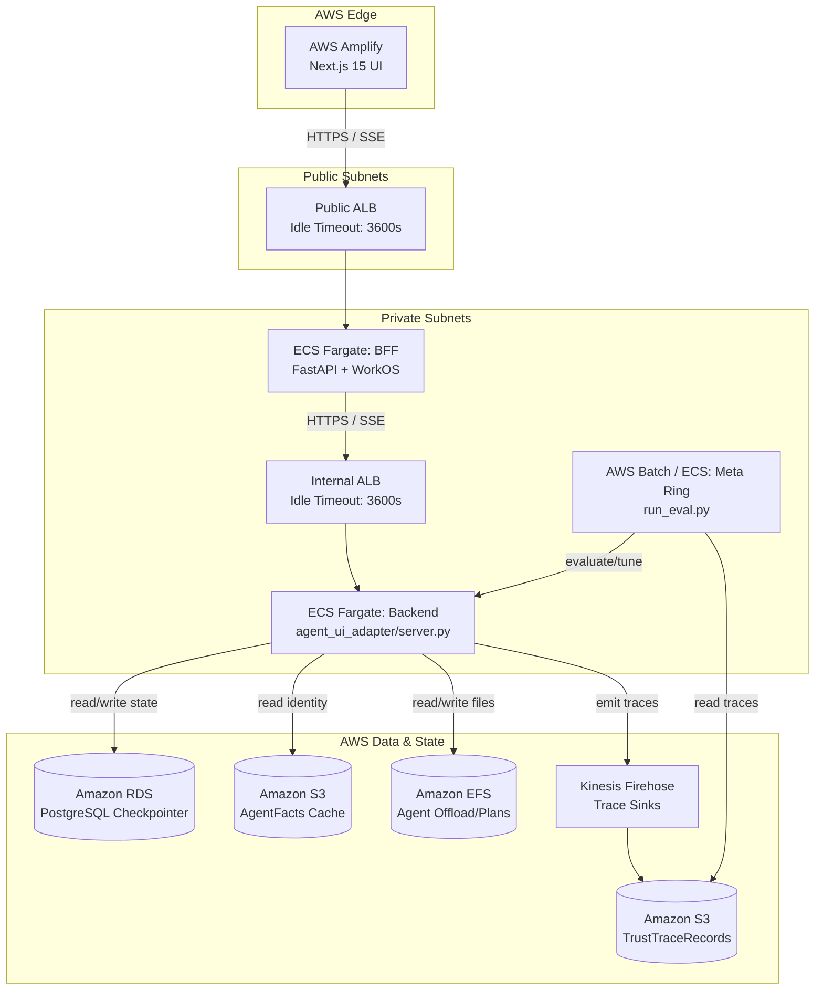

# AWS Deployment Architecture

**Scope:** Deployment topology, infrastructure mapping, and cloud-native service alignment for the LangGraph-based AgentsFramework ReAct agent on Amazon Web Services (AWS).

**Audience:** Cloud Architects, DevOps Engineers, and Backend Developers responsible for deploying and operating the multi-ring agent architecture in production.

**Related documents:**
- `docs/Architectures/BACKEND_SOLUTION_ARCHITECTURE.md` — Backend architecture, layer invariants, and current state cache/storage contracts.
- `docs/Architectures/AGENT_UI_ADAPTER_ARCHITECTURE.md` — Outer adapter ring overview.

---

## 1. Governing Thought

> The AWS deployment mirrors the logical boundaries of the **multi-ring agent architecture**. We map the Next.js Frontend Ring to edge-optimized hosting, the BFF and Backend Rings to elastic containerized compute with long-lived connection support (SSE), and stateful artifacts (checkpoints, immutable agent facts, trace logs) to managed AWS data stores (RDS, S3, Firehose) rather than local file systems.

### Situation, Complication, Question, Answer

- **Situation:** The local architecture relies on local SQLite checkpointers, JSONL file sinks, and local `.env` files to maintain agent state, trace governance, and API keys. The Next.js UI relies on Server-Sent Events (SSE) to stream real-time agent thoughts.
- **Complication:** Containerized deployments in AWS (e.g., ECS/Fargate) have ephemeral file systems. Standard API gateways (like AWS API Gateway) have hard 29-second timeouts, breaking long-running SSE streams. The offline Meta Ring must process massive amounts of trace data asynchronously without impacting the real-time agent loops.
- **Question:** How do we map the four-layer ReAct grid and its rings to AWS managed services to ensure high availability, security, and persistence without violating the architectural invariants?
- **Answer:** Deploy compute on **AWS Amplify** (Frontend) and **Amazon ECS with Fargate behind ALBs** (BFF and Backend). Swap SQLite for **Amazon RDS (PostgreSQL)**, local file logs for **Amazon S3 via Kinesis Data Firehose**, and local `.env` configurations for **AWS Secrets Manager**. 

---

## 2. Infrastructure Mapping

The current state of the backend heavily utilizes the local `cache/` and `logs/` directories. We must adapt these to AWS Native services.

| Local Concept | AWS Managed Service | Implementation Notes |
|---|---|---|
| `cache/checkpoints.db` (SQLite) | **Amazon RDS for PostgreSQL** / **Aurora Serverless v2** | The adapter ring's LangGraph checkpointer must swap from SQLite to the Postgres-based `AsyncPostgresSaver`. |
| `cache/black_box_recordings/*.jsonl` | **Amazon Kinesis Data Firehose** → **Amazon S3** | `services/trace_sinks/` needs an `s3_sink.py` or `kinesis_sink.py`. Firehose handles micro-batching streams of `TrustTraceRecord` events into S3. |
| `cache/agent_facts/*.json` | **Amazon S3** (Object Storage) | Immutable trust identity cards. S3 bucket policies restrict the Backend task role to `s3:GetObject` only. |
| `cache/.agent_offload/` & `cache/.agent_plans/` | **Amazon EFS** (Elastic File System) | EFS volumes mounted directly to the ECS Fargate tasks to mimic standard file paths for tool offloading. |
| `logs/*.log` | **Amazon CloudWatch Logs** | Handled natively by the ECS `awslogs` log driver routing standard output/error to CloudWatch. |
| `.env` variables | **AWS Secrets Manager** | Securely injected into Fargate task containers at startup. |

---

## 3. Compute and Networking Rings

To support the streaming nature of LangGraph agents (SSE), we utilize Application Load Balancers (ALBs) which support HTTP connection timeouts up to 4000 seconds.

### 3.1 Topologies

1. **Browser Ring (Frontend)**
   - **Service:** AWS Amplify Hosting.
   - **Role:** Hosts the Next.js 15 App Router application. Supports native edge caching, SSR, and streaming responses out of the box.
   
2. **Middleware Ring (BFF / FastAPI)**
   - **Service:** Amazon ECS (Fargate) + Public-Facing Application Load Balancer (ALB).
   - **Role:** Handles authentication (WorkOS), rate-limiting, and SDK telemetry (Langfuse, Mem0). Bridges the Amplify frontend to the internal agent infrastructure.

3. **Adapter & Four-Layer Backend Ring**
   - **Service:** Amazon ECS (Fargate) + Internal Application Load Balancer (ALB).
   - **Role:** Runs the `agent_ui_adapter/server.py` FastAPI app. Executes the LangGraph ReAct and Pyramid topologies.
   - **Scaling Strategy:** Autoscaling based on concurrent agent SSE connections or CPU/Memory utilization.

4. **Offline Meta Ring (Governance & Optimizer)**
   - **Service:** AWS EventBridge Scheduler + AWS Batch / ECS Tasks.
   - **Role:** Runs `meta/run_eval.py`, judges, and drift detection.
   - **Execution:** EventBridge triggers Batch/ECS jobs on a cron schedule (e.g., nightly) to pull from the S3 Trust Traces bucket, run eval over traces, and write metrics back.

---

## 4. Architecture Diagram

---

## 5. Security & Defense in Depth on AWS

The backend's defense-in-depth model aligns with AWS IAM (Identity and Access Management) primitives.

1. **Least Privilege Task Roles:**
   - The **Backend ECS Task Role** is strictly scoped:
     - `s3:GetObject` on the Agent Facts bucket.
     - `firehose:PutRecord` on the trace delivery stream.
     - `secretsmanager:GetSecretValue` for `OPENAI_API_KEY` and `AGENT_FACTS_SECRET`.
   - The **Meta ECS Task Role** is scoped:
     - `s3:GetObject` on the Trace bucket to run offline evaluations.
2. **VPC Isolation:**
   - The Backend Ring and Data Tier reside in Private Subnets. They are inaccessible from the public internet. The BFF acts as the sole authorized ingress proxy.
3. **No API Gateway for SSE:**
   - API Gateway imposes a strict 29s timeout which breaks LangGraph SSE streams. ALBs are used exclusively for inter-ring transport.

---

## 6. Required Code Refactoring for AWS Readiness

To transition from local execution to AWS, the following adapters and ports must be built. These additions adhere strictly to the Four-Layer Architecture rules.

1. **Postgres Checkpointer Adapter:**
   - Add `agent_ui_adapter/adapters/runtime/postgres_saver.py`.
   - Modifies the composition root (`server.py`) to inject the `AsyncPostgresSaver` into the `LangGraphRuntime` when `AWS_EXECUTION_ENV` is present.
2. **S3 / Kinesis Trace Sink:**
   - Add `services/trace_sinks/kinesis_sink.py` implementing the trace emission interface.
   - Binds to `boto3` to stream `TrustTraceRecord` dicts to Firehose.
3. **Agent Facts S3 Registry:**
   - Update or extend `services/governance/agent_facts_registry.py` to support `s3://` URIs, fetching signed JSON blobs using `boto3`.
4. **Cloud Providers Migration:**
   - Complete Gap **G-4** by migrating `utils/cloud_providers/aws_identity.py` to `services/cloud_providers/aws_identity.py` for IAM-to-AgentFacts identity mapping.
