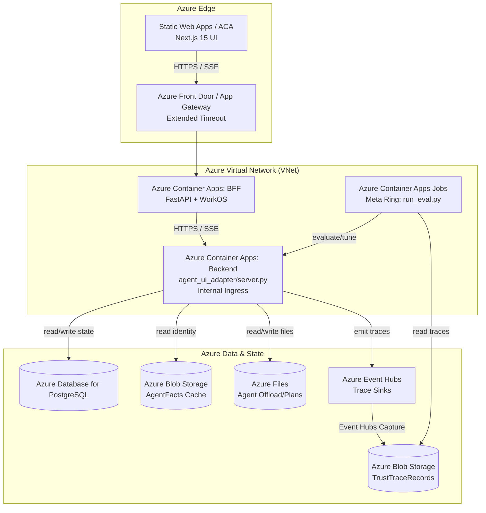

# Azure Deployment Architecture

**Scope:** Deployment topology, infrastructure mapping, and cloud-native service alignment for the LangGraph-based AgentsFramework ReAct agent on Microsoft Azure.

**Audience:** Cloud Architects, DevOps Engineers, and Backend Developers responsible for deploying and operating the multi-ring agent architecture in production.

**Related documents:**
- `docs/Architectures/BACKEND_SOLUTION_ARCHITECTURE.md` — Backend architecture, layer invariants, and current state cache/storage contracts.
- `docs/Architectures/AGENT_UI_ADAPTER_ARCHITECTURE.md` — Outer adapter ring overview.
- `docs/Architectures/AWS_DEPLOYMENT_ARCHITECTURE.md` — AWS Deployment Architecture equivalent.

---

## 1. Governing Thought

> The Azure deployment mirrors the logical boundaries of the **multi-ring agent architecture**. We map the Next.js Frontend Ring to edge-optimized serverless hosting, the BFF and Backend Rings to elastic containerized compute with long-lived connection support (SSE), and stateful artifacts (checkpoints, immutable agent facts, trace logs) to managed Azure data stores (Azure Database for PostgreSQL, Azure Blob Storage, Event Hubs) rather than local file systems.

### Situation, Complication, Question, Answer

- **Situation:** The local architecture relies on local SQLite checkpointers, JSONL file sinks, and local `.env` files to maintain agent state, trace governance, and API keys. The Next.js UI relies on Server-Sent Events (SSE) to stream real-time agent thoughts.
- **Complication:** Containerized deployments in Azure (e.g., Azure Container Apps) have ephemeral file systems. Standard API gateways (like Azure API Management) may impose strict timeouts, breaking long-running SSE streams. The offline Meta Ring must process massive amounts of trace data asynchronously without impacting the real-time agent loops.
- **Question:** How do we map the four-layer ReAct grid and its rings to Azure managed services to ensure high availability, security, and persistence without violating the architectural invariants?
- **Answer:** Deploy compute on **Azure Static Web Apps** or **Azure Container Apps** (Frontend, BFF, and Backend). Swap SQLite for **Azure Database for PostgreSQL**, local file logs for **Azure Blob Storage via Event Hubs Capture**, and local `.env` configurations for **Azure Key Vault**.

---

## 2. Infrastructure Mapping

The current state of the backend heavily utilizes the local `cache/` and `logs/` directories. We must adapt these to Azure Native services.

| Local Concept | Azure Managed Service | Implementation Notes |
|---|---|---|
| `cache/checkpoints.db` (SQLite) | **Azure Database for PostgreSQL (Flexible Server)** | The adapter ring's LangGraph checkpointer must swap from SQLite to the Postgres-based `AsyncPostgresSaver`. |
| `cache/black_box_recordings/*.jsonl` | **Azure Event Hubs** → **Azure Blob Storage** | `services/trace_sinks/` needs an `eventhubs_sink.py`. Event Hubs Capture handles micro-batching streams of `TrustTraceRecord` events into Blob Storage. |
| `cache/agent_facts/*.json` | **Azure Blob Storage** | Immutable trust identity cards. Azure RBAC roles restrict the Backend managed identity to `Storage Blob Data Reader` only. |
| `cache/.agent_offload/` & `cache/.agent_plans/` | **Azure Files (NFS/SMB)** | Azure Files shares mounted directly to Azure Container Apps to mimic standard file paths for tool offloading. |
| `logs/*.log` | **Azure Log Analytics** (Azure Monitor) | Handled natively by Azure Container Apps routing standard output/error to Log Analytics Workspaces. |
| `.env` variables | **Azure Key Vault** | Securely referenced as Key Vault secrets and exposed as environment variables in Azure Container Apps at startup. |

---

## 3. Compute and Networking Rings

To support the streaming nature of LangGraph agents (SSE), we utilize Azure Application Gateway or Azure Front Door, configured to support long-lived HTTP connections for SSE.

### 3.1 Topologies

1. **Browser Ring (Frontend)**
   - **Service:** Azure Static Web Apps (with Next.js support) or Azure Container Apps.
   - **Role:** Hosts the Next.js 15 App Router application. Supports native edge caching, SSR, and streaming responses out of the box.

2. **Middleware Ring (BFF / FastAPI)**
   - **Service:** Azure Container Apps + Azure Front Door or Application Gateway.
   - **Role:** Handles authentication (WorkOS), rate-limiting, and SDK telemetry (Langfuse, Mem0). Bridges the frontend to the internal agent infrastructure. Timeout settings are optimized for long-running SSE.

3. **Adapter & Four-Layer Backend Ring**
   - **Service:** Azure Container Apps (Internal VNet Integration).
   - **Role:** Runs the `agent_ui_adapter/server.py` FastAPI app. Executes the LangGraph ReAct and Pyramid topologies.
   - **Scaling Strategy:** Autoscaling (KEDA) based on concurrent agent HTTP requests, SSE connections, or CPU/Memory utilization.

4. **Offline Meta Ring (Governance & Optimizer)**
   - **Service:** Azure Container Apps Jobs.
   - **Role:** Runs `meta/run_eval.py`, judges, and drift detection.
   - **Execution:** Triggered on a cron schedule (e.g., nightly) to pull from the Blob Storage Trust Traces container, run eval over traces, and write metrics back.

---

## 4. Architecture Diagram

---

## 5. Security & Defense in Depth on Azure

The backend's defense-in-depth model aligns with Azure Managed Identities and Role-Based Access Control (RBAC).

1. **Least Privilege Managed Identities:**
   - The **Backend ACA Managed Identity** is strictly scoped:
     - `Storage Blob Data Reader` on the Agent Facts storage account.
     - `Azure Event Hubs Data Sender` on the trace delivery namespace.
     - `Key Vault Secrets User` for `OPENAI_API_KEY` and `AGENT_FACTS_SECRET`.
   - The **Meta ACA Job Managed Identity** is scoped:
     - `Storage Blob Data Reader` on the Trace storage account to run offline evaluations.
2. **VNet Isolation:**
   - The Backend Ring and Data Tier reside in a Virtual Network (VNet). Azure Container Apps for the Backend is configured with an **Internal Environment**, making it inaccessible from the public internet. The BFF acts as the sole authorized ingress proxy.
3. **Timeout Configuration:**
   - Default idle timeouts are extended on Azure Front Door or Application Gateway to support long-running LangGraph SSE streams.

---

## 6. Required Code Refactoring for Azure Readiness

To transition from local execution to Azure, the following adapters and ports must be built. These additions adhere strictly to the Four-Layer Architecture rules.

1. **Postgres Checkpointer Adapter:**
   - Ensure `agent_ui_adapter/adapters/runtime/postgres_saver.py` exists and is injected into the `LangGraphRuntime` when `AZURE_EXECUTION_ENV` is present.
2. **Event Hubs / Blob Trace Sink:**
   - Add `services/trace_sinks/eventhubs_sink.py` implementing the trace emission interface.
   - Binds to `azure-eventhub` to stream `TrustTraceRecord` dicts to an Event Hub.
3. **Agent Facts Blob Registry:**
   - Update or extend `services/governance/agent_facts_registry.py` to support Azure Blob Storage (`abfs://` or `https://...blob.core.windows.net`), fetching signed JSON blobs using `azure-storage-blob` or `DefaultAzureCredential`.
4. **Cloud Providers Migration:**
   - Add Azure identity mapping alongside AWS and GCP. Create `services/cloud_providers/azure_identity.py` for Azure Managed Identity to AgentFacts mapping.
