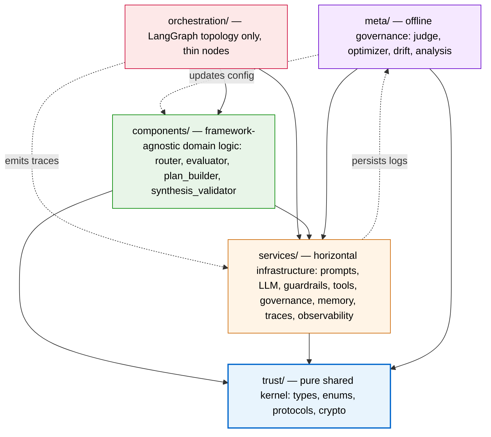
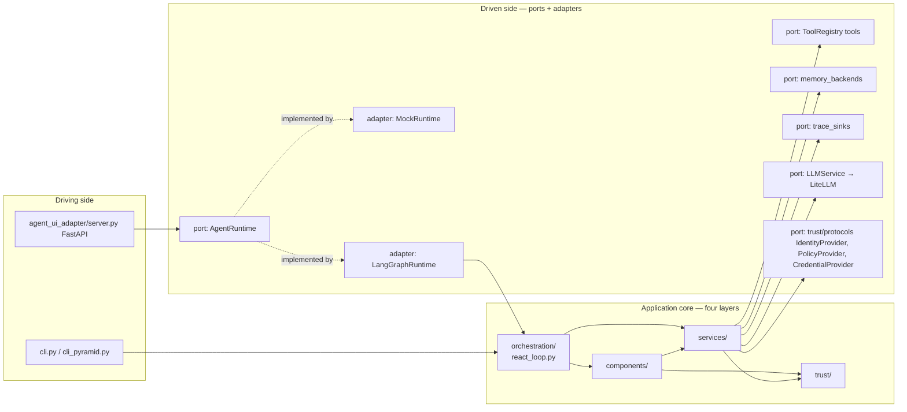
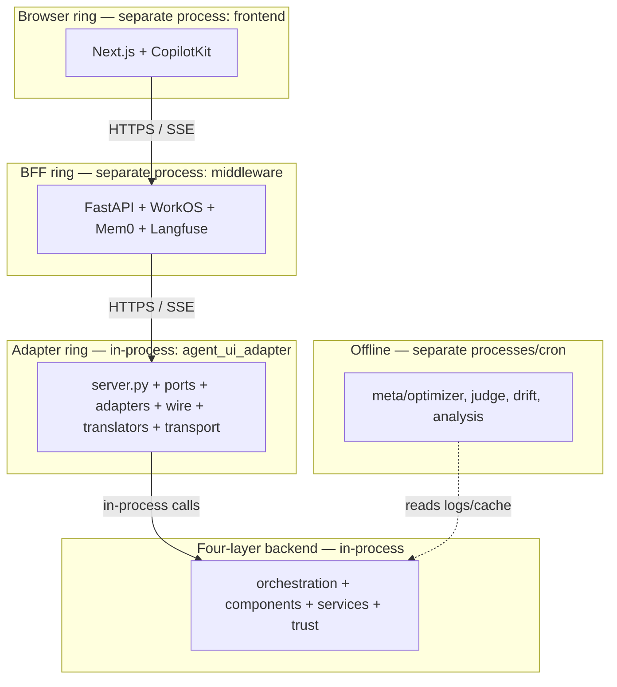
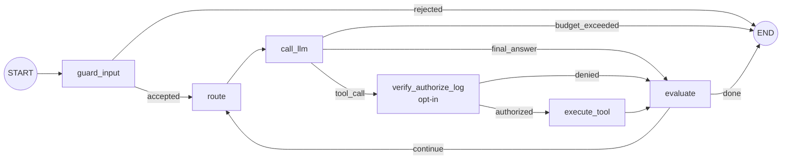
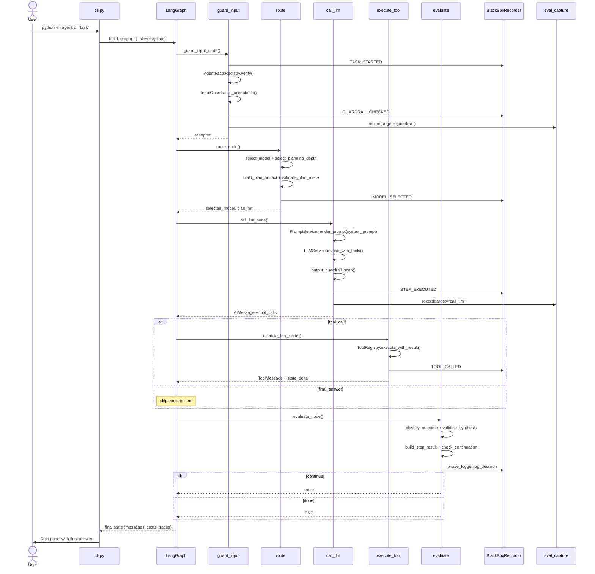
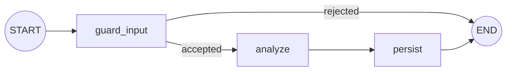
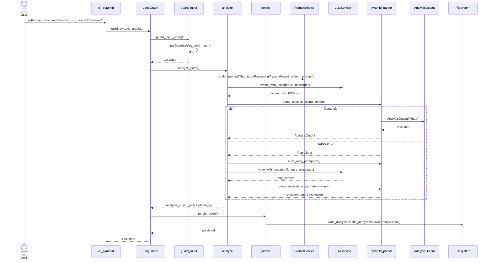
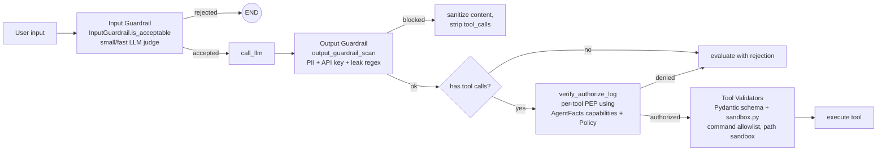
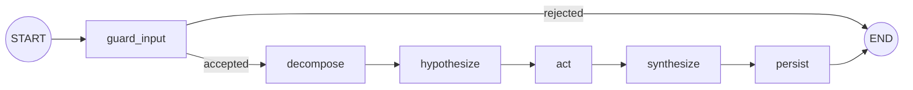

# Backend Solution Architecture

**Scope:** The Python backend of the AgentsFramework workspace — `trust/`, `services/`, `components/`, `orchestration/`, `meta/`, the `StructuredReasoning/` mini-stack, and the `agent_ui_adapter/` outer ring.

**Audience:** Architects and reviewers gating PRs against layer rules; external readers using this as an onboarding or design-review reference.

**Related documents (deep dives this index links to):**

- `docs/Architectures/FOUR_LAYER_ARCHITECTURE.md` — the foundational four-layer spec, signed/unsigned fields, dual state machine contract, governance feedback loops.
- `docs/Architectures/AGENT_UI_ADAPTER_ARCHITECTURE.md` — outer adapter ring overview.
- `docs/Architectures/AGENT_UI_ADAPTER_ADAPTERS_DEEP_DIVE.md` — exhaustive `adapters/` spec.
- `docs/Architectures/DEEP_AGENT_SCQA_IMPLEMENTATION_GUIDE.md` — SCQA reframing for deep-agent capability rollout.
- `docs/style-guides/STYLE_GUIDE_LAYERING.md` — composable layering style guide (three-layer base extended by this doc).
- `docs/style-guides/STYLE_GUIDE_PATTERNS.md` — design patterns catalog (H1–H7, V1–V6).
- `docs/Architectures/TRUST_FRAMEWORK_ARCHITECTURE.md` — seven-layer trust framework.
- `docs/Architectures/BACKEND_PR_CHECKLISTS.md` — the paste-into-PR review checklists referenced from §9.

---

## 0. Reading guide

| If you are… | Read… | Skip… |
|---|---|---|
| A **reviewer** gating a PR | §2 (invariants), §6 (enforcement), §7 (gap analysis), §9 (link to PR checklists doc) | §1, §3, §5 (already familiar) |
| An **external reader** onboarding or doing a design review | §1 (governing thought), §3 (system identity), §4 (current state), §5 (cross-cutting) | §6, §7, §9 (mechanical) |
| A **maintainer** placing a new module | all sections, in order |  — |
| A **strategist** planning the next sprint | §7 (gap analysis), §8 (target state) | §4 (mechanical) |

---

## 1. Governing thought

> The agent backend is a **four-layer architecture with a pure trust kernel at the core, a single hexagonal adapter ring at the outside, and an event-driven governance feedback loop in between** — designed so that orchestration topology, domain logic, infrastructure, and trust types each have exactly **one valid home**, and dependency direction is enforced by **tests rather than convention**.

### Situation, Complication, Question, Answer

- **Situation.** A LangGraph ReAct agent needs to combine identity and authorization, dynamic model routing, prompt rendering, defense-in-depth guardrails, tool dispatch, evaluation capture, and offline meta-optimization — and then expose all of it through SSE to a browser front end.
- **Complication.** Naively wiring those concerns produces a graph where everything imports everything else: framework SDKs leak into domain logic, prompt strings drift across modules, governance code circularly depends on orchestration, and any change to the trust schema cascades unpredictably.
- **Question.** Where does each new concern (a new tool, a new guardrail, a new identity field, a new model tier, a new adapter to a different SSE protocol) belong, and how can that placement be **mechanically verified** in CI?
- **Answer.** A four-layer grid with a pure trust kernel at the bottom, an outer adapter ring that touches the SDK boundary in exactly one place, and a meta-layer that reads logs (never the graph). Dependencies flow one direction only. Ten architecture tests enforce the directional rules. Patterns H1–H7 / V1–V6 (in `docs/style-guides/STYLE_GUIDE_PATTERNS.md`) govern style within each layer. Trust types are signed, governance feedback flows through `TrustTraceRecord` events, and abstractions (event bus, protocols) are introduced only when the second consumer arrives.

---

## 2. Architectural invariants

The load-bearing rules of the backend. Each invariant has an enforcement mechanism. Invariants without a current test are flagged as **gaps** and tracked in §7.

| # | Invariant | Enforcing test (or proposed) | Status |
|---|---|---|---|
| **I-1** | Dependencies flow downward only: orchestration → components → services → trust. Meta-layer is horizontal to orchestration, never below it. | `tests/architecture/test_dependency_rules.py::TestDependencyRules` | ✅ enforced |
| **I-2** | `trust/` imports only stdlib + Pydantic. No I/O, no logging, no network, no framework imports. | `test_dependency_rules.py::test_trust_does_not_import_utils` and `test_trust_does_not_import_agents` | ✅ enforced |
| **I-3** | `components/` must not import `langgraph`, `langchain`, `langchain_core`, or `langchain_community`. | `test_components_no_framework_imports` | ✅ enforced |
| **I-4** | `services/` must not import framework packages **except** `services/llm_config.py` (the documented carve-out wrapping `ChatLiteLLM`). | `test_services_no_framework_imports_except_llm_config` | ✅ enforced |
| **I-5** | `services/` must not import from `components/` (no reverse coupling). | `test_services_does_not_import_components` | ✅ enforced |
| **I-6** | `meta/` must not import from `orchestration/` (meta reads logs/config, never calls the graph). | `test_meta_does_not_import_orchestration` | ✅ enforced |
| **I-7** | Orchestration nodes are thin wrappers — all logic delegates to `components/` and `services/`. | _(proposed test — see G-1)_ | ⚠ gap |
| **I-8** | The inner `StructuredReasoning/` mini-stack respects the same per-layer rules as the outer grid. | `test_structured_reasoning_layers.py` | ✅ enforced |
| **I-9** | `agent_ui_adapter/` imports only from `agent_ui_adapter/ports/`, `agent_ui_adapter/wire/`, and `trust/`. Third-party SDKs (LangGraph) appear **only** inside `agent_ui_adapter/adapters/runtime/`. | `test_agent_ui_adapter_layer.py` | ✅ enforced |
| **I-10** | `middleware/` SDK imports (WorkOS, Mem0, Langfuse) are confined to `middleware/adapters/`. | `test_middleware_layer.py` | ✅ enforced |
| **I-11** | Every LLM invocation routes through `services.eval_capture.record()` with `user_id` and `task_id`. | _(proposed test — see G-2)_ | ⚠ gap |
| **I-12** | Every prompt is a `.j2` file in `prompts/` rendered via `PromptService.render_prompt()` — no hardcoded prompt strings in code. | _(proposed test — see G-3)_ | ⚠ gap |
| **I-13** | The shared utility `utils.code_analysis.check_dependency_rules` and the architecture test harness agree, file-for-file. | `test_dependency_rules.py::TestSharedUtilityParity` | ✅ enforced |
| **I-14** | Trust kernel types added under `trust/` are frozen (`ConfigDict(frozen=True)`) when they participate in signing or audit attribution. | _(enforced by convention; see G-11)_ | ⚠ gap |

The five Critical Anti-Patterns (AP-1 through AP-5) and four Testing Anti-Patterns (TAP-1 through TAP-4) from `AGENTS.md` are the inverse statements of these invariants. They are restated in §6.3.

---

## 3. System identity

The backend has three complementary views. They describe the same code; each one foregrounds a different property.

### 3.1 Layered onion view — "where does each concern live?"



### 3.2 Hexagonal view — "where does the system touch the outside world?"



The system has one driving-side composition root per process (`cli.py`, `cli_pyramid.py`, `agent_ui_adapter/server.py`) and several driven ports — most of which are realized inside `services/` as Pydantic-validated executor functions plus a `Registry` lookup.

### 3.3 Concentric rings — "what crosses a process boundary?"



Only the **adapter ring → four-layer backend** edge is in-process. Browser → BFF → adapter ring are HTTPS/SSE process boundaries. Meta is asynchronous: it never calls the graph, it reads what the graph wrote.

---

## 4. Current state — as built

Each subsection follows a fixed template: membership criteria → module table → sequence diagram → reference points.

### 4.1 Trust foundation (`trust/`)

**Membership criteria.** A type belongs in `trust/` only if all four hold:

1. **Pure.** No I/O, no storage, no network, no logging.
2. **Shared.** Consumed by ≥ 2 layers above (services + components, or services + meta, etc.).
3. **Stable.** Changes less frequently than its consumers; changes to signed fields trigger re-signing.
4. **Dependency-free.** Zero imports from `services/`, `components/`, `orchestration/`, `meta/`.

**What lives here today** (re-exported from `trust/__init__.py`):

| Module | Public surface | Role |
|---|---|---|
| `trust/models.py` | `AgentFacts`, `Capability`, `Policy`, `AuditEntry`, `VerificationReport`, `CloudBinding`, `PolicyDecision`, `TrustTraceRecord`, `TraceLayer`, `TraceOutcome` | Pydantic data models; `frozen=True` for immutable identity. |
| `trust/enums.py` | `IdentityStatus`, `LifecycleState`, `CertificationStatus`, `EventCategory` | State machines and routing categories. |
| `trust/protocols.py` | `IdentityProvider`, `PolicyProvider`, `CredentialProvider` | `typing.Protocol` hexagonal ports. |
| `trust/signature.py` | `compute_signature()`, `verify_signature()` | Deterministic HMAC over the signed-field set. |
| `trust/cloud_identity.py` | `AccessDecision`, `IdentityContext`, `PermissionBoundary`, `PolicyBinding`, `TemporaryCredentials`, `VerificationResult` | Cloud-IAM-mapping value objects. |
| `trust/exceptions.py` | `TrustProviderError`, `AuthenticationError`, `AuthorizationError`, `ConfigurationError`, `CredentialError` | Domain-categorized exception hierarchy. |
| `trust/review_schema.py` | `ReviewReport`, `ReviewFinding`, `Certificate`, `DimensionResult`, `DimensionStatus`, `Severity`, `Verdict` | Code-reviewer output schema (shared kernel because both the reviewer and the meta-layer judge consume it). |

**Test reference.** `tests/trust/` (10 files): schema validation (valid + invalid), enum completeness, signature round-trip, protocol conformance, state-machine invariants, backward compatibility.

**Anchored reference points.**

- Identity card: `trust/models.py:37-56` (`AgentFacts`).
- Signed-vs-unsigned classification: `docs/Architectures/FOUR_LAYER_ARCHITECTURE.md §Signed vs Unsigned`.
- Dual state machine: `docs/Architectures/FOUR_LAYER_ARCHITECTURE.md §Dual State Machine Contract`.

### 4.2 Horizontal services (`services/`)

**Membership criteria.** A service belongs here if its API is **domain-agnostic** — it could be reused by a code-reviewer agent, a Pyramid agent, or a sprint-planning agent without modification. Each service owns its own log handler (Pattern H4) and a single responsibility (Pattern H6).

**What lives here today.**

| Module | Role |
|---|---|
| `services/prompt_service.py` | Jinja2 renderer (Pattern H1). Single entry point for all prompt strings. |
| `services/llm_config.py` | LiteLLM wrapper, `LLMService.invoke_with_tools()`, `default_fast_profile()`, model-tier lookup (Pattern H2). The **only** service permitted to import `langchain_litellm`. |
| `services/guardrails.py` | `InputGuardrail` (LLM-as-judge, accept-condition pattern H3), `output_guardrail_scan()` (PII + API-key + system-prompt-leak regex/LLM scan). |
| `services/eval_capture.py` | `eval_capture.record()` — every LLM call lands here with `user_id`, `task_id`, `target` tag (Pattern H5). |
| `services/observability.py` | `setup_logging()`, `FrameworkTelemetry`, `InstrumentedCheckpointer` (STORY-412). |
| `services/summarizer.py` | `should_compact_trajectory()` + `build_compaction_summary()` (Sprint 4 reflection/compaction). |
| `services/long_term_memory.py` + `services/memory_backends/{in_memory,sqlite}.py` | Pluggable memory port + two adapters. |
| `services/authorization_service.py` | PolicyDecision-producing PEP used by `verify_authorize_log_node`. |
| `services/trace_service.py` + `services/trace_sinks/jsonl_sink.py` | `TrustTraceRecord` emission + JSONL sink. |
| `services/explainability_service.py` | Read-only API consumed by `explainability_app/` and `governanaceTriangle/` narratives. |
| `services/base_config.py` | `AgentConfig`, `ModelProfile`. |
| `services/governance/black_box.py` | `BlackBoxRecorder` — append-only trace events with `EventType` taxonomy. |
| `services/governance/phase_logger.py` | `PhaseLogger`, `Decision`, `WorkflowPhase`. |
| `services/governance/agent_facts_registry.py` | `AgentFactsRegistry` (load/store/verify/sign `AgentFacts`). |
| `services/governance/guardrail_validator.py` | `GuardRailValidator`, `pii_rules()`, `api_key_rules()`. |
| `services/tools/registry.py` | `ToolRegistry`, `ToolDefinition`, `ToolExecutionResult`. |
| `services/tools/{shell,file_io,file_tools,todo_tools,task_tool,delegation_dispatcher,hitl,sandbox,web_search,think_tool}.py` | Concrete tool executors with Pydantic input schemas. `sandbox.py` enforces command allowlist + path sandboxing. |

**Test reference.** `tests/services/` (21 files): registry CRUD, authorization decision matrix, credential TTL with `freezegun`, policy backend contracts, record/replay fixtures.

### 4.3 Vertical components (`components/`)

**Membership criteria.** Domain logic that is **framework-agnostic** — pure functions and Pydantic models that decide what the agent should do next. Components import only from `services/` and `trust/`. **No peer imports between components** (router cannot import evaluator).

**What lives here today** (`components/__init__.py`):

| Module | Role | Pattern |
|---|---|---|
| `components/router.py` | `select_model()`, `select_planning_depth()` — deterministic heuristics + advisory `.j2` policy doc. | V2 |
| `components/routing_config.py` | Numeric thresholds tuned by meta-optimizer. | — |
| `components/evaluator.py` | `classify_outcome()`, `build_step_result()`, `check_continuation()`, `parse_llm_response()`. | — |
| `components/plan_builder.py` | `build_planning_instructions()`, `build_plan_artifact()`, `validate_plan_mece()`. | — |
| `components/synthesis_validator.py` | `validate_synthesis()` — gate that prevents premature final answers. | V6 |
| `components/schemas.py` | `ErrorRecord`, `EvalRecord`, `StepResult`, `TaskResult`. | V6 |
| `components/sprint_schemas.py` | `SprintPlan`, `SprintTheme`, `Story`, `GapItem`, `SprintGaps`, `ValidationCheckResult`. | V6 |

**Test reference.** `tests/components/` (7 files): deterministic behavior with mocked LLM, trajectory evals, rubric evals.

### 4.4 Orchestration — ReAct loop (`orchestration/`)

**Membership criteria.** **Topology only.** Each node is a thin wrapper (≤ 15 lines is the documented target — currently a gap, see G-1) that delegates to `components/` and `services/`. The orchestration layer is the only place that imports `langgraph` and `langchain_core`.

**What lives here today.**

| File | Role |
|---|---|
| `orchestration/state.py` | `AgentState` TypedDict (extends `MessagesState`), `TodoItem`, reducers (`_append_list`, `_append_list_by_record_id`, `_merge_dict`). |
| `orchestration/react_loop.py` | `build_graph(...)` — the canonical ReAct StateGraph. |

**State contract** (`orchestration/state.py:50-98`). Fields are grouped by concern:

- **Task**: `task_id`, `task_input`.
- **Routing**: `selected_model`, `routing_reason`, `model_history`, `planning_depth`, `planning_depth_reason`.
- **Budget/usage**: `step_count`, `total_cost_usd`, `total_input_tokens`, `total_output_tokens`, `current_token_count`, `truncation_applied`.
- **Errors/retry**: `consecutive_errors`, `last_error_type`, `error_history`, `retry_count_current_step`, `backoff_until`, `last_llm_error`, `last_llm_error_code`.
- **Outcome trail**: `last_outcome`, `reasoning_trace`, `step_results`, `tool_results`, `tool_cache`.
- **Deep-agent state**: `files` (virtual file system), `todos`, `plan_ref`.
- **Identity**: `workflow_id`, `registered_agent_id`, `agent_facts_verified`, `agent_capabilities`, `current_workflow_phase`.
- **Rollback**: `rollback_count`, `rollback_history`.

**Compiled topology** (`orchestration/react_loop.py:1019-1081`):



**Sequence diagram — happy path.**



**Trust gates.** Three runtime gates participate in every request (Defense in Depth, §5.1):

1. `guard_input_node` performs AgentFacts verification (`react_loop.py:400-433`) and input guardrail check (`react_loop.py:435-455`).
2. `call_llm_node` runs `output_guardrail_scan()` on every model response (`react_loop.py:697-732`).
3. `verify_authorize_log_node` (opt-in) authorizes each pending tool call against the identity's capabilities/policies (`react_loop.py:764-840`).

**Test reference.** `tests/orchestration/` (6 files): error propagation, guard rejection, verify-authorize-log denial, checkpoint wiring, synthetic end-to-end.

### 4.5 Orchestration — Pyramid (`StructuredReasoning/`)

`StructuredReasoning/` is a **first-class peer** to the main ReAct loop, not a subordinate module. It is a complete four-layer mini-stack that shares the outer `trust/` kernel but provides its own structured-reasoning trust schema, parser, services, and orchestration. The same dependency rules apply — see `tests/architecture/test_structured_reasoning_layers.py`.

**Inner layer membership** (the mirror is tested explicitly):

```text
StructuredReasoning/trust/         → stdlib + Pydantic + outer trust/
StructuredReasoning/services/      → above + outer services/
StructuredReasoning/components/    → above + outer components/
StructuredReasoning/orchestration/ → everything below + langgraph + langchain_core
```

**What lives here today.**

| File | Role |
|---|---|
| `StructuredReasoning/trust/pyramid_schema.py` | `AnalysisOutput` schema (Pydantic, `extra="forbid"`) implementing the analysis_output YAML contract from `research/pyramid_react_system_prompt.md §5`. Eleven nested types: `ProblemDefinition`, `IssueTree`/`Branch` (recursive MECE tree), `GoverningThought`, `KeyArgument`, `DeductiveChain`, `Evidence`, `Gaps`, `CrossBranchInteraction`, `ValidationCheck`, `Metadata`. Six enums: `Phase`, `ProblemType`, `OrderingType`, `HypothesisStatus`, `ReasoningMode`, `SoWhatLevel`. |
| `StructuredReasoning/components/pyramid_parser.py` | Pure function: extract JSON object from LLM text (strips code fences), validate against `AnalysisOutput`. Emits `ParseError(stage, detail)` with `build_retry_prompt()` helper. |
| `StructuredReasoning/services/pyramid_persistence.py` | `write_analysis()` — writes `<cache_dir>/pyramid/<workflow_id>/analysis.json`. |
| `StructuredReasoning/orchestration/pyramid_state.py` | `PyramidState` (extends `MessagesState`) — workflow_id, analysis_output_json, parse_error, iteration_count, phase_log, cost/token bookkeeping. |
| `StructuredReasoning/orchestration/pyramid_loop.py` | `build_pyramid_graph(...)` — compiled topology. |
| `StructuredReasoning/cli_pyramid.py` | CLI bootstrap (`python -m StructuredReasoning.cli_pyramid "..."`). |

**Compiled topology** (`StructuredReasoning/orchestration/pyramid_loop.py:323-335`):



This is the **PR 1 walking skeleton** (self-described in `pyramid_loop.py:1-8`). Single LLM call asks for the entire `AnalysisOutput` JSON; one parse retry; persist. PR 2 splits `analyze` into four phase nodes (decompose, hypothesize, act, synthesize); PR 3 adds the synthesize → decompose back-edge driven by `PyramidConfig.max_iterations`. Target state in §8.5.

**Sequence diagram — happy path (PR 1).**



**Sequence diagram — parse retry (PR 1).**

See `docs/StructuredReasoning/PYRAMID_AGENT_SEQUENCE_DIAGRAMS.md` for the full multi-scenario set (happy path, parse retry with two attempts, rejected input, governance trail, layer-dependency map). This solution-architecture doc references that as the authoritative sequence-diagram source.

**Trust gates.** Currently only one gate runs (input guardrail). No `verify_authorize_log_node`, no output guardrail. This is **G-7** in the gap analysis.

**Why a peer mini-stack and not a component?** The Pyramid agent has its own trust schema (`AnalysisOutput`), its own parser, its own retry/persistence policy, and its own LLM contract (single-shot structured output rather than ReAct tool calling). Treating it as a `components/` module would force `AnalysisOutput` into either `trust/` (where it does not belong — only the main ReAct loop and its meta-evaluators consume it today) or `components/schemas.py` (where it would force every consumer of the main schemas to import a large unrelated type). The mirror-stack pattern keeps the boundary clean and is itself architecture-tested (`test_structured_reasoning_layers.py`).

**Test reference.** `tests/StructuredReasoning/` (mirrors the inner layers: `trust/`, `components/`, `services/`, `orchestration/`).

### 4.6 Adapter ring (`agent_ui_adapter/`)

The adapter ring is a **single-port hexagonal outer ring** that sits above the four layers. It introduces exactly one new abstraction: the `AgentRuntime` protocol. The full spec lives in `docs/Architectures/AGENT_UI_ADAPTER_ARCHITECTURE.md` and `docs/Architectures/AGENT_UI_ADAPTER_ADAPTERS_DEEP_DIVE.md`. This section summarizes the parts a backend reviewer needs.

**Five sub-packages.**

| Sub-package | Role | May import |
|---|---|---|
| `agent_ui_adapter/ports/agent_runtime.py` | The one `Protocol`: `run()`, `cancel()`, `get_state()`. | `trust/`, `wire/` |
| `agent_ui_adapter/adapters/runtime/` | `MockRuntime`, `LangGraphRuntime`. **The only place LangGraph SDK imports are allowed inside the adapter ring.** | `ports/`, `wire/`, `trust/`, `orchestration/`, framework SDKs |
| `agent_ui_adapter/wire/` | Pydantic models: `DomainEvent` union, AG-UI protocol events, HTTP wire shapes. | stdlib + Pydantic |
| `agent_ui_adapter/translators/` | Pure functions mapping wire shapes: `domain_to_ag_ui`, `ag_ui_to_domain`, `sealed_envelope`. | `wire/`, `trust/` |
| `agent_ui_adapter/transport/` | SSE encoding, heartbeat, backpressure, resumption. | `wire/` |
| `agent_ui_adapter/server.py` | Composition root — `build_app(runtime, jwt_verifier, ...)`. **The only file that names a concrete adapter.** | all of the above |

**Architecture invariant** (I-9): SDK types (LangGraph, LangChain) never escape `adapters/runtime/`. Outside `adapters/`, every type is from `wire/`, `trust/`, or stdlib.

**Test reference.** `tests/agent_ui_adapter/` (8 top-level test files plus per-sub-package directories): JWT dependency wiring, server smoke, HITL round-trip, package imports, SSE wire conformance.

### 4.7 Meta layer (`meta/`)

**Membership criteria.** Offline governance and certification. **Reads logs and config; never imports from `orchestration/`** (I-6). Outputs are evaluation reports, drift detections, fine-tuning prompts, and updated `routing_config.py` thresholds.

**What lives here today.**

| Module | Role |
|---|---|
| `meta/judge.py` + `meta/judge_prompt.j2` | LLM-as-judge over recorded eval traces. |
| `meta/run_eval.py` | Eval harness. |
| `meta/optimizer.py` | Threshold tuning over `routing_config.py`. |
| `meta/analysis.py` | Per-run analysis. |
| `meta/drift.py` | Model/behavior drift detection. |
| `meta/feasibility.py` | Plan/route feasibility scoring. |
| `meta/code_reviewer.py` | Standalone backend-rule code reviewer (consumes `utils.code_analysis.check_dependency_rules`). |
| `meta/fallback_prototype.py` | Prototype non-LangGraph fallback runner (Phase 4 of `PLAN_v2.md`). |
| `meta/discovery/` | Offline capability discovery. |

**Architecture invariant** (I-6): meta is horizontal to orchestration, not below it. The feedback loop is event-driven: orchestration emits `TrustTraceRecord`; meta consumes the JSONL sink; meta-decided changes land back in `routing_config.py`, `prompts/*.j2`, or new `agent_facts/*.json` entries — never as direct calls into the graph.

**Test reference.** `tests/meta/` (8 files).

---

## 5. Cross-cutting concerns

### 5.1 Defense-in-depth security

Three runtime layers, **all required**:



| Gate | Location | Mechanism |
|---|---|---|
| Input guardrail | `services/guardrails.py` → `InputGuardrail` | LLM-as-judge, `default_fast_profile()`, boolean accept on a Jinja-rendered policy prompt. |
| Tool input validators | `services/tools/*.py` | Pydantic input schemas + `sandbox.py` command allowlist and path sandbox. |
| Output guardrail | `services/guardrails.py` → `output_guardrail_scan()` + `services/governance/guardrail_validator.py` | Regex rules (`pii_rules()`, `api_key_rules()`) + optional LLM scan, blocks or redacts. |
| Per-tool authorization | `orchestration/react_loop.py::verify_authorize_log_node` + `services/authorization_service.py` | Reads `AgentFacts.capabilities` and `AgentFacts.policies`, returns `PolicyDecision`. |
| Identity verification | `orchestration/react_loop.py::guard_input_node` + `services/governance/agent_facts_registry.py` | HMAC signature verification on every loaded `AgentFacts`. |

### 5.2 Trust trace and governance feedback

Every gate emits a `TrustTraceRecord` (defined in `trust/models.py`) carrying:

- `event_id`, `timestamp`, `trace_id`, `agent_id`, `source_agent_id`
- `layer` (`L1`, `L2`, `L3`, `L4` — referencing the four-layer grid)
- `event_type` (classified by `EventCategory`: `identity`, `authorization`, `credential`, `governance`, `execution`)
- `details` (free-form dict)
- `causation_id`, `outcome`

Trace records are emitted via `services/trace_service.py`, persisted by `services/trace_sinks/jsonl_sink.py`, and consumed asynchronously by the meta-layer. **Direct method calls today, event-bus tomorrow** (see §8.2 and the corresponding section in `FOUR_LAYER_ARCHITECTURE.md`).

### 5.3 Observability and eval capture

- **Per-concern log files** (Pattern H4) configured in `logging.json`: `logs/prompts.log`, `logs/guards.log`, `logs/evals.log`, `logs/routing.log`, `logs/governance.log`, `logs/tools.log`, `logs/structured_reasoning.log`, etc.
- **LangSmith tracing** when `LANGCHAIN_TRACING_V2=true` — automatic via LangGraph.
- **`eval_capture.record()`** (Pattern H5) is called at every LLM call boundary with `target` tag, `user_id`, `task_id`, `step`, `model`, token counts, cost, and latency. Used by `meta/judge.py` and `meta/run_eval.py` for offline eval.
- **`FrameworkTelemetry`** + **`InstrumentedCheckpointer`** (STORY-412) wrap the LangGraph checkpointer to record `put`/`get` counters that feed feasibility scoring.

### 5.4 Configuration surface

| Surface | Where | Who tunes it |
|---|---|---|
| Numeric thresholds (budget downgrade %, escalate-after-failures, max escalations, …) | `components/routing_config.py` | Meta-optimizer (offline). |
| Model profiles + tiers | `services/base_config.py` (`AgentConfig`, `ModelProfile`) | Humans (catalog), meta-judge (selection priors). |
| Prompts | `prompts/**/*.j2` | Humans (prose policy). |
| AgentFacts | `cache/agent_facts/` JSON files signed with `AGENT_FACTS_SECRET` | Governance commands. |
| Env vars | `.env` (gitignored) / `.env.example` (templated) | Operators. Required: `OPENAI_API_KEY`, `AGENT_FACTS_SECRET`. Optional: `LANGCHAIN_TRACING_V2`, `LANGCHAIN_API_KEY`, `LANGCHAIN_PROJECT`. |
| Logging routing | `logging.json` | Engineers. |

### 5.5 Persistence and cache layout

| Path | Contents | Lifecycle |
|---|---|---|
| `cache/black_box_recordings/<workflow_id>.jsonl` | `TraceEvent` append-only stream per workflow. | Per-run; rotated by retention policy. |
| `cache/phase_logs/<workflow_id>.jsonl` | `Decision` log per phase per workflow. | Per-run. |
| `cache/agent_facts/<agent_id>.json` | Signed `AgentFacts` documents. | Long-lived; signature-verified on every load. |
| `cache/pyramid/<workflow_id>/analysis.json` | Pyramid `AnalysisOutput`. | Per-run. PR 3 will add `analysis_iter<N>.json` + `final.json`. |
| `cache/checkpoints.db` | LangGraph SQLite checkpointer DB. | Long-lived; per-thread checkpoints. |
| `cache/.agent_offload/` | Tool-output offload files (`_apply_tool_output_thresholds` in `react_loop.py:85-117`). | Per-run; referenced via `plan_ref`-style paths. |
| `cache/.agent_plans/` | `route_node` plan artifacts. | Per-run. |
| `logs/*.log` | Per-concern logs. | Rolling. |

---

## 6. Architecture enforcement

### 6.1 The 10 architecture test files

The test catalog under `tests/architecture/`:

| Test file | Guards |
|---|---|
| `test_dependency_rules.py` | I-1, I-2, I-3, I-4, I-5, I-6, I-13. Plus structural-conformance checks (planned files exist, `boto3` declared). |
| `test_structured_reasoning_layers.py` | I-8. Mirrors the rules of `test_dependency_rules.py` scoped to `StructuredReasoning/`. |
| `test_agent_ui_adapter_layer.py` | I-9. SDK confinement to `adapters/runtime/`. |
| `test_middleware_layer.py` | I-10. Middleware SDK confinement. |
| `test_explainability_layering.py` | Explainability app layer rules. |
| `test_service_isolation.py` | No horizontal-to-horizontal coupling (AP-2). |
| `test_code_reviewer_placement.py` | `code_reviewer/` directory placement and prompt-version layout. |
| `test_agents_router_read_only.py` | Legacy `agents/` namespace remains read-only (no new files). |
| `test_deep_agent_cleanup.py` | Deep-agent rollout artifacts kept tidy. |
| `test_mphase2_swap_radius.py` | Phase-2 migration swap-radius bound (governance feedback transport change does not leak past trust/`services/trace_service.py`). |

**Reviewer rule of thumb.** If a PR fails any of these tests, the corresponding invariant in §2 is violated. The failure message names the violating file and the forbidden import; do not silence the test — fix the placement.

### 6.2 Patterns catalog applicability

The full catalog is in `docs/style-guides/STYLE_GUIDE_PATTERNS.md`. The patterns most often cited in backend reviews:

| ID | Pattern | One-line rule |
|---|---|---|
| **H1** | Prompts as `.j2` | All prompts live in `prompts/`, rendered via `PromptService.render_prompt()`. No hardcoded strings. |
| **H2** | Model tier indirection | Reference tiers from `services/llm_config.py` (`default_fast_profile()`, `default_capable_profile()`); never hardcode model names. |
| **H3** | Parameterized guardrails | `InputGuardrail(accept_condition=...)` — small/fast model, boolean output, accept-condition-driven prompt. |
| **H4** | Per-concern logs | Each service has its own logger (`logging.getLogger("services.foo")`) routed in `logging.json` to its own file. |
| **H5** | Universal eval capture | Every LLM call calls `eval_capture.record()` with `user_id`, `task_id`, `target`. |
| **H6** | Single responsibility | One service = one responsibility. If you find yourself adding a second concern, split the service. |
| **H7** | Constructor injection | Services accept collaborators in `__init__`; no module-level global state. |
| **V1** | Template-method components | Abstract base with hook methods; specialize via subclass. |
| **V2** | Heuristic-first router | `components/router.py` uses deterministic heuristics; LLM advisories are advisory `.j2` policy. |
| **V6** | Pydantic everything | All non-trivial outputs are Pydantic models with `extra="forbid"`. Schema validation with retries — no string parsing. |

### 6.3 Anti-patterns (inverse statements of the invariants)

**Critical Anti-Patterns (from `AGENTS.md`).**

| ID | Anti-pattern | Why it fails | Fix |
|---|---|---|---|
| **AP-1** | Trust types inside a service module | Cross-service peer imports become inevitable; new consumers cascade. | Shared trust types live in `trust/`. |
| **AP-2** | Horizontal-to-horizontal coupling | Services testing requires mocking peers; API changes ripple. | Orchestrator fetches and passes data; services receive data not services. |
| **AP-3** | Hardcoded prompts | Bypasses logging, blocks non-engineer edits, prevents A/B testing. | `.j2` file + `PromptService.render_prompt()`. |
| **AP-4** | Upward governance calls (`meta/` → `orchestration/`) | Creates circular dependency. | Governance emits `TrustTraceRecord` events; separate consumer reacts. |
| **AP-5** | Domain logic in orchestration nodes | Couples logic to LangGraph; breaks framework-swap fallback. | All logic in `components/` or `services/`; orchestration nodes ≤ 15 lines. |

**Testing Anti-Patterns.**

| ID | Anti-pattern | Detect | Fix |
|---|---|---|---|
| **TAP-1** | Tautological tests | Test contains same logic as implementation. | Test behavioral properties or known vectors. |
| **TAP-2** | Mock addiction | ≥ 4 mocks per test. | Use real in-memory implementations. |
| **TAP-3** | Determinism theater | `assertEqual(output, "exact string")` on LLM responses. | Structural properties at L2; rubric evals at L3. |
| **TAP-4** | Gap blindness | Success tests outnumber failure tests 2:1 at a gate. | Write the rejection test first; failure mode matrices for gates. |

---

## 7. Gap analysis (current → target)

Severity scale: **High** (security/correctness risk), **Medium** (drift risk over time), **Low** (cleanup/documentation).

### G-1 — Orchestration nodes exceed the "thin wrapper" target

- **Status.** ⚠ Current.
- **Severity.** Medium.
- **Evidence.** `orchestration/react_loop.py::_execute_tools_impl` is ~200 lines; `evaluate_node` is ~110 lines; `call_llm_node` is ~150 lines. The AGENTS.md rule says "thin wrappers — max 10–15 lines each."
- **Why it matters.** Without enforcement, domain logic creeps into orchestration (AP-5), and the framework-swap fallback (Phase 4 of `PLAN_v2.md`) becomes infeasible.
- **Recommendation.** Add `tests/architecture/test_orchestration_thinness.py` that:
  - Parses each `*_node` function in `orchestration/react_loop.py` and `StructuredReasoning/orchestration/pyramid_loop.py`.
  - Counts non-comment, non-blank body lines after stripping the docstring.
  - Asserts ≤ 30 lines (a pragmatic target above the aspirational 15) for every node function, with an **explicit allowlist** of exceptions documented in code comments referencing the rationale.
  - Extracted helpers (e.g., `_execute_tools_impl`, `_apply_tool_output_thresholds`) move to `services/tools/dispatcher.py` and `services/tools/offload.py` respectively.

### G-2 — `eval_capture` coverage is not mechanically verified

- **Status.** ⚠ Current.
- **Severity.** Medium.
- **Evidence.** AGENTS.md Pattern H5 mandates every LLM call calls `eval_capture.record()`. No architecture test verifies this. A future contributor could add a new node that invokes `llm_service.invoke_with_tools()` and forget to record.
- **Recommendation.** Add `tests/architecture/test_eval_capture_coverage.py` that:
  - AST-scans every Python file under `orchestration/`, `StructuredReasoning/orchestration/`, `meta/`, and `agent_ui_adapter/adapters/`.
  - Finds every call to `LLMService.invoke*` / `litellm.completion` / `ChatLiteLLM.ainvoke`.
  - Asserts that the enclosing function body also contains a call to `eval_capture.record`.
  - Allowlists explicitly tagged with `# eval-capture-exempt: reason="..."` (e.g., guardrail judges, where the parent call already records).

### G-3 — Hardcoded prompts are not mechanically prevented

- **Status.** ⚠ Current.
- **Severity.** Medium.
- **Evidence.** AGENTS.md Pattern H1 / AP-3 forbid hardcoded prompts. No test prevents a future contributor from defining `prompt = f"You are a..."` inline.
- **Recommendation.** Add `tests/architecture/test_no_hardcoded_prompts.py` that:
  - AST-scans `services/`, `components/`, `orchestration/`, `StructuredReasoning/`, `meta/`.
  - Heuristic detector: string literals ≥ 120 characters containing imperative second-person phrasing (`"You are"`, `"You should"`, `"Your task"`, `"system:"`).
  - Asserts each such literal lives in a `.j2` file, not Python source.
  - Allowlists docstrings and test files.

### G-4 — `utils/` still holds infrastructure helpers that belong in `services/`

- **Status.** ⚠ Current.
- **Severity.** Low.
- **Evidence.** `utils/code_analysis.py` (consumed by `meta/code_reviewer.py` and architecture tests), `utils/cloud_providers/` (AWS/GCP/Azure/local identity adapters), `utils/debug_fc2601.py` (debug shim). AGENTS.md notes "prefer `services/` for new infrastructure." `utils/cloud_providers/` is referenced by the planned-files conformance test, so the migration is documented but incomplete.
- **Why it matters.** `utils/` is ambiguous — neither stdlib nor service. New contributors do not know where to put new helpers.
- **Recommendation.**
  - Move `utils/code_analysis.py` → `services/architecture_analysis.py`; keep a one-line re-export shim during a single deprecation window.
  - Move `utils/cloud_providers/*` → `services/cloud_providers/*`; update `PLANNED_FILES` in `test_dependency_rules.py`.
  - Delete `utils/debug_fc2601.py` once the fc2601 hypothesis it instruments is closed.
  - Either rename `utils/` → `_legacy/` for the deprecation window, or remove `utils/` entirely after migrations land.

### G-5 — `deep_agents_from_scratch/` is an empty placeholder

- **Status.** ⚠ Current.
- **Severity.** Low.
- **Evidence.** `ls deep_agents_from_scratch/` returns no files.
- **Recommendation.** Either populate (with a documented purpose and at least one architecture-tested module) or delete the directory. A reserved-but-empty namespace creates confusion in code review.

### G-6 — StructuredReasoning is still PR 1 walking skeleton

- **Status.** ⚠ Current. Intentional per the in-file docstring.
- **Severity.** Informational.
- **Evidence.** `StructuredReasoning/orchestration/pyramid_loop.py:1-8` documents PR 2 (four-phase nodes) and PR 3 (back-edge) as future work.
- **Recommendation.** Capture in §8.5 as a target-state milestone. No action this sprint.

### G-7 — Pyramid stack bypasses authorization and output guardrails

- **Status.** ⚠ Current.
- **Severity.** **High** if the Pyramid agent is exposed to untrusted input; Medium if it stays CLI-only.
- **Evidence.** `StructuredReasoning/orchestration/pyramid_loop.py:323-335` has only `guard_input` (input guardrail) + `analyze` + `persist`. No `verify_authorize_log_node`, no `output_guardrail_scan()`. The pyramid LLM call writes its raw content directly to `analysis_output_json`.
- **Why it matters.** Defense-in-depth (§5.1) is non-negotiable for any agent that may eventually run under untrusted input. Defending only the input is insufficient.
- **Recommendation.**
  - Add an output-guardrail step to `analyze_node` that runs `output_guardrail_scan()` on the LLM content before parsing.
  - If/when Pyramid gains tool calls (PR 2's `act` phase), wire in `verify_authorize_log_node` between `analyze` and tool execution.
  - Add `tests/StructuredReasoning/orchestration/test_pyramid_security_gates.py` with rejection tests *before* acceptance tests (TAP-4).

### G-8 — Two CLI personas, no documented shared bootstrap

- **Status.** ⚠ Current.
- **Severity.** Low.
- **Evidence.** `cli.py` and `StructuredReasoning/cli_pyramid.py` independently wire `AgentConfig`, `ModelProfile`, `ToolRegistry`, `AgentFactsRegistry`. ~80 lines of duplication.
- **Recommendation.** Either:
  - Extract `services/composition/bootstrap.py` with `build_default_agent_config()`, `build_default_tool_registry()`, `build_default_agent_facts_registry()`; both CLIs call it. Add `test_service_isolation.py` rule preventing peer service imports inside `composition/`.
  - Or document that duplication is intentional (each CLI has different default profiles, models, tools), with a README in each CLI's directory explaining the choices.

### G-9 — Code-reviewer v1 → v2 rollout has no documented decommission criteria

- **Status.** ⚠ Current.
- **Severity.** Low.
- **Evidence.** `prompts/codeReviewer/` (v1) and `prompts/codeReviewer/v2/` coexist. AGENTS.md states "default v1, select v2 explicitly for staged adoption or A/B comparisons." No criteria for promoting v2 to default or retiring v1.
- **Recommendation.** Add a one-page `prompts/codeReviewer/ROLLOUT.md` defining:
  - v2 graduation criteria (e.g., judge-rated severity precision ≥ X over Y runs).
  - v1 deprecation date.
  - Test-suite cutover plan (currently `tests/code_reviewer/` tests v1; v2 needs parity tests).

### G-10 — Framework carve-out for `services/llm_config.py` is implicit

- **Status.** ⚠ Current.
- **Severity.** Informational.
- **Evidence.** `services/__init__.py` says "NO langgraph or langchain imports allowed (except llm_config.py)." The carve-out is in the test (`test_services_no_framework_imports_except_llm_config`) but not in the module-level docstring of `llm_config.py` itself.
- **Recommendation.** Add a module-level docstring to `services/llm_config.py` stating the carve-out, the reason (LiteLLM provider abstraction), and the boundary contract (no LangGraph/LangChain types in `LLMService` public API — only inside `invoke_with_tools` implementation).

### G-11 — Frozen-Pydantic convention for trust types is unenforced

- **Status.** ⚠ Current.
- **Severity.** Low.
- **Evidence.** `AgentFacts`, `Capability`, `Policy`, `AuditEntry`, `VerificationReport`, `CloudBinding` all set `ConfigDict(frozen=True)` — but a new contributor could add a non-frozen type and bypass the immutability guarantee.
- **Recommendation.** Add `tests/trust/test_models_are_frozen.py` that imports every `BaseModel` subclass declared in `trust/models.py` and asserts `model_config.get("frozen") is True` (with an explicit allowlist for unsigned operational types if needed).

### G-12 — `StructuredReasoning/services/` has no governance/eval-capture wiring

- **Status.** ⚠ Current.
- **Severity.** Medium.
- **Evidence.** `StructuredReasoning/services/pyramid_persistence.py` is the only service. The pyramid loop reaches up into outer `services/` for `eval_capture`, `BlackBoxRecorder`, `PhaseLogger`, `PromptService`, `LLMService`, `InputGuardrail` — which is allowed by the layer rules but means the inner-`services/` mirror is essentially empty.
- **Why it matters.** Future inner services (e.g., a phase-specific `synthesize_persistence.py`) need a home; the mirror should not be a vestigial folder.
- **Recommendation.** Either populate (with at least one service that genuinely belongs at the inner layer, e.g., `pyramid_iteration_controller.py` for PR 3) or document that the inner `services/` slot is a placeholder anticipating PR 2/PR 3 work.

### Severity rollup

- **High:** G-7 (if pyramid is exposed to untrusted input).
- **Medium:** G-1, G-2, G-3, G-12.
- **Low:** G-4, G-5, G-8, G-9, G-11.
- **Informational:** G-6, G-10.

---

## 8. Target state

Each target carries a measurable success criterion (the test that, when green, declares the target achieved).

### 8.1 Multiple ReAct loops over one trust kernel — formalize the pattern

- **Today.** Two loops (`react_loop.py`, `pyramid_loop.py`) share `trust/` and most of `services/`. Pattern is implicit.
- **Target.** A documented `docs/Architectures/AGENT_FAMILY_PATTERN.md` describing the "one trust kernel, many orchestration mirrors" pattern. Each new agent (code-reviewer, sprint-planner, etc.) gets its own `<AgentName>/{trust,services,components,orchestration}` mirror — or stays inside `components/` if it does not need a distinct trust schema.
- **Success criterion.** `tests/architecture/test_agent_family_layout.py` passes for every mirror present in the workspace.

### 8.2 Governance feedback transitions to an event bus

- **Today.** Direct method calls (governance consumers call services). Transport documented as Phase 1.
- **Target.** Phase 2 per `FOUR_LAYER_ARCHITECTURE.md`: in-process event bus subscription on `TrustTraceRecord` streams. Phase 3: distributed bus for multi-agent.
- **Trigger.** Second governance consumer arrives (today there is one: meta-layer judge over the JSONL sink).
- **Success criterion.** `services/trace_service.py` exposes a subscribe-friendly API; existing direct call sites migrate without changing event schema.

### 8.3 `utils/` retirement

- **Today.** `utils/code_analysis.py`, `utils/cloud_providers/*`, `utils/debug_fc2601.py`.
- **Target.** All infrastructure helpers live under `services/`. `utils/` is empty or removed.
- **Success criterion.** `ls utils/` shows no `.py` files (or directory does not exist). `test_dependency_rules.py::PLANNED_FILES` updated.

### 8.4 Code-reviewer v1 → v2 rollout

- **Today.** v1 default, v2 opt-in.
- **Target.** v2 default once it meets the graduation criteria in G-9's recommended `ROLLOUT.md`. v1 retained as fallback for one minor version; then removed.
- **Success criterion.** v2 prompt-suite has parity test coverage in `tests/code_reviewer/`; CI run-eval (`meta/run_eval.py`) shows judge-rated quality ≥ v1 across the agreed eval set.

### 8.5 StructuredReasoning PR 2 + PR 3

- **PR 2.** Split `analyze` into four phase nodes:



  Each phase produces a typed slice of `PyramidState` (issue_tree, hypotheses, evidence). Same trust gates from G-7 apply.

- **PR 3.** Add the `synthesize → decompose` back-edge driven by `PyramidConfig.max_iterations` and the `Gaps` field of `AnalysisOutput`. Per-iteration persistence (`analysis_iter<N>.json` + `final.json`).
- **Success criterion.** `tests/StructuredReasoning/orchestration/test_phase_pipeline.py` exercises the four-phase happy path; `test_iteration_loop.py` exercises the back-edge with `max_iterations=3`.

### 8.6 Pluggable runtime adapters (non-LangGraph fallback)

- **Today.** `meta/fallback_prototype.py` is a prototype.
- **Target.** A second `AgentRuntime` adapter in `agent_ui_adapter/adapters/runtime/` that drives the four-layer backend without LangGraph — same event stream, same trust traces. Validates the framework-swap promise of the architecture.
- **Success criterion.** `tests/agent_ui_adapter/adapters/runtime/test_fallback_runtime.py` runs the same `MockRuntime` conformance suite against the fallback and produces identical AG-UI event sequences.

### 8.7 Enforce the unenforced invariants

The three gap-closing tests from §7 — G-1 (orchestration thinness), G-2 (`eval_capture` coverage), G-3 (no hardcoded prompts) — plus G-11 (trust types frozen) — become standard members of `tests/architecture/`.

- **Success criterion.** All four tests pass; the corresponding rows of §2 flip from ⚠ to ✅.

---

## 9. PR review checklists

The full checklists live in `docs/Architectures/BACKEND_PR_CHECKLISTS.md`. That document covers:

1. Placing a new module
2. Adding a new horizontal service
3. Adding a new component
4. Adding a new orchestration node
5. Adding a new tool
6. Changing a trust kernel type (re-signing flow)
7. Adding a new adapter family

Use that doc as the paste-into-PR review aid. This section is intentionally short to keep the architecture spec readable.

---

## 10. Glossary

| Term | Definition |
|---|---|
| **Adapter ring** | The outer hexagonal ring (`agent_ui_adapter/`) that exposes the four-layer backend over SSE without polluting it with framework imports. |
| **AgentFacts** | Pydantic identity card (`trust/models.py::AgentFacts`) — the agent's signed identity, capabilities, policies. |
| **AnalysisOutput** | Top-level schema of the Pyramid agent (`StructuredReasoning/trust/pyramid_schema.py::AnalysisOutput`). |
| **Black box** | `services/governance/black_box.BlackBoxRecorder` — append-only trace events with structured `EventType` taxonomy. |
| **Composition root** | The single file in each process that names concrete adapter implementations: `cli.py`, `cli_pyramid.py`, `agent_ui_adapter/server.py`. |
| **Defense in depth** | The three-gate model: input guardrail, tool validator (Pydantic + sandbox), output guardrail. Plus per-tool authorization and identity verification. |
| **Driven port** | A `typing.Protocol` (or equivalent) that the core depends on for an outbound concern (LLM call, tool execution, memory store). |
| **Driving side** | HTTP / CLI surface that calls into the core. |
| **Event-driven feedback loop** | `TrustTraceRecord` events emitted by gates and consumed by meta. Direct calls in Phase 1; in-process bus in Phase 2; distributed bus in Phase 3. |
| **Four-layer grid** | Trust → Services → Components → Orchestration, plus the offline Meta layer. |
| **Inner trust kernel** | The `StructuredReasoning/trust/` mirror — same purity rules as outer `trust/`, scoped to the Pyramid stack. |
| **Pattern H/V** | Style-guide patterns from `docs/style-guides/STYLE_GUIDE_PATTERNS.md`. H = horizontal (services), V = vertical (components). |
| **Phase logger** | `services/governance/phase_logger.PhaseLogger` — per-workflow decision log. |
| **PEP** | Policy Enforcement Point. The `verify_authorize_log_node` is the per-tool PEP. |
| **Pyramid agent** | Structured-reasoning agent producing pyramid-shape analyses; lives in `StructuredReasoning/`. |
| **ReAct loop** | The main agent — `orchestration/react_loop.py::build_graph`. |
| **Re-signing trigger** | Changing a signed field of a trust type (e.g., `AgentFacts.capabilities`) requires regenerating the signature for every existing record. |
| **Schema-v2 trust types** | Additional trust types added by adapter-ring sprint US-DP-1.1: `TrustTraceRecord`, `PolicyDecision`, `CredentialRecord`. |
| **SCQA** | Situation, Complication, Question, Answer — pyramid-principle framing used in §1. |
| **TrustTraceRecord** | The canonical event emitted by every gate (`trust/models.py::TrustTraceRecord`). |
| **Walking skeleton** | Minimal end-to-end implementation of a feature; the Pyramid agent is at this state today (PR 1). |

---

## Cross-references

- `docs/Architectures/FOUR_LAYER_ARCHITECTURE.md` — the four-layer rules, dual state machine, signed/unsigned fields, governance feedback phases.
- `docs/Architectures/AGENT_UI_ADAPTER_ARCHITECTURE.md` and `AGENT_UI_ADAPTER_ADAPTERS_DEEP_DIVE.md` — outer adapter ring.
- `docs/Architectures/FRONTEND_ARCHITECTURE.md` (and `FRONTEND_PORTS_AND_ADAPTERS_DEEP_DIVE.md`, `FRONTEND_WIRE_AND_TRANSLATORS_DEEP_DIVE.md`, `FRONTEND_PORT_DEVIATIONS_V3.md`) — the symmetric frontend ring (out of scope for this backend doc).
- `docs/Architectures/BACKEND_PR_CHECKLISTS.md` — paste-into-PR review checklists.
- `docs/Architectures/DEEP_AGENT_SCQA_IMPLEMENTATION_GUIDE.md` — SCQA reframing for deep-agent sprints.
- `docs/style-guides/STYLE_GUIDE_LAYERING.md` — composable-layering base.
- `docs/style-guides/STYLE_GUIDE_PATTERNS.md` — H1–H7, V1–V6.
- `docs/style-guides/STYLE_GUIDE_FRONTEND.md` — frontend rule families (F, W, P, A, T, X, C, B, U, S, O).
- `docs/Architectures/TRUST_FRAMEWORK_ARCHITECTURE.md` — seven-layer trust framework.
- `docs/StructuredReasoning/PYRAMID_AGENT_SEQUENCE_DIAGRAMS.md` — full multi-scenario sequence diagrams for the Pyramid agent.
- `research/pyramid_react_system_prompt.md` — source prompt for `AnalysisOutput` schema and the four phases.
- `research/tdd_agentic_systems_prompt.md` — testing pyramid for agentic systems.
- `research/scqa_reframing_agent_prompt.md` — SCQA reframing agent source prompt.
- `AGENTS.md` — workspace-level rules (the canonical "always / ask first / never" lists).
- `PLAN_v2.md` — current multi-phase plan, including the framework-swap Phase 4.
