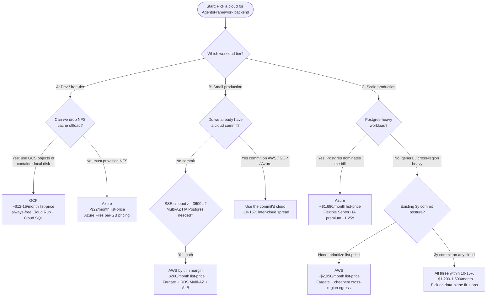

# Cloud Provider Comparison — AWS / GCP / Azure

**Scope:** Per-tier, list-price cost comparison and recommendation for deploying the AgentsFramework backend (per `BACKEND_SOLUTION_ARCHITECTURE.md` §3.3 and §5.5) on AWS, GCP, or Azure. Covers three workload tiers (dev / small-prod / scale-prod), per-tier line-item cost models, lock-in/portability radius, and the open questions a team needs to resolve before committing to a provider.

**Audience:** Architects, FinOps leads, and engineering managers deciding which cloud to deploy on. Assumes familiarity with `AWS_DEPLOYMENT_ARCHITECTURE.md`, `GCP_DEPLOYMENT_ARCHITECTURE.md`, and `AZURE_DEPLOYMENT_ARCHITECTURE.md`.

**Related documents:**
- `docs/Architectures/BACKEND_SOLUTION_ARCHITECTURE.md` — backend invariants (I-9 SDK isolation), persistence and cache layout (§5.5), concentric rings (§3.3).
- `docs/Architectures/AWS_DEPLOYMENT_ARCHITECTURE.md` — AWS infrastructure mapping, ALB SSE timeouts, four required code refactors.
- `docs/Architectures/GCP_DEPLOYMENT_ARCHITECTURE.md` — GCP infrastructure mapping, Cloud Run + HTTPS LB extended timeouts, four required code refactors.
- `docs/Architectures/AZURE_DEPLOYMENT_ARCHITECTURE.md` — Azure infrastructure mapping, ACA + AFD extended timeouts, four required code refactors.
- `docs/CLOUD_COMPARISON_PYRAMID_ANALYSIS.md` — the planning artifact behind this doc (three pyramids, evidence tables with pricing-page citations, eight-check validation logs per pyramid).

> **Cost-modeling posture (applies throughout).** All numbers are **list-price only**, expressed as monthly bands. Reserved Instances (AWS), Committed Use Discounts (GCP 1y/3y), Azure Reservations / Savings Plans, and Enterprise Agreements are **out of scope of the headline numbers** but are surfaced as the dominant Tier-C lever in §5. LLM token spend is **not** included (it is provider-independent under LiteLLM; see `services/llm_config.py`) but is called out in §6 because at Tier C it dwarfs the IaaS bill.

---

## 1. Three identical deployments, three different bills

`AWS_DEPLOYMENT_ARCHITECTURE.md`, `GCP_DEPLOYMENT_ARCHITECTURE.md`, and `AZURE_DEPLOYMENT_ARCHITECTURE.md` map the same four-layer backend (per `BACKEND_SOLUTION_ARCHITECTURE.md` §3.3) onto functionally equivalent managed services: Postgres for the LangGraph checkpointer, object storage for AgentFacts, NFS for `cache/.agent_offload/` and `cache/.agent_plans/`, a streaming sink for trace JSONL, and a load balancer that holds long-lived SSE connections. On paper, the three deployments are interchangeable.

The bill diverges anyway, and **the unit-cost driver changes from one workload tier to the next**:

- At **dev tier (~5 devs, < 20 SSE sessions/day, < 5 GB object)**, the divergence is driven by **idle compute and NFS minimum capacity** — Cloud Run's always-free tier covers the entire workload, AWS Fargate has no scale-to-zero equivalent for HTTP workloads, and Filestore Basic provisions a 1 TiB minimum regardless of actual usage.
- At **small-prod tier (~10–20 concurrent SSE, ~50 GB traces/month, multi-AZ HA Postgres)**, the divergence is driven by **always-on min-1 compute pricing and multi-AZ HA Postgres premium model** — Cloud Run loses its scale-to-zero edge once `min_instances >= 1`, and Azure DB for PostgreSQL Flexible Server's ~1.25–1.3× HA premium beats RDS Multi-AZ's 2× and Cloud SQL HA's 2×.
- At **scale tier (~200 concurrent SSE, ~2M LLM calls/month, ~1 TB traces, ~500 GB HA Postgres, multi-region active-passive)**, the divergence is driven by **HA Postgres scaling, log-ingest pricing model, and commit-discount posture** — and **LLM token spend dwarfs the entire IaaS bill by an order of magnitude**, demoting the cloud choice from a cost optimization to a data-plane fit decision.

The implication: there is no single "cheapest cloud" for the AgentsFramework backend. The right answer depends on the workload tier, and the cost driver that picks the winner flips between adjacent tiers. The rest of this document walks the per-tier picks, with line items.

---

## 2. Pick a tier first; the cheapest cloud follows

The defensible cloud pick depends entirely on the workload size and shape. Pick a tier from §3 first; then the recommendation in the table below follows. **All dollar bands are monthly, list-price, single-region unless noted.**

| Tier | Recommended provider | Monthly cost band (list-price) | Key reason | Key risk |
|---|---|---|---|---|
| **A — Dev / free-tier** (~5 devs, ~20 SSE sessions/day, ~500 LLM calls/month, ~1 GB traces/month, ~10 GB Postgres, < 5 GB object) | **GCP** (conditional: NFS must be replaced by GCS objects or container-local disk) | **GCP ~$12–35 · Azure ~$22–45 · AWS ~$60–90** | Cloud Run's always-free tier (2M requests/month, 180k vCPU-seconds, 360k GiB-seconds) covers the entire request volume; no LB hours needed (built-in `*.run.app` HTTPS endpoint); Cloud Logging's 50 GiB/month free tier covers all log ingest; Secret Manager is effectively free at 2 secrets. | **Filestore Basic provisions a 1 TiB minimum at ~$0.20/GiB-month** (~$200/month floor) — if the deployment maps `cache/.agent_offload/` to Filestore on GCP, the entire cost advantage disappears and GCP becomes the **most** expensive cloud at Tier A. The recommendation is **conditional on dropping NFS** at Tier A (acceptable: dev tier does not need durable shared offload). |
| **B — Small production** (~10–20 concurrent SSE peak, ~50k LLM calls/month, ~50 GB traces/month, multi-AZ Postgres ~50 GB, ~200 GB object storage with 90-day lifecycle, min-1 BFF + Backend) | **AWS** (thin margin; commit-conditional) | **AWS ~$260–320 · Azure ~$300–360 · GCP ~$310–400** | AWS Fargate's per-vCPU-hour list-price (~$0.04) beats Cloud Run CPU-always-allocated (~$0.065/vCPU-hour equivalent at min-1) and ACA dedicated workload profiles (~$0.04/vCPU-hour bare compute **plus** a ~$73/month per-environment management fee), making AWS the cheapest **compute + LB combination** at min-1. Multi-AZ HA RDS Postgres at 50 GB is competitive (~$125/month) once you accept the 2× HA premium. | **The margin is small enough that commit posture flips the answer.** A 1y AWS Compute Savings Plan + 1y RDS RI widens the AWS gap; a 1y Azure Reservation on PG Flexible HA closes it (Azure DB for PG Flexible's structurally cheaper ~1.25–1.3× HA premium beats RDS Multi-AZ's 2× on Postgres alone by ~$30–60/month at this sizing); a 3y GCP CUD on Cloud SQL HA + sustained-use Cloud Run can put GCP back on top. |
| **C — Scale production** (~200 concurrent SSE, ~2M LLM calls/month, ~1 TB traces/month, multi-region active-passive HA Postgres ~500 GB, ~5 TB object storage with 90-day hot + archive, min-5 per service) | **Azure for Postgres-heavy workloads · AWS for general or commit-discount posture** (3y commit narrows all three to within ~15%) | **Azure ~$1,500–1,800 · GCP ~$1,700–1,950 · AWS ~$1,900–2,200** at list-price; **all three converge to ~$1,200–1,500** under 3y all-upfront commit | Azure DB for PostgreSQL Flexible Zone-Redundant HA's ~1.25–1.3× HA premium (vs RDS Multi-AZ's 2× and Cloud SQL HA's 2×) makes Postgres ~$300–700/month cheaper at Tier-C sizing, and Postgres is the largest single IaaS line item at this tier. AWS retains the cheapest list-price compute and the cheapest cross-region egress ($0.02/GB same-continent). | **LLM token spend (~$15,000–50,000/month at frontier-model rates and 2M calls/month) dwarfs the IaaS bill by an order of magnitude.** The cloud choice at Tier C is a ~$300–700/month decision against a ~$20,000+/month total spend — i.e., **demote raw IaaS list-price as the primary criterion at Tier C**. Pick on data-plane fit (Postgres + log ingest + sink throughput) and commit posture instead. |

**Default recommendation when no tier has been committed yet:** start on **GCP** (cheapest at Tier A; cheapest log ingest at every tier; lock-in radius bounded by four adapter files per §4), with an explicit plan to **re-evaluate at the Tier-A → Tier-B transition** (the compute pricing model flips when min-1 activates) and again at the **Tier-B → Tier-C transition** (commit posture starts to dominate). For teams already at production scale, default to **Azure** for Postgres-heavy workloads and **AWS** for general-purpose / cross-region-heavy workloads.

---

## 3. Three workload tiers anchored to numbers

The per-tier recommendation in §2 is defensible only against a concrete workload. The three tiers below are the workload shapes against which the per-cloud bills in §4 are computed. **All numbers are assumptions, not measurements against live workload** — they are the documented anchors that make the cost claims falsifiable.

### 3.1 Tier A — Dev / free-tier

- **Users:** ~5 internal developers
- **Concurrency:** < 20 SSE sessions/day (peak ~2 concurrent)
- **LLM volume:** ~500 calls/month
- **Trace volume:** ~1 GB/month
- **Postgres:** 1 small instance (~10 GB) — single-region, single-AZ acceptable
- **Object storage:** < 5 GB
- **NFS:** ~1–5 GB if provisioned (optional; can be replaced by container-local disk or object storage)
- **Topology:** single region; **scale-to-zero acceptable** on Frontend and Meta; cold starts acceptable on BFF/Backend
- **Cost driver:** idle compute (because the request volume rounds to "almost nothing")

### 3.2 Tier B — Small production

- **Users:** internal + external users, ~50–200 monthly active
- **Concurrency:** ~10–20 concurrent SSE peak
- **LLM volume:** ~50,000 calls/month
- **Trace volume:** ~50 GB/month
- **Postgres:** ~50 GB, **multi-AZ HA** (single region)
- **Object storage:** ~200 GB with 90-day lifecycle to a cooler tier
- **NFS:** workload-sized (~10–50 GB), provisioned shared filesystem required
- **Topology:** single region, multi-AZ; **`min_instances >= 1` on BFF + Backend** (cold starts break user-facing SSE UX)
- **Cost driver:** always-on min-1 compute pricing + multi-AZ HA Postgres pricing model

### 3.3 Tier C — Scale production

- **Users:** external users, ~10,000+ monthly active
- **Concurrency:** ~200 concurrent SSE peak
- **LLM volume:** ~2,000,000 calls/month
- **Trace volume:** ~1 TB/month
- **Postgres:** ~500 GB HA cluster + **cross-region read-replica** (active-passive failover)
- **Object storage:** ~5 TB (90-day hot + Glacier/Coldline/Archive tier)
- **NFS:** workload-sized (~100–500 GB)
- **Topology:** multi-region active-passive; `min_instances >= 5` per service; autoscale ceiling configured
- **Cost driver:** HA Postgres scaling + log ingest pricing model + commit-discount posture (1y/3y reservations close ~75% of the inter-cloud list-price gap)

---

## 4. Per-tier cost model

Each subsection below lists the compute + data + network + observability + secrets line items for each cloud at that tier, with monthly list-price totals. The line-item formulas and pricing-page citations live in `docs/CLOUD_COMPARISON_PYRAMID_ANALYSIS.md` §A.4, §B.4, §C.4 (one evidence table per tier, with confidence column per row).

### 4.1 Tier A — Dev / free-tier (monthly list-price, USD)

| Line item | AWS | GCP (NFS dropped) | GCP (Filestore Basic) | Azure |
|---|---|---|---|---|
| Compute (Frontend + BFF + Backend + Meta) | Fargate 4 tasks × 0.25 vCPU / 0.5 GB always-on ≈ **$37** | Cloud Run inside always-free tier ≈ **$0** | Cloud Run inside always-free tier ≈ **$0** | ACA consumption inside always-free tier (180k vCPU-sec / 360k GiB-sec) ≈ **$0** |
| Postgres | RDS `db.t4g.micro` Single-AZ 10 GB ≈ **$13** | Cloud SQL smallest shared-core 10 GB ≈ **$12** | Cloud SQL smallest shared-core 10 GB ≈ **$12** | DB for PG Flexible `B1ms` 32 GB (min storage) ≈ **$16** |
| Object storage (< 5 GB) | S3 ≈ **$0** | GCS ≈ **$0** | GCS ≈ **$0** | Blob Hot ≈ **$0** |
| NFS / shared FS | EFS Standard ~5 GB ≈ **$2** | (not provisioned) **$0** | Filestore Basic 1 TiB minimum ≈ **$200** | Azure Files ~5 GB ≈ **$1** |
| Streaming sink | Firehose ~1 GB/month ≈ **$0–1** | (not used at Tier A; direct GCS writes) ≈ **$0** | (same) ≈ **$0** | (not used at Tier A; direct Blob writes) ≈ **$0** |
| Load balancer | ALB always-on (required for SSE on Fargate) ≈ **$16** | (not provisioned; `*.run.app` HTTPS endpoint) ≈ **$0** | (same) ≈ **$0** | (not provisioned; ACA built-in HTTPS) ≈ **$0** |
| Egress | rounding error ≈ **$0** | rounding error ≈ **$0** | rounding error ≈ **$0** | rounding error ≈ **$0** |
| Log ingest (~1 GB) | CloudWatch above 5 GB free tier ≈ **$0** | Cloud Logging inside 50 GiB free tier ≈ **$0** | (same) ≈ **$0** | Log Analytics PAYG ~$5 (no free tier on PAYG) ≈ **$5** |
| Secrets | Secrets Manager 2 × $0.40 ≈ **$1** | Secret Manager 2 × $0.06 ≈ **$0** | (same) ≈ **$0** | Key Vault transaction-priced ≈ **$0** |
| **Total** | **~$70/month** | **~$12–15/month** | **~$225/month** ⚠ | **~$22/month** |

**Winner at Tier A: GCP, conditional on dropping NFS** (acceptable for dev tier; alternative: container-local ephemeral disk or per-task offload to GCS objects). With NFS provisioned via Filestore Basic, GCP becomes the most expensive cloud at Tier A — Azure wins instead.

### 4.2 Tier B — Small production (monthly list-price, USD)

| Line item | AWS | GCP | Azure |
|---|---|---|---|
| Compute (BFF + Backend, min-1, 1 vCPU / 2 GiB each) | Fargate 2 × always-on ≈ **$72** | Cloud Run CPU-always-allocated min-1 ≈ **$117** | ACA dedicated workload profile ≈ **$73** compute + **$73** env fee = **$146** |
| Frontend hosting | Amplify ≈ **$15** | Cloud Run / Firebase Hosting ≈ **$15** | Static Web Apps Standard ≈ **$10** |
| Postgres (multi-AZ HA, ~50 GB) | RDS Multi-AZ `db.t4g.medium` ≈ **$125** | Cloud SQL HA `db-custom-2-7680` ≈ **$150** | DB for PG Flexible Zone-Redundant HA `B2s` ≈ **$90** |
| Object storage (200 GB) | S3 + 90-day lifecycle to IA ≈ **$3–5** | GCS + 90-day lifecycle to Nearline ≈ **$3–4** | Blob Hot + 90-day lifecycle to Cool ≈ **$3–4** |
| NFS / shared FS | EFS Standard ~50 GB ≈ **$15** | Filestore Basic 1 TiB minimum ≈ **$200** ⚠ | Azure Files Premium ~50 GB ≈ **$16** |
| Streaming sink (~50 GB/month) | Firehose ≈ **$2** | Pub/Sub ≈ **$2** | Event Hubs Standard ≈ **$15** |
| Load balancer | ALB + LCUs ≈ **$23** | Global HTTPS LB ≈ **$23** | AFD Standard ≈ **$40** (avoiding Application Gateway WAF_v2 at ~$285/month) |
| Cross-AZ egress (multi-AZ DB activates) | ≈ **$1** | ≈ **$1** | ≈ **$1** |
| Log ingest (~10 GB/month) | CloudWatch ≈ **$3** | Cloud Logging inside 50 GiB free tier ≈ **$0** | Log Analytics PAYG ≈ **$23** |
| Secrets | Secrets Manager ≈ **$1** | Secret Manager ≈ **$0** | Key Vault ≈ **$1** |
| **Total (with NFS provisioned)** | **~$260/month** | **~$510/month** ⚠ | **~$345/month** |
| **Total (with NFS replaced by object-store offload on GCP)** | (n/a) | **~$310/month** | (n/a) |

**Winner at Tier B: AWS by a thin margin** (~$260 vs ~$310 GCP-without-Filestore vs ~$345 Azure). Azure wins the Postgres line item by ~$30–60/month but loses on LB pricing model (Application Gateway WAF_v2 is dramatically expensive; Azure Front Door is the right Tier-B path). Commit posture flips the answer (see §5).

### 4.3 Tier C — Scale production (monthly list-price, USD)

| Line item | AWS | GCP | Azure (with AFD instead of AGW) |
|---|---|---|---|
| Compute (BFF + Backend, min-5, 1 vCPU / 2 GiB each) | Fargate 10 × always-on ≈ **$360** | Cloud Run CPU-always-allocated min-5 ≈ **$585** | ACA dedicated workload profile ≈ **$640** (incl. environment + dedicated-profile premium) |
| Frontend hosting | Amplify scaled ≈ **$50** | Cloud Run / Firebase ≈ **$50** | Static Web Apps Standard scaled ≈ **$50** |
| Postgres HA + cross-region replica (~500 GB) | RDS Multi-AZ `db.r6g.large` + cross-region read-replica ≈ **$1,300** | Cloud SQL HA `db-custom-2-13` + cross-region read-replica ≈ **$1,000** | DB for PG Flexible Zone-Redundant HA `D2ds_v4` + cross-region read-replica ≈ **$600** ✓ |
| Object storage (5 TB, 90-day hot + archive) | S3 Standard 1.5 TB + Glacier-Instant 3.5 TB ≈ **$85** | GCS Standard 1.5 TB + Archive 3.5 TB ≈ **$34** | Blob Hot 1.5 TB + Archive 3.5 TB ≈ **$32** |
| NFS / shared FS (~200 GB) | EFS Standard ≈ **$60** | (Filestore replaced by GCS object offload) ≈ **$0** | Azure Files Premium ≈ **$32** |
| Streaming sink (~1 TB/month) | Firehose ≈ **$47** | Pub/Sub ≈ **$45** | Event Hubs Standard (multiple TUs) ≈ **$80** |
| Load balancer + WAF | ALB + WAF v2 ≈ **$85** | Global HTTPS LB + Cloud Armor ≈ **$70** | AFD Standard ≈ **$50** (AGW WAF_v2 alternative would be ~$285+/month) |
| Cross-region egress (~1 TB/month replication, same-continent) | $0.02/GB ≈ **$20** | $0.02–$0.05/GB ≈ **$20–50** | $0.02/GB ≈ **$20** |
| Log ingest (~50–100 GB/month) | CloudWatch ≈ **$35** | Cloud Logging ≈ **$13** ✓ | Log Analytics PAYG ≈ **$170** ⚠ |
| Secrets + KMS | Secrets Manager + KMS ≈ **$9** | Secret Manager + Cloud KMS ≈ **$3** | Key Vault keys + secrets ≈ **$9** |
| **Total (list-price)** | **~$2,050/month** | **~$1,820/month** | **~$1,680/month** ✓ |
| **Total (1y AWS Compute Savings Plan + RDS RI / 3y GCP CUD / 3y Azure Reservation; rough)** | **~$1,300–1,500/month** | **~$1,250–1,500/month** | **~$1,200–1,400/month** |

**Winner at Tier C, list-price: Azure** (~$1,680/month vs ~$1,820 GCP vs ~$2,050 AWS) — driven by Azure DB for PostgreSQL Flexible Server's structurally cheaper HA premium model (the single largest line item at Tier C). **Winner under 3y commit: too close to call** (~10–15% spread across all three). The commit-discount lever closes ~75% of the inter-cloud gap.

> **Note on the IaaS-vs-LLM share.** At Tier C, ~2M LLM calls/month at frontier-model rates (e.g., `gpt-4o`-class ≈ $0.0025/1k input + $0.01/1k output, ~1k tokens/call) implies LLM token spend of **~$15,000–50,000/month** — 10–30× the IaaS bill. **The cloud choice is a ~$300–700/month decision on top of a ~$20,000+/month total bill.** This is the strongest argument for demoting raw IaaS price at Tier C and weighting data-plane fit, multi-region SLA, and commit posture instead.

---

## 5. Lock-in is bounded; commit posture dominates Tier C

The lock-in radius of picking AWS, GCP, or Azure is bounded by **invariant I-9** in `BACKEND_SOLUTION_ARCHITECTURE.md` (SDK confinement to `agent_ui_adapter/adapters/runtime/`) and the **four code refactors** enumerated in each per-cloud architecture's §6. The swap-out surface area is identical across the three clouds.

### 5.1 Lock-in / portability surface (the four refactors per cloud)

| Refactor | AWS adapter | GCP adapter | Azure adapter | Backend-architecture anchor |
|---|---|---|---|---|
| Postgres checkpointer | `agent_ui_adapter/adapters/runtime/postgres_saver.py` injected when `AWS_EXECUTION_ENV` set | same file, injected when `GCP_EXECUTION_ENV` set (Cloud SQL Auth Proxy or Direct VPC Egress) | same file, injected when `AZURE_EXECUTION_ENV` set | I-9; `AWS_DEPLOYMENT_ARCHITECTURE.md:134-136`, `GCP_DEPLOYMENT_ARCHITECTURE.md:135-137`, `AZURE_DEPLOYMENT_ARCHITECTURE.md:130-131` |
| Trace sink | `services/trace_sinks/kinesis_sink.py` (Firehose via `boto3`) | `services/trace_sinks/pubsub_sink.py` (`google-cloud-pubsub`) | `services/trace_sinks/eventhubs_sink.py` (`azure-eventhub`) | I-9; `AWS_DEPLOYMENT_ARCHITECTURE.md:137-139`, `GCP_DEPLOYMENT_ARCHITECTURE.md:138-140`, `AZURE_DEPLOYMENT_ARCHITECTURE.md:132-134` |
| AgentFacts object store | `services/governance/agent_facts_registry.py` extended for `s3://` URIs | same, extended for `gs://` URIs | same, extended for `https://...blob.core.windows.net` or `abfs://` URIs | I-9; `AWS_DEPLOYMENT_ARCHITECTURE.md:140-141`, `GCP_DEPLOYMENT_ARCHITECTURE.md:141-142`, `AZURE_DEPLOYMENT_ARCHITECTURE.md:135-136` |
| Cloud-provider identity | `services/cloud_providers/aws_identity.py` (IAM → AgentFacts) | `services/cloud_providers/gcp_identity.py` (Workload Identity → AgentFacts) | `services/cloud_providers/azure_identity.py` (Managed Identity → AgentFacts) | I-9; `AWS_DEPLOYMENT_ARCHITECTURE.md:142-143`, `GCP_DEPLOYMENT_ARCHITECTURE.md:143-144`, `AZURE_DEPLOYMENT_ARCHITECTURE.md:137-138` |

The swap cost for changing clouds is **four files plus a composition-root wiring change**. Outside those four files, the code is identical. This bounds the long-term lock-in penalty of any Tier-A/B/C decision: the team can re-pick at any tier transition with bounded refactor cost.

### 5.2 Commit-discount posture (dominant Tier-C lever)

| Commit | AWS | GCP | Azure |
|---|---|---|---|
| 1y, no upfront | Compute Savings Plan ~30–40% off Fargate + RDS RI ~30–40% off Multi-AZ | CUD ~25–30% off Cloud Run + Cloud SQL HA | Reservation ~30–40% off ACA + PG Flexible HA |
| 3y, all upfront | Savings Plan + RI ~45–55% total | CUD ~40–50% | Reservation ~45–55% |
| Effect at Tier C | Cuts the ~$2,050/month list-price bill to ~$1,300–1,500/month | Cuts the ~$1,820/month bill to ~$1,250–1,500/month | Cuts the ~$1,680/month bill to ~$1,200–1,400/month |

Under 3y all-upfront commit, the inter-cloud spread at Tier C narrows from ~22% list-price to ~10–15%. **Pick a cloud at Tier C based on data-plane fit and operational comfort, not list-price arithmetic.** Re-evaluate the commit posture annually.

---

## 6. Decision criteria flowchart

---

## 7. Open questions

These map back to the `missing_data` and `known_weakness` gaps in `docs/CLOUD_COMPARISON_PYRAMID_ANALYSIS.md` §A.5, §B.5, §C.5. Each one is a load-bearing assumption in the recommendations above; resolving them refines or revises the pick.

1. **Live workload measurement.** All tier-shape numbers (`~5 devs`, `~20 SSE sessions/day`, `~50k LLM calls/month`, `~1 TB traces/month`, etc.) are assumptions. The first month of production telemetry should reset the per-tier bands; if the actual workload is 2–3× any single anchor, re-run the per-tier model in §4.
2. **NFS decision.** The Tier-A and Tier-B GCP picks are conditional on **not** provisioning Filestore (1 TiB minimum). The recommended alternatives are (a) container-local ephemeral disk for `cache/.agent_offload/` with per-step object-storage offload, or (b) small Postgres LOB columns for the planning artifacts. **This is the single most consequential design decision for the GCP cost model.**
3. **Commit posture.** All headline numbers are list-price. A team with the cash flow and willingness to commit 1y or 3y can change the Tier-C ranking by ±20% per cloud. Quantify your commit posture before locking in §2's recommendation at Tier C.
4. **Cross-region geography.** The §4.3 cross-region egress estimate (~$20/month at 1 TB replication) assumes **same-continent** active-passive (e.g., us-east-1 → us-west-2). **Cross-continent** failover (e.g., East US → Southeast Asia) shifts the egress per-GB rate to $0.05–$0.12/GB and can move that line item to ~$50–120/month at the same 1 TB. If your DR plan requires cross-continent, re-check `branch_3` of Pyramid C.
5. **LLM token spend share.** At Tier C, IaaS is 5–15% of total spend; LLM tokens are the rest. Optimizing the IaaS bill by 25% saves ~1–4% of total spend. The bigger lever at Tier C is model routing (use `gpt-4o-mini` / `gpt-4o`-tier mix per `services/llm_config.py`) and prompt-compaction (per `services/summarizer.py`). Cloud choice should not crowd out work on these levers.
6. **Aurora Global Database (AWS) and AlloyDB (GCP).** Neither is modeled in §4.3. Aurora Global cuts cross-region RPO to < 1 s and RTO to ~1 min for a ~30% premium over RDS; AlloyDB is GCP's higher-performance Postgres-compatible engine at ~50% premium over Cloud SQL. If RPO < 60 s is a hard requirement, re-cost Tier C with these.
7. **WAF / DDoS posture for Azure.** §4.3 uses Azure Front Door Standard for Tier C, not Application Gateway WAF_v2 (~$285+/month). If your security team requires region-pinned WAF rules and mTLS termination, AGW becomes the right Azure path and the Tier-C Azure total moves to ~$1,950–2,200/month, eliminating Azure's list-price lead at scale.

---

## 8. References

- `docs/CLOUD_COMPARISON_PYRAMID_ANALYSIS.md` — the planning artifact this doc projects from. Contains three pyramids (one per tier), evidence tables with pricing-page citations and confidence scores, eight-check validation logs, and the framing-notes appendix that records the chosen narrative ordering.
- `docs/Architectures/BACKEND_SOLUTION_ARCHITECTURE.md` §3.3 (concentric rings), §5.5 (persistence and cache layout), invariant I-9 (SDK isolation in `agent_ui_adapter/adapters/runtime/`).
- `docs/Architectures/AWS_DEPLOYMENT_ARCHITECTURE.md` — AWS infrastructure mapping; ALB 4000 s SSE timeout (`AWS_DEPLOYMENT_ARCHITECTURE.md:43`); §6 lists the four required code refactors.
- `docs/Architectures/GCP_DEPLOYMENT_ARCHITECTURE.md` — GCP infrastructure mapping; Cloud Run + HTTPS LB extended timeouts (`GCP_DEPLOYMENT_ARCHITECTURE.md:126-127`); §6 lists the four required code refactors.
- `docs/Architectures/AZURE_DEPLOYMENT_ARCHITECTURE.md` — Azure infrastructure mapping; AFD + ACA extended timeouts (`AZURE_DEPLOYMENT_ARCHITECTURE.md:121-122`); §6 lists the four required code refactors.
- `docs/plans/cloud_cost_comparison_pyramids.plan.md` — the plan that produced this document.
