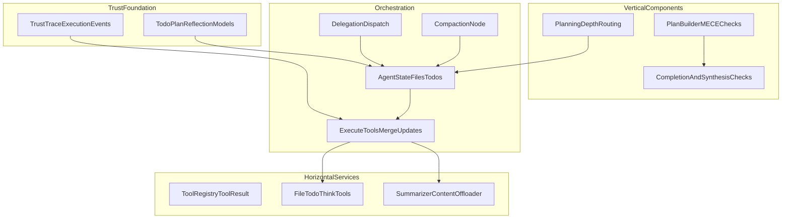

# Deep Agent Loop Upgrade - SCQA Justification Guide

## Purpose

This guide reframes the approved implementation plan using SCQA so researchers and architects can evaluate:

1. Why the plan improves the existing ReAct loop.
2. How each capability works in the four-layer architecture.
3. Which risks, trade-offs, and validation methods matter most.

This guide is intentionally implementation-oriented and maps directly to the planned changes in:

- [orchestration/state.py](orchestration/state.py)
- [orchestration/react_loop.py](orchestration/react_loop.py)
- [services/tools/registry.py](services/tools/registry.py)
- [components/evaluator.py](components/evaluator.py)
- [docs/Architectures/FOUR_LAYER_ARCHITECTURE.md](docs/Architectures/FOUR_LAYER_ARCHITECTURE.md)
- [AGENTS.md](AGENTS.md)

---

## SCQA Summary

### Situation

The current loop already has strong foundations: routing, guardrails, tool execution, budget control, and traceability.

However, long-horizon work still runs mostly through message history. This means:

- Context grows linearly with tool calls.
- Planning is implicit in model text, not explicit in state.
- Reasoning checks are mostly operational (errors/cost), not structural (plan completion, synthesis quality).
- Delegation patterns are not yet first-class in orchestration.

### Complication

As tasks become broader and longer (research, architecture decomposition, policy-heavy workflows), four failure modes appear repeatedly:

1. **Context saturation:** old but important details are buried or truncated.
2. **Shallow planning:** the loop can stop after local success without proving global completion.
3. **Reasoning drift:** evidence-to-conclusion linkage becomes weak without explicit reflection and validation.
4. **Coordination bottleneck:** one agent handles all branches sequentially, even when work is naturally parallel.

These failure modes reduce answer quality and increase cost through retries and rework.

### Question

How do we improve context capacity, planning discipline, reasoning quality, and delegation throughput while preserving four-layer boundaries and existing architecture invariants?

### Answer

Implement the full P0-P4 ladder as architecture-native capabilities:

- **P0-P1:** stateful files/todos + ToolResult state updates + offloading
- **P2-P3:** structured planning depth + reflection + compaction + synthesis validation
- **P4:** delegation with isolated subcontexts, budget gating, and filesystem-based handoffs

This preserves four-layer rules, improves long-horizon robustness, and keeps verification testable by layer.

---

## Why This Plan Improves the Loop

## 1) Context capacity improves through controlled externalization

The plan moves heavy artifacts from volatile messages to durable state-backed files:

- `files` becomes the working memory substrate.
- tool results can return references instead of full payloads.
- compaction summarizes history while preserving critical artifacts.

Result: the model reasons over a smaller high-signal context while retaining recoverability.

## 2) Planning becomes explicit, auditable, and completion-aware

The plan introduces durable planning objects (`todos`, `_plan.md`, plan artifacts) and completion logic:

- Planning depth is selected deterministically.
- The evaluator can continue until pending work is complete.
- Plan validity can be checked (MECE-style structural checks in vertical components).

Result: fewer premature exits and better alignment between intent and final output.

## 3) Reasoning quality improves via reflection and synthesis gates

The plan introduces explicit reflection capture and synthesis validation:

- Reflection entries become structured state, not ephemeral prose.
- Synthesis checks ensure final answers map to planned branches/evidence.
- Weak answers trigger revision before termination.

Result: better evidence coverage and higher confidence in final outputs.

## 4) Throughput scales with controlled delegation

The plan introduces orchestration-native delegation:

- Isolated sub-agent contexts reduce interference.
- Budget and authorization gates prevent unsafe/unbounded delegation.
- Sub-agent outputs flow through files, minimizing summarization loss.

Result: better performance on breadth-first tasks without violating control and traceability.

---

## How It Works (Architecture View)

---

## Capability-by-Capability Mechanics

## P0-P1 Foundation

### A. State extension

- `files`: durable artifact space.
- `todos`: execution checklist.
- `plan_ref`: canonical plan pointer (for continuity across compaction).

### B. ToolResult contract

Tools can return:

- `message` for model-facing observation.
- `state_updates` for deterministic state mutation.

This removes the old constraint where tools only returned strings.

### C. Offload + clear policy

- Large outputs offload to files.
- old verbose results are replaced with references.
- high-value state remains queryable via `read_file`.

## P2-P3 Planning and reasoning

### D. Planning depth

Deterministic policy chooses L0/L1/L2 based on task complexity, preventing over-planning for trivial tasks and under-planning for complex tasks.

### E. Plan builder and validation

Vertical logic creates and validates plan artifacts (structure checks, coverage checks), keeping domain logic out of orchestration.

### F. Reflection + synthesis validator

- `think` captures explicit reflection.
- synthesis validator checks whether final output actually satisfies planned branches and evidence constraints.

### G. Compaction

When token pressure crosses threshold, history is summarized while preserving artifacts and recent context.

## P4 Delegation

### H. Delegation dispatch

Orchestration creates isolated sub-runs for sub-tasks.

### I. Budget + authorization gates

Delegation only proceeds if:

- budget allows expected expansion,
- authorization permits requested capabilities.

### J. Filesystem handoff

Sub-agent outputs are persisted as artifacts; parent receives references. This reduces lossy relay behavior.

---

## Layer Compliance Justification

## Trust foundation

- Only pure schemas/events shared across upper layers.
- No framework/runtime imports.

## Horizontal services

- Tool contracts, offloading, summarization, and utility logic.
- No orchestration-specific graph decisions.

## Vertical components

- Deterministic planning/synthesis logic.
- No LangGraph imports.

## Orchestration

- Graph topology, node sequencing, delegation control flow, merge semantics.
- Thin wrappers calling services/components.

This preserves the dependency direction defined in [docs/Architectures/FOUR_LAYER_ARCHITECTURE.md](docs/Architectures/FOUR_LAYER_ARCHITECTURE.md).

---

## Researcher Guide: What to Measure

Researchers should validate improvements with end-state and trajectory metrics.

## Recommended evaluation dimensions

1. **Context efficiency**
  - average prompt tokens per step
  - offload ratio (bytes to files / bytes in messages)
  - compaction frequency and recovery fidelity
2. **Planning reliability**
  - premature-stop rate (finalized with pending todos)
  - plan coverage (addressed branches / planned branches)
  - todo consistency over retries
3. **Reasoning quality**
  - evidence-coverage score
  - synthesis-pass rate on first attempt
  - revision-loop delta (quality improvement after validator feedback)
4. **Delegation performance**
  - latency to completion for multi-branch tasks
  - delegation success/fallback rate
  - cost-per-completed-branch
5. **Safety/governance**
  - unauthorized delegation attempts blocked
  - trace completeness for plan/reflect/delegate events

## Experiment design

- Run A/B/C:
  - A: baseline loop
  - B: P0-P1
  - C: P0-P3
  - D: P0-P4 (only high-value parallelizable tasks)
- Evaluate by workload type:
  - short factual
  - multi-step implementation
  - architecture/research decomposition
  - parallelizable breadth-first exploration

---

## Architect Guide: Implementation Sequencing and Guardrails

## Sequencing

1. Land P0-P1 first (state + ToolResult + file/todo tools + evaluator continuation update).
2. Land P2-P3 next (planning depth + reflection + compaction + synthesis validator).
3. Land P4 last (delegation), gated by cost and security constraints.

## Guardrails

- Keep LangGraph-specific behavior in orchestration only.
- Keep shared types in trust only if consumed by multiple upper layers.
- Keep tool contracts backward compatible during migration.
- Enforce architecture tests after each phase.
- Preserve existing reviewer prompts and add new versioned prompts for A/B and historical comparison.

## Migration risk controls

- Backward-compatible adapters in `ToolRegistry`.
- feature flags for compaction/delegation during rollout.
- shadow-mode trace assertions before enabling hard enforcement.

---

## Risks and Trade-offs

1. **Complexity growth:** more nodes/contracts increase cognitive load.
  - Mitigation: phased rollout, strict layer tests, focused prompt versioning.
2. **Token/cost variance under delegation:**
  - Mitigation: explicit delegation budget gate + workload qualification.
3. **Over-planning for simple tasks:**
  - Mitigation: planning depth policy (L0/L1/L2).
4. **Compaction quality drift:**
  - Mitigation: preserve critical artifacts in files and test summary fidelity.

---

## Acceptance Criteria (Architecture + Outcome)

The loop upgrade is successful when all conditions hold:

1. All architecture tests pass with no new forbidden cross-layer imports.
2. P0-P1 features are operational with backward compatibility.
3. P2-P3 features improve planning/reasoning metrics on complex tasks.
4. P4 delegation is enabled only for eligible tasks and remains budget-safe.
5. `FOUR_LAYER_ARCHITECTURE.md` and `AGENTS.md` are updated to codify the new patterns and anti-patterns.
6. New versioned reviewer prompts are available while existing prompts remain unchanged for historical/eval use.

---

## Closing Principle

The plan improves the loop because it converts implicit behavior into explicit architecture contracts:

- implicit memory -> files + offloading policy
- implicit planning -> todos + plan artifacts + continuation checks
- implicit reasoning -> reflection + synthesis validation
- implicit parallelism -> budgeted, authorized delegation

This shift is what enables both stronger outcomes and stronger governance in the same system.