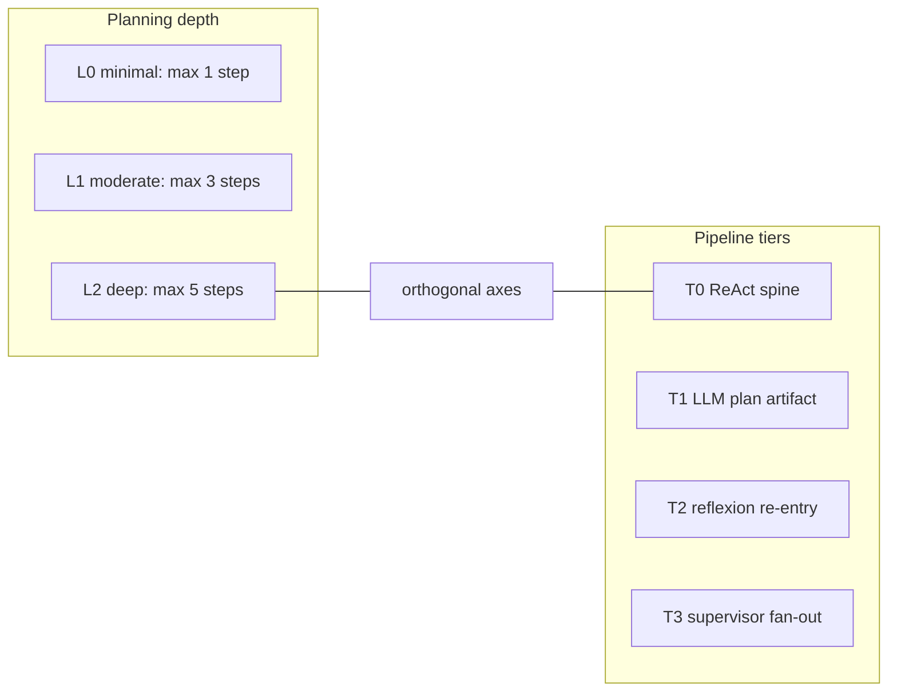
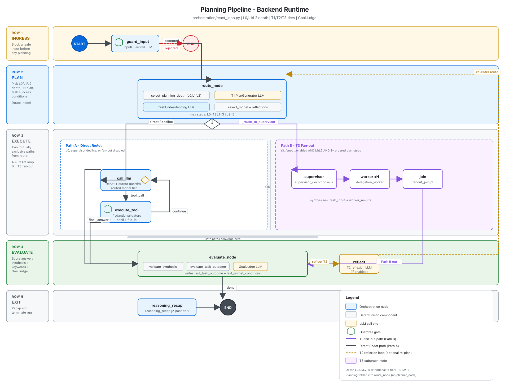
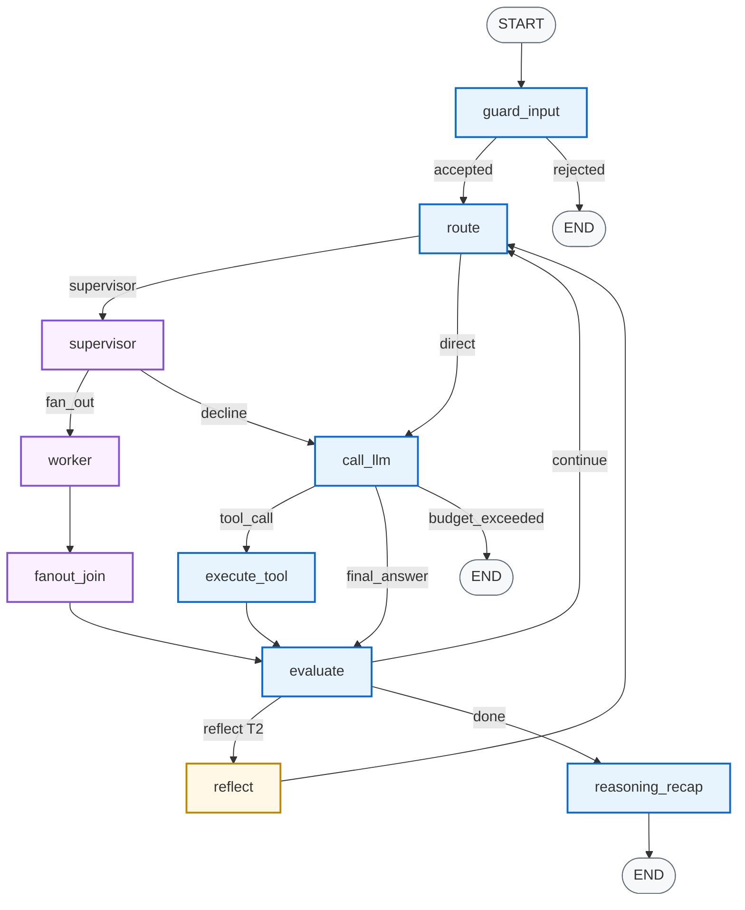
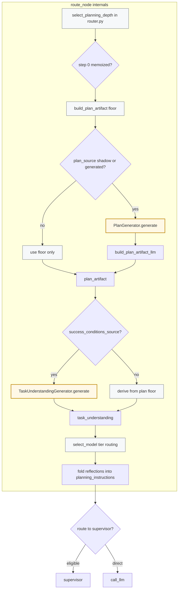
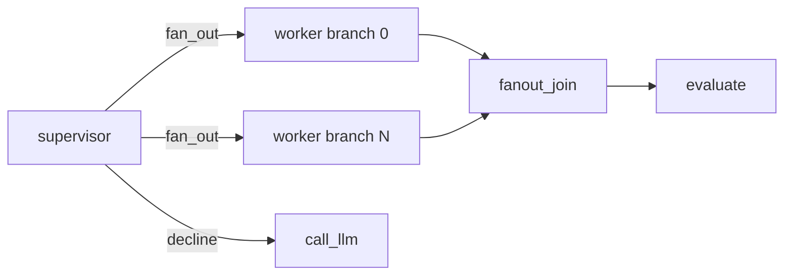
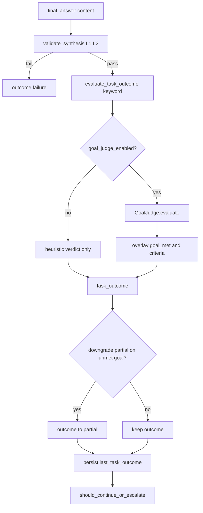

# Planning Pipeline — End-to-End System Diagram

**Status:** Operational companion to [`planning_pipeline_tiered_loops.design.md`](../plans/planning_pipeline_tiered_loops.design.md) §B.  
**Source of truth:** [`orchestration/react_loop.py`](../../orchestration/react_loop.py) (shipped StateGraph).  
**Scope:** Backend agent runtime only — no frontend/BFF, no Langfuse carrier detail.

> **Naming note:** **T1 / T2 / T3** here are **pipeline tiers** (Plan-and-Execute, Reflexion, Supervisor fan-out). They are **not** the Playwright E2E tiers (`test:e2e:t1` = SSE mock, `t2` = BFF mock, `t3` = full-stack Cloud Run).

**Interactive explorer:** [planning-pipeline-system-diagram.canvas.tsx](/Users/rajnishkhatri/.cursor/projects/Users-rajnishkhatri-Documents-AgentsFramework-agent/canvases/planning-pipeline-system-diagram.canvas.tsx) (open in Cursor beside chat; repo mirror at [`canvases/planning-pipeline-system-diagram.canvas.tsx`](../../canvases/planning-pipeline-system-diagram.canvas.tsx))

**Downloads:** [`assets/planning_pipeline_system_diagram.svg`](assets/planning_pipeline_system_diagram.svg) (vector) · [`assets/planning_pipeline_system_diagram.png`](assets/planning_pipeline_system_diagram.png) (raster)

---

## §1 Legend and iconography

Symbols are consistent across the **§3 visual diagram**, Mermaid diagrams below, and the Canvas explorer.

| Symbol | Meaning | Examples |
|--------|---------|----------|
| Rounded rect (blue stroke) | Orchestration node — thin wrapper in `react_loop.py` | `guard_input`, `route`, `evaluate` |
| Rounded rect (green fill) | Pure component in `components/` | `select_planning_depth`, `GoalJudge`, `plan_delegations` |
| Rounded rect (gray fill) | Deterministic logic — no LLM | `build_plan_artifact`, `evaluate_task_outcome`, `validate_synthesis` |
| Diamond (orange) | LLM call site | `PlanGenerator`, `GoalJudge`, `call_llm` |
| Shield | Guardrail gate | `InputGuardrail`, `output_guardrail_scan`, tool validators |
| Checklist | Task understanding / success conditions | `TaskUnderstanding`, `success_conditions` |
| Fork glyph | Conditional edge — label shows predicate fn | `_route_to_supervisor`, `_should_continue_or_escalate` |
| Dashed purple box | T3 fan-out subgraph (Path B) | `supervisor` → `worker`×N → `join` |
| Dashed blue box | Direct ReAct loop (Path A) | `call_llm` ↔ `execute_tool` |
| Dashed orange edge | T2 reflexion loop | `evaluate` → `reflect` → `route` |
| Left sidebar row label | Phase intent | Ingress → Plan → Execute → Evaluate → Exit |

---

## §2 Two orthogonal axes

Planning **depth** (L0/L1/L2) and pipeline **tier** (T1/T2/T3) are independent:

| Axis | Selector | What it controls |
|------|----------|------------------|
| **L0 / L1 / L2** | `select_planning_depth()` in [`components/router.py`](../../components/router.py) | Plan granularity, step budget (1/3/5), synthesis-validator strictness, T3 eligibility |
| **T1** | `agent_config.plan_source` (`deterministic` / `shadow` / `generated`) | Whether `PlanGenerator` LLM runs at step 0 |
| **T2** | `agent_config.reflexion_enabled` + `max_reflexion_attempts` | Whether failed/partial terminal turns re-enter via `reflect` |
| **T3** | `agent_config.t3_fanout_enabled` | Whether `route` can fork to `supervisor` |

**T0** is the baseline spine: guard → route → call_llm ↔ execute_tool → evaluate → recap → END, with deterministic plan floor only and no reflexion or fan-out.

---

## §3 Master topology (StateGraph)

Node IDs match LangGraph registration in [`react_loop.py`](../../orchestration/react_loop.py) lines 2565–2656.

### Visual system diagram

Canonical swimlane layout — five rows, Path A (direct ReAct) vs Path B (T3 fan-out) as mutually exclusive execute branches.

PNG fallback (environments that block inline SVG)

#### How to read the rows

| Row | Intent | Key nodes | Doc section |
|-----|--------|-----------|-------------|
| **1 — Ingress** | Block unsafe input before any planning | `guard_input` → accept/reject | §7 row 1 |
| **2 — Plan** | Choose L0/L1/L2 depth, T1 plan, success conditions | `route_node` | §4 |
| **3 — Execute** | **Path A:** direct ReAct loop · **Path B:** T3 fan-out (OR) | `call_llm` ↔ `execute_tool` · `supervisor` → `worker` → `join` | §5 |
| **4 — Evaluate** | Score answer: synthesis + keywords + GoalJudge; optional T2 reflexion | `evaluate_node`, `reflect` | §6 |
| **5 — Exit** | Recap reasoning and terminate | `reasoning_recap` → END | §7 row 10 |

Path A is taken when `_route_to_supervisor` returns `direct` (L0, supervisor decline, fan-out disabled, or fewer than two plan steps). Path B requires `t3_fanout_enabled`, depth L1 or L2, and `len(ordered_steps) ≥ 2`. Both paths converge at `evaluate_node`.

### Mermaid equivalent (editable)

### Conditional routing predicates

| Edge | Predicate | Returns | Gate |
|------|-----------|---------|------|
| `guard_input` → route/END | `_guard_routing` | `accepted` / `rejected` | `InputGuardrail.is_acceptable()` (step 0 only) |
| `route` → supervisor/direct | `_route_to_supervisor` | `supervisor` / `direct` | `t3_fanout_enabled` AND depth ≠ L0 AND `len(ordered_steps) ≥ 2` |
| `supervisor` → worker/call_llm | `_route_fanout` | `Send` per branch / `call_llm` | `plan_delegations` → `fan_out` or `decline` |
| `call_llm` → execute/evaluate/END | `_parse_response` | `tool_call` / `final_answer` / `budget_exceeded` | LLM response shape + budget |
| `evaluate` → route/reflect/recap | `_should_continue_or_escalate` | `continue` / `reflect` / `done` | Step budget, then T2 escalation |

---

## §4 `route_node` zoom-in (plan + understand)

Planning is **folded into `route_node`** — there is no separate `planner_node` in shipped code. On every loop iteration `route_node` runs; step-0 artifacts are memoized per `task_id`.

### Planning depth selection (L0 / L1 / L2)

| Depth | Step budget | Selection summary |
|-------|-------------|-------------------|
| **L0** | max 1 step | Simple initial task; **also forced** when `task_tool_results_count > 0` (post-tool-synthesis) |
| **L1** | max 3 steps | `complexity_score ≥ 2`, or L1 floors (strong-intent verb, long task ≥25 words, sequenced multistep) |
| **L2** | max 5 steps | `complexity_score ≥ 3`, or incident-narrative promotion (≥25 words + debug markers) |

Depth-specific executor guidance comes from `build_planning_instructions()` in [`components/plan_builder.py`](../../components/plan_builder.py):

- **L0:** minimal planning, proceed directly, concise synthesis
- **L1:** outline 2–4 concrete steps, execute in order, synthesize clearly
- **L2:** multi-step plan, state assumptions, validate intermediate results before synthesis

### T1 replan gate

When a stored plan is **stale** (`plan_is_stale(plan_artifact, last_tool_result)`), `route_node` rebuilds from the deterministic floor and increments `replan_count`. Surprising tool output triggers re-plan without re-invoking the LLM (cost + brittle-plan backstop).

### State keys written at route

| Key | When | Content |
|-----|------|---------|
| `planning_depth` | step 0, memoized | `"L0"` / `"L1"` / `"L2"` |
| `planning_depth_reason` | step 0 | e.g. `high-complexity-initial-task` |
| `planning_depth_task_id` | step 0 | binds depth to current task |
| `plan_artifact` | step 0 / replan | `ordered_steps`, `success_conditions`, constraints |
| `plan_artifact_task_id` | step 0 | binds plan to current task |
| `plan_ref` | step 0 | filesystem ref to serialized plan JSON |
| `replan_count` | replan | `operator.add` counter |
| `task_understanding` | step 0, memoized | `restated_intent`, `success_conditions`, `source` |
| `task_understanding_task_id` | step 0 | staleness guard across turns |
| `selected_model`, `routing_reason` | each route pass | model tier selection |

---

## §5 T3 fan-out subgraph

T3 adds three nodes; the only new entry edge is `route` → `supervisor`. Return seam: `join` → `evaluate` (GoalJudge scores the **joined** answer).

### Supervisor decision flow

1. **`_route_to_supervisor`** — cheap pre-filter (L0 and single-step plans never reach supervisor)
2. **`supervisor_node`** — calls `plan_delegations()` with optional LLM (`supervisor_decompose.j2` when `plan_source == "generated"`)
3. **`validate_independence`** — MECE/independence gate; sequential dependence → decline
4. **`_route_fanout`** — `Send` per branch to `worker`, or decline → `call_llm`

### Three supervisor rationale templates (Langfuse `supervisor_decision`)

| Template | Decision | Meaning |
|----------|----------|---------|
| `independent-branches: LLM proposed parallelizable branches` | `fan_out` | LLM saw parallel structure; structure check passed |
| `not-independent: … structure check overrides model optimism` | `decline` | LLM wanted fan-out; deterministic veto |
| `sequential-dependent: T1 plan steps reference prior outputs…` | `decline` | GAIA guard — explicit sequential dependencies |

### Worker and join LLM roles

| Node | Receives | Prompt |
|------|----------|--------|
| `worker` | Branch `objective` only (not full `task_input`) | `delegation_worker_system_prompt.j2` |
| `join` | Original `task_input` + all `worker_results` | `fanout_join.j2` |

`worker_results` uses `operator.add` reducer — branch outputs accumulate across parallel supersteps and reflexion re-runs.

---

## §6 Evaluation zoom-in

Terminal evaluation runs inside `evaluate_node` when `check_continuation()` returns `"done"`.

### Success conditions source

Priority at evaluate time:

1. **`task_understanding.success_conditions`** when present (generated or user_edited)
2. Else **`plan_artifact.success_conditions`** (deterministic floor)

### Synthesis validator rules ([`validate_synthesis`](../../components/synthesis_validator.py))

| Check | Applies to |
|-------|------------|
| Empty answer | all depths |
| Open todos remain | L1, L2 |
| Answer unusually short (< 8 words) | L1, L2 |
| Branch coverage < 60% of inferred task branches | L2 only (when ≥ 2 branches) |

### T2 reflexion trigger (`_should_continue_or_escalate`)

Reflexion is **not** depth-gated — L0 tasks can reflex.

Taken only when base `_should_continue` returns `"done"` AND:

- `reflexion_enabled == true`
- `decide_escalation()` returns `"escalate"` because:
  - `last_task_outcome` is `failed` or `partial`, OR
  - D3 prose thrash (`prose_repeat` from `classify_no_progress`)
- `len(reflections) < max_reflexion_attempts`

Critiques append to `reflections[]`; `route_node` folds them into `planning_instructions` on re-entry.

---

## §7 LLM call inventory

| # | Node / phase | Component | Prompt template | Model tier | `eval_capture.target` | Gate |
|---|--------------|-----------|-----------------|------------|----------------------|------|
| 1 | `guard_input` | `InputGuardrail` | `input_guardrail.j2` | fast | `guardrail` | always (step 0) |
| 2 | `route` step-0 | `PlanGenerator` | `plan_builder_prompt.j2` | fast | (via plan gen) | T1: `plan_source` ∈ {shadow, generated} |
| 3 | `route` step-0 | `TaskUnderstandingGenerator` | `task_understanding_prompt.j2` | fast | `task_understanding` | `success_conditions_source` ∈ {shadow, generated} |
| 4 | `supervisor` | `plan_delegations` | `supervisor_decompose.j2` | default_model | — | T3 + L1/L2 + ≥2 steps + `plan_source == generated` |
| 5 | `call_llm` | main ReAct loop | system + `planning_instructions` | routed tier | `call_llm` | each turn |
| 6 | `worker` | `LocalLLMDelegationDispatcher` | `delegation_worker_system_prompt.j2` | worker profile | — | T3 `fan_out` per branch |
| 7 | `join` | join synthesizer | `fanout_join.j2` | fast/main | — | T3 after workers |
| 8 | `evaluate` terminal | `GoalJudge` | `goal_judge_system_prompt.j2` | fast | `goal_judge` | `goal_judge_enabled` |
| 9 | `reflect` | `generate_reflection` | inline critique prompt | fast | — | T2: failed/partial + budget |
| 10 | `reasoning_recap` | `_reasoning_recap_impl` | `reasoning_recap.j2` | fast | — | done branch; skipped if < 2 tool results |

### Non-LLM gates

| Gate | Location | Mechanism |
|------|----------|-----------|
| Input guardrail | `guard_input_node` | LLM judge + optional ONNX classifier |
| Output guardrail | `call_llm_node` | `output_guardrail_scan` — regex PII/API-key; always emits `guardrail.checked` |
| Tool validators | `execute_tool_node` | Pydantic — shell allowlist, path sandbox |
| Synthesis validator | `evaluate_node` | `validate_synthesis()` — depth-aware |
| Supervisor MECE | `supervisor_node` | `validate_independence()` in `supervisor_plan.py` |
| Plan MECE | plan build | `validate_plan_mece()` in `plan_builder.py` |

---

## §8 State key reference

| Key | Layer | Purpose |
|-----|-------|---------|
| `task_input`, `task_id` | ingress | Original user request; minted per run |
| `planning_depth`, `planning_depth_reason`, `planning_depth_task_id` | T1 | Depth memoization |
| `plan_artifact`, `plan_artifact_task_id`, `plan_ref`, `replan_count` | T1 | Plan artifact + replan tracking |
| `task_understanding`, `task_understanding_task_id` | understand | Pre-registered success checklist |
| `reflections` | T2 | Append-only critique history |
| `last_task_outcome`, `last_unmet_conditions`, `last_final_answer` | eval | Routing carriers for reflexion |
| `worker_results` | T3 | Per-branch outputs (`operator.add` reducer) |
| `fanout_decision` | T3 | Transient supervisor verdict for `_route_fanout` |
| `messages`, `tool_results`, `step_count` | execution | ReAct loop state |
| `reasoning_summary` | exit | Cheap-tier recap for UI |

---

## §9 Tier × depth matrix

|  | **L0** | **L1** | **L2** |
|--|--------|--------|--------|
| **Max plan steps** | 1 | 3 | 5 |
| **T3 fan-out eligible** | never (`_route_to_supervisor` → direct) | yes if ≥2 steps + flag | yes if ≥2 steps + flag |
| **T2 reflexion** | yes (not depth-gated) | yes | yes |
| **Synthesis: open todos check** | no | yes | yes |
| **Synthesis: branch coverage ≥60%** | no | no | yes (≥2 inferred branches) |
| **T1 LLM plan** | yes (when `plan_source` allows) | yes | yes |

---

## §10 Langfuse carrier vocabulary (selected)

| Carrier / observation | Node | Pillar |
|-----------------------|------|--------|
| `guardrail.checked` | `guard_input`, `call_llm` | Validation |
| `step.planned` | `route` | Reasoning |
| `eval.task_understanding` | `route` step-0 | Reasoning |
| `supervisor_decision` | `supervisor` | Reasoning |
| `delegation_*` | `worker` | Recording |
| `fanout_join` | `join` | Reasoning |
| `eval.goal_judge` | `evaluate` | Reasoning |
| reflexion step carrier | `reflect` | Recording |

---

## Related documents

- [Planning pipeline tiered loops — design](../plans/planning_pipeline_tiered_loops.design.md) — protocol registry and normative topology
- [T3 Stage B case walkthrough](../plans/t3_stage_b_case_walkthrough.md) — supervisor rationale templates with trace evidence
- [Four-layer architecture](FOUR_LAYER_ARCHITECTURE.md) — trust / services / components / orchestration onion
