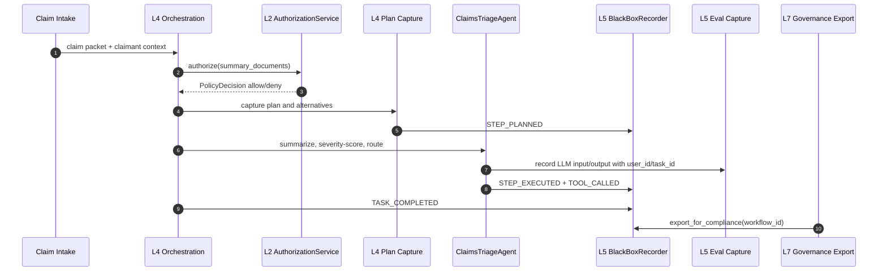
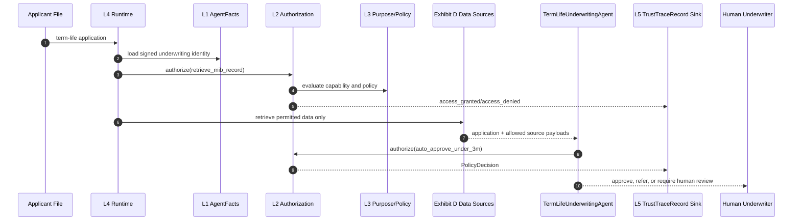
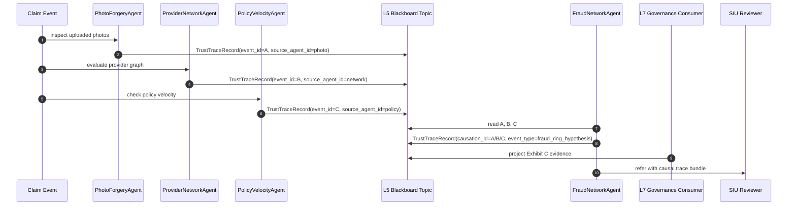

# NAIC Narrative: Insurance Agentic AI Mapping to the Four-Layer Architecture

**Model:** Gemini 3.1 Pro  
**Regulatory Basis:** NAIC AI Systems Evaluation Tool 4.0 (July 2025) & NAIC Model Bulletin on AI Systems (December 2023)  
**Implementation Substrate:** Four-Layer Architecture + Seven-Layer Trust Framework  

---

## §0 — Overview and Thesis

### The Governing Thought

The four NAIC exhibits are not four distinct reports to be manually compiled. They are four queries executed against a single, unified set of runtime artifacts.

The existing mapping guide provides a compact matrix relating NAIC exhibits to the seven-layer trust framework. This document elevates that analysis into a narrative. It demonstrates how the Four-Layer Architecture, its governance services, and the trust kernel emit the necessary evidence organically as the system operates, illustrated through three real-world insurance scenarios.

The regulatory landscape has matured. The NAIC AI Systems Evaluation Tool 4.0 has shifted from a rigid checklist to a principle-based, tailorable assessment. Simultaneously, the December 2023 Model Bulletin mandates a documented AI System (AIS) Program encompassing governance, risk controls, auditability, and lifecycle coverage. A static spreadsheet might suffice for a point-in-time audit, but continuous compliance requires runtime evidence.

The complication arises from the dynamic nature of agentic AI. Unlike a static predictive model, an agent plans, invokes tools, delegates subtasks, and routes decisions. An underwriting agent synthesizes internal policy with third-party data under strict authorization boundaries. A fraud detection system may involve multiple agents coordinating via an event stream. 

The core question is: How does a carrier generate defensible evidence for each NAIC exhibit without constructing a parallel, burdensome compliance bureaucracy?

The answer lies in the architecture: identity, authorization, purpose, plan capture, black box recording, certification, and lifecycle governance must emit artifacts intrinsically as the agent executes.

### The Four Exhibits as Runtime Queries

*   **Exhibit A — AI Inventory:** A query against signed `AgentFacts` records, retrieving declared capabilities, policies, owners, versions, lifecycle states, and operational domains.
*   **Exhibit B — Governance:** A query against lifecycle decisions, governance events, certification statuses, vendor attestations, and board-level summaries.
*   **Exhibit C — High-Risk AI:** A query against runtime authorization logs, risk classifications, plan traces, guardrail outcomes, black box recordings, and drift tests.
*   **Exhibit D — Data:** A query against recorded inputs, data source provenance, third-party attestations, and lineage from source to decision.

The implementation substrate already provides the foundation for this evidence model:

```1:18:trust/models.py
class AgentFacts(BaseModel):
    """The agent identity card -- central model of Layer 1."""

    agent_id: str
    agent_name: str
    owner: str
    version: str
    description: str = ""
    capabilities: list[Capability] = Field(default_factory=list)
    policies: list[Policy] = Field(default_factory=list)
    signed_metadata: dict[str, Any] = Field(default_factory=dict)
    metadata: dict[str, Any] = Field(default_factory=dict)
    status: IdentityStatus = IdentityStatus.ACTIVE
    valid_until: datetime | None = None
    parent_agent_id: str | None = None
    signature_hash: str = ""
```

```1:22:trust/models.py
class TrustTraceRecord(BaseModel):
    """Cross-layer trace event (schema_version=2).

    Spec: docs/Architectures/FOUR_LAYER_ARCHITECTURE.md lines 197-209. The shared schema
    that makes cross-layer queries possible across the seven trust layers.

    Schema version 2 adds three multi-agent fields (event_id,
    source_agent_id, causation_id) for event correlation and causal tracing.
    """

    schema_version: int = 2
    event_id: str
    source_agent_id: str | None = None
    causation_id: str | None = None
    timestamp: datetime
    trace_id: str
    agent_id: str
    layer: TraceLayer
    event_type: str
    details: dict[str, Any] = Field(default_factory=dict)
    outcome: TraceOutcome | None = None
```

These two types form the carrier's evidence backbone: one defines authorized actors (`AgentFacts`), and the other records actions, context, and outcomes (`TrustTraceRecord`).

### Three Anchor Use Cases

| Use Case | NAIC Exhibits | Layer Emphasis | Real-World Anchor | Rationale |
| :--- | :--- | :--- | :--- | :--- |
| **Claims Triage (Auto BI)** | A, B, C, D | L4 Plan, L5 Black Box, L7 Lifecycle | RBC Clara, Swiss Re ClaimsGenAI | Claims triage carries high consumer impact, demanding deep Exhibit C evidence. |
| **Term-Life Underwriting** | A, C, D | L1 Identity, L2 Authorization, L3 Scope | Accelerated underwriting | Highlights Exhibit D (data lineage) and unfair-trade-practice controls. |
| **Fraud Ring Detection** | B, C | L5 Correlation, L7 Governance | Shift Technology | Forces multi-agent coordination and causal traceability. |

### Reader's Guide

This document is not a claim of production readiness for a regulated carrier, nor is it legal advice. It is a reference architecture demonstrating that a carrier should not wait for a regulatory request to collect Exhibit C evidence; the runtime must collect it continuously.

---

## §1 — Claims Triage Narrative

**Scenario:** A fictional carrier deploys a `ClaimsTriageAgent` for auto bodily-injury claims.
**NAIC Emphasis:** Exhibit A (Inventory), Exhibit B (Governance), Exhibit C (High-Risk AI), Exhibit D (Data).

### The Incident That Changes the Design

Consider a claims automation demo. The agent triages an auto bodily-injury claim, summarizes medical notes, checks coverage, estimates severity, and routes the file to a senior adjuster. The demo team shows the final recommendation, the prompt, and some logs.

Then, the critical regulatory question arises: *"Why did this claim avoid straight-through processing, and what specific data did the agent rely on?"*

At that moment, the claims agent is recognized as an Exhibit C system. It impacts a consumer's claim path, processes medical facts, and evaluates coverage. A generic chat log is insufficient. The answer must be derived from immutable runtime evidence.

### The Runtime Story

The `ClaimsTriageAgent` operates under a signed identity. This identity explicitly declares its capabilities: triage claims, summarize documents, score severity, and recommend routing. Crucially, it lacks the capability to deny a claim or send adverse communications.

As the request enters orchestration, the runtime trust gate verifies the agent's capabilities and policies before any tool executes. The plan builder records the rationale for selected steps. The phase logger captures decision logic. The black box records each step with a cryptographic integrity hash. Eval capture logs LLM inputs and outputs, tied to user and task identifiers.

When a NAIC request arrives, the compliance team exports an evidence bundle generated organically by the workflow, rather than reconstructing a narrative from disparate logs.

```1:19:services/governance/black_box.py
class BlackBoxRecorder:
    def __init__(self, storage_dir: Path | str) -> None:
        self._storage_dir = Path(storage_dir)
        self._last_hash: dict[str, str] = {}

    def record(self, event: TraceEvent) -> None:
        wf_dir = self._storage_dir / event.workflow_id
        wf_dir.mkdir(parents=True, exist_ok=True)
        trace_file = wf_dir / "trace.jsonl"

        prev_hash = self._last_hash.get(event.workflow_id, "0" * 64)
        event_data = event.model_dump(mode="json")
        event_data.pop("integrity_hash", None)
        payload = json.dumps(event_data, sort_keys=True, default=str) + prev_hash
        integrity_hash = hashlib.sha256(payload.encode()).hexdigest()

        event_data["integrity_hash"] = integrity_hash
        self._last_hash[event.workflow_id] = integrity_hash
```

The hash chain is vital. Exhibit C asks if the insurer can produce reliable testing and review evidence for high-risk AI. Continuous, tamper-evident accumulation is the strongest response.

### Sequence View



*   **Exhibit A:** Agent identity and declared purpose exist prior to execution.
*   **Exhibit B:** The workflow links to lifecycle and governance decisions.
*   **Exhibit C:** Authorization decisions, guardrails, routing rationale, and black box traces explain high-risk behavior.
*   **Exhibit D:** Claim artifacts are represented as recorded inputs (joining to a data-source registry is a planned enhancement).

### Illustrative Agent Shape

```python
# Illustrative — does not yet exist in this workspace.

from dataclasses import dataclass
from typing import Any

from services.authorization_service import AuthorizationService
from services.governance.black_box import BlackBoxRecorder, EventType, TraceEvent
from services.governance.phase_logger import Decision, PhaseLogger, WorkflowPhase
from trust.models import AgentFacts

@dataclass(frozen=True)
class ClaimsPacket:
    claim_id: str
    policy_id: str
    claimant_state: str
    documents: list[dict[str, Any]]
    data_sources: list[str]

class ClaimsTriageAgent:
    def __init__(
        self,
        facts: AgentFacts,
        authorization: AuthorizationService,
        phase_logger: PhaseLogger,
        black_box: BlackBoxRecorder,
    ) -> None:
        self._facts = facts
        self._authorization = authorization
        self._phase_logger = phase_logger
        self._black_box = black_box

    def triage(self, packet: ClaimsPacket, *, workflow_id: str, trace_id: str) -> dict[str, Any]:
        decision = self._authorization.authorize(
            self._facts,
            "triage_claim",
            {"claim_id": packet.claim_id, "source_count": len(packet.data_sources)},
            trace_id=trace_id,
        )
        if not decision.allowed:
            return {"route": "human_review", "reason": decision.reason}

        self._phase_logger.log_decision(
            workflow_id,
            Decision(
                phase=WorkflowPhase.ROUTING,
                description="Route bodily-injury claim for severity review",
                alternatives=["straight_through", "standard_adjuster", "senior_adjuster"],
                rationale="Medical-document complexity and injury severity require senior review.",
                confidence=0.82,
            ),
        )

        return {"route": "senior_adjuster", "requires_adverse_action_review": False}
```

---

## §2 — Underwriting Narrative

**Scenario:** A fictional carrier deploys a `TermLifeUnderwritingAgent` with a $3M auto-approval ceiling.
**NAIC Emphasis:** Exhibit A (Inventory), Exhibit C (High-Risk AI), Exhibit D (Data Lineage).

### The Underwriting Question

Underwriting operationalizes AI governance. A term-life underwriting agent verifies identity, ingests third-party data, evaluates medical/financial signals, and recommends an outcome. It shapes the consumer's path, potentially delaying coverage or utilizing proxy variables that introduce unfair-discrimination risk.

The carrier seeks faster decisions for low-risk applicants. However, speed relies on data (credit attributes, MIB records, telematics), making Exhibit D critical. Each data source requires provenance, permission, and purpose.

The question is: How does the carrier prove the agent only utilized authorized data for an authorized action? The solution is to frame underwriting as a runtime authorization problem, not merely a prompt instruction.

### Identity Before Data

The underwriting agent must possess a signed identity declaring its owner, version, capabilities, policies, and risk classification. The trust model separates signed metadata from operational metadata. For underwriting, high-risk classification and data-source permissions must be signed fields, ensuring they are enforceable at runtime.

### Authorization as the Underwriting Ring

The runtime trust gate evaluates every action against the agent's identity, emitting a `PolicyDecision` and a `TrustTraceRecord`.

```1:18:services/authorization_service.py
class EmbeddedPolicyBackend:
    def evaluate(
        self,
        facts: AgentFacts,
        action: str,
        context: dict,
    ) -> PolicyDecision:
        if facts.status == IdentityStatus.SUSPENDED:
            return _decision(
                "deny",
                reason="suspended identity",
                audit_entry={"check": "status", "status": facts.status.value},
            )
        # ... checks for revocation, expiration, capabilities, and policies ...
```

This architectural decision ensures that restrictions (e.g., "do not use credit data for this applicant") are enforced at the runtime level, not just as advisory prompt text.

### Sequence View



### Exhibit D: The Hard Part

The runtime must answer:
*   Which data source was requested?
*   Was it internal or third-party?
*   Which contract/consent authorized it?
*   Which action utilized the source, and what decision did it influence?

Current eval capture records inputs and outputs, but a robust Exhibit D response requires a dedicated `DataSourceRecord` trust type and a data lineage service (identified as a gap in §5). Until implemented, the architecture must remain conservative: deny source access unless explicitly authorized and traceable.

---

## §3 — Fraud Detection Narrative

**Scenario:** A multi-agent fraud-ring detector across claims, policy, payment, and document evidence.
**NAIC Emphasis:** Exhibit B (Governance), Exhibit C (High-Risk AI), Cross-Agent Traceability.

### Why Fraud Forces Multi-Agent Evidence

Fraud detection often requires synthesizing signals across multiple domains. A single claim may appear normal, but patterns across multiple claims, policies, and providers reveal fraud rings. Specialized agents (e.g., `PhotoForgeryAgent`, `ProviderNetworkAgent`) must collaborate.

Architecturally, a peer-to-peer mesh creates fragile trust assumptions and opaque causality. If a suspiciousness score triggers a Special Investigative Unit (SIU) referral, the carrier must explain the causal chain.

### The Blackboard Path

The Four-Layer Architecture defines an evolution toward a distributed event bus and blackboard pattern (Phase 3). For fraud detection:
*   Detectors publish `TrustTraceRecord` events to a shared topic.
*   Governance consumers build materialized views.
*   A fraud orchestrator reads the topic and dispatches follow-up actions.

This preserves the evidence chain. A fraud referral is a sequence of causally linked observations, supported by `TrustTraceRecord` v2 fields: `event_id`, `source_agent_id`, and `causation_id`.

### Sequence View



### Illustrative Event Flow

```python
# Illustrative — does not yet exist in this workspace.

from dataclasses import dataclass
from datetime import UTC, datetime
from typing import Callable
from uuid import uuid4

from trust.models import TrustTraceRecord

@dataclass(frozen=True)
class FraudSignal:
    claim_id: str
    signal_type: str
    confidence: float
    evidence_refs: list[str]

class FraudNetworkAgent:
    def __init__(self, agent_id: str, emit: Callable[[TrustTraceRecord], None]) -> None:
        self._agent_id = agent_id
        self._emit = emit

    def publish_hypothesis(
        self,
        signal: FraudSignal,
        *,
        trace_id: str,
        caused_by_event_id: str,
    ) -> str:
        event_id = str(uuid4())
        self._emit(
            TrustTraceRecord(
                event_id=event_id,
                source_agent_id=self._agent_id,
                causation_id=caused_by_event_id,
                timestamp=datetime.now(UTC),
                trace_id=trace_id,
                agent_id=self._agent_id,
                layer="L5",
                event_type="fraud_ring_hypothesis",
                details={
                    "claim_id": signal.claim_id,
                    "signal_type": signal.signal_type,
                    "confidence": signal.confidence,
                    "evidence_refs": signal.evidence_refs,
                },
                outcome="alert",
            )
        )
        return event_id
```

Causality is explicit: "This is suspicious because event A caused event D, and both are in the trace."

---

## §4 — Architectural Decisions

These decisions encode NAIC requirements into runtime architecture.

### Decision 1: Treat NAIC exhibits as runtime queries, not manual reports
**Alternative:** Maintain static governance spreadsheets.
**Rationale:** Manual evidence drifts. The highest-risk behaviors occur at runtime. `AgentFacts`, `AuthorizationService`, `TrustTraceRecord`, and `BlackBoxRecorder` must answer these queries dynamically.

### Decision 2: Make high-risk classification an authorization input
**Alternative:** Store risk classification as unsigned metadata or prompt instructions.
**Rationale:** Exhibit C demands high-risk controls. A label that doesn't alter runtime behavior is insufficient. Risk classification must be signed and evaluated by `AuthorizationService.authorize()`.

### Decision 3: Put data lineage beside trust evidence, not inside prompt logs
**Alternative:** Store source names in prompt text.
**Rationale:** Prompt text lacks structure. Exhibit D requires a `DataSourceRecord` and a dedicated lineage service to prove vendor origin, consent, and jurisdictional permission.

### Decision 4: Keep insurance-specific logic out of horizontal services
**Alternative:** Add claims/underwriting logic to authorization or eval capture.
**Rationale:** Horizontal services must remain domain-agnostic to ensure reusability. Insurance agents prepare context; horizontal services enforce generic controls.

### Decision 5: Use black box integrity for high-risk replay
**Alternative:** Rely on standard application logs.
**Rationale:** Standard logs lack tamper evidence. `BlackBoxRecorder` chains event hashes, enabling reliable replay of high-risk workflows for Exhibit C compliance.

### Decision 6: Preserve causal fields before building a distributed bus
**Alternative:** Build a distributed bus immediately without standardizing correlation.
**Rationale:** Standardizing `event_id`, `source_agent_id`, and `causation_id` in `TrustTraceRecord` v2 ensures an audit-ready event grammar exists before the transport mechanism scales.

### Decision 7: Name gaps as PR-sized work, not architecture debt
**Alternative:** Maintain a generic "compliance roadmap."
**Rationale:** Vague gaps hinder progress. Defining concrete, PR-sized actions accelerates hardening.

---

## §5 — Gaps and Actionable Plan

This section identifies gaps between the current implementation and a carrier-grade NAIC evidence program, translating them into PR-sized actions.

**Severity Key:**
*   **P0:** Required before regulated production use.
*   **P1:** Required for strong NAIC response and enterprise governance.
*   **P2:** Useful for reporting maturity.

### Gap Table

| ID | Gap | Severity | Owning Layer | Actionable PR |
| :--- | :--- | :--- | :--- | :--- |
| **N-1** | Consumer disclosure / adverse action surface | P0 | Horizontal + Frontend | Add `services/governance/consumer_disclosure.py` and a `middleware/adapters/disclosure_sender.py` adapter. |
| **N-2** | Bias / disparate impact testing | P0 | Meta-Layer | Add `meta/fairness_tester.py` to evaluate trace fixtures and emit `fairness_evaluated` events. |
| **N-3** | Vendor agent attestation pipeline | P0 | Trust Foundation + Horizontal | Add `vendor_attestation` to `AgentFacts` and create `services/governance/vendor_onboarding.py`. |
| **N-4** | Drift -> recertification trigger | P1 | Meta-Layer + Governance | Wire drift threshold breaches to emit `recertification_triggered` events. |
| **N-5** | ERM / ORSA risk register integration | P1 | Meta-Layer | Add `meta/compliance_reporter.py` with `export_orsa_section()`. |
| **N-6** | Board-level dashboard projection | P1 | Meta-Layer | Add `meta/board_dashboard.py` to project JSONL traces into Exhibit A/B/C/D summaries. |
| **N-7** | Data source registry & lineage | P0 | Trust Foundation + Horizontal | Add `DataSourceRecord` and `services/governance/data_lineage.py` for Exhibit D compliance. |
| **N-8** | High-risk classification as authorization ring | P0 | Trust Foundation + Auth | Promote risk classification to a signed field evaluated by `AuthorizationService`. |
| **N-9** | Recertification on version change | P1 | Governance Services | Add a handler to trigger recertification when `AgentFacts.version` changes. |
| **N-10** | Employee training record linkage | P1 | Governance Services | Add `services/governance/training_registry.py` and link to owner accountability. |
| **N-11** | Multi-state regulatory variation | P1 | Auth + Policy Backend | Extend policy context to include `jurisdiction`. |
| **N-12** | Pyramid agent defense-in-depth parity | P0 | StructuredReasoning | Wire output guardrails and per-tool authorization into the pyramid agent orchestration. |

### Implementation Priority

1.  **N-2 (Fairness Tester):** Can be built in `meta/` without altering runtime behavior.
2.  **N-1 (Consumer Disclosure):** Build the event builder and tests before delivery adapters.
3.  **N-7 (Data Lineage Service):** Define the service interface and access events before modifying trust-kernel types.
4.  **N-8 (High-Risk Authorization):** Requires a careful re-signing plan as it touches signed material.
5.  **N-12 (StructuredReasoning Parity):** Closes a critical defense-in-depth gap.

### Definition of Done

The architecture is NAIC-ready when it can dynamically generate:
*   **Exhibit A:** From signed identities and lifecycle states.
*   **Exhibit B:** From lifecycle, certification, and board projections.
*   **Exhibit C:** From authorization logs, guardrails, plan capture, black box recordings, and fairness tests.
*   **Exhibit D:** From the source registry, access traces, and contract references.
