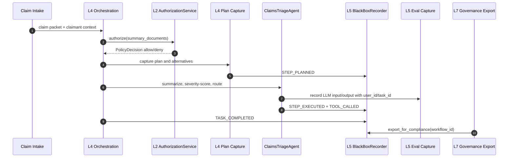

# Claims Triage Narrative

**Scenario:** A fictional carrier deploys a `ClaimsTriageAgent` for auto bodily-injury claims.

**NAIC emphasis:** Exhibit A inventory, Exhibit B governance, Exhibit C high-risk AI evidence, Exhibit D claims-data lineage.

---

## The Incident That Changes the Design

Last year, I watched a claims automation demo that looked polished until the first hard question arrived.

The agent had triaged an auto bodily-injury claim into expedited review. It summarized the medical notes, checked policy coverage, estimated severity, and routed the file to a senior adjuster. The demo team could show the final recommendation. They could show the prompt. They could show a few logs.

Then the claims executive asked the question a regulator would ask later: "Why did this claim avoid straight-through processing, and what data did the agent rely on?"

That is the moment a claims agent becomes an Exhibit C system. It affects a consumer claim path. It touches medical facts, coverage terms, severity estimates, and potentially fraud signals. A generic chat log is not enough.

The answer has to come from runtime evidence.

---

## The Runtime Story

The `ClaimsTriageAgent` starts with a signed identity. The identity declares that it can triage claims, summarize documents, score severity, and recommend routing. It cannot deny a claim. It cannot send an adverse communication. It cannot override the adjuster.

The request enters orchestration. Before a tool call executes, the runtime trust gate asks whether the agent has the capability and policy permission for that action. The plan builder records why the agent selected the steps it selected. The phase logger records decision rationale. The black box records each step with an integrity hash. Eval capture records LLM input/output under the user and task identifiers.

When the carrier later receives a NAIC request, the compliance team does not recreate the story from screenshots. It exports the evidence bundle for the workflow.

```44:64:services/governance/black_box.py
class BlackBoxRecorder:
    def __init__(self, storage_dir: Path | str) -> None:
        self._storage_dir = Path(storage_dir)
        self._last_hash: dict[str, str] = {}

    def record(self, event: TraceEvent) -> None:
        wf_dir = self._storage_dir / event.workflow_id
        wf_dir.mkdir(parents=True, exist_ok=True)
        trace_file = wf_dir / "trace.jsonl"

        prev_hash = self._last_hash.get(event.workflow_id, "0" * 64)
        event_data = event.model_dump(mode="json")
        event_data.pop("integrity_hash", None)
        payload = json.dumps(event_data, sort_keys=True, default=str) + prev_hash
        integrity_hash = hashlib.sha256(payload.encode()).hexdigest()

        event_data["integrity_hash"] = integrity_hash
        self._last_hash[event.workflow_id] = integrity_hash
```

The hash chain matters because Exhibit C is not just asking "what did the model say?" It is asking whether the insurer can produce reliable testing and review evidence for high-risk AI. The strongest evidence is accumulated continuously and protected against silent editing.

---

## Sequence View



**Exhibit A:** the agent identity and declared purpose exist before the claim runs.

**Exhibit B:** the workflow links to lifecycle and governance decisions.

**Exhibit C:** the plan, authorization decisions, guardrails, routing rationale, and black box trace explain the high-risk behavior.

**Exhibit D:** every claim artifact used by the workflow is represented as recorded input and should be joined to a data-source registry.

---

## What the Evidence Looks Like

The claims story has three evidence layers.

First, identity evidence:

```37:49:trust/models.py
class AgentFacts(BaseModel):
    """The agent identity card -- central model of Layer 1."""

    agent_id: str
    agent_name: str
    owner: str
    version: str
    description: str = ""
    capabilities: list[Capability] = Field(default_factory=list)
    policies: list[Policy] = Field(default_factory=list)
    signed_metadata: dict[str, Any] = Field(default_factory=dict)
    metadata: dict[str, Any] = Field(default_factory=dict)
    status: IdentityStatus = IdentityStatus.ACTIVE
```

Second, runtime decision evidence:

```32:38:services/governance/phase_logger.py
class Decision(BaseModel):
    phase: WorkflowPhase
    description: str
    alternatives: list[str]
    rationale: str
    confidence: float
```

Third, LLM-call evidence:

```20:49:services/eval_capture.py
async def record(
    target: str,
    ai_input: dict[str, Any],
    ai_response: Any,
    config: dict[str, Any],
    step: int = 0,
    model: str | None = None,
    tokens_in: int | None = None,
    tokens_out: int | None = None,
    cost_usd: float | None = None,
    latency_ms: float | None = None,
) -> None:
    """Build an eval record dict and emit via the eval_capture logger."""
    configurable = config.get("configurable", {})
    eval_record = {
        "schema_version": 1,
        "timestamp": datetime.now(UTC).isoformat(),
        "task_id": configurable.get("task_id", ""),
        "user_id": configurable.get("user_id", "anonymous"),
        "step": step,
        "target": target,
```

Together, those artifacts are more defensible than a narrative written after the fact.

---

## Illustrative Agent Shape

This code is illustrative. It does not yet exist in the workspace. The important point is placement: the claims-specific agent belongs in a vertical component or application layer, while identity, authorization, prompt rendering, eval capture, and black box recording stay in horizontal services.

```python
# Illustrative -- does not yet exist in this workspace.

from dataclasses import dataclass
from typing import Any

from services.authorization_service import AuthorizationService
from services.governance.black_box import BlackBoxRecorder, EventType, TraceEvent
from services.governance.phase_logger import Decision, PhaseLogger, WorkflowPhase
from trust.models import AgentFacts


@dataclass(frozen=True)
class ClaimsPacket:
    claim_id: str
    policy_id: str
    claimant_state: str
    documents: list[dict[str, Any]]
    data_sources: list[str]


class ClaimsTriageAgent:
    def __init__(
        self,
        facts: AgentFacts,
        authorization: AuthorizationService,
        phase_logger: PhaseLogger,
        black_box: BlackBoxRecorder,
    ) -> None:
        self._facts = facts
        self._authorization = authorization
        self._phase_logger = phase_logger
        self._black_box = black_box

    def triage(self, packet: ClaimsPacket, *, workflow_id: str, trace_id: str) -> dict[str, Any]:
        decision = self._authorization.authorize(
            self._facts,
            "triage_claim",
            {"claim_id": packet.claim_id, "source_count": len(packet.data_sources)},
            trace_id=trace_id,
        )
        if not decision.allowed:
            return {"route": "human_review", "reason": decision.reason}

        self._phase_logger.log_decision(
            workflow_id,
            Decision(
                phase=WorkflowPhase.ROUTING,
                description="Route bodily-injury claim for severity review",
                alternatives=["straight_through", "standard_adjuster", "senior_adjuster"],
                rationale="Medical-document complexity and injury severity require senior review.",
                confidence=0.82,
            ),
        )

        # The real implementation would record typed TraceEvent instances for each step.
        return {"route": "senior_adjuster", "requires_adverse_action_review": False}
```

---

## NAIC Answer

If a regulator asks "show me the claims AI system," the carrier starts from `AgentFacts`.

If the regulator asks "show me governance," the carrier exports lifecycle and phase decisions.

If the regulator asks "show me the high-risk logic," the carrier exports plan capture, authorization decisions, black box events, and eval records.

If the regulator asks "show me the data," the carrier joins eval input records to source provenance. That last join is still a gap; it is named in [05_gaps_and_actionable_plan.md](05_gaps_and_actionable_plan.md).
