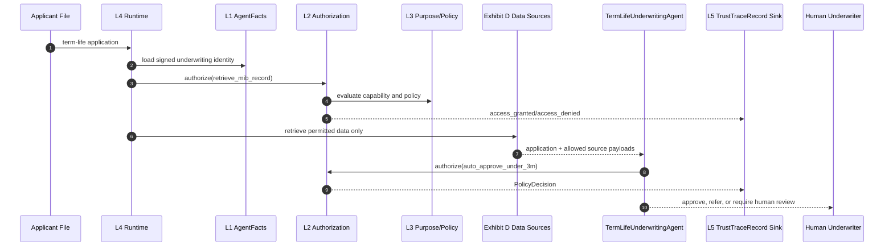

# Underwriting Narrative

**Scenario:** A fictional carrier deploys a `TermLifeUnderwritingAgent` for accelerated term-life underwriting with a $3M auto-approval ceiling.

**NAIC emphasis:** Exhibit A inventory, Exhibit C high-risk controls, Exhibit D data lineage.

---

## The Underwriting Question

Underwriting is where the phrase "AI governance" stops being abstract.

A term-life underwriting agent may read an application, verify identity, ingest third-party data, retrieve policy rules, evaluate medical and financial signals, and recommend approval, referral, or decline. Even if the final decline is human-reviewed, the agent shapes the path. It can delay coverage. It can prioritize one applicant over another. It can use proxy variables that create unfair-discrimination risk.

The situation is simple: the carrier wants faster decisions for low-risk applicants.

The complication is that speed comes from data, and data is where Exhibit D becomes uncomfortable. Credit attributes, MIB records, prescription history, telematics, and external vendor scores each need provenance, permission, and purpose.

The question is: how does the carrier prove the agent only used authorized data for an authorized underwriting action?

The answer is to make underwriting a runtime authorization problem, not a prompt instruction.

---

## Identity Before Data

The underwriting agent cannot run as a loose script. It must have a signed identity that declares its owner, version, capabilities, policies, and risk classification.

The current trust model already separates signed metadata from operational metadata:

```37:56:trust/models.py
class AgentFacts(BaseModel):
    """The agent identity card -- central model of Layer 1."""

    agent_id: str
    agent_name: str
    owner: str
    version: str
    description: str = ""
    capabilities: list[Capability] = Field(default_factory=list)
    policies: list[Policy] = Field(default_factory=list)
    signed_metadata: dict[str, Any] = Field(default_factory=dict)
    metadata: dict[str, Any] = Field(default_factory=dict)
    status: IdentityStatus = IdentityStatus.ACTIVE
    valid_until: datetime | None = None
    parent_agent_id: str | None = None
    signature_hash: str = ""
    created_at: datetime = Field(default_factory=lambda: datetime.now(UTC))
    updated_at: datetime = Field(default_factory=lambda: datetime.now(UTC))

    model_config = ConfigDict(frozen=True)
```

For underwriting, the signed fields should eventually include a high-risk classification and data-source permissions. Today, that is a named gap, because a risk classification hidden in unsigned metadata is too weak for NAIC Exhibit C.

---

## Authorization as the Underwriting Ring

The runtime trust gate evaluates every action against the agent identity. It checks identity status, expiration, capabilities, and policies. It emits a `PolicyDecision` and a `TrustTraceRecord`.

```71:138:services/authorization_service.py
class EmbeddedPolicyBackend:
    """Evaluates `facts.status`, `facts.valid_until`, `facts.capabilities`,
    and `facts.policies` directly. Pure function; no I/O.

    Policy rule format (v1; per Q-A5 exact match only):

        Policy(name=..., rules={"action": <action>, "enforcement": <enforce>})

    where `<enforce>` is one of `allow`, `deny`, `require_approval`,
    `throttle`. A policy with no `action` key applies to every action.
    """

    def evaluate(
        self,
        facts: AgentFacts,
        action: str,
        context: dict,
    ) -> PolicyDecision:
        if facts.status == IdentityStatus.SUSPENDED:
            return _decision(
                "deny",
                reason="suspended identity",
                audit_entry={"check": "status", "status": facts.status.value},
            )
        # ... existing checks for revocation, expiration, capabilities, and policies ...
```

That is the architectural move that matters. "The model should not use credit data for this applicant" is too soft. "The `retrieve_credit_summary` action is denied unless the signed identity and policy permit it" is enforceable.

```223:249:services/authorization_service.py
    def _emit_trace(
        self,
        facts: AgentFacts,
        action: str,
        decision: PolicyDecision,
        *,
        trace_id: str | None = None,
    ) -> None:
        if self._trace_emit is None:
            return
        outcome = "pass" if decision.enforcement == "allow" else "fail"
        event_type = "access_granted" if decision.enforcement == "allow" else "access_denied"
        record = TrustTraceRecord(
            event_id=str(uuid.uuid4()),
            timestamp=datetime.now(UTC),
            trace_id=trace_id or str(uuid.uuid4()),
            agent_id=facts.agent_id,
            layer="L4",
            event_type=event_type,
            details={
                "action": action,
                "enforcement": decision.enforcement,
                "reason": decision.reason,
                "backend": decision.backend,
            },
            outcome=outcome,
        )
```

For a regulator, that trace is the difference between "we trained staff not to do that" and "the runtime denied it."

---

## Sequence View



**Exhibit A:** `AgentFacts` provides the inventory entry: owner, purpose, capabilities, version, and status.

**Exhibit C:** `AuthorizationService` proves high-risk actions are gated at runtime.

**Exhibit D:** each data-source action should emit provenance and contract references. The workspace records call inputs today, but the richer data-source registry remains a gap.

---

## Illustrative Agent Shape

This code is illustrative and does not exist yet. It shows the right dependency shape: underwriting logic receives identity and horizontal services; it does not fetch them from peer services or hide authorization in prompt text.

```python
# Illustrative -- does not yet exist in this workspace.

from dataclasses import dataclass
from typing import Any

from services.authorization_service import AuthorizationService
from trust.models import AgentFacts


@dataclass(frozen=True)
class UnderwritingApplication:
    application_id: str
    face_amount_usd: int
    applicant_age: int
    jurisdiction: str
    requested_sources: list[str]


class TermLifeUnderwritingAgent:
    def __init__(self, facts: AgentFacts, authorization: AuthorizationService) -> None:
        self._facts = facts
        self._authorization = authorization

    def evaluate(
        self,
        application: UnderwritingApplication,
        *,
        trace_id: str,
    ) -> dict[str, Any]:
        if application.face_amount_usd > 3_000_000:
            return {"decision": "refer", "reason": "face amount exceeds auto-approval ceiling"}

        decision = self._authorization.authorize(
            self._facts,
            "auto_approve_term_life",
            {
                "application_id": application.application_id,
                "jurisdiction": application.jurisdiction,
                "requested_sources": application.requested_sources,
            },
            trace_id=trace_id,
        )
        if not decision.allowed:
            return {"decision": "refer", "reason": decision.reason}

        return {
            "decision": "approve_or_refer_after_scoring",
            "requires_human_review": application.applicant_age >= 50,
        }
```

---

## Exhibit D: The Hard Part

The underwriting agent is the clearest example of why Exhibit D cannot be treated as a logging afterthought.

The runtime needs to answer:

- Which data source was requested?
- Was the source internal or third-party?
- Which contract, consent, or privacy review authorized that source?
- Which action used the source?
- Which decision did the source influence?
- Was the source permitted in the applicant's jurisdiction?

The current `eval_capture.record()` function records user, task, target, input, output, and model metadata. That is useful, but not enough for insurance data lineage. The gap plan proposes a `DataSourceRecord` trust type and a `services/governance/data_lineage.py` service to make Exhibit D a first-class query.

Until that exists, underwriting is the use case where the architecture should be conservative: no source access unless the policy can explain it and the trace can prove it.
