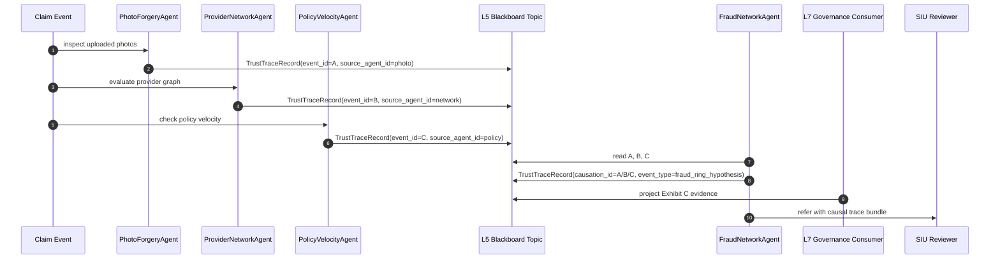

# Fraud Detection Narrative

**Scenario:** A fictional carrier deploys a multi-agent fraud-ring detector across claims, policy, payment, and document evidence.

**NAIC emphasis:** Exhibit B governance, Exhibit C high-risk AI controls, and cross-agent traceability.

---

## Why Fraud Forces Multi-Agent Evidence

Fraud detection is different from claims triage and underwriting because the useful signal often lives between records.

One claim looks ordinary. Five claims across three repair shops, two policies, one mailing address, and a repeated medical provider pattern look different. A forged photo, a ghost broker, a synthetic identity, and a staged accident may each require a specialized detector. The fraud decision emerges from the network.

The situation is familiar to carriers: fraud teams want a system that detects rings early.

The complication is architectural. If every detector calls every other detector, the system becomes a peer-to-peer mesh of fragile trust assumptions. If every detector writes unstructured observations, governance cannot reconstruct causality. If a suspiciousness score triggers an SIU referral, the carrier has to explain which agent caused the escalation.

The question is: how do multiple agents collaborate without losing auditability?

The answer in the Four-Layer Architecture is event correlation first, distributed coordination later.

---

## The Current Readiness Point

The current runtime is not a full multi-agent fraud platform. The architecture is honest about that.

What it already has is the event envelope needed for future multi-agent causality. `TrustTraceRecord` schema version 2 includes `event_id`, `source_agent_id`, and `causation_id`.

```108:129:trust/models.py
class TrustTraceRecord(BaseModel):
    """Cross-layer trace event (schema_version=2).

    Spec: docs/Architectures/FOUR_LAYER_ARCHITECTURE.md lines 197-209. The shared schema
    that makes cross-layer queries possible across the seven trust layers.

    Schema version 2 adds three multi-agent fields (event_id,
    source_agent_id, causation_id) for event correlation and causal tracing.
    """

    schema_version: int = 2
    event_id: str
    source_agent_id: str | None = None
    causation_id: str | None = None
    timestamp: datetime
    trace_id: str
    agent_id: str
    layer: TraceLayer
    event_type: str
    details: dict[str, Any] = Field(default_factory=dict)
    outcome: TraceOutcome | None = None
```

That means a future `PhotoForgeryAgent`, `ProviderNetworkAgent`, `PolicyVelocityAgent`, and `PaymentAnomalyAgent` can publish observations into one trace fabric without importing from one another.

---

## The Blackboard Path

The [Four-Layer Architecture](../FOUR_LAYER_ARCHITECTURE.md) defines a three-phase event migration. Phase 1 is direct method calls. Phase 2 is an in-process event bus. Phase 3 is a distributed event bus and blackboard pattern.

For fraud detection, the blackboard is the right long-term shape:

- each detector publishes `TrustTraceRecord` events;
- governance consumers build materialized fleet views;
- the fraud orchestrator reads the shared topic and dispatches follow-up work;
- agents do not need peer discovery or direct trust handshakes for every collaboration.

That matters for NAIC because it preserves the evidence chain. A fraud referral is not just a score. It is a sequence of causally linked observations.

---

## Sequence View



**Exhibit B:** governance can show which controls subscribe to fraud events and who owns the escalation process.

**Exhibit C:** the high-risk fraud referral is traceable through causation IDs, authorization decisions, and detector-level event outcomes.

---

## Illustrative Event Flow

This code is illustrative and does not yet exist in the workspace. It shows the target style for a future fraud detector: publish observations as trust records, not as direct peer calls.

```python
# Illustrative -- does not yet exist in this workspace.

from dataclasses import dataclass
from datetime import UTC, datetime
from typing import Callable
from uuid import uuid4

from trust.models import TrustTraceRecord


@dataclass(frozen=True)
class FraudSignal:
    claim_id: str
    signal_type: str
    confidence: float
    evidence_refs: list[str]


class FraudNetworkAgent:
    def __init__(self, agent_id: str, emit: Callable[[TrustTraceRecord], None]) -> None:
        self._agent_id = agent_id
        self._emit = emit

    def publish_hypothesis(
        self,
        signal: FraudSignal,
        *,
        trace_id: str,
        caused_by_event_id: str,
    ) -> str:
        event_id = str(uuid4())
        self._emit(
            TrustTraceRecord(
                event_id=event_id,
                source_agent_id=self._agent_id,
                causation_id=caused_by_event_id,
                timestamp=datetime.now(UTC),
                trace_id=trace_id,
                agent_id=self._agent_id,
                layer="L5",
                event_type="fraud_ring_hypothesis",
                details={
                    "claim_id": signal.claim_id,
                    "signal_type": signal.signal_type,
                    "confidence": signal.confidence,
                    "evidence_refs": signal.evidence_refs,
                },
                outcome="alert",
            )
        )
        return event_id
```

The important choice is that causality is explicit. The fraud agent does not merely say "I think this is suspicious." It says "I think this is suspicious because event A caused event D, and both are in the trace."

---

## Current Supporting Artifact

The durable JSONL sink is already shaped for append-only trust records:

```22:63:services/trace_sinks/jsonl_sink.py
class JsonlTraceSink:
    """Append-only JSONL sink with fsync-on-emit.

    Raises ``FileNotFoundError`` at construction if the parent directory
    does not exist (fail-fast, not fail-on-first-emit).
    """

    name: str

    def __init__(self, path: Path | str) -> None:
        self._path = Path(path)
        if not self._path.parent.exists():
            raise FileNotFoundError(
                f"Parent directory does not exist: {self._path.parent}"
            )
        self.name = f"jsonl_durable:{self._path.name}"

    def emit(self, record: TrustTraceRecord) -> None:
        if not isinstance(record, TrustTraceRecord):
            raise TypeError(
                f"JsonlTraceSink.emit requires a TrustTraceRecord, "
                f"got {type(record).__name__}"
            )
        line = record.model_dump_json()
        fd = os.open(str(self._path), os.O_WRONLY | os.O_CREAT | os.O_APPEND)
```

That is enough for a single-node evidence log. It is not enough for a carrier-wide fraud blackboard. The target PR path is to keep `TrustTraceRecord` stable while swapping the transport.

---

## NAIC Answer

For fraud detection, the strongest regulatory answer is not "the model flagged fraud." It is "the SIU referral was caused by these detector events, from these signed agents, with these policies, under this governance workflow."

That answer requires three properties:

- signed agent identities for every detector;
- causal event fields on every cross-agent observation;
- an append-only blackboard that governance can project into audit views.

The workspace has the first two foundations and a local JSONL sink. The distributed blackboard remains a Phase 3 gap, which is exactly where it belongs until there is a real multi-agent fleet.
