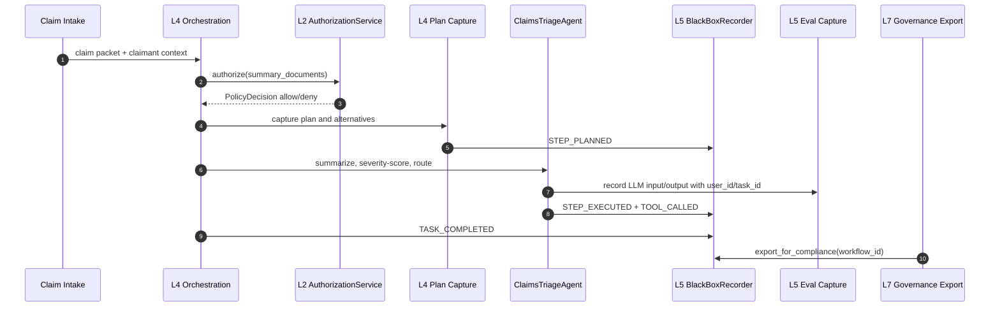
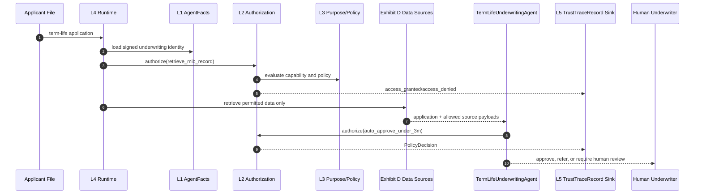
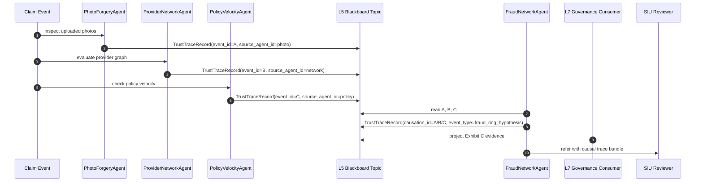

# NAIC Narrative: Insurance Agentic AI Mapping to the Four-Layer Architecture

**Model:** Claude Sonnet 4.6
**Regulatory basis:** NAIC AI Systems Evaluation Tool 4.0 (July 2025) + NAIC Model Bulletin on AI Systems (December 2023)
**Implementation substrate:** Four-Layer Architecture + Seven-Layer Trust Framework ([naic_seven_layer_mapping_guide.md](naic_seven_layer_mapping_guide.md))
**Companion:** For interview talking points and the compact exhibit matrix, read the guide above first. For PR-sized work items, jump to §6.

---

## §0 — Overview and Thesis

### The Governing Thought

The four NAIC exhibits are not four reports. They are four queries against one set of runtime artifacts.

The compact mapping guide already maps NAIC exhibits to the seven-layer trust framework. This document takes the next step. It walks through three insurance scenarios and shows what evidence the [Four-Layer Architecture](FOUR_LAYER_ARCHITECTURE.md), the governance services, and the trust kernel would emit as work happens.

The situation has changed since the first wave of AI governance decks. The NAIC AI Systems Evaluation Tool 4.0 frames the assessment as principle-based and tailorable. The December 2023 Model Bulletin asks insurers to maintain a documented AI System program across governance, risk controls, auditability, lifecycle coverage, vendor oversight, and unfair-trade-practice controls. A static spreadsheet can answer the first request once. Runtime evidence answers the second request continuously.

The complication is that agentic AI does not behave like a single model card. A claims agent plans, calls tools, changes parameters, delegates subtasks, and may route a decision to a human. An underwriting agent mixes internal policy, third-party data, signed identity, and authorization. A fraud detector may involve multiple agents coordinating through an event stream.

The question is: where does a carrier get defensible evidence for each NAIC exhibit without creating a parallel compliance bureaucracy?

The answer in this workspace is: identity, authorization, purpose, plan capture, black box recording, certification, and lifecycle governance all emit artifacts while the agent runs.

### The Four Exhibits as Runtime Queries

**Exhibit A — AI Inventory.** Query signed `AgentFacts` records, declared capabilities, policies, owner, version, lifecycle state, deployment age, and operational domain.

**Exhibit B — Governance.** Query lifecycle decisions, governance events, certification status, owner accountability, policy bindings, training references, vendor attestations, and board-level summaries.

**Exhibit C — High-Risk AI.** Query runtime authorization, risk classification, plan traces, guardrail outcomes, black box recordings, drift tests, compliance reviews, and recertification events.

**Exhibit D — Data.** Query recorded inputs, data source provenance, third-party source attestations, prompt/template versions, model tier, user/task identifiers, and lineage from source to decision.

The implementation substrate already has the start of that evidence model:

```37:52:trust/models.py
class AgentFacts(BaseModel):
    """The agent identity card -- central model of Layer 1."""

    agent_id: str
    agent_name: str
    owner: str
    version: str
    description: str = ""
    capabilities: list[Capability] = Field(default_factory=list)
    policies: list[Policy] = Field(default_factory=list)
    signed_metadata: dict[str, Any] = Field(default_factory=dict)
    metadata: dict[str, Any] = Field(default_factory=dict)
    status: IdentityStatus = IdentityStatus.ACTIVE
    valid_until: datetime | None = None
    parent_agent_id: str | None = None
    signature_hash: str = ""
```

```108:129:trust/models.py
class TrustTraceRecord(BaseModel):
    """Cross-layer trace event (schema_version=2).

    Spec: docs/Architectures/FOUR_LAYER_ARCHITECTURE.md lines 197-209. The shared schema
    that makes cross-layer queries possible across the seven trust layers.

    Schema version 2 adds three multi-agent fields (event_id,
    source_agent_id, causation_id) for event correlation and causal tracing.
    """

    schema_version: int = 2
    event_id: str
    source_agent_id: str | None = None
    causation_id: str | None = None
    timestamp: datetime
    trace_id: str
    agent_id: str
    layer: TraceLayer
    event_type: str
    details: dict[str, Any] = Field(default_factory=dict)
    outcome: TraceOutcome | None = None
```

Those two types are the carrier's evidence backbone: one says "who is allowed to act," the other says "what happened, under which layer, and with which outcome."

### Three Use Cases

| Use case | NAIC exhibits | Layer emphasis | Real-world pattern | Why it matters |
|---|---|---|---|---|
| Claims triage for auto bodily injury | A, B, C, D | L4 plan, L5 black box, L7 lifecycle | Claims intake copilots and fraud-aware triage tools | Claims is where explainability has the highest consumer-impact pressure. |
| Term-life underwriting with a $3M auto-approval ceiling | A, C, D | L1 identity, L2 authorization, L3 declared scope | Accelerated underwriting and lead-underwriting agents | Underwriting makes the data-lineage and unfair-discrimination question concrete. |
| Fraud-ring detection across claims and policies | B, C | L5 cross-agent correlation, Phase 3 blackboard | Network fraud analytics and synthetic/forged evidence detection | Fraud forces multi-agent evidence and causal traceability. |

Each use case is fictional, but each is anchored in production-shaped insurance patterns: claims GenAI, accelerated underwriting, and network fraud detection.

### What This Document Is Not

This is not a claim that the reference implementation is production-ready for a regulated carrier. It is a reference architecture and evidence model.

It is not legal advice. It translates public NAIC-style requirements into software architecture obligations.

The strongest statement this document makes is narrower and more useful: a carrier should not wait until a regulator asks for Exhibit C to start collecting Exhibit C evidence. The runtime should be collecting it already.

---

## §1 — Claims Triage Narrative

**Scenario:** A fictional carrier deploys a `ClaimsTriageAgent` for auto bodily-injury claims.

**NAIC emphasis:** Exhibit A inventory, Exhibit B governance, Exhibit C high-risk AI evidence, Exhibit D claims-data lineage.

### The Incident That Changes the Design

Last year, I watched a claims automation demo that looked polished until the first hard question arrived.

The agent had triaged an auto bodily-injury claim into expedited review. It summarized the medical notes, checked policy coverage, estimated severity, and routed the file to a senior adjuster. The demo team could show the final recommendation. They could show the prompt. They could show a few logs.

Then the claims executive asked the question a regulator would ask later: "Why did this claim avoid straight-through processing, and what data did the agent rely on?"

That is the moment a claims agent becomes an Exhibit C system. It affects a consumer claim path. It touches medical facts, coverage terms, severity estimates, and potentially fraud signals. A generic chat log is not enough.

The answer has to come from runtime evidence.

### The Runtime Story

The `ClaimsTriageAgent` starts with a signed identity. The identity declares that it can triage claims, summarize documents, score severity, and recommend routing. It cannot deny a claim. It cannot send an adverse communication. It cannot override the adjuster.

The request enters orchestration. Before a tool call executes, the runtime trust gate asks whether the agent has the capability and policy permission for that action. The plan builder records why the agent selected the steps it selected. The phase logger records decision rationale. The black box records each step with an integrity hash. Eval capture records LLM input/output under the user and task identifiers.

When the carrier later receives a NAIC request, the compliance team does not recreate the story from screenshots. It exports the evidence bundle for the workflow.

```44:64:services/governance/black_box.py
class BlackBoxRecorder:
    def __init__(self, storage_dir: Path | str) -> None:
        self._storage_dir = Path(storage_dir)
        self._last_hash: dict[str, str] = {}

    def record(self, event: TraceEvent) -> None:
        wf_dir = self._storage_dir / event.workflow_id
        wf_dir.mkdir(parents=True, exist_ok=True)
        trace_file = wf_dir / "trace.jsonl"

        prev_hash = self._last_hash.get(event.workflow_id, "0" * 64)
        event_data = event.model_dump(mode="json")
        event_data.pop("integrity_hash", None)
        payload = json.dumps(event_data, sort_keys=True, default=str) + prev_hash
        integrity_hash = hashlib.sha256(payload.encode()).hexdigest()

        event_data["integrity_hash"] = integrity_hash
        self._last_hash[event.workflow_id] = integrity_hash
```

The hash chain matters because Exhibit C is not just asking "what did the model say?" It is asking whether the insurer can produce reliable testing and review evidence for high-risk AI. The strongest evidence is accumulated continuously and protected against silent editing.

### Sequence View



**Exhibit A:** the agent identity and declared purpose exist before the claim runs.

**Exhibit B:** the workflow links to lifecycle and governance decisions.

**Exhibit C:** the plan, authorization decisions, guardrails, routing rationale, and black box trace explain the high-risk behavior.

**Exhibit D:** every claim artifact used by the workflow is represented as recorded input and should be joined to a data-source registry.

### What the Evidence Looks Like

The claims story has three evidence layers.

First, identity evidence:

```37:49:trust/models.py
class AgentFacts(BaseModel):
    """The agent identity card -- central model of Layer 1."""

    agent_id: str
    agent_name: str
    owner: str
    version: str
    description: str = ""
    capabilities: list[Capability] = Field(default_factory=list)
    policies: list[Policy] = Field(default_factory=list)
    signed_metadata: dict[str, Any] = Field(default_factory=dict)
    metadata: dict[str, Any] = Field(default_factory=dict)
    status: IdentityStatus = IdentityStatus.ACTIVE
```

Second, runtime decision evidence:

```32:38:services/governance/phase_logger.py
class Decision(BaseModel):
    phase: WorkflowPhase
    description: str
    alternatives: list[str]
    rationale: str
    confidence: float
```

Third, LLM-call evidence:

```20:49:services/eval_capture.py
async def record(
    target: str,
    ai_input: dict[str, Any],
    ai_response: Any,
    config: dict[str, Any],
    step: int = 0,
    model: str | None = None,
    tokens_in: int | None = None,
    tokens_out: int | None = None,
    cost_usd: float | None = None,
    latency_ms: float | None = None,
) -> None:
    """Build an eval record dict and emit via the eval_capture logger."""
    configurable = config.get("configurable", {})
    eval_record = {
        "schema_version": 1,
        "timestamp": datetime.now(UTC).isoformat(),
        "task_id": configurable.get("task_id", ""),
        "user_id": configurable.get("user_id", "anonymous"),
        "step": step,
        "target": target,
```

Together, those artifacts are more defensible than a narrative written after the fact.

### Illustrative Agent Shape

This code is illustrative. It does not yet exist in the workspace. The important point is placement: the claims-specific agent belongs in a vertical component or application layer, while identity, authorization, prompt rendering, eval capture, and black box recording stay in horizontal services.

```python
# Illustrative -- does not yet exist in this workspace.

from dataclasses import dataclass
from typing import Any

from services.authorization_service import AuthorizationService
from services.governance.black_box import BlackBoxRecorder, EventType, TraceEvent
from services.governance.phase_logger import Decision, PhaseLogger, WorkflowPhase
from trust.models import AgentFacts


@dataclass(frozen=True)
class ClaimsPacket:
    claim_id: str
    policy_id: str
    claimant_state: str
    documents: list[dict[str, Any]]
    data_sources: list[str]


class ClaimsTriageAgent:
    def __init__(
        self,
        facts: AgentFacts,
        authorization: AuthorizationService,
        phase_logger: PhaseLogger,
        black_box: BlackBoxRecorder,
    ) -> None:
        self._facts = facts
        self._authorization = authorization
        self._phase_logger = phase_logger
        self._black_box = black_box

    def triage(self, packet: ClaimsPacket, *, workflow_id: str, trace_id: str) -> dict[str, Any]:
        decision = self._authorization.authorize(
            self._facts,
            "triage_claim",
            {"claim_id": packet.claim_id, "source_count": len(packet.data_sources)},
            trace_id=trace_id,
        )
        if not decision.allowed:
            return {"route": "human_review", "reason": decision.reason}

        self._phase_logger.log_decision(
            workflow_id,
            Decision(
                phase=WorkflowPhase.ROUTING,
                description="Route bodily-injury claim for severity review",
                alternatives=["straight_through", "standard_adjuster", "senior_adjuster"],
                rationale="Medical-document complexity and injury severity require senior review.",
                confidence=0.82,
            ),
        )

        # The real implementation would record typed TraceEvent instances for each step.
        return {"route": "senior_adjuster", "requires_adverse_action_review": False}
```

### NAIC Answer

If a regulator asks "show me the claims AI system," the carrier starts from `AgentFacts`.

If the regulator asks "show me governance," the carrier exports lifecycle and phase decisions.

If the regulator asks "show me the high-risk logic," the carrier exports plan capture, authorization decisions, black box events, and eval records.

If the regulator asks "show me the data," the carrier joins eval input records to source provenance. That last join is still a gap; it is named in §6.

---

## §2 — Underwriting Narrative

**Scenario:** A fictional carrier deploys a `TermLifeUnderwritingAgent` for accelerated term-life underwriting with a $3M auto-approval ceiling.

**NAIC emphasis:** Exhibit A inventory, Exhibit C high-risk controls, Exhibit D data lineage.

### The Underwriting Question

Underwriting is where the phrase "AI governance" stops being abstract.

A term-life underwriting agent may read an application, verify identity, ingest third-party data, retrieve policy rules, evaluate medical and financial signals, and recommend approval, referral, or decline. Even if the final decline is human-reviewed, the agent shapes the path. It can delay coverage. It can prioritize one applicant over another. It can use proxy variables that create unfair-discrimination risk.

The situation is simple: the carrier wants faster decisions for low-risk applicants.

The complication is that speed comes from data, and data is where Exhibit D becomes uncomfortable. Credit attributes, MIB records, prescription history, telematics, and external vendor scores each need provenance, permission, and purpose.

The question is: how does the carrier prove the agent only used authorized data for an authorized underwriting action?

The answer is to make underwriting a runtime authorization problem, not a prompt instruction.

### Identity Before Data

The underwriting agent cannot run as a loose script. It must have a signed identity that declares its owner, version, capabilities, policies, and risk classification.

The current trust model already separates signed metadata from operational metadata:

```37:56:trust/models.py
class AgentFacts(BaseModel):
    """The agent identity card -- central model of Layer 1."""

    agent_id: str
    agent_name: str
    owner: str
    version: str
    description: str = ""
    capabilities: list[Capability] = Field(default_factory=list)
    policies: list[Policy] = Field(default_factory=list)
    signed_metadata: dict[str, Any] = Field(default_factory=dict)
    metadata: dict[str, Any] = Field(default_factory=dict)
    status: IdentityStatus = IdentityStatus.ACTIVE
    valid_until: datetime | None = None
    parent_agent_id: str | None = None
    signature_hash: str = ""
    created_at: datetime = Field(default_factory=lambda: datetime.now(UTC))
    updated_at: datetime = Field(default_factory=lambda: datetime.now(UTC))

    model_config = ConfigDict(frozen=True)
```

For underwriting, the signed fields should eventually include a high-risk classification and data-source permissions. Today, that is a named gap, because a risk classification hidden in unsigned metadata is too weak for NAIC Exhibit C.

### Authorization as the Underwriting Ring

The runtime trust gate evaluates every action against the agent identity. It checks identity status, expiration, capabilities, and policies. It emits a `PolicyDecision` and a `TrustTraceRecord`.

```71:138:services/authorization_service.py
class EmbeddedPolicyBackend:
    """Evaluates `facts.status`, `facts.valid_until`, `facts.capabilities`,
    and `facts.policies` directly. Pure function; no I/O.

    Policy rule format (v1; per Q-A5 exact match only):

        Policy(name=..., rules={"action": <action>, "enforcement": <enforce>})

    where `<enforce>` is one of `allow`, `deny`, `require_approval`,
    `throttle`. A policy with no `action` key applies to every action.
    """

    def evaluate(
        self,
        facts: AgentFacts,
        action: str,
        context: dict,
    ) -> PolicyDecision:
        if facts.status == IdentityStatus.SUSPENDED:
            return _decision(
                "deny",
                reason="suspended identity",
                audit_entry={"check": "status", "status": facts.status.value},
            )
        # ... existing checks for revocation, expiration, capabilities, and policies ...
```

That is the architectural move that matters. "The model should not use credit data for this applicant" is too soft. "The `retrieve_credit_summary` action is denied unless the signed identity and policy permit it" is enforceable.

```223:249:services/authorization_service.py
    def _emit_trace(
        self,
        facts: AgentFacts,
        action: str,
        decision: PolicyDecision,
        *,
        trace_id: str | None = None,
    ) -> None:
        if self._trace_emit is None:
            return
        outcome = "pass" if decision.enforcement == "allow" else "fail"
        event_type = "access_granted" if decision.enforcement == "allow" else "access_denied"
        record = TrustTraceRecord(
            event_id=str(uuid.uuid4()),
            timestamp=datetime.now(UTC),
            trace_id=trace_id or str(uuid.uuid4()),
            agent_id=facts.agent_id,
            layer="L4",
            event_type=event_type,
            details={
                "action": action,
                "enforcement": decision.enforcement,
                "reason": decision.reason,
                "backend": decision.backend,
            },
            outcome=outcome,
        )
```

For a regulator, that trace is the difference between "we trained staff not to do that" and "the runtime denied it."

### Sequence View



**Exhibit A:** `AgentFacts` provides the inventory entry: owner, purpose, capabilities, version, and status.

**Exhibit C:** `AuthorizationService` proves high-risk actions are gated at runtime.

**Exhibit D:** each data-source action should emit provenance and contract references. The workspace records call inputs today, but the richer data-source registry remains a gap.

### Illustrative Agent Shape

This code is illustrative and does not exist yet. It shows the right dependency shape: underwriting logic receives identity and horizontal services; it does not fetch them from peer services or hide authorization in prompt text.

```python
# Illustrative -- does not yet exist in this workspace.

from dataclasses import dataclass
from typing import Any

from services.authorization_service import AuthorizationService
from trust.models import AgentFacts


@dataclass(frozen=True)
class UnderwritingApplication:
    application_id: str
    face_amount_usd: int
    applicant_age: int
    jurisdiction: str
    requested_sources: list[str]


class TermLifeUnderwritingAgent:
    def __init__(self, facts: AgentFacts, authorization: AuthorizationService) -> None:
        self._facts = facts
        self._authorization = authorization

    def evaluate(
        self,
        application: UnderwritingApplication,
        *,
        trace_id: str,
    ) -> dict[str, Any]:
        if application.face_amount_usd > 3_000_000:
            return {"decision": "refer", "reason": "face amount exceeds auto-approval ceiling"}

        decision = self._authorization.authorize(
            self._facts,
            "auto_approve_term_life",
            {
                "application_id": application.application_id,
                "jurisdiction": application.jurisdiction,
                "requested_sources": application.requested_sources,
            },
            trace_id=trace_id,
        )
        if not decision.allowed:
            return {"decision": "refer", "reason": decision.reason}

        return {
            "decision": "approve_or_refer_after_scoring",
            "requires_human_review": application.applicant_age >= 50,
        }
```

### Exhibit D: The Hard Part

The underwriting agent is the clearest example of why Exhibit D cannot be treated as a logging afterthought.

The runtime needs to answer:

- Which data source was requested?
- Was the source internal or third-party?
- Which contract, consent, or privacy review authorized that source?
- Which action used the source?
- Which decision did the source influence?
- Was the source permitted in the applicant's jurisdiction?

The current `eval_capture.record()` function records user, task, target, input, output, and model metadata. That is useful, but not enough for insurance data lineage. The gap plan in §6 proposes a `DataSourceRecord` trust type and a `services/governance/data_lineage.py` service to make Exhibit D a first-class query.

Until that exists, underwriting is the use case where the architecture should be conservative: no source access unless the policy can explain it and the trace can prove it.

---

## §3 — Fraud Detection Narrative

**Scenario:** A fictional carrier deploys a multi-agent fraud-ring detector across claims, policy, payment, and document evidence.

**NAIC emphasis:** Exhibit B governance, Exhibit C high-risk AI controls, and cross-agent traceability.

### Why Fraud Forces Multi-Agent Evidence

Fraud detection is different from claims triage and underwriting because the useful signal often lives between records.

One claim looks ordinary. Five claims across three repair shops, two policies, one mailing address, and a repeated medical provider pattern look different. A forged photo, a ghost broker, a synthetic identity, and a staged accident may each require a specialized detector. The fraud decision emerges from the network.

The situation is familiar to carriers: fraud teams want a system that detects rings early.

The complication is architectural. If every detector calls every other detector, the system becomes a peer-to-peer mesh of fragile trust assumptions. If every detector writes unstructured observations, governance cannot reconstruct causality. If a suspiciousness score triggers an SIU referral, the carrier has to explain which agent caused the escalation.

The question is: how do multiple agents collaborate without losing auditability?

The answer in the Four-Layer Architecture is event correlation first, distributed coordination later.

### The Current Readiness Point

The current runtime is not a full multi-agent fraud platform. The architecture is honest about that.

What it already has is the event envelope needed for future multi-agent causality. `TrustTraceRecord` schema version 2 includes `event_id`, `source_agent_id`, and `causation_id`.

```108:129:trust/models.py
class TrustTraceRecord(BaseModel):
    """Cross-layer trace event (schema_version=2).

    Spec: docs/Architectures/FOUR_LAYER_ARCHITECTURE.md lines 197-209. The shared schema
    that makes cross-layer queries possible across the seven trust layers.

    Schema version 2 adds three multi-agent fields (event_id,
    source_agent_id, causation_id) for event correlation and causal tracing.
    """

    schema_version: int = 2
    event_id: str
    source_agent_id: str | None = None
    causation_id: str | None = None
    timestamp: datetime
    trace_id: str
    agent_id: str
    layer: TraceLayer
    event_type: str
    details: dict[str, Any] = Field(default_factory=dict)
    outcome: TraceOutcome | None = None
```

That means a future `PhotoForgeryAgent`, `ProviderNetworkAgent`, `PolicyVelocityAgent`, and `PaymentAnomalyAgent` can publish observations into one trace fabric without importing from one another.

### The Blackboard Path

The [Four-Layer Architecture](FOUR_LAYER_ARCHITECTURE.md) defines a three-phase event migration. Phase 1 is direct method calls. Phase 2 is an in-process event bus. Phase 3 is a distributed event bus and blackboard pattern.

For fraud detection, the blackboard is the right long-term shape:

- each detector publishes `TrustTraceRecord` events;
- governance consumers build materialized fleet views;
- the fraud orchestrator reads the shared topic and dispatches follow-up work;
- agents do not need peer discovery or direct trust handshakes for every collaboration.

That matters for NAIC because it preserves the evidence chain. A fraud referral is not just a score. It is a sequence of causally linked observations.

### Sequence View



**Exhibit B:** governance can show which controls subscribe to fraud events and who owns the escalation process.

**Exhibit C:** the high-risk fraud referral is traceable through causation IDs, authorization decisions, and detector-level event outcomes.

### Illustrative Event Flow

This code is illustrative and does not yet exist in the workspace. It shows the target style for a future fraud detector: publish observations as trust records, not as direct peer calls.

```python
# Illustrative -- does not yet exist in this workspace.

from dataclasses import dataclass
from datetime import UTC, datetime
from typing import Callable
from uuid import uuid4

from trust.models import TrustTraceRecord


@dataclass(frozen=True)
class FraudSignal:
    claim_id: str
    signal_type: str
    confidence: float
    evidence_refs: list[str]


class FraudNetworkAgent:
    def __init__(self, agent_id: str, emit: Callable[[TrustTraceRecord], None]) -> None:
        self._agent_id = agent_id
        self._emit = emit

    def publish_hypothesis(
        self,
        signal: FraudSignal,
        *,
        trace_id: str,
        caused_by_event_id: str,
    ) -> str:
        event_id = str(uuid4())
        self._emit(
            TrustTraceRecord(
                event_id=event_id,
                source_agent_id=self._agent_id,
                causation_id=caused_by_event_id,
                timestamp=datetime.now(UTC),
                trace_id=trace_id,
                agent_id=self._agent_id,
                layer="L5",
                event_type="fraud_ring_hypothesis",
                details={
                    "claim_id": signal.claim_id,
                    "signal_type": signal.signal_type,
                    "confidence": signal.confidence,
                    "evidence_refs": signal.evidence_refs,
                },
                outcome="alert",
            )
        )
        return event_id
```

The important choice is that causality is explicit. The fraud agent does not merely say "I think this is suspicious." It says "I think this is suspicious because event A caused event D, and both are in the trace."

### Current Supporting Artifact

The durable JSONL sink is already shaped for append-only trust records:

```22:63:services/trace_sinks/jsonl_sink.py
class JsonlTraceSink:
    """Append-only JSONL sink with fsync-on-emit.

    Raises ``FileNotFoundError`` at construction if the parent directory
    does not exist (fail-fast, not fail-on-first-emit).
    """

    name: str

    def __init__(self, path: Path | str) -> None:
        self._path = Path(path)
        if not self._path.parent.exists():
            raise FileNotFoundError(
                f"Parent directory does not exist: {self._path.parent}"
            )
        self.name = f"jsonl_durable:{self._path.name}"

    def emit(self, record: TrustTraceRecord) -> None:
        if not isinstance(record, TrustTraceRecord):
            raise TypeError(
                f"JsonlTraceSink.emit requires a TrustTraceRecord, "
                f"got {type(record).__name__}"
            )
        line = record.model_dump_json()
        fd = os.open(str(self._path), os.O_WRONLY | os.O_CREAT | os.O_APPEND)
```

That is enough for a single-node evidence log. It is not enough for a carrier-wide fraud blackboard. The target PR path is to keep `TrustTraceRecord` stable while swapping the transport.

### NAIC Answer

For fraud detection, the strongest regulatory answer is not "the model flagged fraud." It is "the SIU referral was caused by these detector events, from these signed agents, with these policies, under this governance workflow."

That answer requires three properties:

- signed agent identities for every detector;
- causal event fields on every cross-agent observation;
- an append-only blackboard that governance can project into audit views.

The workspace has the first two foundations and a local JSONL sink. The distributed blackboard remains a Phase 3 gap, which is exactly where it belongs until there is a real multi-agent fleet.

---

## §4 — Architectural Decisions Forced by the NAIC Mapping

**Purpose:** Capture the architectural choices that turn NAIC-style questions into runtime evidence.

The governing situation is straightforward. The NAIC exhibits ask for inventory, governance, high-risk controls, and data lineage. Agentic systems produce those facts only if the architecture makes them unavoidable.

The complication is that many AI governance implementations bolt evidence collection on after deployment. That produces brittle surveys, screenshots, and one-off exports.

The question is where the carrier should encode the control: in prompts, in process documents, in logs, or in runtime architecture.

The answer is the decisions below.

### Decision 1: Treat NAIC exhibits as runtime queries, not manual reports

**The decision.** Exhibit A/B/C/D evidence should be queryable from signed identities, trace events, black box recordings, eval logs, lifecycle decisions, and data lineage records.

**Alternatives considered.** Maintain a governance spreadsheet. Generate a quarterly model inventory. Ask each product team to fill out a questionnaire during audits.

**Why not those.** Manual evidence drifts from production. The highest-risk agent behavior happens during runtime: tool calls, data access, route decisions, guardrail outcomes, and delegation. A static report cannot prove those decisions were controlled.

**What this looks like.** `AgentFacts` answers inventory. `AuthorizationService` answers runtime permission. `TrustTraceRecord` answers event causality. `BlackBoxRecorder` answers replay and integrity. `PhaseLogger` answers rationale. Future data-lineage records answer source provenance.

**The trade-off.** More runtime instrumentation. A carrier must define event semantics before the regulator asks for them.

**The consequence.** Compliance becomes a projection of production evidence. Exhibit C no longer depends on a post-hoc narrative assembled from partial logs.

---

### Decision 2: Make high-risk classification an authorization input

**The decision.** High-risk classification should affect what an agent is allowed to do. It should not remain an unsigned label.

**Alternatives considered.** Store risk classification in `metadata`. Document risk level in the model card. Put a prompt instruction such as "seek human review for high-risk work."

**Why not those.** NAIC Exhibit C asks for high-risk controls. A label that does not change runtime behavior is not a control. Prompt instructions are advisory. Unsigned metadata can be useful operationally, but it is too weak for a regulated permission boundary.

**What this looks like.** The future state promotes risk classification into signed identity or signed policy material and feeds it into `AuthorizationService.authorize()` decisions. The service already emits `access_granted` and `access_denied` events.

**The trade-off.** This touches signed trust material, so it requires a re-signing plan and compatibility care.

**The consequence.** High-risk status becomes enforceable. The carrier can show not only that a system was classified high-risk, but that the classification changed its allowed actions.

---

### Decision 3: Put data lineage beside trust evidence, not inside prompt logs

**The decision.** Exhibit D requires a first-class data-source registry and lineage service, not only prompt input capture.

**Alternatives considered.** Store source names in prompt text. Attach provenance to eval records only. Let each domain agent define its own source metadata.

**Why not those.** Prompt text is not structured lineage. Eval records prove what went into a model call, but they do not prove vendor origin, contract reference, consent basis, jurisdictional permission, retention class, or source freshness. Domain-specific source metadata creates inconsistent Exhibit D answers across claims, underwriting, and fraud.

**What this looks like.** Add `DataSourceRecord` in the trust foundation only if it is pure, shared, stable, and dependency-free. Add `services/governance/data_lineage.py` to register and query source usage. Emit lineage-linked `TrustTraceRecord` events when data is accessed.

**The trade-off.** New trust type changes require discipline. Some source metadata may be sensitive and should be referenced by ID rather than copied into traces.

**The consequence.** Exhibit D becomes a join: agent identity + action + source record + trace event + decision outcome.

---

### Decision 4: Keep insurance-specific logic out of horizontal services

**The decision.** Claims, underwriting, and fraud logic should be vertical components or application-specific agents. Horizontal services should remain domain-agnostic.

**Alternatives considered.** Add claims-specific methods to authorization. Add underwriting-specific data checks to eval capture. Add fraud-ring concepts to the trust trace schema.

**Why not those.** Horizontal services are reused across use cases. Once a service knows what "bodily injury" or "term-life auto approval" means, the layer boundary is gone. The architecture tests exist to prevent exactly that style of coupling.

**What this looks like.** `AuthorizationService` receives `AgentFacts`, an action, and context. It does not know whether the action is claims, underwriting, or fraud. Insurance agents prepare context; horizontal services enforce generic controls and emit generic evidence.

**The trade-off.** Use-case code must translate domain facts into action names and policy context.

**The consequence.** The same evidence substrate can support P&C claims, life underwriting, fraud, and future insurance workflows without forking the governance layer.

---

### Decision 5: Use black box integrity for high-risk replay

**The decision.** High-risk workflows need append-only, integrity-checked execution recording.

**Alternatives considered.** Standard application logs. Prompt/response capture only. Human-written decision summaries.

**Why not those.** Standard logs are not designed for replay or tamper evidence. Prompt capture misses tool calls, plan changes, guardrail outcomes, and routing decisions. Human summaries are useful, but they are conclusions, not evidence.

**What this looks like.** `BlackBoxRecorder.record()` chains each event hash to the previous workflow hash. `export_for_compliance()` can join black box events with identity cards, audit trails, and phase decisions.

**The trade-off.** Storage and retention become governance questions. The carrier must decide what details belong in the event body and what should be stored as a reference.

**The consequence.** A claims or underwriting workflow can be replayed as a timeline with integrity status, not reconstructed from memory.

---

### Decision 6: Preserve causal fields before building a distributed bus

**The decision.** The architecture should standardize `event_id`, `source_agent_id`, and `causation_id` before adopting Kafka, Redis Streams, or another distributed transport.

**Alternatives considered.** Build a distributed event bus immediately. Let each future multi-agent flow define its own correlation scheme. Use only a workflow-level `trace_id`.

**Why not those.** A bus without causal semantics only moves ambiguity faster. Per-flow correlation produces inconsistent audit evidence. A single `trace_id` groups events, but it cannot explain which detector caused a fraud referral.

**What this looks like.** `TrustTraceRecord` v2 already carries the causal fields. Phase 3 can swap the transport while preserving the event envelope.

**The trade-off.** Some fields are underused until real multi-agent flows exist.

**The consequence.** The future fraud blackboard has an audit-ready event grammar before it has a distributed transport.

---

### Decision 7: Name gaps as PR-sized work, not architecture debt

**The decision.** The NAIC mapping should produce actionable gaps with owning layers and PR-sized implementation steps.

**Alternatives considered.** Mark the architecture "conceptually compliant." Keep a generic roadmap. Wait for a regulator or customer to request each artifact.

**Why not those.** Regulated AI work fails when gaps are vague. "Need better governance" does not tell an engineer where to put a module or which invariant it must satisfy.

**What this looks like.** §6 of this document names each gap, severity, owning layer, concrete files, and a reviewable next action.

**The trade-off.** The gap list is more candid than a sales narrative.

**The consequence.** The framework becomes easier to harden. The work can move as small PRs rather than a broad compliance rewrite.

---

## §5 — Gaps and Actionable Plan

**Purpose:** Name the gap between the current workspace and a carrier-grade NAIC evidence program, then convert each gap into a PR-sized action.

This is intentionally candid. The Four-Layer Architecture provides the substrate, but a regulated insurance deployment needs more than the substrate.

Severity key:

- **P0:** Needed before a carrier can safely expose this workflow to regulated production use.
- **P1:** Needed for strong NAIC response and enterprise governance readiness.
- **P2:** Useful hardening or reporting maturity.

### Gap Table

| ID | Gap | Severity | Owning layer | Concrete PR-sized action |
|---|---|---:|---|---|
| N-1 | Consumer disclosure and adverse-action surface | P0 | Horizontal Services + Frontend Ring | Add `services/governance/consumer_disclosure.py` with a pure disclosure event builder, then add a `middleware/adapters/disclosure_sender.py` adapter for carrier-specific delivery. |
| N-2 | Bias and disparate-impact testing | P0 | Meta-Layer | Add `meta/fairness_tester.py` that consumes eval/trace fixtures and emits `TrustTraceRecord(event_type="fairness_evaluated")`; start with mocked datasets and failure-path tests. |
| N-3 | Vendor agent attestation pipeline | P0 | Trust Foundation + Horizontal Services | Add a signed `vendor_attestation` shape only after a trust-schema plan; then add `services/governance/vendor_onboarding.py` to validate vendor evidence before registry insertion. |
| N-4 | Drift threshold to recertification trigger | P1 | Meta-Layer + Governance Services | Wire drift-threshold breach handling to a governance event consumer that emits `recertification_triggered`; keep orchestration out of the loop. |
| N-5 | ERM / ORSA risk register export | P1 | Meta-Layer | Add `meta/compliance_reporter.py` with `export_orsa_section()` projecting trace counts, high-risk inventory, incidents, and recertification status. |
| N-6 | Board-level dashboard projection | P1 | Meta-Layer | Add `meta/board_dashboard.py` that reads `TrustTraceRecord` JSONL and produces Exhibit A/B/C/D summaries with no runtime dependency on orchestration. |
| N-7 | Data source registry with third-party provenance | P0 | Trust Foundation + Horizontal Services | Add `DataSourceRecord` only if it satisfies trust-kernel criteria; add `services/governance/data_lineage.py` to record source access and contract/consent references. |
| N-8 | High-risk classification as runtime authorization | P0 | Trust Foundation + Authorization Service | Promote risk classification from unsigned metadata to signed policy/identity material and feed it into `AuthorizationService.evaluate()` for sensitive actions. |
| N-9 | Recertification on model version change | P1 | Governance Services | Add a lifecycle handler that detects `AgentFacts.version` change and emits/records recertification requirement before deployment. |
| N-10 | Employee training record linkage | P1 | Governance Services | Add `services/governance/training_registry.py` and store `owner_training_certification_ref` as unsigned operational metadata linked to owner accountability. |
| N-11 | Multi-state regulatory variation | P1 | Authorization + Policy Backend | Extend policy-evaluation context to carry `jurisdiction`, then add tests for state-specific data-source and adverse-action policy differences. |
| N-12 | Pyramid agent defense-in-depth parity | P0 | StructuredReasoning + Services | Wire output guardrail and per-tool authorization into `StructuredReasoning/orchestration/` using the same service boundaries as the main ReAct loop. |
| N-13 | SIU referral causality projection | P2 | Meta-Layer + Trace Sink | Add a read-model builder that groups fraud events by `trace_id`, `source_agent_id`, and `causation_id` to produce an SIU referral bundle. |
| N-14 | Retention and legal-hold policy for black box recordings | P1 | Governance Services + Storage Adapter | Add retention metadata and legal-hold references to compliance exports; avoid deleting or mutating the existing append-only trace format. |
| N-15 | Human review outcome feedback | P1 | Components + Governance Services | Add a structured event for human approve/reject/override outcomes so claims and underwriting feedback can be joined to original agent recommendations. |

### Implementation Order

Start with the gaps that reduce regulatory risk without touching signed trust types.

1. **N-2 fairness tester.** It can live in `meta/`, consume fixtures, and emit governance trace records without changing runtime behavior.
2. **N-1 consumer disclosure event builder.** Start with event construction and tests before adding delivery adapters.
3. **N-7 data lineage service.** Build the service interface and source-access events first; defer trust-kernel type changes until the schema is reviewed.
4. **N-8 high-risk authorization.** This is important but touches signed material, so it needs a separate plan and re-signing path.
5. **N-12 StructuredReasoning parity.** This closes a known defense-in-depth gap before the pyramid agent handles untrusted inputs.

### PR Sketches

#### PR 1: Add Fairness Tester Skeleton

**Files:**

- `meta/fairness_tester.py`
- `tests/meta/test_fairness_tester.py`
- optional fixture under `tests/fixtures/fairness/`

**Acceptance criteria:**

- consumes deterministic fixture records;
- computes group-level acceptance-rate deltas;
- emits a `TrustTraceRecord`-shaped result;
- includes rejection tests for missing protected-group labels and insufficient sample size;
- performs no live LLM calls.

#### PR 2: Add Consumer Disclosure Event Builder

**Files:**

- `services/governance/consumer_disclosure.py`
- `tests/services/governance/test_consumer_disclosure.py`

**Acceptance criteria:**

- builds a disclosure event from decision outcome, reason, trace ID, and consumer-facing explanation reference;
- does not send email/SMS/letters directly;
- records adverse-action cases distinctly from neutral routing cases;
- avoids storing protected health or financial details in the disclosure body.

#### PR 3: Add Data Lineage Service

**Files:**

- `services/governance/data_lineage.py`
- `tests/services/governance/test_data_lineage.py`
- later: `trust/models.py` only after schema approval

**Acceptance criteria:**

- registers source IDs with source type, owner, contract reference, and jurisdiction scope;
- records source access by `agent_id`, `trace_id`, action, and purpose;
- rejects unregistered source usage;
- emits an Exhibit D export shape grouped by agent and workflow.

#### PR 4: Promote High-Risk Classification Into Authorization

**Files:**

- `trust/models.py`
- `services/authorization_service.py`
- `tests/trust/`
- `tests/services/test_authorization_service.py`

**Acceptance criteria:**

- risk classification is part of signed or policy-bound material;
- sensitive actions can require human approval or deny based on risk class;
- existing identities have a documented re-signing/migration path;
- architecture tests still pass.

#### PR 5: Add Human Review Outcome Feedback

**Files:**

- `components/` module for review outcome normalization;
- `services/governance/review_feedback.py`;
- tests under the owning layers.

**Acceptance criteria:**

- records human approval, rejection, override, and escalation outcomes;
- links outcome to original `trace_id` and recommendation event;
- emits aggregate metrics suitable for Exhibit C review.

### What Not to Build Yet

Do not build the distributed blackboard before there is a second real consumer. The [Four-Layer Architecture](FOUR_LAYER_ARCHITECTURE.md) already names Phase 3; the right next step is preserving event semantics, not operating Kafka for a reference implementation.

Do not add insurance domain logic to `AuthorizationService`. Use action names, policy context, and policy backends. Keep claims and underwriting concepts in vertical code.

Do not broaden the trust kernel casually. `trust/` types must be pure, shared, stable, and dependency-free. Schema changes should be deliberate because signed fields affect authorization and migration.

### Definition of Done for NAIC Readiness

This document represents a NAIC-ready architecture only when the workspace can generate the following from stored artifacts:

- Exhibit A inventory from signed identities and lifecycle state;
- Exhibit B governance report from lifecycle, certification, training, vendor, and board projections;
- Exhibit C high-risk dossier from authorization, guardrails, plan capture, black box recordings, fairness/drift tests, and human review outcomes;
- Exhibit D data report from source registry, source-access traces, third-party provenance, contract references, and jurisdiction rules.

The current architecture supports the evidence pattern. The gap list names the remaining implementation work.

---

## §6 — Cross-References

| Document | Relationship |
|---|---|
| [naic_seven_layer_mapping_guide.md](naic_seven_layer_mapping_guide.md) | Compact matrix: seven trust layers × four NAIC exhibits. Read first for talking points. This narrative is the deep-dive layer above it. |
| [FOUR_LAYER_ARCHITECTURE.md](FOUR_LAYER_ARCHITECTURE.md) | The code substrate that emits all NAIC evidence artifacts. |
| [BACKEND_SOLUTION_ARCHITECTURE.md](BACKEND_SOLUTION_ARCHITECTURE.md) | Invariants (I-1..I-14) and gap analysis (G-1..G-12) that constrain where new governance modules live. |
| [BACKEND_PR_CHECKLISTS.md](BACKEND_PR_CHECKLISTS.md) | Paste-into-PR checklists for each PR type referenced in §5. |
| [naic_narrative/00_overview_and_thesis.md](naic_narrative/00_overview_and_thesis.md) | The multi-file narrative package that this document consolidates; each section of this file corresponds to one of the numbered files in that folder. |
| [trust/models.py](../../trust/models.py) | `AgentFacts`, `TrustTraceRecord`, `PolicyDecision` — the primary evidence types. |
| [services/governance/black_box.py](../../services/governance/black_box.py) | Exhibit C tamper-evident recorder. |
| [services/authorization_service.py](../../services/authorization_service.py) | Runtime enforcement of identity, capability, and policy. |
| [services/eval_capture.py](../../services/eval_capture.py) | LLM-call recording with `user_id`/`task_id`. |
| [services/governance/phase_logger.py](../../services/governance/phase_logger.py) | Decision rationale capture for Exhibit B and C. |
| [services/trace_sinks/jsonl_sink.py](../../services/trace_sinks/jsonl_sink.py) | Append-only durable sink for `TrustTraceRecord`. |
