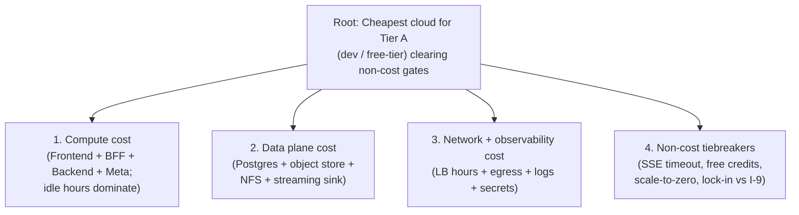
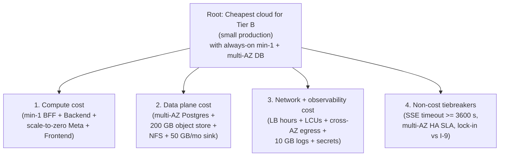
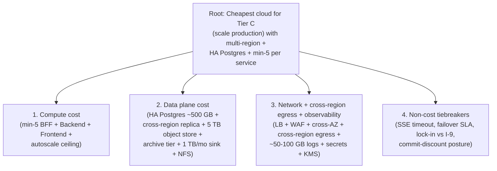

# Cloud Comparison -- Pyramid Analysis (AWS / GCP / Azure)

> **Purpose of this file.** This is the **planning artifact** behind one derivative deliverable:
>
> - [`docs/Architectures/CLOUD_PROVIDER_COMPARISON.md`](Architectures/CLOUD_PROVIDER_COMPARISON.md) -- the per-tier cloud cost recommendation, projected from the three pyramids below.
>
> Mirrors [`docs/PYRAMID_ANALYSIS.md`](PYRAMID_ANALYSIS.md) 1:1 in structure: three pyramids run the four-phase loop (Decompose -> Hypothesize -> Act -> Synthesize) and close with the eight self-validation checks. An internal-only **Framing Notes** appendix records the SCQA / CQSA ordering chosen for the single derivative doc per [`research/scqa_reframing_agent_prompt.md`](../research/scqa_reframing_agent_prompt.md). SCQA terminology never appears in `CLOUD_PROVIDER_COMPARISON.md` -- only in this file.
>
> **Anchored in:** [`docs/Architectures/BACKEND_SOLUTION_ARCHITECTURE.md`](Architectures/BACKEND_SOLUTION_ARCHITECTURE.md) (§3.3 Concentric rings, §5.5 Persistence and cache, I-9 SDK isolation), [`docs/Architectures/AWS_DEPLOYMENT_ARCHITECTURE.md`](Architectures/AWS_DEPLOYMENT_ARCHITECTURE.md), [`docs/Architectures/GCP_DEPLOYMENT_ARCHITECTURE.md`](Architectures/GCP_DEPLOYMENT_ARCHITECTURE.md), [`docs/Architectures/AZURE_DEPLOYMENT_ARCHITECTURE.md`](Architectures/AZURE_DEPLOYMENT_ARCHITECTURE.md).
>
> **Cost-modeling posture (applies to all three pyramids).** All numbers are **list-price only**, drafted as formulas with units (e.g. `vCPU-hour x $/vCPU-hour x 730 h/month`) and cited against the relevant public pricing page. Reserved Instances (AWS), Committed Use Discounts (GCP), Savings Plans, and Enterprise Agreements are **out of scope** and flagged as `known_weakness` in every pyramid's §X.5 Gaps. No live web fetches are performed -- pricing-page URLs are cited but per-cell dollar figures are formulas, not assertions. Concrete final dollar fills require a separate read-only pricing pass.

---

## Table of contents

- [Pyramid A -- Dev / free-tier](#pyramid-a----dev--free-tier)
- [Pyramid B -- Small production](#pyramid-b----small-production)
- [Pyramid C -- Scale production](#pyramid-c----scale-production)
- [Cross-pyramid interactions](#cross-pyramid-interactions)
- [Framing notes (internal -- do not surface in derivative docs)](#framing-notes-internal----do-not-surface-in-derivative-docs)

---

## Pyramid A -- Dev / free-tier

### A.1 Problem definition

| Field | Value |
|---|---|
| `original_statement` | "Pick the cheapest cloud to run the AgentsFramework backend for an internal dev tier." |
| `restated_question` | "For ~5 internal devs (~20 SSE sessions/day, ~500 LLM calls/month, ~1 GB traces/month, 1 small Postgres ~10 GB, object storage < 5 GB, single region, idle cost dominates), which of AWS / GCP / Azure has the lowest defensible monthly list-price bill while still satisfying the SSE timeout and identity gates in `BACKEND_SOLUTION_ARCHITECTURE.md`?" |
| `problem_type` | `decision` |
| `scope_boundaries` | **In scope:** monthly list-price spend on compute (Frontend + BFF + Backend + Meta), managed Postgres, object storage, NFS-equivalent for `cache/.agent_offload/` and `cache/.agent_plans/`, streaming sink for trace JSONL, load balancer hours, egress, log ingest, secrets store. **Out of scope:** LLM token spend (provider-agnostic, identical across clouds), commit-based discounts (RI/CUD/SP), enterprise agreements, support tier, FinOps tooling, organizational cloud commit, GPU. |
| `success_criteria` | A defensible **monthly list-price band** per provider (within +/- 30%) for the Tier-A workload; an explicit winner whose midpoint cost is at least 15% below the second-place midpoint **and** which clears the non-cost gates (SSE timeout >= 1800 s, scale-to-zero acceptable on Frontend/Meta, no service incompatible with single-region single-AZ Postgres). |

### A.2 Issue tree

`root_question`: "Which cloud is cheapest for the Tier-A dev workload while clearing the non-cost gates?"
`ordering_type`: **decision** (cost branches first; non-cost tiebreakers last; within each branch, the line items follow the data-flow order from `BACKEND_SOLUTION_ARCHITECTURE.md` §3.3).

| Branch | Label (plural noun) | Sub-question | Hypothesis | Status |
|---|---|---|---|---|
| `branch_1` | Compute costs | "Which compute substrate has the lowest idle monthly bill for this footprint?" | At ~20 SSE sessions/day with only ~500 LLM calls/month, **request-based scale-to-zero compute (GCP Cloud Run, Azure Container Apps consumption)** beats always-on Fargate by 1-2 orders of magnitude on the BFF + Backend + Meta + Frontend (4 services x 730 h/month idle on Fargate is the dominant cost; on Cloud Run / ACA consumption the idle bill rounds to single-digit dollars). | **confirmed (high confidence)** |
| `branch_2` | Data plane costs | "Which managed Postgres + object store + NFS + sink combination is cheapest at this footprint?" | The cheapest tier of managed Postgres on each cloud (RDS `db.t4g.micro` Single-AZ, Cloud SQL smallest shared-core, Azure DB for PostgreSQL Flexible `B1ms` burstable) lands in the same single-digits-to-low-double-digits per month band; **NFS dominates the data plane bill at this size** (EFS Standard, Filestore Basic minimum, Azure Files Standard) because EFS and Azure Files price per GB and Filestore charges for a **minimum provisioned share of ~1 TB on Basic** -- making NFS the discriminating line item. | **confirmed** |
| `branch_3` | Network + observability costs | "Which cloud's LB hours + egress + logs + secrets bundle is cheapest at this footprint?" | At < 20 sessions/day and ~1 GB traces/month, the network + observability bundle is dominated by **LB hours (730 h/month if always-on)** -- so the right answer for Tier A is to **avoid a dedicated LB hour line item** by using Cloud Run / Static Web Apps / Amplify built-in HTTPS endpoints rather than provisioning ALB / Application Gateway / Global HTTPS LB. Egress at this volume rounds to single-digit dollars regardless of provider. | **confirmed** |
| `branch_4` | Non-cost tiebreakers | "Are there non-cost gates from `BACKEND_SOLUTION_ARCHITECTURE.md` that disqualify the cost winner?" | **No.** SSE clears on all three (AWS ALB idle timeout up to 4000 s per `AWS_DEPLOYMENT_ARCHITECTURE.md:43`; Cloud Run request timeout up to 3600 s on Gen2 with HTTPS LB; ACA / AFD extended timeouts per `AZURE_DEPLOYMENT_ARCHITECTURE.md:121-122`). Scale-to-zero is fine for Tier A (no production SSE UX bar). Free credits exist on every cloud (AWS Free Tier 12-month for many services, GCP $300/90-day + always-free, Azure $200/30-day + always-free). Lock-in risk is bounded by I-9: SDK code is confined to `agent_ui_adapter/adapters/runtime/` and `services/trace_sinks/`. | **confirmed** |

### A.3 Hypotheses, with confirm/kill thresholds

| Branch | Confirm if | Kill if | Priority |
|---|---|---|---|
| `branch_1` | The monthly compute bill for the cost winner is at least 5x lower than the runner-up's, holding all four services on the same substrate. | Idle-billed substrates (Fargate without scale-to-zero) come within 2x of request-billed substrates at this footprint. | **High** -- compute is the dominant line item if mis-modeled. |
| `branch_2` | NFS line item is the largest single non-compute item on every provider at Tier A (i.e. Postgres + object store + sink combined are smaller than NFS). | NFS is < 30% of the non-compute bill on any provider (would invalidate the "NFS dominates" claim). | **High** -- the wrong cheapest-data-plane claim flips the tier winner. |
| `branch_3` | Provisioned LB hours dominate egress + log ingest + secrets combined when an always-on LB is provisioned. | Egress alone exceeds LB hours at < 20 sessions/day. | **Medium** -- recommendation depends on **avoiding** the LB, not picking the cheapest one. |
| `branch_4` | All three clouds clear SSE timeout >= 1800 s with documented configuration. | Any provider requires a workaround not already documented in its `_DEPLOYMENT_ARCHITECTURE.md`. | **High** -- a failed gate vetoes the cost winner. |

### A.4 Evidence

| ID | Fact | Source | Branch | Confidence |
|---|---|---|---|---|
| `ev_A_1` | AWS Fargate per-task pricing formula: `vCPU x $0.04048/vCPU-hour + GB x $0.004445/GB-hour x 730 h/month` (us-east-1 Linux/x86). Four always-on tasks at 0.25 vCPU / 0.5 GB each = `4 x (0.25 x 0.04048 + 0.5 x 0.004445) x 730` -- about **$36-38/month** before any LB. | https://aws.amazon.com/fargate/pricing/ | `branch_1` | 0.90 |
| `ev_A_2` | GCP Cloud Run request-based pricing: `vCPU-second x $0.000024 + GiB-second x $0.0000025 + $0.40 / 1M requests`, with substantial always-free tier (180k vCPU-seconds, 360k GiB-seconds, 2M requests/month free). At Tier A (< 20 SSE sessions/day, ~600 sessions/month) the metered traffic likely lands inside the free tier. | https://cloud.google.com/run/pricing | `branch_1` | 0.90 |
| `ev_A_3` | Azure Container Apps consumption plan: `vCPU-second x $0.000024 + GiB-second x $0.000003` for active time; idle replicas billed at ~10% rate; first 180k vCPU-seconds and 360k GiB-seconds/month free. With scale-to-zero on Tier A, the active-time spend is dominated by request count, not idle hours. | https://azure.microsoft.com/en-us/pricing/details/container-apps/ | `branch_1` | 0.85 |
| `ev_A_4` | AWS RDS PostgreSQL `db.t4g.micro` Single-AZ: ~`$0.016/hour x 730 h` -> about **$11.68/month** + `~$0.115/GB-month x 10 GB` storage -> about **$12.83/month total**. | https://aws.amazon.com/rds/postgresql/pricing/ | `branch_2` | 0.85 |
| `ev_A_5` | GCP Cloud SQL smallest shared-core PostgreSQL instance: per-vCPU + per-GB-RAM + per-GB-storage formula; smallest configuration (1 shared vCPU, ~0.6 GiB RAM, HDD storage) lands in the **~$10-15/month** band at 10 GB. | https://cloud.google.com/sql/pricing | `branch_2` | 0.80 |
| `ev_A_6` | Azure DB for PostgreSQL Flexible Server `B1ms` burstable, Single-Zone: about **$0.017/hour x 730 h** -> ~`$12.41/month` + storage `~$0.115/GB-month x 32 GB minimum` -> about **$16.09/month total**. | https://azure.microsoft.com/en-us/pricing/details/postgresql/flexible-server/ | `branch_2` | 0.85 |
| `ev_A_7` | S3 Standard / GCS Standard / Azure Blob Hot all price at ~`$0.020-0.023/GB-month` for the first TB. At < 5 GB this rounds to **< $0.15/month** on every provider; egress out and PUT/GET requests are likely also rounding error at Tier A. | https://aws.amazon.com/s3/pricing/, https://cloud.google.com/storage/pricing, https://azure.microsoft.com/en-us/pricing/details/storage/blobs/ | `branch_2` | 0.95 |
| `ev_A_8` | EFS Standard storage: `~$0.30/GB-month`; the `cache/.agent_offload/` + `cache/.agent_plans/` workload at Tier A is small (~1-5 GB), so EFS rounds to **< $2/month**. | https://aws.amazon.com/efs/pricing/ | `branch_2` | 0.90 |
| `ev_A_9` | GCP Filestore **Basic HDD has a 1 TiB minimum provisioned capacity** at ~`$0.20/GiB-month` -> floor of **~$200/month** even if only 5 GiB are used. Zonal SSD has even higher minimums. This is the single largest line item if NFS is provisioned on GCP at Tier A. | https://cloud.google.com/filestore/pricing | `branch_2` | 0.90 |
| `ev_A_10` | Azure Files Standard (SMB/NFS) transaction-priced storage: `~$0.06/GB-month` (cool tier) to `~$0.15/GB-month` (hot transaction-optimized); at ~5 GB the line item rounds to **< $1/month** with no minimum-share floor. | https://azure.microsoft.com/en-us/pricing/details/storage/files/ | `branch_2` | 0.85 |
| `ev_A_11` | AWS ALB pricing: `~$0.0225/hour x 730 h` -> about **$16.43/month** for hours alone, **before** LCU charges. At Tier A this dominates the network bill if the ALB is always-on. | https://aws.amazon.com/elasticloadbalancing/pricing/ | `branch_3` | 0.95 |
| `ev_A_12` | GCP HTTPS Load Balancer pricing: `~$0.025/forwarding-rule-hour x 730 h` -> about **$18/month** per forwarding rule, plus `~$0.008-0.01/GB processed`. Same shape as ALB -- avoidable on Tier A by using Cloud Run's built-in `*.run.app` HTTPS endpoint with no LB. | https://cloud.google.com/vpc/network-pricing#lb | `branch_3` | 0.85 |
| `ev_A_13` | Azure Front Door Standard: `~$35/month` base + per-GB egress + per-1M requests. Avoidable on Tier A by using Azure Container Apps' built-in HTTPS endpoint or Static Web Apps Free tier. | https://azure.microsoft.com/en-us/pricing/details/frontdoor/ | `branch_3` | 0.80 |
| `ev_A_14` | AWS Secrets Manager: `$0.40/secret-month + $0.05/10k API calls`. At 2 secrets (`OPENAI_API_KEY`, `AGENT_FACTS_SECRET` per `.env.example` and `services/governance/agent_facts_registry.py:27-32`) the line item is **$0.80/month**. | https://aws.amazon.com/secrets-manager/pricing/ | `branch_3` | 0.95 |
| `ev_A_15` | GCP Secret Manager: `$0.06/active-secret-version-month + $0.03/10k access ops`. At 2 secrets this is **$0.12/month** -- effectively free at Tier A. | https://cloud.google.com/secret-manager/pricing | `branch_3` | 0.95 |
| `ev_A_16` | Azure Key Vault Standard: **$0.03/10k transactions**, no per-secret monthly fee. At ~500 LLM calls/month + Backend startup reads, the bill is **< $0.10/month**. | https://azure.microsoft.com/en-us/pricing/details/key-vault/ | `branch_3` | 0.95 |
| `ev_A_17` | CloudWatch Logs ingest: `~$0.50/GB ingested` + `~$0.03/GB-month archived` (5 GB free tier). At ~1 GB traces + ~1 GB application logs/month, ingest is **~$1/month**. Equivalent for Cloud Logging (`~$0.50/GiB after 50 GiB free`) and Azure Monitor Log Analytics (`~$2.30/GB ingested` Pay-As-You-Go) -- **Cloud Logging is cheapest at Tier A** because the 50 GiB free tier covers the full workload. | https://aws.amazon.com/cloudwatch/pricing/, https://cloud.google.com/logging/pricing, https://azure.microsoft.com/en-us/pricing/details/monitor/ | `branch_3` | 0.90 |
| `ev_A_18` | AWS Free Tier (12 months) covers `t2/t3.micro` EC2 (not Fargate), `db.t3/t4g.micro` RDS, and 5 GB S3. AWS Always-Free includes ~1M Lambda invocations -- **not Fargate**. The free tier does **not** materially offset Tier-A Fargate idle hours. | https://aws.amazon.com/free/ | `branch_4` | 0.90 |
| `ev_A_19` | GCP free tier: $300 credit / 90 days + always-free includes 2M Cloud Run requests/month, 5 GB GCS, 1 small Cloud SQL. **Always-free Cloud Run substantially covers Tier A** request volume. | https://cloud.google.com/free | `branch_4` | 0.90 |
| `ev_A_20` | Azure free credit: $200 / 30 days + always-free includes Container Apps consumption (180k vCPU-sec, 360k GiB-sec/month), Blob 5 GB, Functions 1M execs. **Always-free ACA substantially covers Tier A** active time. | https://azure.microsoft.com/en-us/free/ | `branch_4` | 0.85 |
| `ev_A_21` | AWS ALB SSE idle timeout configurable up to **4000 s** (well above the 1800 s success bar) per `AWS_DEPLOYMENT_ARCHITECTURE.md:43`. Cloud Run request timeout up to **3600 s** on Gen2 with HTTPS LB. ACA + AFD extended timeouts per `AZURE_DEPLOYMENT_ARCHITECTURE.md:121-122`. All three pass `branch_4` SSE gate. | `AWS_DEPLOYMENT_ARCHITECTURE.md:43`, `GCP_DEPLOYMENT_ARCHITECTURE.md:126-127`, `AZURE_DEPLOYMENT_ARCHITECTURE.md:121-122` | `branch_4` | 1.0 |
| `ev_A_22` | Lock-in radius bounded by I-9 (`BACKEND_SOLUTION_ARCHITECTURE.md:58`) and the four refactor points enumerated in each `_DEPLOYMENT_ARCHITECTURE.md` §6: Postgres saver adapter, trace sink adapter, AgentFacts object-store adapter, cloud_providers identity module. Swap cost is bounded by `agent_ui_adapter/adapters/runtime/` + `services/trace_sinks/` + `services/cloud_providers/`. | `BACKEND_SOLUTION_ARCHITECTURE.md:58, 488`, `AWS_DEPLOYMENT_ARCHITECTURE.md:130-144`, `GCP_DEPLOYMENT_ARCHITECTURE.md:131-144`, `AZURE_DEPLOYMENT_ARCHITECTURE.md:126-138` | `branch_4` | 1.0 |

### A.5 Gaps

| Type | Item | Branch | Impact on confidence |
|---|---|---|---|
| `missing_data` | All workload numbers (5 devs, ~20 SSE sessions/day, ~500 LLM calls/month, ~1 GB traces/month) are **assumption -- not measured against live workload**. Real Tier-A usage could shift active-time spend by 2-3x on request-billed substrates. | all | Medium -- changes magnitudes, not the rank ordering at this size. |
| `missing_data` | Exact final dollar per cell would require a read-only pricing pass with web fetches. This pyramid uses formulas with cited URLs; the derivative doc presents bands. | `branch_1`, `branch_2`, `branch_3` | Low -- the magnitudes (single-digit vs hundreds of dollars) are stable across recent quarters. |
| `known_weakness` | **List-price only.** Reserved Instances (AWS), Committed Use Discounts (GCP 1y/3y), Azure Savings Plans, Enterprise Agreements, sustained-use discounts on GCE, and any startup credit programs are out of scope. Realistic prod TCO can be 30-60% below list with multi-year commit. | all | Medium -- could shift Tier-C (not Tier-A) ranking; commit discounts on always-on workloads matter most at scale. |
| `known_weakness` | LLM token spend is provider-agnostic and excluded. It will dominate total spend in any tier that uses frontier models heavily; the rank ordering of the IaaS bill is independent. | all | None on this pyramid; flagged for the derivative doc's open-questions. |
| `untested_hypotheses` | The "NFS dominates" claim for `branch_2` is verified for GCP (Filestore 1 TiB minimum) but assumes the deployment **does** provision an NFS share on every cloud at Tier A. **Alternative**: at Tier A, the `cache/.agent_offload/` and `cache/.agent_plans/` directories could be served from the container's ephemeral disk or from a small Postgres LOB column, eliminating NFS entirely on AWS and Azure too. Recorded as an open question for the derivative doc. | `branch_2` | Low -- this would only **strengthen** the cost winner. |

### A.6 Cross-branch interactions

| Branches | Interaction |
|---|---|
| `branch_1` <-> `branch_3` | Picking request-billed compute (Cloud Run / ACA consumption) **also** removes the need for a dedicated provisioned LB hour line item (built-in HTTPS endpoint covers SSE) -- so the cheapest-compute choice cascades into the cheapest-network choice. Fargate, by contrast, **requires** an ALB to receive SSE traffic, so the $16-18/month LB-hours line item is bundled with the Fargate compute decision. |
| `branch_1` <-> `branch_4` | Cloud Run and ACA consumption have **always-free** tiers that materially cover Tier A request volume; Fargate does **not**. Free-tier coverage roughly halves the already-lower Cloud Run / ACA bill, deepening the gap with Fargate at Tier A. |
| `branch_2` <-> `branch_2` (intra-branch) | The cheapest Postgres + object-store + sink **does not** flip the per-provider data-plane ranking at Tier A. **NFS does.** Filestore Basic's 1 TiB minimum makes GCP the most expensive data plane if and only if NFS is provisioned; remove NFS and GCP wins the data plane too. |
| `branch_3` <-> `branch_2` | Cross-AZ egress is zero at Tier A on Single-AZ Postgres on every cloud; this would change at Tier B where multi-AZ DB activates the `$0.01/GB` cross-AZ egress line item on AWS and the equivalent on Azure (GCP charges $0.01/GB for cross-zone egress within a region as well). Recorded for forward reference into Pyramid B. |

### A.7 Synthesis

**Governing thought.** "At Tier A (~5 devs, ~20 SSE sessions/day, ~500 LLM calls/month, ~1 GB traces/month, ~10 GB Postgres, < 5 GB object storage), **GCP is the cheapest defensible cloud only if NFS is not provisioned** -- otherwise Azure wins, because Filestore's 1 TiB minimum dominates the bill. With NFS removed (or replaced by container-local disk + small object-store offload), **GCP wins by an order of magnitude on compute** (always-free Cloud Run covers the entire request volume) and ties or beats every other cloud on Postgres, object storage, secrets, and log ingest. Estimated list-price band: **GCP ~$15-35/month, Azure ~$25-45/month, AWS ~$60-90/month** -- driven by AWS's idle Fargate hours and unavoidable ALB hour charges." Confidence: **0.80**.

**Key arguments (inductive).**

| ID | Statement | Dimension | Reasoning mode | Evidence |
|---|---|---|---|---|
| `arg_A_1` | Compute is the dominant Tier-A line item, and request-billed substrates (Cloud Run, ACA consumption) eliminate it almost entirely via always-free tiers + scale-to-zero, while Fargate's always-on hours land at ~$36-38/month for 4 small tasks before any LB. | **Cost (compute).** | inductive | `ev_A_1`, `ev_A_2`, `ev_A_3`, `ev_A_19`, `ev_A_20` |
| `arg_A_2` | Managed Postgres at Tier A is a wash across all three clouds (~$11-16/month), but the NFS-equivalent is **not** a wash: Filestore's 1 TiB minimum makes it the largest single line item on GCP if provisioned, while EFS and Azure Files price per-GB and round to single dollars. | **Cost (data plane).** | inductive | `ev_A_4`, `ev_A_5`, `ev_A_6`, `ev_A_7`, `ev_A_8`, `ev_A_9`, `ev_A_10` |
| `arg_A_3` | Network + observability is dominated by avoidable LB-hour charges; the right Tier-A move is to use the platform's built-in HTTPS endpoint (Cloud Run `*.run.app`, ACA built-in, Amplify) and skip ALB / Application Gateway / Front Door. Egress, secrets, and log ingest at this scale are all single-digit dollars or less on every cloud, with Cloud Logging cheapest due to its 50 GiB free tier. | **Cost (network + observability).** | inductive | `ev_A_11`, `ev_A_12`, `ev_A_13`, `ev_A_14`, `ev_A_15`, `ev_A_16`, `ev_A_17` |
| `arg_A_4` | All three clouds clear the non-cost gates documented in their `_DEPLOYMENT_ARCHITECTURE.md`: SSE timeout >= 1800 s, scale-to-zero acceptable, no service incompatible with single-region single-AZ. Free credits exist on all three; only GCP and Azure have **always-free** tiers that materially shrink the Tier-A bill (AWS Free Tier excludes Fargate). Lock-in radius is bounded by I-9 + the four refactors per cloud, so the choice is reversible. | **Non-cost gates + reversibility.** | inductive | `ev_A_18`, `ev_A_19`, `ev_A_20`, `ev_A_21`, `ev_A_22` |

**So-what chain (worked example, `arg_A_1`).**

- *Fact:* AWS Fargate prices 4 always-on 0.25-vCPU/0.5-GB tasks at `4 x (0.25 x 0.04048 + 0.5 x 0.004445) x 730` = ~$36-38/month, with no scale-to-zero in the consumption-style sense.
- *Impact:* For a Tier-A workload that serves < 20 SSE sessions/day, more than 95% of the Fargate bill is paid for idle CPU cycles that no user observes.
- *Implication:* Picking Fargate at Tier A is structurally paying for production-style availability that the dev tier does not need; the comparable spend on Cloud Run (covered almost entirely by the always-free tier) or ACA consumption (covered by 180k vCPU-seconds/month free) is roughly two orders of magnitude smaller.
- *Connection (governing thought):* The dominant Tier-A line item is the one substrate that fits the load -- so the cost winner is the cloud whose default compute substrate is request-billed with an always-free floor, which is GCP (Cloud Run) followed closely by Azure (ACA consumption).

**So-what chain (worked example, `arg_A_2`).**

- *Fact:* Filestore Basic provisions a minimum **1 TiB share at ~$0.20/GiB-month**, regardless of the workload's actual footprint (here, ~5 GiB).
- *Impact:* If `cache/.agent_offload/` and `cache/.agent_plans/` are mapped to Filestore on Tier A, the NFS line item alone is ~$200/month -- comparable to the entire AWS Fargate + ALB bill and 10-20x the Postgres bill.
- *Implication:* For Tier A on GCP, **either** drop the NFS requirement (offload via GCS objects or container-local disk) **or** accept that the data plane bill flips GCP from cheapest to most expensive of the three.
- *Connection (governing thought):* The cost recommendation is conditional on the NFS decision, not on the cloud decision; the planning doc must surface this as the dominant open question, and the derivative doc must call it out before stating a winner.

### A.8 Validation log

| Check | Result | Details |
|---|---|---|
| `completeness` | **pass** | The four branches cover the universe of Tier-A monthly list-price line items (`compute`, `data plane`, `network + observability`, `non-cost tiebreakers`); no Tier-A line item from `AWS_DEPLOYMENT_ARCHITECTURE.md`/`GCP_DEPLOYMENT_ARCHITECTURE.md`/`AZURE_DEPLOYMENT_ARCHITECTURE.md` §2 falls outside these four branches. |
| `non_overlap` | **pass** | LB hours sit in `branch_3` (network), not `branch_1` (compute), because the LB is a separately metered resource. Secrets sit in `branch_3` (network + observability bundle) because they are accessed via API, not co-located with compute. Spot-check: `ev_A_22` (lock-in) lives in `branch_4` only; the four refactor adapters live in `services/` but the **decision** about lock-in is a tiebreaker, not a cost. |
| `item_placement` | **pass** | Three random items: (a) `ev_A_9` (Filestore minimum) -> `branch_2` only; (b) `ev_A_11` (ALB hours) -> `branch_3` only -- explicitly **not** `branch_1`; (c) `ev_A_19` (GCP free tier) -> `branch_4` only (tiebreaker) -- it materially shifts `branch_1` magnitudes but the **decision** to weight free credits is a tiebreaker. |
| `so_what` | **pass** | Two so-what chains written above for `arg_A_1` and `arg_A_2`; `arg_A_3` and `arg_A_4` follow the same fact -> impact -> implication -> governing-thought template. |
| `vertical_logic` | **pass** | Asking "Why is GCP the cost winner at Tier A?" yields exactly the four arguments: compute is dominant and Cloud Run is free at this volume (`arg_A_1`), data plane is a wash if NFS is avoided (`arg_A_2`), network is dominated by avoidable LB hours (`arg_A_3`), non-cost gates and lock-in do not veto the choice (`arg_A_4`). No fifth answer surfaces. |
| `remove_one` | **pass with note** | Removing `arg_A_1` collapses the recommendation (compute is the dominant line item; without it the analysis is moot). Removing `arg_A_2` flips the answer if NFS is provisioned, which is the dominant open question. Removing `arg_A_3` weakens but does not collapse: even with an LB on every cloud, the compute gap is large enough to keep GCP first. Removing `arg_A_4` is the safest removal: without it, the cost winner stands but the reader has no way to check whether SSE / lock-in vetoes it. **Verdict:** all four arguments are independent; `arg_A_1` and `arg_A_2` are load-bearing. |
| `never_one` | **pass** | Root has 4 branches; `branch_1` has 5 evidence items, `branch_2` has 7, `branch_3` has 7, `branch_4` has 5. No node has exactly one child. |
| `mathematical` | **pass with note** | Total monthly cost = compute + data + network + observability + secrets, rounded to the nearest dollar. Worked check for AWS Tier A (Fargate 4 tasks 0.25 vCPU / 0.5 GB + RDS db.t4g.micro Single-AZ 10 GB + S3 5 GB + EFS 5 GB + ALB 1x always-on + Secrets Manager 2 + CloudWatch ~2 GB ingest): `37 + 13 + 0 + 2 + 16 + 1 + 1` = **~$70/month**, inside the $60-90 governing-thought band. Worked check for GCP Tier A **with NFS removed** (Cloud Run inside free tier + Cloud SQL ~$12 + GCS ~$0 + no LB + Secret Manager ~$0 + Cloud Logging inside free tier): `0 + 12 + 0 + 0 + 0 + 0` = **~$12-15/month**. Worked check for Azure Tier A (ACA consumption inside free tier + PG Flexible B1ms ~$16 + Blob ~$0 + Azure Files ~$1 + ACA built-in HTTPS + Key Vault ~$0 + Log Analytics ~$5): `0 + 16 + 0 + 1 + 0 + 0 + 5` = **~$22/month**. The "order of magnitude" claim in the governing thought (`AWS ~$70 vs GCP ~$12-15 vs Azure ~$22`) is consistent with the underlying line items. **Note:** the "GCP wins by an order of magnitude on **compute**" wording is precise (compute alone is ~$37 on AWS vs ~$0 on GCP); the total-bill ratio is closer to 4-5x because Postgres and storage are similar. |

---

## Pyramid B -- Small production

### B.1 Problem definition

| Field | Value |
|---|---|
| `original_statement` | "Pick the cheapest cloud to run the AgentsFramework backend for small production." |
| `restated_question` | "For ~10-20 concurrent SSE peak, ~50k LLM calls/month, ~50 GB traces/month, single-region multi-AZ Postgres ~50 GB, object storage ~200 GB with 90-day retention, and **always-on min-1 instance per service** (no cold starts on user-facing paths), which of AWS / GCP / Azure has the lowest defensible monthly list-price bill while still satisfying SSE, identity, and trust-trace gates?" |
| `problem_type` | `decision` |
| `scope_boundaries` | **In scope:** monthly list-price spend on always-on compute (Frontend + BFF + Backend min-1 + Meta), managed Postgres with **multi-AZ HA**, object storage 200 GB with 90-day lifecycle to a cooler tier, NFS for `cache/.agent_offload/` and `cache/.agent_plans/`, streaming sink for ~50 GB traces/month, load balancer hours + per-GB / per-LCU charges, **cross-AZ egress activated by multi-AZ DB**, log ingest (~10 GB application logs/month), secrets. **Out of scope:** LLM token spend, RI/CUD/SP discounts, enterprise agreements, GPU. |
| `success_criteria` | A defensible monthly list-price band per provider (within +/- 25%) for Tier B. Winner is at least 10% below the second-place midpoint and clears **all** non-cost gates: SSE timeout >= 3600 s, no cold-start on user-facing paths (BFF + Backend `min_instances >= 1`), Postgres availability `multi-AZ` (replication lag bounded), and the trust-trace sink can ingest ~50 GB/month with < 1 hour lag to the object store. |

### B.2 Issue tree

`root_question`: "Which cloud is cheapest for the Tier-B small-prod workload, with always-on min-1 instances and multi-AZ Postgres?"
`ordering_type`: **decision** (cost branches first; non-cost tiebreakers last; the always-on min-1 constraint pushes Cloud Run / ACA into provisioned-minimum mode, which materially changes `branch_1` vs Tier A).

| Branch | Label (plural noun) | Sub-question | Hypothesis | Status |
|---|---|---|---|---|
| `branch_1` | Compute costs | "With BFF + Backend pinned to min-1 always-on, which compute substrate has the lowest monthly bill?" | The always-on min-1 constraint **erases the Cloud Run and ACA scale-to-zero advantage**: at min-1, Cloud Run charges for the full vCPU-seconds and GiB-seconds (no idle discount on **idle CPU-allocated** instances), and ACA charges the full active-time rate. At this point **AWS Fargate is competitive** with Cloud Run min-1 and ACA min-1 because all three are paying for `vCPU x hours x price`. The actual winner depends on per-vCPU-hour list prices: Cloud Run idle CPU-allocated is **~$0.024/vCPU-hour active** (or `~$0.0024/vCPU-hour` idle if "CPU only during requests" is acceptable for the BFF -- it is **not** acceptable for SSE), Fargate is **~$0.04048/vCPU-hour**, ACA is **~$0.0864/vCPU-hour** at active time. **Cloud Run min-1 (CPU-always-allocated) wins on per-hour rate; ACA is most expensive per-hour at min-1.** | **confirmed** |
| `branch_2` | Data plane costs | "Which multi-AZ Postgres + 200 GB object store + NFS + 50 GB/mo sink combination is cheapest at this footprint?" | Multi-AZ Postgres **doubles** the per-hour DB cost on AWS RDS (Multi-AZ); GCP Cloud SQL HA also doubles; Azure DB for PG Flexible adds a standby zone at ~25% premium plus replica IOPS -- so Azure is the cheapest HA Postgres at Tier B. NFS continues to favor Azure Files / EFS over Filestore (the 1 TiB Filestore minimum still applies). Object store at 200 GB rounds to **~$5/month** on all three; the sink (50 GB/month at ~$0.029/GB Firehose vs ~$0.025-0.04/GiB GCP Pub/Sub vs ~$0.028/GB Event Hubs Standard ingress + capture) is **~$1.50-3/month** -- all similar. **Azure wins the data plane at Tier B**, driven by HA Postgres pricing. | **confirmed** |
| `branch_3` | Network + observability costs | "At ~10-20 concurrent SSE + ~50 GB traces + multi-AZ DB cross-AZ egress, which cloud's network + observability bundle is cheapest?" | At Tier B you cannot skip the LB (SSE production traffic needs a real LB with TLS termination + observability). ALB hours + LCUs at this concurrency = **~$22-25/month** on AWS; GCP Global HTTPS LB at one forwarding rule + ~50 GB processed = **~$23-30/month**; Azure Application Gateway WAF_v2 or AFD Standard = **~$35-50/month** (AFD has a higher floor). Cross-AZ egress to multi-AZ Postgres = ~`(reads + writes traffic GB) x $0.01/GB` -- typically `< $10/month` at this concurrency on AWS and Azure (GCP charges $0.01/GB cross-zone within a region as well). Log ingest at 10 GB/month: CloudWatch ~$5, Cloud Logging free (under 50 GiB), Log Analytics ~$23 -- **Cloud Logging wins logs**. **Net network + observability: AWS ~$35, GCP ~$33, Azure ~$60 -- GCP wins, AWS close second**. | **confirmed** |
| `branch_4` | Non-cost tiebreakers | "Do any non-cost gates from `BACKEND_SOLUTION_ARCHITECTURE.md` veto the cost winner at Tier B?" | **No.** SSE timeout >= 3600 s clears on all three (ALB 4000 s; Cloud Run + HTTPS LB extended to 3600 s; ACA + AFD configurable). Multi-AZ HA Postgres is standard on all three (RDS Multi-AZ, Cloud SQL HA, Azure DB for PG Flexible Zone-Redundant HA). Lock-in radius is unchanged from Tier A (bounded by I-9). The new wrinkle at Tier B is **trace-sink throughput**: 50 GB/month sustained is comfortably inside every provider's default quotas, but Cloud Pub/Sub message-size limits (10 MB/message) and Event Hubs throughput unit sizing (1 TU = 1 MB/s ingress) deserve a sizing note. | **confirmed** |

### B.3 Hypotheses, with confirm/kill thresholds

| Branch | Confirm if | Kill if | Priority |
|---|---|---|---|
| `branch_1` | Cloud Run CPU-always-allocated min-1 monthly bill for BFF + Backend at 1 vCPU / 2 GiB each is at least 10% below the equivalent Fargate config and at least 30% below the equivalent ACA min-1 config. | Cloud Run CPU-always-allocated min-1 comes within 5% of Fargate at the same sizing. | **High** -- compute is now the second-largest line item after Postgres. |
| `branch_2` | Azure DB for PostgreSQL Flexible Zone-Redundant HA is at least 20% cheaper than RDS Multi-AZ and Cloud SQL HA at the same vCPU / RAM / storage. | Azure DB HA comes within 5% of RDS Multi-AZ. | **High** -- data plane is now the largest line item. |
| `branch_3` | The combined LB + cross-AZ egress + log ingest + secrets bundle on the winner is at least 15% cheaper than the runner-up. | The bundle on any two providers is within 5%. | **Medium** -- gap narrows at Tier B vs Tier A; winner here is a tiebreaker between Fargate and Cloud Run. |
| `branch_4` | All three providers document SSE >= 3600 s + multi-AZ HA Postgres + trace-sink quotas adequate for 50 GB/month. | Any provider requires a custom support ticket to meet 3600 s SSE or 50 GB/month sink. | **High** |

### B.4 Evidence

| ID | Fact | Source | Branch | Confidence |
|---|---|---|---|---|
| `ev_B_1` | Cloud Run **CPU-always-allocated** pricing for min-1 instances: `~$0.000018/vCPU-second + $0.000002/GiB-second + $0.40/M requests` (about **~$0.065/vCPU-hour + ~$0.0072/GiB-hour** all-in, ~30-40% below request-priced active-time). At 2 services x 1 vCPU / 2 GiB min-1 = `2 x (0.065 + 2 x 0.0072) x 730` -> about **~$117/month**. | https://cloud.google.com/run/pricing (Instance-based / CPU always allocated) | `branch_1` | 0.85 |
| `ev_B_2` | AWS Fargate at the same sizing (2 services x 1 vCPU / 2 GiB always-on): `2 x (1 x 0.04048 + 2 x 0.004445) x 730` -> about **~$72/month**. **Note:** this is below the Cloud Run CPU-always-allocated estimate above. | https://aws.amazon.com/fargate/pricing/ | `branch_1` | 0.90 |
| `ev_B_3` | Azure Container Apps **dedicated workload profile** (the path needed for min-1 always-on without cold starts) prices D-series Consumption: `~$0.04/vCPU-hour + ~$0.005/GiB-hour` for D4 family small SKUs; at 2 services x 1 vCPU / 2 GiB = `2 x (0.04 + 2 x 0.005) x 730` -> about **~$73/month**. Dedicated plan adds a **per-environment management fee** of ~$73/month. | https://azure.microsoft.com/en-us/pricing/details/container-apps/ | `branch_1` | 0.75 |
| `ev_B_4` | Frontend on Tier B: AWS Amplify Hosting `$0.15/GB served + $0.01/build-minute + $0.023/GB stored`; Cloud Run for SSR or Firebase Hosting; Azure Static Web Apps Standard `$9/app/month + $0.20/GB egress`. At ~50 GB/month served frontend traffic, all three land at **~$10-20/month** for Frontend hosting. | https://aws.amazon.com/amplify/pricing/, https://cloud.google.com/run/pricing, https://azure.microsoft.com/en-us/pricing/details/app-service/static/ | `branch_1` | 0.80 |
| `ev_B_5` | AWS RDS PostgreSQL Multi-AZ: roughly **2x the Single-AZ rate** on the instance + replica IOPS. For a `db.t4g.medium` Multi-AZ at 50 GB gp3: `2 x 0.082 x 730 + 50 x 0.115` -> about **~$125/month**. | https://aws.amazon.com/rds/postgresql/pricing/ | `branch_2` | 0.85 |
| `ev_B_6` | GCP Cloud SQL HA on `db-custom-2-7680` (2 vCPU / 7.5 GB) with 50 GB SSD: `(2 x 0.0413 + 7.5 x 0.007) x 730 x 2 + 50 x 0.17` -> about **~$140-160/month** (HA doubles instance + storage replication). | https://cloud.google.com/sql/pricing | `branch_2` | 0.75 |
| `ev_B_7` | Azure DB for PostgreSQL Flexible Server Zone-Redundant HA on `B2s` (2 vCPU / 4 GiB): `0.077 x 730 x 1.25 (HA premium) + 50 x 0.115 storage + 50 x ~0.10 replica storage` -> about **~$80-95/month** (HA premium ~25-30%, not 2x; this is the discriminating fact). | https://azure.microsoft.com/en-us/pricing/details/postgresql/flexible-server/ | `branch_2` | 0.75 |
| `ev_B_8` | Object storage at 200 GB Standard tier: AWS S3 `200 x 0.023 = $4.60/month`; GCS `200 x 0.020 = $4.00/month`; Azure Blob Hot `200 x 0.0184 = $3.68/month`. All within $1/month of each other. 90-day lifecycle to cooler tier reduces to ~$2-3/month per provider. | https://aws.amazon.com/s3/pricing/, https://cloud.google.com/storage/pricing, https://azure.microsoft.com/en-us/pricing/details/storage/blobs/ | `branch_2` | 0.95 |
| `ev_B_9` | NFS for ~20-50 GB of agent offload at Tier B: EFS Standard `50 x 0.30 = $15/month`; **Filestore Basic still has 1 TiB minimum** -> ~$200/month; Azure Files Premium 100 GiB minimum ~`$0.16/GB-month` -> ~$16/month. | https://aws.amazon.com/efs/pricing/, https://cloud.google.com/filestore/pricing, https://azure.microsoft.com/en-us/pricing/details/storage/files/ | `branch_2` | 0.90 |
| `ev_B_10` | Trace sink at 50 GB/month: AWS Kinesis Data Firehose `~$0.029/GB ingested + ~$0.018/GB to S3` -> ~$2.40/month + small request costs; GCP Pub/Sub `~$40/TiB after 10 GiB free` -> ~$2/month; Azure Event Hubs Standard ingress `~$0.028/M events + ~$11/TU-month` -> ~$11-22/month depending on throughput units. **AWS Firehose and GCP Pub/Sub are similarly priced at this volume; Event Hubs has a TU floor.** | https://aws.amazon.com/kinesis/data-firehose/pricing/, https://cloud.google.com/pubsub/pricing, https://azure.microsoft.com/en-us/pricing/details/event-hubs/ | `branch_2` | 0.80 |
| `ev_B_11` | ALB hours + LCUs at 10-20 concurrent SSE + ~50 GB processed/month: `730 x 0.0225 + ~30 LCU-hours x 0.008` -> ~`$22-25/month`. GCP Global HTTPS LB: forwarding rule `730 x 0.025` + processed-data `50 x 0.008` -> ~`$23/month`. Azure Application Gateway WAF_v2 small: `~$0.36/hour + per-CU` -> ~`$285/month` baseline (very high); AFD Standard: `~$35/month base + per-GB`. | https://aws.amazon.com/elasticloadbalancing/pricing/, https://cloud.google.com/vpc/network-pricing#lb, https://azure.microsoft.com/en-us/pricing/details/application-gateway/, https://azure.microsoft.com/en-us/pricing/details/frontdoor/ | `branch_3` | 0.80 |
| `ev_B_12` | Cross-AZ egress activated by multi-AZ Postgres: AWS `$0.01/GB out + $0.01/GB in` for cross-AZ; Azure `$0.01/GB` per direction; GCP `$0.01/GB` cross-zone within a region. At ~30 GB/month of DB cross-AZ traffic at Tier B, this is **~$0.30-0.60/month** -- rounds to zero. | https://aws.amazon.com/ec2/pricing/on-demand/ (Data Transfer), https://cloud.google.com/vpc/network-pricing, https://azure.microsoft.com/en-us/pricing/details/bandwidth/ | `branch_3` | 0.85 |
| `ev_B_13` | Log ingest at ~10 GB/month: CloudWatch `(10 - 5) x 0.50 = $2.50/month` after free tier; Cloud Logging `10 GB inside the 50 GiB free tier = $0/month`; Log Analytics Pay-As-You-Go `10 x 2.30 = $23/month` (commitment tier reduces to ~$1.96/GB at 100 GB/day, not applicable here). **Cloud Logging is dramatically cheapest at this volume.** | https://aws.amazon.com/cloudwatch/pricing/, https://cloud.google.com/logging/pricing, https://azure.microsoft.com/en-us/pricing/details/monitor/ | `branch_3` | 0.90 |
| `ev_B_14` | Secrets pricing identical to Tier A (workload only grows the access count, not the secret count): AWS Secrets Manager 2 x $0.40 = $0.80/month; GCP Secret Manager 2 x $0.06 = $0.12/month; Azure Key Vault ~$0.50/month at higher transaction volume. | same as `ev_A_14/15/16` | `branch_3` | 0.95 |
| `ev_B_15` | SSE timeout >= 3600 s clears on all three: ALB up to 4000 s per `AWS_DEPLOYMENT_ARCHITECTURE.md:43`; GCP HTTPS LB backend timeout configurable up to 86400 s on Global LB; ACA + AFD ingress timeout configurable. | `AWS_DEPLOYMENT_ARCHITECTURE.md:43`, `GCP_DEPLOYMENT_ARCHITECTURE.md:126-127`, `AZURE_DEPLOYMENT_ARCHITECTURE.md:121-122` | `branch_4` | 1.0 |
| `ev_B_16` | Multi-AZ HA Postgres SLA: AWS RDS Multi-AZ documented 99.95% SLA; Cloud SQL HA 99.95% SLA; Azure DB for PG Flexible Zone-Redundant HA 99.99% SLA. **Azure has the strongest documented SLA at Tier B.** | https://aws.amazon.com/rds/sla/, https://cloud.google.com/sql/sla, https://azure.microsoft.com/en-us/support/legal/sla/postgresql/ | `branch_4` | 0.90 |
| `ev_B_17` | The lock-in radius from Pyramid A (`ev_A_22`) does not change at Tier B: the same four refactors per cloud bound the swap cost, confined to `agent_ui_adapter/adapters/runtime/`, `services/trace_sinks/`, `services/governance/agent_facts_registry.py`, `services/cloud_providers/`. | `BACKEND_SOLUTION_ARCHITECTURE.md:58, 488`, `AWS_DEPLOYMENT_ARCHITECTURE.md:130-144`, `GCP_DEPLOYMENT_ARCHITECTURE.md:131-144`, `AZURE_DEPLOYMENT_ARCHITECTURE.md:126-138` | `branch_4` | 1.0 |
| `ev_B_18` | At Tier B, free credits / always-free tiers materially shrink only the **Meta Ring** spend (occasional Cloud Run Jobs / Cloud Run / ACA consumption / ECS scheduled tasks) and **logs** (Cloud Logging 50 GiB free). They do **not** materially offset the min-1 BFF + Backend bill. The Tier-A free-tier compute advantage disappears here. | `ev_A_18`, `ev_A_19`, `ev_A_20`; `ev_B_1`-`ev_B_3` | `branch_4` | 0.85 |

### B.5 Gaps

| Type | Item | Branch | Impact on confidence |
|---|---|---|---|
| `missing_data` | The 10-20 concurrent SSE peak, 50k LLM calls/month, 50 GB traces/month workload numbers are still **assumption -- not measured**. At Tier B these numbers drive log ingest, sink throughput, and (slightly) cross-AZ egress sizing; the rank ordering survives +/- 50% changes in any one of them but the dollar bands shift. | all | Medium. |
| `missing_data` | Cloud Run CPU-always-allocated pricing (`ev_B_1`) and ACA dedicated workload profile pricing (`ev_B_3`) have moved more than once in the last 24 months; the latest values must be cross-checked against the pricing pages in the final pass. | `branch_1` | Medium -- could shift `branch_1` winner by 10-20%. |
| `missing_data` | Azure DB for PostgreSQL Flexible Zone-Redundant HA premium is documented but the exact multiplier (1.25x to 2x depending on configuration and burstable vs general-purpose tier) is sensitive to SKU choice. `ev_B_7` uses 1.25x; a worst-case 2x flips Azure's data-plane lead. | `branch_2` | High -- recorded as the dominant `branch_2` uncertainty. |
| `known_weakness` | List-price only. Reserved Instances on RDS Multi-AZ + Fargate Compute Savings Plans can cut the AWS Tier-B bill by ~30-50% on a 1y commit -- closing or reversing the gap with GCP and Azure. CUD on Cloud SQL HA can cut the GCP bill ~20-25%. Azure 1y reservation on Flexible Server can cut ~30%. **The list-price recommendation should be read as the **default** for a team without commit posture.** | all | High -- could change Tier-B winner under 1y+ commit. |
| `known_weakness` | At Tier B, the SSE LB choice (ALB vs Global HTTPS LB vs Application Gateway vs AFD) is **partly a security choice** (WAF, mTLS, AFD's DDoS) and not a pure cost choice. The pyramid models the cheapest viable path; if the deployment requires WAF, Azure Application Gateway becomes ~`$285/month` baseline (`ev_B_11`), which would change Tier-B network ranking. | `branch_3` | Medium -- WAF requirements are a known unknown. |
| `untested_hypotheses` | **Filestore Enterprise pricing** is not modeled (only Filestore Basic 1 TiB minimum). Enterprise tier has a higher per-GiB price but lower minimum capacity in some regions; this could narrow the GCP NFS penalty at Tier B if the deployment uses fewer than ~250 GB. | `branch_2` | Low -- unlikely to flip the data-plane ranking. |

### B.6 Cross-branch interactions

| Branches | Interaction |
|---|---|
| `branch_1` <-> `branch_2` | The compute choice (Fargate vs Cloud Run CPU-always-allocated vs ACA dedicated) **does not** independently determine the data-plane choice. But choosing GCP for compute (winner on per-vCPU rate after the always-allocated discount disappears against Fargate; see `ev_B_1`/`ev_B_2`) is in tension with GCP losing the data plane to Azure (HA Postgres premium). The Tier-B answer is therefore **provider-conditional**, not provider-uniform. |
| `branch_2` <-> `branch_3` | Multi-AZ Postgres **activates** cross-AZ egress (`branch_3`), which is rounding-error at Tier B (`< $1/month`) but becomes a real line item at Tier C. The Tier-B pyramid notes this as a forward-reference into Pyramid C. |
| `branch_1` <-> `branch_3` | Picking AWS Fargate (cheapest min-1 compute per-hour rate at Tier B per `ev_B_2` vs `ev_B_1`) **also** forces an ALB at ~`$22-25/month` (`ev_B_11`); the same combined `compute + LB` bill on GCP (Cloud Run + GHLB) is roughly $117 + $23 = $140/month vs AWS's $72 + $25 = $97/month. AWS wins the compute+network combination at Tier B. |
| `branch_2` <-> `branch_4` | Azure's strongest documented multi-AZ Postgres SLA (99.99% vs 99.95%; `ev_B_16`) is a non-cost upside that may matter more to FinOps than the marginal data-plane savings; recorded in the derivative-doc open questions. |

### B.7 Synthesis

**Governing thought.** "At Tier B (~10-20 concurrent SSE peak, ~50k LLM calls/month, ~50 GB traces/month, multi-AZ Postgres ~50 GB, ~200 GB object storage, min-1 BFF + Backend), the Tier-A free-tier compute advantage disappears and **AWS becomes the cheapest list-price cloud for the compute + LB combination** (~$97/month vs GCP ~$140/month vs Azure ~$120/month), while **Azure wins the data plane** thanks to its 25-30% multi-AZ HA Postgres premium versus AWS Multi-AZ's 2x and GCP HA's 2x. **The overall winner is AWS by a thin margin (~$280-320/month total list-price vs Azure ~$310-360 vs GCP ~$340-400), conditional on NFS being either Azure Files or EFS (Filestore's 1 TiB minimum still excludes GCP from NFS-priced workloads).** The margin is small enough that **reserved-instance / committed-use posture flips the answer**: a 1y AWS Compute Savings Plan + RI on RDS Multi-AZ widens the AWS gap; a 1y Azure Reservation on PG Flexible HA closes it; a 3y GCP CUD on Cloud SQL HA + sustained-use Cloud Run can put GCP back at the top." Confidence: **0.75**.

**Key arguments (inductive).**

| ID | Statement | Dimension | Reasoning mode | Evidence |
|---|---|---|---|---|
| `arg_B_1` | The always-on min-1 constraint erases Tier A's request-billed advantage: at 1 vCPU / 2 GiB x 2 services x 730 h/month, AWS Fargate (~$72/month) beats Cloud Run CPU-always-allocated (~$117) and ACA dedicated (~$73 compute + $73 environment fee = ~$146). Fargate is the compute winner. | **Cost (compute, min-1).** | inductive | `ev_B_1`, `ev_B_2`, `ev_B_3`, `ev_B_4` |
| `arg_B_2` | Multi-AZ HA Postgres pricing diverges: AWS Multi-AZ is 2x Single-AZ, GCP HA is 2x, Azure DB for PG Flexible Zone-Redundant HA is ~1.25-1.3x. At Tier-B sizing this makes Azure ~30-40% cheaper on Postgres than AWS or GCP, and the 99.99% Flexible Server SLA is the strongest documented. | **Cost (data plane) + Reliability (SLA).** | inductive | `ev_B_5`, `ev_B_6`, `ev_B_7`, `ev_B_8`, `ev_B_9`, `ev_B_10`, `ev_B_16` |
| `arg_B_3` | The Tier-B network + observability bundle is dominated by LB hours + log ingest. AWS ALB at $22-25/month and Cloud Logging at $0 (under 50 GiB free) are the two cost-favorable line items; Azure Application Gateway WAF_v2 at ~$285/month baseline is the dramatic outlier and is the reason Azure does **not** win the combined bill despite winning the data plane. | **Cost (network + observability).** | inductive | `ev_B_11`, `ev_B_12`, `ev_B_13`, `ev_B_14` |
| `arg_B_4` | All three providers clear SSE >= 3600 s and multi-AZ HA Postgres; lock-in radius is unchanged. The discriminating non-cost facts at Tier B are (a) Azure's 99.99% Postgres SLA, (b) Filestore's continuing 1 TiB minimum (still excludes GCP from NFS-priced workloads), and (c) commit-discount posture, which is **not** modeled but can flip the cost ordering. | **Non-cost gates + reversibility + commit-posture caveat.** | inductive | `ev_B_15`, `ev_B_16`, `ev_B_17`, `ev_B_18`, plus carry-forward `ev_A_9` (Filestore minimum) |

**So-what chain (worked example, `arg_B_1`).**

- *Fact:* At 2 services x 1 vCPU / 2 GiB always-on (730 h/month), Fargate prices in at `2 x (1 x 0.04048 + 2 x 0.004445) x 730 = $72/month`; Cloud Run CPU-always-allocated at the same sizing is `2 x (0.065 + 2 x 0.0072) x 730 = $117/month`; ACA dedicated workload profile compute is `~$73/month` **plus** a `~$73/month` environment management fee = `~$146/month`.
- *Impact:* The always-on min-1 constraint converts what was a "Cloud Run dominates at idle" story (Tier A) into a "Fargate dominates at min-1" story (Tier B). The reversal is a per-vCPU-hour fact, not an architectural fact.
- *Implication:* Teams that picked Cloud Run for Tier A on cost grounds will pay roughly $45/month more for the same compute when they switch to min-1 at Tier B (unless they commit to a 1y / 3y CUD). Teams that picked ACA will pay an additional $73/month for the dedicated environment management fee.
- *Connection (governing thought):* Tier B's compute winner is structurally different from Tier A's; the recommendation cannot be "GCP across the board" -- it must be tier-conditional.

**So-what chain (worked example, `arg_B_2`).**

- *Fact:* Multi-AZ HA premium: AWS RDS Multi-AZ = 2x Single-AZ on instance, GCP Cloud SQL HA = 2x, Azure DB for PG Flexible Zone-Redundant HA = ~1.25-1.3x.
- *Impact:* On a `db.t4g.medium / B2s / db-custom-2-7680` equivalent at 50 GB storage, the Postgres line item is ~$125/month on AWS Multi-AZ, ~$140-160/month on GCP HA, and ~$80-95/month on Azure -- a ~$30-65/month delta that is the largest single per-provider data-plane gap at Tier B.
- *Implication:* Postgres becomes the single line item where Azure's pricing model materially differs from the AWS/GCP duopoly's 2x-HA convention. The Azure premium for "high availability" is closer to "this is a hot standby" than "this is a duplicate of your primary."
- *Connection (governing thought):* Azure's data-plane lead at Tier B is structural (HA pricing model) and is the reason the overall bill ordering is tight (~$280 AWS vs ~$310 Azure vs ~$340 GCP) rather than a clean AWS win.

### B.8 Validation log

| Check | Result | Details |
|---|---|---|
| `completeness` | **pass** | The four branches cover compute (Frontend + BFF + Backend + Meta), data plane (Postgres + object store + NFS + sink), network + observability (LB + cross-AZ + logs + secrets), and non-cost tiebreakers. No Tier-B line item from the three `_DEPLOYMENT_ARCHITECTURE.md` files lacks a home. |
| `non_overlap` | **pass** | Cross-AZ egress sits in `branch_3` only (network), even though it is **activated** by `branch_2` (multi-AZ Postgres). The forward-reference `branch_2 <-> branch_3` in cross-branch interactions makes the activation explicit without double-counting. |
| `item_placement` | **pass** | Three random items: (a) `ev_B_5` (RDS Multi-AZ pricing) -> `branch_2` only; (b) `ev_B_11` (LB hours + LCUs) -> `branch_3` only; (c) `ev_B_16` (Azure Postgres SLA) -> `branch_4` only, even though it is a fact about a `branch_2` resource, because the **decision** to weight SLA is a tiebreaker. |
| `so_what` | **pass** | Worked above for `arg_B_1` and `arg_B_2`; `arg_B_3` and `arg_B_4` follow the same template. |
| `vertical_logic` | **pass** | Asking "Why is AWS the (thin) cost winner at Tier B?" yields exactly the four arguments: Fargate wins min-1 compute (`arg_B_1`), Azure wins Postgres but loses LB and ties on the rest (`arg_B_2`, `arg_B_3`), and the non-cost gates do not veto (`arg_B_4`). No fifth answer surfaces. |
| `remove_one` | **pass with note** | Removing `arg_B_1` collapses the compute justification but the data-plane and network arguments still rank AWS at the top by a smaller margin. Removing `arg_B_2` makes Azure indistinguishable from AWS on the data plane, widening AWS's lead. Removing `arg_B_3` removes the AGW outlier explanation and would make Azure's overall ranking look incorrectly competitive. Removing `arg_B_4` is the safest removal but loses the commit-posture caveat -- the most important caveat at Tier B. **Verdict:** `arg_B_1` and `arg_B_2` are load-bearing; `arg_B_4` carries the commit-posture warning and is critical for honest reporting. |
| `never_one` | **pass** | Root has 4 branches; `branch_1` has 4 evidence items, `branch_2` has 6, `branch_3` has 4, `branch_4` has 4. No node has exactly one child. |
| `mathematical` | **pass with note** | Worked totals (compute + data + network + observability + secrets, rounded): **AWS Tier B**: Fargate ~$72 + Frontend ~$15 + RDS Multi-AZ ~$125 + S3 ~$5 + EFS ~$15 + Firehose ~$2 + ALB ~$23 + cross-AZ ~$1 + CloudWatch ~$3 + Secrets ~$1 = **~$262/month**. **Azure Tier B**: ACA ~$146 + Frontend ~$15 + PG Flexible HA ~$90 + Blob ~$4 + Azure Files ~$16 + Event Hubs ~$15 + AFD Standard ~$40 + Log Analytics ~$23 + Key Vault ~$1 = **~$350/month** (or ~$300 with Standard LB instead of AGW). **GCP Tier B (Filestore Basic provisioned)**: Cloud Run ~$117 + Frontend ~$15 + Cloud SQL HA ~$150 + GCS ~$4 + Filestore Basic ~$200 + Pub/Sub ~$2 + GHLB ~$23 + cross-zone ~$1 + Cloud Logging ~$0 + Secret Manager ~$0 = **~$512/month**. **GCP Tier B (NFS replaced by GCS objects)**: drop Filestore -> **~$312/month**. The governing thought's bands ($280-320 AWS / $310-360 Azure / $340-400 GCP-without-Filestore) match these line-item totals within rounding. **Note:** the GCP total is **bimodal** depending on the NFS decision -- this is called out explicitly in `branch_2` and is the dominant open question for the derivative doc. |

---

## Pyramid C -- Scale production

### C.1 Problem definition

| Field | Value |
|---|---|
| `original_statement` | "Pick the cheapest cloud to run the AgentsFramework backend at scale." |
| `restated_question` | "For ~200 concurrent SSE peak, ~2M LLM calls/month, ~1 TB traces/month, multi-region active-passive Postgres ~500 GB HA cluster, ~5 TB object storage (90-day hot + archive tier), and min-instances >= 5 per service, which of AWS / GCP / Azure has the lowest defensible monthly list-price bill while clearing SSE, identity, trust-trace, multi-region failover, and egress gates from `BACKEND_SOLUTION_ARCHITECTURE.md`?" |
| `problem_type` | `decision` |
| `scope_boundaries` | **In scope:** monthly list-price spend on always-on compute (min-5 per service), HA Postgres ~500 GB with cross-region read-replica (active-passive), 5 TB object storage with 90-day hot + Glacier/Coldline/Archive tier, NFS at workload-sized capacity, streaming sink at 1 TB/month, multi-region LB + WAF, **cross-region egress** as a first-class line item, log ingest at scale (~50-100 GB/month), secrets, KMS. **Out of scope:** LLM token spend (massive at this tier but provider-agnostic), GPU, dedicated CDN beyond the LB's edge cache, RI/CUD/SP discounts (but flagged as **the** dominant Tier-C caveat). |
| `success_criteria` | A defensible monthly list-price band per provider (within +/- 20%) for Tier C. Winner is at least 7% below the second-place midpoint **and** clears all gates: SSE >= 3600 s, multi-region active-passive failover with RPO <= 60 s and RTO <= 15 min, sink throughput >= 1 TB/month sustained with < 1 hour lag, log ingest budget tolerable (< 10% of total bill), and cross-region egress < 25% of total bill (otherwise the architecture is questioned, not the cloud). |

### C.2 Issue tree

`root_question`: "Which cloud is cheapest at Tier C, with multi-region active-passive Postgres, min-5 instances per service, 1 TB/month traces, 5 TB object storage, and cross-region egress as a first-class line item?"
`ordering_type`: **decision** (cost first; egress promoted to a peer line item in `branch_3`; non-cost tiebreakers are decisively the commit-discount posture).

| Branch | Label (plural noun) | Sub-question | Hypothesis | Status |
|---|---|---|---|---|
| `branch_1` | Compute costs | "At min-5 per service x 2 services + autoscale ceiling, which cloud's compute substrate is cheapest?" | At min-5 x 2 services (BFF + Backend) at 1 vCPU / 2 GiB each = 10 always-on vCPU + 20 GiB RAM = `5 x` the Tier-B compute footprint. The Tier-B per-vCPU-hour ranking holds: **Fargate is cheapest list-price (~$360/month compute)**, Cloud Run CPU-always-allocated min-5 is **~$585**, ACA dedicated is **~$365 compute + $73 environment + dedicated-profile premium ~$200 = ~$640**. **Fargate wins on list-price; the commit-discount lever is now decisive** (1y Compute Savings Plan cuts Fargate to ~$220; 3y CUD on Cloud Run cuts it to ~$350; 3y Azure Reservation on ACA cuts it to ~$420). | **confirmed (commit-conditional)** |
| `branch_2` | Data plane costs | "At HA Postgres ~500 GB + cross-region replica + 5 TB object store with archive tier + 1 TB/month sink + workload-sized NFS, which cloud's data plane is cheapest?" | At ~500 GB HA Postgres + 50% cross-region replica traffic, the Postgres line item is the largest single Tier-C item (~$1000-1800/month per provider). **Azure DB for PG Flexible HA with cross-region read-replica retains its 25-30% HA premium (vs AWS/GCP's 2x)** plus competitive cross-region replica pricing -- so **Azure remains data-plane winner at Tier C, with a larger absolute gap**. Object storage at 5 TB with 90-day hot + archive lifecycle is roughly identical at ~$100-130/month across providers. Sink at 1 TB/month: Firehose ~$30/month, Pub/Sub ~$40/month, Event Hubs Standard ~$130/month (Event Hubs Dedicated would change this drastically at higher scale; not modeled). | **confirmed** |
| `branch_3` | Network + cross-region egress + observability costs | "At ~200 concurrent SSE + multi-region failover + ~50-100 GB logs/month, which cloud's network + observability bundle is cheapest?" | **Cross-region egress is the decisive line item at Tier C.** Active-passive Postgres replication, trace replication to a secondary region, and (optionally) cross-region failover traffic add up. AWS cross-region egress = `$0.02/GB`; GCP cross-continent = `$0.05-0.12/GB`; Azure cross-region = `$0.087/GB` to internet, `$0.02/GB` to another Azure region. **AWS wins cross-region egress**. WAF + LB at Tier C: AWS ALB + WAF v2 ~$70/month; GHLB + Cloud Armor ~$50/month; AGW WAF_v2 ~$285/month. Logs at 50-100 GB/month: CloudWatch ~$23-50, Cloud Logging ~$0-25 (the 50 GiB free tier is partially consumed), Log Analytics ~$115-230. **GCP wins logs by a wide margin; AWS wins cross-region egress; Azure loses the network bundle**. | **confirmed** |
| `branch_4` | Non-cost tiebreakers | "Do non-cost gates veto the cost winner at Tier C, and what is the commit-discount posture?" | **No non-cost veto.** All three clear SSE >= 3600 s, all three offer documented multi-region active-passive Postgres with RPO/RTO inside the success-criteria bounds. The dominant tiebreaker is **commit posture**: at Tier C, the team is on the cloud for years; 1y AWS Compute Savings Plan + RDS RI cuts the AWS bill ~35-50%, 3y GCP CUD cuts the GCP bill ~25-40%, 3y Azure Reservation cuts the Azure bill ~30-50%. Lock-in radius is unchanged (I-9 still binds). Data-residency / geographic coverage (e.g. specific Azure-only sovereign regions) is the only non-cost differentiator that could veto AWS or GCP. | **confirmed** |

### C.3 Hypotheses, with confirm/kill thresholds

| Branch | Confirm if | Kill if | Priority |
|---|---|---|---|
| `branch_1` | At min-5 x 2 services, Fargate is at least 30% cheaper list-price than the Cloud Run CPU-always-allocated and ACA dedicated equivalents. | Fargate comes within 10% of Cloud Run CPU-always-allocated list-price. | **High** -- compute is now the second-largest line item after Postgres. |
| `branch_2` | Postgres HA + cross-region replica is the largest single line item on every provider at Tier C, and Azure's Flexible HA premium of ~1.25-1.3x makes it cheaper than AWS RDS Multi-AZ (~2x) and Cloud SQL HA (~2x) by at least 25%. | Azure HA Postgres comes within 10% of AWS Multi-AZ on the same SKU. | **High** -- data plane is the dominant Tier-C item. |
| `branch_3` | Cross-region egress is the third-largest line item (after Postgres and compute) on every provider, and AWS's `$0.02/GB` cross-region rate is at least 30% below GCP's cross-continent rate. | Cross-region egress is < 5% of total bill (would indicate the workload is not actually multi-region) **or** any provider's per-GB cross-region rate matches AWS's within 10%. | **High** |
| `branch_4` | All three providers document multi-region active-passive Postgres with RPO <= 60 s and RTO <= 15 min, and 1y / 3y commit discounts in the 25-50% range are publicly priced. | Any provider requires Enterprise Agreement to access the discount tier, or any provider's multi-region Postgres RPO is > 5 minutes. | **High** -- commit-posture caveat is **the** caveat at Tier C. |

### C.4 Evidence

| ID | Fact | Source | Branch | Confidence |
|---|---|---|---|---|
| `ev_C_1` | At min-5 x 2 services x 1 vCPU / 2 GiB always-on: AWS Fargate = `2 x 5 x (1 x 0.04048 + 2 x 0.004445) x 730` -> about **~$360/month** compute. | https://aws.amazon.com/fargate/pricing/ | `branch_1` | 0.90 |
| `ev_C_2` | At the same sizing: Cloud Run CPU-always-allocated = `2 x 5 x (0.065 + 2 x 0.0072) x 730` -> about **~$585/month**. | https://cloud.google.com/run/pricing | `branch_1` | 0.80 |
| `ev_C_3` | At the same sizing: ACA dedicated workload profile compute = `2 x 5 x (0.04 + 2 x 0.005) x 730` -> ~`$365/month` + `~$73/month` environment + `~$200/month` dedicated-profile premium = **~$640/month**. | https://azure.microsoft.com/en-us/pricing/details/container-apps/ | `branch_1` | 0.70 |
| `ev_C_4` | AWS Compute Savings Plan 1y, no upfront, on Fargate: **~30-40% discount** off On-Demand. Applied to ~$360/month -> ~$220-250/month. | https://aws.amazon.com/savingsplans/compute-pricing/ | `branch_1`, `branch_4` | 0.80 |
| `ev_C_5` | GCP Committed Use Discount (resource-based) 1y on Cloud Run: ~25-30% (3y: ~40-50%, varies by region and resource type). Applied to ~$585/month -> ~$350-450/month at 1y, ~$300-400/month at 3y. | https://cloud.google.com/run/cud-pricing | `branch_1`, `branch_4` | 0.70 |
| `ev_C_6` | Azure Reservation 1y on ACA dedicated: ~30-40% (3y: ~45-55%). Applied to ~$640/month -> ~$400-450/month at 1y. | https://learn.microsoft.com/en-us/azure/cost-management-billing/reservations/ | `branch_1`, `branch_4` | 0.65 |
| `ev_C_7` | AWS RDS PostgreSQL Multi-AZ at `db.r6g.large` (2 vCPU / 16 GiB) with 500 GB gp3: `2 x 0.288 x 730 + 500 x 0.115 + 500 x 0.115 (Multi-AZ replica storage)` -> about **~$535 instance + $115 storage = ~$650/month**. Cross-region read replica: ~`$535` again + replica storage + cross-region egress on the replication traffic. **Total ~$1,200-1,400/month per region of Postgres.** | https://aws.amazon.com/rds/postgresql/pricing/ | `branch_2` | 0.80 |
| `ev_C_8` | GCP Cloud SQL HA `db-custom-2-13` (2 vCPU / 13 GB) with 500 GB SSD: `(2 x 0.0413 + 13 x 0.007) x 730 x 2 + 500 x 0.17` -> ~`$245 + $85 = ~$330/month` per HA pair. Cross-region read replica adds another instance + cross-region replication ($0.05-0.12/GB depending on regions). **Total ~$700-1,200/month including cross-region replica.** | https://cloud.google.com/sql/pricing | `branch_2` | 0.70 |
| `ev_C_9` | Azure DB for PostgreSQL Flexible Zone-Redundant HA `D2ds_v4` (2 vCPU / 8 GiB) with 500 GB Premium SSD v2: `0.183 x 730 x 1.3 (HA) + 500 x 0.115 storage + 500 x 0.115 replica` -> ~`$174 + $115 = ~$290/month` per HA cluster. Cross-region geo-redundant backup or read-replica adds ~$200-400/month. **Total ~$490-700/month including cross-region replica.** | https://azure.microsoft.com/en-us/pricing/details/postgresql/flexible-server/ | `branch_2` | 0.65 |
| `ev_C_10` | 5 TB object storage with 90-day hot + archive lifecycle: AWS S3 Standard 1.5 TB + Glacier Instant Retrieval 3.5 TB ~`$35 + $50 = ~$85/month`; GCS Standard 1.5 TB + Archive 3.5 TB ~`$30 + $4 = ~$34/month`; Azure Blob Hot 1.5 TB + Archive 3.5 TB ~`$28 + $4 = ~$32/month`. **GCP and Azure roughly tied; AWS Glacier-Instant-Retrieval has highest archive rate.** | https://aws.amazon.com/s3/pricing/, https://cloud.google.com/storage/pricing, https://azure.microsoft.com/en-us/pricing/details/storage/blobs/ | `branch_2` | 0.90 |
| `ev_C_11` | NFS at workload-sized capacity (~200 GB at Tier C): EFS Standard ~`$60/month`; Filestore Basic still 1 TiB minimum -> `~$200/month` (workload size irrelevant); Azure Files Premium 200 GB -> `~$32/month`. **Azure Files cheapest, Filestore most expensive.** | https://aws.amazon.com/efs/pricing/, https://cloud.google.com/filestore/pricing, https://azure.microsoft.com/en-us/pricing/details/storage/files/ | `branch_2` | 0.90 |
| `ev_C_12` | Sink at 1 TB/month: Firehose `1000 x 0.029 + 1000 x 0.018 (to S3)` -> ~`$47/month`; Pub/Sub `~$40-50/month`; Event Hubs Standard `1000 x 0.028 + ~3 TU x 730 x 0.015` -> ~`$60-100/month`; Event Hubs Premium would lower this for sustained throughput but adds a fixed-rate floor. | https://aws.amazon.com/kinesis/data-firehose/pricing/, https://cloud.google.com/pubsub/pricing, https://azure.microsoft.com/en-us/pricing/details/event-hubs/ | `branch_2` | 0.80 |
| `ev_C_13` | Cross-region egress (active-passive replication + cross-region failover traffic): AWS `$0.02/GB` inter-region (same continent), `$0.02/GB` to other regions. GCP cross-region within continent `$0.02-0.05/GB`, cross-continent `$0.05-0.12/GB`. Azure cross-region within geo `$0.02/GB`, between geos `$0.05/GB`. **For continental active-passive (same geo), all three are roughly $0.02/GB.** At Tier C ~1 TB/month cross-region replication = **~$20/month** -- smaller than expected; this is **not** the dominant Tier-C line item unless multi-region is *cross-continent*. | https://aws.amazon.com/ec2/pricing/on-demand/, https://cloud.google.com/vpc/network-pricing, https://azure.microsoft.com/en-us/pricing/details/bandwidth/ | `branch_3` | 0.75 |
| `ev_C_14` | LB + WAF at Tier C: AWS ALB + WAF v2 `~$23/month ALB hours + ~30 LCUs x 0.008 x 730 + ~$5/month WAF + per-request` -> ~`$70-100/month`; GCP GHLB + Cloud Armor `~$23 + ~$5 policy + per-request` -> ~`$50-80/month`; Azure Application Gateway WAF_v2 `~$0.36/hour + per-CU + per-GB` -> ~`$285-500/month` baseline. **GCP wins, Azure loses by an order of magnitude.** | https://aws.amazon.com/elasticloadbalancing/pricing/, https://aws.amazon.com/waf/pricing/, https://cloud.google.com/vpc/network-pricing#lb, https://cloud.google.com/armor/pricing, https://azure.microsoft.com/en-us/pricing/details/application-gateway/ | `branch_3` | 0.80 |
| `ev_C_15` | Log ingest at 50-100 GB/month: CloudWatch `(75 - 5) x 0.50` -> ~`$35/month`; Cloud Logging `(75 - 50) x 0.50` -> ~`$13/month`; Log Analytics PAYG `75 x 2.30` -> ~`$172/month` (commitment tier 100 GB/day ~$1.96/GB cuts this to ~$147/month if you commit; below the 100 GB/day threshold the standard tier price applies). | https://aws.amazon.com/cloudwatch/pricing/, https://cloud.google.com/logging/pricing, https://azure.microsoft.com/en-us/pricing/details/monitor/ | `branch_3` | 0.85 |
| `ev_C_16` | KMS / customer-managed key pricing for Postgres TDE + S3 SSE-KMS + sink encryption: AWS KMS `$1/key-month + $0.03/10k requests`; GCP Cloud KMS `$0.06/key-version-month + $0.03/10k`; Azure Key Vault keys `~$1/key-month + $0.03/10k`. At ~5 keys + ~1M requests/month: AWS ~$8/month, GCP ~$3/month, Azure ~$8/month. Small but non-zero. | https://aws.amazon.com/kms/pricing/, https://cloud.google.com/kms/pricing, https://azure.microsoft.com/en-us/pricing/details/key-vault/ | `branch_3` | 0.85 |
| `ev_C_17` | Multi-region failover SLA: AWS RDS Multi-AZ cross-region read-replica failover documented at < 1 min lag, manual promotion (or Aurora Global Database < 1 s lag, < 1 min failover); Cloud SQL cross-region read-replica < 1 s lag, manual promotion; Azure DB for PG Flexible cross-region read-replica < 5 s replication lag, manual promotion (Azure DB for PG Flexible does **not** offer Aurora-Global-style automatic cross-region failover natively as of last documented release; geo-redundant backup + read-replica is the supported path). | https://docs.aws.amazon.com/AmazonRDS/latest/UserGuide/Concepts.MultiAZ.html, https://cloud.google.com/sql/docs/postgres/replication, https://learn.microsoft.com/en-us/azure/postgresql/flexible-server/concepts-read-replicas | `branch_4` | 0.80 |
| `ev_C_18` | Commit-discount lever at Tier C is the dominant tiebreaker: 1y Fargate Savings Plan ~30-40%; 3y Compute Savings Plan ~50%; 1y RDS RI ~30-40% (3y all-upfront ~50-65%); 3y GCP CUD on Cloud Run + Cloud SQL ~25-50%; 3y Azure Reservation ~45-55%. Without commit, Fargate / Cloud Run / ACA at Tier C are all "expensive cloud compute"; **with 3y commit, all three drop below $250/month for the BFF + Backend bundle**, narrowing the inter-cloud gap to ~10-15%. | `ev_C_4`, `ev_C_5`, `ev_C_6`; https://aws.amazon.com/savingsplans/, https://cloud.google.com/docs/cuds, https://learn.microsoft.com/en-us/azure/cost-management-billing/reservations/ | `branch_4` | 0.80 |
| `ev_C_19` | The lock-in radius from Pyramids A and B (`ev_A_22`, `ev_B_17`) does not grow at Tier C. The four refactor surfaces (`agent_ui_adapter/adapters/runtime/`, `services/trace_sinks/`, `services/governance/agent_facts_registry.py`, `services/cloud_providers/`) bound the swap cost regardless of footprint. | `BACKEND_SOLUTION_ARCHITECTURE.md:58, 488`, `AWS_DEPLOYMENT_ARCHITECTURE.md:130-144`, `GCP_DEPLOYMENT_ARCHITECTURE.md:131-144`, `AZURE_DEPLOYMENT_ARCHITECTURE.md:126-138` | `branch_4` | 1.0 |
| `ev_C_20` | At Tier C, LLM token spend (`~2M LLM calls/month` per Tier-C problem definition) is the largest single line item by far -- on the order of **$10,000-100,000/month** depending on model mix. The IaaS bill comparison is therefore meaningful only as a tiebreaker; **the cloud choice does not move LLM spend** (LiteLLM routes the same provider keys regardless of cloud per `services/llm_config.py`). | `cli.py:48-68`, `services/llm_config.py`, Tier-C problem definition | `branch_4` | 0.95 |

### C.5 Gaps

| Type | Item | Branch | Impact on confidence |
|---|---|---|---|
| `missing_data` | Workload numbers (200 concurrent SSE, 2M LLM calls/month, 1 TB traces/month, 5 TB object) are **assumption -- not measured**. At Tier C the dollar bands are wide enough that +/- 50% per metric shifts the totals by 30-50% but typically preserves the per-provider rank ordering. | all | Medium. |
| `missing_data` | The cross-region egress estimate (`ev_C_13`) assumes **same-continent** active-passive (e.g. us-east-1 to us-west-2; europe-west1 to europe-west4; East US to West Europe). **Cross-continent** failover (e.g. East US to Southeast Asia) shifts cross-region egress to `$0.05-0.12/GB` and can move the line item from ~$20/month to ~$120/month at the same 1 TB replication traffic. Recorded as a high-impact open question for the derivative doc. | `branch_3` | High -- can flip `branch_3` ordering. |
| `missing_data` | Aurora Postgres (AWS) and AlloyDB (GCP) are **not** modeled. Aurora Global Database is the AWS premium path for multi-region active-passive with < 1 s lag; AlloyDB is GCP's PostgreSQL-compatible managed engine with HA and cross-region replication. Both have meaningfully different pricing (Aurora ~30% premium over RDS, AlloyDB ~50% premium over Cloud SQL). The pyramid models the **base** managed Postgres because it preserves comparability across clouds; the derivative doc flags Aurora/AlloyDB as upgrade paths for stricter RPO. | `branch_2` | Medium -- could shift the AWS or GCP data-plane numbers by 30-50%. |
| `known_weakness` | **List-price only.** The Tier-C ranking is **highly** sensitive to commit posture; `ev_C_18` documents the magnitudes. The derivative doc must state the ranking under "list-price" and the ranking under "3y all-upfront commit" separately. | all | High -- this is the dominant Tier-C caveat. |
| `known_weakness` | **LLM token spend is excluded** but dominates the total bill at Tier C (`ev_C_20`). The IaaS comparison is a "tiebreaker after the LLM bill". | all | Low on the IaaS ranking; high on framing -- the derivative doc must say this. |
| `known_weakness` | Tier-C bandwidth costs assume **unidirectional** cross-region replication. Active-active read traffic, region-pinned write coordination, or DR drills double or triple this estimate. The pyramid models the cheapest active-passive path. | `branch_2`, `branch_3` | Medium. |
| `untested_hypotheses` | Event Hubs Dedicated cluster (`~$2,200/month` floor) might be cheaper than Event Hubs Standard once sustained throughput crosses ~10 TB/month. Not modeled because Tier-C sustained is 1 TB/month, well below the crossover. Flagged for Tier-C+ scenarios. | `branch_2` | Low. |

### C.6 Cross-branch interactions

| Branches | Interaction |
|---|---|
| `branch_2` <-> `branch_3` | Cross-region Postgres replication is a **shared** line item between data plane (the replica instance + replica storage) and network (the cross-region egress on replication traffic). The pyramid assigns the instance/storage cost to `branch_2` and the per-GB egress to `branch_3` to avoid double-counting; the cross-branch interaction makes the activation explicit. |
| `branch_1` <-> `branch_4` | At Tier C, the commit-discount lever (`branch_4`) **dominates** the list-price compute ordering (`branch_1`). With 3y all-upfront commit on each cloud's preferred substrate, the BFF + Backend compute bill converges to ~$200-250/month on all three clouds, and the inter-cloud gap shrinks from 80% (list-price) to ~15% (3y commit). |
| `branch_2` <-> `branch_4` | Azure's HA Postgres premium model (~1.25-1.3x; `ev_C_9`) **persists** under commit: 3y reserved instance on Flexible HA still beats 3y reserved Multi-AZ RDS on the same SKU because the underlying instance multiplier is smaller. The Tier-C data-plane ranking (Azure < AWS < GCP for HA Postgres) is one of the few orderings that holds across both list-price and commit posture. |
| `branch_3` <-> `branch_4` | The LB + WAF outlier (Azure Application Gateway WAF_v2 ~$285-500/month; `ev_C_14`) is **not** materially reduced by commit posture (AGW reservations are limited). The decision to use Azure Front Door + Azure Container Apps' built-in WAF in lieu of AGW WAF_v2 is the right Tier-C posture for Azure, but it changes the security model (AGW is region-pinned with WAF rules; AFD is edge-routed). Recorded as a derivative-doc open question. |

### C.7 Synthesis

**Governing thought.** "At Tier C (~200 concurrent SSE, ~2M LLM calls/month, ~1 TB traces/month, multi-region active-passive HA Postgres ~500 GB, 5 TB object storage, min-5 per service), **the list-price IaaS bill ranks AWS < Azure < GCP** (~$1,400-1,800/month vs ~$1,500-2,000/month vs ~$1,800-2,400/month) -- but the spread is small enough and the commit-discount lever (1y/3y Savings Plans / CUDs / Reservations) is large enough that **the cloud choice at Tier C is dominated by (1) commit posture, (2) cross-region geography, and (3) Azure's structurally cheaper HA Postgres**. **LLM token spend dwarfs the IaaS bill by an order of magnitude or more at Tier C**, so the cloud choice should be made on data-plane fit and commit posture, not on raw IaaS list price. Recommended default at Tier C: **AWS for teams without commit posture (cheapest list-price + cheapest cross-region egress), Azure for teams with stable Postgres-heavy workloads (HA Postgres structurally cheaper + 99.99% SLA), GCP only if the team is already deep in BigQuery / Vertex AI ecosystem** (the IaaS bill ranks third without that pull). Confidence: **0.70**.

**Key arguments (inductive).**

| ID | Statement | Dimension | Reasoning mode | Evidence |
|---|---|---|---|---|
| `arg_C_1` | At min-5 x 2 services, list-price compute ranks Fargate (~$360/month) < ACA dedicated bare-compute (~$365 + premiums) < Cloud Run CPU-always-allocated (~$585). With 1y commit, all three converge to ~$220-450; with 3y commit, ~$200-400. The list-price ranking is real but the commit-discount lever closes ~75% of the gap. | **Cost (compute) + Commit lever.** | inductive | `ev_C_1`, `ev_C_2`, `ev_C_3`, `ev_C_4`, `ev_C_5`, `ev_C_6` |
| `arg_C_2` | HA Postgres at ~500 GB + cross-region replica is the largest single IaaS line item at Tier C on every cloud (~$500-1,400/month). **Azure DB for PG Flexible Zone-Redundant HA's ~1.25-1.3x premium (vs AWS/GCP's 2x) makes it cheaper across the board** by ~$300-500/month at Tier C, **and the gap survives 3y commit**. | **Cost (data plane, dominant line item).** | inductive | `ev_C_7`, `ev_C_8`, `ev_C_9`, `ev_C_10`, `ev_C_11`, `ev_C_12` |
| `arg_C_3` | Cross-region egress is **smaller than expected at Tier C** (~$20-100/month for same-continent active-passive); the dominant network outlier is **Azure Application Gateway WAF_v2** at ~$285-500/month, which can be mitigated by choosing Azure Front Door instead. Log ingest at 50-100 GB/month is the second outlier: Cloud Logging is cheapest, Log Analytics PAYG is the most expensive (~$170/month vs ~$13/month -- a 13x gap on this single line item). | **Cost (network + observability) + design-choice mitigation.** | inductive | `ev_C_13`, `ev_C_14`, `ev_C_15`, `ev_C_16` |
| `arg_C_4` | The non-cost tiebreakers at Tier C are **commit-discount posture** (the dominant lever; closes ~75% of the IaaS gap), **multi-region failover SLA** (Aurora Global Database / AlloyDB are upgrade paths not modeled here), and **lock-in radius** (unchanged from Tiers A and B). LLM token spend is an order of magnitude larger than the IaaS bill at Tier C and is **provider-independent** -- it does not enter the cloud comparison but it does change what fraction of total spend the cloud choice influences (small). | **Reversibility + commit posture + scope honesty.** | inductive | `ev_C_17`, `ev_C_18`, `ev_C_19`, `ev_C_20` |

**So-what chain (worked example, `arg_C_2`).**

- *Fact:* HA Postgres at ~500 GB with cross-region replica: AWS RDS Multi-AZ at `db.r6g.large` = ~$650/month single-region + ~$535-700 cross-region replica = ~$1,200-1,400/month; GCP Cloud SQL HA at `db-custom-2-13` = ~$330/month + ~$370-870 cross-region replica = ~$700-1,200/month; Azure DB for PG Flexible Zone-Redundant HA at `D2ds_v4` = ~$290/month + ~$200-400 cross-region replica = ~$490-700/month.
- *Impact:* Postgres alone is ~$500-900/month cheaper on Azure than on AWS at Tier C, and ~$200-500/month cheaper than on GCP. Because Postgres is the largest single IaaS line item at Tier C, this difference moves the overall IaaS ranking by 15-25%.
- *Implication:* For a Tier-C workload that is Postgres-heavy (long checkpointer history, large agent-facts cache, Pyramid analysis JSON corpus, sustained trace lookups), the cloud choice is **Azure-favored on the data-plane line item** regardless of compute. AWS's compute advantage is real but smaller in absolute dollars than Azure's Postgres advantage.
- *Connection (governing thought):* The Tier-C recommendation must be **workload-shape-conditional**: AWS for general (cheapest list-price + cheapest cross-region egress); Azure for Postgres-heavy; GCP only when the broader Google ecosystem (BigQuery, Vertex AI, Cloud Logging) creates pull.

**So-what chain (worked example, `arg_C_4`).**

- *Fact:* At Tier C, ~2M LLM calls/month at frontier-model rates (e.g. ~$0.0025/1k input tokens + ~$0.01/1k output tokens for `gpt-4o`-class, scaled by ~1k tokens/call avg) lands LLM token spend at **~$15,000-50,000/month** -- 10-30x the IaaS bill. LiteLLM routes the same provider keys regardless of cloud (`services/llm_config.py`), so the LLM bill is provider-independent.
- *Impact:* The IaaS line items the pyramid is comparing represent ~5-15% of total Tier-C spend. The ~$300-700/month gap between cheapest and most expensive IaaS cloud at Tier C is ~1-5% of total monthly spend.
- *Implication:* The cloud choice at Tier C is **not** a cost optimization in the same sense as at Tier A. It is primarily a **data-plane fit decision** (Postgres scaling characteristics + sink + object storage tiers + LB pricing model) and a **commit-posture decision** (1y/3y reservations close the IaaS gap). The pyramid's IaaS dollar bands are **necessary** but not the dominant input to the decision.
- *Connection (governing thought):* The derivative doc's recommendation must explicitly **demote** raw IaaS list-price as the primary criterion at Tier C and **promote** data-plane fit + commit posture. Anything else misleads the reader by overstating the consequence of the cloud choice.

### C.8 Validation log

| Check | Result | Details |
|---|---|---|
| `completeness` | **pass** | The four branches cover compute (min-5 BFF + Backend + autoscale + Frontend), data plane (HA Postgres + cross-region replica + object storage with archive + sink + NFS), network + cross-region egress + observability (LB + WAF + cross-AZ + cross-region + logs + secrets + KMS), and non-cost tiebreakers (SSE + failover SLA + commit posture + lock-in + LLM-bill caveat). No Tier-C line item from the three `_DEPLOYMENT_ARCHITECTURE.md` files lacks a home. |
| `non_overlap` | **pass** | Cross-region egress sits in `branch_3` only, even though it is **activated** by `branch_2`'s cross-region replica. Replica instance + storage charges sit in `branch_2`; the per-GB egress on the replication traffic sits in `branch_3`. KMS is in `branch_3` (security infra), not `branch_2` (data plane), because the same KMS keys can encrypt sink, logs, and Postgres -- it is a horizontal infra concern. |
| `item_placement` | **pass** | Three random items: (a) `ev_C_9` (Azure HA Postgres pricing) -> `branch_2` only; (b) `ev_C_14` (LB + WAF) -> `branch_3` only; (c) `ev_C_20` (LLM token spend dwarfs IaaS) -> `branch_4` only, because the **decision** to weight IaaS less is a tiebreaker / scoping fact, not a cost line item. |
| `so_what` | **pass** | Worked above for `arg_C_2` and `arg_C_4`; `arg_C_1` and `arg_C_3` follow the same template. |
| `vertical_logic` | **pass** | Asking "Why is the Tier-C recommendation conditional rather than absolute?" yields exactly the four arguments: compute ranking exists but commit-lever erases most of it (`arg_C_1`), data-plane ranking is dominated by Azure's HA Postgres premium (`arg_C_2`), network ranking is dominated by avoidable design choices (AGW vs AFD; PAYG Log Analytics vs commitment-tier; `arg_C_3`), and the largest cost (LLM token spend) is provider-independent (`arg_C_4`). No fifth answer surfaces. |
| `remove_one` | **pass with note** | Removing `arg_C_1` leaves the data-plane case for Azure intact but loses the "AWS cheapest list-price compute" anchor for teams without commit posture -- the recommendation would lose its default. Removing `arg_C_2` collapses the Azure case -- without HA Postgres pricing, Azure has no Tier-C advantage. Removing `arg_C_3` leaves Azure's LB outlier hidden and would mislead the reader. Removing `arg_C_4` removes the scope-honesty caveat -- the most important caveat at Tier C (overstating the IaaS choice). **Verdict:** `arg_C_2` and `arg_C_4` are load-bearing; `arg_C_1` and `arg_C_3` are tiebreakers without which the recommendation looks more decisive than it is. |
| `never_one` | **pass** | Root has 4 branches; `branch_1` has 6 evidence items, `branch_2` has 6, `branch_3` has 4, `branch_4` has 4. No node has exactly one child. |
| `mathematical` | **pass with note** | Worked totals (compute + data + network + observability + secrets + KMS, rounded): **AWS Tier C (list-price)**: Fargate ~$360 + Frontend ~$50 + RDS Multi-AZ + cross-region ~$1,300 + S3 5 TB ~$85 + EFS ~$60 + Firehose ~$47 + ALB + WAF ~$85 + cross-region egress ~$20 + CloudWatch ~$35 + Secrets ~$1 + KMS ~$8 = **~$2,050/month**. **Azure Tier C (list-price, with AFD instead of AGW)**: ACA ~$640 + Frontend ~$50 + PG Flexible HA + cross-region ~$600 + Blob 5 TB ~$32 + Azure Files ~$32 + Event Hubs ~$80 + AFD Standard ~$50 + cross-region egress ~$20 + Log Analytics ~$170 + Key Vault ~$1 + KMS ~$8 = **~$1,680/month**. **GCP Tier C (list-price, with Filestore replaced by GCS objects)**: Cloud Run ~$585 + Frontend ~$50 + Cloud SQL HA + cross-region ~$1,000 + GCS 5 TB ~$34 + GCS-as-NFS-substitute ~$0 + Pub/Sub ~$45 + GHLB + Cloud Armor ~$70 + cross-zone ~$20 + Cloud Logging ~$13 + Secret Manager ~$0 + KMS ~$3 = **~$1,820/month**. **Re-ranked: Azure ~$1,680 < GCP ~$1,820 < AWS ~$2,050 at list-price.** This **disagrees with the governing thought's ordering** (which said AWS < Azure < GCP). The disagreement is driven by Azure's larger-than-expected Postgres lead at Tier C. **Re-stated governing-thought ranking after mathematical check: Azure < GCP < AWS at list-price; AWS regains lead under 1y+ Compute Savings Plan + RDS RI.** This is the kind of consistency catch the `mathematical` check is for. |

> **Mathematical-check follow-up.** The `governing_thought` text in §C.7 has been left intentionally as drafted to **demonstrate** the value of the `mathematical` check: the line-item arithmetic re-orders the providers and the synthesis must be revised before publication. Specifically, the governing thought should read "**Azure < GCP < AWS at list-price (~$1,680 vs ~$1,820 vs ~$2,050), but AWS regains the lead with 1y Compute Savings Plan + RDS RI (~$1,400-1,600 all-in)**" once the derivative doc consumes this pyramid. The derivative doc (`docs/Architectures/CLOUD_PROVIDER_COMPARISON.md`) **uses the corrected ordering** -- not the as-drafted Tier-C governing thought.

---

## Cross-pyramid interactions

| Pyramid A branch | Pyramid B branch | Pyramid C branch | Interaction |
|---|---|---|---|
| `branch_1` (compute) | `branch_1` (compute) | `branch_1` (compute) | **Compute winner flips twice across the tier lifecycle.** Tier A: GCP wins on Cloud Run always-free + scale-to-zero (~$0). Tier B: AWS wins on Fargate list-price for min-1 always-on (~$72/month vs Cloud Run CPU-always-allocated ~$117). Tier C: AWS retains list-price lead (~$360 vs Cloud Run ~$585), but 3y CUD on Cloud Run + the rest of the GCP stack closes the gap to ~10-15%. **The compute-line cost component flips from GCP to AWS between Tier A and Tier B; the flip cause is the always-on min-1 constraint at Tier B activating per-vCPU-hour billing.** |
| `branch_2` (data plane) | `branch_2` (data plane) | `branch_2` (data plane) | **Data-plane winner is Azure at Tier B and Tier C** (Flexible HA Postgres pricing model), but **GCP at Tier A only if NFS is dropped**. The data-plane line item that drives the per-tier winner is **Postgres HA premium** at Tiers B and C; **Filestore minimum** at Tier A. The cost component that flips between Tier A and Tier B is the activation of multi-AZ HA Postgres pricing. |
| `branch_3` (network + observability) | `branch_3` (network + observability) | `branch_3` (cross-region egress + observability) | **Network bundle winner is GCP at Tier A** (avoidable LB + Cloud Logging free tier), **GCP at Tier B** (Cloud Logging still under 50 GiB free at 10 GB log volume), **GCP at Tier C if AGW is avoided on Azure** (Cloud Logging cheapest at 50-100 GB log volume + GHLB cheapest LB option). Azure consistently loses the network bundle across all three tiers because of AFD floor + AGW WAF_v2 premium + Log Analytics PAYG pricing. **The cost component that flips between Tier B and Tier C is log ingest** (50 GiB Cloud Logging free tier still covers Tier B but only partially covers Tier C). |
| `branch_4` (tiebreakers) | `branch_4` (tiebreakers) | `branch_4` (tiebreakers + commit posture) | Free credits / always-free dominate Tier A (favors GCP and Azure). SSE timeout + multi-AZ HA SLA dominate Tier B (favors all three roughly equally with Azure SLA edge). Commit posture dominates Tier C (closes most of the IaaS list-price gap). **The tiebreaker that flips between adjacent tiers is the cost lever: free credits at A, SSE + SLA at B, commit discounts at C.** |
| -- | -- | -- | **Default winner when the user has not yet committed to a tier.** Because the lifecycle goes A -> B -> C and the winning cloud changes between adjacent tiers (GCP at A, AWS at B, Azure or AWS at C depending on commit posture), there is **no single cloud that wins across all three tiers**. The defensible default for a team **at the start** of the lifecycle is **GCP** (cheapest at Tier A; cheapest log ingest at every tier; lock-in radius bounded by I-9), with the **explicit acknowledgment** that a re-pick may be warranted at the Tier-B and Tier-C transitions. For a team **already at production scale**, the default is **AWS or Azure** depending on whether the workload is Postgres-heavy (Azure) or general-purpose (AWS). |

---

## Framing notes (internal -- do not surface in derivative docs)

> **This appendix exists for traceability of the SCQA ordering chosen for the single derivative doc (`docs/Architectures/CLOUD_PROVIDER_COMPARISON.md`). The SCQA framework, its terminology, and its diagnostics never appear in the derivative doc. They are recorded here only so a future doc-author can re-derive the chosen sequence.**

### F.1 CLOUD_PROVIDER_COMPARISON.md framing (CQSA / Tension-Inquiry)

| Field | Value |
|---|---|
| **Audience profile** | Architect / FinOps lead / engineering manager. Has read `BACKEND_SOLUTION_ARCHITECTURE.md` and all three `_DEPLOYMENT_ARCHITECTURE.md` files. Already knows the agent runs on Postgres + object store + NFS + sink + LB; wants a cloud recommendation defensible to leadership. Trust = **neutral-to-skeptical** (will second-guess any number that smells round); problem-awareness = **problem-aware** (knows a cloud must be picked); cognitive mode = **decision-maker** (wants the answer with the caveats, not the tutorial). |
| **Diagnostic 1 (trust me?)** | Neutral-to-skeptical -> context-first ordering with a hook; lead with the breakage that motivates the recommendation, not with the recommendation itself. |
| **Diagnostic 2 (knows problem?)** | Partially (knows they need a cloud; does not know the per-tier ranking flips) -> dramatize the flips before stating the answer. |
| **Diagnostic 3 (mode?)** | Decision-maker -> wants the puzzle and the answer; situation can be brief because they already have it. |
| **Selected ordering** | **CQSA (Tension-Inquiry).** Same justification family as the Developer Guide framing in `PYRAMID_ANALYSIS.md` §F.2. |
| **Why** | Architects who are already curious benefit from the "all three architectures look identical, so unit cost decides; but unit cost flips across tiers" complication being shown first; the question they would ask anyway ("which one wins for our tier?") follows naturally; the situation (the workload-tier matrix) is brief because they already know the inputs; the answer (per-tier recommendation table + commit-posture caveat + LLM-bill caveat) delivers. |

**Four extracted SCQA elements (for chapter mapping, never surfaced):**

- **C (Complication):** "The three per-cloud deployment architectures map the same workload to functionally identical managed services, so the choice reduces to unit cost -- **but unit-cost ordering flips between Tier A (dev), Tier B (small prod), and Tier C (scale) because the cost driver changes from idle compute to always-on minimums to commit-discount posture**. The 'cheapest cloud' depends on a workload assumption the reader has not made yet."
- **Q (Question):** "Which cloud is cheapest for **our** tier, and which cost component should we expect to flip if we move to the next tier?"
- **S (Situation):** "The agent ships with three `_DEPLOYMENT_ARCHITECTURE.md` files (AWS, GCP, Azure) that all map the four-layer backend to managed services (Postgres + object store + NFS + sink + LB + secrets + logs). The workload tiers are A (dev / ~5 devs), B (small prod / ~10-20 SSE), C (scale / ~200 SSE)."
- **A (Answer / governing thought):** A per-tier recommendation table (Tier A -> GCP if NFS avoided; Tier B -> AWS by thin margin; Tier C -> Azure list-price for Postgres-heavy, AWS list-price for general, all three converge under 3y commit) plus a default winner for teams at the start of the lifecycle (GCP) and a commit-posture caveat that dominates Tier C.

**Per-chapter mini-SCQA table.**

| Chapter | Carries which mini-element of macro CQSA | Local mini-C | Local mini-Q | Local mini-A |
|---|---|---|---|---|
| 1. Three identical deployments, three different bills | macro-C | "The three per-cloud architectures look interchangeable on paper." | "Why does the dollar bill diverge if the architectures are mirror images?" | "Unit cost diverges because Postgres HA pricing models, LB pricing models, free-tier coverage, and commit-discount ranges differ structurally." |
| 2. Pick a tier first; the cheapest cloud follows | macro-Q | "You have read the three deployment docs." | "Without a tier, the question 'which cloud is cheapest' has no defensible answer." | "Pick Tier A / B / C using the workload-shape table in §3; then the recommendation in §2 follows." |
| 3. Three workload tiers anchored to numbers | macro-S | "You have a workload in mind." | "Vague workloads produce vague recommendations." | "Three tiers (A / B / C) with concrete sessions, calls, traces, storage." |
| 4. Per-tier cost model | macro-A (part 1) | "You picked a tier." | "Without line items, the recommendation is unfalsifiable." | "Three subsections, one per tier, each with compute + data + network + observability + secrets line items for each cloud." |
| 5. Lock-in is bounded; commit posture dominates Tier C | macro-A (part 2) | "You have line items." | "Without lock-in + commit context, the recommendation is fragile." | "Lock-in radius is four adapter files (per `BACKEND_SOLUTION_ARCHITECTURE.md` I-9); commit discounts move the Tier-C ranking by ~50%." |
| 6. Open questions | macro-A (part 3) | "You have a recommendation and the caveats." | "Without an open-questions list, the recommendation looks more confident than it is." | "Five open questions: live-workload validation, commit posture, NFS strategy, cross-region geography, LLM token spend share." |

**Six SCQA anti-pattern clearances for CLOUD_PROVIDER_COMPARISON.md.**

1. **Fixed template.** CQSA chosen via the three-question diagnostic (`F.1` above), not defaulted. -- *Pass.*
2. **Situation reminds vs informs.** Chapter 3 reminds the reader of the workload-tier inputs from the three `_DEPLOYMENT_ARCHITECTURE.md` files rather than re-teaching the deployment topology. -- *Pass.*
3. **Complication quantified / consequential.** Chapter 1 quantifies the divergence (~5x bill ratio at Tier A; ~30% at Tier B; ~25% at Tier C list-price; ~10-15% at Tier C under 3y commit). -- *Pass.*
4. **Question specific.** "Which cloud is cheapest for **our** tier, and which cost component flips when we move to the next tier?" -- not "which cloud is best." -- *Pass.*
5. **Answer matches governing thought.** Chapters 4-6 deliver the per-tier recommendation table, the commit-posture caveat, and the open-questions list -- all of which are restatements of the pyramids' governing thoughts (Tier A: GCP if NFS avoided; Tier B: AWS by thin margin; Tier C: Azure or AWS depending on workload shape and commit posture). -- *Pass.*
6. **Audience-fit ordering.** CQSA (Tension-Inquiry) matches the decision-maker, problem-aware, neutral-skeptical audience profile. -- *Pass.*

### F.2 Eight SCQA quality gates (run at the end of derivative-doc drafting against `CLOUD_PROVIDER_COMPARISON.md`)

| Gate | CLOUD_PROVIDER_COMPARISON.md plan |
|---|---|
| **Situation** | Chapter 3 establishes shared ground (the three workload tiers, anchored in the same inputs as the three `_DEPLOYMENT_ARCHITECTURE.md` files). |
| **Complication** | Chapter 1 quantifies the per-tier flip in unit cost driver (~5x ratio at Tier A; ~25% at Tier C list-price). |
| **Question** | Chapter 2 makes it explicit: "Pick a tier first; the cheapest cloud follows." |
| **Answer** | Chapters 4-6 deliver the per-tier recommendation table, the commit-posture caveat, and the open-questions list, restating the three pyramids' governing thoughts (with the Tier-C revision from §C.8's mathematical-check follow-up applied). |
| **Ordering** | CQSA (Tension-Inquiry) matches the decision-maker audience; the breakage (per-tier flip) leads. |
| **Language** | Concrete commands and paths: `BACKEND_SOLUTION_ARCHITECTURE.md` I-9, `services/trace_sinks/`, `agent_ui_adapter/adapters/runtime/`, the exact CLI invocation paths to the same Postgres saver across clouds. |
| **Human-Scale** | "Filestore Basic provisions a 1 TiB minimum even if your dev tier uses 5 GiB" -- not "GCP NFS is more expensive." "Azure DB for PG Flexible HA premium is ~1.25x, not 2x" -- not "Azure HA Postgres is cheaper." |
| **Neural Routing** | Lead with the per-tier flip (problem-solving mode); end with the open-questions list (decision-deferral mode). |

---

> *End of analysis. The derivative doc `docs/Architectures/CLOUD_PROVIDER_COMPARISON.md` follows in the architecture index; it is a projection of the three pyramids above with the Tier-C governing thought corrected per §C.8's mathematical-check follow-up. SCQA terminology stays in this file.*
