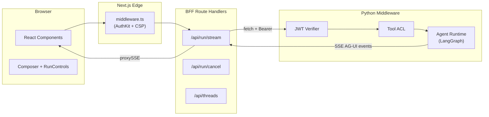
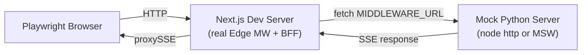

# Playwright Testing Architecture Plan

## Architecture Overview

The frontend data flow has four hops that define the mocking boundaries:



Three testing tiers map to three mock cut-points along this chain:

| Tier | Name | Mock Point | What Runs Real | CI Cadence |
|------|------|-----------|----------------|------------|
| T1 | SSE-Mocked | `page.route("/api/run/stream")` | Browser + Next.js Edge MW | Per-commit |
| T2 | BFF Integration | Mock Python middleware (MSW or test HTTP server) | Browser + Edge MW + BFF routes | Nightly |
| T3 | Full-Stack E2E | Nothing mocked | Everything | On-demand / release gate |

---

## Tier 1: SSE-Mocked Tests (Deterministic, CI-safe)

### Mock Strategy

Playwright's `page.route()` intercepts outbound requests at the browser network layer. For SSE streams, return a `ReadableStream` that emits canned AG-UI events as `text/event-stream`.

The key mock target is `/api/run/stream` (POST). Thread CRUD (`/api/threads`) is also mocked for sidebar tests.

### SSE Fixture Factory

Create a helper that builds a `ReadableStream<Uint8Array>` from an array of AG-UI event objects. This is the core reusable primitive.

Located at [frontend/e2e/fixtures/sse-mock.ts](frontend/e2e/fixtures/sse-mock.ts):

```typescript
import type { AGUIEvent } from "../../lib/wire/ag_ui_events";

export function buildSSEStream(
  events: AGUIEvent[],
  opts?: { delayMs?: number },
): ReadableStream<Uint8Array> {
  const encoder = new TextEncoder();
  const delay = opts?.delayMs ?? 50;
  return new ReadableStream({
    async start(controller) {
      for (const evt of events) {
        const line = `data: ${JSON.stringify(evt)}\n\n`;
        controller.enqueue(encoder.encode(line));
        await new Promise((r) => setTimeout(r, delay));
      }
      controller.close();
    },
  });
}
```

### Canned Event Sequences

Located at [frontend/e2e/fixtures/scenarios.ts](frontend/e2e/fixtures/scenarios.ts). Each scenario is an array of `AGUIEvent` objects that mirrors Appendix B of [docs/FRONTEND_VALIDATION.md](docs/FRONTEND_VALIDATION.md):

- **`plainMarkdown`** -- `RUN_STARTED` -> `TEXT_MESSAGE_START` -> N x `TEXT_MESSAGE_CONTENT` -> `TEXT_MESSAGE_END` -> `RUN_FINISHED`. Exercises: streaming markdown (SS2.4), TTFT (SS2.14).
- **`toolCallSuccess`** -- adds `TOOL_CALL_START` -> `TOOL_CALL_ARGS` -> `TOOL_CALL_END` -> `TOOL_RESULT` between text events. Exercises: tool cards (SS2.8).
- **`toolCallError`** -- `TOOL_RESULT` carries an error message; no `TOOL_CALL_END` follow-up. Exercises: errored tool card.
- **`longStream`** -- 50+ `TEXT_MESSAGE_CONTENT` deltas with 100ms spacing. Exercises: stop/regenerate (SS2.5).
- **`runError`** -- `RUN_STARTED` -> `RUN_ERROR`. Exercises: error resilience (SS2.15).

Every event carries `raw_event: { trace_id: "test-trace-abc123" }` -- satisfying the AG-UI wire contract (W5) and enabling `trace_id` provenance assertions (SS3.5).

### Auth Mock

For T1, auth is mocked at the Edge Middleware level. Two approaches:

1. **`storageState` with a valid WorkOS session cookie** -- fastest, but requires a real WorkOS test user provisioned once.
2. **`page.route()` on the AuthKit redirect** -- intercept the WorkOS redirect and return a session cookie directly. More fragile, but works without WorkOS credentials.

Recommendation: use approach 1 with a `global-setup.ts` that authenticates once and saves `storageState`. Tests that exercise the unauthenticated path skip this fixture.

### What T1 Validates

All of SS2 (feature checks) and SS3 (security checks) from [docs/FRONTEND_VALIDATION.md](docs/FRONTEND_VALIDATION.md), except:

- SS2.10 (trust badge tamper rejection) -- needs real signed envelopes from Python
- SS2.14 TTFT accuracy -- mocked latency is artificial; useful for regression, not absolute measurement
- SS2.15 network resilience -- partially: `page.route()` can simulate 401/429/500 responses, but not mid-stream network drops (that requires `page.context().setOffline(true)`)

---

## Tier 2: BFF Integration Tests (Real Next.js + Mock Python)

### Mock Strategy

The BFF's only outward call is `forwardToMiddleware(path, init)` in [frontend/lib/bff/server_composition.ts](frontend/lib/bff/server_composition.ts), which fetches `${MIDDLEWARE_URL}${path}`. The mock is a lightweight HTTP server that stands in for the Python middleware.



### Mock Python Server

Located at [frontend/e2e/fixtures/mock-middleware.ts](frontend/e2e/fixtures/mock-middleware.ts). A Node.js `http.createServer` that:

1. Validates `Authorization: Bearer <token>` on every request (mirrors `middleware/adapters/auth/workos_jwt_verifier.py`).
2. On `POST /run/stream`, writes `text/event-stream` using the same `scenarios.ts` fixtures, but respecting the full SSE format including `: ping` heartbeat comments (X4 contract).
3. On `POST /run/cancel`, returns 204.
4. On `GET/POST /threads/*`, returns canned thread state matching `ThreadStateSchema`.

This server starts in `playwright.config.ts` as a second `webServer` entry alongside `pnpm dev`:

```typescript
webServer: [
  { command: "pnpm dev", url: BASE_URL, reuseExistingServer: true },
  { command: "tsx e2e/fixtures/mock-middleware.ts", url: "http://localhost:8765/healthz" },
],
```

Environment: `MIDDLEWARE_URL=http://localhost:8765` so the real BFF proxies to the mock.

### What T2 Validates Over T1

- **Real Edge Middleware headers** -- CSP nonce injection, HSTS, all security headers are set by the real `middleware.ts`, not mocked.
- **Real BFF proxy behavior** -- `proxySSE` streaming headers (`Content-Type: text/event-stream`, `Cache-Control: no-cache`, `X-Accel-Buffering: no`), `Content-Encoding` stripping, and error status passthrough.
- **Auth cookie lifecycle** -- WorkOS session cookie set by the real AuthKit middleware, not faked via `storageState`.
- **Thread CRUD** -- real `serverPortBag()` composition with `InMemoryThreadRepo` (or the mock Python server's `/threads` endpoint).

### T2 Test Files

These specs run only at T2 (tagged with `test.describe.configure({ mode: "serial" })` and gated on `MIDDLEWARE_URL` pointing at the mock):

- `e2e/integration/bff-stream-proxy.spec.ts` -- SSE passthrough fidelity, heartbeat forwarding, mid-stream error propagation.
- `e2e/integration/bff-auth-flow.spec.ts` -- 401 from mock middleware -> BFF returns 401 -> frontend redirects to auth.
- `e2e/integration/bff-thread-crud.spec.ts` -- create, list, get, rename threads through real BFF routes.

---

## Tier 3: Full-Stack E2E Tests (Real Backend)

### Strategy

No mocks. Playwright talks to a running frontend that proxies to a real Python middleware + agent runtime. These are the tests from SS1 (smoke) and SS5 (sign-off gate 5) in [docs/FRONTEND_VALIDATION.md](docs/FRONTEND_VALIDATION.md).

### Prerequisites

- `E2E_AUTHENTICATED=1` (session storage pre-populated)
- `E2E_USER_EMAIL` / `E2E_USER_OTP` or `E2E_USER_PASSWORD`
- Running backend: `docker compose up` or `python -m middleware.server` + agent runtime
- `BASE_URL` pointing at the frontend (default `http://localhost:3000`)
- `MIDDLEWARE_URL` pointing at the real Python middleware

### What T3 Validates Over T2

- **Real LLM responses** -- non-deterministic; tests use structural assertions (e.g., "response contains at least 10 characters") not exact string matching.
- **Real tool execution** -- shell tool calls, file I/O, tool ACL enforcement from the Python middleware.
- **Real trust envelopes** -- signed `AgentFacts`, enabling SS2.10 (tamper rejection) and SS3.8 (sealed envelopes).
- **Real TTFT measurement** -- 5-run median, <500ms p50 threshold (SS2.14).
- **Real error codes** -- 429 from actual rate limiting, 500 from actual server errors.

### T3 Test Files

Reuse the existing [frontend/e2e/smoke.spec.ts](frontend/e2e/smoke.spec.ts) (refactored to import shared fixtures). New specs:

- `e2e/full-stack/trust-badge.spec.ts` -- SS2.10 with real signed envelopes.
- `e2e/full-stack/ttft-benchmark.spec.ts` -- 5-run TTFT measurement with p50 assertion.

---

## Shared Fixtures and Helpers

### File Structure

```
frontend/e2e/
├── fixtures/
│   ├── auth.fixture.ts              # storageState-based authenticated page
│   ├── sse-mock.ts                  # buildSSEStream() helper
│   ├── scenarios.ts                 # Canned AG-UI event sequences
│   ├── mock-middleware.ts           # Node HTTP server for T2
│   ├── prompts.ts                   # Appendix B prompt strings
│   └── helpers.ts                   # sendMessage(), waitForResponse(), etc.
├── smoke.spec.ts                    # (existing, refactored)
├── auth.spec.ts                     # T1: auth flow
├── chat-shell.spec.ts               # T1: layout, autoscroll
├── composer.spec.ts                 # T1: keyboard, autosize, a11y
├── streaming.spec.ts                # T1: aria-live, incremental, no focus theft
├── run-controls.spec.ts             # T1: stop, regenerate, edit & resend
├── thread-sidebar.spec.ts           # T1: CRUD, navigation
├── theme.spec.ts                    # T1: toggle, persist, FOUC
├── tool-cards.spec.ts               # T1: render, collapse, error state
├── generative-ui.spec.ts            # T1: inline panel, sandboxed iframe
├── observability.spec.ts            # T1: trace_id, console silence
├── mobile-responsive.spec.ts        # T1: iPhone 14, iPad viewports
├── accessibility.spec.ts            # T1: tab order, axe-core
├── error-resilience.spec.ts         # T1: 401/429/500 simulation
├── security/
│   ├── csp.spec.ts                  # T1: CSP directives
│   ├── iframe-sandbox.spec.ts       # T1: sandbox="allow-scripts"
│   ├── jwt-storage.spec.ts          # T1: no JWT in browser storage
│   ├── xss-surface.spec.ts          # T1: no dangerouslySetInnerHTML
│   ├── trace-id.spec.ts             # T1: server-originated trace_id
│   ├── sealed-envelope.spec.ts      # T3: frozen objects
│   └── headers.spec.ts              # T1: HSTS, X-Content-Type, etc.
├── integration/
│   ├── bff-stream-proxy.spec.ts     # T2: SSE passthrough fidelity
│   ├── bff-auth-flow.spec.ts        # T2: auth error propagation
│   └── bff-thread-crud.spec.ts      # T2: thread CRUD through real BFF
├── full-stack/
│   ├── trust-badge.spec.ts          # T3: real signed envelopes
│   └── ttft-benchmark.spec.ts       # T3: 5-run TTFT measurement
└── cross-browser/
    └── matrix.spec.ts               # T1/T3: smoke across browser/device combos
```

### Auth Fixture

[frontend/e2e/fixtures/auth.fixture.ts](frontend/e2e/fixtures/auth.fixture.ts) -- extends `@playwright/test` with an `authenticatedPage` fixture that uses saved `storageState`:

```typescript
import { test as base, type Page } from "@playwright/test";

export const test = base.extend<{ authenticatedPage: Page }>({
  authenticatedPage: async ({ browser }, use) => {
    const ctx = await browser.newContext({
      storageState: process.env.E2E_STORAGE_STATE ?? "e2e/.auth/state.json",
    });
    const page = await ctx.newPage();
    await use(page);
    await ctx.close();
  },
});
```

### Message Send Helper

[frontend/e2e/fixtures/helpers.ts](frontend/e2e/fixtures/helpers.ts):

```typescript
export async function sendMessage(page: Page, text: string) {
  const composer = page.locator("[data-testid='composer'], textarea");
  await composer.first().waitFor({ timeout: 10_000 });
  await composer.first().fill(text);
  const mod = process.platform === "darwin" ? "Meta" : "Control";
  await composer.first().press(`${mod}+Enter`);
}

export async function waitForResponse(page: Page, timeout = 30_000) {
  return page.locator("[data-testid='message-content'], [role='log']")
    .first().waitFor({ timeout });
}
```

---

## Playwright Config Changes

[frontend/playwright.config.ts](frontend/playwright.config.ts) needs expansion for:

1. **Test directory structure** -- `testDir` stays `./e2e` but add `testMatch` or folder-based filtering.
2. **Cross-browser projects** (SS4):

```typescript
projects: [
  { name: "chromium-desktop", use: { ...devices["Desktop Chrome"] } },
  { name: "mobile-safari",   use: { ...devices["iPhone 14"] } },
  { name: "webkit-desktop",  use: { ...devices["Desktop Safari"] } },
  { name: "firefox-desktop", use: { ...devices["Desktop Firefox"] } },
  { name: "ipad",            use: { ...devices["iPad (gen 7)"] } },
],
```

3. **Global setup** for auth:

```typescript
globalSetup: process.env.E2E_AUTHENTICATED ? "./e2e/global-setup.ts" : undefined,
```

4. **Second webServer for T2**:

```typescript
webServer: [
  { command: "pnpm dev", url: BASE_URL, reuseExistingServer: true, timeout: 30_000 },
  ...(process.env.MOCK_MIDDLEWARE ? [{
    command: "tsx e2e/fixtures/mock-middleware.ts",
    url: "http://localhost:8765/healthz",
    timeout: 10_000,
  }] : []),
],
```

---

## SSE Mock Details for T1

### How `page.route()` Returns SSE

Playwright's route handler can return a streaming response by fulfilling with a `body` that is a `Buffer` of SSE data. For true streaming simulation (tokens arriving over time), use `route.fulfill()` with pre-built SSE text:

```typescript
await page.route("**/api/run/stream", async (route) => {
  const events = scenarios.plainMarkdown("test-run-1", "test-thread-1");
  const sseText = events
    .map((e) => `data: ${JSON.stringify(e)}\n\n`)
    .join("");
  await route.fulfill({
    status: 200,
    contentType: "text/event-stream",
    headers: {
      "Cache-Control": "no-cache",
      "X-Accel-Buffering": "no",
    },
    body: sseText,
  });
});
```

For tests that need timing fidelity (TTFT, stop-button), Playwright does not natively support chunked streaming in `route.fulfill()`. Options:
- Use the mock middleware server (T2) with controlled delays.
- For T1, assert structural properties (button appeared, text grew) rather than exact timing.

### Thread Mock for Sidebar Tests

```typescript
await page.route("**/api/threads", async (route) => {
  if (route.request().method() === "GET") {
    await route.fulfill({
      status: 200,
      contentType: "application/json",
      body: JSON.stringify({
        threads: [
          { thread_id: "t1", user_id: "u1", messages: [], created_at: "...", updated_at: "..." },
        ],
        nextCursor: null,
      }),
    });
  } else {
    await route.fulfill({
      status: 200,
      contentType: "application/json",
      body: JSON.stringify({
        thread_id: "t-new", user_id: "u1", messages: [], created_at: "...", updated_at: "...",
      }),
    });
  }
});
```

---

## Middleware / Adapter Testing (T2 Deep Dive)

### What the Mock Python Server Validates

The mock server in `e2e/fixtures/mock-middleware.ts` tests the **BFF-to-middleware contract**:

1. **Auth header forwarding** -- BFF sends `Authorization: Bearer <token>` (from [frontend/app/api/run/stream/route.ts](frontend/app/api/run/stream/route.ts) line 38). Mock validates it.
2. **Request body passthrough** -- BFF forwards `req.text()` verbatim. Mock parses and validates against `RunCreateRequestSchema`.
3. **SSE headers from proxySSE** -- Mock returns raw SSE; `proxySSE` in [frontend/lib/transport/edge_proxy.ts](frontend/lib/transport/edge_proxy.ts) strips `Content-Encoding` and sets `X-Accel-Buffering: no`. Test asserts the browser-visible response headers.
4. **Error status passthrough** -- Mock returns 401/429/500; test verifies the browser sees the correct error UI.
5. **Heartbeat forwarding** -- Mock sends `: ping\n\n` comments in the SSE stream; test verifies the connection stays alive (no heartbeat timeout error in the UI).
6. **Cancel idempotency** -- Mock `/run/cancel` returns 204; test verifies the UI re-enables the composer.

### Mock Server Shape

```typescript
// e2e/fixtures/mock-middleware.ts
import http from "node:http";

const server = http.createServer((req, res) => {
  if (req.url === "/healthz") {
    res.writeHead(200); res.end("ok"); return;
  }
  if (req.url === "/run/stream" && req.method === "POST") {
    // Validate auth header
    // Write SSE events with delays
    // Include heartbeat comments
  }
  if (req.url === "/run/cancel" && req.method === "POST") {
    res.writeHead(204); res.end(); return;
  }
  // ... thread endpoints
});

server.listen(8765, () => console.log("Mock middleware on :8765"));
```

This is a **real HTTP server** (not MSW) because:
- MSW intercepts at the `fetch` layer inside the Node.js process, but the BFF runs inside the Next.js server process, not the Playwright runner process.
- A real HTTP server on a port correctly simulates the network boundary the BFF crosses.

---

## Accessibility and Performance Testing

### axe-core Integration

Add `@axe-core/playwright` dependency. In [frontend/e2e/accessibility.spec.ts](frontend/e2e/accessibility.spec.ts):

```typescript
import AxeBuilder from "@axe-core/playwright";

test("zero serious a11y violations on chat page", async ({ page }) => {
  await page.goto("/");
  const results = await new AxeBuilder({ page })
    .withTags(["wcag2a", "wcag2aa", "wcag22aa"])
    .analyze();
  expect(results.violations.filter(v => 
    v.impact === "serious" || v.impact === "critical"
  )).toHaveLength(0);
});
```

### TTFT Benchmark (T3 Only)

In [frontend/e2e/full-stack/ttft-benchmark.spec.ts](frontend/e2e/full-stack/ttft-benchmark.spec.ts):

```typescript
const RUNS = 5;
const measurements: number[] = [];

for (let i = 0; i < RUNS; i++) {
  test(`TTFT run ${i + 1}`, async ({ page }) => {
    await page.goto("/");
    const start = Date.now();
    await sendMessage(page, "What is 1 + 1?");
    await waitForResponse(page);
    measurements.push(Date.now() - start);
  });
}

test("TTFT p50 < 500ms", () => {
  measurements.sort((a, b) => a - b);
  const p50 = measurements[Math.floor(measurements.length / 2)];
  expect(p50).toBeLessThan(500);
});
```

---

## CI/CD Integration

| Tier | Trigger | Duration | Env Vars |
|------|---------|----------|----------|
| T1 (SSE-mocked) | Per-commit / PR | ~2 min | None required |
| T2 (BFF integration) | Nightly | ~5 min | `MOCK_MIDDLEWARE=1` |
| T3 (Full-stack) | Release gate / on-demand | ~15 min | `E2E_AUTHENTICATED=1`, `E2E_USER_EMAIL`, `BASE_URL`, `MIDDLEWARE_URL` |
| Cross-browser matrix | Release gate | ~20 min | Same as T3 |

### Package.json Scripts

```json
{
  "test:e2e:t1": "playwright test --ignore-pattern='**/integration/**' --ignore-pattern='**/full-stack/**'",
  "test:e2e:t2": "MOCK_MIDDLEWARE=1 playwright test e2e/integration/",
  "test:e2e:t3": "playwright test e2e/full-stack/",
  "test:e2e": "playwright test"
}
```

---

## New Dependencies

- `@axe-core/playwright` -- accessibility testing in Playwright (devDependency)

No other new dependencies needed. The mock middleware server uses Node.js built-in `http` module.
