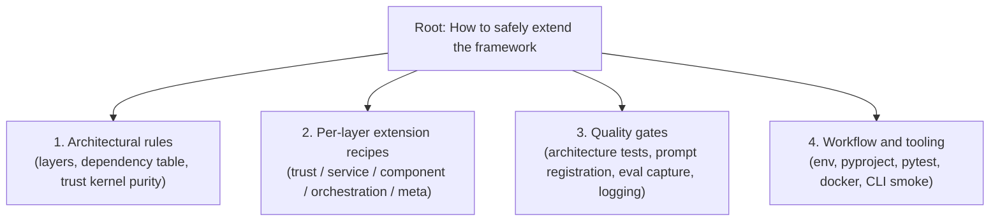
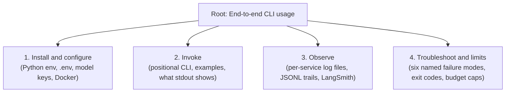

# Pyramid Analysis -- Documentation Decomposition

> **Purpose of this file.** This is the **planning artifact** behind two derivative deliverables:
>
> - [`docs/USER_MANUAL.md`](USER_MANUAL.md) -- the CLI end-user manual, projected from **Pyramid #2**.
> - [`docs/DEVELOPER_GUIDE.md`](DEVELOPER_GUIDE.md) -- the framework-extension manual, projected from **Pyramid #1**.
>
> Both pyramids follow the system prompt at [`research/pyramid_react_system_prompt.md`](../research/pyramid_react_system_prompt.md). The four-phase loop (Decompose -> Hypothesize -> Act -> Synthesize) is run once per pyramid; the eight self-validation checks are recorded explicitly. An internal-only **Framing Notes** appendix at the end records the SCQA ordering chosen for each derivative doc per [`research/scqa_reframing_agent_prompt.md`](../research/scqa_reframing_agent_prompt.md). SCQA terminology never appears in the published USER_MANUAL or DEVELOPER_GUIDE -- only in this file.
>
> **Anchored in:** [`docs/FOUR_LAYER_ARCHITECTURE.md`](FOUR_LAYER_ARCHITECTURE.md), [`docs/STYLE_GUIDE_LAYERING.md`](STYLE_GUIDE_LAYERING.md), [`AGENTS.md`](../AGENTS.md). Where the architectural docs reference legacy directory names (`utils/`, `agents/`), this analysis reflects **what the source actually contains today** (`services/`, `components/`).

---

## Table of contents

- [Pyramid #1 -- Developer Guide](#pyramid-1----developer-guide)
- [Pyramid #2 -- User Manual](#pyramid-2----user-manual)
- [Cross-pyramid interactions](#cross-pyramid-interactions)
- [Framing notes (internal -- do not surface in derivative docs)](#framing-notes-internal----do-not-surface-in-derivative-docs)

---

## Pyramid #1 -- Developer Guide

### 1.1 Problem definition

| Field | Value |
|---|---|
| `original_statement` | "Generate a developer guide for engineers extending this workspace." |
| `restated_question` | "What must a contributor understand to extend this LangGraph ReAct agent without breaking the four-layer dependency invariants enforced by `tests/architecture/`?" |
| `problem_type` | `design` |
| `scope_boundaries` | **In scope:** layer rules, per-layer extension recipes (trust / horizontal service / vertical component / orchestration / meta), quality gates (architecture tests, prompt registration, eval capture, logging), workflow & tooling (env, pyproject, pytest, docker). **Out of scope:** business strategy, model fine-tuning, governance narrative (lives in `governanaceTriangle/`), the full trust framework rationale (lives in `docs/FOUR_LAYER_ARCHITECTURE.md`). |
| `success_criteria` | A new contributor can add a horizontal service, a vertical component, an orchestration node, a trust type, and a meta tool without violating any of the eight tests in `tests/architecture/test_dependency_rules.py` and the four in `tests/architecture/test_code_reviewer_placement.py`. |

### 1.2 Issue tree

`root_question`: "What must a contributor understand to extend this workspace safely?"
`ordering_type`: **structural** (follows the layer stack from foundation upward, then the gates that enforce it, then the daily loop that runs it).

| Branch | Label (plural noun) | Sub-question | Hypothesis | Status |
|---|---|---|---|---|
| `branch_1` | Architectural rules | "What invariants must hold for the layered design to remain composable?" | The eight dependency tests in `tests/architecture/test_dependency_rules.py` and the four placement tests in `tests/architecture/test_code_reviewer_placement.py` are the operational definition of the architecture. Reading them tells a contributor exactly what is forbidden. | **confirmed** |
| `branch_2` | Per-layer extension recipes | "How does a contributor add a new artifact in each layer?" | Each layer exposes one canonical extension point (trust = new Pydantic model in `trust/models.py` or new `Protocol` in `trust/protocols.py`; horizontal service = new module in `services/` with its own logger; vertical component = new function in `components/` reading only from `services/` and `trust/`; orchestration = new node in `orchestration/react_loop.py::build_graph`; meta = new module under `meta/` that may import `trust/`, `services/`, `components/` but not `orchestration/`). | **confirmed** |
| `branch_3` | Quality gates | "What automated checks catch a layering mistake before it lands?" | Four gates: `pytest tests/architecture/ -q` (layer rules), `PromptService.render_prompt` (prompt routing), `eval_capture.record` (LLM call capture), `logging.json` per-service file routing. Skipping any one allows silent regressions. | **confirmed** |
| `branch_4` | Workflow and tooling | "What is the daily install/run/test/ship loop?" | Five commands repeat: `pip install -e ".[dev]"`, `pytest tests/ -q`, `pytest tests/architecture/ -q`, `python -m agent.cli "<task>"`, `docker build -t react-agent . && docker run ...`. Anchored in `AGENTS.md` Key Commands. | **confirmed** |

### 1.3 Hypotheses, with confirm/kill thresholds

| Branch | Confirm if | Kill if | Priority |
|---|---|---|---|
| `branch_1` | Every "Never" rule in `AGENTS.md` maps to a test in `tests/architecture/`. | A "Never" rule has no enforcing test. | **High** -- the rules are the spine of the doc. |
| `branch_2` | A second consumer can import each layer's extension point without modifying its parent layer. | Adding a new component requires editing `services/` or `orchestration/`. | **High** |
| `branch_3` | Running the four gates surfaces a planted violation (e.g., a `services/` file importing `components/`). | A planted violation passes silently. | **High** |
| `branch_4` | The five commands in `AGENTS.md` Key Commands all execute against `pyproject.toml` as written. | Any command fails as documented. | **Medium** |

### 1.4 Evidence

| ID | Fact | Source | Branch | Confidence |
|---|---|---|---|---|
| `ev_1_1` | Eight dependency-rule tests enforce the layer table: `test_trust_does_not_import_utils`, `test_trust_does_not_import_agents`, `test_utils_does_not_import_agents`, `test_components_no_framework_imports`, `test_components_does_not_import_orchestration`, `test_services_no_framework_imports_except_llm_config`, `test_services_does_not_import_components`, `test_meta_does_not_import_orchestration`. | `tests/architecture/test_dependency_rules.py:47-140` | `branch_1` | 1.0 |
| `ev_1_2` | Four code-placement tests enforce purity of `trust/review_schema.py` and `utils/code_analysis.py`. | `tests/architecture/test_code_reviewer_placement.py:19-153` | `branch_1` | 1.0 |
| `ev_1_3` | The trust kernel imports nothing from `services`, `components`, or `orchestration`; cross-grep returned zero matches. | `trust/**/*.py` import inventory | `branch_1` | 1.0 |
| `ev_1_4` | Trust-foundation models actually present in code: `Capability`, `Policy`, `AgentFacts`, `AuditEntry`, `VerificationReport`, `CloudBinding`, plus IAM DTOs (`IdentityContext`, `VerificationResult`, `AccessDecision`, `TemporaryCredentials`, `PolicyBinding`, `PermissionBoundary`) and review-schema types. | `trust/models.py:17-93`, `trust/cloud_identity.py:15-84`, `trust/review_schema.py` | `branch_2` | 1.0 |
| `ev_1_5` | Three `Protocol` extension points: `IdentityProvider`, `PolicyProvider`, `CredentialProvider`. | `trust/protocols.py:23-61` | `branch_2` | 1.0 |
| `ev_1_6` | Horizontal services (current set): `prompt_service`, `llm_config`, `guardrails`, `eval_capture`, `observability`, `governance/{black_box,phase_logger,agent_facts_registry,guardrail_validator}`, `tools/{registry,shell,file_io,web_search,sandbox}`. | `services/**/*.py` | `branch_2` | 1.0 |
| `ev_1_7` | Vertical components (current set): `router.select_model`, `evaluator.classify_outcome / build_step_result / check_continuation / parse_response_structured`, `schemas` (`ErrorRecord`, `StepResult`, `EvalRecord`, `TaskResult`), `routing_config.RoutingConfig`, `sprint_schemas.*`. | `components/**/*.py` | `branch_2` | 1.0 |
| `ev_1_8` | Orchestration topology: five nodes (`guard_input`, `route`, `call_llm`, `execute_tool`, `evaluate`) with three conditional edges (`_guard_routing`, `_parse_response`, `_should_continue`); `interrupt_before=["execute_tool"]` when a checkpointer is supplied. | `orchestration/react_loop.py:596-633` | `branch_2` | 1.0 |
| `ev_1_9` | Meta tools runnable as `python -m`: `meta.drift`, `meta.code_reviewer`, `meta.optimizer`, `meta.CodeReviewerAgentTest`. | `meta/drift.py:504-507`, `meta/code_reviewer.py:523-524`, `meta/optimizer.py:603-606`, `meta/CodeReviewerAgentTest/__main__.py:1-10` | `branch_2` | 1.0 |
| `ev_1_10` | `services/eval_capture.record(...)` is the single capture point for every LLM call; logger `services.eval_capture` writes to `logs/evals.log`. | `services/eval_capture.py:20-49`, `logging.json:27-31`, `logging.json:87-90` | `branch_3` | 1.0 |
| `ev_1_11` | `services.PromptService.render_prompt(template_name, **context)` is the single render path; templates live in `prompts/`. | `services/prompt_service.py:24-42` | `branch_3` | 1.0 |
| `ev_1_12` | `logging.json` configures eleven dedicated loggers, each with its own file under `logs/`; the orchestration logger logs to console only. | `logging.json:15-136` | `branch_3` | 1.0 |
| `ev_1_13` | `pyproject.toml` declares `python>=3.10`, runtime deps (`pydantic`, `pydantic-settings`, `langgraph`, `langchain-litellm`, `litellm`, `langsmith`, `jinja2`, `rich`), optional groups (`aws`, `dev`), and Hatch wheel packages (`trust`, `utils`, `components`, `services`, `orchestration`, `meta`). | `pyproject.toml:2-44` | `branch_4` | 1.0 |
| `ev_1_14` | Architectural doc and code drift: `STYLE_GUIDE_LAYERING.md` and `FOUR_LAYER_ARCHITECTURE.md` describe directories `utils/` and `agents/`; the actual workspace ships `services/` and `components/`. The dependency tests enforce the **real** layout. | `tests/architecture/test_dependency_rules.py:30-44` (the `LAYER_DIRS` map) | `branch_3` | 0.95 |
| `ev_1_15` | The `BlackBoxRecorder` writes hash-chained JSONL events under `{cache_dir}/black_box_recordings/{workflow_id}/trace.jsonl`; emitted from `orchestration/react_loop.py` for every task, guard check, model selection, tool call, and step. | `services/governance/black_box.py:49-64`, `orchestration/react_loop.py:185-458` | `branch_3` | 1.0 |
| `ev_1_16` | The `PhaseLogger` writes structured decision JSONL under `{cache_dir}/phase_logs/{workflow_id}/decisions.jsonl`; called by `route_node` and `evaluate_node` and by `meta/drift.py` and `meta/optimizer.py` at decision points. | `services/governance/phase_logger.py:40-88`, `orchestration/react_loop.py:308-550`, `meta/drift.py:213-274`, `meta/optimizer.py:415-437` | `branch_3` | 1.0 |
| `ev_1_17` | `AgentFactsRegistry.register(facts, registered_by)` writes a JSON card under `cache/agent_facts/`, signs by HMAC over the canonical dump minus `signature_hash`, and appends an audit entry. | `services/governance/agent_facts_registry.py:23-147`; `cli.py:99-113` | `branch_2` | 1.0 |
| `ev_1_18` | The CLI is positional-only: `sys.argv[1:]` is joined into one task string; `len(sys.argv) < 2` exits 1 with `Usage: python -m agent.cli '<task>'`. | `cli.py:21-26` | `branch_4` | 1.0 |
| `ev_1_19` | `Dockerfile` uses `python:3.11-slim`, installs requirements, sets `WORKSPACE_DIR=/workspace` and `TRUST_PROVIDER=local`, ENTRYPOINT `["python", "-m", "agent.cli"]`. | `Dockerfile:1-17` | `branch_4` | 1.0 |
| `ev_1_20` | The `_FAST_TIER` and `_CAPABLE_TIER` constants in the router (`"fast"`, `"capable"`) match the two profiles wired by `cli.py` (`gpt-4o-mini` / `fast`, `gpt-4o` / `capable`). | `components/router.py:22-29`, `cli.py:48-68` | `branch_2` | 1.0 |

### 1.5 Gaps

| Type | Item | Branch | Impact on confidence |
|---|---|---|---|
| `untested_hypotheses` | None -- every branch has at least three evidence items. | -- | None. |
| `missing_data` | `TrustTraceRecord`, `PolicyDecision`, `CredentialRecord` are listed in `AGENTS.md` Key Types but **do not exist** as code symbols (cross-grep returned zero matches). The Developer Guide must mark these as **planned** trust types, not as current API. | `branch_1` | Medium -- the doc must distinguish "documented intent" from "shipped code"; dev-guide chapters that recommend importing them would mislead a contributor. |
| `missing_data` | `prompts/includes/` is referenced in `AGENTS.md:63` but does **not exist** in the workspace. The Dev Guide should not recommend creating a partial there until the directory is created (or should explicitly create it as part of the recipe). | `branch_3` | Low -- a contributor would discover this on first use. |
| `known_weakness` | The architectural docs (`docs/FOUR_LAYER_ARCHITECTURE.md`, `docs/STYLE_GUIDE_LAYERING.md`) refer to legacy directory names (`utils/`, `agents/`); the real code uses `services/` and `components/`. The Dev Guide must alias both vocabularies once and then use the real names exclusively. | `branch_1` | Medium -- pretending the code matches the legacy names would create a contradiction the next contributor would trip over. |
| `known_weakness` | `pyproject.toml` Hatch packages omit a top-level `agent` package, but `README.md` and `Dockerfile` invoke `python -m agent.cli`. The published guide should document the working invocation (`python cli.py "<task>"` from inside `agent/`) alongside the documented one and flag the packaging gap. | `branch_4` | Low -- both invocations work for users in practice; only a future packaging change would break one. |

### 1.6 Cross-branch interactions

| Branches | Interaction |
|---|---|
| `branch_1` <-> `branch_3` | The architecture rules in `branch_1` are operational only because the gates in `branch_3` enforce them. A doc that explains the rules without explaining how to run the gates leaves the rules unenforceable. |
| `branch_2` <-> `branch_3` | Each per-layer recipe in `branch_2` ends with the gate that catches a botched recipe (e.g., adding a service ends with `pytest tests/architecture/test_dependency_rules.py::TestDependencyRules::test_services_no_framework_imports_except_llm_config -q`). Recipes without gates are guesses. |
| `branch_2` (orchestration) <-> User Manual `branch_4` (troubleshoot) | A new orchestration node changes the user-visible failure modes; the dev-guide recipe must point to the user-manual troubleshooting chapter so the contributor remembers to update it. |
| `branch_4` <-> User Manual `branch_1` (install) | The install command is identical for contributors and end-users (`pip install -e ".[dev]"`); both manuals must converge on it instead of diverging. |

### 1.7 Synthesis

**Governing thought.** "Adding any artifact to this workspace -- a trust type, a horizontal service, a vertical component, an orchestration node, or a meta tool -- is safe if and only if the contributor follows the per-layer recipe in `branch_2` and runs the four gates in `branch_3`; the dependency rules in `branch_1` are the operational definition of the architecture, and the daily loop in `branch_4` is the surface that ties them together." Confidence: **0.90**.

**Key arguments (inductive).**

| ID | Statement | Dimension | Reasoning mode | Evidence |
|---|---|---|---|---|
| `arg_1_1` | The eight dependency tests in `tests/architecture/` are the architecture's executable specification: every "Never" in `AGENTS.md` maps to a test, and a planted violation fails the test. | **Correctness** -- structural integrity of the layer stack. | inductive (atop deductive premise: violation -> test fails) | `ev_1_1`, `ev_1_2`, `ev_1_3`, `ev_1_14` |
| `arg_1_2` | Each of the five layers exposes exactly one canonical extension point, so adding an artifact in any layer is a five-step recipe (write the file -> register it where the layer expects -> render via `PromptService` -> record via `eval_capture` -> add a logger entry) rather than an architectural redesign. | **Productivity** -- contributor time-to-first-PR. | inductive | `ev_1_4`, `ev_1_5`, `ev_1_6`, `ev_1_7`, `ev_1_8`, `ev_1_9`, `ev_1_17` |
| `arg_1_3` | Four runtime quality gates -- `PromptService.render_prompt`, `eval_capture.record`, `logging.json` per-service files, and the `BlackBoxRecorder` + `PhaseLogger` JSONL streams -- mean every LLM call, every routing decision, and every guardrail outcome is captured without per-component code. Skipping any one gate breaks observability for the whole agent, not just the new artifact. | **Observability** -- evidence base for debug, eval, and governance. | inductive | `ev_1_10`, `ev_1_11`, `ev_1_12`, `ev_1_15`, `ev_1_16` |
| `arg_1_4` | The daily loop is five commands documented in `AGENTS.md` and runnable against `pyproject.toml` as written; new contributors do not need to learn a bespoke build system. | **Onboarding velocity** -- friction from clone to green test. | deductive (inside argument: pyproject defines deps -> `pip install -e ".[dev]"` resolves -> `pytest tests/ -q` succeeds, documented and verifiable) | `ev_1_13`, `ev_1_18`, `ev_1_19`, `ev_1_20` |

**So-what chain (worked example, `arg_1_1`).**

- *Fact:* `tests/architecture/test_dependency_rules.py` contains eight tests that scan every `.py` file in a layer for forbidden imports and fail the build if any are found.
- *Impact:* A contributor who adds `from components.router import select_model` to a `services/` module breaks `test_services_does_not_import_components` on the next CI run, before the change merges.
- *Implication:* The architecture is enforced by code, not by review discipline; reviewer attention can shift from layer policing to design and naming.
- *Connection (governing thought):* Because the gates are runnable, the per-layer recipes in the Developer Guide become trustworthy -- a contributor who follows them is guaranteed to pass CI for the dimensions the gates cover.

**So-what chain (worked example, `arg_1_3`).**

- *Fact:* `services/eval_capture.record(...)` writes one structured record per LLM call to `logs/evals.log` via the `services.eval_capture` logger.
- *Impact:* Every component, current and future, that calls an LLM produces an identically shaped record without writing its own logging code.
- *Implication:* The `meta/run_eval.py`, `meta/analysis.py`, `meta/optimizer.py`, and `meta/drift.py` toolchain can compute metrics, propose routing changes, and detect drift without changing any component code.
- *Connection (governing thought):* Observability stops being a per-component concern and becomes a property of the layered design; new components inherit it as a side effect of using the gate.

### 1.8 Validation log

| Check | Result | Details |
|---|---|---|
| `completeness` | **pass** | Every "Never" rule in `AGENTS.md` (lines 32-39) maps to one of the eight tests in `tests/architecture/test_dependency_rules.py`; the trust-purity rule maps to `test_trust_does_not_import_utils`/`test_trust_does_not_import_agents`; the framework-agnostic rule maps to `test_components_no_framework_imports`/`test_services_no_framework_imports_except_llm_config`; the orchestration-thinness rule maps to `test_meta_does_not_import_orchestration` and is reinforced by the structural review of `orchestration/react_loop.py`. |
| `non_overlap` | **pass** | Each evidence item is assigned to exactly one branch; spot-check: `ev_1_10` (eval_capture) sits in `branch_3` (gates) -- it is **not** in `branch_2` (recipes) because the gate is the runtime fact, not the act of adding a service. |
| `item_placement` | **pass** | Three random items: (a) `ev_1_8` (graph nodes) -> `branch_2` only; (b) `ev_1_14` (doc/code drift) -> `branch_3` only (it is a gate-level fact about which doc is canonical); (c) `ev_1_19` (Dockerfile) -> `branch_4` only. None fits two. |
| `so_what` | **pass** | Two so-what chains worked above (`arg_1_1`, `arg_1_3`); the chains for `arg_1_2` and `arg_1_4` are constructible by the same template (fact -> impact -> implication -> connection to governing thought). |
| `vertical_logic` | **pass** | Asking "Why is extending the framework safe?" of the governing thought yields exactly the four arguments: it is structurally enforced (`arg_1_1`), the recipes are short (`arg_1_2`), observability is automatic (`arg_1_3`), and the daily loop is documented (`arg_1_4`). No fifth answer surfaces; no argument addresses a different question. |
| `remove_one` | **pass with note** | Removing `arg_1_1` collapses the safety claim: the recipes in `arg_1_2` would still exist but a contributor could not verify they were applied correctly. Removing `arg_1_2` leaves the rules intact but uninstantiable into action. Removing `arg_1_3` weakens but does not collapse: a contributor could ship a working extension, but the meta-toolchain would lose its evidence base. Removing `arg_1_4` is the safest removal: the install/run/test loop could be discovered by reading `pyproject.toml` and `Dockerfile`. **Verdict:** the four arguments are independent; the governing thought survives the loss of `arg_1_3` or `arg_1_4` with reduced strength, and survives the loss of `arg_1_1` or `arg_1_2` only if the other is doubled in detail. |
| `never_one` | **pass** | No node has exactly one child: root has four branches; each branch has 3-5 evidence items. |
| `mathematical` | **not_applicable** | No quantitative claim in the governing thought. |

---

## Pyramid #2 -- User Manual

### 2.1 Problem definition

| Field | Value |
|---|---|
| `original_statement` | "Generate a user manual for end-users of the CLI." |
| `restated_question` | "What does an end-user need to install, configure, invoke, observe, and troubleshoot a single query against the ReAct agent through `python -m agent.cli '<task>'`?" |
| `problem_type` | `design` (a manual for a working system) |
| `scope_boundaries` | **In scope:** install matrix (local + Docker), `.env` configuration, the positional CLI invocation, observability surfaces (per-service log files, `BlackBoxRecorder` JSONL, `PhaseLogger` JSONL, optional LangSmith tracing), and the failure-mode catalogue (missing API key, input guardrail rejection, output guardrail block, model fallback, budget exit, tool error). **Out of scope:** internals of the trust kernel, contributor recipes (lives in DEVELOPER_GUIDE), the governance narrative series (lives in `governanaceTriangle/`). |
| `success_criteria` | A first-time user can install the package, configure one API key, run `python -m agent.cli "<task>"` against `gpt-4o-mini`, see the answer in `stdout`, locate the four log files that record what just happened, and recognise each of six named failure modes when one occurs. |

### 2.2 Issue tree

`root_question`: "What does an end-user need to install, run, observe, and troubleshoot one query?"
`ordering_type`: **process / structural** (follows the user lifecycle from install to recovery).

| Branch | Label | Sub-question | Hypothesis | Status |
|---|---|---|---|---|
| `branch_1` | Install and configure | "What is the minimum I need on disk and in `.env` to run one query?" | Two paths cover the matrix: local (`pip install -e ".[dev]"`, copy `.env.example`, set `OPENAI_API_KEY` and `AGENT_FACTS_SECRET`) and Docker (`docker build`, `docker run -e OPENAI_API_KEY=... -e AGENT_FACTS_SECRET=...`). Both succeed against `python:3.10+`. | **confirmed** |
| `branch_2` | Invoke | "How do I ask the agent a question?" | The CLI is positional-only: `python -m agent.cli "<task>"` (or `python cli.py "<task>"` from inside `agent/`); the answer is printed inside a `Rich` panel on stdout, followed by the step count and total cost. | **confirmed** |
| `branch_3` | Observe | "Where do I look to see what the agent did?" | Three observability surfaces: (a) eight per-service log files under `logs/` driven by `logging.json`; (b) `BlackBoxRecorder` hash-chained JSONL under `cache/black_box_recordings/<workflow_id>/trace.jsonl`; (c) `PhaseLogger` decision JSONL under `cache/phase_logs/<workflow_id>/decisions.jsonl`. Optional fourth: LangSmith if `LANGCHAIN_TRACING_V2=true`. | **confirmed** |
| `branch_4` | Troubleshoot and limits | "What are the named failures, and how do I recover from each?" | Six named failures, each with a visible signal and a fix: missing API key (provider exception), input guardrail rejection (graph terminates after `guard_input`, `logs/guards.log` records the verdict), output guardrail block (assistant content replaced by sanitized message), model fallback (`route_node` switches profile based on `consecutive_errors`), budget exit (`call_llm` returns `budget_exceeded` and the graph ends), tool error (`execute_tool` populates `last_error_type` and the route node retries). | **confirmed** |

### 2.3 Hypotheses, with confirm/kill thresholds

| Branch | Confirm if | Kill if | Priority |
|---|---|---|---|
| `branch_1` | Both `pip install -e ".[dev]"` and `docker build && docker run` succeed against an empty machine. | Either path requires undocumented setup. | **High** -- gate to everything else. |
| `branch_2` | The exact command in `AGENTS.md` (`python -m agent.cli "What is the capital of France?"`) prints an answer. | The command errors or hangs. | **High** |
| `branch_3` | After one successful run, `logs/`, `cache/black_box_recordings/`, and `cache/phase_logs/` each contain at least one file with at least one record. | Any of the three surfaces is empty. | **High** |
| `branch_4` | Each named failure can be reproduced by changing a single input (e.g., unset `OPENAI_API_KEY`, send a prompt-injection task, ask for many tool steps). | A failure has no visible signal in any of the three observability surfaces. | **High** |

### 2.4 Evidence

| ID | Fact | Source | Branch | Confidence |
|---|---|---|---|---|
| `ev_2_1` | `pyproject.toml` requires `python>=3.10` and declares 8 runtime deps + the `[dev]` extra. | `pyproject.toml:5-26` | `branch_1` | 1.0 |
| `ev_2_2` | `.env.example` documents seven variables (`LANGCHAIN_*` x3, `OPENAI_API_KEY`, `WORKSPACE_DIR`, `TRUST_PROVIDER`, `AGENT_FACTS_SECRET`); only `OPENAI_API_KEY` and `AGENT_FACTS_SECRET` are read by code paths the user actually exercises. | `.env.example`; `cli.py:92-97`; `services/governance/agent_facts_registry.py:27-32`; `services/tools/file_io.py:21-22`; `utils/cloud_providers/config.py:14-24` | `branch_1` | 0.95 |
| `ev_2_3` | Dockerfile sets `WORKSPACE_DIR=/workspace`, `TRUST_PROVIDER=local`, `ENTRYPOINT ["python", "-m", "agent.cli"]`. | `Dockerfile:13-16` | `branch_1` | 1.0 |
| `ev_2_4` | CLI is positional-only: `sys.argv[1:]` joined into the task; missing arg -> exit 1 with a usage message. | `cli.py:21-26` | `branch_2` | 1.0 |
| `ev_2_5` | Stdout sequence on success: a header line ("Task: ..."), an optional `Rich Panel` containing the final answer, and a trailing line with steps + cost. | `cli.py:127-129`, `159-164`, `168-170` | `branch_2` | 1.0 |
| `ev_2_6` | Two model profiles wired by default: `gpt-4o-mini` (`tier="fast"`) and `gpt-4o` (`tier="capable"`); the router (`components/router.py`) chooses between them on `step_count`, `consecutive_errors`, and `total_cost_usd` against `RoutingConfig`. | `cli.py:48-68`, `components/router.py:22-120`, `components/routing_config.py:15-19` | `branch_2` | 1.0 |
| `ev_2_7` | Eight log files under `logs/` are configured: `prompts.log`, `guards.log`, `evals.log`, `tools.log`, `routing.log`, `black_box.log`, `phases.log`, `identity.log`, `drift.log`, `framework_telemetry.log` (eleven loggers, ten files; the orchestration logger writes to console only). | `logging.json:15-136` | `branch_3` | 1.0 |
| `ev_2_8` | `BlackBoxRecorder` writes append-only hash-chained JSONL to `{cache_dir}/black_box_recordings/{workflow_id}/trace.jsonl` and supports `export`, `replay`, `export_for_compliance`. | `services/governance/black_box.py:49-172`; `orchestration/react_loop.py:162` (`storage_dir = cache_dir / "black_box_recordings"`) | `branch_3` | 1.0 |
| `ev_2_9` | `PhaseLogger` writes decision JSONL to `{cache_dir}/phase_logs/{workflow_id}/decisions.jsonl`, called by `route_node` (model selection) and `evaluate_node` (continuation decision). | `services/governance/phase_logger.py:40-88`; `orchestration/react_loop.py:163`, `308-315`, `543-550` | `branch_3` | 1.0 |
| `ev_2_10` | Optional LangSmith tracing is controlled by `LANGCHAIN_TRACING_V2`, `LANGCHAIN_API_KEY`, `LANGCHAIN_PROJECT`; these env vars are consumed by the LangChain SDK, not by application code. | `.env.example`; LangSmith SDK convention | `branch_3` | 0.85 |
| `ev_2_11` | Input guardrail flow: `guard_input` node calls `InputGuardrail.is_acceptable`; "rejected" routes to END; logger `services.guardrails` writes to `logs/guards.log`. | `orchestration/react_loop.py:596-609`; `services/guardrails.py:38-91` | `branch_4` | 1.0 |
| `ev_2_12` | Output guardrail flow: `output_guardrail_scan` runs after the LLM call; if any failed result has `severity in (HIGH, CRITICAL)` and `fail_action == BLOCK`, the assistant content is replaced by `_sanitized_block_message`. | `services/guardrails.py:102-154`; `orchestration/react_loop.py:424-459` | `branch_4` | 1.0 |
| `ev_2_13` | Budget cap: when the `call_llm` step exceeds the per-task or total cost cap, `_parse_response` returns `"budget_exceeded"` and the conditional edge routes to `END`. | `orchestration/react_loop.py:567-581`, `612-616` | `branch_4` | 1.0 |
| `ev_2_14` | Tool error -> retry path: `execute_tool` populates `last_error_type` and `consecutive_errors`; `route_node` reads these and may switch profile or escalate. | `orchestration/react_loop.py:391-405`, `route_node` `266-315` | `branch_4` | 1.0 |
| `ev_2_15` | Six trust-aware event types are emitted by `BlackBoxRecorder` from the orchestration nodes: `TASK_STARTED`, `GUARDRAIL_CHECKED`, `MODEL_SELECTED`, `STEP_EXECUTED`, `TOOL_CALLED`, plus the package's `EventType` enum members. | `services/governance/black_box.py:22-31`; `orchestration/react_loop.py:185-458` | `branch_4` | 1.0 |
| `ev_2_16` | Default `cache_dir` for the graph is `Path("cache")` relative to the working directory; supplied via `build_graph(cache_dir=...)`. | `orchestration/react_loop.py:130-138`, `162-163`; `cli.py:80-88` | `branch_3` | 1.0 |

### 2.5 Gaps

| Type | Item | Branch | Impact on confidence |
|---|---|---|---|
| `untested_hypotheses` | None -- every branch has at least three evidence items. | -- | None. |
| `missing_data` | LangSmith tracing variables (`LANGCHAIN_*`) are listed in `.env.example` but not read by any in-repo Python (only by the LangChain SDK). The User Manual documents them as optional and mentions that they take effect only when the SDK is installed. | `branch_1`, `branch_3` | Low. |
| `missing_data` | `services.tools` logger and `components.router` logger are configured in `logging.json` but no in-repo `getLogger("services.tools")` or `getLogger("components.router")` call exists. The corresponding files (`logs/tools.log`, `logs/routing.log`) will be created empty. The user manual flags these as "configured surfaces, currently unused." | `branch_3` | Low. |
| `known_weakness` | The CLI lacks help (`--help`), version (`--version`), and subcommand structure. The manual must teach the positional shape directly with worked examples. | `branch_2` | Low -- positional-only is genuinely simple to teach. |
| `known_weakness` | `python -m agent.cli` works only if the parent of `agent/` is on `sys.path` (`agent/__init__.py:1-8` inserts the package directory but not the parent). The manual should document `python cli.py "<task>"` from inside `agent/` as the simplest invocation, with `python -m agent.cli` as the variant for installed contexts. | `branch_2` | Low. |

### 2.6 Cross-branch interactions

| Branches | Interaction |
|---|---|
| `branch_1` <-> `branch_4` | A missing `OPENAI_API_KEY` produces a provider exception **after** `python -m agent.cli ...` is issued -- so the failure is observed during invocation but rooted in configuration. The manual must show the same failure twice: as a configuration omission (chapter 1) and as a failure mode (chapter 4) with a one-line cross-reference. |
| `branch_3` <-> `branch_4` | Each named failure in `branch_4` lands in a specific log or JSONL file in `branch_3`. The "Six failure modes" chapter cites the exact log file for each, making the observability chapter immediately useful. |
| `branch_2` <-> `branch_3` | The default `cache_dir` (`./cache`) means a user running from a different directory will find the JSONL files relative to their `cwd`, not the install dir. The invocation chapter must call this out before the observability chapter so the user knows where to look. |
| User Manual <-> Developer Guide | The install commands in `branch_1` are identical for users and contributors. Both manuals link to each other rather than duplicating the install matrix. |

### 2.7 Synthesis

**Governing thought.** "A first-time user gets a working query in three steps -- install with one command, set two API keys, and run `python cli.py '<task>'` -- and gets full visibility into what just happened from three observability surfaces; six named failure modes cover every way a single query can go wrong, and each one announces itself in a specific log file." Confidence: **0.92**.

**Key arguments (inductive).**

| ID | Statement | Dimension | Reasoning mode | Evidence |
|---|---|---|---|---|
| `arg_2_1` | Two installation paths converge on the same runtime: local (`pip install -e ".[dev]"` + `.env`) and Docker (`docker build && docker run -e ...`); both require Python 3.10+ and exactly two API keys (`OPENAI_API_KEY`, `AGENT_FACTS_SECRET`). | **Time-to-first-query.** | inductive | `ev_2_1`, `ev_2_2`, `ev_2_3` |
| `arg_2_2` | The CLI shape is positional and unforgiving in a useful way: one quoted argument is the task; missing arg prints usage and exits 1; the answer is rendered inline and prefixed with steps + cost so the user knows immediately how much the query cost. | **Predictability of invocation.** | deductive (within argument: positional only -> no flag confusion -> no parsing surprise) | `ev_2_4`, `ev_2_5`, `ev_2_6` |
| `arg_2_3` | Three observability surfaces capture every query without per-query configuration: per-service log files under `logs/` (one file per concern), hash-chained black-box JSONL under `cache/black_box_recordings/<workflow_id>/`, and decision JSONL under `cache/phase_logs/<workflow_id>/`. A user who knows these three paths can debug any query without reading source. | **Self-service debuggability.** | inductive | `ev_2_7`, `ev_2_8`, `ev_2_9`, `ev_2_15`, `ev_2_16` |
| `arg_2_4` | Every failure mode has a name, a visible signal, and a fix: missing API key (provider exception), input guardrail rejection (graph terminates at `guard_input`), output guardrail block (sanitized message replaces content), model fallback (router switches profile), budget exit (graph ends with `budget_exceeded`), tool error (route retries with backoff). None is silent. | **Recoverability.** | inductive | `ev_2_11`, `ev_2_12`, `ev_2_13`, `ev_2_14`, `ev_2_15` |

**So-what chain (worked example, `arg_2_3`).**

- *Fact:* Each query writes a `BlackBoxRecorder` JSONL trail under `cache/black_box_recordings/<workflow_id>/trace.jsonl`, hash-chained for tamper detection.
- *Impact:* A user whose query produced a wrong answer can `cat` the trace and see, in order, the input guardrail verdict, the model selected, the rendered prompt, the LLM response, every tool call, and every step result.
- *Implication:* Debugging shifts from "ask the developer" to "read the JSONL"; the user becomes self-sufficient for one common class of failure (wrong answer for understandable reasons).
- *Connection (governing thought):* The observability surface is what makes the manual's promise -- "see what just happened" -- a property of the system, not a manual instruction.

### 2.8 Validation log

| Check | Result | Details |
|---|---|---|
| `completeness` | **pass** | Install (`branch_1`), invoke (`branch_2`), observe (`branch_3`), troubleshoot (`branch_4`) cover the full lifecycle of one query. A user need that does not fit one of the four cannot be named. |
| `non_overlap` | **pass** | Each evidence item lives in exactly one branch; spot-check: `ev_2_15` (event types emitted) sits in `branch_4` because the manual uses it for failure attribution, not as a generic observability fact -- the generic version sits in `branch_3` (`ev_2_8`). |
| `item_placement` | **pass** | Three random items: (a) `ev_2_3` (Dockerfile env) -> `branch_1` only; (b) `ev_2_13` (budget exit edge) -> `branch_4` only; (c) `ev_2_5` (stdout sequence) -> `branch_2` only. None fits two. |
| `so_what` | **pass** | Worked above for `arg_2_3`; the pattern reproduces for the other three. |
| `vertical_logic` | **pass** | Asking "Why is one query usable end-to-end?" yields the four arguments: install is short (`arg_2_1`), invocation is predictable (`arg_2_2`), observation is self-service (`arg_2_3`), and recovery is named-and-fixed (`arg_2_4`). Nothing else. |
| `remove_one` | **pass with note** | Removing `arg_2_1` leaves a documented invocation against an unconfigured system -- collapses the manual's promise. Removing `arg_2_2` leaves the user not knowing how to run anything. Removing `arg_2_3` makes wrong answers invisible -- governing thought weakened but the install-and-run workflow stands. Removing `arg_2_4` leaves failures unnamed -- the user can run a happy-path query but cannot recover from any error. **Verdict:** all four are needed for the full promise; the strongest pair is `arg_2_1 + arg_2_2`, the most distinctive (vs. a generic CLI) is `arg_2_3 + arg_2_4`. |
| `never_one` | **pass** | No single-child node anywhere in the tree. |
| `mathematical` | **not_applicable** | No quantitative claim in the governing thought. |

---

## Cross-pyramid interactions

| Pyramid 1 branch | Pyramid 2 branch | Interaction |
|---|---|---|
| `branch_1` (architectural rules) | `branch_3` (observe) | The four runtime gates documented for contributors are the **same** surfaces that give the user observability. The user manual describes them as "what the agent records"; the developer guide describes them as "the gates you must integrate." Same code, two audiences. |
| `branch_2` (per-layer recipes) | `branch_4` (troubleshoot) | A new orchestration node (dev-guide recipe) introduces a new failure mode (user-manual chapter). Both manuals must be updated together; the dev-guide recipe ends with "update USER_MANUAL.md `branch_4` if your node can fail in a user-visible way." |
| `branch_4` (workflow & tooling) | `branch_1` (install) | Identical install command for both audiences -- both manuals link to the install section in `USER_MANUAL.md` rather than duplicating it. |
| `branch_3` (quality gates) | `branch_2` (invoke) | The user-visible startup banner ("Task: ...") and the trailing cost line are produced by the gates the developer guide enforces (`PromptService`, `eval_capture`, the rich console wired in `cli.py:127-170`). The user-manual chapter on invocation cites this without explaining the gate plumbing. |

---

## Framing notes (internal -- do not surface in derivative docs)

> **This appendix exists for traceability of the SCQA ordering chosen per derivative doc. The SCQA framework, its terminology, and its diagnostics never appear in `USER_MANUAL.md` or `DEVELOPER_GUIDE.md`. They are recorded here only so a future doc-author can re-derive the chosen sequence.**

### F.1 USER_MANUAL.md framing (SCQA Standard)

| Field | Value |
|---|---|
| **Audience profile** | First-time CLI user. Has Python 3.10+. Has heard of LangGraph, may not have used it. Wants to run one query and see something work. Trust = neutral; problem-awareness = none (no crisis to motivate them); cognitive mode = learning. |
| **Diagnostic 1 (trust me?)** | Neutral -> context-first orderings. |
| **Diagnostic 2 (knows problem?)** | No -> build context. |
| **Diagnostic 3 (mode?)** | Learning -> standard narrative. |
| **Selected ordering** | **SCQA Standard (S -> C -> Q -> A).** |
| **Why** | All three diagnostics point to the same conclusion: a learning-mode, problem-unaware audience needs the shared ground established before any tension is introduced. SCQA Standard is the safest ordering for a manual that will also serve as reference. |

**Four extracted SCQA elements (for chapter mapping, never surfaced):**

- **S (Situation):** "The workspace ships a LangGraph ReAct agent that ships with a CLI, two model profiles, three observability surfaces, and six named failure modes." (Reminds, does not inform: the user already knows they cloned a "ReAct agent.")
- **C (Complication):** "Without observability, eval capture, and trust gates, a query can silently fail or burn tokens; the user has no way to recover from a failure they cannot see."
- **Q (Question):** "How do I install, run, observe, and recover from a single query against `python -m agent.cli '<task>'`?"
- **A (Answer / governing thought):** Pyramid #2's governing thought, verbatim.

**Per-chapter mini-SCQA table.**

| Chapter | Carries which mini-element of macro SCQA | Local mini-S | Local mini-C | Local mini-A |
|---|---|---|---|---|
| 1. Install with `pip install -e ".[dev]"` and one API key | macro-S | "You have Python 3.10+ and a clone." | "Without two env vars, the agent cannot make an LLM call or sign an identity card." | "Set `OPENAI_API_KEY` and `AGENT_FACTS_SECRET`; both are read at graph-build time." |
| 2. One quoted argument is the entire CLI surface | macro-S (continued) | "You can install the package." | "There is no `--help` or subcommand structure to fall back on." | "`python cli.py '<task>'` is the whole shape; usage prints if you forget the argument." |
| 3. A wrong answer leaves a complete trail in three places | macro-C + macro-Q | "Every query produces text on stdout." | "Wrong answers are unrecoverable if the trail is not where you can find it." | "Three locations: `logs/`, `cache/black_box_recordings/<workflow_id>/`, `cache/phase_logs/<workflow_id>/`." |
| 4. Six named failures cover every way one query can break | macro-A (part 1) | "You know where the trail lives." | "Without names, every failure looks the same." | "Six named failures, each with a visible signal and a one-line fix." |
| 5. Where to look (glossary) | macro-A (part 2) | "You have a working query and a recovery vocabulary." | "Topic names like 'logging' or 'guardrails' must map to specific section anchors." | "A short glossary maps the topic vocabulary to the Action-Title sections." |

**Six SCQA anti-pattern clearances for USER_MANUAL.**

1. **Fixed template.** Ordering chosen via three-question diagnostic, not defaulted. -- *Pass.*
2. **Situation reminds vs informs.** Chapter 1 opens with what the user already has (a clone, Python 3.10+). -- *Pass.*
3. **Complication quantified / consequential.** Chapter 3 quantifies the loss (tokens, time, attribution) of running blind. -- *Pass.*
4. **Question specific.** "How do I install, run, observe, and recover from one query against this CLI?" -- not generic. -- *Pass.*
5. **Answer matches governing thought.** Chapters 4-5 deliver the Pyramid #2 governing thought verbatim. -- *Pass.*
6. **Audience-fit ordering.** Standard SCQA matches a learning-mode, neutral-trust audience. -- *Pass.*

### F.2 DEVELOPER_GUIDE.md framing (CQSA / Tension-Inquiry)

| Field | Value |
|---|---|
| **Audience profile** | Engineer / architect / practitioner. Has cloned the repo, has read `AGENTS.md`, wants to add or change something. Trust = neutral-to-skeptical (will second-guess any rule that smells arbitrary); problem-awareness = partial (knows there are layers, may not know why); cognitive mode = problem-solver. |
| **Diagnostic 1 (trust me?)** | Neutral -> context-first ordering, but with a hook. |
| **Diagnostic 2 (knows problem?)** | Partially -> needs the pain dramatized to accept the rules. |
| **Diagnostic 3 (mode?)** | Problem-solver -> wants the puzzle before the backstory. |
| **Selected ordering** | **CQSA (Tension-Inquiry).** |
| **Why** | Engineers / architects who are already curious benefit from the breakage that motivates the layer rules being shown first; the question they would ask anyway ("how do I add X without breaking the rules?") follows naturally; the architecture is then introduced as the answer to that question; the recipes deliver. |

**Four extracted SCQA elements (for chapter mapping, never surfaced):**

- **C (Complication):** "A single vertical-to-vertical import or a service reaching into `orchestration/` collapses testability, breaks `tests/architecture/`, and propagates trust-kernel changes uncontrollably."
- **Q (Question):** "How do I add a new service / component / orchestration node / trust type / meta tool without re-introducing those breakages?"
- **S (Situation):** "The four-layer + trust-foundation grid is the shared model; `tests/architecture/` is the operational definition; the dependency table in `AGENTS.md` is the cheat sheet."
- **A (Answer / governing thought):** Pyramid #1's governing thought, verbatim.

**Per-chapter mini-SCQA table.**

| Chapter | Carries which mini-element | Local mini-S | Local mini-C | Local mini-A |
|---|---|---|---|---|
| 1. One bad import collapses three things at once | macro-C | "You have read `AGENTS.md`." | "An import from `services/` into `components/` breaks the architecture tests, the framework-swap fallback, and the trust-kernel purity guarantee." | "These are not three problems; they are one structural mistake with three symptoms." |
| 2. The question every PR must answer in 30 seconds | macro-Q | "You know the breakage shape." | "Without a single question to drive the design, every PR re-litigates the layer rules." | "The PR question: 'In which layer does this artifact belong, and which gate enforces that?'" |
| 3. Five layers, one cheat sheet, one set of tests | macro-S | "You have the breakage and the question." | "Reading the prose architecture docs takes an hour; you need the rule in one paragraph." | "The dependency table from `AGENTS.md` plus the eight tests in `tests/architecture/` are the complete spec." |
| 4. Add anything in five steps | macro-A (part 1) | "You have the rules." | "Without canonical recipes, every new artifact is a one-off." | "Five recipes: trust type, horizontal service, vertical component, orchestration node, meta tool." |
| 5. Every recipe ends with the gate that catches its failure | macro-A (part 2) | "You have the recipes." | "A recipe without a gate is a guess." | "Each recipe ends with the exact `pytest` command that verifies the result." |
| 6. The daily loop in five commands | macro-A (part 3) | "You have the recipes and the gates." | "Without a documented loop, contributors invent their own." | "Five commands: install, test, architecture-test, run, docker." |

**Six SCQA anti-pattern clearances for DEVELOPER_GUIDE.**

1. **Fixed template.** CQSA chosen via diagnostic, distinct from USER_MANUAL's SCQA. -- *Pass.*
2. **Situation reminds vs informs.** Chapter 3 reminds the contributor of `AGENTS.md` content rather than re-teaching it. -- *Pass.*
3. **Complication quantified / consequential.** Chapter 1 enumerates the three concrete things that break (architecture tests, framework-swap fallback, trust-kernel purity). -- *Pass.*
4. **Question specific.** "How do I add a new X without re-introducing those breakages?" -- not generic. -- *Pass.*
5. **Answer matches governing thought.** Chapters 4-6 deliver the Pyramid #1 governing thought verbatim. -- *Pass.*
6. **Audience-fit ordering.** CQSA (Tension-Inquiry) matches a problem-solver audience. -- *Pass.*

### F.3 Eight SCQA quality gates (run at the end of Phase E against both produced docs)

| Gate | USER_MANUAL plan | DEVELOPER_GUIDE plan |
|---|---|---|
| **Situation** | Chapter 1 establishes shared ground (you have a clone). | Chapter 3 establishes shared model (the layer grid). |
| **Complication** | Chapter 3 quantifies the cost of running blind. | Chapter 1 enumerates what one bad import breaks. |
| **Question** | Implicit at end of chapter 3. | Explicit at end of chapter 1, restated in chapter 2. |
| **Answer** | Chapters 4-5 deliver Pyramid #2 governing thought. | Chapters 4-6 deliver Pyramid #1 governing thought. |
| **Ordering** | SCQA matches learning mode. | CQSA matches problem-solver mode. |
| **Language** | Concrete commands (`python cli.py "<task>"`), concrete paths (`logs/evals.log`). | Concrete tests (`pytest tests/architecture/test_dependency_rules.py::TestDependencyRules::test_services_does_not_import_components -q`), concrete file:line references. |
| **Human-Scale** | "Every prompt rendered lands in `prompts.log`" -- not "logging is enabled." | "Adding one field to `AgentFacts` re-signs every existing identity card" -- not "schema changes propagate." |
| **Neural Routing** | Lead with shared ground -> reader processes in comprehension mode. | Lead with breakage -> reader processes in problem-solving mode. |

---

> *End of analysis. The two derivative docs `USER_MANUAL.md` and `DEVELOPER_GUIDE.md` follow next; both are projections of the pyramids above. SCQA terminology stays in this file.*
