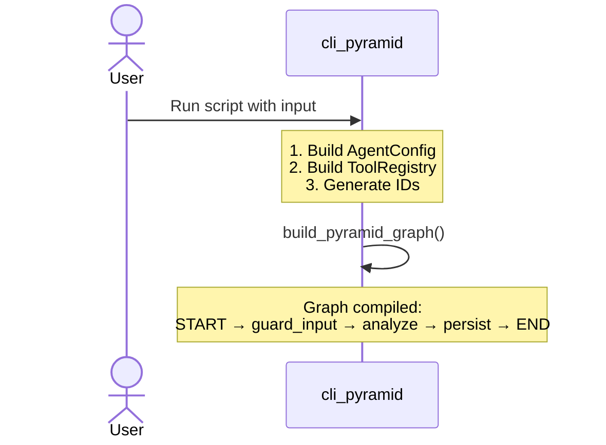
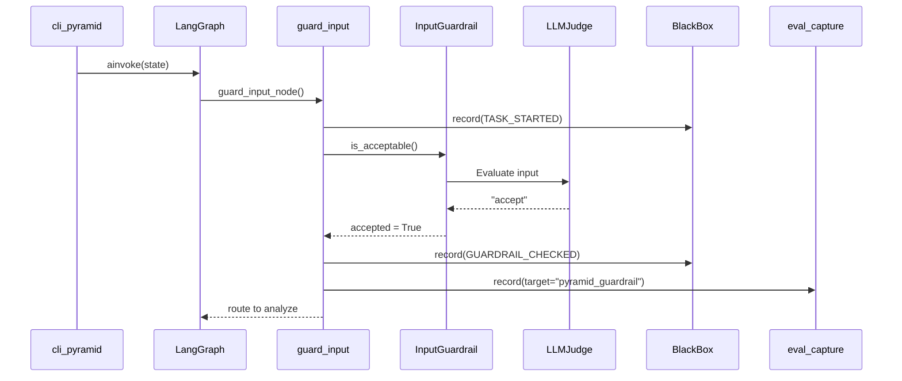
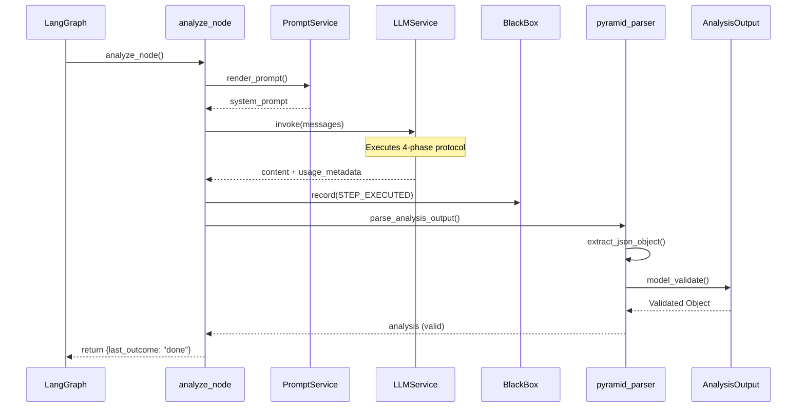
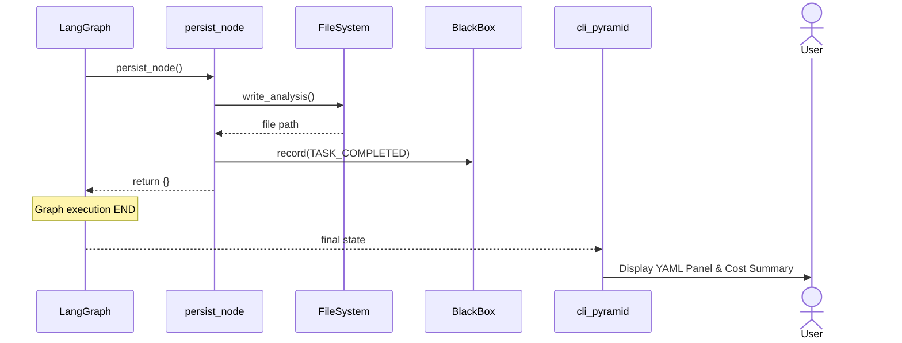
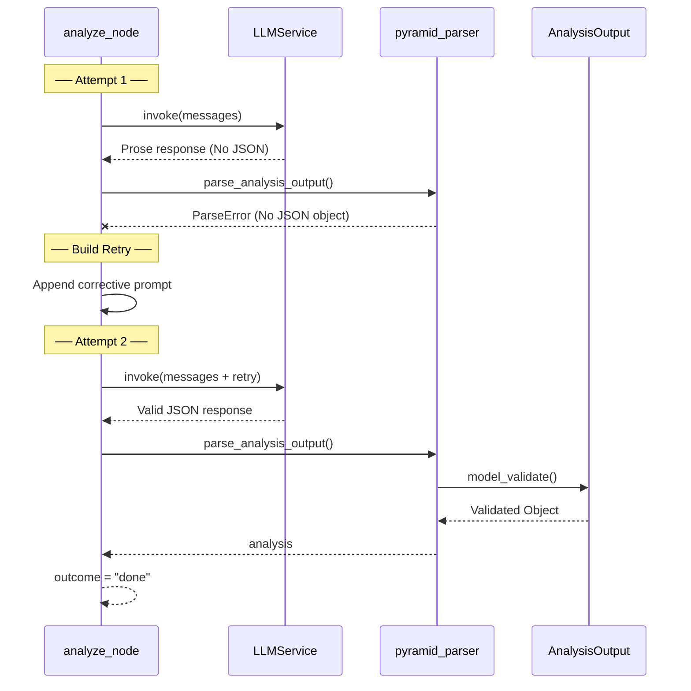
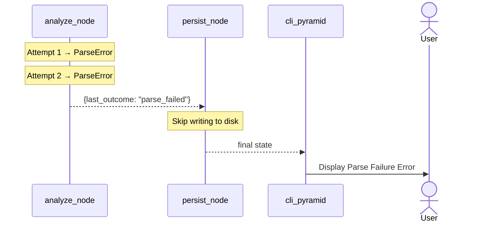
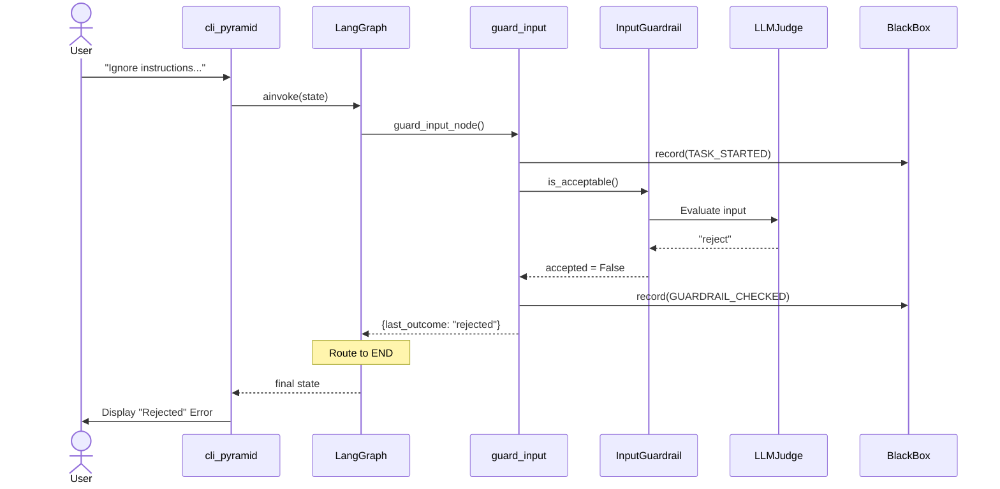
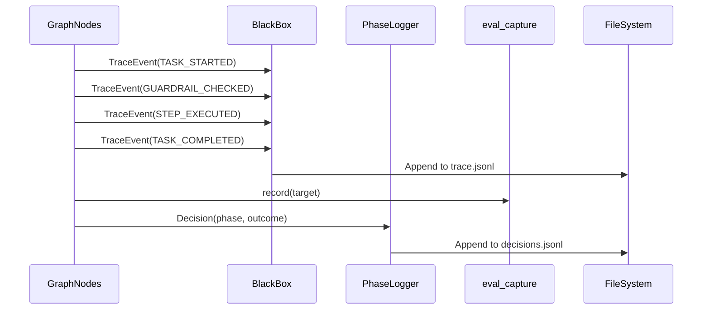
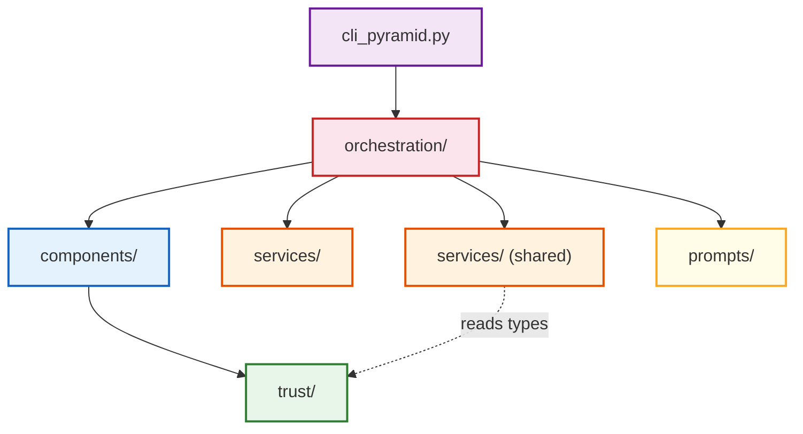

# Pyramid Agent — End-to-End Sequence Diagrams

> Readable sequence diagrams for the `StructuredReasoning/` Pyramid ReACT agent.
> Each scenario is broken into focused phases to avoid overlapping text and the "wall of arrows" problem.

---

## Table of Contents

1. [Scenario 1: Happy Path](#scenario-1-happy-path-valid-analysis-on-first-try)
2. [Scenario 2: Parse Retry](#scenario-2-parse-failure-with-successful-retry)
3. [Scenario 3: Rejected Input](#scenario-3-input-rejected-by-guardrail)
4. [Governance Trail](#cross-cutting-governance-trail)
5. [Layer Dependency Map](#architecture-layer-dependencies)

---

## Scenario 1: Happy Path (Valid Analysis on First Try)

The most common flow. The user submits a legitimate problem, the LLM produces valid
JSON on the first attempt, and the analysis is persisted to disk.

### Phase A — CLI Bootstrap

### Phase B — Input Guard

### Phase C — Analyze (LLM Call + Parse + Validate)

### Phase D — Persist + Render

---

## Scenario 2: Parse Failure with Successful Retry

The LLM returns prose instead of JSON on the first attempt. The parser
detects this, and the analyze node issues exactly one retry with a
corrective prompt. The second attempt succeeds.

### What if both attempts fail?

---

## Scenario 3: Input Rejected by Guardrail

The guardrail detects prompt injection or an illegitimate input.
The expensive analysis LLM call is never made.

---

## Cross-Cutting: Governance Trail

Every scenario produces governance artifacts. Four systems record
events in parallel throughout the graph execution.

### Artifact Summary

| Recorder | What It Captures | Output Path |
|---|---|---|
| **BlackBoxRecorder** | Lifecycle events: `TASK_STARTED`, `GUARDRAIL_CHECKED`, `STEP_EXECUTED`, `TASK_COMPLETED` | `cache/pyramid/black_box_recordings/<wf>/trace.jsonl` |
| **PhaseLogger** | Decision points with alternatives, rationale, confidence | `cache/pyramid/phase_logs/<wf>/decisions.jsonl` |
| **eval_capture** | Every LLM call (model, tokens, cost, latency) and guardrail decision | Available for offline eval pipelines |
| **pyramid_persistence** | Final validated `analysis_output` | `cache/pyramid/<wf>/analysis.json` |

---

## Architecture: Layer Dependencies

Dependencies flow strictly downward. No upward imports.

### Import Rules

| From | May Import | Must NOT Import |
|---|---|---|
| `cli_pyramid.py` | orchestration, services | — |
| `orchestration/` | components, services, trust | — |
| `components/` | trust only | services, orchestration |
| `services/` (pyramid) | stdlib, pathlib | components, orchestration, trust |
| `trust/` | stdlib, Pydantic only | everything else |
