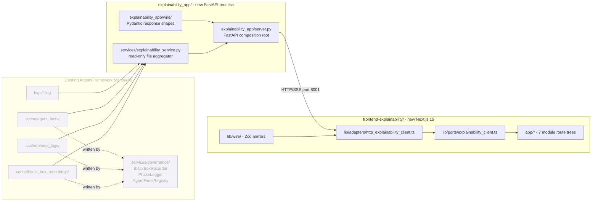

# Explainability Dashboard MVP — Sprint Board

> **Status:** Planning artifact. Companion to [EXPLAINABILITY_UI_BRAINSTORM.md](EXPLAINABILITY_UI_BRAINSTORM.md).
> **Date:** April 27, 2026
> **Scope:** Local-only, decoupled stack. New read-only Python FastAPI service plus a new Next.js 15 project. Reads existing JSONL/JSON artifacts from `BlackBoxRecorder`, `PhaseLogger`, `AgentFactsRegistry`, `GuardRailValidator`, and the per-concern log files. No live agent runtime dependency.

---

## Architecture at a Glance

## TDD and Code Review Strategy

### TDD per `research/tdd_agentic_systems_prompt.md`

- **L1 (Deterministic) — Pydantic and Zod shapes.** [explainability_app/wire/responses.py](../../explainability_app/wire/responses.py) and [frontend-explainability/lib/wire/responses.ts](../../frontend-explainability/lib/wire/responses.ts) follow Protocol A: schema validation tests for valid + invalid inputs, exact assertions, zero flake tolerance, total runtime under 10s.
- **L2 (Reproducible) — `services/explainability_service.py`.** Follows Protocol B: contract-driven TDD with `tmp_path` filesystem isolation; failure-paths-first (missing dir, corrupted JSONL, missing keys) before acceptance tests; total runtime under 30s.
- **L2 (HTTP) — `explainability_app/server.py`.** `httpx.AsyncClient(app=build_app(service=stub))` against an in-memory service stub. Same failure-paths-first rule.
- **Frontend translators / adapters.** Vitest table-driven tests, one row per discriminated-union variant (rule T4); adapter tests cover 404 / 500 / timeout / parse-error before the happy path (rule FD6.ADAPTER).
- **L3 / L4 not applicable.** No LLM calls, no orchestration, no governance loop in this stack.

### Code Review

A new `prompts/codeReviewer/explainability_frontend/` tree mirrors the existing `prompts/codeReviewer/frontend/` reviewer with a reduced scope:

- Path scope: `frontend-explainability/lib/...`, never `frontend/lib/...`.
- SDK allowlist: `recharts`, `@visx/`*, `reactflow`, `@monaco-editor/react`, `@tanstack/react-query`, `@tanstack/react-table`, `vis-network`. Drops CopilotKit, WorkOS, Mem0, Langfuse, LangGraph SDK, Drizzle, Neon.
- Dimensions kept: FD1 (Layering), FD2 (Patterns), FD3 (Security), FD4 (Accessibility), FD5 (Performance), FD6 (Tests), FD7 (Anti-Patterns).
- Dimensions removed: FD8 sprint-story map (replaced with the explainability map), FD9 (Middleware Ring — no Python middleware here), FD10 (Infra Dev-Tier — no IaC), FD11 (Operational Readiness — local-only).
- Auto-reject anti-patterns retained: `FE-AP-7` (browser `trace_id` generation), `FE-AP-12` (`dangerouslySetInnerHTML`), `FE-AP-18` (BFF credential leak — applies to API URL only), `FE-AP-19` (`'unsafe-inline'` in CSP).
- Auto-reject anti-patterns dropped: `FE-AP-4` (no `useComponent` iframes in this MVP), `FE-AP-6` (no sealed envelopes / HITL).
- The runner stub `code_reviewer/explainability_frontend/__main__.py` is **deferred**, matching the documented `code_reviewer/frontend/` MISSING_TODAY status. Reviewer is invoked manually until the runner ships.

Backend code review follows the existing backend reviewer at [prompts/codeReviewer/CodeReviewer_system_prompt.j2](../../prompts/codeReviewer/CodeReviewer_system_prompt.j2). The new horizontal service must satisfy `H1`–`H7` from [docs/STYLE_GUIDE_LAYERING.md](../STYLE_GUIDE_LAYERING.md) and the dependency rules from [docs/Architectures/FOUR_LAYER_ARCHITECTURE.md](../Architectures/FOUR_LAYER_ARCHITECTURE.md).

### Style Guide and Architecture Compliance

- [docs/STYLE_GUIDE_FRONTEND.md](../STYLE_GUIDE_FRONTEND.md) — F / W / P / A / T / X / C / B / U families apply unchanged. S-family (auth) and most O-family (telemetry) are vacuous in MVP.
- [docs/Architectures/FRONTEND_ARCHITECTURE.md](../Architectures/FRONTEND_ARCHITECTURE.md) — F-R1, F-R3, F-R4, F-R6 apply verbatim; F-R2/F-R8 apply with the smaller SDK list; F-R5/F-R7 are vacuous (no prompts; the browser only forwards backend-generated identifiers — it never generates `trace_id` or `event_id`); F-R9 is interpreted as "the dashboard backend is the only process that touches the filesystem; the browser never reads `cache/`/`logs/`".
- [docs/Architectures/FOUR_LAYER_ARCHITECTURE.md](../Architectures/FOUR_LAYER_ARCHITECTURE.md) — `services/explainability_service.py` lives in the horizontal layer; imports from `services/governance/` are cross-service horizontal calls scoped to read-only methods (consistent with the H1-H6 rules and AGENTS.md's existing tolerance for inter-service reads).
- The single-port rule of `agent_ui_adapter/` is unaffected (this MVP is a separate package).
- Replay re-execution is forbidden: "Any -> Orchestration is FORBIDDEN" — Replay Mode is a client-side scrubber over fetched events.

## Cross-Cutting Definition of Done

Every story in every sprint must satisfy these gates before it is closed:

- All new tests pass: `pytest tests/{services,explainability_app}/ -q` (backend) and `cd frontend-explainability && npm run test && npm run test:arch && npm run typecheck && npm run lint` (frontend).
- Failure-paths-first: at least one rejection / error test was authored and committed before the corresponding acceptance test (verified by `git log --reverse -p` on the test file).
- Architecture tests pass: `pytest tests/architecture/ -q` (existing) plus `tests/architecture/test_explainability_layering.py` (new — added in S0.2.1) and `frontend-explainability/tests/architecture/test_layering.test.ts` (new — added in S0.3.1).
- Wire-drift CI green: `cd frontend-explainability && npm run wire-schema-snapshot && git diff --quiet -- lib/wire/__python_schema_baseline__.json && npm run test -- lib/wire/baseline_drift.test.ts`.
- Code review verdict is `approve`: backend reviewer for any `services/`, `explainability_app/`, `tests/services/`, `tests/explainability_app/`, `pyproject.toml`, `logging.json` change; explainability frontend reviewer for any `frontend-explainability/` change. Auto-reject anti-patterns must produce zero findings.
- No new SDK dependency added without an entry in the explainability frontend reviewer's allowlist (`prompts/codeReviewer/explainability_frontend/architecture_rules.j2`).
- No prompt strings, system prompts, or model names appear in TypeScript files (rule F-R5 is vacuous but enforced by the linter to prevent regression).

---

## Sprint 0 — Foundation

**Goal:** A reviewer running on day 0; both processes booting; one dummy route end-to-end. Sets the patterns for sprints 1–4.

### Epic E0.1 — Code Review Tooling

- **S0.1.1 — Clone reviewer prompt tree.**
  - *As a* code reviewer, *I want* `prompts/codeReviewer/explainability_frontend/{system_prompt,architecture_rules,review_submission}.j2`, *so that* explainability PRs get a rule set that matches the smaller dependency profile.
  - **AC1.** Three new j2 files exist; render without errors via `Environment(loader=FileSystemLoader('prompts')).get_template(...)`.
  - **AC2.** Every file path reference is `frontend-explainability/...`; zero remaining `frontend/lib/` references (`rg "frontend/lib" prompts/codeReviewer/explainability_frontend/` returns empty).
  - **AC3.** SDK allowlist replaced with the seven UI libs listed under Code Review above. Dependency table updated accordingly.
  - **AC4.** Sections FD9, FD10, FD11 are stubbed as "N/A — local-only MVP".
  - **AC5.** Auto-reject anti-pattern list keeps `FE-AP-7`, `FE-AP-12`, `FE-AP-18`, `FE-AP-19`; drops `FE-AP-4`, `FE-AP-6`.
  - **AC6.** New "Sprint Story Acceptance Map" appendix in `architecture_rules.j2` lists every story in this sprint board with `key_files` and `acceptance_signal`.
  - **TDD.** Not test-driven (template content). One golden-file Python test loads each j2 and asserts that no Jinja `UndefinedError` is raised: `tests/prompts/test_explainability_reviewer_renders.py`.
  - **Validation.** `pytest tests/prompts/test_explainability_reviewer_renders.py -q && rg -q "frontend/lib" prompts/codeReviewer/explainability_frontend/ && exit 1 || exit 0`.
  - **Review.** Manual review of the reviewer itself by the human author (no recursion). Watch: copy-paste leftovers from the original `frontend/` reviewer.
  - **Files.** `prompts/codeReviewer/explainability_frontend/system_prompt.j2`, `prompts/codeReviewer/explainability_frontend/architecture_rules.j2`, `prompts/codeReviewer/explainability_frontend/review_submission.j2`, `tests/prompts/test_explainability_reviewer_renders.py`.

### Epic E0.2 — Backend Bootstrap

- **S0.2.1 — `services/explainability_service.list_workflows()`.**
  - *As a* developer, *I want* `service.list_workflows()` to scan `cache/black_box_recordings/`, *so that* I can enumerate every recorded workflow.
  - **AC1.** Returns `list[WorkflowSummary]` with `workflow_id, started_at, event_count, status, primary_agent_id`.
  - **AC2.** Returns `[]` when the directory does not exist.
  - **AC3.** Newest first by `started_at`.
  - **AC4.** `since: datetime | None` filter excludes older workflows.
  - **AC5.** Service has zero imports from `components/`, `orchestration/`, `agent_ui_adapter/`, `middleware/`, or any frontend project (verified by `tests/architecture/test_explainability_layering.py`).
  - **TDD (Protocol B).** Tests authored in this order:
    1. `test_list_workflows_empty_when_dir_missing(tmp_path)` — fail-first.
    2. `test_list_workflows_skips_corrupted_jsonl(tmp_path)` — fail-first; corrupted line is logged and skipped.
    3. `test_list_workflows_handles_partial_workflow(tmp_path)` — fail-first; status is `in_progress` if no `task_completed`.
    4. `test_list_workflows_orders_newest_first(tmp_path)` — acceptance.
    5. `test_list_workflows_since_filter(tmp_path)` — acceptance.
  - **Validation.** `pytest tests/services/test_explainability_service.py -q -k list_workflows && pytest tests/architecture/test_explainability_layering.py -q`.
  - **Review.** Backend reviewer; watch H1 (no vertical awareness), H4 (own log handler, attached in S0.2.2 / [logging.json](../../logging.json)), AP-2 (no horizontal-to-horizontal coupling beyond reads).
  - **Files.** [services/explainability_service.py](../../services/explainability_service.py), [tests/services/test_explainability_service.py](../../tests/services/test_explainability_service.py), [tests/architecture/test_explainability_layering.py](../../tests/architecture/test_explainability_layering.py).
- **S0.2.2 — `explainability_app` FastAPI bootstrap with `/workflows` endpoint.**
  - *As a* developer, *I want* `python -m explainability_app` to serve `GET /api/v1/workflows`, *so that* the frontend can fetch the list.
  - **AC1.** Server binds to `127.0.0.1:8001` only.
  - **AC2.** `GET /api/v1/workflows` returns 200 + JSON array of `WorkflowSummary`.
  - **AC3.** CORS allow-list is exactly `http://localhost:3001`; other origins return 403.
  - **AC4.** `/healthz` returns 200 with `{"status": "ok"}`.
  - **AC5.** Logger `explainability_app.server` writes to `logs/explainability.log` per [logging.json](../../logging.json).
  - **AC6.** `pyproject.toml` hatch wheel `packages` array includes `"explainability_app"`.
  - **TDD.** Tests authored in this order:
    1. `test_workflows_returns_500_on_service_error()` — fail-first; injects a stub raising `RuntimeError`; asserts 500 with structured body and no stack trace in body.
    2. `test_cors_blocks_other_origins()` — fail-first; `Origin: http://localhost:3000` rejected.
    3. `test_server_binds_loopback_only()` — fail-first; assert `app.state.host == "127.0.0.1"` (or equivalent).
    4. `test_healthz_returns_ok()` — acceptance.
    5. `test_workflows_returns_seeded_summaries()` — acceptance with `httpx.AsyncClient(app=build_app(service=stub))`.
  - **Validation.** `pytest tests/explainability_app/ -q && python -m explainability_app --check`.
  - **Review.** Backend reviewer; watch CORS misconfiguration, H4, structured logging.
  - **Files.** [explainability_app/**init**.py](../../explainability_app/__init__.py), [explainability_app/**main**.py](../../explainability_app/__main__.py), [explainability_app/server.py](../../explainability_app/server.py), [explainability_app/wire/**init**.py](../../explainability_app/wire/__init__.py), [explainability_app/wire/responses.py](../../explainability_app/wire/responses.py), [tests/explainability_app/**init**.py](../../tests/explainability_app/__init__.py), [tests/explainability_app/test_server.py](../../tests/explainability_app/test_server.py), [pyproject.toml](../../pyproject.toml), [logging.json](../../logging.json).
- **S0.2.3 — Dev seed script.**
  - *As a* developer, *I want* `python -m explainability_app.dev_seed --seed 42 --count 5`, *so that* the dashboard has visual density on a fresh checkout.
  - **AC1.** Generates 5–10 workflows; each with 5–20 black-box events spanning the nine `EventType` values.
  - **AC2.** Each workflow has at least one routing decision and one evaluation decision in `cache/phase_logs/`.
  - **AC3.** Hash chain is valid (uses real `BlackBoxRecorder`, not synthetic JSONL).
  - **AC4.** `--seed` produces deterministic output.
  - **AC5.** Idempotent (re-running creates new workflow IDs, never overwrites).
  - **TDD.** `test_dev_seed_produces_valid_chain(tmp_path)` — fail-first by intentionally writing one tampered event and asserting the hash-chain check fails; flip back to passing path. Plus `test_dev_seed_is_deterministic(tmp_path)`.
  - **Validation.** `pytest tests/explainability_app/test_dev_seed.py -q`.
  - **Review.** Backend reviewer; verify the seed uses real recorder classes (Test Pattern 6 — Scripted Provider).
  - **Files.** [explainability_app/dev_seed.py](../../explainability_app/dev_seed.py), [tests/explainability_app/test_dev_seed.py](../../tests/explainability_app/test_dev_seed.py).

### Epic E0.3 — Frontend Bootstrap

- **S0.3.1 — Bootstrap `frontend-explainability/` project + architecture tests.**
  - *As a* developer, *I want* `cd frontend-explainability && npm run dev`, *so that* an empty layout renders on `localhost:3001`.
  - **AC1.** Same Next.js 15 + React 19 + TS strict + Tailwind v4 + shadcn config as `frontend/`, but `package.json` declares only the seven allowed UI libs from the reviewer's allowlist.
  - **AC2.** Sidebar layout with seven module entries plus a Settings placeholder.
  - **AC3.** `npm run typecheck`, `npm run lint`, `npm run test:arch` all pass on the empty scaffold.
  - **AC4.** Architecture test `tests/architecture/test_layering.test.ts` enforces the same import table as the existing `frontend/tests/architecture/test_frontend_layering.test.ts` but path-rooted at `frontend-explainability/lib/`.
  - **AC5.** Architecture test `tests/architecture/test_no_cross_project_imports.test.ts` rejects any import path containing `../../frontend/`, `../frontend/`, or `agent_ui_adapter`.
  - **TDD.** Failure-first arch tests: each test is authored to fail against a synthetic violating fixture file before the guard logic is implemented.
  - **Validation.** `cd frontend-explainability && npm run typecheck && npm run lint && npm run test:arch`.
  - **Review.** Explainability frontend reviewer with `--scope=full`. Watch: FD1 dependency table; FD2.W1 wire purity (no React in `lib/wire/`).
  - **Files.** `frontend-explainability/package.json`, `frontend-explainability/next.config.ts`, `frontend-explainability/tsconfig.json`, `frontend-explainability/.eslintrc.`*, `frontend-explainability/app/layout.tsx`, `frontend-explainability/app/page.tsx`, `frontend-explainability/components/Sidebar.tsx`, `frontend-explainability/tests/architecture/test_layering.test.ts`, `frontend-explainability/tests/architecture/test_no_cross_project_imports.test.ts`.
- **S0.3.2 — Wire kernel, port, adapter, composition root for `/workflows`.**
  - *As a* developer, *I want* a typed `ExplainabilityClient.listWorkflows()`, *so that* UI components never call `fetch()` directly.
  - **AC1.** `lib/wire/responses.ts` declares `WorkflowSummary` Zod schema co-exported with TS type (rule W7); committed `__python_schema_baseline__.json` (rule W2).
  - **AC2.** `lib/ports/explainability_client.ts` declares exactly one interface (rule P1) with JSDoc behavioral contract (rule P3) and `@throws` typed errors (rule P4).
  - **AC3.** `lib/adapters/http_explainability_client.ts` is the only file importing `fetch` and `EventSource`. Returns only `wire/` shapes (rule A4); JSDoc has the error-translation table (rule A5) and `@sdk` pin (rule A9).
  - **AC4.** `lib/composition.ts` is the only file reading `process.env.NEXT_PUBLIC_EXPLAINABILITY_API_URL` (rule C1, C5); exports `buildAdapters()` returning the typed bag (rule C2).
  - **AC5.** Port conformance test in `tests/architecture/test_port_conformance.test.ts` asserts `HttpExplainabilityClient` satisfies `ExplainabilityClient`.
  - **AC6.** Wire-drift test `lib/wire/baseline_drift.test.ts` snapshot-compares the baseline JSON to the live Python export; CI workflow `.github/workflows/explainability-wire-baseline.yml` runs it on PRs touching the wire kernel.
  - **TDD.** `http_explainability_client.test.ts` authored in this order: 404, 500, network timeout, Zod parse error → then happy path. Five tests; the happy-path commit is last.
  - **Validation.** `npm run test && npm run test:arch && npm run wire-schema-snapshot`.
  - **Review.** Explainability frontend reviewer; watch FD1 (T1, A1, A2, A4, P1, P6), FD2.W2 (drift), FD7.AP14 (drift), FD7.AP13 (no SDK leak — UI libs are not in the SDK list).
  - **Files.** `frontend-explainability/lib/wire/responses.ts`, `frontend-explainability/lib/wire/__python_schema_baseline__.json`, `frontend-explainability/lib/wire/baseline_drift.test.ts`, `frontend-explainability/lib/ports/explainability_client.ts`, `frontend-explainability/lib/adapters/http_explainability_client.ts`, `frontend-explainability/lib/adapters/http_explainability_client.test.ts`, `frontend-explainability/lib/composition.ts`, `frontend-explainability/tests/architecture/test_port_conformance.test.ts`, `frontend-explainability/scripts/wire_schema_snapshot.ts`, `.github/workflows/explainability-wire-baseline.yml`.
- **S0.3.3 — `/traces` route renders backend data end-to-end.**
  - *As a* developer, *I want* `localhost:3001/traces` to render a workflow table from real backend data, *so that* the foundation slice is demonstrably wired.
  - **AC1.** Server Component fetches via the adapter (no `'use client'`).
  - **AC2.** Table columns: Workflow ID, Started, Status, Event Count, Primary Agent.
  - **AC3.** Empty state renders when zero workflows.
  - **AC4.** Row click navigates to `/traces/[wf_id]` (placeholder route renders "Available in Sprint 1").
  - **AC5.** No template-string ternary class merging (rule U6); `cn()` only.
  - **TDD.** Snapshot test of the rendered table over a stub adapter; failure-first test asserts the empty-state path renders before any rows are wired.
  - **Validation.** `make explainability` then visit `localhost:3001/traces`.
  - **Review.** Explainability frontend reviewer; watch FD2.B1 ('use client' justification), FD2.U6 (`cn()`).
  - **Files.** `frontend-explainability/app/traces/page.tsx`, `frontend-explainability/app/traces/[wf_id]/page.tsx`, `frontend-explainability/components/traces/WorkflowsTable.tsx`, `frontend-explainability/components/traces/WorkflowsTable.test.tsx`.

---

## Sprint 1 — Core Read Paths

**Goal:** Three modules end-to-end: Dashboard, Trace Explorer Timeline, Decision Audit. Establish the per-module pattern: backend service method → endpoint → wire shape → adapter method → translator (if needed) → route + components.

### Epic E1.1 — Trace Explorer Timeline

- **S1.1.1 — `service.get_workflow_events(wf_id)` and `GET /api/v1/workflows/{wf_id}/events`.**
  - **AC.** Wraps `BlackBoxRecorder.export(wf_id)`; returns `WorkflowEventsResponse` with `events`, `event_count`, `hash_chain_valid`. Returns 404 on unknown `wf_id`.
  - **TDD.** Fail-first: `test_get_events_404_unknown_workflow`, `test_get_events_returns_chain_invalid_when_tampered` (seed a workflow then mutate one event byte). Acceptance: `test_get_events_happy_path`.
  - **Review.** Backend reviewer; integrity check is a behavioral property — never re-implement SHA256 in the test (test pattern: `tampered fixture in -> hash_chain_valid = False out`).
- **S1.1.2 — `event_to_timeline.ts` translator + Timeline tab.**
  - **AC.** Pure translator maps `BlackBoxEvent` to `{ id, parentId, label, startMs, durationMs, color, kind }` for the Visx waterfall. Translator forwards `event_id` (rule T2 spirit, applied to the analogue identifier). Detail panel renders inputs/outputs from the event `details` dict.
  - **TDD.** Table-driven Vitest test, one row per `EventType` value (rule T4): nine variants minimum.
  - **Review.** Explainability frontend reviewer; watch FD2.T1 (no I/O in translator), FD7.AP17 (no `localStorage`/`fetch`/`document` in translator).

### Epic E1.2 — Decision Audit

- **S1.2.1 — `service.get_workflow_decisions(wf_id)` and `GET /api/v1/workflows/{wf_id}/decisions`.**
  - **AC.** Wraps `PhaseLogger.export_workflow_log(wf_id)`. Returns `DecisionRecord[]` with `phase, description, alternatives, rationale, confidence, timestamp`.
  - **TDD.** Fail-first: empty workflow returns `[]` (not 404); acceptance: ordered chronologically.
- **S1.2.2 — `/decisions/[wf_id]` route.**
  - **AC.** Phase-grouped Decision records; confidence rendered as `<progress>` with `aria-valuenow`; rationale collapsible JSON viewer (`react-json-view-lite` or built-in `<pre>`); filter chips by `WorkflowPhase`.
  - **TDD.** Snapshot test per phase grouping; fail-first test asserts that a workflow with zero decisions renders the empty state.
  - **Review.** Watch FD4.SEM (`<button>` for filter chips, never `
`); FD4.LBL (filter chips have `aria-pressed`).

### Epic E1.3 — Dashboard

- **S1.3.1 — `service.get_dashboard_metrics(since, until)` and `GET /api/v1/dashboard/metrics`.**
  - **AC.** Aggregates over all workflows in the range. Returns `total_runs, p50_latency_ms, p95_latency_ms, total_cost_usd, guardrail_pass_rate, hash_chain_valid_count, hash_chain_invalid_count, time_series_cost, time_series_latency, time_series_tokens, model_distribution`.
  - **TDD.** Fail-first: zero workflows in range returns the all-zero structure (not 404). Acceptance: golden fixture with 3 workflows produces expected aggregates.
  - **Review.** Backend reviewer; watch H1 (no vertical knowledge — aggregation is generic).
- **S1.3.2 — `/` Dashboard route.**
  - **AC.** Five KPI cards (`Total Runs`, `Avg Cost`, `P95 Latency`, `Guardrail Reject %`, `Chain Valid %`) with traffic-light coloring driven by tokenized thresholds in `frontend-explainability/app/globals.css` (rule U8). Two rows of Recharts time-series. Recent runs table reuses `WorkflowsTable` from S0.3.3 (limit 10).
  - **TDD.** Snapshot per KPI threshold (green / amber / red). Empty-state snapshot.
  - **Review.** Explainability frontend reviewer; watch FD5.IMG (no raw `` for sparkline placeholders), FD5.BARREL (no heavy chart import without `next/dynamic` if first-load JS swells — measure when bundle analyzer ships in v1.1).

---

## Sprint 2 — Validation and Identity

### Epic E2.1 — Guardrail Monitor

- **S2.1.1 — `service.get_guardrail_summary(since, until)` and `GET /api/v1/guardrails/summary`.**
  - **AC.** Reads `cache/black_box_recordings/*/trace.jsonl` for `event_type == "guardrail_checked"` events. Returns `GuardrailSummary` with `total_checks, pass_rate, fail_action_distribution, per_validator: list[ValidatorStat]`. Trends are a single number (delta vs prior period).
  - **TDD.** Fail-first: zero guardrail events in range returns all-zero with empty `per_validator`. Property test (Hypothesis): `pass_rate + fail_rate ≈ 1` for any non-empty input.
  - **Review.** Backend reviewer; watch H1 (must not depend on `services/governance/guardrail_validator.py`'s internals — read events only).
- **S2.1.2 — `/guardrails` route.**
  - **AC.** KPI row, per-validator breakdown table, failure-action distribution pie, recent-failures table linking back to `/traces/[wf_id]`.
  - **TDD.** Vitest table test for the action-distribution pie translator (rule T4).
  - **Review.** Watch FD2.U6 (`cn()`), FD4.JSX (`label-has-associated-control` on filters).

### Epic E2.2 — Agent Registry

- **S2.2.1 — `service.list_agents()`, `service.get_agent_card(id)`, `service.get_agent_audit(id)` and three endpoints.**
  - **AC.** Read-only views over `AgentFactsRegistry`. The `AgentCard` response shape is a strict subset of `AgentFacts` — no mutation API, no `signature_hash` setter, no policy-evaluation endpoint (F-R6 enforced by an architecture test that asserts the FastAPI router has zero `POST/PUT/PATCH/DELETE` routes).
  - **TDD.** Fail-first: 404 on unknown agent; an attempt to `POST /api/v1/agents/{id}` returns 405. Acceptance: the seeded `cli-agent` and `dev-agent` are listed.
  - **Review.** Backend reviewer; watch the F-R6 read-only assertion.
- **S2.2.2 — `/agents` and `/agents/[agent_id]` routes.**
  - **AC.** Catalog table; identity card with capabilities, policies, signature view (truncated hex; "verified" badge derived from a server-side `verify_signature` call exposed as a boolean field on `AgentCard`); audit trail timeline.
  - **TDD.** Snapshot per identity status (`active`, `suspended`, `revoked`). Capability search test asserting the empty-string query returns the full list.
  - **Review.** Explainability frontend reviewer; watch F-R6 (no Suspend/Revoke buttons; the UI is read-only).

---

## Sprint 3 — Cross-Pillar Compliance

### Epic E3.1 — Compliance Integrity and Bundle

- **S3.1.1 — `service.get_workflow_integrity(wf_id)` and `GET /api/v1/workflows/{wf_id}/integrity`.**
  - **AC.** Returns `IntegrityReport` with `chain_valid: bool, broken_at_event_id: str | None, expected_hash: str | None, actual_hash: str | None`. Wraps logic from `BlackBoxRecorder.export()` (which already verifies the chain) but exposes the breakage location explicitly.
  - **TDD.** Fail-first: tampered fixture (mutate one byte) returns `chain_valid=False` with non-null `broken_at_event_id`. Property test (Hypothesis): a valid chain always returns `chain_valid=True`.
- **S3.1.2 — `service.get_compliance_bundle(wf_id)` and `GET /api/v1/workflows/{wf_id}/compliance`.**
  - **AC.** Delegates to `BlackBoxRecorder.export_for_compliance(wf_id, agent_facts_registry, phase_logger)`. Adds a `correlation_health` block: `{ has_trace_id, has_user_id, has_task_id, has_agent_id, missing_keys: list[str] }` derived from event details.
  - **TDD.** Acceptance: a fully-correlated workflow has empty `missing_keys`. Fail-first: a workflow missing `user_id` (set by deleting the field in a fixture) reports `has_user_id=False, missing_keys=["user_id"]`.

### Epic E3.2 — Compliance Center UI

- **S3.2.1 — `/compliance` home.**
  - **AC.** Integrity status across all workflows in range; agent identity cards summary; guardrail summary (reuses S2.1.2 component); export buttons (`Export JSON Bundle`, `Export CSV`). PDF export is **out of scope** in MVP.
  - **TDD.** Snapshot for "all valid", "one tampered", "no workflows" states.
- **S3.2.2 — `/compliance/[wf_id]` Workflow Deep Dive (4-pillar join).**
  - **AC.** Layout matches brainstorm §5b: four quadrants for Recording, Identity, Validation, Reasoning. Correlation health badge at the top; missing keys are explicitly named, never silently omitted.
  - **TDD.** Snapshot for "complete correlation" and "missing user_id" states.
  - **Review.** Explainability frontend reviewer; watch FD2.U6 (`cn()`); FD2.B1 (RSC by default).

---

## Sprint 4 — Advanced Views

### Epic E4.1 — Cascade Analysis

- **S4.1.1 — `cascade_analysis.ts` translator + Cascade tab.**
  - **AC.** Pure translator over `BlackBoxEvent[]`: detects ERROR → SKIP propagation by walking causation chains where present, falling back to the timestamp-and-step-number heuristic where `causation_id` is absent. Output: `{ root_cause, immediate_effect, propagation, system_response, plan_vs_actual }`. Renders the brainstorm §2b layout.
  - **TDD.** Table-driven test: at least three fixtures — (a) error in step 2 cascading to skip in step 3; (b) error with no downstream effects; (c) no errors. The "no errors" case must render an empty-state, not crash.
  - **Review.** Explainability frontend reviewer; watch FD2.T1 (translator imports only `wire/`).

### Epic E4.2 — Replay Mode

- **S4.2.1 — `events_to_replay_frames.ts` translator + Replay tab.**
  - **AC.** Pure translator builds `ReplayFrame[]` from already-fetched events: each frame holds active agent, params snapshot, last input, last output, current step. The scrubber is purely client-side; **no new backend endpoint** and **no graph re-execution** (Architecture invariant: "Any → Orchestration is FORBIDDEN"). The architecture test `tests/architecture/test_replay_no_runtime_calls.test.ts` asserts that no file under `frontend-explainability/app/traces/` imports anything that reaches a runtime endpoint other than `/api/v1/workflows/{id}/events`.
  - **TDD.** Property test: the frame at index `i` must be reachable from the frame at index 0 by replaying events `[0..i]`. Fail-first: a translator that drops a step is detected.
  - **Review.** Explainability frontend reviewer; watch FD1.dep — no orchestration-style imports.

### Epic E4.3 — Log Viewer with SSE Tail

- **S4.3.1 — `service.query_logs(...)` and `GET /api/v1/logs`.**
  - **AC.** Reads `logs/*.log` lines matching the per-concern names from [logging.json](../../logging.json). Filters: `concerns: list[str]`, `level: "INFO"|"WARN"|"ERROR"|null`, `search: str|null`, `since: datetime|null`, `limit: int = 500`. Returns newest-first.
  - **TDD.** Fail-first: missing log file is silently skipped (not a 500). Acceptance: `concerns=["guards"]` returns only `guards.log` lines.
- **S4.3.2 — `service.tail_logs(...)` and `GET /api/v1/logs/stream` (SSE).**
  - **AC.** Tail-style SSE: emits new lines as they are appended; sends a heartbeat comment frame every 15s (rule X4 mirrored on the server side); reuses the `agent_ui_adapter/transport/sse.py` `encode_event` helper or a four-line copy. Cancels cleanly when the client disconnects.
  - **TDD.** Async test using `httpx` SSE consumption; fail-first test asserts that `cancel` mid-stream does not raise on the server.
  - **Review.** Backend reviewer; ensure the SSE handler does not leak file handles (use `contextlib.aclosing`).
- **S4.3.3 — `/logs` route with concern checkboxes, level filters, Monaco list, Tail toggle.**
  - **AC.** Concern checkboxes mirror the 16 logger names from [logging.json](../../logging.json). Level filters: INFO / WARN / ERROR. Search box (substring; regex deferred). Monaco-rendered list with line numbers. Tail toggle starts an SSE connection via `lib/transport/sse_client.ts` (rule X1 — `EventSource` only here). Backpressure: 100-line buffer, drop-oldest after that (rule X5).
  - **TDD.** Failure-first: SSE Zod parse error synthesizes a `RunErrorEvent`-shape error frame and surfaces a toast (rule X2 spirit, applied to the explainability log frame). Acceptance: tail toggle starts and stops cleanly.
  - **Review.** Explainability frontend reviewer; watch FD2.X1 (`EventSource` only in transport), FD4.U4 (`role="log" aria-live="polite" aria-atomic="false"` on the streaming list — never `assertive`).
- **S4.3.4 — Top-level Makefile targets.**
  - **AC.** `Makefile` gains `explainability-backend`, `explainability-frontend`, `explainability` (parallel both). Documented in `README.md`.
  - **Review.** Trivial; no new auto-rejects.

---

## Out of Scope (deferred to v1.1+)

- WorkOS authentication, persona-based RBAC, S-family rules.
- Storybook + axe + Playwright + bundle analyzer (lean TDD scope; add in a v1.1 hardening sprint).
- PDF export.
- Live multi-agent causal chain visualization (`source_agent_id` and `causation_id` are stored but not rendered in MVP).
- Real-time dashboard KPIs while a run is in progress (poll-only in v1; SSE only for log tail).
- Code reviewer runner stub (`code_reviewer/explainability_frontend/__main__.py`) — deferred until the matching `code_reviewer/frontend/` runner ships.

## Key Risks

- **Hash-chain verification cost.** `BlackBoxRecorder.export()` re-hashes the entire workflow on every read. Acceptable for ≤1k events per workflow; cache results in the service if larger.
- **Log tail file rotation.** Reading `logs/*.log` with file watchers can miss rotations. Use poll + tail-from-position in v1; document the limitation in `explainability_app/transport/sse.py` docstring.
- **Cross-correlation gap.** [docs/explainability/END_TO_END_TRACING_GUIDE.md](END_TO_END_TRACING_GUIDE.md) notes incomplete `trace_id`/`workflow_id`/`task_id`/`user_id` joining. The Compliance bundle and Workflow Deep Dive surface "correlation health" badges instead of fabricating correlation (S3.1.2, S3.2.2).
- **Reviewer drift.** Two parallel reviewers (`prompts/codeReviewer/frontend/` and `.../explainability_frontend/`) risk drift on shared rule families. Mitigation: a periodic diff job (manual until automated) compares the architecture_rules.j2 files for the F/W/P/A/T/X/C/B/U sections that should remain in sync.

