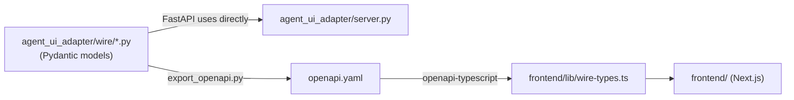

# AGENT_UI_ADAPTER_PLAN.md — Implementation Spec for the Outermost Ring

> **Status**: implementation-facing specification. Companion to [FRONTEND_PLAN_V3_DEV_TIER.md](../frontend/FRONTEND_PLAN_V3_DEV_TIER.md).
>
> **Authored from**: [AGENT_UI_ADAPTER_PLAN_V1.1.md](AGENT_UI_ADAPTER_PLAN_V1.1.md) (the planning meta-artifact). This document is the deliverable; v1.1 is the design rationale.
>
> **Governs**: the `agent_ui_adapter/` Python package (Cloud Run service `agent-ui-adapter`) that exposes the four-layer backend to AG-UI-compliant frontend clients via a single `AgentRuntime` port.
>
> Structured per [prompts/StructuredReasoning/_pyramid_brain.j2](../../../prompts/StructuredReasoning/_pyramid_brain.j2) to match the planning corpus convention.

---

## 1. Governing Thought

Three concentric contracts make either side of the stack swappable as a config change: **AG-UI is the wire ring**, **one new Python `Protocol` (`AgentRuntime`) is the application ring**, **existing horizontal services in `services/` provide every other cross-cutting concern**, and **`trust/` is the domain ring** — preserving the four-layer invariants in [AGENTS.md](../../../AGENTS.md), avoiding parallel abstraction layers, and enabling a CopilotKit frontend to be replaced by assistant-ui, Mastra Studio, a CLI client, or a React Native client without touching backend code.

Confidence: **0.78** (good evidence on architecture and protocol; three Phase 1 pre-work services are unbuilt today, which is a known sequencing risk; AG-UI 0.x version pinning is an open question).

---

## 2. Scope

### 2.1 In scope (v1, lands inside FRONTEND_PLAN_V3_DEV_TIER.md Phase 1–3)

| ID | Capability | Implementation |
|----|------------|----------------|
| A1 | Single `AgentRuntime` port exposing one method `run()` returning an async iterator of domain events | `agent_ui_adapter/ports/agent_runtime.py` (Python `typing.Protocol`, runtime-checkable) |
| A2 | LangGraph runtime adapter wrapping `orchestration.react_loop:build_graph` | `agent_ui_adapter/adapters/runtime/langgraph_runtime.py` |
| A3 | Mock runtime adapter for unit tests | `agent_ui_adapter/adapters/runtime/mock_runtime.py` |
| A4 | AG-UI wire contract (Pydantic models mirroring `ag_ui.core` types) | `agent_ui_adapter/wire/ag_ui_events.py` |
| A5 | Agent Protocol routes (Pydantic models for thread/run CRUD) | `agent_ui_adapter/wire/agent_protocol.py` |
| A6 | OpenAPI export for codegen | `agent_ui_adapter/wire/export_openapi.py` |
| A7 | Anti-corruption translators (domain → AG-UI; AG-UI → domain) | `agent_ui_adapter/translators/` |
| A8 | SSE transport with 15s heartbeats, `Last-Event-ID` resumption, `X-Accel-Buffering: no` | `agent_ui_adapter/transport/sse.py`, `agent_ui_adapter/transport/heartbeat.py` |
| A9 | FastAPI composition root consuming existing horizontal services | `agent_ui_adapter/server.py` |
| A10 | Pre-flight WorkOS JWT verification before SSE stream opens | FastAPI dependency in `agent_ui_adapter/server.py` |
| A11 | Architecture test enforcing import boundaries | `tests/architecture/test_agent_ui_adapter_layer.py` |
| A12 | Per-stream observability log handlers | extension to existing logging config |

### 2.2 Deferred to v1.5

- Route `cli.py` through `AgentRuntime` (CLI keeps direct `orchestration.react_loop` call for v1)
- WebSocket transport (SSE only in v1)
- AsyncAPI 3 export (defer until a non-CopilotKit client lands)
- React Native client wiring

### 2.3 Deferred to v2

- Protobuf / gRPC-web wire format
- Multi-agent blackboard pattern wiring
- Ed25519 asymmetric signing for cross-system identity exchange (sealed-envelope still uses HMAC in v1)

### 2.4 Out of scope forever

- Building memory, trace, or authorization logic INSIDE `agent_ui_adapter/`. These belong in horizontal services per [AGENTS.md](../../../AGENTS.md) anti-pattern AP-2 and the "Outer Adapter Ring" subsection added to [docs/FOUR_LAYER_ARCHITECTURE.md](../../FOUR_LAYER_ARCHITECTURE.md).
- Frontend doing client-side signature verification.
- Translators making I/O calls, LLM calls, or business decisions.

---

## 3. Architecture: Three Concentric Contracts

```mermaid
flowchart LR
  subgraph wire [Wire Contract: AG-UI events over SSE]
    AGUI["AG-UI events<br/>RUN_STARTED, TEXT_MESSAGE_*<br/>TOOL_CALL_*, STATE_DELTA"]
    AP["Agent Protocol routes<br/>threads, runs CRUD"]
  end
  subgraph app [Application Contract: ONE Python Protocol]
    Runtime["AgentRuntime"]
  end
  subgraph services [Existing Horizontal Services]
    Memory["services/long_term_memory<br/>(to be built)"]
    Identity["services/governance/<br/>agent_facts_registry"]
    Trace["services/trace_service<br/>(to be built)"]
    Authz["services/authorization_service<br/>(to be built)"]
    Tools["services/tools"]
  end
  subgraph domain [Domain Contract: trust/]
    Facts["AgentFacts schema_version=2"]
    Trace2["TrustTraceRecord schema_version=2"]
    Policy["PolicyDecision"]
  end
  wire --> app
  app --> services
  services --> domain
  app --> domain
```



### 3.1 Swap radius per ring

| Ring | Swap radius | Stability | Files that change on swap |
|------|-------------|-----------|---------------------------|
| Wire | Replace entire frontend stack (CopilotKit → assistant-ui → CLI → React Native) | Very stable; standardized | `frontend/` only |
| Application port | Swap a single backend technology (LangGraph → CrewAI; mock for tests) | Stable; one repo's responsibility | `agent_ui_adapter/adapters/runtime/<new>.py` + one DI line in `server.py` |
| Horizontal services | Swap memory backend (Mem0 cloud → self-hosted), auth (WorkOS → Cognito), trace (Langfuse → Phoenix) | Stable | A single `services/<service>.py` file; adapter unchanged |
| Domain (trust kernel) | Almost never; triggers re-signing per [docs/FOUR_LAYER_ARCHITECTURE.md](../../FOUR_LAYER_ARCHITECTURE.md) H3a | Most stable | `trust/` (governance process; recertification per [docs/FOUR_LAYER_ARCHITECTURE.md](../../FOUR_LAYER_ARCHITECTURE.md) lines 231-240) |

This nesting matches [utils/cloud_providers/](../../../utils/cloud_providers/) precedent (hexagonal adapters at the cloud-provider boundary) but applied at the HTTP boundary.

---

## 4. Wire Contract

The wire contract is **two protocols carried over one transport (SSE)**:

| Protocol | Purpose | Routes |
|----------|---------|--------|
| **AG-UI Protocol** | Streaming agent-to-user interaction events | `POST /agent/runs/stream` (multiplexed AG-UI events) |
| **Agent Protocol** | Thread/run CRUD | `GET /agent/threads`, `POST /agent/threads`, `GET /agent/runs/{run_id}`, `DELETE /agent/runs/{run_id}`, `GET /healthz` |

All routes are bearer-authenticated with WorkOS access tokens (HTTP `Authorization: Bearer <jwt>` header). Token verification happens BEFORE the SSE stream opens; never inside event payloads.

### 4.1 AG-UI event taxonomy (17 native events)

Mirror `ag_ui.core` Pydantic types in `agent_ui_adapter/wire/ag_ui_events.py` with `extra='forbid'` to fail closed on schema drift.

| Category | Event types | Frontend hook |
|----------|-------------|---------------|
| Lifecycle | `RUN_STARTED`, `RUN_FINISHED`, `RUN_ERROR`, `STEP_STARTED`, `STEP_FINISHED` | CopilotKit auto |
| Text Message | `TEXT_MESSAGE_START`, `TEXT_MESSAGE_CONTENT`, `TEXT_MESSAGE_END` | `messages.partial` / `complete` |
| Tool Call | `TOOL_CALL_START`, `TOOL_CALL_ARGS`, `TOOL_CALL_END`, `TOOL_RESULT` | `useFrontendTool`, `useHumanInTheLoop` |
| State | `STATE_SNAPSHOT`, `STATE_DELTA` (JSON Patch), `MESSAGES_SNAPSHOT` | `useCoAgentStateRender`, `useComponent` |
| Special | `RAW`, `CUSTOM` | passthrough; application-defined |

### 4.2 Production-robustness checklist

Non-negotiable per `docs.ag-ui.com`, dev.to multi-agent SSE article, and [FRONTEND_PLAN_V2_FRONTIER.md](../frontend/FRONTEND_PLAN_V2_FRONTIER.md) §4.1:

| Item | Mechanism | Where |
|------|-----------|-------|
| 15-second heartbeats | Server emits `: ping\n\n` every 15s | `agent_ui_adapter/transport/heartbeat.py` |
| `Last-Event-ID` resumption | Server stores last `event_id` per `thread_id`; client sends `Last-Event-ID` header on reconnect | `agent_ui_adapter/transport/sse.py` |
| Sentinel termination | `event: done\ndata: [DONE]\n\n` after `RUN_FINISHED` | `agent_ui_adapter/wire/ag_ui_events.py` |
| Backpressure | FastAPI `StreamingResponse` + bounded `asyncio.Queue` per stream | `agent_ui_adapter/transport/sse.py` |
| Cloudflare/proxy buffering off | `X-Accel-Buffering: no` header | `agent_ui_adapter/transport/sse.py` |
| JWT verification on every connect | WorkOS verifier called in FastAPI dependency | `agent_ui_adapter/server.py` |
| Schema validation at the seam | Pydantic `extra='forbid'` on every wire model | `agent_ui_adapter/wire/*.py` |

### 4.3 AG-UI mechanism mapping for partially-covered concerns

AG-UI's 17 native events fully cover four of the seven backend↔frontend concerns (token streaming, tool call lifecycle, generative UI components, live agent state). The remaining three need explicit adapter conventions:

| Concern | AG-UI native? | Adapter convention |
|---------|---------------|--------------------|
| **HITL / authorization prompt** | No dedicated event | Agent emits `TOOL_CALL_START` for a virtual `request_approval` tool with `args = {action: str, justification: str}`. Frontend renders the approval UI. User response returns as `TOOL_RESULT` with `result = {approved: bool, reason: str}`. Translator never auto-approves. Pattern follows Microsoft AG-UI HITL reference and ag-ui-protocol GitHub discussion #158. |
| **Auth-token transport** | Not in AG-UI | WorkOS access token rides in HTTP `Authorization: Bearer <jwt>` header on the SSE connection request. `agent_ui_adapter/server.py` FastAPI dependency verifies via [services/governance/agent_facts_registry.py](../../../services/governance/agent_facts_registry.py) (and future `services/authorization_service.py`) BEFORE the SSE stream opens. Token is **never** in AG-UI event payloads. |
| **`TrustTraceRecord.trace_id`** | Partial — AG-UI provides `runId` + `threadId` only | **Decision: Option B** — `trace_id` rides in `BaseEvent.rawEvent.trace_id` on every event. Preserves trust framework semantics ([docs/FOUR_LAYER_ARCHITECTURE.md](../../FOUR_LAYER_ARCHITECTURE.md) line 204) without conflating with AG-UI's `runId` (which restarts per-run). Translator sets this on every emitted event; consumers may correlate. |

### 4.4 Sealed-envelope rule for signed trust types

Trust types crossing the wire (`AgentFacts`, `TrustTraceRecord`, `PolicyDecision`) carry their `schema_version` field verbatim. The wire contract treats signed payloads as **opaque sealed envelopes** — frontend may display fields but MUST round-trip the JSON byte-equivalent when echoing facts back. Architecture test asserts `verify_signature(decode(encode(facts))) == True` for every signed type that crosses the wire.

Signature verification happens **server-side only**. [services/governance/agent_facts_registry.py](../../../services/governance/agent_facts_registry.py) uses HMAC with `AGENT_FACTS_SECRET`, which the frontend cannot and must not hold. Frontend treats `signature_hash` as an opaque field; do not attempt client-side verification. The adapter is the integrity boundary.

---

## 5. Application Contract: One Port

The adapter introduces exactly **one** new abstraction. All other concerns are consumed from existing horizontal services.

### 5.1 The single port

```python
# agent_ui_adapter/ports/agent_runtime.py
from typing import Protocol, runtime_checkable, AsyncIterator
from trust.models import AgentFacts
from agent_ui_adapter.wire.agent_protocol import ThreadInput, ThreadState
from agent_ui_adapter.wire.domain_events import DomainEvent

@runtime_checkable
class AgentRuntime(Protocol):
    async def run(
        self,
        thread_id: str,
        input: ThreadInput,
        identity: AgentFacts,
    ) -> AsyncIterator[DomainEvent]: ...

    async def cancel(self, run_id: str) -> None: ...

    async def get_state(self, thread_id: str) -> ThreadState: ...
```

### 5.2 What is NOT a port (consumed from `services/` instead)

Build status verified by globbing the actual repo as of v1.1 plan authoring:

| Concern | NOT an adapter port | Consumed from (status today) |
|---------|---------------------|------------------------------|
| Long-term memory | `MemoryStore` | `services/long_term_memory.py` (**to be built per H6 in [docs/STYLE_GUIDE_PATTERNS.md](../../STYLE_GUIDE_PATTERNS.md) lines 465-537; does not exist today**) |
| Identity / JWT verify | `IdentityVerifier` | [services/governance/agent_facts_registry.py](../../../services/governance/agent_facts_registry.py) (**exists**; HMAC-style `compute_signature` with `AGENT_FACTS_SECRET`) |
| Trace emission | `TraceSink` | `services/trace_service.py` (**to be built per [docs/FOUR_LAYER_ARCHITECTURE.md](../../FOUR_LAYER_ARCHITECTURE.md) lines 471-478; does not exist today**) |
| Tool registry | `ToolRegistry` | [services/tools/registry.py](../../../services/tools/registry.py) (**exists**) |
| Authorization | `AuthorizationGate` | `services/authorization_service.py` (**to be built per [docs/FOUR_LAYER_ARCHITECTURE.md](../../FOUR_LAYER_ARCHITECTURE.md) line 414; does not exist today**) |

> Three of the five concerns lack a horizontal service today. The adapter MUST NOT bypass this gap by absorbing memory/trace/authorization into `agent_ui_adapter/` — that would prevent CLI, batch, and worker entry points from ever consuming them. They must be built as horizontal services first; see Phase 1 pre-work in §11.

### 5.3 Dual-PEP design (cross-reference to FOUR_LAYER_ARCHITECTURE)

Per [docs/FOUR_LAYER_ARCHITECTURE.md](../../FOUR_LAYER_ARCHITECTURE.md) `Runtime Trust Gate` section (lines 599-664), `verify_authorize_log_node` in the orchestration layer is the **in-graph PEP** for per-action policy decisions. The adapter performs a **pre-flight cheap PEP** before opening the SSE stream:

| PEP | Where | What it checks | Latency |
|-----|-------|----------------|---------|
| Adapter pre-flight PEP | `agent_ui_adapter/server.py` FastAPI dependency | JWT signature valid? Token not expired? Identity not revoked? | < 5ms (in-memory cache) |
| Orchestration in-graph PEP | `verify_authorize_log_node` per [docs/FOUR_LAYER_ARCHITECTURE.md](../../FOUR_LAYER_ARCHITECTURE.md) lines 614-639 | Per-action policy: signature recompute, status check, capability evaluation | < 1ms (per-action) |

Two PEPs is fine — they decide on different inputs. The adapter never substitutes for the in-graph PEP; it just rejects obviously invalid sessions before they consume backend resources.

---

## 6. Domain Contract

The domain contract is `trust/` as it exists today, plus three new horizontal services consumed by the adapter (see §11 pre-work). The adapter MUST NOT add types to `trust/`.

Trust types crossing the wire in v1:

| Type | Source | Wire serialization |
|------|--------|--------------------|
| `AgentFacts` | [trust/models.py](../../../trust/models.py) | Pydantic `model_dump_json()`; sealed envelope per §4.4 |
| `TrustTraceRecord` | [trust/models.py](../../../trust/models.py) (per [docs/FOUR_LAYER_ARCHITECTURE.md](../../FOUR_LAYER_ARCHITECTURE.md) lines 196-209) | Carried in `BaseEvent.rawEvent.trace_id` per §4.3 |
| `PolicyDecision` | [trust/models.py](../../../trust/models.py) (per [docs/FOUR_LAYER_ARCHITECTURE.md](../../FOUR_LAYER_ARCHITECTURE.md) lines 906-916) | Embedded in `TOOL_RESULT` for HITL flow |

`schema_version` is preserved verbatim on every type that has one.

---

## 7. Repository Layout

```
agent_ui_adapter/
├── __init__.py
├── ports/
│   ├── __init__.py
│   └── agent_runtime.py            # the ONLY new port (Python Protocol)
├── adapters/
│   └── runtime/
│       ├── __init__.py
│       ├── langgraph_runtime.py    # wraps orchestration.react_loop:build_graph
│       └── mock_runtime.py         # for tests
├── wire/                            # Pydantic source of truth → openapi.yaml
│   ├── __init__.py
│   ├── ag_ui_events.py              # 17 events mirrored from ag_ui.core
│   ├── agent_protocol.py            # thread/run CRUD models
│   ├── domain_events.py             # internal canonical events
│   └── export_openapi.py            # CI entry point
├── translators/
│   ├── __init__.py
│   ├── domain_to_ag_ui.py           # ACL: pure data shape mapping
│   └── ag_ui_to_domain.py
├── transport/
│   ├── __init__.py
│   ├── sse.py                       # text/event-stream
│   └── heartbeat.py                 # 15s keep-alive
└── server.py                        # FastAPI composition root

tests/
├── agent_ui_adapter/
│   ├── ports/
│   ├── adapters/
│   ├── wire/
│   ├── translators/
│   ├── transport/
│   └── test_server.py
└── architecture/
    └── test_agent_ui_adapter_layer.py
```

**Notably absent**: `adapters/memory/`, `adapters/identity/`, `adapters/trace/`, `adapters/authorization/`. Those concerns live in `services/`.

---

## 8. Architecture Rules

Extension to [AGENTS.md](../../../AGENTS.md) `Architecture Invariants` (invariant 9):

| Rule | Detail |
|------|--------|
| R1 | `agent_ui_adapter/` MAY import from `trust/`, `services/`, and `orchestration.react_loop:build_graph` only |
| R2 | `agent_ui_adapter/` MAY NOT import from `meta/`, `components/` directly |
| R3 | Nothing in `trust/`, `services/`, `components/`, `orchestration/`, `meta/` may import from `agent_ui_adapter/` |
| R4 | `agent_ui_adapter/wire/*` must be pure Pydantic; no I/O imports |
| R5 | `agent_ui_adapter/translators/` performs **pure data-shape mapping only** (one domain event in → one or more wire events out, or vice versa) |
| R6 | `agent_ui_adapter/translators/` MUST NOT make I/O calls, LLM calls, policy decisions, or authorization checks |
| R7 | `agent_ui_adapter/translators/` imports from `trust/` and `agent_ui_adapter/wire/` only — NOT from `services/` |
| R8 | All business logic remains in horizontal services. The orchestrator (FastAPI handler in `agent_ui_adapter/server.py`) composes services and calls translators only at the boundary |
| R9 | The `AgentRuntime` port is the only new abstraction the adapter introduces; all other cross-cutting concerns are consumed from existing horizontal services |

These rules are enforced by `tests/architecture/test_agent_ui_adapter_layer.py` (failure-paths-first per AGENTS.md testing rules).

---

## 9. Wire Contract Codegen Pipeline

Pydantic-first per locked decision. Single source of truth → both backend and frontend types.



CI step:

```bash
python -m agent_ui_adapter.wire.export_openapi > openapi.yaml
openapi-typescript openapi.yaml -o frontend/lib/wire-types.ts
```

New dependencies:
- Backend: none beyond stdlib (Pydantic and FastAPI already present)
- Frontend: `openapi-typescript` (npm devDependency)

AsyncAPI export deferred until a non-CopilotKit client lands.

---

## 10. Adapter Swap Matrix

The win statement made concrete:

| Swap scenario | Files that change | Files that don't |
|---------------|-------------------|------------------|
| Replace CopilotKit with assistant-ui | `frontend/` only | `agent_ui_adapter/`, all backend |
| Add a Python CLI streaming client | New `cli/streaming_client.py` (consumes AG-UI) | All of `agent_ui_adapter/`, all backend |
| Replace LangGraph with CrewAI | `agent_ui_adapter/adapters/runtime/crewai_runtime.py` (new) + `agent_ui_adapter/server.py` (one DI line) | `agent_ui_adapter/wire/`, `agent_ui_adapter/translators/`, `frontend/`, `trust/`, all `services/` |
| Replace Mem0 Cloud with self-hosted Mem0 (V3 §6.6 Stage A→D) | One env var + body of `services/long_term_memory.py` | Everything else, including `agent_ui_adapter/` |
| Replace WorkOS with Cognito | Body of `services/governance/agent_facts_registry.py` (or future `services/authorization_service.py`) + `frontend/` auth route | `agent_ui_adapter/wire/`, `agent_ui_adapter/translators/`, all backend domain code |
| Add React Native client | New RN app consuming AG-UI events | All of `agent_ui_adapter/`, all backend |
| Move from SSE to WebSocket | `agent_ui_adapter/transport/websocket.py` (alternate transport) | `agent_ui_adapter/wire/`, `agent_ui_adapter/translators/`, frontend just changes hook |

Notice: rows for Mem0 / WorkOS / Langfuse swaps point to `services/*` files, NOT to `agent_ui_adapter/adapters/*`. This is the single-port consequence.

**Empirical validation (M-Phase2):**
- Swap 1: `services/long_term_memory.py` → `services/memory_backends/sqlite.py` (SQLite backend). Commit `00e6651`. Zero `agent_ui_adapter/` files changed.
- Swap 2: `services/trace_service.py` → `services/trace_sinks/jsonl_sink.py` (JSONL file sink). Zero `agent_ui_adapter/` files changed.

---

## 11. Phased Delivery

Aligned with [FRONTEND_PLAN_V3_DEV_TIER.md](../frontend/FRONTEND_PLAN_V3_DEV_TIER.md) §8.

### Phase 0 — Specification (this document, 0.5 day)

- This file on `main`
- [AGENT_UI_ADAPTER_PLAN_V1.1.md](AGENT_UI_ADAPTER_PLAN_V1.1.md) on `main` as audit trail

### Phase 1 — V3 Phase 1 alignment (3-5 days)

**Pre-work (blocks adapter Phase 1):**

- Build `services/long_term_memory.py` per H6 ([docs/STYLE_GUIDE_PATTERNS.md](../../STYLE_GUIDE_PATTERNS.md) lines 465-537). Tests in `tests/services/test_long_term_memory.py`.
- Build `services/trace_service.py` per [docs/FOUR_LAYER_ARCHITECTURE.md](../../FOUR_LAYER_ARCHITECTURE.md) `Horizontal Services: Identity Service` pattern (lines 244-307), scoped to `TrustTraceRecord` emission and routing. Tests in `tests/services/test_trace_service.py`.
- Build `services/authorization_service.py` per [docs/FOUR_LAYER_ARCHITECTURE.md](../../FOUR_LAYER_ARCHITECTURE.md) `Runtime Trust Gate` (lines 599-664). Receives `AgentFacts` as a parameter (Critical Design Rule, lines 641-661). Tests in `tests/services/test_authorization_service.py`.

Each pre-work item gets its own implementation plan. None are scoped here.

**Adapter work (after pre-work lands):**

- `AgentRuntime` port in `agent_ui_adapter/ports/agent_runtime.py`
- `LangGraphRuntime` adapter wrapping `orchestration.react_loop:build_graph`
- `MockRuntime` adapter for tests
- AG-UI translator (`domain_to_ag_ui.py`, `ag_ui_to_domain.py`) in `agent_ui_adapter/translators/`
- SSE transport with heartbeats and `Last-Event-ID` resumption in `agent_ui_adapter/transport/`
- FastAPI server in `agent_ui_adapter/server.py` consuming the existing horizontal services
- Architecture test in `tests/architecture/test_agent_ui_adapter_layer.py`
- Smoke test: a curl with a real WorkOS access token streams a multi-event SSE response end-to-end through to a fake LLM

### Phase 2 — V3 Phase 2 alignment (1 day)

No new adapters. Horizontal-service swaps (Mem0 cloud → self-hosted at V3 Stage D) happen entirely inside `services/`. Adapter is unchanged.

### Phase 3 — V3 Phase 3 alignment (0.5 day)

- Codegen pipeline in CI: `python -m agent_ui_adapter.wire.export_openapi` → `openapi-typescript` → `frontend/lib/wire-types.ts`
- CI step blocks merge if generated TS drifts from current Pydantic models

### Phase 4 — Deferred to v1.5

- Route `cli.py` through `AgentRuntime`
- AsyncAPI export
- WebSocket transport

---

## 12. Open Questions

Carried from brainstorm; resolved here when possible, deferred when not.

| # | Question | v1.1 stance | Defer to |
|---|----------|-------------|----------|
| Q1 | AG-UI version pin: pin to a specific spec version or track upstream? | **Pin** to a specific version (the one current at v1 implementation start). AG-UI is 0.x; tracking upstream risks breaking changes. | Decided in v1.1 |
| Q2 | Where do `AgentFacts` cross the wire — embed in `RUN_STARTED` or fetch via `/api/agents/{id}`? | Embed in `RUN_STARTED.rawEvent.agent_facts` as sealed envelope. One round trip; matches sealed-envelope rule. | Decided in v1.1 |
| Q3 | AsyncAPI for the SSE channel — generate or skip? | **Skip in v1**; defer until a non-CopilotKit client lands (per locked decision). | Deferred to v1.5 |
| Q4 | Where does the BFF live in deployment? | Cloud Run service `agent-ui-adapter` per V3 §3 (one container, FastAPI + embedded LangGraph). | Decided per V3 |
| Q5 | Treat `cli.py` as another adapter consumer? | **No in v1** (CLI keeps direct call); revisit at v1.5. | Deferred to v1.5 |
| Q6 | Trust gate placement: adapter pre-flight only, or also in-graph? | **Both** (dual PEP per §5.3). Adapter pre-flight rejects obviously bad sessions; in-graph PEP makes per-action policy decisions. | Decided in v1.1 |
| Q7 | Multi-agent / Blackboard readiness — expose `source_agent_id` + `causation_id` to frontend? | **Yes** — preserved in `BaseEvent.rawEvent` per sealed-envelope rule; costs nothing in v1, enables future multi-agent UI without re-versioning the wire. | Decided in v1.1 |

---

## 13. Risk Register

| ID | Risk | Likelihood | Impact | Mitigation |
|----|------|------------|--------|------------|
| R1 | AG-UI 0.x spec breaks before v1 ships | Medium | Medium | Pin version (Q1); track changes via dedicated upgrade branch; treat as a separate v1.5 work item |
| R2 | Pydantic-to-OpenAPI codegen lossy on union/discriminated types | Medium | Low | Use Pydantic V2 `discriminator=` explicitly; CI test compares regenerated schema to checked-in golden file |
| R3 | Signed-payload byte-equivalence breaks under JSON re-encoding (frontend reorders keys) | Low | High | Architecture test (§4.4); document sealed-envelope rule in `frontend/lib/wire-types.ts` README; HMAC verification server-side rejects fast |
| R4 | Pre-work for Phase 1 (three new horizontal services) was not in the V3 timeline | High | Medium | Gate adapter Phase 1 acceptance criteria on the three horizontal services existing and having tests in `tests/services/`. Add to V3 §8 Phase 1 explicitly. |

### Phase 1 Risk Sign-off (US-9.4)

All four risks are now mitigated with implementation evidence:

| ID | Risk | Status | Evidence |
|----|------|--------|----------|
| R1 | AG-UI 0.x spec breaks | **Closed** | `AGUI_PINNED_VERSION = "0.1.18"` in `agent_ui_adapter/wire/ag_ui_events.py`; enforced by `tests/agent_ui_adapter/wire/test_agui_version_pin.py`. |
| R2 | Codegen drift | **Closed** | CI drift detection in `.github/workflows/wire-codegen.yml`; enforced by `tests/agent_ui_adapter/wire/test_openapi_drift.py` and `tests/agent_ui_adapter/wire/test_wire_types_drift.py`. |
| R3 | Sealed-payload byte-equivalence | **Closed** | `agent_ui_adapter/translators/sealed_envelope.py` with Hypothesis key-shuffle round-trip tests in `tests/agent_ui_adapter/translators/test_sealed_envelope.py`; architecture test T6 in `tests/architecture/test_agent_ui_adapter_layer.py`. |
| R4 | Horizontal-service coupling | **Closed** | M-Phase2 SQLite swap (commit `00e6651`) proved `agent_ui_adapter/` untouched; second swap (JSONL trace sink) provides additional evidence. Architecture tests T1-T5 enforce import boundaries at CI time. |

**JWT verifier deferral**: Production deployment requires a real `JwtVerifier` implementation (WorkOS / RS256 / OAuth) behind the `JwtVerifier` Protocol in `agent_ui_adapter/server.py`. Phase 1 sign-off uses `InMemoryJwtVerifier` with a static token map. Deferred to v1.5.

---

## 14. Changelog vs FRONTEND_PLAN_V3_DEV_TIER.md

| Section | Change |
|---------|--------|
| V3 §1 governing thought | "thin FastAPI middleware" → "thin FastAPI agent-UI adapter" |
| V3 §3 mermaid `CRMid` node | service name "agent-middleware" → "agent-ui-adapter" (hyphenated) |
| V3 §3.1 repo layout | `middleware/` → `agent_ui_adapter/` (underscored Python package); forward-link to this document |
| V3 §4 API contract | adds note "Wire contract owned by AGENT_UI_ADAPTER_PLAN.md; this section captures the deployed surface only" |
| V3 §6.1 dev-tier table | service `agent-middleware` → `agent-ui-adapter` |
| V3 §8 Phase 1 | title "Middleware + self-hosted LangGraph" → "Agent-UI adapter + self-hosted LangGraph"; body paths `middleware/` → `agent_ui_adapter/`; **new pre-work bullet** for three horizontal services |
| V3 §16 cross-branch interactions | each `middleware/...` Python path → `agent_ui_adapter/...` |

---

## 15. Validation Suite

### 15.1 Pyramid 8-check (per [research/pyramid_react_system_prompt.md](../../../research/pyramid_react_system_prompt.md))

| # | Check | Result | Detail |
|---|-------|--------|--------|
| 1 | Completeness | Pass | Wire + application port + horizontal services + domain covers the seam surface |
| 2 | Non-overlap | Pass | One port (no parallel abstractions); each concern fits exactly one ring |
| 3 | Item placement | Pass | Tested: "Mem0 swap" → §10 row pointing to `services/`, only; "AG-UI version" → Q1, only; "HITL" → §4.3 row, only |
| 4 | So what? | Pass | Each architectural choice has a documented swap consequence in §10 |
| 5 | Vertical logic | Pass | Each section answers a question raised by §1: §3 (how does it swap?), §4 (what crosses the wire?), §5 (one port — why?), §11 (when?), §13 (what could go wrong?) |
| 6 | Remove one | Pass | Removing wire ring weakens but doesn't collapse case (we still have a Python contract); same for application port ring; domain ring is load-bearing (acceptable per [docs/FOUR_LAYER_ARCHITECTURE.md](../../FOUR_LAYER_ARCHITECTURE.md) — the kernel is the immovable foundation) |
| 7 | Never one | Pass | Every section has 3+ sub-items |
| 8 | Mathematical | N/A | No quantitative claim in governing thought |

### 15.2 Architecture tests (in `tests/architecture/test_agent_ui_adapter_layer.py`)

Failure-paths first per AGENTS.md "Always" rules:

- `test_adapter_does_not_import_meta`: assert no `agent_ui_adapter/**/*.py` imports from `meta`
- `test_adapter_does_not_import_components`: assert no `agent_ui_adapter/**/*.py` imports from `components`
- `test_inner_layers_do_not_import_adapter`: assert no `trust/**/*.py`, `services/**/*.py`, `components/**/*.py`, `orchestration/**/*.py`, `meta/**/*.py` imports from `agent_ui_adapter`
- `test_wire_is_pure_pydantic`: assert no `agent_ui_adapter/wire/**/*.py` imports `httpx`, `requests`, `boto3`, `langgraph`, `langchain`, `openai`
- `test_translators_do_not_import_services`: assert no `agent_ui_adapter/translators/**/*.py` imports from `services`
- `test_signed_payload_roundtrips`: assert `verify_signature(decode(encode(facts))) == True` for every signed type that crosses the wire
- `test_hitl_uses_tool_call_pattern`: assert that `request_approval` is registered as a tool and its `TOOL_RESULT` flows back through the same translator path
- `test_auth_token_never_in_event_payload`: scan emitted AG-UI events; assert no event body contains `Bearer ` or `eyJ` (JWT prefix)
- `test_trace_id_propagation`: assert every emitted AG-UI event has `rawEvent.trace_id` matching the originating `TrustTraceRecord.trace_id`

---

## 16. Glossary

| Term | Meaning here |
|------|--------------|
| AG-UI | Agent-User Interaction Protocol; open standard from CopilotKit; 17 typed events over SSE |
| Agent Protocol | LangChain's HTTP/SSE protocol for thread/run CRUD |
| ACL | Anti-Corruption Layer; the translators package that maps domain to wire and back |
| BFF | Backend-for-Frontend; what `agent_ui_adapter/server.py` is functionally |
| HITL | Human-in-the-Loop; user approval interleaved with agent execution |
| PEP | Policy Enforcement Point per NIST 800-207 (see [docs/FOUR_LAYER_ARCHITECTURE.md](../../FOUR_LAYER_ARCHITECTURE.md) Runtime Trust Gate) |
| Sealed envelope | Convention that the frontend never modifies signed `trust/` types — they round-trip byte-equivalent |
| Pre-work | The three horizontal services that must exist before adapter Phase 1 can ship |

---

## 17. References

### Internal

- [AGENT_UI_ADAPTER_PLAN_V1.1.md](AGENT_UI_ADAPTER_PLAN_V1.1.md) — design rationale and edit lineage
- [FRONTEND_PLAN_V3_DEV_TIER.md](../frontend/FRONTEND_PLAN_V3_DEV_TIER.md) — deployment substrate
- [docs/FOUR_LAYER_ARCHITECTURE.md](../../FOUR_LAYER_ARCHITECTURE.md) — backend invariants
- [docs/STYLE_GUIDE_PATTERNS.md](../../STYLE_GUIDE_PATTERNS.md) — H1-H7 pattern catalog (H8 added by this plan)
- [AGENTS.md](../../../AGENTS.md) — repo-wide rules
- [research/pyramid_react_system_prompt.md](../../../research/pyramid_react_system_prompt.md) — reasoning method

### External

- [docs.ag-ui.com/concepts/events](https://docs.ag-ui.com/concepts/events) — AG-UI event taxonomy
- [docs.ag-ui.com/quickstart/server](https://docs.ag-ui.com/quickstart/server) — AG-UI server emitter pattern
- [learn.microsoft.com/.../ag-ui/human-in-the-loop](https://learn.microsoft.com/en-us/agent-framework/integrations/ag-ui/human-in-the-loop) — HITL convention via TOOL_CALL
- [github.com/ag-ui-protocol/ag-ui/discussions/158](https://github.com/ag-ui-protocol/ag-ui/discussions/158) — HITL pattern community discussion
- [Speakeasy: SSE in OpenAPI](https://www.speakeasy.com/openapi/content/server-sent-events) — `text/event-stream` modeling
- [dev.to: multi-agent SSE production gotchas](https://dev.to/priyank_agrawal/your-multi-agent-sse-stream-works-in-dev-heres-what-kills-it-in-production-458i) — heartbeat / `Last-Event-ID` patterns
