# Agent-UI Adapter Layer Plan v1.1

> **Status**: planning artifact, peer to [FRONTEND_PLAN_V3_DEV_TIER.md](../frontend/FRONTEND_PLAN_V3_DEV_TIER.md). Describes how to author the implementation-facing `AGENT_UI_ADAPTER_PLAN.md` and the four supporting documentation edits.
>
> **Lineage**:
> - v0 (cursor plan): brainstorm-to-plan conversion. Captured initial six-port adapter design.
> - v1 (cursor plan): four high-impact fixes from end-to-end critique against [docs/Architectures/FOUR_LAYER_ARCHITECTURE.md](../../Architectures/FOUR_LAYER_ARCHITECTURE.md), [docs/STYLE_GUIDE_PATTERNS.md](../../STYLE_GUIDE_PATTERNS.md), [AGENTS.md](../../../AGENTS.md), and [research/pyramid_react_system_prompt.md](../../../research/pyramid_react_system_prompt.md). Collapsed to single-port adapter; added STYLE_GUIDE_PATTERNS H8 entry; tightened translator-as-ACL rule; added wire-schema-versioning with signature-roundtrip requirement.
> - v1.1 (this document): four additive edits from gap research against the actual codebase and the AG-UI specification. None change locked decisions.

---

## 1. Decisions locked (carried from v1, unchanged)

- **Directory name**: `agent_ui_adapter/` (Python package, underscored). Cloud Run service name: `agent-ui-adapter` (hyphenated).
- **Wire contract source of truth**: Pydantic-first; `openapi.yaml` generated at CI; `openapi-typescript` produces `frontend/lib/wire-types.ts`; AsyncAPI deferred until a non-CopilotKit client lands.
- **Working assumption**: web-only scope for v1; `cli.py` keeps calling `orchestration.react_loop` directly. Routing CLI through `AgentRuntime` is documented as deferred.
- **Single-port adapter**: the adapter exposes exactly one new abstraction, `AgentRuntime`. All other concerns (memory, identity, trace, tools, authorization) are consumed from existing horizontal services in `services/`.
- **Sealed envelopes**: trust types crossing the wire (`AgentFacts`, `TrustTraceRecord`, `PolicyDecision`) preserve `schema_version` verbatim and round-trip byte-equivalent. Architecture test asserts `verify_signature(decode(encode(facts))) == True` for every signed type that crosses the wire.

---

## 2. What v1.1 changes (four additive edits)

### Edit A — Section 5 ports table: add build-status column

Replace the v1 §5 "what is NOT a port" table with a three-column version that records ground truth as of this evaluation. Source: `Glob` of `services/`, `utils/`, `trust/` in this repo.

| Concern | NOT an adapter port | Consumed from (status today) |
|---|---|---|
| Long-term memory | `MemoryStore` | `services/long_term_memory.py` (**to be built per H6 in [docs/STYLE_GUIDE_PATTERNS.md](../../STYLE_GUIDE_PATTERNS.md) lines 465-537; does not exist today**) |
| Identity / JWT verify | `IdentityVerifier` | [services/governance/agent_facts_registry.py](../../../services/governance/agent_facts_registry.py) (**exists**; HMAC-style `compute_signature` with `AGENT_FACTS_SECRET`) |
| Trace emission | `TraceSink` | `services/trace_service.py` (**to be built per [docs/Architectures/FOUR_LAYER_ARCHITECTURE.md](../../Architectures/FOUR_LAYER_ARCHITECTURE.md) lines 471-478; does not exist today**) |
| Tool registry | `ToolRegistry` | [services/tools/registry.py](../../../services/tools/registry.py) (**exists**) |
| Authorization | `AuthorizationGate` | `services/authorization_service.py` (**to be built per [docs/Architectures/FOUR_LAYER_ARCHITECTURE.md](../../Architectures/FOUR_LAYER_ARCHITECTURE.md) line 414; does not exist today**) |

Add a callout under the table:

> Three of the five concerns lack a horizontal service today. The adapter MUST NOT bypass this gap by absorbing memory/trace/authorization into `agent_ui_adapter/` — that would prevent CLI, batch, and worker entry points from ever consuming them. They must be built as horizontal services first; see Phase 1 pre-work.

### Edit B — Section 11 Phase 1: prepend pre-work bullet

Replace the v1 Phase 1 description:

> Phase 1 (V3 Phase 1): `AgentRuntime` port + `LangGraphRuntime` adapter + AG-UI translator + SSE transport + FastAPI server consuming existing services

with:

> Phase 1 (V3 Phase 1):
>
> **Pre-work (blocks adapter Phase 1):**
> - Build `services/long_term_memory.py` per H6 ([docs/STYLE_GUIDE_PATTERNS.md](../../STYLE_GUIDE_PATTERNS.md) lines 465-537)
> - Build `services/trace_service.py` per [docs/Architectures/FOUR_LAYER_ARCHITECTURE.md](../../Architectures/FOUR_LAYER_ARCHITECTURE.md) `Horizontal Services: Identity Service` pattern, scoped to `TrustTraceRecord` emission and routing
> - Build `services/authorization_service.py` per [docs/Architectures/FOUR_LAYER_ARCHITECTURE.md](../../Architectures/FOUR_LAYER_ARCHITECTURE.md) `Runtime Trust Gate` (lines 599-664), receiving `AgentFacts` as a parameter (Critical Design Rule, lines 641-661)
>
> **Adapter work (after pre-work lands):**
> - `AgentRuntime` port in `agent_ui_adapter/ports/`
> - `LangGraphRuntime` adapter wrapping `orchestration.react_loop:build_graph`
> - AG-UI translator in `agent_ui_adapter/translators/`
> - SSE transport in `agent_ui_adapter/transport/`
> - FastAPI server in `agent_ui_adapter/server.py` consuming existing services

Add to v1 §13 Risk Register:

> Risk: pre-work for Phase 1 (three new horizontal services) was not in the V3 timeline. If V3 Phase 1 starts before pre-work completes, the adapter will be blocked. Mitigation: gate the adapter Phase 1 acceptance criteria on the three horizontal services existing and having tests in `tests/services/`.

### Edit C — Section 4 wire contract: AG-UI coverage sub-table

Append to v1 §4 (after the production-robustness checklist, before the sealed-envelope subsection) a new sub-section "AG-UI mechanism mapping for partially-covered concerns".

Source: `docs.ag-ui.com/concepts/events`, `learn.microsoft.com/en-us/agent-framework/integrations/ag-ui/human-in-the-loop`, ag-ui-protocol GitHub discussion #158.

> AG-UI's 17 native events fully cover four of the seven brainstorm concerns (token streaming, tool call lifecycle, generative UI components, live agent state). The remaining three need explicit adapter conventions:

| Concern | AG-UI native? | Adapter convention |
|---|---|---|
| HITL / authorization prompt | No dedicated event | Agent emits `TOOL_CALL_START` for a virtual `request_approval` tool with `args = {action, justification}`. Frontend renders the approval UI. User response returns as `TOOL_RESULT` with `result = {approved: bool, reason: str}`. Translator never auto-approves. Pattern follows Microsoft AG-UI HITL reference and ag-ui-protocol discussion #158. |
| Auth-token transport | Not in AG-UI | WorkOS access token rides in HTTP `Authorization: Bearer <jwt>` header on the SSE connection request. `agent_ui_adapter/server.py` FastAPI dependency verifies via `services/governance/agent_facts_registry` (or future `services/authorization_service`) BEFORE the SSE stream opens. Token is never in AG-UI event payloads. |
| `TrustTraceRecord.trace_id` | Partial — AG-UI provides `runId` + `threadId` only | **Decision: Option B** — `trace_id` rides in `BaseEvent.rawEvent.trace_id` on every event. Preserves trust framework semantics ([docs/Architectures/FOUR_LAYER_ARCHITECTURE.md](../../Architectures/FOUR_LAYER_ARCHITECTURE.md) line 204) without conflating with AG-UI's `runId` (which restarts per-run). Translator sets this on every emitted event; consumers may correlate. |

Add corresponding architecture-test stubs to the v1 §15 validation suite:

> - `test_hitl_uses_tool_call_pattern`: assert that `request_approval` is registered as a tool and its `TOOL_RESULT` flows back through the same translator path
> - `test_auth_token_never_in_event_payload`: scan emitted AG-UI events; assert no event body contains `Bearer ` or `eyJ` (JWT prefix)
> - `test_trace_id_propagation`: assert every emitted AG-UI event has `rawEvent.trace_id` matching the originating `TrustTraceRecord.trace_id`

### Edit D — Section 4 sealed-envelope subsection: server-side-only verification

Append to the v1 §4 sealed-envelope paragraph one sentence:

> Signature verification happens server-side only. [services/governance/agent_facts_registry.py](../../../services/governance/agent_facts_registry.py) uses HMAC with `AGENT_FACTS_SECRET`, which the frontend cannot and must not hold. Frontend treats `signature_hash` as an opaque field; do not attempt client-side verification. The adapter is the integrity boundary.

---

## 3. Diff vs v1 (audit trail)

| Section | v1 | v1.1 |
|---|---|---|
| Decisions locked | 5 entries | 5 entries (unchanged) |
| §5 ports table | 5 rows, no status | 5 rows + build status; 3 marked "to be built" |
| §11 Phase 1 | one bullet | "Pre-work" + "Adapter work" subsections |
| §4 wire contract | covers events + robustness + sealed-envelope | adds AG-UI mechanism mapping sub-table |
| §4 sealed envelope | one paragraph | one paragraph + server-side-only sentence |
| §13 risk register | 3 risks | 4 risks (adds "pre-work timing") |
| §15 validation suite | 8 pyramid checks | 8 pyramid checks + 3 architecture-test stubs |
| Deliverables | 5 files | 5 files (unchanged) |

---

## 4. Deliverables (unchanged from v1) — five files

When this plan is executed, the following five edits land:

1. **New file**: `AGENT_UI_ADAPTER_PLAN.md` at repo root, peer to [FRONTEND_PLAN_V3_DEV_TIER.md](../frontend/FRONTEND_PLAN_V3_DEV_TIER.md), reflecting all v1.1 edits in its outline.
2. **Edits**: [FRONTEND_PLAN_V3_DEV_TIER.md](../frontend/FRONTEND_PLAN_V3_DEV_TIER.md) — rename `middleware/` references to `agent_ui_adapter/` (Python package, underscored) and `agent-ui-adapter` (Cloud Run service, hyphenated) in sections 1, 3, 3.1, 4, 6.1, 8 Phase 1, 16; add forward-link to `AGENT_UI_ADAPTER_PLAN.md` in section 1.
3. **Edits**: [AGENTS.md](../../../AGENTS.md) — add `agent_ui_adapter/` row to Key Directories; append architecture invariant 9 with the three-rule translator constraint and single-port note.
4. **Edits**: [docs/Architectures/FOUR_LAYER_ARCHITECTURE.md](../../Architectures/FOUR_LAYER_ARCHITECTURE.md) — add short "Outer Adapter Ring" subsection citing [utils/cloud_providers/](../../../utils/cloud_providers/) precedent and noting single-port + horizontal-services-consumption design. Do NOT modify any other part.
5. **Edits**: [docs/STYLE_GUIDE_PATTERNS.md](../../STYLE_GUIDE_PATTERNS.md) — append H8 Outer-Ring Wire Adapter row to Pattern Catalog Overview table (lines 35-50); add full H8 section after H7 (line 587), matching H1-H7 shape.

---

## 5. Document outline for `AGENT_UI_ADAPTER_PLAN.md` (15 sections)

The deliverable doc mirrors the structure of [FRONTEND_PLAN_V3_DEV_TIER.md](../frontend/FRONTEND_PLAN_V3_DEV_TIER.md) so future readers find familiar shape.

1. **Governing Thought** — one sentence: "Three concentric contracts (wire / application-port / domain) make either side of the stack swappable as a config change. AG-UI is the wire ring; one new Python `Protocol` (`AgentRuntime`) is the application ring; existing horizontal services in `services/` provide everything else; `trust/` is the domain ring."
2. **Scope** — in/out for v1, deferred to v1.5/v2.
3. **Architecture: the three contracts** — mermaid diagram (below) + swap-radius table.
4. **Wire contract** — AG-UI 17 events table; Agent Protocol routes table; production-robustness checklist; **AG-UI mechanism mapping sub-table (Edit C)**; sealed-envelope subsection with server-side-only verification (Edit D).
5. **Application contract: ports** — exactly ONE port (`AgentRuntime`) plus the build-status table (Edit A).
6. **Domain contract** — point to [trust/](../../../trust/) as-is.
7. **Repository layout** — `agent_ui_adapter/` tree without `adapters/{memory,identity,trace}/`.
8. **Architecture rules** — extension to [AGENTS.md](../../../AGENTS.md) invariants with three-rule translator constraint.
9. **Wire contract codegen pipeline** — `python -m agent_ui_adapter.wire.export_openapi > openapi.yaml` then `openapi-typescript`.
10. **Adapter swap matrix** — files-changed per swap scenario; rows for memory/Langfuse/identity point to `services/*`.
11. **Phased delivery** — Pre-work + Adapter-work split (Edit B).
12. **Open questions** — 7 questions from the brainstorm.
13. **Risk register** — 4 risks including pre-work timing (Edit B).
14. **Changelog vs V3** — naming and rename audit.
15. **Validation suite** — 8 pyramid checks + 3 architecture-test stubs (Edit C).

---

## 6. Three concentric contracts (mermaid)

```mermaid
flowchart LR
  subgraph wire [Wire Contract: AG-UI events over SSE]
    AGUI["AG-UI events<br/>RUN_STARTED, TEXT_MESSAGE_*<br/>TOOL_CALL_*, STATE_DELTA"]
    AP["Agent Protocol routes<br/>threads, runs CRUD"]
  end
  subgraph app [Application Contract: ONE Python Protocol]
    Runtime["AgentRuntime"]
  end
  subgraph services [Existing Horizontal Services]
    Memory["services/long_term_memory<br/>(to be built)"]
    Identity["services/governance/<br/>agent_facts_registry"]
    Trace["services/trace_service<br/>(to be built)"]
    Authz["services/authorization_service<br/>(to be built)"]
    Tools["services/tools"]
  end
  subgraph domain [Domain Contract: trust/]
    Facts["AgentFacts schema_version=2"]
    Trace2["TrustTraceRecord schema_version=2"]
    Policy["PolicyDecision"]
  end
  wire --> app
  app --> services
  services --> domain
  app --> domain
```

---

## 7. What is explicitly NOT in this plan

- No Python code in `agent_ui_adapter/` yet
- No `tests/architecture/test_agent_ui_adapter_layer.py` yet (named, not written; Edit C names three architecture tests for later)
- No CI workflow file edits
- No `pyproject.toml` edits
- No frontend code or `package.json` edits
- No infra/OpenTofu edits
- The actual building of `services/long_term_memory.py`, `services/trace_service.py`, `services/authorization_service.py` is **named as Phase 1 pre-work** but is NOT scoped or designed in this plan. Each will need its own implementation plan.

---

*This document is the planning meta-artifact. The implementation-facing `AGENT_UI_ADAPTER_PLAN.md` (deliverable #1 above) has not yet been authored. When it is, it should adopt the 15-section outline in section 5 of this document.*
