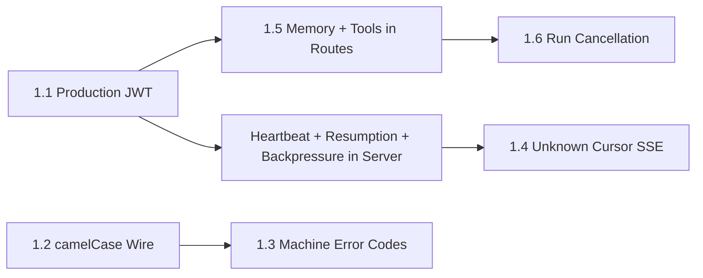

# Agent UI Adapter — Enhancements & Next Steps

> **Source**: End-to-end implementation review ([IMPLEMENTATION_REVIEW.md](sprints/IMPLEMENTATION_REVIEW.md)),
> Pyramid 8-check (confidence 0.88), risk sign-off (R1-R4 closed), and
> M-Phase2 swap proofs (SQLite memory + JSONL trace sink).
>
> **Current state**: Phase 1 sign-off complete. S0-S9 + M-Phase2 done.
> 598 tests passing (adapter + services + trust + architecture).
> 11/11 adapter architecture tests green.

---

## 1. v1.5 Enhancements (Next Sprint Cycle)

### 1.1 Production JWT Verifier

**Priority**: High — blocks production deployment.

The `JwtVerifier` Protocol in `agent_ui_adapter/server.py` is satisfied by
`InMemoryJwtVerifier` for testing. Production needs a real implementation.

**Options** (pick one):
- `python-jose[cryptography]` with RS256 JWKS verification
- WorkOS JWT verification (JWKS endpoint + audience validation)
- AWS Cognito / Auth0 / generic OIDC provider

**Work required**:
- Add chosen JWT library to `pyproject.toml` (AGENTS.md "Ask first")
- Implement `Rs256JwtVerifier` (or `WorkOsJwtVerifier`) conforming to the `JwtVerifier` Protocol
- JWKS caching (httpx call to `/.well-known/jwks.json`, TTL-based)
- End-to-end smoke test with a signed token (`tests/agent_ui_adapter/test_smoke_real_jwt.py`)
- Update `build_app()` callers to pass the production verifier

**Reference**: Plan §5.3, US-6.2, finding F-7.

### 1.2 Wire-Model camelCase Serialization

**Priority**: Medium — needed when frontend consumes the SSE stream directly.

AG-UI events use snake_case field names (`raw_event`, `run_id`). The AG-UI
JavaScript SDK expects camelCase (`rawEvent`, `runId`). The codegen pipeline
insulates this via TypeScript types from OpenAPI, but direct SSE consumption
would mismatch.

**Work required**:
- Add `model_config = ConfigDict(alias_generator=to_camel, populate_by_name=True)` to `BaseEvent`
- Or per-field `Field(alias="rawEvent")` on each model
- Update `encode_event` to call `model_dump_json(by_alias=True)`
- Regenerate `openapi.yaml` and `frontend/lib/wire-types.ts`

**Reference**: Finding F-2.

### 1.3 Machine-Readable JWT Error Codes

**Priority**: Low — currently human-readable strings work fine.

JWT error responses use `"token expired"` instead of `"token_expired"`. If
the frontend needs programmatic error routing, switch to machine codes.

**Work required**:
- Define error code enum: `missing_token`, `invalid_token`, `token_expired`, `unknown_identity`, `suspended`
- Return `{"detail": "...", "code": "<machine_code>"}` in 401 responses
- Update `tests/agent_ui_adapter/test_jwt_dependency.py` to assert codes

**Reference**: Finding F-7.

### 1.4 SSE `event: error` for Unknown Cursor

**Priority**: Low — `UnknownCursorError` is raised but not wired to SSE output.

When a client reconnects with `Last-Event-ID` that is unknown,
`EventBuffer.replay_after()` raises `UnknownCursorError`. The server
should catch it and emit `event: error\ndata: {"code":"unknown_cursor"}\n\n`
before closing the stream.

**Work required**:
- In `server.py` `_generate()`, catch `UnknownCursorError` and call `encode_error()`
- Add test in `test_server.py` or `test_resumption.py`

**Reference**: Finding F-6, US-5.3.

### 1.5 Wire `long_term_memory` and `tool_registry` in Routes

**Priority**: Medium — these DI slots exist but aren't used in route handlers.

`build_app()` accepts `long_term_memory` and `tool_registry` parameters but
no route handler references them. When thread-level memory persistence or
tool-schema-discovery endpoints are needed, these will be wired.

**Work required**:
- `GET /agent/tools` endpoint returning `tool_registry.get_schemas()`
- Memory-backed thread persistence replacing `_ThreadStore`
- Replace `dict[str, AgentFacts]` with `AgentFactsRegistry` for dynamic identity refresh

**Reference**: Finding F-8.

### 1.6 Run Cancellation with Task Tracking

**Priority**: Low — current `cancel()` is best-effort (no-op).

`LangGraphRuntime._run_tasks` is declared but never populated by `run()`.
Since `run()` is an async generator, the server layer would need to wrap
the generator consumption in an `asyncio.Task` and register it.

**Work required**:
- In `server.py` `stream_run`, wrap `_generate()` in a Task, register with `runtime._run_tasks[run_id]`
- Or: add a `CancellationToken` parameter to `AgentRuntime.run()` Protocol
- `DELETE /agent/runs/{run_id}` should actually cancel the running stream

**Reference**: Finding F-4.

---

## 2. v1.5 Deferred Scope (from Plan §2.2)

| Item | Description | Dependency |
|------|-------------|------------|
| CLI via AgentRuntime | Route `cli.py` through `AgentRuntime` instead of direct `react_loop` call | None — just wire `LangGraphRuntime` in CLI entry point |
| WebSocket transport | SSE-only in v1; add `agent_ui_adapter/transport/websocket.py` | Plan §10 row: only transport changes |
| AsyncAPI 3 export | Export for non-CopilotKit clients | Defer until a second client type lands |
| React Native client | New RN app consuming AG-UI events over SSE | No backend changes needed |

---

## 3. v2 Deferred Scope (from Plan §2.3)

| Item | Description |
|------|-------------|
| Protobuf / gRPC-web | Alternative wire format for high-throughput use cases |
| Multi-agent blackboard | Wiring `source_agent_id` + `causation_id` for multi-agent UI (fields already present in `BaseEvent.rawEvent`) |
| Ed25519 asymmetric signing | Replace HMAC sealed envelopes with Ed25519 for cross-system identity exchange |

---

## 4. Environment / CI Fixes

### 4.1 `logfire` / `opentelemetry-sdk` Incompatibility

The test environment has a `logfire` plugin that fails to import due to a
`opentelemetry-sdk` version mismatch (`LogData` not found). This causes
pytest to crash unless run with `-p no:logfire`.

**Fix**: Pin compatible `opentelemetry-sdk` version in `pyproject.toml`
(or uninstall `logfire` if not actively used).

**Workaround**: `pytest -p no:logfire` (current canonical invocation).

### 4.2 `numpy` / `transformers` Segfault

`tests/services/test_observability.py` triggers a `numpy` segfault via
`transformers` imports in the Anaconda environment.

**Fix**: Isolate observability tests behind a `pytest.importorskip("transformers")`
guard, or run in a clean venv without Anaconda's numpy.

### 4.3 Swap-Radius Test in Multi-Ring PRs

`tests/architecture/test_mphase2_swap_radius.py` fires when both `services/`
and `agent_ui_adapter/` are modified in the same branch. This is correct for
swap-only PRs but noisy for feature PRs that touch both rings.

**Options**:
- Run with `-k "not swap_radius"` for normal development (current approach)
- Move to a dedicated CI workflow that only runs on PRs labeled `service-swap`
- Add a `.swap-radius-skip` marker file that the test checks before asserting

---

## 5. Backlog Items Not in Any Sprint

These were surfaced during the review but don't fit existing stories:

| Item | Description | Suggested Sprint |
|------|-------------|-----------------|
| Thread listing endpoint | `GET /agent/threads` returns a list but has no dedicated Pydantic response model | v1.5 with memory persistence |
| AG-UI version CI grep | No CI step greps for unpinned AG-UI references beyond the single `AGUI_PINNED_VERSION` constant | Low priority — single-source pin is sufficient |
| `pyproject.toml` AG-UI pin | Pin AG-UI SDK version in `pyproject.toml` if/when the Python SDK is added as a dependency | Only relevant if `ag-ui-protocol` Python package is adopted |
| Heartbeat integration in server | `with_heartbeat()` from `transport/heartbeat.py` is not wired into `server.py`'s SSE stream | v1.5 — currently heartbeats are only unit-tested, not composed into the production stream |
| EventBuffer integration in server | `EventBuffer` + `Last-Event-ID` from `transport/resumption.py` are not wired into `server.py` | v1.5 — resumption buffer needs server-level state management |
| Backpressure integration in server | `BoundedEventStream` from `transport/backpressure.py` is not wired into `server.py` | v1.5 — production streams should use bounded queues |

---

## 6. Recommended v1.5 Sprint Ordering

**Critical path**: JWT verifier (1.1) unblocks production deployment, then
memory/tools wiring (1.5) enables stateful threads. Transport integration
(heartbeat + resumption + backpressure) hardens the SSE stream. camelCase
and error codes can run in parallel once the frontend is consuming events.

---

*Generated from Phase 1 sign-off review. See [IMPLEMENTATION_REVIEW.md](sprints/IMPLEMENTATION_REVIEW.md) for full audit.*
