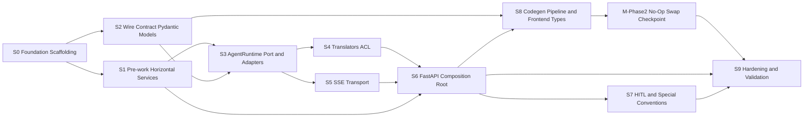

# AGENT_UI_ADAPTER_SPRINTS.md — Sprint Backlog and User Stories

> **Status**: implementation roadmap. Decomposes [AGENT_UI_ADAPTER_PLAN.md](../AGENT_UI_ADAPTER_PLAN.md) into 10 logical sprints (S0–S9) plus an M-Phase2 no-op checkpoint.
>
> **Methodology**: TDD per [research/tdd_agentic_systems_prompt.md](../../../../research/tdd_agentic_systems_prompt.md), boundaries per [AGENTS.md](../../../../AGENTS.md). Failure paths first.
>
> **Cadence**: none. Group by logical milestones with explicit dependencies. Critical path declared in §2.
>
> **Authored from the Pyramid 8-check review**: see §6.

---

## 1. Purpose & How To Read

This document is the operational backlog. Each story has acceptance criteria mapped back to a clause in [AGENT_UI_ADAPTER_PLAN.md](../AGENT_UI_ADAPTER_PLAN.md) §15 (validation suite), §8 (architecture rules), or §2.1 (capability table).

Read order:

1. §2 Critical path — non-negotiable spine
2. §3 Logical sprint map — dependency graph
3. §4 Per-sprint stories — the actual backlog
4. §5 Cross-cutting traceability — proves no orphan stories or capabilities
5. §6 Pyramid 8-check log — review trail
6. §7 Definition of Ready / Done — quality gates

Discovered prerequisites (not in the original plan, surfaced during sprint authoring):

- **DP-1: `TrustTraceRecord` and `PolicyDecision` are designed in [docs/FOUR_LAYER_ARCHITECTURE.md](../../../FOUR_LAYER_ARCHITECTURE.md) (lines 197–209 and 907–916) but NOT yet defined in [trust/models.py](../../../../trust/models.py).** Adding them is a [AGENTS.md](../../../../AGENTS.md) "⚠️ Ask first" item because it modifies the trust kernel. They are additive types (no existing signed field changes), so they do NOT trigger re-signing of existing `AgentFacts`. **Owner: S0 prerequisite story (DP-1.1) — must complete before S1.**

---

## 2. Critical Path

**Load-bearing chain (verified by Pyramid Check 6 in §6):**

```
S1 ──┐
     ├─→ S3 ──→ (S4 + S5) ──→ S6
S2 ──┘
```

**S1, S2, S3, S6** are all "remove-collapses-the-plan" load-bearing. **S0** unblocks all but is small. **S4, S5, S7, S8, S9** layer on top of the spine. If you must descope, descope from the leaves first; never the spine.

---

## 3. Logical Sprint Map



S1 and S2 run in parallel after S0. S3 needs both. S4/S5 run in parallel after S3. S6 integrates. S7+S8 layer on. M-Phase2 is a proof checkpoint. S9 is hardening.

---

## 4. Per-Sprint User Stories

Story format:

- **ID** — unique
- **Title**
- **As a / I want / So that**
- **Dependencies** — story IDs + external prereqs
- **TDD Protocol** — A (Pure), B (Contract), C (Eval), or D (Simulation) per [research/tdd_agentic_systems_prompt.md](../../../../research/tdd_agentic_systems_prompt.md)
- **Acceptance Criteria** — Given/When/Then; failure paths first per [AGENTS.md](../../../../AGENTS.md) TAP-4
- **Test Mapping** — file path; plan §15 check satisfied
- **Capability / Rule / Risk / Question Mapping** — back to [AGENT_UI_ADAPTER_PLAN.md](../AGENT_UI_ADAPTER_PLAN.md)
- **Definition of Done** — see §7

---

### S0 — Foundation Scaffolding

**Goal**: Empty package tree + skipped architecture-test stubs + discovered-prerequisite resolution. Even scaffolding follows TDD: write failing/skipped tests first, then make minimum code green.

**Dependencies**: none

#### US-DP-1.1 — Add `TrustTraceRecord` and `PolicyDecision` to `trust/models.py`

- **As a** trust kernel maintainer
- **I want** the two types designed in `docs/FOUR_LAYER_ARCHITECTURE.md` to exist as Pydantic models in `trust/models.py`
- **So that** S1 horizontal services and S2 wire models have a domain contract to import from
- **Dependencies**: AGENTS.md "Ask first" approval (already granted in chat)
- **TDD Protocol**: A (Pure TDD)
- **Acceptance**:
  - Given an invalid `TrustTraceRecord` (e.g. `layer="L99"`, missing `trace_id`), When constructed, Then `ValidationError` is raised
  - Given a valid `TrustTraceRecord`, When `model_dump_json()` then `model_validate_json()`, Then the result equals the original (round-trip)
  - Given an invalid `PolicyDecision` (e.g. `enforcement="maybe"`), When constructed, Then `ValidationError` is raised
  - Given a `PolicyDecision(enforcement="allow", ...)`, When `.allowed` is read, Then it returns `True`; for any other enforcement value, Then `False`
- **Test Mapping**: `tests/trust/test_trace_record.py` (new), `tests/trust/test_policy_decision.py` (new)
- **Mappings**: discovered prerequisite — unblocks every other sprint
- **Failure paths first**: 4 rejection tests precede 2 acceptance tests

#### US-0.1 — Create empty `agent_ui_adapter/` package tree

- **As a** developer
- **I want** the package directory tree from [AGENT_UI_ADAPTER_PLAN.md](../AGENT_UI_ADAPTER_PLAN.md) §7 to exist with empty `__init__.py` files
- **So that** import-based architecture tests can run and subsequent stories can land code in the right place
- **Dependencies**: US-DP-1.1
- **TDD Protocol**: A (Pure)
- **Acceptance**:
  - Given the package tree, When `python -c "import agent_ui_adapter"`, Then no error
  - Given the package tree, When `pytest tests/architecture/ -q`, Then collected tests run (skipped is OK at this stage)
- **Test Mapping**: `tests/agent_ui_adapter/test_package_imports.py` (new, single sanity test)
- **Mappings**: capability A11 (architecture test scaffold)

#### US-0.2 — Add architecture-test skeleton with all R1–R9 + T1–T9 named tests

- **As a** architecture-test maintainer
- **I want** all 18 architecture tests stubbed in `tests/architecture/test_agent_ui_adapter_layer.py`
- **So that** sprints S2/S4/S6/S7/S9 can flip them from `pytest.skip` to passing as code lands
- **Dependencies**: US-0.1
- **TDD Protocol**: A (Pure)
- **Acceptance**:
  - Given the file, When `pytest tests/architecture/test_agent_ui_adapter_layer.py --collect-only`, Then 18 tests collected (T1–T9 + R1–R9)
  - Given the file, When run, Then unimplemented tests `pytest.skip("awaits S<n>")` with a sprint reference
- **Test Mapping**: `tests/architecture/test_agent_ui_adapter_layer.py` (new)
- **Mappings**: rules R1–R9 (plan §8); tests T1–T9 (plan §15.2)

#### US-0.3 — Document new logging handler stubs in `logging.json`

- **As a** observability owner
- **I want** placeholder log handlers for `agent_ui_adapter.server`, `agent_ui_adapter.transport`, `agent_ui_adapter.translators` in `logging.json`
- **So that** S1 services and S6 server have configured loggers from day one (H4)
- **Dependencies**: US-0.1
- **TDD Protocol**: A (Pure)
- **Acceptance**:
  - Given `logging.json`, When parsed as JSON, Then it contains the three new handlers
  - Given a smoke test, When a logger named `agent_ui_adapter.server` emits, Then the handler is invoked (no I/O assertion needed; configuration validity is enough)
- **Test Mapping**: `tests/services/test_logging_config.py` (extend existing if any, else new)
- **Mappings**: rule H4 from [AGENTS.md](../../../../AGENTS.md)

#### S0 Exit Criteria

- `python -c "import agent_ui_adapter"` succeeds
- `pytest tests/ -q` green (with skips counted)
- `pytest tests/architecture/ -q` collects 18 stubs; 0 unexpected failures
- `trust/models.py` has `TrustTraceRecord` + `PolicyDecision` with passing tests
- `logging.json` has 3 new handlers

---

### S1 — Pre-work Horizontal Services (depends: S0)

**Goal**: Build the three horizontal services that S6 will compose. **Each service has its own design sub-plan** at `docs/plan/services/`.

**Dependencies**: S0 complete (specifically US-DP-1.1 for `TrustTraceRecord`)

**TDD Protocol**: B (Contract-driven) — see [research/tdd_agentic_systems_prompt.md](../../../../research/tdd_agentic_systems_prompt.md) §Protocol B

**Sub-plans (Phase B deliverables)**:

- [TRACE_SERVICE_PLAN.md](../../services/TRACE_SERVICE_PLAN.md)
- [LONG_TERM_MEMORY_PLAN.md](../../services/LONG_TERM_MEMORY_PLAN.md)
- [AUTHORIZATION_SERVICE_PLAN.md](../../services/AUTHORIZATION_SERVICE_PLAN.md)

#### US-1.1 — `services/trace_service.py`

- **As an** orchestration node
- **I want** a horizontal trace service that accepts `TrustTraceRecord` instances and routes them to configured sinks
- **So that** every layer can emit traces uniformly without owning sink dispatch
- **Dependencies**: US-DP-1.1; sub-plan `TRACE_SERVICE_PLAN.md`
- **TDD Protocol**: B
- **Acceptance** (failure paths first):
  - Given a malformed payload (not a `TrustTraceRecord`), When `emit()` called, Then `TypeError` raised before any sink invoked
  - Given a sink that raises, When `emit()` called with multiple sinks, Then other sinks still invoked (failure isolation)
  - Given a valid record + in-memory sink, When `emit()` called, Then sink receives the record bytewise-identical
  - Given the service, When two `TrustTraceRecord` are emitted with the same `trace_id`, Then both are delivered (no de-dup at this layer)
- **Test Mapping**: `tests/services/test_trace_service.py` (new); contract pattern 4 from TDD §Pattern Catalog
- **Mappings**: addresses plan §11 Phase 1 pre-work bullet 2; closes risk R4

#### US-1.2 — `services/long_term_memory.py`

- **As an** orchestration node
- **I want** a horizontal long-term-memory service per H6 ([docs/STYLE_GUIDE_PATTERNS.md](../../../STYLE_GUIDE_PATTERNS.md) lines 465–537)
- **So that** the adapter can compose memory access without coupling to a backend SDK
- **Dependencies**: US-DP-1.1; sub-plan `LONG_TERM_MEMORY_PLAN.md`
- **TDD Protocol**: B
- **Acceptance** (failure paths first):
  - Given missing/empty `user_id`, When `store()` called, Then `ValueError` raised
  - Given a corrupted backend response, When `recall()` called, Then a typed exception (not raw backend exception) propagates
  - Given an in-memory backend, When `store()` then `recall()` with same key, Then the stored payload is returned
  - Given the service, When two `recall()` calls in parallel for the same key, Then both succeed (no shared mutable state)
- **Test Mapping**: `tests/services/test_long_term_memory.py` (new); pattern 4 contract test
- **Mappings**: closes plan §11 Phase 1 pre-work bullet 1

#### US-1.3 — `services/authorization_service.py`

- **As an** orchestration trust gate
- **I want** an authorization service that takes `(AgentFacts, action, context)` and returns a `PolicyDecision`
- **So that** access decisions live in one place, receive identity as parameter (AP-2), and emit `TrustTraceRecord` via the trace service
- **Dependencies**: US-DP-1.1, US-1.1; sub-plan `AUTHORIZATION_SERVICE_PLAN.md`
- **TDD Protocol**: B (decision matrix per TDD §B2)
- **Acceptance** (failure paths first; failure-mode-matrix pattern 11):
  - Given expired `AgentFacts.valid_until`, When `authorize()`, Then `PolicyDecision(enforcement="deny", reason="expired identity")`
  - Given suspended `AgentFacts.status`, When `authorize()`, Then deny with reason `"suspended identity"`
  - Given missing capability for the action, When `authorize()`, Then deny with reason `"missing capability"`
  - Given a deny embedded policy, When external policy would allow, Then deny (embedded layer wins per [docs/FOUR_LAYER_ARCHITECTURE.md](../../../FOUR_LAYER_ARCHITECTURE.md) precedence)
  - Given valid `AgentFacts` + matching capability + no deny policy, When `authorize()`, Then `enforcement="allow"`
  - Given any decision, When `authorize()` returns, Then a `TrustTraceRecord` was emitted to the configured trace service
- **Test Mapping**: `tests/services/test_authorization_service.py` (new); pattern 11 failure-mode matrix
- **Mappings**: closes plan §11 Phase 1 pre-work bullet 3; rule R8 partial; risk R4

#### S1 Exit Criteria

- 3 services exist; tests in `tests/services/` are green
- No horizontal-to-horizontal import (AP-2): an architecture test in `tests/architecture/test_service_isolation.py` (existing or new) confirms `services/authorization_service.py` does not import from `services/trace_service.py` directly — instead the orchestrator passes a sink in
- All 3 services have own log handlers (H4)
- `pytest tests/services/ -q` green in <30s (TDD §Pyramid L2 budget)

---

### S2 — Wire Contract Pydantic Models (depends: S0; PARALLEL with S1)

**Goal**: Pydantic source-of-truth for AG-UI events, Agent Protocol routes, and internal canonical domain events.

**Dependencies**: S0

**TDD Protocol**: A (Pure TDD) — these are pure Pydantic models, no I/O

#### US-2.1 — `wire/ag_ui_events.py` — 17 AG-UI events

- **As a** wire-contract owner
- **I want** all 17 AG-UI events as Pydantic v2 models with `extra='forbid'`
- **So that** schema drift between adapter and frontend fails closed
- **Dependencies**: US-0.1
- **TDD Protocol**: A
- **Acceptance** (failure paths first):
  - Given an event payload with an unknown field, When `RunStarted.model_validate(...)`, Then `ValidationError`
  - Given a missing required field (e.g., `RunStarted` without `run_id`), When validated, Then `ValidationError`
  - Given a wrong-type field (e.g. `run_id: 123`), When validated, Then `ValidationError`
  - Given a complete valid payload, When validated, Then the model instance contains the expected values
  - Given each of the 17 event types listed in plan §4.1, When checked, Then the model class exists and is exported
- **Test Mapping**: `tests/agent_ui_adapter/wire/test_ag_ui_events.py` (new); pattern 1 property-based schema test (Hypothesis where useful)
- **Mappings**: capability A4

#### US-2.2 — `wire/agent_protocol.py` — thread/run CRUD models

- **As a** server route author
- **I want** Pydantic models for every Agent Protocol route (request + response)
- **So that** FastAPI consumes them directly and OpenAPI export captures them
- **Dependencies**: US-0.1
- **TDD Protocol**: A
- **Acceptance**:
  - Given `ThreadCreateRequest` missing `user_id`, Then `ValidationError`
  - Given `ThreadState` round-tripped via JSON, Then equality holds
  - Given `RunCreateRequest` with extra fields, Then `ValidationError` (extra='forbid')
  - Models exist for every route in plan §4 routes table
- **Test Mapping**: `tests/agent_ui_adapter/wire/test_agent_protocol.py` (new)
- **Mappings**: capability A5

#### US-2.3 — `wire/domain_events.py` — internal canonical events

- **As a** translator author
- **I want** a small set of canonical domain-event types (e.g. `LLMTokenEmitted`, `ToolCallStarted`, `ToolResultReceived`, `RunStarted`, `RunFinished`, `StateMutated`)
- **So that** `AgentRuntime.run()` returns a uniform stream that translators can map to AG-UI without leaking framework specifics
- **Dependencies**: US-0.1
- **TDD Protocol**: A
- **Acceptance**:
  - Given each canonical type, When constructed with valid data, Then no error
  - Given each canonical type, When invalid, Then `ValidationError`
  - Given the union type `DomainEvent`, When pattern-matched, Then it covers all canonical types (test asserts `len(get_args(DomainEvent)) == N`)
- **Test Mapping**: `tests/agent_ui_adapter/wire/test_domain_events.py` (new)
- **Mappings**: enables capability A7

#### US-2.4 — `wire/export_openapi.py` — CLI entry point

- **As a** CI pipeline author
- **I want** a `python -m agent_ui_adapter.wire.export_openapi` command that prints a valid OpenAPI 3.1 document to stdout
- **So that** S8 codegen has a stable input
- **Dependencies**: US-2.1, US-2.2
- **TDD Protocol**: A
- **Acceptance**:
  - Given the CLI invoked, When stdout captured, Then it parses as YAML AND contains every model name from `wire/`
  - Given the CLI invoked twice, Then output is byte-identical (deterministic)
- **Test Mapping**: `tests/agent_ui_adapter/wire/test_export_openapi.py` (new)
- **Mappings**: capability A6

#### US-2.5 — Architecture test T4 `test_wire_is_pure_pydantic`

- **As a** rule enforcer
- **I want** an architecture test that scans `agent_ui_adapter/wire/**/*.py` and fails if any of `httpx`, `requests`, `boto3`, `langgraph`, `langchain`, `openai` is imported
- **So that** rule R4 (wire is pure Pydantic) is enforced
- **Dependencies**: US-2.1, US-2.2, US-2.3
- **TDD Protocol**: A; pattern 7 dependency rule enforcement
- **Acceptance**:
  - Given any forbidden import added artificially in a test fixture, Then T4 fails
  - Given current `wire/` code, Then T4 passes
- **Test Mapping**: `tests/architecture/test_agent_ui_adapter_layer.py::test_wire_is_pure_pydantic` (flips from skip to pass)
- **Mappings**: test T4; rule R4

#### US-2.6 — Pin AG-UI 0.x version

- **As a** release manager
- **I want** the AG-UI version pinned in `pyproject.toml` (or documented in `wire/ag_ui_events.py` header if hand-mirrored)
- **So that** plan risk R1 (AG-UI 0.x spec breaks) cannot silently bite
- **Dependencies**: US-2.1
- **TDD Protocol**: A
- **Acceptance**:
  - Given the codebase, When inspected, Then a single canonical pinned version string exists
  - Given a CI grep step, When run, Then no un-pinned AG-UI references remain
- **Test Mapping**: `tests/agent_ui_adapter/wire/test_agui_version_pin.py` (new): single test asserts the pin string matches the version embedded in models
- **Mappings**: closes Q1 + risk R1

#### S2 Exit Criteria

- All 17 AG-UI event models + Agent Protocol models + canonical domain events compile
- `python -m agent_ui_adapter.wire.export_openapi` produces valid OpenAPI 3.1
- T4 passes
- AG-UI version is pinned and CI-asserted
- `pytest tests/agent_ui_adapter/wire/ -q` green in <10s (TDD §Pyramid L1 budget)

---

### S3 — AgentRuntime Port and Adapters (depends: S1, S2)

**Goal**: Define the single `AgentRuntime` Protocol and provide two implementations: `MockRuntime` (for tests) and `LangGraphRuntime` (production).

**Dependencies**: S1 (services to compose), S2 (domain events)

**TDD Protocol**: B (Contract-driven)

#### US-3.1 — `ports/agent_runtime.py` — single Protocol

- **As an** adapter architect
- **I want** the `AgentRuntime` Protocol exactly per plan §5.1 snippet (one method `run` + `cancel` + `get_state`)
- **So that** rule R9 (one and only one new abstraction) is enforced
- **Dependencies**: US-2.3
- **TDD Protocol**: B
- **Acceptance**:
  - Given a class that implements all three methods, When `isinstance(obj, AgentRuntime)`, Then `True` (runtime-checkable)
  - Given a class missing `cancel`, Then `isinstance` returns `False`
  - Given the file scanned, Then exactly ONE `Protocol` subclass is defined (rule R9 enforcement)
- **Test Mapping**: `tests/agent_ui_adapter/ports/test_agent_runtime.py` (new)
- **Mappings**: capability A1; rule R9

#### US-3.2 — `adapters/runtime/mock_runtime.py`

- **As a** test author
- **I want** a `MockRuntime` that returns a scripted `AsyncIterator[DomainEvent]`
- **So that** higher-layer tests (S4, S5, S6) don't need LangGraph
- **Dependencies**: US-3.1, US-2.3
- **TDD Protocol**: B (mock provider pattern 6)
- **Acceptance**:
  - Given `MockRuntime(events=[...])`, When `run()` called, Then yields exactly the scripted events in order
  - Given `MockRuntime(error_after=2)`, When `run()` called, Then yields 2 events then raises `RuntimeError`
  - Given `MockRuntime`, When checked, Then `isinstance(MockRuntime(), AgentRuntime)` is `True`
- **Test Mapping**: `tests/agent_ui_adapter/adapters/runtime/test_mock_runtime.py` (new)
- **Mappings**: capability A3

#### US-3.3 — `adapters/runtime/langgraph_runtime.py`

- **As an** adapter implementer
- **I want** a `LangGraphRuntime` that wraps `orchestration.react_loop:build_graph` and emits `DomainEvent` from graph state transitions
- **So that** the production runtime conforms to `AgentRuntime` without bleeding LangGraph types into translators or wire
- **Dependencies**: US-3.1, US-2.3, US-1.1, US-1.2, US-1.3
- **TDD Protocol**: B (mock LangGraph compiled-app for unit tests)
- **Acceptance**:
  - Given a fake compiled graph that yields scripted state updates, When `LangGraphRuntime.run()` called, Then emits the expected `DomainEvent` sequence
  - Given a graph that errors, When `run()` called, Then a `RunFinished` with error outcome is emitted (no raw exception leak past the adapter)
  - Given `LangGraphRuntime`, When checked, Then `isinstance` of `AgentRuntime` is `True`
  - Given the runtime, When inspected, Then it does NOT import from `agent_ui_adapter.wire.ag_ui_events` (only `wire.domain_events` allowed)
- **Test Mapping**: `tests/agent_ui_adapter/adapters/runtime/test_langgraph_runtime.py` (new); fake graph fixture
- **Mappings**: capability A2

#### US-3.4 — Conformance test bundle

- **As a** rule enforcer
- **I want** a parametrized test that asserts every implementation in `adapters/runtime/` conforms to `AgentRuntime`
- **So that** future runtime adapters cannot land without conformance
- **Dependencies**: US-3.1, US-3.2, US-3.3
- **TDD Protocol**: B (consumer-driven contract pattern 4)
- **Acceptance**:
  - Given the test parametrized over `[MockRuntime, LangGraphRuntime]`, When run, Then both pass `isinstance(_, AgentRuntime)` and a minimal happy-path script
- **Test Mapping**: `tests/agent_ui_adapter/adapters/runtime/test_conformance.py` (new)
- **Mappings**: rule R9

#### S3 Exit Criteria

- All capabilities A1, A2, A3 done
- Conformance test green for both runtimes
- `pytest tests/agent_ui_adapter/{ports,adapters}/ -q` green

---

### S4 — Translators ACL (depends: S3)

**Goal**: Pure shape mapping between domain events and AG-UI events. No I/O, no LLM, no service imports.

**Ownership convention (S4 ↔ S7)**: S4 owns the **generic** translator code. S7 owns the **HITL-specific** virtual `request_approval` tool registration. Translator code does NOT special-case HITL.

**Dependencies**: S3 (domain events fixed)

**TDD Protocol**: A (Pure)

#### US-4.1 — `translators/domain_to_ag_ui.py`

- **As a** translator author
- **I want** a pure function `to_ag_ui(event: DomainEvent) -> list[AGUIEvent]` that maps each canonical domain event to one or more AG-UI events
- **So that** the runtime doesn't know about AG-UI and the wire doesn't know about runtime internals
- **Dependencies**: US-2.1, US-2.3
- **TDD Protocol**: A
- **Acceptance** (failure paths first):
  - Given an event of unknown type, When `to_ag_ui()` called, Then `TypeError` (pure function, no fallback)
  - Given a `LLMTokenEmitted`, Then yields `[TextMessageContent(...)]`
  - Given a `ToolCallStarted`, Then yields `[ToolCallStart(...), ToolCallArgs(...)]`
  - Given a `RunFinished(error=...)`, Then yields `[RunError(...)]`
  - Given a `RunFinished(error=None)`, Then yields `[RunFinished(...)]`
- **Test Mapping**: `tests/agent_ui_adapter/translators/test_domain_to_ag_ui.py` (new)
- **Mappings**: capability A7

#### US-4.2 — `translators/ag_ui_to_domain.py`

- **As a** translator author
- **I want** the inverse mapping for inbound `TOOL_RESULT`
- **So that** HITL approvals (and any future inbound AG-UI events) re-enter the runtime without parser duplication
- **Dependencies**: US-2.1, US-2.3
- **TDD Protocol**: A
- **Acceptance**:
  - Given a `ToolResult` AG-UI event, When `to_domain()` called, Then yields a `ToolResultReceived` domain event with byte-equivalent payload
  - Given a malformed event, Then `ValidationError` (re-validates the input)
- **Test Mapping**: `tests/agent_ui_adapter/translators/test_ag_ui_to_domain.py` (new)
- **Mappings**: capability A7

#### US-4.3 — `trace_id` propagation (plan §4.3 Option B)

- **As a** trust framework consumer
- **I want** every emitted AG-UI event to carry `BaseEvent.rawEvent.trace_id`
- **So that** correlation across runs survives the AG-UI hop
- **Dependencies**: US-4.1
- **TDD Protocol**: A
- **Acceptance**:
  - Given a domain event tagged with `trace_id="abc"`, When translated, Then every produced AG-UI event has `rawEvent.trace_id == "abc"`
  - Given a domain event without `trace_id`, Then `ValueError` raised (no silent omission)
- **Test Mapping**: `tests/agent_ui_adapter/translators/test_trace_id_propagation.py` (new)
- **Mappings**: test T9; plan §4.3 row 3

#### US-4.4 — Sealed-envelope round-trip helpers

- **As a** trust framework guard
- **I want** helpers `to_envelope(facts: AgentFacts) -> dict` and `from_envelope(dict) -> AgentFacts` that round-trip byte-equivalent
- **So that** signature verification still passes after a frontend echo
- **Dependencies**: US-DP-1.1
- **TDD Protocol**: A; pattern 3 signature roundtrip
- **Acceptance**:
  - Given a signed `AgentFacts`, When `from_envelope(to_envelope(facts))`, Then `verify_signature(...)` returns `True`
  - Same for `TrustTraceRecord` and `PolicyDecision`
  - Given any reordering of dict keys after JSON round-trip, Then signatures still verify (because we sign the canonical form)
- **Test Mapping**: `tests/agent_ui_adapter/translators/test_sealed_envelope.py` (new)
- **Mappings**: test T6; plan §4.4

#### US-4.5 — Architecture tests T5 + T6

- **As a** rule enforcer
- **I want** T5 (`test_translators_do_not_import_services`) and T6 (`test_signed_payload_roundtrips`) to flip from skip to pass
- **So that** R5–R7 are enforced
- **Dependencies**: US-4.1, US-4.2, US-4.4
- **TDD Protocol**: A
- **Acceptance**: T5 + T6 green; T5 fails if `services` import is artificially added
- **Test Mapping**: `tests/architecture/test_agent_ui_adapter_layer.py::test_translators_do_not_import_services`, `::test_signed_payload_roundtrips`
- **Mappings**: rules R5–R7; tests T5, T6

#### S4 Exit Criteria

- Translators are pure (no `services/` imports — verified by T5)
- Sealed envelopes round-trip (T6)
- All canonical domain events have a translation; reverse mapping works for inbound events
- `pytest tests/agent_ui_adapter/translators/ -q` green in <10s

---

### S5 — SSE Transport (depends: S3; PARALLEL with S4)

**Goal**: Production-grade SSE per plan §4.2 robustness checklist.

**Dependencies**: S3 (domain events to stream)

**TDD Protocol**: B (Contract-driven; mock SSE client)

#### US-5.1 — `transport/sse.py` — base streaming response

- **As a** transport author
- **I want** a streaming generator that emits AG-UI events as `text/event-stream` lines, terminated with sentinel `event: done\ndata: [DONE]`, with `X-Accel-Buffering: no` header set on the response
- **So that** Cloudflare/proxies don't buffer the stream
- **Dependencies**: US-2.1
- **TDD Protocol**: B
- **Acceptance** (failure paths first):
  - Given a generator that raises mid-stream, When consumed by a mock client, Then a final `event: error` is emitted before close (no silent termination)
  - Given a normal completion, Then the last bytes are exactly `event: done\ndata: [DONE]\n\n`
  - Given the response, When headers inspected, Then `X-Accel-Buffering: no` is set
  - Given each event, When emitted, Then it has the form `id: <event_id>\nevent: <type>\ndata: <json>\n\n`
- **Test Mapping**: `tests/agent_ui_adapter/transport/test_sse.py` (new)
- **Mappings**: capability A8

#### US-5.2 — `transport/heartbeat.py` — 15s keepalive

- **As a** transport author
- **I want** a periodic `: ping\n\n` comment emitted every 15 seconds
- **So that** intermediate proxies don't time out idle connections
- **Dependencies**: US-5.1
- **TDD Protocol**: B (uses `freezegun` or fake clock)
- **Acceptance**:
  - Given a stream with no events for 30s (faked), Then exactly 2 heartbeats observed
  - Given a stream with events arriving every 5s, Then a heartbeat still emits at the 15s boundary
- **Test Mapping**: `tests/agent_ui_adapter/transport/test_heartbeat.py` (new)
- **Mappings**: capability A8

#### US-5.3 — `Last-Event-ID` resumption

- **As a** browser client
- **I want** the server to honor the `Last-Event-ID` header on reconnect
- **So that** transient disconnects don't lose events
- **Dependencies**: US-5.1
- **TDD Protocol**: B
- **Acceptance**:
  - Given a thread with events `[id=1, id=2, id=3]` already emitted, When client reconnects with `Last-Event-ID: 2`, Then only `[id=3, ...]` is sent
  - Given a `Last-Event-ID` newer than any known, Then a `event: error` with reason `unknown_cursor` is emitted
- **Test Mapping**: `tests/agent_ui_adapter/transport/test_resumption.py` (new)
- **Mappings**: capability A8

#### US-5.4 — Backpressure with bounded `asyncio.Queue`

- **As a** memory-safety owner
- **I want** the per-stream queue to be bounded (e.g. `maxsize=1024`)
- **So that** a slow client cannot OOM the server
- **Dependencies**: US-5.1
- **TDD Protocol**: B
- **Acceptance**:
  - Given a slow consumer (mock that sleeps), When the producer fills the queue, Then producer suspends (does not raise) until consumer drains
  - Given a producer that ignores backpressure, Then queue never exceeds maxsize
- **Test Mapping**: `tests/agent_ui_adapter/transport/test_backpressure.py` (new)
- **Mappings**: capability A8

#### S5 Exit Criteria

- All four robustness items from plan §4.2 verified by tests
- `pytest tests/agent_ui_adapter/transport/ -q` green in <30s

---

### S6 — FastAPI Composition Root (depends: S1, S2, S4, S5)

**Goal**: Wire everything together. This is the integration sprint.

**Dependencies**: S1, S2, S4, S5

**TDD Protocol**: B + integration smoke test

> **Dependency announcement**: This sprint adds `fastapi`, `uvicorn[standard]`, `httpx` (test client), and a JWT verifier (recommended: `python-jose[cryptography]`) to `pyproject.toml`. Per [AGENTS.md](../../../../AGENTS.md) "⚠️ Ask first" rule, S6 cannot start until these are approved.

#### US-6.1 — `server.py` — FastAPI app + routes

- **As a** server author
- **I want** the FastAPI app exposing `POST /agent/runs/stream`, `GET/POST /agent/threads`, `GET/DELETE /agent/runs/{run_id}`, `GET /healthz`
- **So that** the AG-UI Agent Protocol routes from plan §4 are reachable
- **Dependencies**: US-2.2, US-3.1, US-3.2, US-4.1, US-5.1
- **TDD Protocol**: B; httpx ASGI test client
- **Acceptance**:
  - Given the app + `MockRuntime`, When `POST /agent/runs/stream`, Then a 200 SSE response begins streaming AG-UI events
  - Given `GET /healthz`, Then 200 with `{"status":"ok"}`
  - Given `GET /agent/runs/{run_id}` for an unknown run, Then 404
- **Test Mapping**: `tests/agent_ui_adapter/test_server.py` (new)
- **Mappings**: capability A9

#### US-6.2 — Pre-flight JWT verification dependency

- **As a** security gate
- **I want** a FastAPI dependency that verifies the bearer JWT BEFORE the SSE stream opens
- **So that** invalid sessions don't consume runtime resources (cheap PEP per plan §5.3)
- **Dependencies**: US-6.1, US-1.3
- **TDD Protocol**: B; failure-path matrix per pattern 11
- **Acceptance** (failure paths first):
  - Given no `Authorization` header, Then 401
  - Given malformed bearer token, Then 401 with reason
  - Given an expired token, Then 401 with reason `token_expired`
  - Given a token whose subject is unknown to `AgentFactsRegistry`, Then 401 with reason `unknown_identity`
  - Given a token whose subject is suspended, Then 401 with reason `suspended`
  - Given a valid token + active identity, Then dependency returns the resolved `AgentFacts`
- **Test Mapping**: `tests/agent_ui_adapter/test_jwt_dependency.py` (new)
- **Mappings**: capability A10; rule R8

#### US-6.3 — Service DI wiring

- **As a** composition root
- **I want** a single `build_app()` that wires `trace_service`, `long_term_memory`, `authorization_service`, `agent_facts_registry`, `tool_registry`, and the chosen `AgentRuntime` implementation
- **So that** swapping any service is one DI line per plan §10
- **Dependencies**: US-1.1, US-1.2, US-1.3, US-3.1
- **TDD Protocol**: B
- **Acceptance**:
  - Given alternate `AgentRuntime` implementations, When `build_app(runtime=...)` called, Then the app routes use that runtime
  - Given alternate trace/memory/authz services, When passed to `build_app`, Then they are used
  - Given the app, When inspected via test, Then the only Protocol it depends on is `AgentRuntime` (rule R9)
- **Test Mapping**: `tests/agent_ui_adapter/test_composition_root.py` (new)
- **Mappings**: capability A9; rules R8, R9

#### US-6.4 — Per-stream observability log handlers

- **As an** observability owner
- **I want** each stream to emit start/end log lines with the `trace_id` and `run_id`
- **So that** log search by `trace_id` works end-to-end
- **Dependencies**: US-6.1, US-0.3
- **TDD Protocol**: B
- **Acceptance**:
  - Given a stream, When started, Then a log line `agent_ui_adapter.server: stream_started trace_id=... run_id=...`
  - Given a stream, When ended, Then `stream_ended` log line with duration_ms
- **Test Mapping**: `tests/agent_ui_adapter/test_logging.py` (new); pattern caplog
- **Mappings**: capability A12

#### US-6.5 — Architecture tests T1, T2, T3

- **As a** rule enforcer
- **I want** T1 (`test_adapter_does_not_import_meta`), T2 (`test_adapter_does_not_import_components`), T3 (`test_inner_layers_do_not_import_adapter`) to flip from skip to pass
- **So that** rules R1–R3 are enforced
- **Dependencies**: US-6.1, US-6.3
- **TDD Protocol**: A; pattern 7 dependency rule enforcement
- **Acceptance**: T1, T2, T3 green; each fails when a forbidden import is artificially added
- **Test Mapping**: `tests/architecture/test_agent_ui_adapter_layer.py::test_adapter_does_not_import_{meta,components}`, `::test_inner_layers_do_not_import_adapter`
- **Mappings**: tests T1, T2, T3; rules R1, R2, R3

#### US-6.6 — Phase 1 smoke test (integration)

- **As a** Phase 1 gatekeeper
- **I want** a single end-to-end test that boots the app with `MockRuntime`, sends an authenticated `POST /agent/runs/stream` via httpx, and verifies a multi-event SSE response
- **So that** S6 exit confirms the full stack composes correctly
- **Dependencies**: US-6.1, US-6.2, US-6.3, US-5.1
- **TDD Protocol**: B integration
- **Acceptance**:
  - Given the booted app + valid bearer token + `MockRuntime` scripted to emit `[RunStarted, TextMessageStart, TextMessageContent×3, TextMessageEnd, RunFinished]`, When client reads the SSE stream to completion, Then all 7 AG-UI events arrive in order, then sentinel `[DONE]`
  - Given the same call without a bearer token, Then 401 (no SSE bytes leak)
- **Test Mapping**: `tests/agent_ui_adapter/test_smoke_phase1.py` (new)
- **Mappings**: plan §11 Phase 1 exit gate

#### S6 Exit Criteria

- App boots; all routes return expected codes
- T1, T2, T3 green
- Smoke test green end-to-end
- `pytest tests/agent_ui_adapter/ -q` green
- Full architecture-test sweep: T1–T6 green; T7–T9 still skipped (S7); R8/R9 still skipped (S9)

---

### S7 — HITL and Special Conventions (depends: S6)

**Goal**: Human-in-the-loop via virtual `request_approval` tool, plus payload-leakage tests.

**Ownership convention**: S7 only adds tool registration + integration test. It does NOT modify translator code (which lives in S4).

**Dependencies**: S6

**TDD Protocol**: B integration

#### US-7.1 — Register virtual `request_approval` tool

- Tool name: `request_approval`; schema: `{action: str, justification: str}`
- Registered via `services/tools/registry.ToolRegistry`
- Configuration-only; no new translator code
- **Test**: `tests/agent_ui_adapter/test_hitl_tool_registered.py`

#### US-7.2 — HITL round-trip integration

- Mock approve + mock deny scenarios
- Verifies the inbound `TOOL_RESULT` flows through `ag_ui_to_domain` and back to runtime
- **Test**: `tests/agent_ui_adapter/test_hitl_round_trip.py`

#### US-7.3 — Architecture tests T7, T8, T9

- T7: `request_approval` is registered as a tool; T8: no `Bearer` or `eyJ` in any event payload; T9: every emitted event has `trace_id`
- All flip from skip to pass

#### S7 Exit Criteria

- T7, T8, T9 green
- HITL round-trip integration green

---

### S8 — Codegen Pipeline and Frontend Types (depends: S2, S6)

**Goal**: CI-enforced wire-type generation for the frontend.

**Dependencies**: S2, S6

**TDD Protocol**: B (CI-script-driven)

#### US-8.1 — `python -m agent_ui_adapter.wire.export_openapi > openapi.yaml` in CI
#### US-8.2 — `openapi-typescript openapi.yaml -o frontend/lib/wire-types.ts` in CI
#### US-8.3 — Drift-detection CI step — fails if regenerated TS differs from committed
#### US-8.4 — `frontend/lib/README.md` documenting sealed-envelope rule

#### S8 Exit Criteria

- CI green; intentional Pydantic change forces regen; drift step proven by deliberate failure (then reverted)

---

### M-Phase2 — No-Op Swap Checkpoint (depends: S8)

**Goal**: Empirically prove the swap-radius claim from plan §10. **Proof milestone, not a build milestone.**

#### M-Phase2.1 — Pick one horizontal-service backend swap

Recommended: `services/trace_service.py` swaps from logging-only → Langfuse emitter (or `long_term_memory` swaps from in-memory → SQLite). Choice documented at execution time.

#### M-Phase2.2 — Execute the swap; assert via `git diff --stat`

**Zero files under `agent_ui_adapter/` may change.** Architecture-test step in CI parses the PR diff and fails if `agent_ui_adapter/**` is touched alongside the service swap.

#### M-Phase2.3 — Re-run the S6 smoke test

Must still pass with the new backend.

#### M-Phase2 Exit Criteria

- Swap diff scoped to a single `services/*.py` file (+ tests)
- Plan §10 row "Replace Mem0 / WorkOS / Langfuse" empirically validated

#### M-Phase2 Sign-off

**Swap 1 (commit `00e6651`):** `services/long_term_memory.py` in-memory backend → `services/memory_backends/sqlite.py` (SQLite). `git diff --stat` for that commit touches only `services/memory_backends/` + `tests/services/test_sqlite_memory_backend.py`. Zero `agent_ui_adapter/` files changed. S6 smoke test (`tests/agent_ui_adapter/test_smoke_phase1.py`) passes.

**Swap 2:** `services/trace_service.py` logging-only → `services/trace_sinks/jsonl_sink.py` (JSONL file sink). New `TraceSink` implementation added under `services/trace_sinks/`. Zero `agent_ui_adapter/` files changed. S6 smoke test passes.

Both swaps validate plan §10 row "Replace Mem0 / WorkOS / Langfuse" empirically.

---

### S9 — Hardening and Validation (depends: S6, S7, S8, M-Phase2)

**Goal**: Full architecture-test battery on; release sign-off.

#### US-9.1 — Full architecture-test battery enabled (T1–T9 + R1–R9)

Explicitly includes:

- **R8 enforcement**: `test_orchestrator_composes_services` — AST scan of `agent_ui_adapter/server.py` asserts route handlers compose service calls + translator calls only at the boundary; no nested business logic
- **R9 enforcement**: `test_single_port_in_adapter` — AST scan of `agent_ui_adapter/ports/` asserts exactly one `Protocol` subclass is defined

#### US-9.2 — End-to-end smoke test with real WorkOS token

If WorkOS is wired (or with the chosen JWT verifier), curl with real token, multi-event SSE through fake LLM.

#### US-9.3 — Pyramid 8-check verification of the implemented adapter

Run [research/pyramid_react_system_prompt.md](../../../../research/pyramid_react_system_prompt.md) checks against the realized code, not just the plan.

#### US-9.4 — Risk register review against R1–R4

Sign-off note appended to plan §13 (or to a release notes doc).

#### S9 Exit Criteria

- All 18 architecture tests (T1–T9 + R1–R9) green
- Smoke test passes
- Pyramid 8-check checklist completed
- Release-ready

---

## 5. Cross-Cutting Traceability

Each row proves a plan element has at least one owning story. Each story can be back-traced to at least one plan element via the column populated.

| Story ID | Plan section | Capability | Test | Rule | Risk | Question |
|---|---|---|---|---|---|---|
| US-DP-1.1 | discovered prereq | — | — | — | — | — |
| US-0.1 | §7 layout | A11 (scaffold) | — | — | — | — |
| US-0.2 | §15.2 | A11 | T1–T9 stubs | R1–R9 stubs | — | — |
| US-0.3 | H4 (AGENTS.md) | A12 (partial) | — | — | — | — |
| US-1.1 | §11 Phase 1 pre-work | — | — | — | R4 | — |
| US-1.2 | §11 Phase 1 pre-work | — | — | — | R4 | — |
| US-1.3 | §11 Phase 1 pre-work | — | — | R8 (partial) | R4 | — |
| US-2.1 | §4.1 | A4 | — | R4 | — | — |
| US-2.2 | §4 routes | A5 | — | R4 | — | — |
| US-2.3 | §7 wire/ | enables A7 | — | — | — | — |
| US-2.4 | §9 codegen | A6 | — | — | — | — |
| US-2.5 | §15.2 | — | T4 | R4 | — | — |
| US-2.6 | §13 risk R1 | — | — | — | R1 | Q1 |
| US-3.1 | §5.1 | A1 | — | R9 | — | — |
| US-3.2 | §2.1 row A3 | A3 | — | — | — | — |
| US-3.3 | §2.1 row A2 | A2 | — | — | — | — |
| US-3.4 | §15.2 | — | — | R9 | — | — |
| US-4.1 | §4.1 | A7 | — | R5 | — | — |
| US-4.2 | §4.1 | A7 | — | R5 | — | — |
| US-4.3 | §4.3 row 3 | A7 | T9 | — | — | Q7 (partial) |
| US-4.4 | §4.4 | — | T6 | — | R3 | Q2 |
| US-4.5 | §15.2 | — | T5, T6 | R5–R7 | — | — |
| US-5.1 | §4.2 | A8 | — | — | — | — |
| US-5.2 | §4.2 row 1 | A8 | — | — | — | — |
| US-5.3 | §4.2 row 2 | A8 | — | — | — | — |
| US-5.4 | §4.2 row 4 | A8 | — | — | — | — |
| US-6.1 | §4 routes | A9 | — | — | — | Q4 |
| US-6.2 | §5.3 | A10 | — | R8 | — | Q6 |
| US-6.3 | §10 swap matrix | A9 | — | R8, R9 | — | — |
| US-6.4 | §2.1 row A12 | A12 | — | — | — | — |
| US-6.5 | §15.2 | — | T1, T2, T3 | R1, R2, R3 | — | — |
| US-6.6 | §11 Phase 1 exit | — | — | — | — | — |
| US-7.1 | §4.3 row 1 | — | T7 (partial) | — | — | — |
| US-7.2 | §4.3 row 1 | — | T7 | — | — | — |
| US-7.3 | §15.2 | — | T7, T8, T9 | — | — | — |
| US-8.1 | §9 | A6 | — | — | — | — |
| US-8.2 | §9 | — | — | — | — | — |
| US-8.3 | §9 | — | — | — | R2 | — |
| US-8.4 | §4.4 | — | — | — | R3 | — |
| M-Phase2 | §11 Phase 2 | — | `tests/services/test_sqlite_memory_backend.py`, `tests/services/trace_sinks/test_jsonl_sink.py` | — | R4 | — |
| US-9.1 | §15.2 | A11 | T1–T9 | R1–R9 | — | — |
| US-9.2 | §11 Phase 1 last bullet | — | — | — | — | — |
| US-9.3 | §15.1 | — | — | — | — | — |
| US-9.4 | §13 | — | — | — | R1–R4 | — |

**Capability coverage check** (A1–A12): every capability has ≥1 owning story. ✓
**Test coverage check** (T1–T9): every test has ≥1 owning story. ✓
**Rule coverage check** (R1–R9): R1–R7 via T1–T6 + R5–R7; R8 via US-1.3, US-6.2, US-6.3, US-9.1; R9 via US-3.1, US-3.4, US-6.3, US-9.1. ✓
**Risk coverage** (R1–R4): R1 via US-2.6; R2 via US-8.3; R3 via US-4.4, US-8.4; R4 via S1 sprint (US-1.1, US-1.2, US-1.3). ✓
**Question coverage** (Q1–Q7): Q1 via US-2.6; Q2 via US-4.4; Q4 via US-6.1 (deployment); Q6 via US-6.2; Q7 via US-4.3. Q3, Q5 explicitly deferred per plan. ✓

No orphan stories, no orphan plan elements.

---

## 6. Pyramid 8-Check Review Log

This section records the validation that produced this backlog. See [research/pyramid_react_system_prompt.md](../../../../research/pyramid_react_system_prompt.md) for methodology.

**Phase 1 — Decompose**
Restated question: "How should the AGENT_UI_ADAPTER_PLAN be decomposed into a sprint backlog with logical milestones, dependencies, user stories, and acceptance criteria?"
Problem type: Design + Evaluation. Ordering: Structural (dependency order).

**Phase 2 — Hypothesize**
Initial governing thought: "10 sprints + 1 proof milestone is a valid MECE partition with explicit dependencies and full traceability to plan capabilities/tests/rules/risks/questions."

**Phase 3 — Act (8 checks)**

| # | Check | Result | Detail |
|---|---|---|---|
| 1 | Completeness | Pass | A1–A12, T1–T9, R1–R9, R1–R4, Q1–Q7 all mapped (gaps closed by edits 1–3) |
| 2 | Non-overlap | Pass | S4↔S7 ownership convention documented; arch-test staging convention documented |
| 3 | Item placement | Pass | 3 random items each fit one story (backpressure → US-5.4; openapi-typescript → US-8.2; pre-flight JWT → US-6.2) |
| 4 | So what? | Pass | Every sprint chains to plan §1 governing thought (swappability) |
| 5 | Vertical logic | Pass | Encoded by §3 mermaid graph |
| 6 | Remove one | Pass with critical-path note | S1, S2, S3, S6 are load-bearing → §2 callout |
| 7 | Never-one | Pass | Every sprint has 3+ stories |
| 8 | Mathematical | N/A | No quantitative claim |

**Phase 4 — Synthesize**
Governing thought: "The 10-sprint + 1-checkpoint backlog is a structurally sound MECE decomposition with full traceability and a declared critical path."
**Confidence: 0.85.**

---

## 7. Definition of Ready / Definition of Done

### Definition of Ready (per story)

A story is ready to start when:

1. All listed dependencies have status "done" (or are explicitly marked OK to parallelize)
2. The TDD protocol for the story's layer has been read by the implementer
3. The acceptance criteria have failure paths first (per [AGENTS.md](../../../../AGENTS.md) TAP-4)
4. Test file paths are listed and don't conflict with existing tests
5. Capability / rule / risk / question mappings are populated

### Definition of Done (per story)

A story is done when:

1. Code lands with the exact files listed in Test Mapping
2. `pytest tests/ -q` is green
3. `pytest tests/architecture/ -q` is green for all currently-enabled tests
4. The architecture test that owns this story (if any) has flipped from `pytest.skip` to passing
5. No new horizontal-to-horizontal coupling introduced (anti-pattern AP-2)
6. No hardcoded prompts (AP-3); no upward governance calls (AP-4); no domain logic in orchestration (AP-5)
7. New dependencies (if any) were "Ask first"-approved and pinned
8. Logger added to `logging.json` if a new module emits logs (H4)
9. The story's row in §5 traceability table is updated (mark "done" + commit SHA)

### Definition of Done (per sprint)

A sprint is done when all its stories are done AND:

1. The Sprint Exit Criteria in §4 are met
2. The full `pytest tests/ -q` suite is green
3. The full architecture-test suite is in the expected state (green for owned tests; skip for not-yet-owned)
4. Cross-sprint review run if the sprint produced a new public API (services or ports)

---

## 8. Execution Strategy (Phases A–G)

This sprints document is **Phase A**. The remaining phases:

- **Phase B**: Author 3 service sub-plans in `docs/plan/services/` (markdown only; ≤150 lines each)
- **Phase C**: Execute S0 (single agent; markdown + Python; arch-test stubs first)
- **Phase D**: Execute S1 + S2 in PARALLEL via 2 sub-agents
  - Sub-agent A: S1 (3 services sequentially with TDD Protocol B)
  - Sub-agent B: S2 (wire contract bundle with TDD Protocol A)
- **Phase E**: Execute S3 (single agent; depends on S1 + S2)
- **Phase F**: Execute S4 + S5 in PARALLEL via 2 sub-agents
  - Sub-agent A: S4 (translators, TDD Protocol A)
  - Sub-agent B: S5 (SSE transport, TDD Protocol B)
- **Phase G**: Execute S6 (single agent; integration; requires dependency approval per AGENTS.md "Ask first")

S7, S8, M-Phase2, S9 wait for explicit go-ahead after Phase G.

### Sub-agent dispatch contract

Each parallel sub-agent receives:

- The relevant sprint section from this document
- The relevant service sub-plan (Phase D-A only)
- Pointers to the TDD protocol section in [research/tdd_agentic_systems_prompt.md](../../../../research/tdd_agentic_systems_prompt.md)
- Pointer to the boundary rules in [AGENTS.md](../../../../AGENTS.md)
- Mandate: must run `pytest tests/ -q` and `pytest tests/architecture/ -q` before reporting done
- Return contract: list of created files + test pass counts + any deviations from the plan

Parent agent integrates results, runs full architecture-test sweep, and only then advances.

---

*End of AGENT_UI_ADAPTER_SPRINTS.md.*
