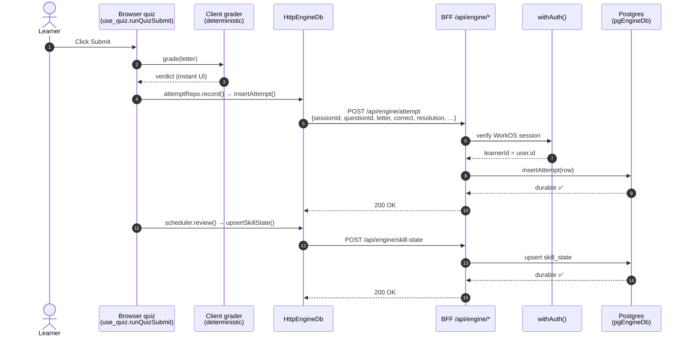
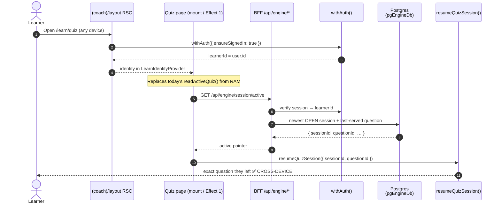
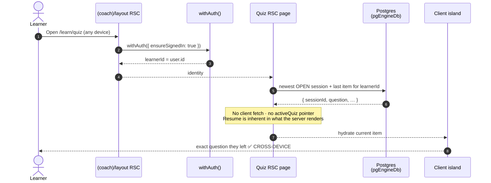
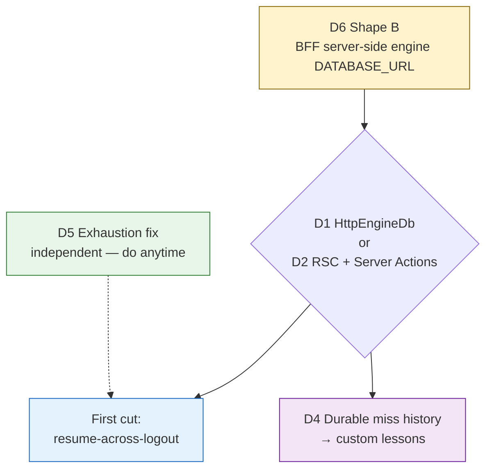

# Coach V3 — Durable Learner Progress (SDD Stage 1 Brainstorm / Architecture Design)

> **Status:** Brainstorm + architecture design, pending review.
> **Date:** 2026-07-22
> **Author:** Rajnish Khatri (with Claude)
> **Next gate:** Rajnish reviews this doc → decide **D1-now-D2-later vs direct-D2** → advance to `sdd-spec`.

---

## 1. The Ask (restated)

Save eng-coach **V3** learner progress so it is **durable and cross-device**:

1. **Resume mid-session across logout/login** — if the learner was on question 3, they return to question 3, not question 1.
2. **Resume an abandoned/interrupted session** — leaving practice (clicking into another option, navigating away) and coming back should pick up where they left off.
3. **Persist attempt history** — save every attempted question, and specifically flag **first-try misses**, so we can later generate **customized lessons** for a learner's weak spots.
4. **(Investigation)** Understand what happens today after the 30-question target — how the "next set" is presented.

**Hard requirement (Rajnish, 2026-07-22):** progress must survive across **different devices** — log in on another machine and resume where you left off.

---

## 2. Premise Audit (what's actually true in the repo)

The original ask contained a load-bearing premise that the evidence **refutes**.

| # | Premise | Status | Evidence |
|---|---|---|---|
| P1 | Resume position is lost on logout | ✅ verified (understated) | Resume pointer is a module-level `let activeQuiz` in JS heap — `frontend/components/quiz/quiz_session_store.ts:69`. Doc says "NOT persisted… two-tab/reload limitation." Lost on **any** full reload, not just logout. |
| P2 | There is somewhere durable to save attempts/misses | ❌ **REFUTED** | The prod quiz runs entirely on a **fresh `InMemoryEngineDb` per page load** — `frontend/lib/composition_engine_browser.ts:96,215-277`, `frontend/app/engine-provider.tsx:38-48`. Attempts, sessions, skill_state, misses **never leave the browser tab**. There is **no durable store at all** today. |
| P3 | Persistence must be built from scratch | ⚠️ partially refuted | The full Postgres layer is **already built**: `DrizzleAttemptRepo`/`SessionRepo`/`ProgressRepo`, migrations `0001–0003`, `AttemptRepo` port with `resolution: first_try \| coached \| walked_through`, and a `resumeQuizSession()` function (`frontend/components/quiz/use_quiz.ts:461`). It's wired **only to the server root** (`composition_engine.ts`, gated on `DATABASE_URL`) — which the learner-facing quiz never calls. |
| P4 | Something presents a "next 30" | ✅ verified — with a defect | Default `target_count = 30` (`drizzle_session_repo.ts:27`). At target, `progressVm.complete` flips → `QuizDoneBanner` + relabel to "Keep practising"/"See summary"; the **same session continues**. There is **no auto "next 30"**. When the unserved pool runs dry, `openQuizItem` **throws** (`use_quiz.ts:219,242,263`) → the page shows a raw error, not a graceful next batch. |

**Corrected framing:** This is **not** "move persistence to the right place." The learner-facing engine has **no durable persistence wired at all** — every requested capability is blocked on the *same single seam*: giving the browser quiz a durable, per-learner, cross-device `EngineDb` instead of `InMemoryEngineDb`. The entire repo/port/schema layer already exists behind that seam.

---

## 3. Locked Decisions (brainstorm gate)

| # | Decision | Rationale |
|---|---|---|
| DEC-1 | **Server Postgres** is the persistence home (not on-device SQLite) | Cross-device requirement — on-device is per-device and can't resume across machines. |
| DEC-2 | **Cross-device resume** is a hard requirement | Stated explicitly. `learnerId` = WorkOS `user.id`, stable across logout/login and machines. |
| DEC-3 | **First shippable cut = resume-across-logout** | Highest user-visible value; miss-history + exhaustion fix ride on the same seam. |
| DEC-4 | **D6 = Shape B** — BFF server-side holds the engine `DATABASE_URL` | The BFF `server_composition.ts` **already** does this for threads + coach markers. F-R9 forbids DB creds in the browser/edge bundle, **not** the Node server-side Route Handler. Shape A (proxy to Python) is the novel/heavier path (Python has zero engine REST surface; schema would need porting). |
| DEC-5 | **Prefetch = one-ahead lookahead** for adaptive mode; batch-of-N only for fixed-pool drill/review | Batch prefetch freezes FSRS adaptivity (Q4 chosen before Q3's answer is seen). One-ahead keeps adaptivity and still feels instant. |
| DEC-6 | **Save model = durable write on every submit** | Position never > 1 answer stale; readable cross-device by `learnerId`. Background-save (`visibilitychange`/`pagehide`) is a **bonus** for an unsubmitted on-screen selection only — unreliable events + can't feed cross-device, so not the primary net. |

**Responsiveness note (corrected):** "highly responsive per click" is **network-bound once server-side** — true of both D1 and D2. The real levers are **one-ahead lookahead** + **optimistic grade display** (the client grader is deterministic and matches the server), not batch prefetch.

---

## 4. Shared Foundation (both D1 and D2 depend on this)

- **The clean seam is `EngineDb`** — a single **~29-method** row-level interface (`frontend/lib/adapters/engine/db/engine_db.ts:53-187`). Every `Drizzle*Repo` and all of `use_quiz.ts` orchestration is written against it. Swap what implements it and everything above keeps working (exactly how they run on `InMemoryEngineDb` today).
- **`learnerId` = WorkOS `user.id`**, server-verified in the `(coach)` RSC layout (`frontend/app/(coach)/layout.tsx:24-32` → `resolve_learn_identity.ts:48-69`). Both designs **re-derive it server-side** and never trust a client-sent value.
- **Same Postgres instance, net-new 12 engine tables** (`schema.pg.ts`), disjoint from the Python-owned LangGraph checkpoint tables.
- **Durability is unproven today** either way — `pgEngineDb` is built but wired to nothing; `db-persistence-probe.spec` only proves the **threads** table. Proving engine persistence end-to-end is **net-new work regardless of D1/D2**.

---

## 5. Design D1 — HTTP-backed `EngineDb` behind the existing port bag

**One line:** The quiz stays client-driven, but its DB plug becomes an `HttpEngineDb` that calls a new `/api/engine/*` BFF Route Handler, which runs the real `pgEngineDb` server-side.

### 5.1 Actors

| Actor | Role | New / existing |
|---|---|---|
| Browser quiz page | Runs the reducer + orchestration (`use_quiz.ts`) as today | existing, ~unchanged |
| `HttpEngineDb` | Client adapter implementing the 29-method `EngineDb`; each method → one `fetch` to the BFF | **new** (1 class) |
| BFF `/api/engine/*` Route Handlers | Server-side; verify WorkOS session → derive `learnerId` → run `pgEngineDb` | **new** |
| `serverPortBag()` | Add `selectEngineDb(env)` next to `selectThreadRepo` | extend (1 line) |
| Postgres | The 12 engine tables | existing schema, newly wired |

### 5.2 Action workflow — submit an answer



### 5.3 Action workflow — resume on a different device



### 5.4 Changed vs. unchanged

- **New:** `HttpEngineDb` (1 class, 29 thin methods), `/api/engine/*` handlers, `selectEngineDb` in `serverPortBag`, a **durable "active session pointer"** read replacing the RAM-only `activeQuiz`.
- **Unchanged:** the 868-line quiz page, the reducer, coach drawer, hint ladders, all 13 repos, the other ~10 `useEngine()` screens.

### 5.5 SWOT

- **S:** smallest blast radius; reuses the `threads` Route-Handler pattern verbatim; ships resume fast; low regression risk; proves durability early.
- **W:** **chattiness** — 29 fine-grained methods can mean several round-trips per screen (mitigate with a few **coarse** hot-path endpoints, i.e. design the API D2-shaped); control flow stays in the browser → decoupling is real but **partial**.
- **O:** the coarse `/api/engine/*` endpoints become the groundwork D2's Server Actions inherit; the same handlers unblock D4 (miss history) + the exhaustion fix.
- **T:** if the API is left naively port-for-port, latency; the `pgEngineDb` durability is unproven and must be validated.

---

## 6. Design D2 — Server-owned engine via RSC + Server Actions

**One line:** The engine *runs* on the server. The browser holds only display state + interactions; every engine operation is a Server Action calling `pgEngineDb` directly.

### 6.1 Actors

| Actor | Role | New / existing |
|---|---|---|
| RSC quiz page | Server-renders the current item from server state; ships minimal JS | **rebuilt** |
| Client interaction island | Reducer / selection / coach drawer — the part that **must** stay client | **rebuilt (split out)** |
| Server Actions: `submitAnswer`, `nextItem`, `openSession`, `closeSession`, `resume` | Run server-side; call the engine directly | **new** |
| Server engine root `composition_engine.ts` | Already has the `DATABASE_URL → pgEngineDb` branch | existing |
| Postgres | Same 12 tables | existing schema, newly wired |

### 6.2 Action workflow — submit an answer

```mermaid
sequenceDiagram
    autonumber
    actor Learner
    participant Island as Client island<br/>(selection / coach drawer)
    participant Opt as Client grader<br/>(optimistic)
    participant SA as Server Action<br/>submitAnswer()
    participant Auth as withAuth()
    participant Eng as Server engine<br/>(grader + scheduler)
    participant PG as Postgres<br/>(pgEngineDb)
    participant RSC as Quiz RSC

    Learner->>Island: Click Submit
    Island->>Opt: grade(letter) — instant feel
    Opt-->>Island: optimistic verdict
    Island->>SA: submitAnswer(sessionId, questionId, letter)
    SA->>Auth: verify WorkOS session
    Auth-->>SA: learnerId = user.id
    rect rgb(240, 248, 255)
        Note over SA,PG: One server transaction
        SA->>Eng: grader.grade()
        Eng-->>SA: verdict
        SA->>PG: insertAttempt(...)
        PG-->>SA: durable ✅
        SA->>Eng: scheduler.review(attempt)
        Eng->>PG: upsert skill_state
        PG-->>Eng: durable ✅
    end
    SA-->>Island: { verdict, nextItem }
    SA->>RSC: revalidate
    Island-->>Learner: confirm verdict (server wins if mismatch)
```

### 6.3 Action workflow — resume on a different device



### 6.4 Changed vs. unchanged

- **New/rebuilt:** the quiz page split into RSC shell + client island; a set of coarse Server Actions; **every `useEngine()` screen** (dashboard, summary, progress, skill-detail, coach) re-shaped to read server state instead of the browser bag.
- **Unchanged:** the engine domain code itself (`pgEngineDb`, repos, scheduler) — it just runs server-side.

### 6.5 SWOT

- **S:** full data/UI decoupling; single server engine home; smaller client bundle; resume is inherent; one transaction boundary per submit; coarse API by nature (no chattiness).
- **W:** **~11-screen blast radius** centered on the hardest page (quiz = 33 hooks/effects + streaming coach drawer that must stay client → an intricate RSC/client seam right through it); slowest to resume; highest regression risk.
- **O:** every future coach feature simpler; forces a cleaner coarse engine API.
- **T:** scope creep on a rewrite this size (AGENTS.md "stop before expanding scope" / three-strikes gates bite here); the coach chat stays client regardless, so a client/server split is unavoidable — risk is it becomes messy under time pressure; new ADR-level seam.

---

## 7. Side-by-Side

| Axis | D1 (HttpEngineDb) | D2 (RSC + Server Actions) |
|---|---|---|
| Where the seam is cut | `EngineDb` (1 adapter) | Server Actions (coarse) + RSC render |
| Cross-device resume | ✅ server read of active session | ✅ server renders current state (inherent) |
| Data/UI decoupling | real, **partial** (control flow client) | **full** |
| Files changed | `HttpEngineDb` + `/api/engine/*` + 1 composition line | ~11 `useEngine()` screens + quiz split + Server Actions |
| Quiz page (868 lines) | ~untouched | large rebuild (hardest page) |
| Time to first resume | **fast** | slow |
| Regression risk | low | high |
| Client bundle | unchanged | smaller |
| Chattiness | needs coarse hot-path endpoints | none (coarse by nature) |
| D6 shape | **B** (BFF holds engine DB, like threads) | **B** (server engine root, `DATABASE_URL`) |
| Repo precedent | ✅ `threads` route + `server_composition` | partial (RSC exists; not for engine) |
| Reuses `pgEngineDb` as-is | ✅ | ✅ |
| ADR needed | light (new BFF route family) | yes (server-hosted engine seam) |

---

## 8. The Open Decision — D1-now-D2-later vs. direct-D2

The two are **on the same path**, and D1 is a genuine subset of D2's work **if D1's API is designed coarse (D2-shaped)**:

- D1's coarse `/api/engine/*` endpoints (bootstrap, submit, next, resume) are almost exactly D2's Server Actions. Migrating D1 → D2 later is mostly *moving where those handlers are called from* (Route Handler → Server Action) and thinning the client — **not a redo**.
- **Direct-D2** pays the full ~11-screen rebuild before any learner sees resume and concentrates risk in the hardest page up front.
- **D1-now** ships cross-device resume fast on a proven pattern, proves engine-persistence durability early, and leaves a coarse API D2 later inherits.

**Recommendation:** **D1 now with a deliberately coarse, D2-shaped API → D2 as a later refactor**, once persistence is proven and the miss-history/exhaustion tracks land.

**What would tip to direct-D2:** if the ~11-screen client/server split is considered unavoidable soon anyway (bundle size / coupling pain), paying it once is cleaner than D1-then-D2.

---

## 9. Follow-on Tracks (ride on either design)

- **D4 — durable attempt + first-miss history for custom lessons.** The `attempt` table already carries `correct`, `resolution` (`first_try`/`coached`/`walked_through`), `used_hint`, `misconception`. Once writes are durable, **"failed first try"** is a **read projection** (`resolution != 'first_try'`, or `AttemptRepo.misses()`) — no new schema. Custom-lesson *generation* (if LLM-backed) is a separate future epic needing an ADR; miss *selection* stays deterministic per the demand-side default.
- **D5 — 30-question exhaustion fix (zero-risk hygiene, do regardless).** Today `openQuizItem` **throws** when the pool runs dry → raw error. Should degrade to a graceful done-state / "you've cleared the bank." Independent of persistence; own small branch.

---

## 10. Dependency Structure



---

## 11. Open Questions for Review

1. **D1-now-D2-later vs. direct-D2** — the load-bearing choice (§8).
2. **Coarse endpoint set** — if D1, agree the hot-path coarse endpoints up front (e.g. `GET /api/engine/quiz/bootstrap`, `POST /api/engine/attempt`, `GET /api/engine/next`, `GET /api/engine/session/active`) so it's D2-shaped from day 1.
3. **Active-session semantics** — when is a session considered "resumable"? (Newest session with `ended_at IS NULL`? A max-age cutoff so a 3-week-old open session doesn't resume?)
4. **In-progress selection persistence** — is persisting an *unsubmitted* on-screen selection (the background-save bonus) in scope for the first cut, or deferred?

---

## 12. Evidence Index (file:line)

- Ephemeral engine: `frontend/lib/composition_engine_browser.ts:96,215-277`; `frontend/app/engine-provider.tsx:38-48`
- RAM resume pointer: `frontend/components/quiz/quiz_session_store.ts:53-111`; consumed `frontend/app/(coach)/learn/quiz/page.tsx:158-246,281-314`
- `resumeQuizSession` (exists): `frontend/components/quiz/use_quiz.ts:461-474`
- The seam — `EngineDb` (29 methods): `frontend/lib/adapters/engine/db/engine_db.ts:53-187`
- Server engine root + `selectEngineDb`: `frontend/lib/composition_engine.ts:102-153`; `pgEngineDb` node-pg: `frontend/lib/adapters/engine/db/drizzle_engine_db.ts:42-43,269-280`
- BFF already holds `DATABASE_URL` server-side (Shape B precedent): `frontend/lib/bff/server_composition.ts:42-77`
- Engine-CRUD Route Handler precedent: `frontend/app/api/threads/route.ts`; non-streaming POST: `frontend/app/api/coach/session-marker/route.ts`
- `learnerId` = WorkOS `user.id`, server-verified: `frontend/app/(coach)/layout.tsx:24-32`; `frontend/lib/learn/resolve_learn_identity.ts:48-69`
- 30-q target + done-state: `frontend/lib/adapters/engine/repos/drizzle_session_repo.ts:27`; `frontend/components/quiz/QuizDoneBanner.tsx`; relabel `frontend/app/(coach)/learn/quiz/page.tsx:607-632`
- Exhaustion throw: `frontend/components/quiz/use_quiz.ts:219,242,263`
- Attempt `resolution` (first-try miss signal): `frontend/drizzle/0003_add_attempt_resolution.sql`; `frontend/lib/ports/engine/attempt_repo.ts:9-45`
- Infra gap (no `DATABASE_URL` on frontend Cloud Run yet): `infra/gcp/cloud-run-frontend.tf:83-121`; backend has it: `infra/gcp/cloud-run-backend.tf:257-260`
- Python backend routes (no engine REST surface today): `middleware/app_prod.py:416-747`
