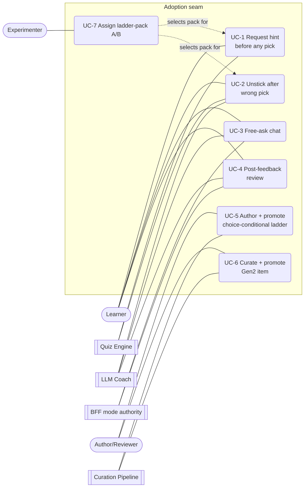
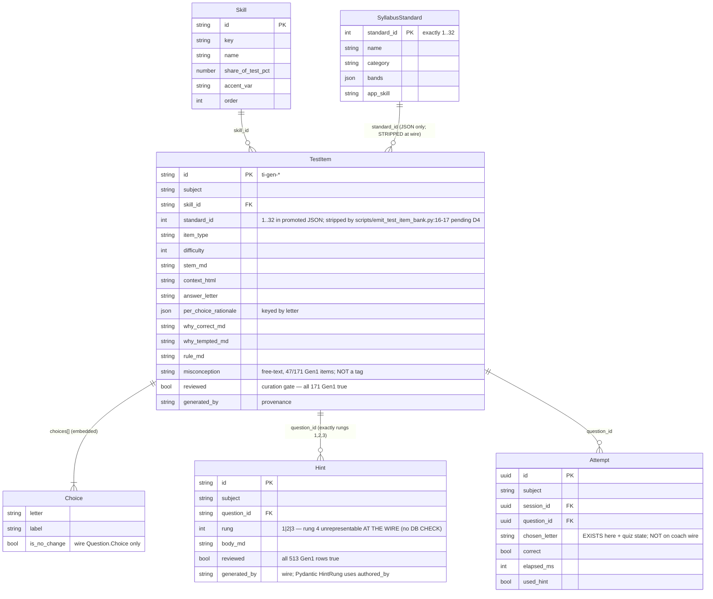
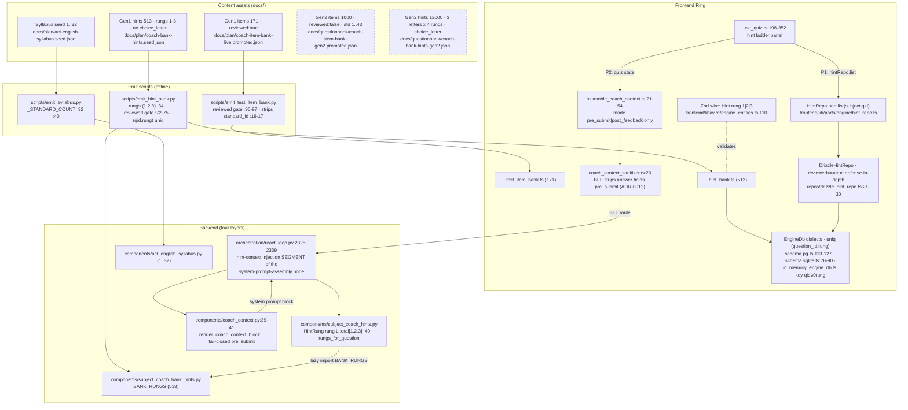
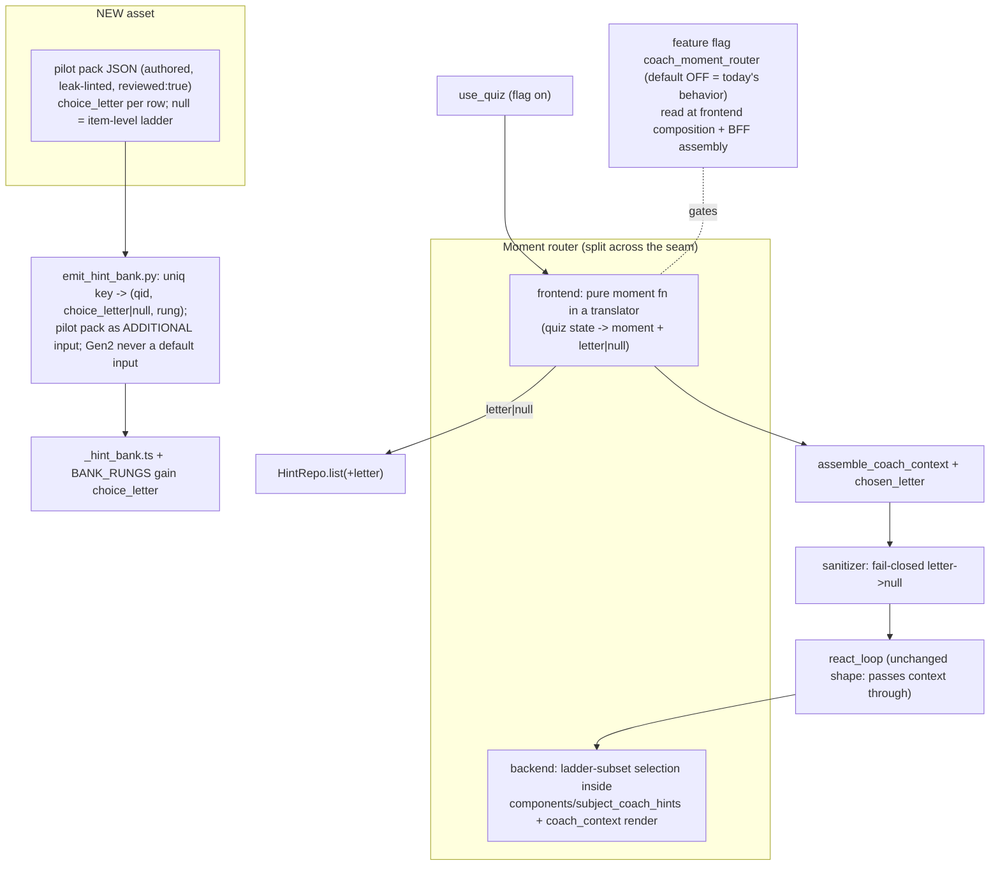

# Eng-coach Gen2 / v2 adoption — validated baseline + architecture models

> **What this is.** The grounding pass the session doc asked for before Phase 0:
> (a) every current-state claim in
> [eng-coach-gen2-v2-adoption.session.md](eng-coach-gen2-v2-adoption.session.md) §2
> validated against the tree; (b) the four adoption-seam architecture artifacts
> (use case model → domain model → component model → Phase-1 LLD); (c) a 30-item
> quality probe of the Gen2 bank with a go/no-go on the full
> `llm-eval-grounded-theory` exploration. **Scope = adoption seam only** (bank,
> hints, emit, wire, serve paths, coach context, moment routing, curation gates).
>
> **Method.** Data-plane claims re-derived with deterministic `jq` checks; runtime
> claims mapped by a read-only repo sweep; the four artifacts drafted by
> independent agents and then **adversarially verified** by a second set of agents
> that re-opened every cited file (8 corrections applied, 2 of them major — see
> §1.3); Gen2 quality probed by 3 agents × 10 items on deterministic sample
> indices with a solve-before-reveal protocol.

---

## 1. Baseline validation report

### 1.1 Verdict — session-doc §2 is accurate

Every checkable claim in the session doc's "Current state" section verified true:

| Claim (session doc §2) | Result | Evidence |
|---|---|---|
| Gen1: 171 items / 513 hints, all `reviewed:true` | ✅ exact | `jq` over `docs/plan/coach-item-bank-live.promoted.json` + `coach-bank-hints.seed.json` |
| Ladder exactly rungs 1–3 per item; no `choice_letter` | ✅ 171/171 have exactly {1,2,3}; 0 rows carry `choice_letter` | same |
| `misconception` free-text on 47/171 | ✅ exactly 47 | same |
| Emits: 171 / 513 frontend, 513 backend | ✅ | `_test_item_bank.ts`, `_hint_bank.ts`, `subject_coach_bank_hints.py` (513 `HintRung`) |
| Wire rung = `1\|2\|3` only; serve paths reviewed-only | ✅ | Zod `engine_entities.ts:110`; Pydantic `subject_coach_hints.py:40`; gates in §1.2-F-V0 below |
| Gen2: 1000 items / 12000 hints, all `reviewed:false`, `choice_letter` on every hint, 12 = 3×4 per item | ✅ exact (1000/1000 items have exactly 3 letters × 4 rungs) | `jq` over `docs/questionbank/coach-*-gen2*.json` |
| Gen2 item-level `misconception` missing | ✅ key absent on all 1000 | same |
| Standards 33–43 present in Gen2; live syllabus max 32 | ✅ (see F-V2 for magnitude) | `jq`; `act_english_syllabus.py`; `emit_syllabus.py:40` |
| Zero Gen1×Gen2 ID overlap; §3.2 pilot IDs are Gen1-only | ✅ 0 overlap; 5/5 in Gen1 | `comm` over sorted id sets |
| Zero Gen2 code wiring | ✅ no reference outside `docs/` | repo-wide sweep |

### 1.2 Findings beyond the session doc

- **F-V0 — reviewed gate is defense-in-depth × 3, uniqueness × 5.** `reviewed:true`
  is enforced at emit (`emit_test_item_bank.py:96-97`, `emit_hint_bank.py:72-75`
  hard-fail), at the frontend repo (`drizzle_hint_repo.ts:21-30`), and at the
  backend component (`rungs_for_question`). Hint uniqueness `(question_id, rung)`
  is enforced at five sites: emit seen-set, Zod, Pydantic, PG + SQLite unique
  indexes, in-memory map key. Any P1.4 change must move all sites together.
- **F-V1 — the moment router is a NEW wire field, not a refactor.** The coach wire
  carries only binary `mode: "pre_submit"|"post_feedback"`
  (`coach_context_sanitizer.ts:20`, `assemble_coach_context.ts:21-54`,
  `state.py:250`) — no selected letter anywhere. The letter already exists in quiz
  state (`quiz_screen_reducer.ts:66`) and on the `attempt` table
  (`chosen_letter`), so it is carry-not-invent — but it crosses translator →
  sanitizer → state → prompt formatter end-to-end.
- **F-V2 — blocker B5 is bigger than it reads.** 388/1000 Gen2 items (39%) sit on
  standards 33–43, and `standard_id` is deliberately **stripped from the item wire
  type** pending "D4" (`emit_test_item_bank.py:16-17`) — extending the syllabus
  seed alone does not sequence those items; the wire gap is upstream of B5.
- **F-V3 — Gen2 rung 4 is a rule-assertion, not an answer reveal** ("states the
  rule but never the key" — QA report). This softens the P0.4 conflict with
  ADR-0012's no-assertion stance, **but** see the probe's P1 pattern (§6): on
  structural item types the rule often uniquely identifies the key anyway.
- **F-V4 — independent leak scan: 10/12000 Gen2 hints quote their item's
  correct-answer label verbatim** (≥8-char labels, 882 scannable items). On
  inspection most are benign (redundancy/ordering items where discussing the kept
  word *is* the pedagogy); 2–3 are borderline steering at low rungs. No hard
  violations — but concrete proof the shipped validators are
  necessary-not-sufficient, i.e. F1's human-review gate stands.
- **F-V5 — pre-existing in-memory key mismatch.** `InMemoryEngineDb` has two
  differently-keyed hint write paths on the same Map: `seedHints` (:58-60, NUL
  separator, silent overwrite — the path the emitted bank loads through) vs
  `insertHint` (:151-159, space separator, throws). The namespaces never collide,
  so the dup guard cannot see seeded rows. Phase-1 T2 unifies them (see §5).
- **F-V6 — un-recorded Phase-1 scope decision (free-ask × letter-keyed rows).**
  If letter-keyed pilot rows are emitted into `BANK_RUNGS`, `rungs_for_question`
  (keyed by `question_id` only) hands the free-ask LLM coach rungs for **all
  three wrong letters** — duplicate rung numbers under a "select the ONE rung"
  prompt. The session doc's P1.5/P1.6 do not decide this. Options in §2 (UC-3)
  and §5 (T5); proposed as a new Phase-0 lock (§7).

### 1.3 Verification corrections applied to the artifacts

The adversarial pass surfaced 8 issues (2 major), all folded into the artifacts
below: the two majors were (a) a claimed `coach_context → subject_coach_hints`
import edge that does not exist — the real seam passes `model_dump()` dicts
through orchestration precisely to honor invariant 5; and (b) the `seedHints`
silent-overwrite path (F-V5), which a naive T2 re-key would have missed while its
tests stayed green.

---

## 2. Use case model

**Scope:** adoption seam only — bank, hints, emit, wire schemas, serve paths, coach context, moment routing, curation gates. FSRS/sessions/progress/auth/layout are out of scope, except the Direction 2b constraint that **layout never chooses ladder ontology** (`docs/plan/eng-coach-gen2-v2-adoption.session.md` §3.1).
**Status:** AS-IS sections are verified against the tree; TO-BE sections are the **Phase 1 target** from the session doc (Path A, recommended, **not human-locked** — §5, P0.7) and do not exist in code.

---

### 1. Actor inventory

| Actor | Kind | Evidence (AS-IS) |
|---|---|---|
| **Learner** | Human, primary | Consumes both serve paths on `/learn` (`frontend/components/quiz/use_quiz.ts:198-352`; `orchestration/react_loop.py:2325-2339`). |
| **Quiz Engine** | System | Deterministic no-LLM hint path: `use_quiz.ts` → `hintRepo.list` → `frontend/lib/adapters/engine/drizzle_hint_repo.ts:21-30` (`reviewed===true` filter); persists `chosen_letter` on the attempt table (both dialects). |
| **LLM Coach** | System | ADR-0012 select-and-paraphrase coach: `react_loop.py:2325-2339` → `components/subject_coach_hints.rungs_for_question` → `components/coach_context.py`. |
| **BFF mode authority** | System, supporting | Derives authoritative `pre_submit`/`post_feedback` from the coach-session marker store; client `mode` is advisory-only (`docs/adr/0012-…` Amendment 2026-07-02; `components/coach_context.py:39-41` fail-closed to `pre_submit`). |
| **Content Author / Reviewer** | Human | Only human able to flip `reviewed:true` — the hard emit gate (`scripts/emit_test_item_bank.py:96-97`; `scripts/emit_hint_bank.py:72-75`). Gen1 corpus is fully reviewed; Gen2 is 0% reviewed. |
| **Curation Pipeline** | System | Emit scripts + validators: `emit_hint_bank.py` (`_VALID_RUNGS=(1,2,3)`:34, `(question_id,rung)` uniqueness), `emit_test_item_bank.py`, `scripts/emit_syllabus.py:40` (`_STANDARD_COUNT=32`); Gen2 QA validator gates (`docs/questionbank/coach-bank-gen2-qa-report.md` — 40/40 shards, dedup, leak lint, zero human review). |
| **Experimenter (A/B)** | Human | TO-BE only — no A/B assignment machinery exists at the seam today. Defined by P0.6 metrics + P1.10 (session doc). |

---

### 2. Use-case diagram

---

### 3. Use cases

#### UC-1 — Request hint before any pick · moment: **no-pick**
- **Actors:** Learner, Quiz Engine.
- **Trigger:** Learner opens the hint panel with no choice selected.
- **Preconditions:** Item served from the reviewed Gen1 bank (`frontend/lib/adapters/engine/_test_item_bank.ts`, 171 items).
- **AS-IS (verified):** `use_quiz.ts:198-352` → `hintRepo.list` → `drizzle_hint_repo.ts:21-30` returns the item-level ladder — exactly rungs 1–3, no `choice_letter` field exists anywhere in the bank (`docs/plan/coach-bank-hints.seed.json`, 513 rows), rung 4 unrepresentable at the wire (`frontend/lib/wire/engine_entities.ts:110`; `components/subject_coach_hints.py:40`).
- **TO-BE (Phase 1):** Feature-flagged moment router (P1.6, P1.8): no trusted letter → serve the **null-letter** item-level 3-rung ladder. Same content, now addressed as `(question_id, choice_letter=null, rung)` per the P0.5 uniqueness lock.
- **Data:** reads hint rows (`reviewed:true` only); writes nothing at the seam.

#### UC-2 — Unstick after wrong pick · moment: **wrong-pick**
- **Actors:** Learner, Quiz Engine; LLM Coach when invoked.
- **Trigger:** Learner has selected/submitted a wrong letter and asks for help.
- **Preconditions:** A chosen letter exists in quiz state (persisted as `chosen_letter` on the attempt table, both dialects).
- **AS-IS (verified):** No choice-conditionality anywhere. The hint ladder is the **same item-level rungs 1–3 regardless of which letter was chosen** (no `choice_letter` in bank or schema; DB uniqueness is `(question_id, rung)` — `schema.pg.ts:113-127`, `schema.sqlite.ts:76-90`, `in_memory_engine_db.ts` ~140-156). The coach wire carries **no selected-letter field** — `coach_context` is mode-only (`frontend/lib/translators/coach_context_sanitizer.ts:20`, `assemble_coach_context.ts:21-54`, `orchestration/state.py:250`), so the LLM coach cannot condition on the wrong letter even though the letter exists client-side.
- **TO-BE (Phase 1):** Moment router reads the trusted wrong letter → serves that letter's authored **choice-conditional ladder** (pump→hint→prompt shape; assertion only if P0.4 amends ADR-0012, and then post-feedback only). Requires P1.4 schema work: optional `choice_letter` in Zod + Pydantic + both DB dialects; uniqueness migrated to `(question_id, choice_letter|null, rung)`.
- **Data:** reads chosen letter from quiz state; reads letter-keyed hint rows (`reviewed:true` only); writes nothing new at the seam.

#### UC-3 — Free-ask chat · moment: **free-ask**
- **Actors:** Learner, LLM Coach, BFF mode authority.
- **Trigger:** Learner types a question in the composer.
- **Preconditions:** Coach run reachable; BFF marker store determines mode.
- **AS-IS (verified):** ADR-0012 contract: `react_loop.py:2325-2339` merges `AUTHORED_RUNGS + BANK_RUNGS` (reviewed only, sorted) via `rungs_for_question`; `render_coach_context_block` appends them to the system prompt; the LLM must "select the ONE rung … and paraphrase it — never invent". `pre_submit` strips the four answer-bearing fields server-side; unknown mode fails closed to `pre_submit` (`coach_context.py:39-41`).
- **TO-BE (Phase 1):** **Same LLM coach on all surfaces** under ADR-0012 (session doc §3.1); composer unchanged (P1.6). The free-ask coach stays **letter-blind** in Phase 1 — the coach wire carries no selected letter, and P1.4 covers the hint schema only, not the coach-context wire. ⚠️ **Open P1.5/P1.6 scope decision (surfaced by verification, not in the session doc):** if letter-keyed pilot rows are emitted into `BANK_RUNGS`, `rungs_for_question` (keyed by `question_id`, merged + sorted by rung) would hand this coach rungs for **all three wrong letters** — duplicate rung numbers under a "select the ONE rung" prompt. Either scope the pilot emit to the quiz-engine path only (UC-3 stays strictly unchanged), or extend the coach wire with the letter (then UC-3 is CHANGED and the LLD's T5 applies).
- **Data:** reads question context (mode-stripped), reviewed rungs, marker store; writes coach run/trace.

#### UC-4 — Post-feedback review · moment: **post-feedback**
- **Actors:** Learner, LLM Coach, BFF mode authority.
- **Trigger:** Learner asks the coach from a surface where the answer is already rendered.
- **Preconditions:** Submit marker present for the item (monotonic; ADR-0012 Amendment §1).
- **AS-IS (verified):** Derived mode `post_feedback` → full `Question` context (answer + rationales) injected; leakage moot by construction (ADR-0012 Decision §2). No assertion rung exists — deliberately unrepresentable at both schema sites.
- **TO-BE (Phase 1):** Mechanism unchanged. **Conditional:** if P0.4 amends ADR-0012, rung-4/assertion becomes servable **post-feedback only, never pre-submit** — requires extending the rung literal (P1.4) and an explicit ADR amendment, not a silent emit (session doc §2.3).
- **Data:** reads full question context + marker; writes coach run/trace.

#### UC-5 — Author + promote a choice-conditional ladder · moment: fuels **wrong-pick**
- **Actors:** Content Author/Reviewer, Curation Pipeline.
- **Trigger:** Phase 1 pilot pack authoring (P1.1: the 5 Gen1 IDs in session doc §3.2, optionally →20-50).
- **Preconditions:** Phase 0 human lock (P0.7); P1.4 schema work landed.
- **AS-IS (verified):** No authoring path for choice-conditional rungs exists — `emit_hint_bank.py` rejects anything outside rungs 1-3 (`_VALID_RUNGS`:34) and enforces `(question_id, rung)` uniqueness; the only per-letter pedagogy source material is item fields `per_choice_rationale` / `why_tempted_md` / free-text `misconception` (47/171 items).
- **TO-BE (Phase 1):** Author pump→hint→prompt per wrong letter from those Gen1 fields (P1.2); run leak lint on every rung (P1.3, cf. `leaks()` — `research/eng_coach_v2_pedagogy_spec.md` §4.5); human review flips `reviewed:true`; emit the pilot pack via a path that is **not** pointed at Gen2 JSON (P1.5); arch tests guard reviewed-only serve + new uniqueness (P1.9).
- **Data:** writes new hint rows keyed `(question_id, choice_letter, rung)`; reads Gen1 item fields; emit regenerates `_hint_bank.ts` + `subject_coach_bank_hints.py`.

#### UC-6 — Curate + promote a Gen2 item · moment: fuels all (Phase 2, **not Phase 1**)
- **Actors:** Content Author/Reviewer, Curation Pipeline.
- **Trigger:** Phase 2 batch curation, only after the P1.11 lift gate.
- **Preconditions:** Hard blockers B1-B5 cleared (session doc §7): reviewed gate, `choice_letter` schema, assertion policy, emit inputs, syllabus coverage.
- **AS-IS (verified):** Gen2 has **zero code wiring**. 1000 items all `reviewed:false`, no `misconception` key, `standard_id` 1..43 with 388/1000 on standards 33-43 the live syllabus does not cover (`components/act_english_syllabus.py` hard-codes 1..32; `emit_syllabus.py:40`). 12000 hints (`docs/questionbank/coach-bank-hints-gen2.json`): 3 wrong letters × 4 rungs, `choice_letter` on every row, all `reviewed:false` — currently rejected by every gate (emit rung whitelist, reviewed gates, wire literals, DB uniqueness). Validator-passed, zero human review (QA report).
- **TO-BE (Phase 2):** Human review per item + its 12 hints, re-run leak checks, flip `reviewed` per row (P2.4); syllabus extension for standards 33-43 first (P2.3); promote in 25-50 batches through the existing emit (P2.5); zero unreviewed rows in emit inputs at batch exit (P2.7).
- **Data:** reads Gen2 candidate corpus under `docs/questionbank/`; writes reviewed flags, syllabus seed extension, promoted bank rows.

#### UC-7 — Assign ladder-pack A/B · moment: meta (selects the ladder for UC-1/UC-2)
- **Actors:** Experimenter, Quiz Engine.
- **Trigger:** Phase 1 dogfood → student A/B (P1.10).
- **Preconditions:** Pilot pack live behind the feature flag; P0.6 metrics locked (first-rechoose accuracy, time-to-correct, nudge count, felt-helpful, leak incidents).
- **AS-IS (verified):** Does not exist — no assignment machinery at the seam; one ladder pack per item.
- **TO-BE (Phase 1):** Randomize the **ladder pack only** — same items, same wrong options; assignment must never use viewport/device (explicitly rejected, session doc §6, per Direction 2b parity). Outcome gates Phase 2 (P1.11).
- **Data:** writes assignment + outcome metrics; reads nothing answer-bearing.

---

### 4. Phase 1 delta table

| UC | Delta | Why |
|---|---|---|
| UC-1 no-pick hint | **CHANGED** (shape only) | Same 3-rung content; re-keyed as `choice_letter=null` under the router + flag. |
| UC-2 wrong-pick unstick | **CHANGED** (core of Phase 1) | Item-level ladder → letter-conditional ladder; schema/wire/DB gain `choice_letter`; router reads the trusted letter. |
| UC-3 free-ask chat | **UNCHANGED** (contingent) | Same ADR-0012 coach on all surfaces; composer untouched (P1.6). Unchanged **only if** the pilot emit is scoped away from `BANK_RUNGS` — see the UC-3 note; otherwise the duplicate-rung merge must be resolved and UC-3 is CHANGED. |
| UC-4 post-feedback review | **UNCHANGED** (conditional) | Mechanism intact; assertion rung only if P0.4 ADR amendment lands, post-feedback only. |
| UC-5 author ladder | **NEW** | First choice-conditional authoring + leak-lint + review + pilot emit path. |
| UC-6 curate Gen2 | **NEW — deferred to Phase 2** | Explicitly excluded from Phase 1 ("no Gen2 emit"); blocked on B1-B5. |
| UC-7 ladder-pack A/B | **NEW** | Pack-randomized experiment; no prior machinery. |

---

## 3. Domain model

Grounds: `docs/plan/eng-coach-gen2-v2-adoption.session.md` (Path A, not yet human-locked) · `docs/adr/0012-subject-coach-context-contract-hint-ladder.md` · `research/eng_coach_v2_pedagogy_spec.md` (§3 Axis B, §4 Axis A). Scope = adoption seam only (bank, hints, emit, wire, serve paths, coach context, moment routing, curation gates). FSRS/sessions/progress/auth out of scope; layout appears only as the Direction 2b parity constraint.

---

### 1. AS-IS entity model (verified)

**Plane note (correction from verification).** The diagram above is the **seed/wire-plane** view: `Hint.question_id` and `Attempt.question_id` reference `ti-gen-*` string ids only on the in-memory/bank path (ADR-0021 `TestItemQuestionRepo` serves bank items as quiz questions). In the **pg persistence plane**, `hint.question_id` (`schema.pg.ts:118-120`) and `attempt.question_id` (`schema.pg.ts:218-220`) are `uuid` FKs referencing the separate `question` table, and `test_item` is deliberately a separate table (`schema.pg.ts:130` comment). This matters for the §4 re-key work: the emit seen-set keys on `ti-gen-*` ids while the pg unique index keys on uuids — the two gates guard different planes of the same invariant.

AS-IS citations (all verified): items `docs/plan/coach-item-bank-live.promoted.json` (171); hints `docs/plan/coach-bank-hints.seed.json` (513 = 171×3, no `choice_letter`); wire `frontend/lib/wire/engine_entities.ts:110` (Zod rung `1|2|3`), Pydantic `components/subject_coach_hints.py:40` (`Literal[1,2,3]`; fields `question_id, rung, body_md, reviewed, authored_by`); Attempt `frontend/lib/adapters/engine/db/schema.pg.ts:212-228`; Skill `frontend/lib/wire/engine_entities.ts:33-43`; SyllabusStandard `components/act_english_syllabus.py` (`ActEnglishStandard`, hard-coded 1..32; `scripts/emit_syllabus.py:40` `_STANDARD_COUNT=32`).

**Serve paths (AS-IS).** (1) Quiz UI direct, no LLM: `frontend/components/quiz/use_quiz.ts:198-352` → `hintRepo.list` → `drizzle_hint_repo.ts:21-30` (defense-in-depth `reviewed===true` filter). (2) LLM coach under ADR-0012: `orchestration/react_loop.py:2325-2339` → `components/subject_coach_hints.rungs_for_question` (AUTHORED_RUNGS+BANK_RUNGS merged, reviewed-only, sorted) → `components/coach_context.py` → system prompt ("select the ONE rung … never invent"). Coach wire carries **mode only** (`pre_submit|post_feedback`): `frontend/lib/translators/coach_context_sanitizer.ts:20`, `assemble_coach_context.ts:21-54`, `orchestration/state.py:250`, `components/coach_context.py:39-41` (fail-closed → `pre_submit`). No selected-letter field exists on the coach wire.

**Gen2 corpus (AS-IS, on disk, zero wiring).** `docs/questionbank/coach-item-bank-gen2.promoted.json` — 1000 items, all `reviewed:false`, **no** `misconception` key, `standard_id` 1..43 (388 items on 33–43, uncovered by the live syllabus). `docs/questionbank/coach-bank-hints-gen2.json` — 12000 hints = 3 wrong letters × 4 rungs per item, `choice_letter` on every row, rung 4 = assertion ("states the rule but never the key", per `docs/questionbank/coach-bank-gen2-qa-report.md`). Zero ID overlap with Gen1.

---

### 2. TO-BE deltas — Phase 1 target (nothing below exists yet)

| Delta | Target shape | Notes |
|---|---|---|
| `Hint.choice_letter` | nullable `'A'..'D' \| null`; **null = item-level (Moment-1) ladder**, non-null = choice-conditional ladder for that wrong letter | P0.5 lock; Gen2 hint rows already carry the field |
| Rung domain | stays `1..3` **unless P0.4 amends ADR-0012**; if amended, `1..4` with rung 4 (assertion) post-feedback-only — never pre-submit (ADR-0012's recorded decision trigger) | must change all four representation sites in §3 row 1 together |
| Uniqueness | `(question_id, rung)` → `(question_id, choice_letter \| null, rung)` | all five sites in §3 row 2; see §4 gotcha |
| Coach wire | wrong-pick moment needs the submitted letter to reach ladder selection; today it lives only in quiz state + `attempt.chosen_letter`. Fail-closed: letter absent → item-level (null) ladder | extends the ADR-0012 sanitizer/assembler contract, not a bypass of it |
| Moment router | behavior, not an entity: no-pick → null-letter 3-rung; wrong-pick → that letter's ladder; free-ask → LLM coach under ADR-0012 on **all** surfaces; skill → dose knobs only. Feature-flagged (P1.8). Layout NEVER selects ladder ontology (Direction 2b parity, session doc F4) | |
| Fuel | authored choice-conditional ladders on 5–20 **reviewed Gen1** stems (session doc §3.2 IDs); **no Gen2 emit** | Gen2 promote is Phase 2 (human review, batch, syllabus 33–43 = blocker B5) |

**Phase 3 — DESIGN-ONLY (spec'd in `research/eng_coach_v2_pedagogy_spec.md` §3.3; zero code, zero data):**
- `MisconceptionTag` — kebab id string (~16 locked tags, P3.1).
- `MiscEntry` — `{label, pump, hint, prompt, assertion}` with `{underline}`/`{choice}` template slots; `pump/hint/prompt` must pass `leaks()` (DATA-7), `assertion` may reveal (DATA-8).
- `MiscLibrary` — `Record<MisconceptionTag, MiscEntry>`; `Choice.tag` on every non-correct choice (DATA-4) + deterministic `classify(wrongLetter) → tag`.
- Not to be confused with Gen1's free-text `misconception` (47/171) or Gen2's inline per-(item, letter) bodies — session doc F7 forbids faking tags from either.

---

### 3. Invariants table

| # | Invariant (AS-IS) | Enforced today at | Phase-1 change |
|---|---|---|---|
| 1 | Hint rung ∈ {1,2,3}; assertion (4) unrepresentable **at the wire** | Zod `engine_entities.ts:110` · Pydantic `subject_coach_hints.py:40` · emit `scripts/emit_hint_bank.py:34` (`_VALID_RUNGS`). DB: **documentation-only** — `rung` is a plain integer column, no CHECK constraint in either dialect; a rung-4 row IS representable at the DB layer | Pending P0.4. If ADR-0012 amended: widen the three enforcing sites **together** + serve-rule "rung 4 post-feedback only"; if not: Gen2 rung-4 rows dropped/quarantined at promote. A DB backstop would be a NEW CHECK constraint, not an existing site |
| 2 | Hint uniqueness `(question_id, rung)` — **five sites** | (1) `scripts/emit_hint_bank.py:80-85` seen-set hard-fail · (2) `schema.pg.ts:126` `uniqueIndex("hint_question_rung_uq")` · (3) `schema.sqlite.ts:89` same index · (4) `in_memory_engine_db.ts:152-155` Map key throw · (5) port contract `engine_db.ts:88` (surfaced via `drizzle_engine_db.ts:355` insert path) | Re-key every site to `(question_id, choice_letter\|null, rung)`; §4 decides the null encoding. In-memory Map key gains a letter segment; emit seen-set gains the letter |
| 3 | `reviewed:false` never reaches a learner | emit `scripts/emit_test_item_bank.py:96-97` + `emit_hint_bank.py:72-75` hard-fail · repo filter `drizzle_hint_repo.ts:21-30` · component filter `rungs_for_question` (`subject_coach_hints.py`, reviewed-only) | **Unchanged** (blocker B1). Phase 1 pilot ladders flip `reviewed:true` only after human pass + leak lint (P1.3); arch test adds serve-path never-loads-unreviewed (P1.9) |
| 4 | Coach context is mode-only; no learner letter on the coach wire | `coach_context_sanitizer.ts:20` · `assemble_coach_context.ts:21-54` · `state.py:250` · `coach_context.py:39-41` fail-closed | Add optional chosen-letter carrier for the wrong-pick moment; fail-closed to null-letter ladder; pre-submit four-field exclusion (ADR-0012) untouched |
| 5 | Wire `TestItem` has no `standard_id`; syllabus = exactly 1..32 | strip at `emit_test_item_bank.py:16-17` (pending "D4") · `act_english_syllabus.py` hard-coded · `emit_syllabus.py:40` | Unchanged in Phase 1. Phase 2 blocker B5: extend syllabus seed before any standard-33..43 item sequences (388/1000 Gen2 items affected) |
| 6 | Layering: components framework-agnostic; orchestration nodes thin | `tests/architecture/` | Moment router logic lands in `components/` (or frontend quiz state), never in `orchestration/react_loop.py` beyond a thin call |

---

### 4. Gotcha — nullable column inside a unique index

Postgres treats `NULL` as distinct in unique indexes: `UNIQUE (question_id, choice_letter, rung)` would allow **unlimited duplicate item-level rungs** (`choice_letter IS NULL`). SQLite has the same NULL-distinct behavior. Options:

| Option | Postgres | SQLite parity | Verdict |
|---|---|---|---|
| `NULLS NOT DISTINCT` (PG15+) | one clean index | **Not supported** → dialects diverge | Reject unless SQLite side mirrored another way |
| **Two partial indexes**: `UNIQUE(question_id, rung) WHERE choice_letter IS NULL` + `UNIQUE(question_id, choice_letter, rung) WHERE choice_letter IS NOT NULL` | supported | supported (SQLite partial indexes) | Cleanest true-null model; two indexes to keep in lockstep across both `schema.*.ts` |
| **Sentinel** (`choice_letter NOT NULL`, e.g. `''` = item-level) | one index | identical | Simplest cross-dialect; sentinel MUST NOT leak past the adapter — wire Zod/Pydantic stay `nullable`. Note the in-memory adapter is already sentinel-shaped (string Map key) |
| App-level check only (adapters enforce) | no DB guarantee | no DB guarantee | Weakest — loses the DB backstop that exists today; reject |

Whichever wins, **all five §3-row-2 sites move in one change** (P1.4), and the emit-script seen-set must encode null the same way the DB does — otherwise the emit gate and the DB gate disagree on what a duplicate is.

---

### 5. Vocabulary (the session doc's naming trap, §2.3/F7)

| Term | Is | Is NOT |
|---|---|---|
| **Gen2 bank** | The unreviewed corpus on disk: 1000 items + 12000 choice-conditional hints under `docs/questionbank/` (fuel, candidate pool) | The v2 engine; shippable content (all `reviewed:false`); wired anywhere |
| **v2 pedagogy** | `research/eng_coach_v2_pedagogy_spec.md`: Axis A runtime (classify→verify→escalate, pump→hint→prompt→assertion, `leaks()` guard) + Axis B fuel (tagged distractors + MiscLibrary) | The Gen2 bank (Gen2 ≈ large choice-conditional corpus, no tags, no engine) |
| **MiscLibrary** | Phase-3 DESIGN-ONLY shared rung text keyed by `MisconceptionTag`, filled per-item via template slots | Gen1's free-text `misconception` field (47/171); Gen2's inline per-(item,letter) hint bodies; anything derivable from Gen2 trailing `(tag)` prose |
| **Moment** | The runtime selector of ladder ontology: no-pick → item-level (null-letter), wrong-pick → choice-conditional, free-ask → LLM coach (ADR-0012, all surfaces), skill → dose knobs only | A layout/surface distinction — Direction 2b parity forbids layout ever choosing the ladder (session doc F4, rejected hybrid) |

---

## 4. Component model

Grounds: `docs/plan/eng-coach-gen2-v2-adoption.session.md` (Path A, not yet human-locked) · `docs/adr/0012-subject-coach-context-contract-hint-ladder.md` · `research/eng_coach_v2_pedagogy_spec.md` (Axis A §4, Axis B §3). Scope = adoption seam only; FSRS/sessions/progress/auth/layout excluded (Direction 2b parity noted only as a constraint: layout never chooses ladder ontology).

### 1. AS-IS (verified)

Two serve paths exist today; Gen2 assets are on disk with **zero code wiring**.

AS-IS invariant facts the deltas must respect:

- **Rung 4 unrepresentable by design** at both wire sites (`engine_entities.ts:110`, `subject_coach_hints.py:40`); ADR-0012 Decision §1 mandates no assertion rung pre-submit, with a recorded decision trigger for any reveal rung (post-feedback only).
- **Reviewed gate is triple-enforced**: emit hard-fail (`emit_test_item_bank.py:96-97`, `emit_hint_bank.py:72-75`), repo filter (`drizzle_hint_repo.ts:21-30`), backend filter (`rungs_for_question`, reviewed==True only).
- **Coach wire has no letter**: `coach_context` carries `mode` only (`coach_context_sanitizer.ts:20`, `orchestration/state.py:250`); the chosen letter lives in quiz state + the attempt table, not the coach seam.
- **LLM is select-and-paraphrase**, never invent (ADR-0012 Option C; `react_loop.py:2325-2339`).
- Gen2: 388/1000 items on standards 33–43 not covered by the live syllabus (seed max 32, `emit_syllabus.py:40`); no `misconception` key; all rows `reviewed:false`.

### 2. TO-BE (Phase 1 target — design, nothing below exists)

Phase 1 = authored choice-conditional ladders on 5–20 reviewed Gen1 stems (session doc §3.2 pilot IDs), feature-flagged moment router, **no Gen2 emit** (P1.1–P1.9).

**Where the moment router lives, vs the invariants.** The router is *two pure functions*, not a node or service:
- **Frontend half** — a translator beside `assemble_coach_context.ts`: maps quiz state (`selected`/`submittedLetter`/graded-wrong) → `{moment, chosen_letter|null}`. Pure Frontend-Ring code; drives both serve paths identically, so layout never picks ontology (Direction 2b, session doc F4 rejection).
- **Backend half** — a formatter extension in `components/subject_coach_hints.py` + `components/coach_context.py`: given `chosen_letter|null`, select the letter-conditional ladder else the null-letter ladder. Lives in `components/` because it is domain logic, framework-agnostic (invariant 3: no langgraph import needed — it is list filtering + rendering). The `react_loop.py` seam is the hint-context injection **segment** (:2325-2339) of a much larger system-prompt-assembly node (which also handles reflexion critiques, memory-recall append, and multi-turn message building) — the invariant-6 argument rests on that segment staying a delegate-and-append passthrough, where the one extra `chosen_letter` argument adds no logic, not on the enclosing node being thin.
- **Phase-2 curation pipeline (component, not code-first):** review process (human, per item + its 12 hints) → re-run leak lint → flip `reviewed:true` per row in a *batch* file under `docs/questionbank/` → batch-promote script merges reviewed rows into the emit inputs → **existing** emit gates (B1/B4) stay the hard enforcement. Precondition for any standard >32: extend syllabus seed + `_STANDARD_COUNT` + `act_english_syllabus.py` (B5). Gen2's missing `misconception` key means promote-time schema must tolerate absent misconception (Gen1 has it on only 47/171 anyway); rung-4 rows are **dropped or held** until P0.4 amends ADR-0012 — never silently emitted.

### 3. Dependency-direction check (new/changed edges)

| Edge | Direction | Verdict |
|---|---|---|
| use_quiz → moment translator (new, frontend) | Frontend Ring internal, pure | OK — no layer crossing |
| moment translator → HintRepo.list(+letter) | UI → port → adapter | OK — existing P1 shape, widened param |
| assemble_coach_context → `chosen_letter` on wire | translator → wire type | OK — Ring internal; sanitizer stays the BFF authority (ADR-0012 §3) |
| react_loop node → rungs_for_question(+letter) | orchestration → components | OK — downward (inv. 1); node stays ≤ passthrough (inv. 6) |
| subject_coach_hints ↔ subject_coach_bank_hints | unchanged lazy one-way import (existing docstring-noted seam) | OK — no new peer import (inv. 5) |
| react_loop → coach_context (rung **dicts** via `model_dump()`) | orchestration → components, plain data | OK — corrected from verification: there is **no** `coach_context → subject_coach_hints` import edge today. `coach_context.py` imports stdlib only and types rungs as `Sequence[Mapping[str, Any]]`; its docstring (:81) cites invariant **5** ("peer components never import each other"), and `react_loop.py:2325-2336` `model_dump()`s the `HintRung`s into plain dicts before handing them over. TO-BE must pass `choice_letter` through as plain dict data — never by adding a type import between the two peer components (inv. 5) |
| emit scripts → docs assets → generated modules | offline scripts, outside the four layers | OK — no runtime dependency added |
| DB dialect uniqueness change | adapters only | OK — no upward edge; services/ and trust/ untouched |

No edge points upward; no component gains a framework import; no new service. New-abstraction check (G1): the only new "abstraction" is the moment fn pair — justified as the alternative to the rejected layout-hybrid (F4) and skill-swap (F5).

### 4. Interface change list (Phase 1)

| Contract | AS-IS (verified) | TO-BE sketch |
|---|---|---|
| `HintRepo.list` (`frontend/lib/ports/engine/hint_repo.ts`) | `list(subject, questionId): Promise<Hint[]>` — reviewed-only, rung asc, `[]` = no ladder | `list(subject, questionId, choiceLetter?: Letter \| null)` — omitted/null → rows with `choice_letter null` (today's ladder, back-compat); letter → that letter's rows; empty letter-ladder → caller falls back to null-ladder (named failure: unauthored letter — G9) |
| Zod `Hint` (`engine_entities.ts:110`) | `rung: 1\|2\|3`; no `choice_letter` | + `choice_letter: Letter \| null` (default null); rung literal unchanged unless P0.4 amends ADR-0012 |
| DB uniqueness (both dialects + in-memory) | `(question_id, rung)` | `(question_id, choice_letter\|null, rung)`; in-memory key `qid\0letter\0rung` |
| `rungs_for_question` (`components/subject_coach_hints.py`) | `(question_id, source=None) -> list[HintRung]`, rung `Literal[1,2,3]` | `(question_id, choice_letter=None, source=None)`; `HintRung` + `choice_letter: Literal["A","B","C","D"] \| None = None`; same reviewed filter |
| Coach wire `coach_context` (`assemble_coach_context.ts:21-54`, sanitizer `:20`, `state.py:250`) | `mode` only; no letter field | `WireCoachContextItem` + `chosen_letter?: Letter \| null`; sanitizer fail-closed → `null` (mirrors mode fail-closed, `coach_context.py:39-41`); client value advisory, letter honored only when the ADR-0012 submit marker permits |
| `emit_hint_bank.py` | `_VALID_RUNGS=(1,2,3)` :34; `(qid,rung)` uniq; inputs = Gen1 seed | uniqueness → triple key; optional `choice_letter` passthrough; + pilot-pack input; Gen2 paths never defaults (B4) |
| Emit item path / syllabus | unchanged in Phase 1 (`standard_id` strip pending D4; syllabus 1..32) | unchanged until Phase 2 (B5 gates standards 33–43) |

**Not changed in Phase 1:** rung-4/assertion (blocked on P0.4 ADR amendment, B3); Gen2 emit (B1/B4); MiscLibrary/classify (Phase 3, F7 forbids faking tags from Gen2 prose); any services/ or trust/ surface.

---

## 5. Phase-1 low-level design

**Scope:** adoption seam only (bank, hints, emit, wire, serve paths, coach context, moment routing, curation gates). Grounds: `docs/plan/eng-coach-gen2-v2-adoption.session.md` §3.1/§7, ADR-0012, `research/eng_coach_v2_pedagogy_spec.md` (Axis A ladder §4.3, leakage §4.5).

### 0. AS-IS (verified against tree)

- Hint wire: Zod `Hint` rung = `1|2|3`, **no `choice_letter`** (`frontend/lib/wire/engine_entities.ts:106-115`); Pydantic `HintRung.rung: Literal[1,2,3]` (`components/subject_coach_hints.py:40`). Rung 4 deliberately unrepresentable at both sites.
- DB: `uniqueIndex("hint_question_rung_uq").on(question_id, rung)` in both dialects (`frontend/lib/adapters/engine/db/schema.pg.ts:126`, `schema.sqlite.ts:89`). In-memory has **two differently-keyed write paths on the same Map** (pre-existing mismatch, verified): `seedHints` (:58-60) keys `` `${h.question_id}\0${h.rung}` `` (NUL separator, silent `Map.set` overwrite, no throw) — and this is the path the emitted bank actually loads through (`_hint_bank.ts` `seedHintBank(db)` → `db.seedHints`, invoked from `composition_engine_browser.ts`); `insertHint` (:151-159) keys `` `${h.question_id} ${h.rung}` `` (SPACE separator, throws on dup). The two namespaces never collide, so the dup guard cannot see seeded rows.
- Serve path 1 (quiz UI, no LLM): `use_quiz.ts:200,223,248,349` → `ports.hintRepo.list` → `DrizzleHintRepo.list` re-filters `reviewed===true` (`repos/drizzle_hint_repo.ts:21-30`) → `CoachPanel.tsx:40,124` renders `hintLadder`.
- Serve path 2 (LLM, ADR-0012): `orchestration/react_loop.py:2329-2339` (11 lines) → `rungs_for_question` (reviewed-only merge of `AUTHORED_RUNGS`+`BANK_RUNGS`, `subject_coach_hints.py:55-78`) → `render_coach_context_block` (`components/coach_context.py:70-115`) renders the ladder **pre-submit only** (line 106); post_feedback renders full rationale, no ladder.
- Coach wire has **no selected-letter field**: context carries `mode` only (`coach_context_sanitizer.ts:20`, `assemble_coach_context.ts:21-29`, `state.py:250`, `coach_context.py:39-41` fail-closed). The letter exists client-side (`quiz_screen_reducer.ts:66 selectedLetter`; persisted `attempt.chosen_letter`, `engine_entities.ts:229`).
- Emit: `scripts/emit_hint_bank.py` — `_VALID_RUNGS=(1,2,3)` (:34), reviewed hard-gate (:72-75), `(question_id, rung)` dedup (:80-85), `DEFAULT_SEED=docs/plan/coach-bank-hints.seed.json` (:30). Gen2 corpus (`docs/questionbank/*`, all `reviewed:false`, 12k choice-conditional rows) has **zero code wiring** — and stays that way in Phase 1.
- Flags: the `FeatureFlagName` union type (`frontend/lib/ports/feature_flag_provider.ts:10`) + the `FLAG_TO_ENV` record (`frontend/lib/adapters/feature_flags/env_var_flags_adapter.ts:20-25`). (No `FeatureFlag` enum exists in `wire/` — corrected from verification.) Backend flag precedent: `agent_config.context_compact_messages_enabled` read in `react_loop.py:2359`.

### 1. TO-BE — file-by-file change plan (dependency-ordered tasks)

#### T0 — BLOCKING locks (no code before these; session doc §7 "Phase 0 human-locked")
- **P0.5 uniqueness lock**: this LLD assumes `(question_id, choice_letter | null, rung)`, null = item-level ladder. Blocks T1–T3.
- **P0.4 rung-4/assertion policy**: this LLD keeps rung 4 **unrepresentable** (ADR-0012 no-assertion stands). If P0.4 amends (post-feedback-only reveal), it lands as a separate ADR-0012 amendment + a later schema PR — Phase 1 pilot ladders author rungs 1–3 only (pump→hint→prompt mapped onto 1..3; assertion slot deferred).
- P0.1/P0.2/P0.7: Path A + moment pedagogy ratified, then `sdd-spec` for this plan.

#### T1 — Wire schemas (additive, backward-compatible)
- `frontend/lib/wire/engine_entities.ts` `Hint` (after `rung`, :110): `choice_letter: z.string().regex(/^[A-D]$/).nullable().default(null)` — null = item-level. Rung union **unchanged** (P0.4). Existing 513 rows parse via default.
- `components/subject_coach_hints.py` `HintRung`: add `choice_letter: str | None = None` (+ validator: single char A–D when set). Rung `Literal[1,2,3]` unchanged.
- `orchestration/state.py:250` `coach_context: dict[str, Any]` — **no type change**; new key `selected_letter` rides the existing dict channel.

#### T2 — DB + in-memory uniqueness (the NULL gotcha, handled concretely)
- Both `schema.pg.ts` and `schema.sqlite.ts` `hint` table: add `choice_letter` text column, nullable, default `NULL`.
- **Replace** `hint_question_rung_uq` with **two partial unique indexes** (both dialects support partial indexes; a plain unique index treats NULLs as distinct, so duplicate `(qid, NULL, rung)` rows would slip through):
  - `hint_item_rung_uq` on `(question_id, rung)` `WHERE choice_letter IS NULL`
  - `hint_choice_rung_uq` on `(question_id, choice_letter, rung)` `WHERE choice_letter IS NOT NULL`
  (Rejected: pg-only `NULLS NOT DISTINCT` — not portable to sqlite; sentinel `''` — contradicts the P0.5 null lock.)
- `in_memory_engine_db.ts`: one shared `hintKey(h)` helper = `` `${h.question_id}\u0000${h.choice_letter ?? ""}\u0000${h.rung}` `` (NUL separators — the insert path’s current space separator would collide with a letter value) used by **both** write paths: `insertHint` (:151-159, throws on dup; message includes the letter) **and** `seedHints` (:58-60, silent `Map.set` — the path `seedHintBank` loads the emitted bank through via `composition_engine_browser.ts`). Re-keying only `insertHint` would let a pilot item’s null + letter rows silently collapse at seed time (last row per `(qid, rung)` wins) while insert-path tests stay green. Unifying also fixes the pre-existing space-vs-NUL mismatch between the two paths, and the stale `:41` comment.

#### T3 — Emit (`scripts/emit_hint_bank.py`) — defaults NEVER touch Gen2
- Row shape: `choice_letter` **optional** key (absent/`null` → item-level); validate `A-D` single char when present. `_ROW_FIELDS` (:35) is dual-purpose today — required-key validation (:65) AND the exact emitted key set (`_ts_row`, :100) — so split the roles: keep the REQUIRED-validation set unchanged (`choice_letter` stays optional) and derive the emitted key set as `_EMIT_FIELDS = _ROW_FIELDS + ("choice_letter",)`, defaulting absent → `null`/`None`.
- Rung domain: `_VALID_RUNGS=(1,2,3)` **unchanged pending P0.4** (a rung-4 row hard-fails today and must keep failing).
- Dedup (:80-85): key = `(question_id, choice_letter or None, rung)`. Sort (:96): `(question_id, choice_letter or "", rung)`.
- Pilot input: `DEFAULT_SEED` **unchanged**. New repeatable `--extra-seed` arg; pilot ladders live at `docs/plan/coach-bank-hints.pilot.seed.json` (5 §3.2 Gen1 IDs × 3 wrong letters × rungs 1–3, sourced from `per_choice_rationale`/`why_tempted_md`/`misconception` per P1.2; leak-linted + human `reviewed:true` per P1.3). **Guard**: `_die` if any seed path resolves under `docs/questionbank/` (B1/B4).
- Emitters: TS rows and `HintRung(...)` entries gain `choice_letter` (emit explicit `null`/`None` on legacy rows for byte-stable diffs); Makefile/emit invocation for the pilot passes `--extra-seed docs/plan/coach-bank-hints.pilot.seed.json`.

#### T4 — Quiz-UI direct path (serve path 1) — moment selection as a pure translator
- New `frontend/lib/translators/hint_moment.ts` (T1-pure, table-tested):
  `selectLadderForMoment(hints, { wrongLetter: string | null, flagOn: boolean }): Hint[]` —
  `flagOn && wrongLetter != null` → rows with `choice_letter === wrongLetter`; **if empty, fall back to `choice_letter === null` rows**; else (no-pick / flag off) → null-letter rows.
  **G9 justification (named)**: the fallback catches exactly "item has no authored ladder for this wrong letter" (every non-pilot item, and pilot gaps). Silent-degrade is correct because the null-letter ladder is the pre-existing reviewed experience — identical to flag-OFF behavior; nothing is fabricated (AP-6: absent → the honest lesser ladder, never invented content).
- `use_quiz.ts` open-item paths (:200/:223/:248/:349): **unchanged** — `hintRepo.list` now simply returns letter rows too. Selection happens in the quiz screen container, which already owns `selectedLetter` (`quiz_screen_reducer.ts:66`) and the grader verdict (wrong-pick = submitted && `verdict.correct === false`). `CoachPanel.tsx` props unchanged — it receives the already-selected ladder on **every** layout (inline/drawer/fullscreen), preserving Direction 2b: layout never chooses ladder ontology.
- `HintRepo` port (`ports/engine/hint_repo.ts`) **unchanged** (no ADR-0006 amendment needed); contract doc gains "rows may carry choice_letter; moment selection is the caller's translator".

#### T5 — LLM coach path (serve path 2)
- `coach_thread_store.ts`: add `selectedLetter: string | null` sibling to `mode` (:55); set where the quiz flips mode→post_feedback on submit; cleared with pin/reset.
- `assemble_coach_context.ts`: `WireCoachContextItem` gains optional `selected_letter?: string`; copied only when `/^[A-D]$/` (honest-omit otherwise). Lesson contexts never carry it.
- `coach_context_sanitizer.ts`: normalize, don't trust — in `sanitizeCoachRunBody` drop `selected_letter` unless a `/^[A-D]$/` string. It passes **both** modes (the learner's own pick is not answer-bearing; `QUESTION_ANSWER_BEARING_FIELDS` strip and its lock test are untouched — the lock test freezing the `Question` key set must stay green).
- `components/coach_context.py` `render_coach_context_block`: moment selection lives HERE (component, not node). Given rung dicts now carrying `choice_letter`:
  - `pre_submit` → render **null-letter rungs only** (never letter-conditional: pre-submit the backend cannot verify wrongness — `answer_letter` is stripped — and a "wrong-pick" ladder against a correct selection is itself a signal leak).
  - `post_feedback` + `selected_letter` present + `!= question.answer_letter` → render that letter's ladder (new; today post_feedback renders none), same select-and-paraphrase instruction; fall back to null-letter rungs when the letter ladder is empty (same G9 rationale as T4).
  - Gated by a new kwarg `choice_ladders_enabled: bool = False` → `False` = byte-identical to today's output.
- `orchestration/react_loop.py:2329-2339`: **stays ≤ its current 11 lines.** Only delta: the existing `render_coach_context_block(_coach_ctx, hint_rungs=_ladder)` call gains `choice_ladders_enabled=agent_config.coach_choice_ladders_enabled` — +0 statements; `rungs_for_question` unchanged (returns all reviewed rungs; the formatter selects).

#### T6 — Feature flag (default OFF, both paths)
- Frontend: the `FeatureFlagName` union (`ports/feature_flag_provider.ts:10`) + the `FLAG_TO_ENV` record (`adapters/feature_flags/env_var_flags_adapter.ts:20-25`) gain `coach_moment_router` ← `NEXT_PUBLIC_FF_COACH_MOMENT_ROUTER` (default `false`); read via `FeatureFlagProvider` only (Rule C5), passed into the quiz screen's `selectLadderForMoment` call.
- Backend: `AgentConfig.coach_choice_ladders_enabled` (default `False`), env `COACH_CHOICE_LADDERS_ENABLED` read at the composition root (config rule: numbers/knobs in config, not templates).
- Defense in depth: with the flag OFF nothing changes even if pilot rows are emitted (selection returns null-letter rows); with rows absent nothing changes even if flags are ON (fallback).

#### T7 — Arch/regression tests (red first, per TDD)
1. **Reviewed gate**: unreviewed `choice_letter` rows never served — extend `drizzle_hint_repo.test.ts`, in-memory `listReviewedHints` test, and a `rungs_for_question` case with a `reviewed=False` letter rung.
2. **Uniqueness incl. null**: in-memory `insertHint` throws on dup `(qid, null, rung)` AND dup `(qid,'B',rung)`, allows `(qid,null,1)`+`(qid,'B',1)` coexisting; **plus a seed-path test** — `seedHints` with null + letter rows for one `(qid, rung)`, assert all survive and `listReviewedHints` returns them (guards the silent-overwrite path the emitted bank loads through); sqlite partial-index test via the drizzle harness.
3. **Sanitizer**: invalid `selected_letter` dropped; four-field pre-submit strip unchanged; `Question` key-set lock test still frozen.
4. **Formatter**: table — pre_submit+letter ⇒ letter rungs NEVER rendered; post_feedback wrong ⇒ letter ladder; post_feedback correct ⇒ none; flag off ⇒ byte-identical baseline.
5. **Translator** `hint_moment.test.ts`: full moment table incl. fallback.
6. **Emit**: rung 4 rejected; dup `(qid, letter, rung)` rejected; bad letter rejected; **defaults/`--extra-seed` under `docs/questionbank/` hard-fail** (the B1/B4 ratchet); re-emit parity of the 513 legacy rows.

#### T8 — Dogfood
Flags ON locally + GCP `--no-traffic` tag; pilot = the 5 §3.2 IDs; then P1.10 student A/B (randomize ladder pack only).

### 2. Open decisions that BLOCK coding
| # | Decision | Blocks | Session-doc hook |
|---|----------|--------|------------------|
| 1 | Rung-4/assertion policy (keep ADR-0012 no-assertion vs post-feedback-only amendment) | T3 rung domain, any future schema union change, pilot authoring shape | **P0.4** |
| 2 | Uniqueness lock `(question_id, choice_letter\|null, rung)` | T1, T2, T3 | **P0.5** |
| 3 | Path A + moment pedagogy ratified; then sdd-spec | all tasks | **P0.1/P0.2/P0.7** |
| 4 | Rung-name semantics for letter ladders (pump/hint/prompt authored onto numeric 1..3; no schema label field in Phase 1) | T4 pilot authoring copy | P1.2 |

---

## 6. Gen2 bank quality probe (30/1000, deterministic sample)

**Method.** Three independent agents, 10 items each, at fixed array indices
(A: 0,101,…,909 · B: 37,138,…,946 · C: 73,174,…,982 — reproducible), each item
audited under a strict solve-before-reveal protocol (agent commits to a key
before seeing `answer_letter`), then the item's full 12-hint ladder read against
leak / ladder / distractor / stem / standard-fit lenses. Synthesis below is the
merged report.

**Headline:** 30/30 blind-solve key agreement across all three probes. 0 answer-key defects, 2 borderlines, 9 nits, spread over 9 distinct items (11 findings total). All three probes independently recommended against full re-evaluation.

### 6.1 Defect rates by lens and severity, extrapolated to 1000

| Lens | Defect | Borderline | Nit | Findings | Sample rate | Naive /1000 | 95% CI (Wilson) /1000 |
|---|---|---|---|---|---|---|---|
| leak | 0 | 1 | 4 | 5 | 16.7% | ~167 | ~70–340 |
| ladder | 0 | 1 | 0 | 1 | 3.3% | ~33 | ~5–170 |
| stem | 0 | 0 | 3 | 3 | 10.0% | ~100 | ~35–260 |
| distractor | 0 | 0 | 2 | 2 | 6.7% | ~67 | ~20–210 |
| **Answer-key** | **0** | — | — | 0 | 0.0% | 0 | **0–95** (rule-of-three) |

Aggregate item-level rates (more decision-grade than the per-lens rows):

| Measure | Sample | Naive /1000 | 95% CI /1000 |
|---|---|---|---|
| Items with any finding | 9/30 (30%) | ~300 | ~170–480 |
| Items at borderline or worse | 2/30 (6.7%) | ~67 | ~20–210 |
| Key defects | 0/30 | 0 | 0–95 |

**Honest caveats:** (a) n=30 means every per-lens CI spans a factor of ~5–30x — these rows characterize *which* failure modes exist, not their true rates; only the aggregate rows should drive sizing decisions. (b) 0/30 key defects does NOT mean zero in the corpus — the one-sided 95% bound still permits up to ~95 defective keys. (c) The three probes applied visibly different leak thresholds (probe 3 flagged rung-4 rule-steer as nits that probes 1–2 largely did not), so the leak rate is threshold-sensitive; the true "rung-4 steers hard toward the key on structural items" rate is likely *higher* than 16.7% if probe 3's standard is applied uniformly. (d) Deterministic sampling is reproducible but any correlation between the sampling function and generation batches would bias rates; unverified.

### 6.2 Defect list worth a human look

Priority order:

1. **ti-gen-2463de2878a5d01c** (borderline) — off-by-one sentence reference in `why_correct_md` propagated into all three rung-4 assertions; ladder literally directs students to a placement that is not an offered choice.
2. **ti-gen-bc2c9249862df9c5** (borderline) — rung 3 "first word of this phrase" uniquely names the key word ("because") a rung early; rung 4 compounds it.
3. **ti-gen-2f27b759b69745cb** — rung-4 instruction on choice D mechanically produces the key text of B verbatim in one derivation step.
4. **ti-gen-659424b1799498e2** — rung 4 states the exact pivot location (near-giveaway of the key break); also stray `
` wrapper in `context_html` vs bare inline HTML everywhere else.
5. **ti-gen-1072dd878a469af1** — deletion-item rung-4 assertions jointly single out the only no-opener choice (key D).
6. **ti-gen-ab86c9b5cb2f5b38** — rung 4 names the exact target slot, mapping 1:1 to key A ("where it is now").
7. **ti-gen-df551b86be138e8c** — garbled student-facing rationale ("duplicates 'reusable' word for word in longer clothing").
8. **ti-gen-7a31749e549850b4** — off-house-style stem ("most grammatically acceptable" vs the conventions phrasing).
9. **ti-gen-b65fb50a8af5ae1e** — two transparently off-topic distractors; difficulty-4 label implausible for the item's actual difficulty.

### 6.3 Failure-mode patterns

- **P1 — Rung-4 rule-assertion near-leak on structural item types** (5/11 findings; surfaced independently by all three probes). When the governing rule maps 1:1 to exactly one choice — concision, delete-the-phrase, sentence placement, paragraph division — stating the rule at rung 4 (sometimes rung 3) uniquely identifies the key without naming it. This is a *design-level* property of the ladder generator on these standards, not random noise; it is the dominant pattern in the sample.
- **P2 — Upstream rationale error propagation** (1 instance, high blast radius). A single factual error in `why_correct_md` (wrong sentence number) replicated consistently into every letter's rung-4 assertion. One bad upstream field contaminates 3+ student-facing strings; specific risk for numbered-sentence position references (s-org standard 37).
- **P3 — Surface/normalization slips in student-facing text** (4 findings). Garbled metaphor, off-house-style stem phrasing, HTML wrapper inconsistency, implausible difficulty label. Low severity, largely mechanically lintable.
- **Non-pattern worth stating:** answer keys, distractor targeting, and ladder escalation discipline (pump→hint→prompt→assertion, no letter naming, no "no change is correct" leaks on key-A items) are uniformly strong. The generator's core competence is not in question.

### 6.4 Recommendation: full llm-eval-grounded-theory exploration?

**No — the full open-coding → taxonomy → rubric → judge pipeline is not warranted before Phase-2 curation.** Rationale: zero key defects in 30 blind solves, all three probes independently recommended against full re-eval, and — critically — the probes' 11 findings already constitute a de facto open-coding pass whose taxonomy is P1–P3 above. Re-running open coding would rediscover these at much higher cost.

**Instead, run the tail of the pipeline only:** go straight to rubric → judge for two narrow, already-characterized lenses:

- **Anchor lens 1 — leak (rung-level key-identifiability):** an LLM judge scored per-ladder: "given only this rung's text and the four choices, can the key be identified?" Run on rungs 3–4, prioritized on structural item types (placement / deletion / concision / paragraph-division). This targets P1, the dominant and threshold-sensitive pattern.
- **Anchor lens 2 — reference consistency:** validate every "Sentence N" / position claim in `why_correct_md` and hints against the actual numbered passage. This targets P2 and is largely *deterministic* — build it as a lint check first, LLM judge only for non-numeric position language.

Distractor and stem-style lenses stay at spot-check; do not build judges for them.

**Escalation trigger:** if Phase-2 human review surfaces *any* answer-key defect or a failure family outside P1–P3 in its first ~100 items, escalate to the full exploration then — 0/30 bounds the key-defect rate below ~9.5%, it does not prove near-zero.

### 6.5 Implications for the Phase-2 review-pipeline design (per-item human review of item + 12 hints)

1. **Reweight reviewer attention away from the key, toward the ladder.** Keys were 30/30; the defect mass is in rung-4 assertions (and one rung 3). Protocol: fast blind-solve confirm of the key (keep it — it is cheap and 0/30 is not proof), skim rungs 1–3, *mandatory close read of all four rung-4 assertions* asking "does this uniquely identify the key or reference a passage position?"
2. **Type-routed depth.** Structural items (s-org 37 placement, deletion, concision, paragraph division) get full-ladder + position-reference review; conventions items (punctuation, agreement, idiom) get the lighter pass. This concentrates the expensive review where 6 of 9 flagged items lived.
3. **Deterministic lint gate before human eyes.** Four checks that would have pre-caught or pre-flagged roughly half the sample's findings: (a) sentence-number references in rationale/hints vs actual passage numbering; (b) any hint containing a choice's full text verbatim; (c) HTML normalization (`
` wrapper drift); (d) stem-phrasing house-style lexicon. Cheap to build, shrinks the human queue.
4. **Edit-in-place path, not reject-only.** At ~30% of items carrying at least one nit (~170–480 corpus-wide), rejection wastes good items. Reviewers need a hint/rationale text-edit path with the key locked — plus a propagation rule from P2: **any edit to `why_correct_md` forces re-review of all 12 hints**, since the generator demonstrably copies rationale claims into rungs.
5. **Do not use generator difficulty labels for curation ordering or quotas** (b65fb5 shows they can be badly off); treat as placeholders pending empirical calibration.
6. **Throughput sizing for the session doc:** expect per item ~0 key flips, ~0.07 borderline ladder/leak issues, ~0.3 nit-level text edits. The review UI should therefore optimize for fast rung-4 inspection and inline text editing across the 13 reviewable fields, not for wholesale item adjudication.

---

## 7. Consequences for Phase 0 + next step

What this pass changes about the session doc's Phase-0 checklist:

- **P0.4 (assertion policy)** — two new inputs: Gen2's rung 4 asserts the *rule*,
  never the key (F-V3), which makes a post-feedback-only rung 4 more palatable
  than the session doc implies; **but** probe pattern P1 (§6) shows that on
  structural item types (placement / deletion / concision / division) a rule
  assertion frequently identifies the key uniquely. If P0.4 amends ADR-0012, the
  amendment should be **item-type-aware or post-feedback-only** — never a blanket
  pre-submit rung 4.
- **P0.5 (uniqueness lock)** — lock `(question_id, choice_letter | null, rung)`
  with the **two-partial-indexes** encoding (§3.4, §5 T2): PG-only
  `NULLS NOT DISTINCT` breaks SQLite parity; a sentinel contradicts the null
  lock; app-only enforcement loses today's DB backstop. All five enforcement
  sites (F-V0) plus the in-memory `seedHints` path (F-V5) move in one change.
- **P0.8 (NEW lock candidate — pilot-emit scope, from F-V6)** — decide before
  `sdd-spec`: **(a)** scope the Phase-1 pilot emit to the quiz-engine path only
  (skip `BANK_RUNGS`; UC-3 stays strictly unchanged; LLD T5 deferred), or
  **(b)** emit into `BANK_RUNGS` + carry `selected_letter` on the coach wire
  (UC-3 changes; T5 lands; the duplicate-rung merge in `rungs_for_question`
  must be resolved). Option (a) is the smaller honest Phase 1.
- **Gen2 quality / eval strategy** — the full `llm-eval-grounded-theory`
  open-coding→taxonomy→rubric→judge pipeline is **not warranted** (0/30 key
  defects; three independent no votes; the probe already IS the open-coding pass
  with taxonomy P1–P3). Instead: (i) build the two narrow judges from §6.4
  (rung-level key-identifiability on rungs 3–4 of structural items; sentence-N
  reference consistency — the latter mostly a deterministic lint); (ii) the four
  deterministic lint gates from §6.5 before any human review batch; (iii) adopt
  the §6.5 review-pipeline reweights for P2.4 (mandatory rung-4 close read,
  type-routed depth, edit-in-place with key locked, `why_correct_md`-edit forces
  12-hint re-review, ignore generator difficulty labels). Escalate to the full
  exploration only if the first ~100 human-reviewed items surface any key defect
  or a failure family outside P1–P3.
- **Unchanged by this pass:** Path A remains the right recommendation; the
  rejections in session doc §6 all held up under the architecture pass (layout
  hybrid would now also violate the Direction 2b parity encoded in T4).

**Next step.** Human lock on Phase 0 (P0.1–P0.7 **plus P0.8 above**) → `sdd-spec`
for Phase 1, using §5's T0–T8 as the seed task structure. No Gen2 emit until
Phase-2 batch gates pass (B1–B5, with F-V2's wire caveat on B5).
