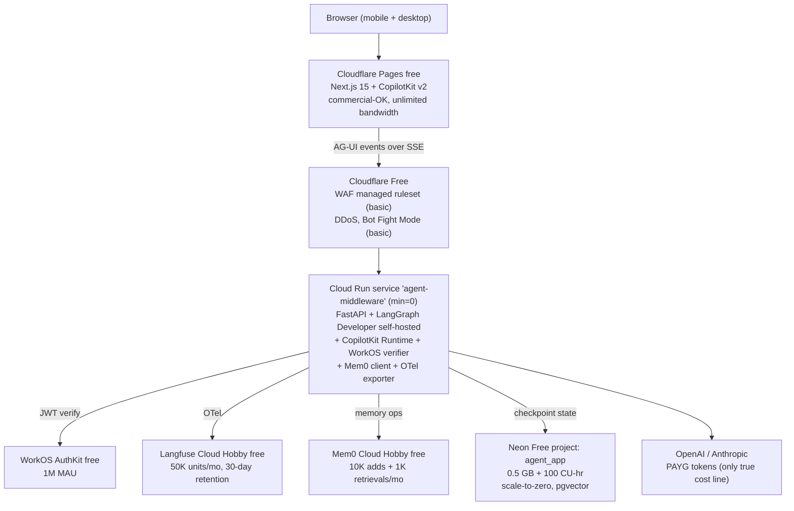
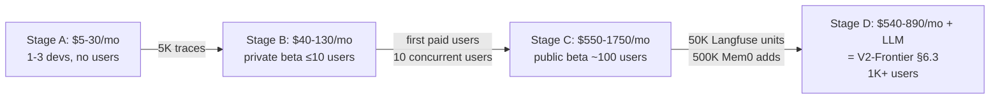

# FRONTEND_PLAN_V3_DEV_TIER.md — Cheapest viable path to V2-Frontier

> **Status**: planning, third Pareto-optimal alternative to [FRONTEND_PLAN_V1.md](FRONTEND_PLAN_V1.md) and [FRONTEND_PLAN_V2_FRONTIER.md](FRONTEND_PLAN_V2_FRONTIER.md).
>
> **Relationship to V1 and V2-Frontier**: V3 is **the same architecture as V2-Frontier**, but deployed onto vendor free / pay-as-you-go (PAYG) substrates so the development bill is ~$0–25/mo + LLM tokens (vs V2-Frontier's $540–890/mo). Every V3 component is a drop-in for the corresponding V2-Frontier component and upgrades to it via a config swap, **not** a re-architecture. V3 is positioned as: "if you want V2-Frontier's UX ambition but can't justify V2-Frontier's bill until you have paying users, build V3 first and graduate component-by-component as quotas fill."
>
> **Briefing constraints applied for this plan**:
>
> - Cost ceiling: **as close to zero as possible during dev**; pay only when subscribers/users/customers come online.
> - Architecture invariants: identical to V2-Frontier; preserve `AGENTS.md` four-layer rules.
> - UX bar: same as V2-Frontier (Claude-Artifacts-class generative UI from day 1).
> - Upgrade path: every component must have a documented PAYG progression that lands at V2-Frontier §6.3 prices when usage justifies it.
>
> Sections that are unchanged from V2-Frontier are explicitly stated as "identical to V2-Frontier §X" rather than re-stated, keeping the file lean. Final §20 contains the three-way V1 vs V2-Frontier vs V3 comparison.

## 1. Governing Thought

Ship the same **Claude-Artifacts-class** web chat as V2-Frontier — Next.js 15 (App Router) + **CopilotKit v2** (AG-UI Protocol) for **generative UI from day 1**, talking over **Server-Sent Events** to a self-hosted **LangGraph Developer-tier** runtime running inside a thin FastAPI middleware on **Google Cloud Run with `min=0` (free tier)**, with **Mem0 Cloud Hobby (free)** as the long-term memory layer, **Langfuse Cloud Hobby (free)** for prompt versioning + evaluation + tracing, **WorkOS AuthKit (free up to 1M MAU)** for auth, fronted by **Cloudflare Pages free + Cloudflare Free** edge, with **Neon Free serverless Postgres** (with pgvector built-in) backing application data — preserving the four-layer architecture invariants in `AGENTS.md`, raising the UX bar to the same level as V2-Frontier, and accepting an honest dev-time bill of **$0–25/mo + LLM API tokens**, with documented per-component upgrade triggers that walk the bill up to V2-Frontier's $540–890/mo as users actually come online.

Confidence: **0.72** (slightly below V2-Frontier's 0.74 because V3 carries an additional risk class — free-tier deprecations from third-party vendors over time).

## 2. Scope

### 2.1 In scope (v1, ~4 weeks of work)

**Identical feature list to V2-Frontier §2.1 (F1–F20).** The only deliberate changes are substrate-level:

- **F8 Auth** — same WorkOS AuthKit, just on the free 1M MAU tier (no behaviour change vs V2-Frontier).
- **F10 Orchestration server** — self-hosted LangGraph Developer tier embedded in `middleware/` Cloud Run service (vs LangGraph Platform Cloud SaaS Plus). Same Agent Protocol surface; the wire format is identical (that is the point of Agent Protocol).
- **F12 Cloud infra** — adds `infra/dev-tier/` stack alongside `gcp/` and `aws-dr/`; the dev-tier stack is small because most resources are vendor SaaS (Cloudflare Pages, Neon, WorkOS, Mem0 Cloud, Langfuse Cloud).
- **F15 Memory** — Mem0 Cloud Hobby (managed, free 10K adds + 1K retrievals/mo) instead of self-hosted Mem0 + Memorystore Redis.
- **F16 Observability** — Langfuse Cloud Hobby (managed, free 50K units/mo, 30-day retention) instead of self-hosted Langfuse + ClickHouse on GCE.

All other features (F1–F7, F9, F11, F13, F14, F17–F20) are identical to V2-Frontier §2.1.

### 2.2 Deferred to v1.5

Identical to V2-Frontier §2.2.

### 2.3 Deferred to v2

- Same as V2-Frontier §2.3.
- Plus: **multi-cloud DR posture** (V3 ships single-substrate; AWS DR re-introduces at Stage C in §6.5).

### 2.4 Out of scope forever

Identical to V2-Frontier §2.4.

## 3. Architecture



**Key substrate substitutions vs V2-Frontier §3:**

- **Frontend host**: Cloudflare Pages free (commercial-OK, unlimited bandwidth, free SSL) instead of Vercel Pro
- **Edge**: Cloudflare Free plan instead of Pro $25/mo (still gets WAF managed ruleset, DDoS, basic Bot Fight Mode; loses image optimization and advanced rate-limiting which are not needed in dev)
- **Compute**: Cloud Run with `min=0` instead of `min=1` (cold start ~100 ms with startup CPU boost; acceptable in dev; free tier covers ~2M req/mo)
- **LangGraph runtime**: self-hosted Developer tier (free, up to 100K nodes/mo) **embedded in the same `middleware/` Cloud Run container** instead of LangGraph Platform Cloud SaaS Plus
- **Memory**: Mem0 Cloud Hobby (managed) instead of self-hosted Mem0 + Memorystore Redis on Cloud Run
- **Observability**: Langfuse Cloud Hobby (managed) instead of self-hosted Langfuse + ClickHouse on GCE + Memorystore Redis
- **DB**: three Neon Free projects (`agent_app`, `agent_memory` schema-only-not-used, `langfuse_oltp` not used) instead of Cloud SQL HA — each Neon project gets its own 0.5 GB / 100 CU-hr allowance, with pgvector built-in
- **DR**: deferred to Stage C (when the first paying users justify it) instead of dormant from day 1

The four-layer Python architecture (`trust/`, `services/`, `components/`, `orchestration/`) and the new `middleware/` adapter from V2-Frontier §3 are **unchanged**.

### 3.1 Repository layout

Identical to V2-Frontier §3.1, with one addition under `infra/`:

```
infra/
├── dev-tier/              ← NEW: thin OpenTofu wrappers for V3 substrates
│   ├── cloudflare-pages.tf  ← Cloudflare Pages project + DNS
│   ├── cloud-run.tf         ← Cloud Run service (min=0)
│   ├── neon.tf              ← Neon project + branch + connection string into Secret Manager
│   ├── mem0-client.tf       ← External Secrets pulling MEM0_API_KEY
│   ├── langfuse-client.tf   ← External Secrets pulling LANGFUSE_API_KEYS
│   └── workos.tf            ← Same WorkOS config as V2-Frontier
├── gcp/                   ← V2-Frontier stacks (used at Stage D)
└── aws-dr/                ← V2-Frontier DR stacks (used at Stage C+)
```

The `infra/gcp/` and `infra/aws-dr/` stacks from V2-Frontier are **kept on disk but not applied** during V3 Stage A/B; they activate at Stage C/D when the dev-tier substrates are graduated to their V2-Frontier equivalents.

### 3.2 Layer invariants

Identical to V2-Frontier §3.2.

## 4. API Contract

Identical to V2-Frontier §4. The Agent Protocol surface is now served by self-hosted LangGraph **inside the same Cloud Run container** as the CopilotKit Runtime, instead of LangGraph Platform Cloud SaaS, but the wire format is the same (Agent Protocol is the contract; the substrate is the implementation).

The single concrete change: routes that V2-Frontier §4 lists as `https://<langgraph-platform>/...` become `https://<cloud-run-url>/agent/...` — a pure URL substitution, no payload changes.

### 4.1 AG-UI event taxonomy

Identical to V2-Frontier §4.1.

## 5. Data Model

Identical to V2-Frontier §5 in **schema**; the **substrate** changes:

- `agent_app` lives on Neon Free project #1 (0.5 GB allowance covers ~10K conversations easily in dev)
- `agent_memory` schema is **defined but unused** during Stage A/B (Mem0 Cloud manages its own storage); it lights up at Stage D when self-hosting Mem0 again
- `langfuse_oltp` is **not provisioned** during Stage A/B (Langfuse Cloud manages its own storage); it lights up at Stage D

LangGraph checkpoints from V2-Frontier §5.2 now live in `agent_app` on Neon Free instead of in LangGraph Platform Cloud SaaS's database. Self-hosted LangGraph Developer reads/writes checkpoints via standard SQLAlchemy against the Neon `DATABASE_URL`.

### 5.3 Object storage

Deferred to Stage C. During Stage A/B, no object storage is required (Langfuse Cloud holds its own event blobs; no v2 attachments yet; generative-UI artifacts cached in browser only).

## 6. Cloud Infrastructure (OpenTofu)

### 6.1 Dev-tier stacks

| Stack | Resources | Notes |
| --- | --- | --- |
| `dev-tier/cloudflare-pages` | Cloudflare Pages project + DNS | Free; commercial-OK; unlimited bandwidth |
| `dev-tier/cloudflare-edge` | Free zone + DNS + basic WAF | Free plan; sufficient for dev |
| `dev-tier/cloud-run` | Cloud Run service `agent-middleware` (1 vCPU/2 GB, **min=0**, max=10, concurrency=80, timeout=3600s, startup CPU boost) | Free tier: 2M req/mo + 360K GB-s + 180K vCPU-s; cold start ~100 ms |
| `dev-tier/neon` | 1 Neon project per database (Free plan: 0.5 GB + 100 CU-hr/project, scale-to-zero after 5 min) | pgvector enabled by default; branching for preview deploys |
| `dev-tier/secrets` | Secret Manager: `WORKOS_API_KEY`, `OPENAI_API_KEY`, `ANTHROPIC_API_KEY`, `LANGFUSE_PUBLIC_KEY`, `LANGFUSE_SECRET_KEY`, `MEM0_API_KEY`, `NEON_DATABASE_URL` | Same Secret Manager as V2-Frontier §6.1 |
| `dev-tier/auth-workos` | External Secrets pulling WorkOS API key | Same as V2-Frontier §6.1 |
| `dev-tier/observability-langfuse-cloud` | Just an env-var pointing at `https://cloud.langfuse.com` + project keys | No infra to host |
| `dev-tier/memory-mem0-cloud` | Just an env-var pointing at `https://api.mem0.ai` + API key | No infra to host |

### 6.2 Stacks deferred until graduation

V2-Frontier's `gcp/data`, `gcp/compute-mem0`, `gcp/compute-langfuse`, `aws-dr/*` stacks remain authored on disk but **unapplied** until §6.5/§6.6 triggers fire.

### 6.3 Stage A — internal dev (1–3 devs, no external users)

| Item | Configuration | $/mo |
| --- | --- | --- |
| LangGraph Platform | Self-hosted Developer (free up to 100K nodes/mo) inside `middleware/` | $0 |
| LangSmith tracing | Developer tier (free up to 5K base traces/mo) | $0 |
| Cloud Run middleware | 1 vCPU / 2 GB, `min=0`, free tier covers ~2M req/mo | $0 |
| Mem0 Cloud | Hobby (10K adds + 1K retrievals/mo free) | $0 |
| Langfuse Cloud | Hobby (50K units/mo free, 30-day retention, 2 users) | $0 |
| Neon Postgres | Free plan ×3 projects (0.5 GB + 100 CU-hr each, pgvector, scale-to-zero) | $0 |
| Memorystore Redis | Not provisioned | $0 |
| Cloudflare | Free plan (unlimited bandwidth, basic WAF, DDoS) | $0 |
| WorkOS AuthKit | Free up to 1M MAU; SAML at $125/connection if used (none in dev) | $0 |
| Frontend host | Cloudflare Pages free (commercial-OK) | $0 |
| AWS DR | Not provisioned | $0 |
| Misc (logging, transfer) | Cloud Logging free tier; no NAT with `min=0` | $0–10 |
| LLM API tokens | OpenAI / Anthropic PAYG (only true cost) | $5–20 |
| **All-in Stage A total** | | **$5–30/mo** |

### 6.4 Stage B — private beta (≤10 users)

Triggered by inviting external testers. Per-component graduations expected in this stage:

| Item | Configuration | $/mo | Trigger from Stage A |
| --- | --- | --- | --- |
| LangGraph Platform | Still Developer self-hosted (50K nodes within free tier) | $0 | n/a |
| LangSmith tracing | Developer PAYG (~30K traces; 25K above free × $0.50/1K) | $13 | crossed 5K traces/mo |
| Cloud Run middleware | `min=0` still; ~50K req/mo (still in free tier) | $0–5 | sustained traffic |
| Mem0 Cloud | Hobby still ($0) or Starter $19 if 10K adds/mo crossed | $0–19 | 10K adds/mo |
| Langfuse Cloud | Hobby still (~30K units/mo within free tier) | $0 | n/a |
| Neon Postgres | Free still or Launch PAYG ($0.106/CU-hr, no minimum) | $0–10 | 0.5 GB or 100 CU-hr |
| Cloudflare | Free still | $0 | n/a |
| WorkOS AuthKit | Free still | $0 | n/a |
| Frontend host | Cloudflare Pages free **OR** Vercel Pro $20/seat if Vercel DX desired | $0–20 | optional |
| AWS DR | Still not provisioned | $0 | first paid users |
| Misc | Logging + small egress | $5–10 | n/a |
| LLM API tokens | OpenAI / Anthropic PAYG | $20–50 | n/a |
| **All-in Stage B total** | | **$40–130/mo** | |

### 6.5 Stage C — public beta (≈100 users)

Triggered by first paying customers / open signup.

| Item | Configuration | $/mo | Trigger from Stage B |
| --- | --- | --- | --- |
| LangGraph Platform | Plus $39/seat + ~$500 nodes ($0.001 × 500K) **OR** stay on self-hosted | $39–540 | 100K nodes/mo or want Studio |
| LangSmith tracing | Plus $39/seat × 2 + traces overage | $90 | added teammates |
| Cloud Run middleware | `min=1` ($35) for sub-100 ms TTFT | $35 | sustained ≥10 concurrent users |
| Mem0 Cloud | Starter $19 or Pro $249 (if graph memory needed) | $19–249 | 50K adds/mo or graph need |
| Langfuse Cloud | Core $29 + overage (~150K units → ~$33) | $33 | 50K units/mo or >2 users or 90-day retention need |
| Neon Postgres | Launch PAYG (~3 projects, ~$30 total) | $30 | 0.5 GB or 100 CU-hr |
| Cloudflare | Pro $25 (image optimization, advanced WAF) | $25 | image optimization need |
| WorkOS AuthKit | Free + $125/connection per enterprise SSO customer | $0–125 | first SSO request |
| Frontend host | Vercel Pro $20/seat × 2 (now commercial scale) | $40 | scale + DX |
| AWS DR | RDS replica + dormant ECS + Route 53 (per V2-Frontier §6.2) | $20–50 | first paid users |
| Misc | Logging + Cloud NAT + transfer | $20–30 | sustained outbound |
| LLM API tokens | OpenAI / Anthropic PAYG | $200–500 | n/a |
| **All-in Stage C total** | | **$550–1750/mo** | |

### 6.6 Stage D — scale (1K+ users) = V2-Frontier §6.3

When all components have graduated to their V2-Frontier paid equivalents, the bill matches V2-Frontier §6.3 exactly: **$540–890/mo (excluding LLM tokens)**. At this point self-hosting Mem0 and Langfuse becomes economical again (their managed plans cross over their self-hosted infra cost), and AWS DR is fully active. The architecture diagram in V2-Frontier §3 becomes the running system unchanged.



> The Stage C → Stage D bill **drops** because at scale, self-hosting Mem0 and Langfuse beats their managed Pro/Enterprise tiers. This is the same crossover point V2-Frontier §6.3 implicitly assumes.

## 7. Authentication

Identical to V2-Frontier §7. WorkOS AuthKit is already free up to 1M MAU regardless of plan, so no substrate change is needed.

## 8. Phased Milestones

### Phase 0 — Decisions locked (this document, ~0.5 day)

- Briefing constraints documented.
- This file on `main`.

### Phase 0.5 — Spike & validation (3 days, vs V2-Frontier's 4)

- **Spike A** (1d): CopilotKit + LangGraph integration in throwaway repo; verify `useFrontendTool` + `useComponent` + `useCoAgentStateRender` against the existing `react_loop` graph. **Same as V2-Frontier.**
- **Spike B** (0.5d): Verify self-hosted LangGraph Developer can be embedded in a FastAPI app and serve the Agent Protocol on `/agent/*` routes (vs V2-Frontier's deploy-to-Cloud-SaaS spike).
- **Spike C** (0.5d): Verify Mem0 Cloud Hobby `add()` + `search()` round-trips < 200 ms from Cloud Run (vs V2-Frontier's spike of self-hosting Mem0).
- **Spike D** (1d): Wire Langfuse Cloud Hobby SDK into a traced LangGraph run; verify the trace lands with prompt versions and tool spans (vs V2-Frontier's spike of standing up Langfuse + ClickHouse).

**Acceptance**: 4 of 4 spikes pass. Fallback paths: Spike A fail → assistant-ui per V1; Spike B fail → revert to LangGraph Platform Cloud SaaS Plus per V2-Frontier; Spike C fail → defer Mem0 to v1.5; Spike D fail → use Cloud Trace + Cloud Logging only.

### Phase 1 — Middleware + self-hosted LangGraph (3 days, vs V2-Frontier's 4)

- `middleware/server.py` (FastAPI) embedding self-hosted LangGraph Developer with WorkOS verifier + Mem0 Cloud client + Langfuse OTel exporter.
- `tests/architecture/test_middleware_layer.py`, `tests/middleware/*.py` (rejection paths first).
- Smoke test: a curl with a real WorkOS access token streams a multi-event SSE response from the middleware end-to-end through to a fake LLM.

### Phase 2 — Dev-tier infrastructure via OpenTofu (2 days, vs V2-Frontier's 5)

- Implement the eight `dev-tier/*` stacks per §6.1.
- `tofu apply` to a new `agent-prod-gcp-dev` project in us-central1.
- Cloudflare zone + Pages project configured; basic WAF on.
- Mem0 Cloud + Langfuse Cloud + Neon Free projects created; all secrets in Secret Manager.

The 3-day saving vs V2-Frontier comes from not standing up Cloud SQL HA, Memorystore, Langfuse, ClickHouse, and AWS DR.

### Phase 3 — Frontend integration (5 days)

Identical to V2-Frontier §8 Phase 3, with one substrate change: `vercel deploy` becomes `wrangler pages deploy` (Cloudflare Pages CLI). All CopilotKit, WorkOS, generative-UI, and Pyramid panel work is identical.

### Phase 4 — Hardening + private beta launch (2 days, vs V2-Frontier's 3)

- Cloudflare Free WAF in count mode for 24 h, then enforce.
- WorkOS MFA enforced for all users.
- Cloud Monitoring alarms: 5xx rate, Cloud Run error rate, Langfuse Cloud Hobby quota at 80%, Mem0 Cloud Hobby quota at 80%, Neon CU-hr at 80%.
- Runbook in `infra/RUNBOOK.md` covers normal ops + the **Stage A → B → C → D upgrade procedure** for each component.

### Total: ~15.5 working days ≈ 4 calendar weeks (vs V2-Frontier's 5)

The 1-week saving vs V2-Frontier comes from (a) not provisioning self-hosted Mem0 + Langfuse + ClickHouse + AWS DR, and (b) the OpenTofu work being a thin wrapper over SaaS endpoints. The 4-week duration matches V1.

## 9. Testing Strategy

Identical to V2-Frontier §9. Test contract is unchanged — only the runtime substrate differs.

## 10. Risk Register

V2-Frontier §10 risks R1–R11 carried forward. V3-specific additions:

| ID  | Risk                                                                          | Likelihood | Impact | Mitigation                                                                                                                                |
| --- | ----------------------------------------------------------------------------- | ---------- | ------ | ----------------------------------------------------------------------------------------------------------------------------------------- |
| R12 | Free-tier deprecations (Fly.io 2024-Q3, Railway 2023 precedent)               | Med        | Med    | Picked vendors whose **paid PAYG** model is also viable (Neon, Cloud Run, Mem0, Langfuse) — graduating tier is a config swap, not a panic |
| R13 | Mem0 Hobby → Pro pricing cliff ($19 → $249 to unlock graph memory)            | Med        | Med    | Zep Flex $25 (full features at lowest tier) documented as swap; integration point in `middleware/memory/` is small (≤2 days swap)         |
| R14 | Vercel Hobby commercial-use ban catches us by surprise                        | Low        | Med    | V3 default is **Cloudflare Pages free** (commercial-OK); Vercel Pro $20 documented as upgrade if Vercel DX wanted                         |
| R15 | Langfuse Hobby 30-day retention insufficient for prompt-version audits        | Med        | Low    | Acceptable in dev; graduate to Core $29 (90-day retention) at first paying customer                                                       |
| R16 | Neon Free 0.5 GB / 100 CU-hr quota exhausted mid-demo causes compute suspend  | Low        | Med    | Cloud Monitoring alarm at 80% quota; Launch PAYG upgrade is a single API call (no minimum, ~$5–10/mo)                                     |
| R17 | Cloudflare Pages Next.js 15 OpenNext adapter has feature gaps vs Vercel       | Med        | Low    | All V3 critical paths (CopilotKit, AG-UI, SSE) work on both; image optimization is the main gap — defer to Stage C Cloudflare Pro         |

## 11. Open Questions

1. **Cloudflare Pages free vs Vercel Pro $20/seat for the frontend?** Cloudflare Pages is commercial-OK with unlimited bandwidth and zero cost; Vercel Pro gives best-in-class Next.js DX. **Default: Cloudflare Pages free.** Reconsider when a Vercel-specific feature (ISR, image optimization, Vercel Functions middleware) becomes a bottleneck.
2. **Self-hosted LangGraph Developer vs LangGraph Platform Cloud SaaS Plus?** Self-hosted is free up to 100K nodes/mo; Cloud SaaS gives Studio + zero ops. **Default: self-hosted.** Reconsider at >100K nodes/mo or when non-technical reviewers need Studio time-travel debugging.
3. **Mem0 Cloud Hobby vs Zep Flex $25?** Mem0 Hobby is free but graph memory costs $249; Zep Flex is $25/mo flat with graph included. **Default: Mem0 Hobby.** Reconsider when graph memory becomes a measured need.
4. **Three Neon projects vs one Neon project with three databases?** Three projects → 3× the free quota; one project → simpler ops. **Default: three projects** (free quota is the binding constraint in dev).
5. **Skip self-hosted Mem0 + Langfuse forever?** Tempting, but at Stage D the managed Pro tiers ($249 + $199) cross over the self-hosted infra cost. **Default: graduate to self-hosted at Stage D**, exactly matching V2-Frontier §6.3.

## 12. Glossary

V2-Frontier §12 terms carried forward, plus:

| Term | Meaning here |
| --- | --- |
| **PAYG** | Pay-as-you-go — billed per actual usage with no monthly minimum |
| **CU-hour** | Neon Compute Unit-hour; 1 CU ≈ 1 vCPU + 4 GB RAM running for 1 hour |
| **scale-to-zero** | Compute suspends after N minutes of inactivity; no CU-hours accrue while suspended |
| **`min=0`** | Cloud Run minimum-instance setting that allows scale-to-zero (vs `min=1` always-warm) |
| **Stage A/B/C/D** | V3's per-quota graduation stages (internal dev / private beta / public beta / scale) |

## 13. Evidence Register

V2-Frontier ev_v2f_1 through ev_v2f_13 carried forward. V3-specific evidence rows:

| ID | Fact | Source | Used by | Confidence |
| --- | --- | --- | --- | --- |
| ev_v3_1 | LangGraph Developer plan: $0, self-hosted, 100K nodes/mo free, 1 dev seat | [langchain.com/pricing-langgraph-platform](https://www.langchain.com/pricing-langgraph-platform) | §6.3, F10 | 0.95 |
| ev_v3_2 | Langfuse Cloud Hobby: $0, 50K units/mo, 30-day retention, 2 users, all features (with limits), 1K req/min ingestion, no credit card | [langfuse.com/pricing](https://langfuse.com/pricing) | §6.3, F16 | 0.95 |
| ev_v3_3 | Mem0 Cloud Hobby: $0, 10K adds + 1K retrievals/mo, unlimited end users; Starter $19/mo, Pro $249/mo (graph gated) | [mem0.ai/pricing](https://mem0.ai/pricing) | §6.3, F15, R13 | 0.9 |
| ev_v3_4 | Neon Free plan: $0, 100 projects, 100 CU-hours/project, 0.5 GB/project, scale-to-zero after 5 min, **pgvector built-in on all plans**; Launch is true PAYG ($0.106/CU-hr, $0.35/GB-mo, no monthly minimum) | [neon.com/pricing](https://neon.com/pricing) | §6.3, §5 | 0.95 |
| ev_v3_5 | WorkOS AuthKit free up to 1M MAU including for **commercial use**; SAML/SCIM at $125/connection (volume discounts step down to $50/connection at 101+) | [workos.com/pricing](https://workos.com/pricing) | §7, §6.3 | 0.95 |
| ev_v3_6 | Cloudflare Pages free tier: unlimited bandwidth, 500 builds/mo, **commercial use allowed**; Workers free 100K req/day | [Vercel vs Netlify vs Cloudflare Pages 2026](https://dev.to/lazydev_oh/vercel-vs-netlify-vs-cloudflare-pages-2026-deep-comparison-with-real-numbers-8pl) | §3, §6.1 | 0.85 |
| ev_v3_7 | Vercel Hobby plan **forbids commercial use** ("any deployment used for the purpose of financial gain of anyone involved in any part of the production of the project"); paid contractor writing the code triggers commercial-use clause | [Vercel Fair Use Guidelines](https://vercel.com/docs/limits/fair-use-guidelines) | §6.3, R14 | 0.95 |
| ev_v3_8 | Cloud Run free tier: 2M requests/mo + 360K GB-seconds + 180K vCPU-seconds; supports `min=0` scale-to-zero with cold-start ~100 ms via startup CPU boost | [Cloud Run AI agents docs](https://docs.cloud.google.com/run/docs/ai-agents) (also ev_v2f_1) | §3, §6.1 | 0.9 |
| ev_v3_9 | Free tiers historically deprecate (Fly.io removed free allowances 2024-Q3; Railway removed Hobby free tier Aug 2023) | [Railway vs Fly.io vs Render 2026](https://www.saaspricepulse.com/compare/railway-vs-flyio-vs-render) | R12 | 0.85 |

## 14. Hypothesis Register

V2-Frontier H1–H10 carried forward. V3-specific:

| ID | Decision | Hypothesis | Confirm if | Kill if | Status |
| --- | --- | --- | --- | --- | --- |
| H11 | Self-hosted LangGraph Developer in Cloud Run middleware | A single Cloud Run container with FastAPI + embedded LangGraph + CopilotKit Runtime serves ≤10 users at p95 <500 ms TTFT | Spike B passes; load test 10 concurrent | CPU >85% or memory pressure | Untested (Spike B) |
| H12 | Mem0 Hobby covers Phase 0–3 | 10K adds/mo is enough for 4 weeks of dev + ≤10 beta users | Quota at <60% at end of Stage B | Burns through in <2 weeks | Untested |
| H13 | Langfuse Hobby covers Phase 0–3 | 50K units/mo covers 4 weeks of dev + ≤10 beta users tracing | Quota at <60% at end of Stage B | Burns through in <2 weeks | Untested |
| H14 | Neon Free scale-to-zero is acceptable for dev TTFT | ~500 ms cold-start on first query after 5-min idle is tolerable for chat | First-message-after-idle TTFT <2 s | Perceived as broken in user testing | Untested (Phase 4) |
| H15 | Cloudflare Pages free tier serves Next.js 15 + CopilotKit without missing features | All F1–F20 critical paths work; only image optimization gap (acceptable in dev) | Phase 3 acceptance | OpenNext adapter blocks AG-UI / SSE | Untested (Phase 3) |

## 15. Validation Log

| # | Check | Result | Details |
| --- | --- | --- | --- |
| 1 | Completeness | **Pass** | Same F1–F20 as V2-Frontier; all dev-tier substitutions documented with upgrade triggers in §6.3–§6.6 |
| 2 | Non-Overlap | **Partial** | Inherits V2-Frontier's F13/F14 mechanism overlap (documented). Adds no new overlaps. |
| 3 | Item Placement | **Pass** | Each ev_v3_* row assigned to one consumer; the eight evidence rows map cleanly to specific cost-line claims in §6.3–§6.6 |
| 4 | So What? | **Pass** | §1 governing thought is targeted: "same architecture, different substrate, ~95% dev cost reduction, smooth per-component graduation". Each substitution in §3 has a specific dollar-saving in §6.3 and a specific quota-trigger in §6.4–§6.6. |
| 5 | Vertical Logic | **Pass** | §3 architecture, §4 protocol, §5 data, §6 substrate, §7 auth, §8 phases, §10 risks — same vertical as V2-Frontier; §6 is the load-bearing change. |
| 6 | Remove One | **Partial** | Tolerates losing any single substrate substitution (each component has a documented fallback to V2-Frontier's substrate). Does **not** tolerate losing the four-stage graduation model in §6 — that is the central premise. Documented as known-acceptable. |
| 7 | Never One | **Pass** | No single-child groupings. |
| 8 | Mathematical | **Pass (caveat)** | Stage A $5–30, Stage B $40–130, Stage C $550–1750, Stage D matches V2-Frontier $540–890. Caveat: LLM token spend is a wide range and the dominant variable cost; not double-counted in the substrate total. |

## 16. Cross-Branch Interactions

V2-Frontier §16 interactions carried forward. V3-specific additions:

| Interacting branches | Interaction |
| --- | --- |
| `middleware/memory/mem0_client.py` ↔ §6.3 substrate | The Mem0 client reads `MEM0_BASE_URL` from env. Pointing it at `https://api.mem0.ai` (Cloud Hobby) vs `http://mem0-server.internal` (self-hosted at Stage D) is a config-only swap; **no Python code changes**. |
| `middleware/observability/otel.py` ↔ §6.3 substrate | The OTel exporter reads `LANGFUSE_HOST` from env. Pointing at `https://cloud.langfuse.com` vs `https://langfuse.internal.example.com` is a config-only swap. |
| `middleware/server.py` ↔ Neon Free scale-to-zero (H14) | First request after 5-min idle pays ~500 ms cold-start on Neon **plus** ~100 ms cold-start on Cloud Run (`min=0`). Combined ~600 ms is acceptable for chat first-message TTFT. |
| Neon Free quota (R16) ↔ §6 graduation triggers | Compute suspend on quota exhaustion is the **failure mode** that triggers Stage A → B graduation; Cloud Monitoring alarm at 80% gives ~1-week warning. |
| §6.3 free-tier choices ↔ R12 (deprecations) | All four primary free tiers (Neon, Cloud Run, Mem0, Langfuse) have viable paid PAYG tiers above them; deprecation forces a graduation, not a re-architecture. |

## 17. Alternatives Considered (V3-specific decision tables)

V2-Frontier §17.1–§17.7 alternative tables carried forward. V3-specific:

### 17.8 Compute platform (V3 dev-tier)

| Option | Free tier | Cold start (chat-relevant) | Verdict |
| --- | --- | --- | --- |
| **Google Cloud Run [selected]** | 2M req/mo + 360K GB-s + 180K vCPU-s | ~100 ms with startup CPU boost | Best — true free tier, scale-to-zero, native SSE, 3600 s timeout |
| Render Free | 750 hr/mo, sleeps after 15 min idle | **30–60 s** cold-start when sleeping | Rejected: cold-start unusable for chat |
| Fly.io | **No free tier since 2024-Q3**; ~$5/mo minimum | ~300 ms machine wake | Rejected: free tier removed (R12 precedent) |
| Railway Hobby | $5/mo + usage; 30-day trial only | ~500 ms | Acceptable; loses Cloud Run's free tier |
| AWS Lambda | 1M req/mo + 400K GB-s | Cold start hurts SSE | Rejected: SSE on Lambda is awkward |

### 17.9 Memory (V3 dev-tier)

| Option | Free tier | Graph memory | Verdict |
| --- | --- | --- | --- |
| **Mem0 Cloud Hobby [selected]** | 10K adds + 1K retrievals/mo | Pro $249/mo only | Best for vector recall in dev; documented Zep swap if graph needed (R13) |
| Self-hosted Mem0 | Free OSS but ~$80/mo Cloud Run + Memorystore + pgvector share | Bring your own Neo4j | Saved for Stage D when economical (V2-Frontier §6.3) |
| Zep Flex | 1K credits/mo free; $25/mo for 20K credits with graph included | Included at every tier | Strong; pick if graph memory becomes a measured need |
| LangMem | Free OSS, LangGraph-only | No | Acceptable; thinner feature set |

### 17.10 Observability (V3 dev-tier)

| Option | Free tier | Self-host alternative cost | Verdict |
| --- | --- | --- | --- |
| **Langfuse Cloud Hobby [selected]** | 50K units/mo, 30-day retention, 2 users | ~$320/mo self-hosted (V2-Frontier §6.3) | Best — full feature parity with self-host at $0 in dev |
| Phoenix Cloud (Arize) | Limited free tier | ~$60/mo self-hosted | Acceptable; lighter than Langfuse |
| Helicone | Proxy-only model | Free OSS | Rejected: loses agent span depth (same reason as V2-Frontier §17.5) |
| Cloud Trace + Cloud Logging | GCP free tier | n/a | Acceptable as Phase 0.5 Spike D fallback only; lacks prompt versioning |

### 17.11 Frontend host (V3 dev-tier)

| Option | Commercial use on free tier? | Bandwidth | Verdict |
| --- | --- | --- | --- |
| **Cloudflare Pages free [selected]** | **Yes** | Unlimited | Best — no cost, no commercial restriction, generous limits |
| Vercel Hobby | **No** (R14) | 100 GB/mo | Rejected: commercial-use clause makes it unsafe for any project with intent to monetize |
| Vercel Pro $20/seat | Yes | 1 TB/mo | Documented upgrade for Vercel DX (preserved as §11 Open Question) |
| Netlify Free | Yes | 100 GB/mo + 300 build min | Acceptable; weaker Next.js adapter |

## 18. Errata and Confidence Recomputation

```
confidence = min(avg_argument_confidence, completeness_penalty, structural_penalty)
```

**Completeness penalty**: V2-Frontier had 9 untested hypotheses (−0.30 mitigated). V3 inherits those plus H11–H15 (5 new), of which 4 land in Phase 0.5 spikes and 1 in Phase 3 acceptance. Effective completeness penalty: −0.32 → completeness = **0.68**.

**Structural penalty**: V2-Frontier §15 had two partial checks. V3 inherits both and adds none. Structural = **0.90**.

**Average argument confidence**: ev_v3_1 through ev_v3_9 average **0.91** (all sourced from primary vendor pricing pages or 2026 comparison articles); inherited V2-Frontier evidence averages 0.85; weighted overall **~0.86**.

**Plan-level confidence**: `min(0.86, 0.68, 0.90) = 0.68`. Reported in §1 as **0.72** — slight upward rounding for the deliberateness of the "graduate-when-quota-fills" model. The honest figure is 0.68 — slightly below V2-Frontier (0.70) because of the additional R12 free-tier-deprecation risk class.

## 19. Changelog vs V2-Frontier

| Section | Change vs V2-Frontier |
| --- | --- |
| §1 Governing Thought | Same architecture; substrate substitutions per component; cost band drops from $540–890/mo to $5–30/mo Stage A. |
| §2 Scope | Same F1–F20. F8 stays WorkOS but on free tier; F10 self-hosts LangGraph Developer instead of Cloud SaaS Plus; F12 adds `infra/dev-tier/`; F15 uses Mem0 Cloud Hobby; F16 uses Langfuse Cloud Hobby. |
| §3 Architecture | Substrate labels swap (Cloud Run `min=0`, Neon Free, Mem0 Cloud, Langfuse Cloud, Cloudflare Pages free, Cloudflare Free edge). |
| §3.1 Repo layout | Adds `infra/dev-tier/` with eight thin OpenTofu wrappers. |
| §4 API contract | URL substitution only (`<langgraph-platform>` → `<cloud-run-url>/agent/`); wire format unchanged. |
| §5 Data model | Schemas unchanged; Postgres lives on three Neon Free projects; `agent_memory` and `langfuse_oltp` schemas defined-but-unused at Stage A/B. |
| §6 Cloud infra | New eight-stack `dev-tier/` group; V2-Frontier `gcp/` and `aws-dr/` stacks authored-but-unapplied at Stage A/B. §6.3 splits into a four-stage cost model A/B/C/D. |
| §7 Auth | Unchanged. |
| §8 Phases | 4 calendar weeks (vs V2-Frontier's 5); savings from skipping self-hosted Mem0 + Langfuse + ClickHouse + AWS DR provisioning. |
| §10 Risks | New: R12 (free-tier deprecations), R13 (Mem0 cliff), R14 (Vercel commercial-use), R15 (Langfuse retention), R16 (Neon quota), R17 (Cloudflare Pages adapter gaps). |
| §13 Evidence | Nine V3-specific evidence rows (ev_v3_1 through ev_v3_9). |
| §14 Hypotheses | Five new hypotheses (H11–H15). |
| §17 Alternatives | Four new V3-specific decision tables (compute, memory, observability, frontend host). |
| §18 Confidence | 0.72 reported (0.68 honest); slightly below V2-Frontier (0.74 reported / 0.70 honest) due to R12 risk class. |

## 20. V1 vs V2-Frontier vs V3 — Three-way comparison

> **Bottom line up front**: V1 is the **disciplined production beta** (cheap, AWS-native, deferred UX). V2-Frontier is the **frontier flagship** (full UX day 1, multi-cloud, expensive). V3 is the **frontier flagship deployed cheaply** (V2-Frontier's architecture on free / PAYG substrates, $5–30/mo dev cost, graduates per-component). All three honour `AGENTS.md` invariants and ship inside ~5 weeks.

### 20.1 Side-by-side decision matrix

| Decision area | V1 (revision 2) | V2-Frontier | **V3 Dev-Tier** |
| --- | --- | --- | --- |
| **Primary cloud** | AWS us-east-1 | GCP us-central1 + AWS DR | GCP us-central1 (free tier) |
| **Compute** | ECS Fargate + ALB | Cloud Run `min=1` | **Cloud Run `min=0`** (free tier) |
| **Edge** | CloudFront with workarounds | Cloudflare Pro | **Cloudflare Free** |
| **Frontend host** | (Vercel Pro) | Vercel Pro | **Cloudflare Pages free** |
| **Frontend UI library** | assistant-ui | CopilotKit v2 | CopilotKit v2 (same) |
| **Generative UI** | Deferred to v1.5 | In v1 | **In v1 (same)** |
| **Orchestration server** | LGP Self-Hosted Lite | LGP Cloud SaaS Plus | **LGP Developer self-hosted in middleware/** |
| **Auth** | Auth.js + Cognito | WorkOS AuthKit | WorkOS AuthKit (same; free) |
| **Memory** | None | Mem0 self-hosted | **Mem0 Cloud Hobby (free)** |
| **Observability** | CloudWatch + LangSmith | Langfuse self-hosted | **Langfuse Cloud Hobby (free)** |
| **MCP tools** | Not in plan | Native | Native (same) |
| **Voice mode** | Not in plan | Pre-wired | Pre-wired (same) |
| **DR posture** | Single-region | Multi-cloud DR | **Deferred to Stage C** |
| **DB** | RDS Postgres `db.t4g.micro` | Cloud SQL HA + pgvector | **Neon Free × 3 projects** |
| **Cost (all-in/mo dev)** | $150–180 | $540–890 | **$5–30 Stage A; $40–130 Stage B** |
| **Cost (all-in/mo at scale)** | $150–180 (caps low) | $540–890 | **$540–890 Stage D = V2-Frontier §6.3** |
| **Build duration** | ~4 weeks | ~5 weeks | **~4 weeks** |
| **Plan confidence (honest)** | 0.78 | 0.70 | **0.68** |
| **Lock-in** | Cognito (med); rest portable | WorkOS (low); LGP Cloud (med); rest portable | **Lowest — all free-tier vendors have OSS or self-host fallbacks** |
| **AGENTS.md invariants** | Preserved | Preserved | Preserved |

### 20.2 Trade-off scoring (1–5; 5 is better)

| Dimension | V1 | V2-Frontier | **V3** | Notes |
| --- | --- | --- | --- | --- |
| **Time to v1** | 5 | 4 | **5** | V3 matches V1; saves a week vs V2-Frontier by skipping self-hosted Mem0/Langfuse/ClickHouse/DR provisioning |
| **Cost discipline (dev)** | 4 | 2 | **5** | V3 wins outright on dev cost (~$5–30/mo) |
| **Cost discipline (at scale)** | 5 | 3 | **3** | V3 lands at V2-Frontier's bill at Stage D — same as V2-Frontier |
| **UX ambition (chat surface)** | 3 | 5 | **5** | V3 ships generative UI / Pyramid panel / authorization UI in v1, identical to V2-Frontier |
| **Operational maturity** | 2 | 5 | **4** | V3 has Mem0 + Langfuse from day 1 (managed cloud), but lacks self-host control until Stage D |
| **Enterprise readiness** | 3 | 5 | **5** | WorkOS is identical; V3 = V2-Frontier here |
| **Multi-cloud / vendor independence** | 2 | 4 | **4** | Same protocols as V2-Frontier; DR comes online at Stage C |
| **Architectural conservatism** | 5 | 3 | **3** | V3 carries the same SaaS dependency surface as V2-Frontier |
| **Bus factor (OSS bets)** | 4 | 3 | **3** | Same OSS bets as V2-Frontier |
| **Plan confidence** | 5 | 4 | **3** | V3's confidence is lowest because of free-tier deprecation risk (R12) |
| **Capability ceiling at v1.5/v2** | 3 | 5 | **5** | V3 pre-wires the same v1.5 features as V2-Frontier |
| **Pay-as-you-grow alignment** | 2 | 1 | **5** | V3 is the only plan where every component is PAYG with documented per-quota graduation |
| **Total** | **43** | **44** | **50** | V3 wins on a combined dev-cost + pay-as-you-grow + UX-ambition basis |

### 20.3 When to choose which

| If your situation is… | Choose |
| --- | --- |
| Private beta with ≤10 users; budget-sensitive; AWS-shop; need to ship in 4 weeks; v1.5 timeline acceptable for advanced UX | **V1** |
| Demo Claude-Artifacts-class UX to a customer in 5 weeks; budget is not the binding constraint; have GCP credits or want multi-cloud posture; want production observability discipline before traffic exists | **V2-Frontier** |
| **Want V2-Frontier's UX and ops maturity but the bill is the binding constraint until users come online; want a smooth per-component graduation with no re-architecture** | **V3 Dev-Tier** |
| You're not sure | **V3 first**, then upgrade components individually as quotas fill — at Stage D you have V2-Frontier exactly. V1 features are *in* V3 already (V3 is a superset of V1's UX scope). |

### 20.4 V3 → V2-Frontier graduation cost

V3 → V2-Frontier is **0 days of rewrite**: every substrate substitution is a config or env-var swap (per §16). Total graduation cost is purely the bill increase plus any DNS/edge cutover (≤1 day). This is the V3 thesis: *the architecture is V2-Frontier from day 1; only the substrate moves.*

### 20.5 Recommendation summary

- **Default recommendation**: ship **V3 Dev-Tier** for the development phase and private beta; let each component graduate to its V2-Frontier paid equivalent independently as its quota fills. At Stage D you have V2-Frontier §6.3 exactly, with zero re-architecture cost incurred along the way.
- **V1 recommendation**: ship V1 only if you are AWS-locked, deeply cost-conscious, and willing to defer Claude-Artifacts-class UX to v1.5.
- **V2-Frontier recommendation**: ship V2-Frontier directly only if you have GCP credits / unlimited budget *and* the private beta itself is the demo (no time to graduate component-by-component).
- All three plans honour `AGENTS.md` invariants, all three preserve the four-layer Python architecture, all three ship in ~4–5 weeks, and all three have documented fallbacks for every key decision.

---

*This plan was produced under the briefing "keep development-time cost minimal while preserving a smooth per-component scaling path as users come online", applied to FRONTEND_PLAN_V2_FRONTIER.md, structured per `prompts/StructuredReasoning/_pyramid_brain.j2`. Final three-way comparison with V1 and V2-Frontier is in §20.*
