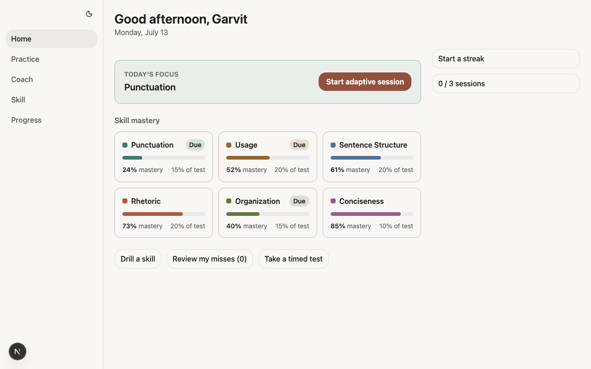
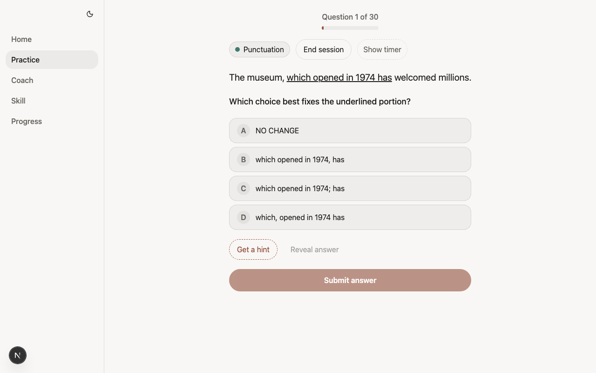
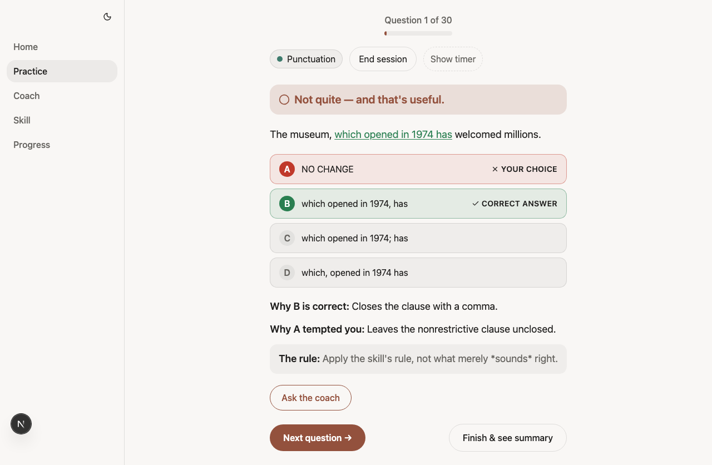
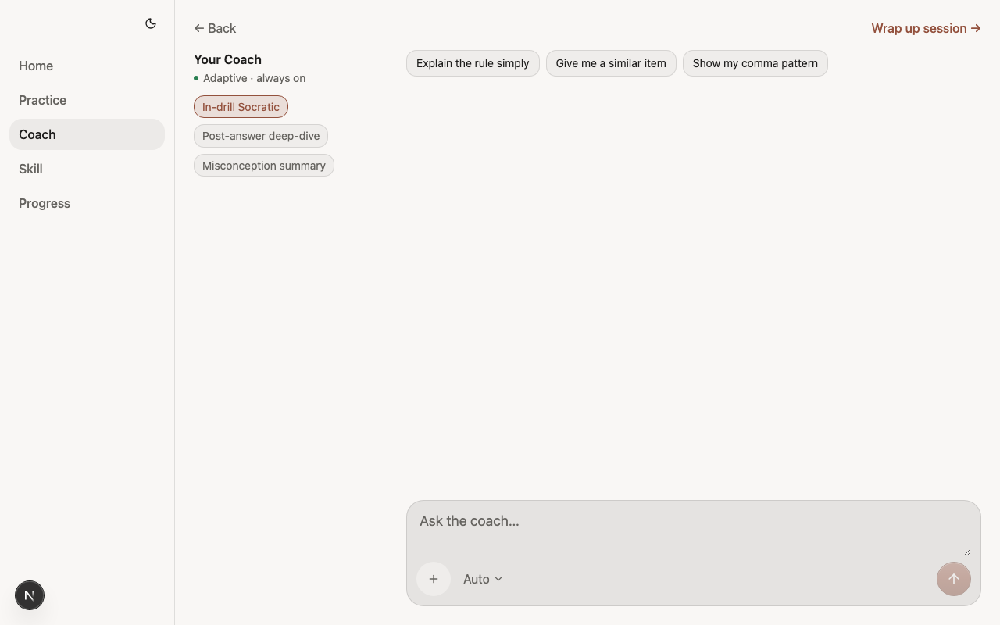
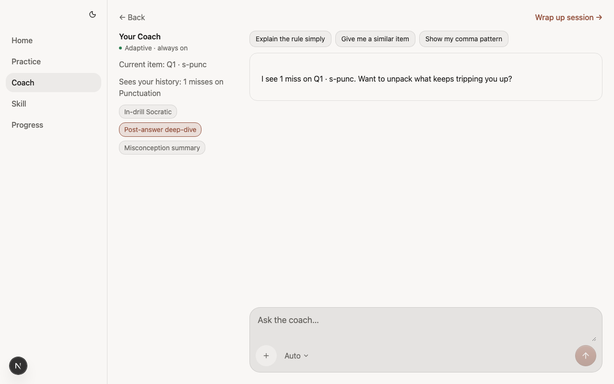
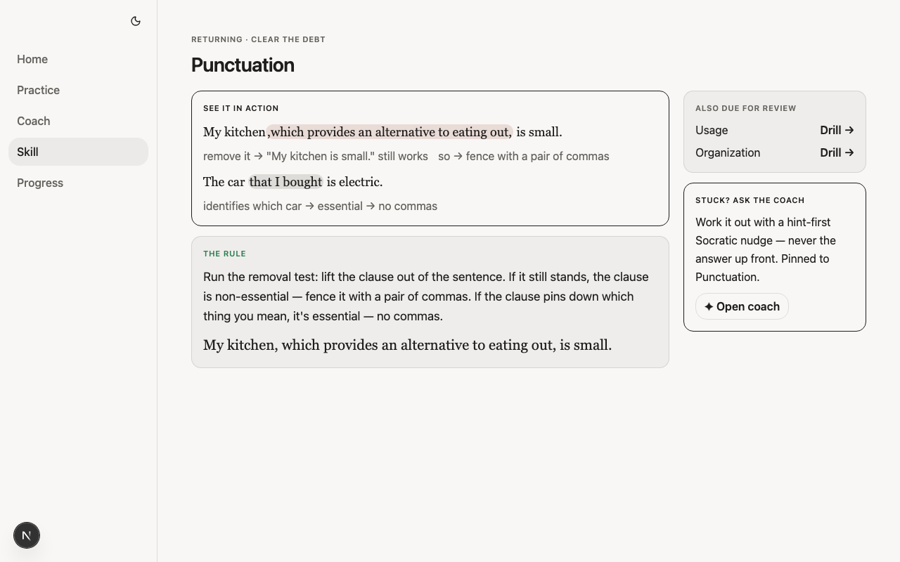
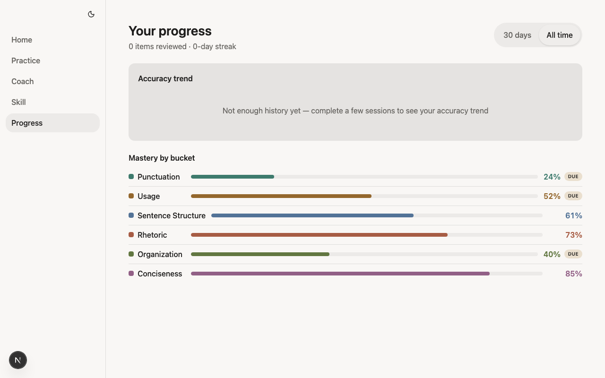
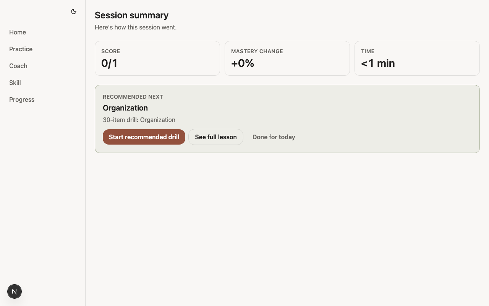

# PreAct Parity — E2E UI Validation Report (2026-07-13)

**Verdict.** Epics **A–F are in behavioral parity** with the staged program (honest-null where the program deferred a trust signal). Prototype pixel-fidelity was out of scope (H8). Two **intentional** product deltas remain vs the original prototype capture; three **leftover** items are stale tests / fragile history walks, not missing product.

| Layer | Result |
|---|---|
| Parity walk (validate + epic specs) | **55/63** green on first healthy run; Epic F + surface shots **12/12** on managed-server re-run |
| Regression / stress | **37/39** green (60-unique session ✅; 2 stale `bucket-` count asserts) |
| Screenshots | [assets/preact-parity-e2e-2026-07-13/screenshots/](assets/preact-parity-e2e-2026-07-13/screenshots/) |

---

## 1. How this was validated

Workspace binding: `.claude/skills/agentsframework-playwright` + `playwright-agentic-e2e` (T1 cut — seeded browser engine / mocked `/api/coach/run/stream`).

```bash
cd frontend
# Parity checklist + surface shots (Playwright owns webServer + E2E_BYPASS_AUTH=1)
E2E_BYPASS_AUTH=1 E2E_SCREENSHOTS=1 pnpm exec playwright test --project=learn-e2e \
  e2e/learn/validate_*.spec.ts e2e/learn/dashboard_rail.spec.ts \
  e2e/learn/summary-payoff.spec.ts e2e/learn/quiz-frame.spec.ts \
  e2e/learn/skill-*.spec.ts e2e/learn/_parity_surface_shots.spec.ts …

# Regression / stress
E2E_BYPASS_AUTH=1 pnpm exec playwright test --project=learn-e2e \
  deterministic-loop quiz-rotation quiz-no-repeat-60 quiz-progress \
  quiz-done-state full-session bank-integration layout theme a11y \
  coach-mocked ipad
```

Logs: [assets/preact-parity-e2e-2026-07-13/logs/](assets/preact-parity-e2e-2026-07-13/logs/).  
Raw Playwright output: [assets/preact-parity-e2e-2026-07-13/results/](assets/preact-parity-e2e-2026-07-13/results/).

---

## 2. Surface gallery (live app)

| # | Surface | Screenshot |
|---|---|---|
| 01 | Dashboard (greeting + rail + ACT taxonomy) |  |
| 02 | Quiz answering (skill chip + End + collapsed timer) |  |
| 03 | Feedback (recap + Ask the coach) |  |
| 04 | Coach cold (honest-absent pin) |  |
| 05 | Coach pinned from Feedback |  |
| 06 | Skill detail (`/learn/skill`) |  |
| 07 | Progress (`/learn/progress`) |  |
| 08 | Summary |  |

Evidence clips from the checklist walk: [screenshots/evidence/](assets/preact-parity-e2e-2026-07-13/screenshots/evidence/).

---

## 3. Finding-by-finding scorecard

Status key: **IN** = in parity · **INT** = intentional delta (decision recorded) · **LEFT** = leftover (stale test / fragile walk, product is fine)

### Epic A — Trust-bug hardening

| ID | Finding | Status | Evidence |
|----|---------|--------|----------|
| `Q-6` | Reveal answer dead control | **IN** | Reveal is gated submit alias → Feedback. `validate_a1_reveal` + Epic A walk ✅. Decision 2026-07-09 (D6+D1). [evidence/A1-reveal.png](assets/preact-parity-e2e-2026-07-13/screenshots/evidence/A1-reveal.png) |
| `S-2b` | Summary "0 min" | **IN** | Honest-null class-fix: `timeTile` emits `"<1 min"` for sub-minute sessions (decisions 2026-07-13). Continuity FLAG-6 mastery label ✅ |

### Epic B — Coach surface

| ID | Finding | Status | Evidence |
|----|---------|--------|----------|
| `C-2` | Context rail | **IN** | Cold coach chrome + layout ✅ [04](assets/preact-parity-e2e-2026-07-13/screenshots/04-coach-cold.png) |
| `C-3` | Current-item context | **IN** | Pin path shows Current item; cold = honest absent ✅ |
| `C-4` | History line | **IN** | Real miss aggregate or absent; FLAG-1 refresh 1→2 misses ✅ (retry) |
| `C-5` | COACH MODES (3 labels) | **INT** | **D5a** — display-only 3→2 map; Misconception label always inactive; no learner switcher (decisions 2026-07-09) |
| `C-6` | Seeded conversation | **IN** | Stream + `coach_context` wire inspected in Epic B walk ✅ |
| `C-7` | Quick-reply chips | **IN** | Chips → onAsk, no fabricated context ✅ |
| `F-6` | Ask the coach (desktop) | **IN** | Feedback → Coach pin + navigate ✅ [03](assets/preact-parity-e2e-2026-07-13/screenshots/03-quiz-feedback.png)→[05](assets/preact-parity-e2e-2026-07-13/screenshots/05-coach-pinned.png) |
| `F-4` | Green-span sentence recap | **IN** | Recap block renders (with/without `<u>` success span) ✅ |

### Epic C — Coaching-relationship surfaces

| ID | Finding | Status | Evidence |
|----|---------|--------|----------|
| `D-1` | Greeting + day/time | **IN** | "Good afternoon, …" + date on dashboard ✅ [01](assets/preact-parity-e2e-2026-07-13/screenshots/01-dashboard.png) |
| `D-5` | Right rail (goal / streak / weekly / note) | **INT** / partial **IN** | **Streak + weekly sessions IN.** Score-goal + coach-note **intentionally deferred** (C1 → Epic F; F shipped Progress, not dashboard tiles — decisions 2026-07-10 / 2026-07-13). No placeholder numbers. [evidence/C1-rail.png](assets/preact-parity-e2e-2026-07-13/screenshots/evidence/C1-rail.png) |
| `S-1` | Misconception-framed title | **IN** | Framed vs neutral title threshold 0.6 ✅ |
| `S-3` | Misconception narrative card | **IN** | Authored → card; absent → omit ✅ |
| `S-4b` | Recommended-next names a drill | **IN** | summary-payoff + CTA ✅ |
| `S-5` | Tappable recommended skill | **IN** | Links to focused drill / lesson path ✅ |
| `S-6` | Three summary actions | **IN** | Drill / full lesson / done ✅ |

### Epic D — Quiz session frame + taxonomy

| ID | Finding | Status | Evidence |
|----|---------|--------|----------|
| `Q-7` | Skill chip (wire→VM→view) | **IN** | quiz-frame Q-7 ✅ [02](assets/preact-parity-e2e-2026-07-13/screenshots/02-quiz-answering.png) |
| `Q-8` | End session | **IN** | End → `/learn`; Finish → summary ✅ |
| `Q-9` | Collapsible timer | **IN** | Collapsed by default; expands to `m:ss` ✅ [evidence/D1-timer-collapsed.png](assets/preact-parity-e2e-2026-07-13/screenshots/evidence/D1-timer-collapsed.png) |
| `Q-1b` | Session length 30 vs 10 | **INT** | **Keep 30** (docs-only; ADR-0023). decisions 2026-07-11. Progress bar reads "Question N of 30" ✅ |
| `D-3b` / `X-4` | ACT bucket labels + dots | **IN** | Rhetoric · Usage · Punctuation · Organization · Sentence Structure · Conciseness + colored dots ✅ [evidence/D2-taxonomy.png](assets/preact-parity-e2e-2026-07-13/screenshots/evidence/D2-taxonomy.png) |
| `D-8` | Skills nav | **IN** | Live `Skill` + `Progress` in nav (`comingSoon: false`); was deferred to E, now landed with route ✅ [01](assets/preact-parity-e2e-2026-07-13/screenshots/01-dashboard.png) |

### Epic E — Skill-detail screen

| ID | Finding | Status | Evidence |
|----|---------|--------|----------|
| `SD-1`…`SD-5` | Header / rule / misses / accuracy / due | **IN** | `/learn/skill` renders lesson + accuracyStat (returning) / honest omit (cold) ✅ [06](assets/preact-parity-e2e-2026-07-13/screenshots/06-skill-detail.png) |
| `SD-6` | Entry points | **IN** | Bucket → skill (not quiz); Summary lesson link; Drill CTA → focused quiz ✅. *Note:* older `summary-cta` still expected bucket→quiz — see §5 LEFT |
| `D-4` caveat | `?focus=` pins scheduler | **IN** | Focused drill honors `?focus=` (prior continuity decision) ✅ |

### Epic F — Progress screen

| ID | Finding | Status | Evidence |
|----|---------|--------|----------|
| `P-1` | Header items reviewed + streak | **IN** | "Your progress · N items · streak" (honest 0 when empty) ✅ [07](assets/preact-parity-e2e-2026-07-13/screenshots/07-progress.png) |
| `P-2` | Range tabs 30d / All time | **IN** | Toggle works; iPhone keeps live Progress link ✅ |
| `P-3` | Projected-score trend + goal-28 | **INT** | **Accuracy trend** ships; **projected ACT score / goal-28 self-omits** until a future D4 write path (decisions 2026-07-13; Epic F FR-3). Empty copy: "Not enough history yet…" |
| `P-4` | Mastery-by-bucket bars | **IN** | All 6 + Due flags + honest no-data ✅ |
| `P-5` | Enable Progress nav | **IN** | `comingSoon: false`; nav → `/learn/progress` 200 ✅ |

---

## 4. Intentional non-parity (documented decisions)

These are **not leftovers** — they were chosen and recorded.

| Gap vs prototype capture | Decision | Where |
|---|---|---|
| Reveal = submit alias, not in-place letter | D6+D1 | decisions 2026-07-09 / A1 |
| Coach modes display-only 3→2; Misconception inactive | D5a | decisions 2026-07-09 / B0 |
| History = real N misses (never "3 of last 5") | C-4 honesty / AP-6 | decisions 2026-07-09 |
| Session length stays **30** | Q-1b keep-30 | decisions 2026-07-11 |
| Dashboard **score-goal** + **coach-note** tiles absent | C1 defer (no honest source); F did not restore to dashboard | decisions 2026-07-10 |
| Progress shows **accuracy** trend, not projected ACT / goal-28 | Epic F D4 deferred | decisions 2026-07-13 · [preact-parity-epic-F.spec.md](preact-parity-epic-F.spec.md) FR-3 |
| Sub-minute summary time = `"<1 min"` (not `0 min`) | Honest-null class-fix | decisions 2026-07-13 |

---

## 5. Leftovers (fix test debt / fragile walks — product OK)

| Item | What failed | Classification | Suggested fix |
|---|---|---|---|
| `summary-cta` "bucket → focused drill" | Expected `/learn/quiz?focus=`; got `/learn/skill?skillId=…` | **LEFT** — stale vs Epic E `SD-6` | Align assert with `skill-detail.spec.ts` (bucket → skill) |
| `deterministic-loop` / `full-session` bucket count | `bucket-` prefix count **12** not **6** | **LEFT** — D2 added `bucket-dot-*` testids; prefix now matches cards+dots | Scope to `a[data-testid^='bucket-s-']` or exact 6 ids |
| `validate_e1b_d0_d1_d2` FR-1 stale-pin overwrite | `history.back` after Coach←Back does not restore skill-detail | **LEFT** — fragile soft-nav history stack; simpler FR-3 lesson→coach pin ✅ | Soft-nav via explicit `goto(/learn/skill?…)` instead of `goBack()` |

Evidence: [leftover-bucket-to-skill.png](assets/preact-parity-e2e-2026-07-13/screenshots/evidence/leftover-bucket-to-skill.png) · [leftover-bucket-count-12.png](assets/preact-parity-e2e-2026-07-13/screenshots/evidence/leftover-bucket-count-12.png)

Infrastructure note: long walks against a manually started `pnpm dev` occasionally hit `ERR_CONNECTION_REFUSED` (Next crash / DB blip). Re-runs with Playwright-managed `E2E_BYPASS_AUTH=1` webServer were stable (Epic F 4/4, surface shots 8/8).

---

## 6. Regression / stress validation

| Suite | Result | Notes |
|---|---|---|
| Axe sweep (light + dark) + structural a11y | ✅ 10/10 | Dashboard, Quiz, Feedback, Summary, Coach |
| Bank integration (171-item Phase B) | ✅ 3/3 | Live bank items, multi-item walk |
| Coach mocked SSE | ✅ | Socratic reply into log |
| Quiz progress "Question N of 30" | ✅ 4/4 | Counter + bar fill |
| Quiz done-state (S5) | ✅ 4/4 | Milestone, over-run, summary |
| Quiz skill rotation (ADR-0024) | ✅ 2/2 | No back-to-back same skill |
| **60-question no-repeat stress** | ✅ | **60/60 unique**; 10 per skill; 0 duplicates — [quiz-no-repeat-60-report.md](assets/preact-parity-e2e-2026-07-13/quiz-no-repeat-60-report.md) · [evidence/stress-60-unique.png](assets/preact-parity-e2e-2026-07-13/screenshots/evidence/stress-60-unique.png) |
| Layout / theme / iPad split | ✅ | Width caps, ≥44px targets, CoachPanel thread |
| Deterministic loop (seeded mastery count) | ❌ 1 assert | Leftover selector (§5) — scripted 5-item score walk ✅ |
| Full-session continuous take | ❌ same selector | Same leftover; not a loop regression |

**Stress headline:** one adaptive session walked **60 unique items** (10×6 skills) with **zero repeats**.

---

## 7. Traceability back to the 12-item backlog

| # | Backlog item | Epic | Parity? |
|---|---|---|---|
| 1 | Fix Reveal dead button | A | **IN** |
| 2 | Fix Summary "0 min" | A | **IN** (`<1 min`) |
| 3 | Coach screen build-out | B | **IN** (+ D5a intentional) |
| 4 | Dashboard rail + greeting | C | **IN** rail/greeting; **INT** goal/note |
| 5 | Summary misconception + title | C | **IN** |
| 6 | Feedback Ask-coach + green-span | B | **IN** |
| 7 | Quiz session frame | D | **IN** |
| 8 | Bucket taxonomy + Skills nav | D/E | **IN** |
| 9 | Tappable skill + 3 summary actions | C | **IN** |
| 10 | Session length 30 vs 10 | D | **INT** keep 30 |
| 11 | Skill-detail screen | E | **IN** |
| 12 | Progress screen | F | **IN** (+ projected-score **INT** defer) |

**Coverage:** 12/12 addressed — **9 fully IN**, **3 with intentional documented deltas** (session length, dashboard goal/note, projected score), **0 unexplained product leftovers**.

---

## 8. Recommended follow-ups (optional, small)

1. Patch the three leftover e2e asserts in §5 (no product change).
2. If product wants prototype score-goal / coach-note / projected ACT on Progress: open a **post-parity** epic with an honest write path (do not fabricate).
3. Prefer Playwright-managed `E2E_BYPASS_AUTH=1` for long learn walks (avoids mid-run connection refused).

---

## 9. Artifact index

```
docs/plan/assets/preact-parity-e2e-2026-07-13/
├── screenshots/
│   ├── 01-dashboard.png … 08-summary.png
│   └── evidence/          # checklist + leftover clips
├── results/               # raw Playwright output (png/webm/trace)
├── logs/                  # parity-walk / retry / shots / regression
└── quiz-no-repeat-60-report.md
```

Regenerate surface shots: `e2e/learn/_parity_surface_shots.spec.ts`.
