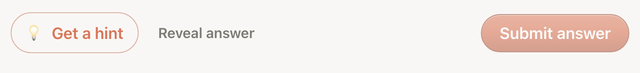
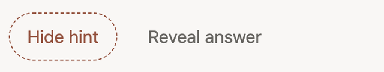
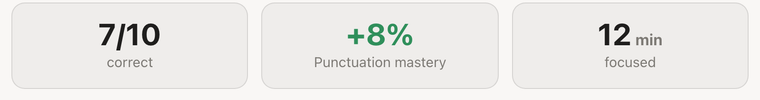
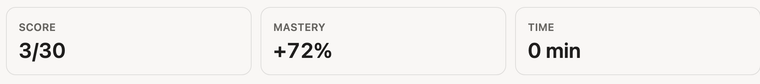

# Epic A — Trust-bug hardening · **Sprint Board**

**Epic goal** (from [epics doc](preact-parity-epics.md#epic-a--trust-bug-hardening-)): eliminate
controls that are *present but lie*. First release of the parity program — small, low-risk, ships
value the same day.

**Findings in scope:** `Q-6` (dead "Reveal answer" button), `S-2b` (Summary "time" reads "0 min").

> ⚠️ **This board revises the report's read of both findings** based on a code-seam scout
> (2026-07-09). The changes are folded in below and back-propagated to the parity report:
>
> - **`S-2b` is probably NOT a defect.** The elapsed-time wiring already exists end-to-end and is
>   unit-tested — `timeTile()` returns "12 min" for a real gap and "—" when a session is still
>   open. The report's "0 min" was a **capture artifact**: the Playwright walk opened *and* closed
>   the session inside the same wall-clock minute, which legitimately rounds to 0. So A2 is a
>   **triage sprint**, not a fix sprint — it confirms-or-finds a real bug before any code.
> - **`Q-6` is a dead control** (no `onClick`). The earlier "FR-D5 vs FR-D6 contradiction" framing
>   was **refuted** (A0). Stage-1 further showed prototype Reveal = **submit→Feedback alias**, not
>   an in-place letter reveal. A1 direction is **D6+D1** (see §A1).

---

## Sprint ladder (release order within the epic)

| Sprint | Title | Finding | Type | Releasable alone? | Blocks |
|--------|-------|---------|------|-------------------|--------|
| **A0** | Correct the record (audit-refuted premises) | `Q-6` framing | Docs-only — no production code | ✅ yes | A1 (removes A1's blocking decision) |
| **A1** | Resolve the "Reveal answer" control | `Q-6` | **D6+D1** — ✅ CLOSED 2026-07-09 | ✅ yes | — |
| **A2** | Triage Summary "0 min" | `S-2b` | Triage → *(fix only if real)* | ✅ yes | — |

A1 and A2 are **independent** (different screens/VMs, no shared code) and can ship in either order
or in parallel PRs. A1 is ranked first (it's a *certain* defect; A2 may resolve to "no bug").

> ⚠️ **A0 added 2026-07-09 (post-brainstorm).** The `sdd-brainstorm` premise audit for A1
> **refuted** this board's load-bearing premise — that FR-D5 and FR-D6 *contradict*. They do not
> (evidence in A0 below). A0 is the "correct-and-continue" sprint the brainstorm hardening mandates
> ([decisions.md 2026-07-02 premise-audit entry](../adr/decisions.md)): it lands the record
> corrections **before** A1 implements D6+D1 (no longer "adjudicate a contradiction"). A0 is
> **docs-only** and touches no VM/reducer, so it ships independently of A1/A2.

---

## Sprint A0 — Correct the record (audit-refuted premises)  🟦 *(docs-only)*

**Origin:** the `sdd-brainstorm` Stage-1 premise audit (2026-07-09) for A1. Per the brainstorm
hardening rule, a **refuted load-bearing premise forces a re-pose** — captured here as tracked work
rather than silently continued. A0 corrects the record so A1 re-enters `sdd-spec` over the *true*
problem space (a dead control to close), not a phantom contradiction to adjudicate.

**Premise-status table (what the audit found):**

| # | Premise (as this board stated it) | Status | Evidence (verified `file:line`) |
|---|---|---|---|
| P1 | `quiz-reveal` renders a labelled button with **no `onClick`** | **verified** | [QuizView.tsx:105-111](../../frontend/components/quiz/QuizView.tsx:105) |
| P2 | The VM structurally omits the answer letter | **verified** | [quiz_item_vm.ts:24-32](../../frontend/lib/translators/quiz_item_vm.ts:24) — `answer_letter` is on the wire `Question` but dropped by `toQuizItemVM` |
| P3 | FR-D5 and FR-D6 are **real, enumerated** requirements | **verified** | canonical UI spec [preact-english-coach-ui.spec.md:173-177](preact-english-coach-ui.spec.md:173) |
| **P4** | **FR-D5 and FR-D6 contradict each other** | **REFUTED** | FR-D5 (`:173-175`) constrains **"Get a hint"** ("SHALL NOT reveal the correct answer"); FR-D6 (`:176-177`) only says render **"Reveal answer" as a … ghost control separate from 'Get a hint'** — **silent on gating/behavior**. No clash. The "contradiction" is a **code-comment over-read** at [QuizView.tsx:104](../../frontend/components/quiz/QuizView.tsx:104) ("Reveal is a … sanctioned control") that this board then inherited. |
| P5 | Resolution recorded in `decisions.md` | **verified absent** | grep: no FR-D5/FR-D6 entry as of 2026-07-09 |
| **P6** | (implicit) FR-D5 / FR-D6 are **unique** requirement IDs | **REFUTED (noise)** | the **engine** spec [preact-english-coach-engine.spec.md:173-184](preact-english-coach-engine.spec.md:173) reuses the *same* IDs for **unrelated** requirements (D5 = `used_hint` persistence; D6 = recommended-next-drill). Any bare "FR-D6" is ambiguous — the record must cite the **UI** spec by path. |

**The re-posed problem (corrected space):** A1 is **not** "adjudicate a spec contradiction" (there
is none). It is **(a)** close a **trust bug** — a labelled control that lies (`Q-6`) — and **(b)**
fix a **documentation-fidelity bug** — the over-strong FR-D6 paraphrase that manufactured the
phantom contradiction. FR-D6 *as written* mandates only that the control **render**; it is silent
on when Reveal may fire, which is the design latitude A1 will spend.

**Sprint tasks (docs-only — no `.tsx`/reducer/VM change; that is A1):**

1. **Fix the code comment (fidelity).** Rewrite [QuizView.tsx:104](../../frontend/components/quiz/QuizView.tsx:104)
   so it no longer paraphrases FR-D6 as a *"sanctioned control"*. It should state what FR-D6
   actually says: *"FR-D6: Reveal answer is a separate, low-emphasis (ghost) control; gating is
   unspecified by FR-D6 and decided in [A1]."* (This is the **only** file A0 touches under
   `frontend/` — a comment edit, not behavior, so no test moves.)
2. **Record the resolution in `decisions.md`.** Append a newest-first entry: FR-D5 and FR-D6 are
   **compatible** (hint-non-reveal vs. a separate control's existence), cite the **UI** spec by path,
   flag the **engine-spec ID collision** (P6) so future readers don't conflate them, and note that
   the Reveal behavior decision itself is deferred to A1 (D6+D1).
3. **Back-propagate to the parity docs.** Update:
   - this board's **"Notes carried back to the parity report"** §  and the A1 section's **"blocking
     decision"** framing (strike "self-contradictory"; replace with "dead control + doc-fidelity
     bug; FR-D6 gating unspecified");
   - [preact-parity-epics.md:97,111-112](preact-parity-epics.md:97) — the `Q-6` row + Gates line
     still say "FR-D5/FR-D6 contradiction"; correct to "close the dead control (no contradiction)";
   - [preact-ui-prototype-parity-VISUAL-gap-report.md](preact-ui-prototype-parity-VISUAL-gap-report.md)
     §11/§0 `Q-6` status → "trust bug: dead control; FRs compatible" (keeps the visual clip evidence).

**Definition of Done (A0):** the phantom contradiction is erased everywhere it was asserted (code
comment + this board + epics doc + VISUAL report), a `decisions.md` entry records the
FR-compatibility finding **and** the ID-collision caveat, and A1's framing is D6+D1 (gated submit
alias), not in-place reveal. **No production code, no test change** → `make check` green trivially
(the single `.tsx` edit is a comment). Explicitly log that A0 **corrected the record**, it did not
fix the control (that is A1) — so "green" is not mistaken for "Reveal fixed."

**Gates:** No `⚠️ Ask first` trigger (docs + one comment). This is the **G7/comprehension** payload
the brainstorm surfaced: intent debt (why the "contradiction" was wrong) captured before code. No
ADR (a `decisions.md` entry is the right weight — no structural change).

**Releasable alone:** ✅ — pure docs/comment PR; unblocks A1 by removing its false premise. Ships
first.

---

## Sprint A1 — Resolve the "Reveal answer" control  ✅ CLOSED 2026-07-09

**Report finding (pre-fix):** `Q-6` — `data-testid="quiz-reveal"` rendered a labelled button with
**no `onClick`**; clicking did nothing. Closed as a **gated submit alias** (D6+D1).

**Visual anchor** (pre-fix crops — kept for the trust-bug record):

| Prototype — Reveal is a real control | App (pre-A1) — Reveal was inert |
|---|---|
|  |  |

**Shipped seams (D6+D1):**

| Seam | Location | Role |
|------|----------|------|
| Reveal → submit | [QuizView.tsx](frontend/components/quiz/QuizView.tsx) | `onClick={onSubmit}` + `disabled={!submittable}` + `data-enabled` |
| Submit gate mirrored | same file | same `disabled` / `data-enabled` pattern as Submit |
| `onSubmit` threaded | [quiz/page.tsx](frontend/app/(coach)/learn/quiz/page.tsx) | unchanged — no new page props |
| Answer stays off Quiz VM | [quiz_item_vm.ts](frontend/lib/translators/quiz_item_vm.ts) | **unchanged** — Feedback owns the letter |
| Reducer | [quiz_screen_reducer.ts](frontend/components/quiz/quiz_screen_reducer.ts) | **unchanged** — no `revealed` action |

**Direction (Stage-1 CLOSED — [brainstorm](preact-parity-epic-A.brainstorm.md)):**
**D6+D1** — UI FR-D6a + Reveal as a **gated submit alias**. No spec contradiction (A0). Prototype
Reveal shares `submit` → Feedback; Options 1/3 (in-place letter) **rejected**.

| Was (superseded) | Now (shipped) |
|---|---|
| Option 1 — in-place post-submit letter + VM field | **Rejected** — non-prototype; second answer surface |
| Option 2 — remove the button | **Deferred** (D2) — not chosen this sprint |
| Option 3 — disable pre- / wire post-submit letter | **Rejected** — conflated with in-place reveal |
| — | **D6+D1** — UI FR-D6a; `quiz-reveal` → same `onSubmit` as Submit; disabled when no selection |

**Spec + plan:** [preact-parity-A1-reveal.spec.md](preact-parity-A1-reveal.spec.md) *(Accepted)* ·
[preact-parity-A1-reveal.plan.md](preact-parity-A1-reveal.plan.md) *(Accepted — A1 implement closed)*

**EARS (summary):** WHILE no choice selected → Reveal non-actionable (FR-1); WHEN selected + Reveal
→ same submit path as Submit (FR-3); `QuizItemVM` still omits answer letter (FR-2); UI FR-D6a
documents the behavior (FR-5).

**Tests / validation:**
- L1: [QuizView.test.tsx](../../frontend/components/quiz/QuizView.test.tsx) — FR-1/FR-3/FR-4 (red first, then green)
- E2E walk: [validate_a1_reveal.spec.ts](../../frontend/e2e/learn/validate_a1_reveal.spec.ts) · `pnpm test:e2e:a1-reveal`
- Manual UI: [validate_a1_reveal_ui.md](../../frontend/scripts/validate_a1_reveal_ui.md)

**Definition of Done:** ✅ Reveal is a gated submit alias; UI FR-D6a landed; `decisions.md` records
D6+D1 + rejected in-place/remove; tests seen red first; closed via **submit alias**, not in-place
reveal.

**Gates:** No `⚠️ Ask first`. Frontend F-R1 / T1. Decision in `docs/adr/decisions.md`.

**Releasable alone:** ✅ — QuizView + UI-spec docs (+ `decisions.md` / board / validation). No reducer/VM.

---

## Sprint A2 — Triage Summary "0 min"  🟨 *(triage, not a fix)*

**Report finding:** `S-2b` — Summary `data-testid="summary-time"` showed "0 min". **Downgraded**
from "🟥 latent defect (elapsed not threaded)" to **"triage: likely capture artifact"** by the
scout.

**Visual anchor** (summary stat tiles — the TIME tile is the one in question):

| Prototype — "12 min focused" | App (captured) — "0 min" |
|---|---|
|  |  |

> The "0 min" is what triggered the finding — but per the scout, `timeTile()` already computes
> real minutes and the walk simply opened+closed the session inside one wall-clock minute (note
> the app's **3/30** score = a fast automated 30-question walk). The prototype's "12 min" is a
> hard-coded demo value, not a live timer. **This pair is what A2 must reproduce against a real
> multi-minute session** to decide artifact-vs-bug.

**Why downgraded (scouted evidence):** the wiring the report assumed missing **already exists and
is unit-tested**:

| Seam | Location | Evidence |
|------|----------|----------|
| Render | [SummaryView.tsx:52](frontend/components/summary/SummaryView.tsx:52) | `summary-time` reads `summary.timeTile` |
| Compute | [session_summary_vm.ts:49-54](frontend/lib/translators/session_summary_vm.ts:49) | `timeTile()` = minutes from `ended_at − started_at` |
| Persist | [drizzle_session_repo.ts:77-78,117](frontend/lib/adapters/engine/repos/drizzle_session_repo.ts:77) | `started_at` on `open()`, `ended_at` on `close()` |
| Close-before-Summary | [quiz/page.tsx:161-178](frontend/app/(coach)/learn/quiz/page.tsx:161) | `onFinish` calls `closeSession()` before routing |
| Proof it's correct | [session_summary_vm.test.ts:23-24,49-51,82](frontend/lib/translators/session_summary_vm.test.ts:23) | returns **"12 min"** for a 12-min gap, **"—"** (not "0 min") when unclosed |

The Playwright capture opened and closed the session **within the same minute** → `timeTile()`
correctly rounds to 0. So the observed "0 min" is **expected behaviour for an instant session**,
not a bug.

**Sprint task (a spike, gated on outcome):**
1. **Live-repro triage.** Walk a *real* multi-minute session (or inject a >1-min gap) and read
   `summary-time`. Candidate real-bug sources if it *still* shows 0: a stale/cached session row in
   [use_summary.ts:64-119](frontend/components/summary/use_summary.ts:64) `loadSummary()`, a
   code path other than `page.tsx onFinish`, or minute-flooring being too coarse (product may want
   "<1 min" copy instead of "0 min").
2. **Branch on the finding:**
   - **No real bug** → close A2 with a `decisions.md` note ("`S-2b` = capture artifact; instant
     sessions render 0 min by design") + optionally an **e2e assertion** so a real gap is checked
     going forward (today [full-session.spec.ts:138-142](frontend/e2e/learn/full-session.spec.ts:138)
     skips `summary-time`). No production code change. **This closes the sprint.**
   - **Real bug found** → *then* author `preact-parity-A2-summary-time.spec.md` with EARS FRs and
     fix TDD (red first). Likely a stale-read fix in `use_summary`, not new plumbing.

**Definition of Done (triage):** the "0 min" observation is **explained with a live repro**;
either a `decisions.md` entry closing it as expected + a regression e2e guard, **or** a real
defect is specced and fixed with a test seen to fail first. `make check` green.

**Gates:** No `⚠️ Ask first` trigger. If it closes as "no bug," the only artifact is a
`decisions.md` line + (optionally) a strengthened e2e — **explicitly log that the sprint added a
guard, not a fix**, so "green" isn't mistaken for "fixed a bug that wasn't there."

**Releasable alone:** ✅ — either a docs/test-only change or a small isolated `use_summary` fix.

---

## Epic-A exit criteria (what "released" means)

- [x] **A0 shipped:** the phantom FR-D5/FR-D6 "contradiction" is corrected everywhere (code comment
      + this board + epics doc + VISUAL report); `decisions.md` records the FR-compatibility finding
      + the engine-spec ID-collision caveat; A1 framing = D6+D1 (not in-place reveal). Docs-only.
- [x] **A1 implemented (this commit):** `quiz-reveal` is a gated submit alias (UI FR-D6a);
      `QuizItemVM` still non-revealing; D6+D1 recorded in `decisions.md`; test seen to fail first;
      L1 + E2E validation artifacts landed. *(Merge to `origin/main` still pending push.)*
- [ ] **A2 resolved:** "0 min" explained via live repro; closed as artifact-with-guard **or** real
      defect fixed; gates green; merged to `main`.
- [ ] Parity report §11 / §0 updated to reflect the corrected status of `Q-6` and `S-2b`
      (`Q-6` closed by A1; `S-2b` still pending A2).
- [ ] **Gate to Epic B:** with A1+A2 on `main`, return to the [epics doc](preact-parity-epics.md)
      and the user opens Epic B's board. (One epic in flight at a time.)

---

## Notes carried back to the parity report

The scout invalidated two report claims; the report has been corrected (see its §0/§11):
- `S-2b` "elapsed not threaded into VM" → **wrong**; it's threaded + tested. Reclassified as a
  capture artifact pending A2 triage.
- `Q-6` "just wire or remove" → **incomplete** at report time (dead control + over-strong comment).

**Update 2026-07-09 (A1 brainstorm + implement — supersedes the earlier `Q-6` notes above):**
- The claimed **FR-D5/FR-D6 contradiction was itself refuted.** The canonical UI spec
  ([ui.spec.md:173-182](preact-english-coach-ui.spec.md:173)) is coherent: FR-D5 constrains the
  hint; FR-D6 requires a *separate ghost control*; **FR-D6a** (A1) states Reveal is a gated
  submit alias. The "contradiction" was a **code-comment over-read** — corrected by A0 + A1.
- Prototype Reveal is **not** an in-place letter reveal → board Options 1/3 **rejected**;
  direction **D6+D1** (see §A1). `QuizItemVM` stays non-revealing; Feedback owns the letter.
- Separately, the FR-D5/FR-D6 **IDs collide** with the *engine* spec
  ([engine.spec.md:173-184](preact-english-coach-engine.spec.md:173)), which reuses them for
  unrelated requirements — any citation must name the **UI** spec by path. A0 records this caveat.

**Update 2026-07-09 (A1 CLOSED):** `Q-6` fixed — `quiz-reveal` is a gated submit alias
(`disabled` pre-select; `onClick={onSubmit}` post-select). Spec/plan Accepted; L1 tests +
Playwright walk + manual UI script landed. Next on this board: **A2 triage** for `S-2b`.
