# PreAct English Coach — Prototype ↔ App Parity Gap Report *(canonical)*

**Date:** 2026-07-09 · **Branch:** `main` (post PR #136–#139: S3/S4/S5 bounded-session epic shipped)
**Surface captured:** desktop only, 1280×900 @2×, light theme (dark spot-checked)
**Method:** live `/learn` dev server walked end-to-end with Playwright; the prototype rendered over
HTTP and driven through its flow (`English Coach - Prototype.html` for screens 1–5,
`English Coach - Screens.html` storyboard for screens 6–7). Every claim is anchored to a paired
screenshot **and** cross-checked against the design spec (§2/§5/§6/§7) and the prototype's own
Playwright E2E suite (the behavior oracle). Coverage checklist in [§9](#9-spec--e2e-coverage-checklist).

> **This document SUPERSEDES** the Stage-1 matrix
> ([preact-ui-prototype-parity-gap-matrix.md](preact-ui-prototype-parity-gap-matrix.md), 2026-07-08).
> That matrix was a behavior-oracle mapping written **before** S3/S4/S5 shipped, so several of its
> `🔴 missing` rows are stale (progress bar, bounded session, done-state, clickable card, CTA
> contrast all landed since). This report folds in its still-valid rows, re-renders both sides at
> current state, **adds screens 6–7** (Skill detail, Progress) the matrix left as one-liners, and
> ties every finding to the spec + E2E oracle. Treat the matrix as historical; use this doc.

**All 7 designed screens are covered here** (the README/spec define 7; the prototype's *clickable*
demo only exposes the 5 core flow screens, so 6–7 are captured from the storyboard). App status for
6–7 is **unbuilt** (both routes 404; nav item present but disabled).

---

## Legend

**Severity** (impact on shipping prototype parity):

| Tag | Meaning |
|-----|---------|
| 🟥 **Blocker** | Screen/flow is fundamentally absent or broken vs the design intent; a user would notice immediately. |
| 🟧 **Major** | A whole designed component/affordance is missing; the screen works but is visibly thinner than the design. |
| 🟨 **Minor** | Present but diverges — copy, labels, ordering, secondary affordance. |
| 🟦 **Cosmetic** | Styling/spacing/wording nuance; no functional loss. |
| 🟩 **Parity** | App matches the prototype's intent (may differ in incidental data). |
| ➕ **App-only** | App has it, prototype doesn't (usually keep + document). |

**Screenshots:** `docs/plan/assets/preact-parity-2026-07-09/{app,proto}/`.

---

## 0. Executive summary

The bounded-session spine (S3→S4→S5) has **closed the biggest reported pain** — the quiz is no
longer an infinite loop. The live app now has a real **"Question N of 30"** progress bar, a
**done-state milestone banner** at the target, target-gated button relabels, and a working
**Summary** with a **solid (visible) "Practice this next" CTA**. Those were the top items on the
old matrix and they are genuinely done — verified live, not just in tests.

What remains is a **depth-of-screen** gap, concentrated in three places:

1. 🟥 **Coach screen** — the prototype ships a fully-realized coaching surface (context rail,
   honest history trust line, derived-mode display (not free switcher), seeded Socratic conversation, quick-reply
   chips). The live `/learn/coach` is an **empty shell**: title + composer, nothing else. This is
   the single largest screen-level gap.
2. 🟧 **Dashboard right rail** — the prototype's score-goal / streak / weekly-sessions / coach-note
   rail and the **"Let's get you to 28, Maya."** greeting are entirely absent from the app.
3. 🟧 **Summary misconception write-up** — the prototype's accent "The misconception I spotted"
   narrative (the emotional payoff of the whole loop) has no counterpart in the app.

Plus a scatter of 🟨 minors (session length **30 vs 10**, End-session affordance, collapsible timer,
skill chip on the quiz, ACT-standard bucket names, green-span recap, misconception-framed titles)
and one 🟥 latent defect surfaced by this pass: **`Reveal answer` is a dead placeholder** in the app
(has a `data-testid`, no `onClick`). A second suspected defect — **Summary "time" reads `0 min`** —
was **downgraded on code review** (see [Epic A board](preact-parity-sprint-board-A.md)): the elapsed
time *is* threaded and unit-tested (`timeTile()` returns real minutes; "—" when unclosed), so the
`0 min` here is a **capture artifact** — the automated walk opened and closed the session inside one
wall-clock minute. It's pending a live-repro triage, not confirmed broken.

Two whole screens — **Skill detail (§6)** and **Progress (§7)** — are **unbuilt in the app** (both
routes 404; the "Progress" nav item is a disabled placeholder). They're the largest but lowest-
urgency gaps: each needs its own route + engine read, so they're the ship-last items (#11/#12).

**Coverage.** All **7 designed screens** are graded here (5 with side-by-sides, 2 unbuilt screens
paired against the prototype-only render). Every spec §5/§6/§7 item and every prototype-E2E assertion
is mapped in [§12](#12-spec--e2e-coverage-checklist) — nothing the oracle asserts is left uncovered.
Two honesty caveats: (1) the app's Coach screenshot is **chrome-only** — the standalone `/learn/coach`
needs a live agent backend this UI-only pass didn't stand up, so the Coach analysis leans on the
prototype + code/VM evidence (the "empty shell" is what the app renders without a backend — itself the
point, as there's no seeded/offline coach state). (2) **Desktop only** — iPhone/iPad surfaces and the
iPad `CoachPanel` split (spec §5 variants + 2 device E2E specs) were read for context but not rendered.

---

## 1. Screen — Dashboard / Home

| | |
|---|---|
| **Prototype** | 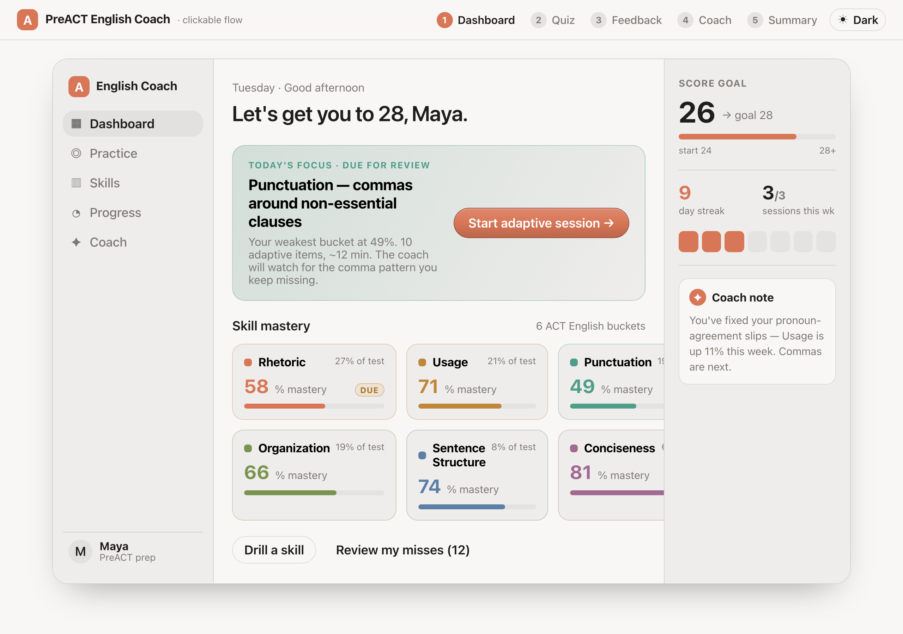 |
| **App (live)** | 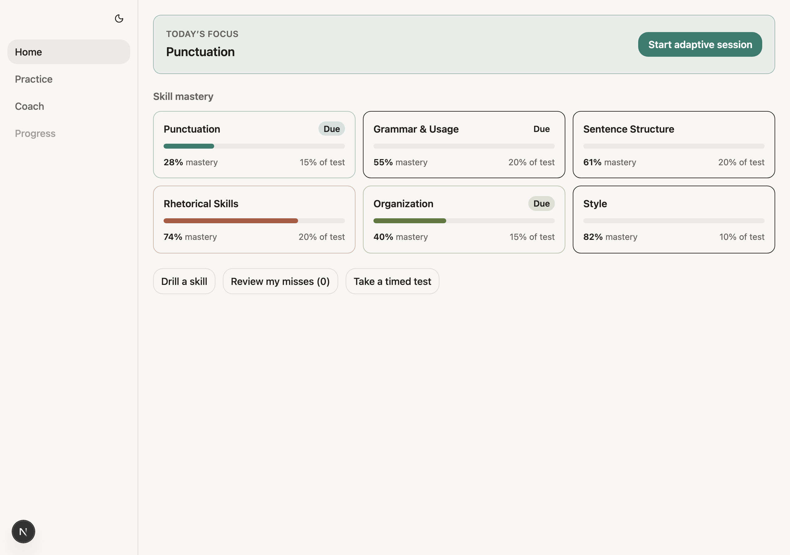 |

**At a glance:** the app has the *center column* (Today's Focus + 6-bucket mastery grid + secondary
actions) and it's clean and on-brand. The prototype has that **plus a full left identity block, a
personalized greeting, and a rich right rail** — roughly a third more surface.

| # | Prototype affordance | App status | Sev | Fix pointer |
|---|---|---|---|---|
| D-1 | Greeting **"Let's get you to 28, Maya."** + "Tuesday · Good afternoon" | 🟩 shipped (C1) | ✅ | `greeting_vm.ts` + `DashboardView.tsx` `<header>` — time-of-day + title-cased learner id + Intl subline (score-goal copy deferred with D-5-goal) |
| D-2 | Today's Focus banner + "Start adaptive session" CTA | 🟩 present | 🟩 | — |
| D-2b | Today's Focus **body copy**: "Your weakest bucket at 49%. 10 adaptive items, ~12 min. The coach will watch for the comma pattern you keep missing." | 🟡 thinner | 🟨 Minor | app shows bare skill name ("Punctuation") only; add supporting line to `TodayFocusBanner.tsx` |
| D-3 | 6-bucket mastery grid (%, share, bar, Due) | 🟩 present | 🟩 | — |
| D-3b | Bucket **names** use ACT-standard labels: **Rhetoric / Usage / Conciseness** + colored dot per bucket | ✅ **Resolved (D2)** | 🟩 | Renamed in `_dev_seed.ts` + fixtures; `BucketCard` header dot via `--accent`. Spec: [preact-parity-D2-taxonomy.spec.md](preact-parity-D2-taxonomy.spec.md). |
| D-4 | Bucket card click → skill drill | ✅ **now clickable** | 🟩 | `BucketCard.tsx` renders `<Link href="/learn/quiz?focus=s-…">` (was inert `<article>` in the matrix — **fixed**). ⚠️ caveat: `?focus=` does not actually pin the scheduler (separate pre-existing gap). |
| D-5 | **Right rail**: SCORE GOAL 26→28 (bar, start 24 / 28+), **9-day streak**, **3/3 sessions this wk** (session squares), **Coach note** | 🟨 partial (C1) | 🟧 Major | streak + weekly shipped (`streak_vm` / `weekly_sessions_vm` + rail aside); score-goal + coach-note still open → Epic F |
| D-6 | Left rail identity: "English Coach" brand + **"Maya / PreACT prep"** user block | 🔴 absent | 🟨 Minor | app sidebar has nav only, no brand/user footer |
| D-7 | Secondary actions "Drill a skill" / "Review my misses (N)" | 🟡 partial | 🟨 Minor | both `→ /learn/quiz` (matrix D-6); count is real; "Review misses" not a distinct destination |
| D-8 | Sidebar nav: Dashboard / Practice / **Skills** / Progress / Coach (5) | 🟡 partial | 🟨 Minor | app nav = Home / Practice / Coach / Progress (4) — **no "Skills"** entry; Progress greyed (`comingSoon`). **Gated on Epic E's `/learn/skill` route** — do not enable until E lands, or ship as `comingSoon` (adding to `NAV_MEMBERSHIP` before E = dead nav item, Q-6 class) |
| D-9 | Header flow-step pills (1–5 Dashboard…Summary) | 🔴 absent | 🟦 Cosmetic | prototype scaffolding (a demo navigator) — **do NOT port**; document only |
| — | "Take a timed test" → `/learn/test` (Test Mode) | ➕ app-only | ➕ | keep; prototype has no timed-test concept |

---

## 2. Screen — Quiz / Drill  *(the core loop)*

| | |
|---|---|
| **Prototype (answering)** | 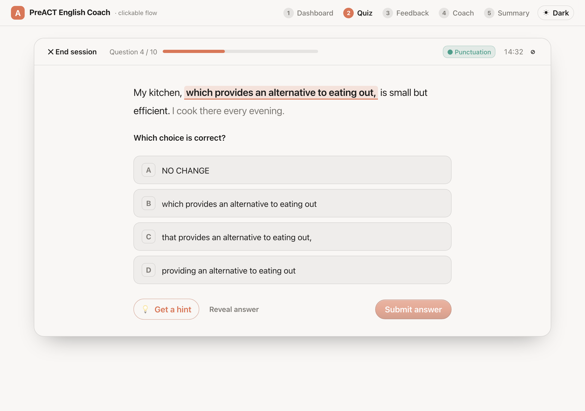 |
| **App (answering, fresh)** | 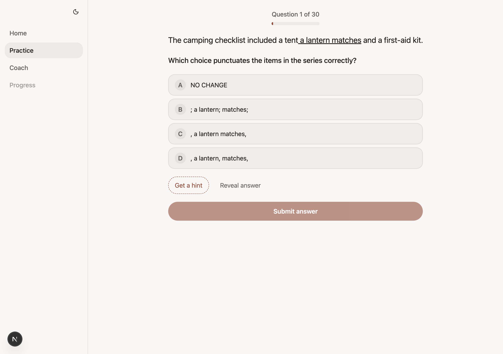 |
| **App (hint open)** | 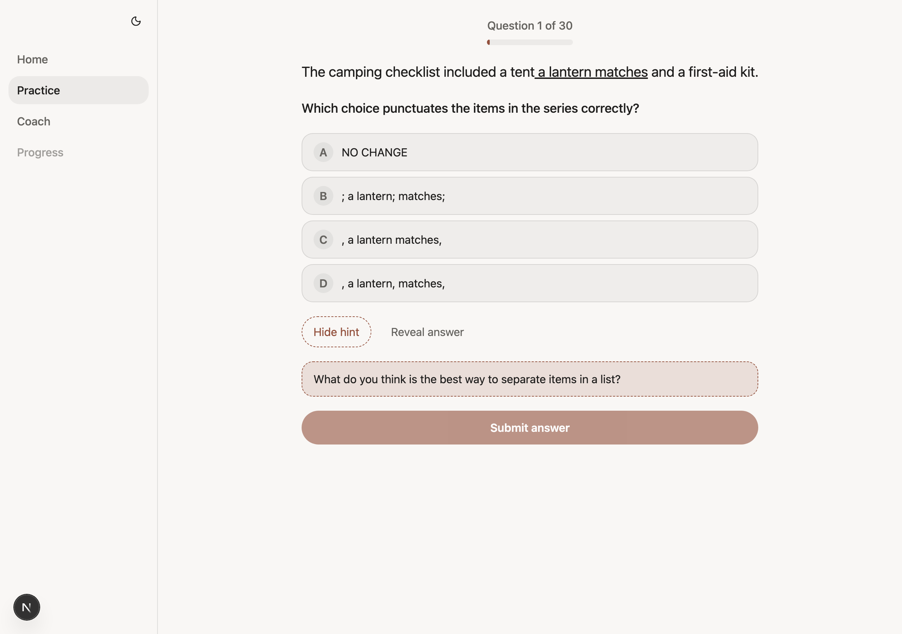 |

**At a glance:** structurally very close now — both have the top progress counter + bar, context
sentence with underlined span, stem, 4 lettered choices (A = NO CHANGE), hint/reveal/submit. The
prototype wraps the quiz in a **session frame** (End-session control, skill chip, collapsible / off-by-default timer)
that the app doesn't render, and the app's session length is **30** vs the prototype's **10**.

| # | Prototype affordance | App status | Sev | Fix pointer |
|---|---|---|---|---|
| Q-1 | Top progress: **"Question N / M" + bar** | ✅ **shipped (S4)** | 🟩 | `QuizProgress.tsx` — "Question 1 of 30" + `quiz-progress-fill`. **Was 🔴 in matrix.** |
| Q-1b | Session length **M = 10** | ✅ **Resolved** — keep 30 | 🟩 | Product answer 2026-07-11: keep `DEFAULT_TARGET_COUNT = 30` (ADR-0023 adaptive mastery signal). Prototype's 10 at `design-spec.md:143` is a sample-session narrative, not the product default. Cite: [`decisions.md` Q-1b line](../adr/decisions.md). |
| Q-2 | Context sentence + **underlined non-essential span** | 🟩 present | 🟦 Cosmetic | app renders `contextHtml`; span-highlight treatment is lighter than prototype's outlined pill |
| Q-3 | Stem + 4 choices (A = NO CHANGE) | 🟩 present | 🟩 | — |
| Q-4 | Submit gated until a choice is selected | 🟩 present | 🟩 | `canSubmit()` |
| Q-5 | Hint toggle → **Socratic nudge** ("What do you think is the best way to separate items in a list?"), labeled as *not* the answer | 🟩 present | 🟩 | `quiz-hint-toggle` → `quiz-hint` note; flips to "Hide hint" |
| Q-6 | **"Reveal answer"** as a real secondary affordance | 🐞 **dead** | 🟥 Blocker (latent) | `quiz-reveal` has the testid + label but **no `onClick`** — clicking does nothing. ⚠️ Not "just wire it": code carries a **FR-D5 (never reveal) vs FR-D6 (Reveal sanctioned) contradiction** + the VM omits the answer letter, so Reveal needs a *decision* first + a post-submit-gated VM field. See [Epic A board §A1](preact-parity-sprint-board-A.md). |
| Q-7 | **Skill chip** on the session frame ("● Punctuation") | 🔴 absent | 🟨 Minor | app shows no per-question skill tag |
| Q-8 | **"✕ End session"** (abandon → Dashboard) | 🔴 absent | 🟨 Minor | app has no mid-session abandon path (only Finish→Summary). Matrix Q-9. |
| Q-9 | **Collapsible / off-by-default timer** "14:32 ⊘↔⏱" | 🔴 absent | 🟨 Minor | `elapsed_ms` capture is already correct ([`session_summary_vm.ts:60-65`](../../frontend/lib/translators/session_summary_vm.ts:60) / A2 triage); app renders no visible clock today. Reframe: collapsible UI that starts collapsed — not a "dismissible" clock. Matrix Q-8, S7. |
| Q-10 | Bounded session (a first & last question, terminal at target) | ✅ **shipped (S3+S5)** | 🟩 | `target_count` + done-state. **Was 🔴 "infinite by design" in matrix.** |

---

## 3. Screen — Post-answer Feedback

| | |
|---|---|
| **Prototype** | 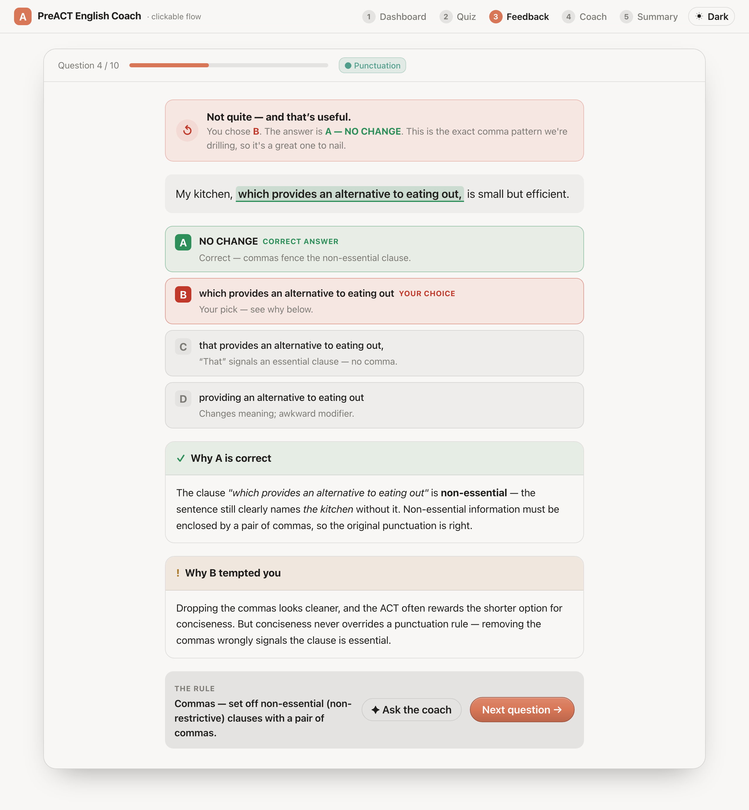 |
| **App** | 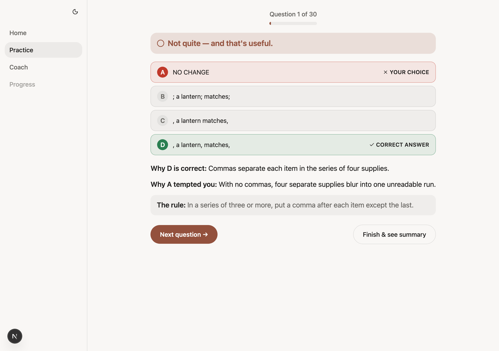 |

**At a glance:** the *content* is at parity — adaptive banner ("Not quite — and that's useful."),
per-choice CORRECT/YOUR CHOICE with icon+label (not color-only), "Why X is correct", "Why Y tempted
you", and "The rule". The prototype packages it **richer**: a green-highlighted sentence **recap**,
**per-choice inline micro-rationales**, sectioned cards with icons, and an **"Ask the coach"** action
next to Next.

| # | Prototype affordance | App status | Sev | Fix pointer |
|---|---|---|---|---|
| F-1 | Adaptive banner (correct/incorrect variants) | 🟩 present | 🟩 | `feedback-banner` "Not quite — and that's useful." |
| F-2 | Per-choice CORRECT / YOUR CHOICE (icon + text label) | 🟩 present | 🟩 | `ReviewedChoiceRow`; A11y-safe (not color-only) |
| F-3 | "Why A is correct" + "Why B tempted you" + "The rule" | 🟩 present | 🟩 | all three render |
| F-4 | **Sentence recap with correct span highlighted green** (distinct block) | 🟡 partial | 🟨 Minor | app shows choices+rationale but no separate green-span recap block. Matrix F-4. |
| F-4b | **Per-choice inline micro-rationale** on every option ("'That' signals an essential clause — no comma") | 🔴 absent | 🟨 Minor | app rationale is centralized in the Why-blocks; prototype annotates each row |
| F-5 | Sectioned **cards with icons** (✓ green header, ! amber header, "THE RULE" eyebrow) | 🟡 flatter | 🟦 Cosmetic | app uses plain bold-label paragraphs; prototype uses colored card headers |
| F-6 | Actions: **"✦ Ask the coach"** + "Next question →" | 🟡 partial | 🟧 Major | app standalone feedback has **only** Next/Finish; "Ask the coach" appears **only on the iPad split**, not desktop. Matrix F-5. |
| F-7 | Top progress bar persists on feedback | ✅ shipped (S4) | 🟩 | present. **Was 🔴 in matrix.** |

---

## 4. Screen — AI Coach Chat  🟥 **largest gap**

| | |
|---|---|
| **Prototype** | 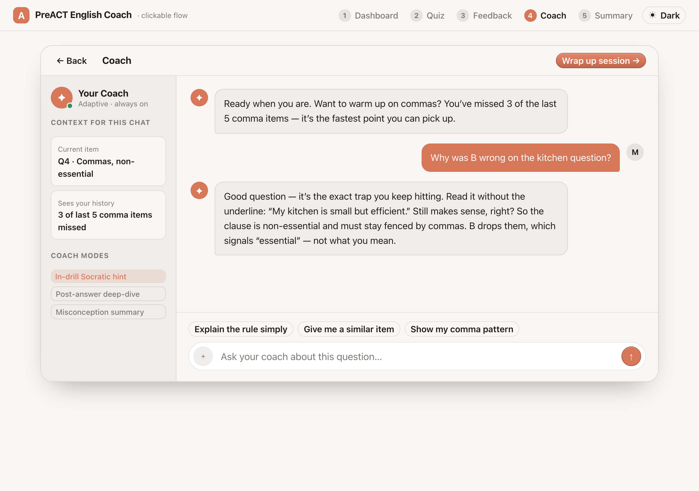 |
| **App (standalone, no backend)** | 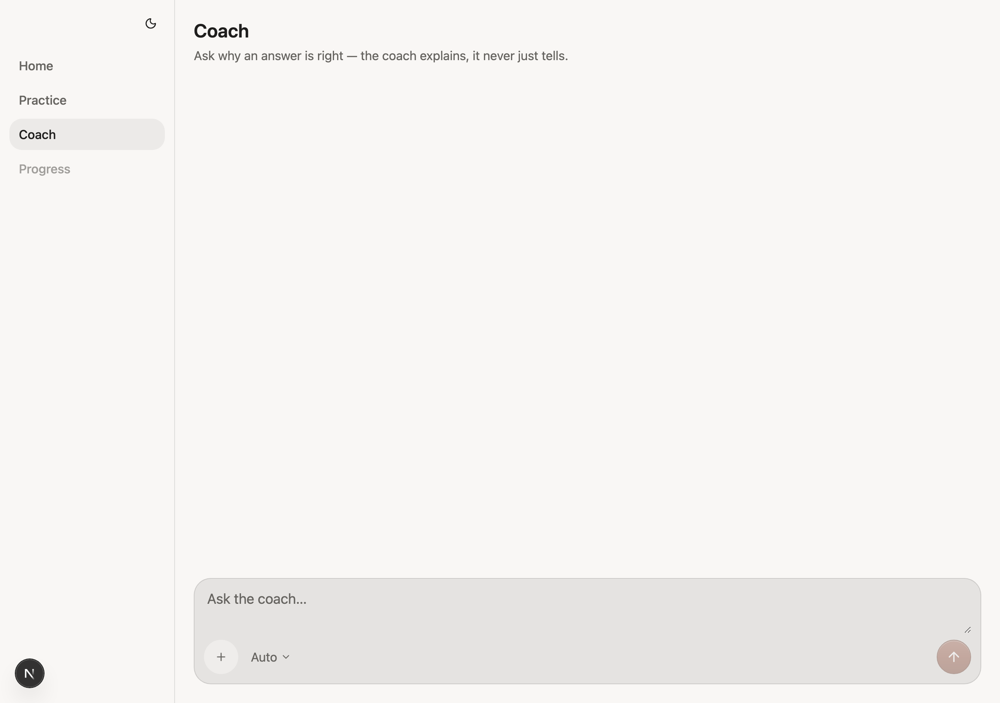 |

**At a glance:** these are barely the same screen. The prototype is a **complete coaching workspace**;
the app's `/learn/coach` is a **title + composer** with an empty conversation area.

| # | Prototype affordance | App status | Sev | Fix pointer |
|---|---|---|---|---|
| C-1 | Header: "Coach" + "← Back" + **"Wrap up session →"** | 🟡 partial | 🟨 Minor | app has title + subtitle only; no Back / Wrap-up |
| C-2 | **Context rail**: "Your Coach / Adaptive · always on" (status dot) | 🔴 absent | 🟧 Major | no left rail on the standalone screen |
| C-3 | Context: **"Current item: Q4 · Commas, non-essential"** | 🔴 absent | 🟧 Major | needs current-item wiring into the coach view |
| C-4 | **"Sees your history…" trust line** (prototype demo copy used "3 of last 5") | 🔴 absent | 🟧 Major | **B0/B1:** real `AttemptRepo.misses()` skill-scoped aggregate **or honestly absent** — never placeholder counts (AP-6) |
| C-5 | **COACH MODES** labels (In-drill Socratic / Post-answer deep-dive / Misconception summary) | 🔴 absent | 🟧 Major | **B0/B1 D5a:** display-only map onto 2 marker-derived modes — **not** a free learner switcher (ADR-0012) |
| C-6 | **Seeded conversation** (assistant opener + user turn + Socratic reply) | 🔴 empty | 🟥 Blocker | app conversation area is blank without a live agent; no offline/seeded state |
| C-7 | **Quick-reply chips**: "Explain the rule simply / Give me a similar item / Show my comma pattern" | 🔴 absent | 🟧 Major | composer present but no chips; matrix C-4 |
| C-8 | Composer: input + send + model picker | 🟩 present | 🟩 | "Ask the coach…" + "+ Auto ▾" + send |
| C-9 | iPad: coach as persistent RIGHT panel of split Quiz (shared thread) | ✅ present (iPad only) | 🟩 | `CoachPanel` in `quiz/page.tsx`; **not captured here** (desktop-only pass) |

> **Note on evidence.** C-6's "empty" is what `/learn/coach` renders locally with no agent backend
> reachable (the route streams `/api/coach/run/stream` from the BFF). The gap is real regardless:
> even with a backend the app has no context rail / modes / chips (C-2…C-7) — those are missing
> from the *component*, not just unpopulated. The iPad `CoachPanel` (C-9) is a richer surface than
> the desktop `/learn/coach` and is worth diffing separately in a future iPad pass.

---

## 5. Screen — Session Summary

| | |
|---|---|
| **Prototype** | 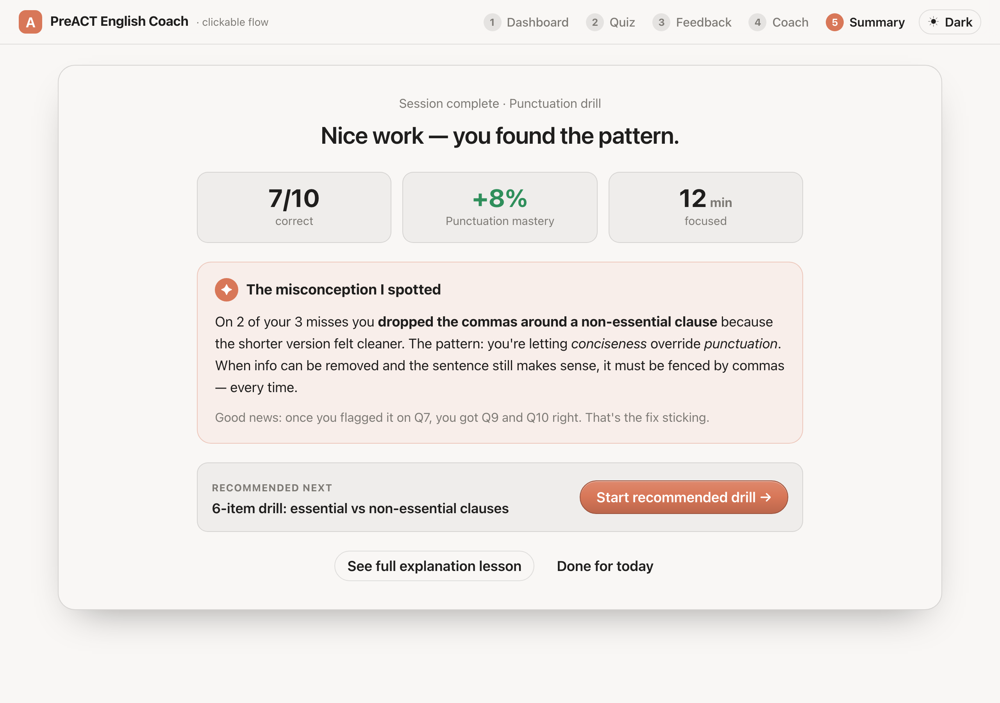 |
| **App** | 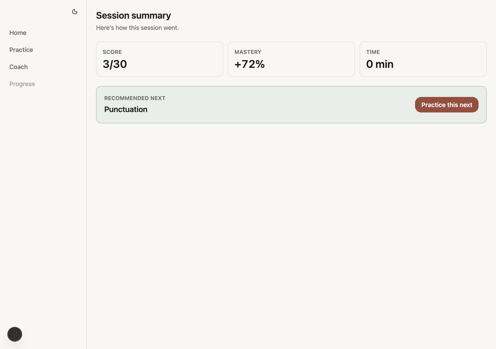 |

**At a glance:** the app has the **skeleton** (3 stat tiles + a recommended-next card with a **now-
visible** solid CTA) but is missing the **emotional core** — the misconception narrative — and uses
generic titles instead of the prototype's misconception framing.

| # | Prototype affordance | App status | Sev | Fix pointer |
|---|---|---|---|---|
| S-1 | Eyebrow "Session complete · Punctuation drill" + title **"Nice work — you found the pattern."** | 🟡 diverges | 🟨 Minor | app: "Session summary / Here's how this session went." — misconception-framed title not used. Matrix S-1. |
| S-2 | 3 stats (7/10 correct · +8% mastery · 12 min focused) | 🟩 present | 🟩 | `summary-score` / `summary-delta` / `summary-time` |
| S-2b | **"Time" stat is real** | 🟡 suspected → **downgraded** | 🟨 triage | Capture showed **"0 min"**, but code review found elapsed time **already threaded + unit-tested** (`timeTile()` → real minutes; "—" when unclosed). The walk opened+closed the session inside one minute → legit round-to-0. **Capture artifact**, pending live-repro triage — see [Epic A board §A2](preact-parity-sprint-board-A.md). |
| S-3 | **"✦ The misconception I spotted"** accent narrative card | 🔴 absent | 🟧 Major | app shows only a recommended-next card, no misconception write-up. Matrix S-3. |
| S-4 | Recommended-next card + CTA | ✅ **CTA now visible** | 🟩 | "Practice this next" is now a **solid accent fill, white text** — the matrix's 🐞 "invisible CTA" (S-4/S1) is **fixed**. |
| S-4b | Recommended-next names a **specific drill** ("6-item drill: essential vs non-essential clauses") | 🟡 thinner | 🟨 Minor | app names bare skill ("Punctuation") |
| S-5 | Recommended skill name **tappable** | 🐞 defect | 🟨 Minor | app "Punctuation" is static text, not a link (`summary-skill-link` intended). Matrix S-5. |
| S-6 | **Three** actions: Start recommended drill / See full explanation lesson / Done for today | 🟡 partial | 🟨 Minor | app has **one** ("Practice this next"); no "See full lesson" / "Done for today". Matrix S-6. |

---

## 6. Screen — Skill Detail / Tutorial  ⛔ **app unbuilt**

| | |
|---|---|
| **Prototype** | 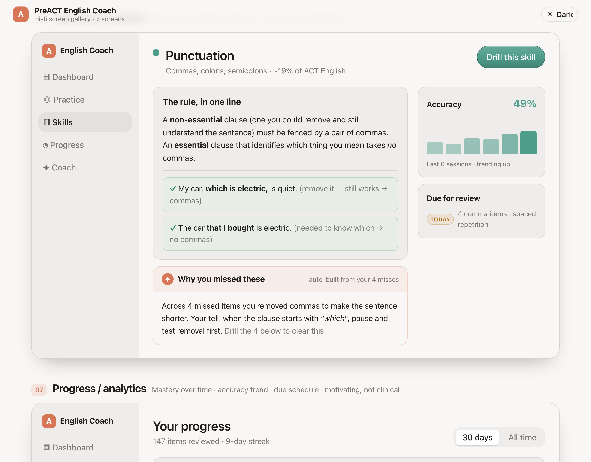 |
| **App** | *No route — `/learn/skill` returns **404**. Nav has no "Skills" item; the bucket cards link to a drill, not this screen.* |

**At a glance:** the prototype ships a full per-skill mini-lesson (spec §5.6); the app has **no
counterpart at all** — the route is unbuilt (`nav_model.ts` `skill: comingSoon:true`, no page file).
This is a *whole screen* gap, not a within-screen one. Confirmed by the prototype E2E
(`english-coach.spec.js`: a bucket card opens "The rule, in one line" + "Why you missed these"; "Drill
this skill" → Quiz; Summary → "See full explanation lesson" also lands here).

| # | Prototype affordance (spec §5.6) | App status | Sev | Fix pointer |
|---|---|---|---|---|
| SD-1 | Header: bucket dot + name + "Commas, colons, semicolons · ~19% of ACT English" + **"Drill this skill"** (bucket-tinted) | 🔴 unbuilt | 🟧 Major | needs `/learn/skill` route + `getTutorial` engine read |
| SD-2 | Left col: **"The rule, in one line"** + ✓ worked examples | 🔴 unbuilt | 🟧 Major | — |
| SD-3 | Left col: **"Why you missed these"** (auto-built from the learner's misses) | 🔴 unbuilt | 🟧 Major | needs miss-history aggregation |
| SD-4 | Right col: **Accuracy bar chart** (last 6 sessions, "trending up") | 🔴 unbuilt | 🟧 Major | needs per-skill session history |
| SD-5 | Right col: **"Due for review"** (TODAY · 4 comma items · spaced repetition) | 🔴 unbuilt | 🟨 Minor | FSRS due-count per skill |
| SD-6 | Entry points: bucket card → here · Summary "See full lesson" → here · "Drill this skill" → Quiz | 🐞 partial | 🟨 Minor | app bucket card goes straight to drill (skips this screen); Summary has no "See full lesson" |

---

## 7. Screen — Progress / Analytics  ⛔ **app unbuilt**

| | |
|---|---|
| **Prototype** | 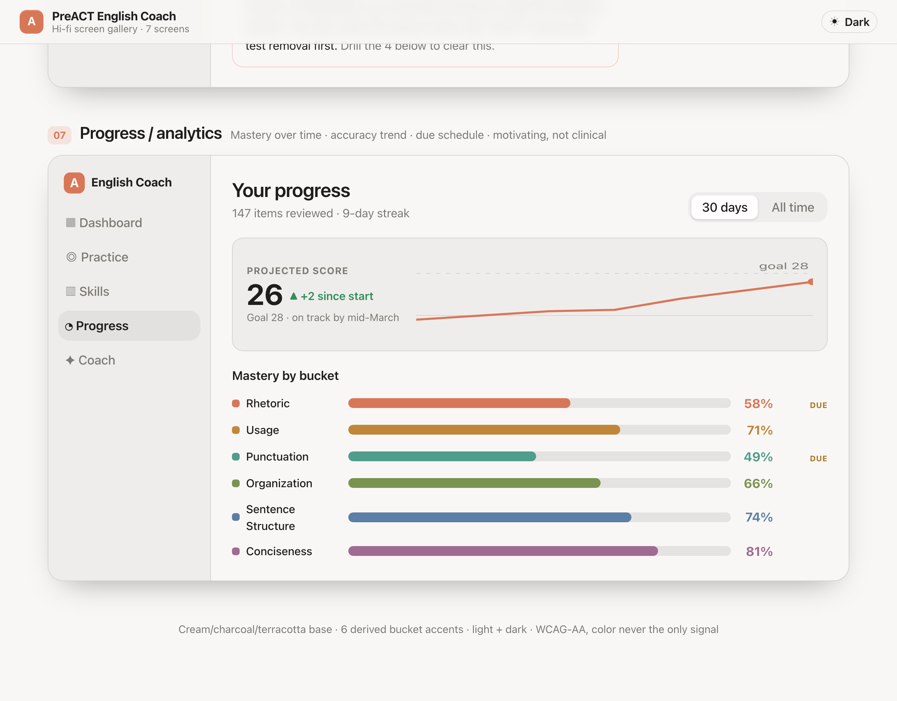 |
| **App** | *No route — `/learn/progress` returns **404**. The "Progress" sidebar item renders but is **disabled** (greyed, `href=""`) — visible in the dashboard capture.* |

**At a glance:** the prototype ships the long-term analytics view (spec §5.7); the app's "Progress"
nav item is a **disabled placeholder** (`comingSoon:true`) with no route. Confirmed by the prototype
E2E (`english-coach.spec.js`: "Your progress" + range tabs "30 days"/"All time" switch the trend
caption "on track by mid-March" ↔ "steady climb since you began").

| # | Prototype affordance (spec §5.7) | App status | Sev | Fix pointer |
|---|---|---|---|---|
| P-1 | Header "Your progress · 147 items reviewed · 9-day streak" | 🔴 unbuilt | 🟧 Major | needs `/learn/progress` route |
| P-2 | **Range tabs** (30 days / All time) that switch the trend | 🔴 unbuilt | 🟨 Minor | drives P-3 caption + line |
| P-3 | **Projected-score trend** (line chart, 26 ▲ +2, goal-28 guide line, "on track by mid-March") | 🔴 unbuilt | 🟧 Major | needs score-projection series + SVG chart |
| P-4 | **Mastery-by-bucket bars** (all 6 buckets, %, per-bucket color, Due flag) | 🔴 unbuilt | 🟧 Major | needs `listProgressPoints` engine read (plan D1) |
| P-5 | Disabled nav item present (not silently missing) | 🟡 partial | 🟨 Minor | `nav_model.ts` greys it; good affordance, but leads nowhere |

---

## 8. Done-state (app-only capture — closes the "infinite loop" epic)

The prototype never shows a done-state (its flow is a fixed 5-screen demo), so there's no side-by-side.
But this is the headline *shipped* item, worth showing:

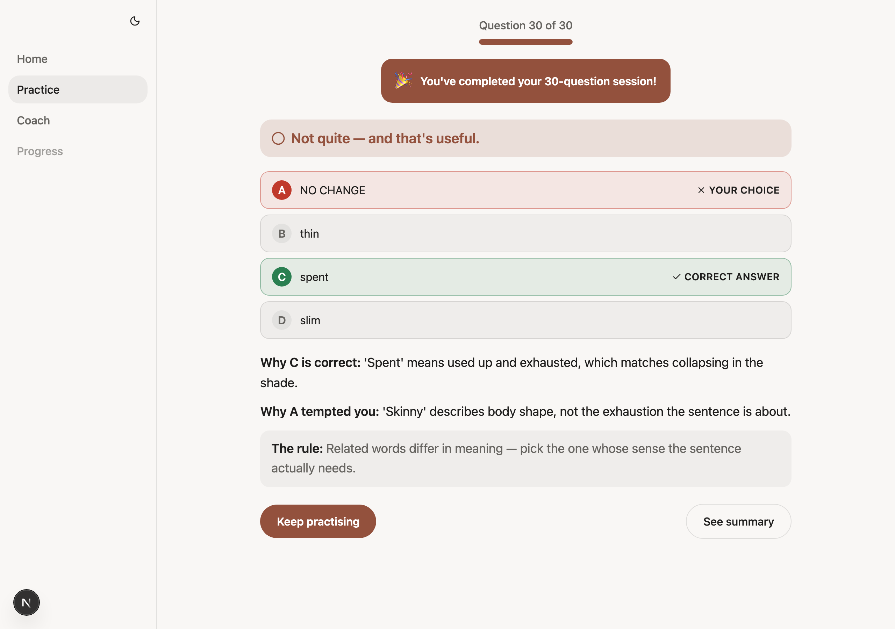

At Q30 the app renders **"🎉 You've completed your 30-question session!"** above the feedback, the
progress bar clamps full, and the buttons relabel **"Keep practising" / "See summary"** (target-gated
— verified: pre-target they read "Next question →" / "Finish & see summary"). This is the S5 milestone
+ retake. 🟩 **Parity with intent** (the intent came from the spec, not the prototype screen).

---

## 9. Cross-cutting

| # | Concern | App status | Sev | Note |
|---|---|---|---|---|
| X-1 | Theme toggle light ↔ dark | 🟩 present | 🟩 | app dark verified (`09-dashboard-dark`); prototype has a "Dark" toggle too |
| X-2 | Coming-soon plane: **Skill detail** + **Progress** screens | ⛔ unbuilt | 🟧 Major | now first-class [§6](#6-screen--skill-detail--tutorial--app-unbuilt) + [§7](#7-screen--progress--analytics--app-unbuilt); both 404. Backlog #11/#12. |
| X-3 | Brand accent | 🟩 close | 🟦 Cosmetic | both use terracotta/sage; prototype accent is slightly more saturated |
| X-4 | Bucket taxonomy mismatch | ✅ **Absorbed into D2** | 🟩 | Cross-cut duplicate of D-3b; closed by D2 rename + dots. Spec: [preact-parity-D2-taxonomy.spec.md](preact-parity-D2-taxonomy.spec.md). |

---

## 10. Reconciliation — what changed since the matrix

The 2026-07-08 matrix predates the S3/S4/S5 merges. These rows are now **resolved** and should be
read as historical there:

| Matrix row | Matrix said | Now (this pass) |
|---|---|---|
| Q-5 / F-6 | 🔴 no progress bar | ✅ "Question N of 30" + bar shipped (S4) |
| Q-6 | 🔴 infinite loop by design | ✅ bounded `target_count` shipped (S3) |
| Q-7 / Q-9 / F-5(partial) | 🔴 no done-state | ✅ done banner + retake + relabel shipped (S5) |
| D-4 | 🐞 bucket card inert | ✅ now a `<Link>` (clickable) |
| S-4 | 🐞 "Practice this next" invisible (white-on-8%) | ✅ solid accent CTA, visible |

**Newly surfaced by the visual pass** (not in the matrix):

| ID | Finding | Sev |
|---|---|---|
| Q-6 | `Reveal answer` is a dead placeholder (testid, no onClick) — + FR-D5/FR-D6 spec contradiction to resolve | 🟥 latent |
| S-2b | Summary "time" showed **0 min** — **downgraded** to capture artifact on code review (elapsed *is* threaded + tested); pending live-repro triage | 🟨 triage |
| D-3b / X-4 | Bucket **names** + color dots — **Resolved / Absorbed in D2** | 🟩 |
| D-8 | Sidebar missing a **"Skills"** entry the prototype has — **gated on Epic E**; defer or ship `comingSoon` | 🟨 |

---

## 11. Prioritized backlog (parity view)

> **Now decomposed into a release program.** This backlog is grouped into six ranked,
> independently-releasable **epics** in
> [preact-parity-epics.md](preact-parity-epics.md) — the entry point for closing these gaps
> via the SDD lifecycle (one full pass per sprint). Read that doc for the release order and
> per-epic scope; the table below is the flat source it partitions.

Ordered by *user-visible impact per unit effort*. Sprint IDs continue the matrix's ladder.

| Rank | Item | Screens | Sev | Effort | Notes |
|---|---|---|---|---|---|
| 1 | **Fix `Reveal answer` dead button** (wire or remove) | Quiz | 🟥 | XS | Trust bug — a labeled control that does nothing. |
| 2 | **Fix Summary "0 min"** — thread `elapsed_ms` into the summary VM | Summary | 🟥 | S | Data-plumbing; the tile already exists. |
| 3 | **Coach screen build-out** — context rail + honest history trust line + derived-mode display + quick-reply chips (C-2…C-7) | Coach | 🟧 | L | Largest *within-screen* gap; Epic B board. Stream exists; chrome is B1; `coach_context` is B3 (slip-capable). |
| 4 | **Dashboard right rail** (D-5) — score-goal, streak, weekly, coach-note + greeting (D-1) | Dashboard | 🟧 | M | Needs VM fields; matrix S6. |
| 5 | **Summary misconception write-up** (S-3) + misconception-framed title (S-1) | Summary | 🟧 | M | Needs misconception text source; matrix S7. |
| 6 | **Feedback "Ask the coach"** on desktop (F-6) + green-span recap (F-4) | Feedback | 🟨 | M | Bridges Feedback→Coach on desktop. |
| 7 | **Quiz session frame** — End-session (Q-8), skill chip via wire→VM→view (Q-7), collapsible / off-by-default timer (Q-9) | Quiz | 🟨 | M | matrix S5/S7. |
| 8 | **Bucket taxonomy + color dots** (D-3b; X-4 absorbed) + **Skills nav entry** (D-8, gated on Epic E's `/learn/skill`) | Dashboard | 🟨 | S | Align to ACT-standard labels. |
| 9 | **Make recommended skill tappable** (S-5) + 3 summary actions (S-6) | Summary | 🟨 | S | matrix S2/S7. |
| 10 | **Session length review** — is 30 the intended adaptive target vs prototype's 10? | Quiz | 🟨 | XS | Product decision, not a code gap per se. |
| 11 | **Skill-detail screen** (SD-1…6) — whole new route | Skill detail | 🟧 | XL | 404 today; own ADR + `getTutorial` engine read. matrix S9. |
| 12 | **Progress screen** (P-1…5) — whole new route | Progress | 🟧 | XL | 404 today; own ADR + `listProgressPoints` (plan D1) + trend chart. matrix S9. |

**Sequencing:** (1)+(2) are same-day trust fixes. (3) Coach is the flagship *within-screen* parity
sprint. (4)+(5) restore the "coaching relationship" surfaces (rail + misconception). (6)–(10) are
incremental polish. (11)+(12) are the two **unbuilt screens** — largest, each its own ADR + engine
amendment, ship last.

---

## 12. Spec + E2E coverage checklist

Confirms this report covers the **full designed surface** — every spec §5 screen, §6 component, §7
interaction, and every assertion in the prototype's desktop E2E oracle
(`tests/e2e/english-coach.spec.js`). "Covered" = the item is graded somewhere above.

### Spec §5 — all 7 screens

| Spec screen | Covered | App state |
|---|---|---|
| 5.1 Dashboard | ✅ §1 | present (rail/greeting missing) |
| 5.2 Quiz / Drill | ✅ §2 | present (session frame missing) |
| 5.3 Feedback | ✅ §3 | present (recap/Ask-coach thin) |
| 5.4 Coach chat | ✅ §4 | shell only |
| 5.5 Summary | ✅ §5 | skeleton (misconception missing) |
| 5.6 Skill detail | ✅ §6 | **unbuilt (404)** |
| 5.7 Progress | ✅ §7 | **unbuilt (404)** |

### Spec §6 — component inventory (24 components)

Every spec §6 component maps to a finding ID above. Grouped by status:

- **✅ At parity:** Button · Badge (bucket-tinted "Due") · Sidebar nav item · Question card · Underlined-span (quiz) · Choice option · Hint card · Mastery card · Composer · Progress bar (session/mastery) · Chat bubble · Theme toggle.
- **🟡 Diverges / thinner:** Underlined-span (recap green — F-4) · Choice option feedback rationale (F-4b) · Flow-step pills (D-9, prototype-only — skip).
- **🔴 Missing in app:** Bottom tab bar (iPhone — out of desktop scope) · Typing indicator (Coach — C-6) · Range tabs (Progress — P-2) · Timer (Q-9) · Trend chart (P-3) · Device frames (prototype-only — n/a).
- **⛔ Unbuilt screen host:** Mastery card *as progress bars* (P-4) · everything on Skill detail (SD-*) and Progress (P-*).

> No §6 component is left ungraded. The only ones with **no app counterpart by design** are the
> prototype-only scaffolding (flow-step pills, device frames) — flagged 🟦/skip, not a gap.

### Spec §7 — wired interactions (11)

| §7 interaction | Covered | App |
|---|---|---|
| Select choice | ✅ Q-3/Q-4 | ✅ |
| Get a hint (Socratic, not answer) | ✅ Q-5 | ✅ |
| **Reveal answer** | ✅ Q-6 | 🐞 **dead (no onClick)** |
| Submit → adaptive Feedback | ✅ F-1 | ✅ |
| **Collapsible timer** | ✅ Q-9 | 🔴 no timer |
| **Ask the coach** | ✅ F-6 | 🟡 iPad only |
| Send message (chip / Enter → reply) | ✅ C-6/C-7 | 🔴 empty coach |
| Coach reply logic (keyword-routed) | ✅ C-6 | 🔴 needs backend |
| **Range tabs** (30d / All time) | ✅ P-2 | ⛔ unbuilt |
| Theme toggle | ✅ X-1 | ✅ |
| Independent device state | n/a | iPhone/iPad artifact only |

### Prototype E2E oracle (`english-coach.spec.js`) — every assertion mapped

| E2E test | Asserts | Where covered |
|---|---|---|
| Boot & shell | greeting, Skill mastery, Rhetoric, focus copy | §1 (D-1/D-2/D-3) |
| Theme toggle | light ↔ dark | §9 X-1 |
| Submit gating | disabled until choice | §2 Q-4 |
| Hint toggle | "Coach hint — not the answer" | §2 Q-5 |
| Timer collapsible | 14:32 + hide toggle | §2 Q-9 |
| End session → Dashboard | abandon path | §2 Q-8 |
| Adaptive feedback A | "Exactly right." + Why A | §3 F-1 |
| Adaptive feedback B | "Not quite…" + Why B tempted | §3 F-1/F-2 |
| Full loop | Dash→Quiz→Feedback→Coach ("Sees your history")→Summary ("misconception")→drill | §3–§5, C-4, S-3 |
| Feedback → Next → Summary | routes to Summary | §5 |
| Coach typed reply | keyword-routed answer | §4 C-6 |
| Coach chip routes | "Explain the rule simply" → reply | §4 C-7 |
| Coach → Back → Dashboard | nav | §4 C-1 |
| **Skill detail** | bucket→"The rule, in one line"/"Why you missed these"; Drill→Quiz; Summary→lesson | §6 SD-1…6 |
| **Progress** | "Your progress"; range tabs switch trend caption | §7 P-1…4 |
| Global nav | sidebar Practice/Progress; flow-step pills | §1 D-8, §9 X-2 |

**Result:** every spec screen, component, interaction, and E2E assertion is accounted for. Nothing the
oracle asserts is uncovered. The surfaces this pass did **not** render live are iPhone/iPad (spec §5
variants + the two device E2E specs) and the live-backend coach stream — flagged, not silently
dropped.

---

## Appendix — capture provenance

- **App:** `pnpm dev` on `:3000`, in-memory browser-seeded 171-item bank (no auth, no DB). Walked
  Dashboard → Quiz → hint → 30 graded questions → done-state → Summary → Coach with Playwright at
  1280×900 @2×. Done-state reached by answering all 30 (no shortcut exists; `target_count = 30`).
  Screens 6–7 confirmed unbuilt by direct fetch (`/learn/skill`, `/learn/progress` → **404**).
- **Prototype:** screens 1–5 from `English Coach - Prototype.html` (a self-unpacking "Bundled Page")
  driven through its numbered header flow; screens 6–7 from `English Coach - Screens.html` (the 7-up
  storyboard, anchored on `#skill` / `#progress`). Both served over HTTP so the bundler's `fetch`
  unpacks (blocked under `file://`).
- **Oracle cross-check:** `PreACT-English-Coach-Spec.md` (§2 tokens, §5 screens, §6 components, §7
  interactions) + `tests/e2e/english-coach.spec.js` (desktop behavior). iPad/iPhone E2E specs read
  for surface-variant context (§5 variants) but not rendered.
- **Not captured (out of scope this pass):** iPad/iPhone surfaces; the iPad `CoachPanel` split; a
  live-backend coach conversation.
- Raw screenshots: `docs/plan/assets/preact-parity-2026-07-09/`.
