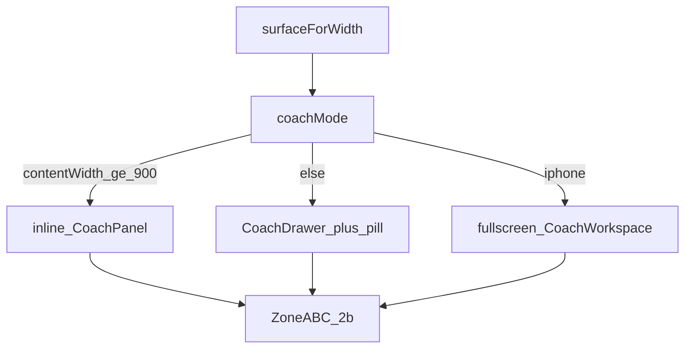

# Plan — Wide-layout & CoachPanel parity (Direction 2b)

**Status:** Accepted — 2026-07-16 (re-Accepted after Direction 2b lock;
clarify Q-C1…Q-C5 CLOSED). Stage 3 tasks Accepted (L0–L6). Stage 4 analyze
**PASSED** 2026-07-16 (baseline green). Human Accept → `sdd-implement`.

**Spec:** [preact-wide-layout-coach-panel.spec.md](preact-wide-layout-coach-panel.spec.md)
**Tasks:** [preact-wide-layout-coach-panel.tasks.md](preact-wide-layout-coach-panel.tasks.md)
**ADR:** [0035-wide-layout-coach-panel-parity.md](../adr/0035-wide-layout-coach-panel-parity.md)
**Constitution:** root `AGENTS.md` + `frontend/AGENTS.md` + STYLE_GUIDE_FRONTEND
**Product lock:** Direction **2b** — locked-spec-artifacts (supersedes draft)

---

## 1. Architecture



**Core seam:** [`use_surface.ts`](../../frontend/components/shell/use_surface.ts) —
`RAIL_COLLAPSED = 64`, `SPLIT_MIN_CONTENT_WIDTH = 900`,
`coachMode(surface, viewportWidth, sidebarWidth)`. Keep three Surface labels and
`surfaceForWidth` for nav/focus. `isWideSurface` may remain; quiz decisions use
`coachMode`.

**Height chain:** [`layout.tsx`](../../frontend/app/(coach)/learn/layout.tsx) —
`h-dvh overflow-hidden` on wide shell; `main` `min-h-0 flex-1 overflow-hidden`
on split routes; Home/Progress may keep `main` page-scrollable.

**Sidebar (Q-C3):** Content screens (Quiz/Coach/Skill/Test) — layout-local
`sidebarCollapsed` always init `true`; mid-session expand in-memory only.
Home/Progress — `shell_layout_store` ↔ `localStorage["preact.shell.sidebar"]`.
Drop `sidebarUserPinned`. AppNav: 38×38 circular rail icons; ThemeToggle last;
`[` shortcut; 180ms `cubic-bezier(0.4,0,0.2,1)` / reduced-motion instant.

**Quiz:** [`quiz/page.tsx`](../../frontend/app/(coach)/learn/quiz/page.tsx) —
switch on `coachMode`; item column max-width 720/560; 1px divider, no gap;
inline dismiss via `panelDismissed`; Feedback bridge per FR-16/17.

**Coach column:** Zone A/B/C Direction 2b — `HintLadderList` + conversation via
`use_expandable_list` + `CollapsibleCoachAnswer` (no timestamp); Zone C =
nudge + chips + composer (`min-height: 58px`). Widths: desktop
`clamp(400px, 30vw, 480px)`; iPad fixed `360px`.

**Drawer (Q-C4):** New [`CoachDrawer.tsx`](../../frontend/components/coach/CoachDrawer.tsx)
+ [`CoachTriggerPill.tsx`](../../frontend/components/coach/CoachTriggerPill.tsx) —
`min(430px, 92vw)`, scrim, focus trap, Escape, 220ms/180ms. Remove Sheet path
and `coach-edge-tab`.

### A1 simplest machinery / G1 rejects

| Idea | Why rejected |
|------|----------------|
| Keep 56px + session pin | Contradicts lock §2.1 / FR-9 |
| Keep Sheet as product drawer | Lock §5/§9 require CoachDrawer + pill (Q-C4); ADR-0035 amended |
| Two expand hooks (thread + ladder) | Lock §8: one `use_expandable_list` (Q-C5) |
| Stack coach under item | Forbidden by FR-1 / height contract |
| Nudge in Zone B scroll | Violates FR-12 pin (Q-C1 → Zone C) |
| New npm dependency | Lock non-goal |
| Re-litigate iPhone tabs | Lock §6 / §13 |

---

## 2. File-level touchpoints

| # | File | Change | FR |
|---|------|--------|-----|
| T1 | `frontend/components/shell/use_surface.ts` (+ test) | 64px; `coachMode`; keep 900 | FR-1,8,9,10 |
| T2 | `frontend/components/shell/shell_layout_store.ts` (+ test) | drop pin; Home/Progress LS only; `panelDismissed` | FR-9,19 |
| T3 | `frontend/app/(coach)/learn/layout.tsx` | content always-collapsed local; height chain | FR-8,9,11 |
| T4 | `frontend/components/shell/AppNav.tsx` | 38 circular rail; ThemeToggle last; `[` | FR-6,8,9 |
| T5 | `frontend/components/coach/use_expandable_list.ts` (+ test) **NEW** | generic expand for ladder + conversation | FR-3,4,7,13,14 |
| T6 | `frontend/components/coach/HintLadderList.tsx` (+ test) **NEW** | ladder UI + aria-live announce | FR-5,14 |
| T7 | `frontend/components/coach/CollapsibleCoachAnswer.tsx` (+ test) | migrate to expandable list; AC-20 chrome | FR-3,4,7,20 |
| T8 | `frontend/components/coach/CoachPanel.tsx` | Zone A/B/C 2b; widths; testid inline | FR-5,10–15,20 |
| T9 | `frontend/components/coach/CoachView.tsx` | conversation instance of expandable list | FR-3,4,7,13 |
| T10 | `frontend/components/coach/CoachWorkspace.tsx` / `CoachChrome.tsx` | same Zone A/B/C; status/mode copy | FR-10–15,18 |
| T11 | `frontend/components/coach/CoachDrawer.tsx` **NEW** | overlay chrome + trap | FR-1,2,8,17 |
| T12 | `frontend/components/coach/CoachTriggerPill.tsx` **NEW** | floating Coach pill | FR-1,2 |
| T13 | `frontend/components/chat/Composer.tsx` | `min-height: 58px` on input | FR-15 |
| T14 | `frontend/app/(coach)/learn/quiz/page.tsx` | coachMode; drawer/pill; bridge; widths | FR-1,2,10–12,16–19 |
| T15 | delete/retire `use_collapsible_thread.ts` (+ tests) | G8-justified replacement | FR-13 |
| T16 | e2e `wide-layout.spec.ts` / `ipad.spec.ts` | locked §12 AC matrix | all |
| T17 | L6 checklist (manual) | Safari/`dvh` height chain | FR-11 |

**Explicitly untouched:** trust/, services/, orchestration/, bank/hints/LLM,
iPhone tab bar internals beyond FR-18, auth/WorkOS, new npm deps.

---

## 3. Height-chain contract (not a new abstraction)

Documented className chain only:

1. Shell: `h-dvh flex overflow-hidden` (wide)
2. `main`: `min-h-0 min-w-0 flex-1 overflow-hidden` (wide split routes)
3. Split row: `flex min-h-0 flex-1` (no gap; 1px border divider)
4. Item column + Zone B: `overflow-y:auto` (+ `overscroll-behavior: contain`)
5. Zone C: `shrink-0` / `flex: none` sibling (not `position: sticky`)

---

## 4. `coachMode` (replaces pin-aware degrade ladder)

```ts
function coachMode(surface, viewportWidth, sidebarWidth):
  "inline" | "drawer" | "fullscreen" {
  if (surface === "iphone") return "fullscreen";
  const contentWidth = viewportWidth - sidebarWidth;
  return contentWidth >= 900 ? "inline" : "drawer";
}
```

On content screens `sidebarWidth` is 64 (always mounts collapsed). Home/Progress
may be 224 or 64 from persisted preference — those routes do not host the quiz
split.

Inline dismiss: `panelDismissed` → hide panel; thread remains in
`coach_thread_store` (FR-19). Drawer mode uses pill, not edge tab.

---

## 5. Sequencing (L-track — atomicized in tasks.md)

| Track | Summary | Depends |
|-------|---------|---------|
| **L0** | Spec/plan/tasks/ADR re-Accepted + OKF index/log | — |
| **L1** | `coachMode` + 64px + store rewrite + AppNav rail | L0 |
| **L2** | `use_expandable_list` + HintLadderList + CollapsibleAnswer migrate | L0 |
| **L3** | CoachPanel/Workspace Zone A/B/C + quiz widths + composer 58px | L2 |
| **L4** | CoachDrawer + TriggerPill + Feedback bridge; remove Sheet/edge-tab | L1, L3 |
| **L5** | e2e AC matrix rewrite | L4 |
| **L6** | Safari/`dvh` device sign-off | L3 |

Parallelizable: L1 ‖ L2 after L0; L3 after L2; L4 after L1+L3; L5 after L4.

---

## 6. Constitution check (Stage 4 — PASSED 2026-07-16)

| Check | Result |
|-------|--------|
| Product lock grounded | locked-spec-artifacts present; Turn 5 + LOCKED-Spec.md |
| New npm deps | none |
| Layering | frontend shell/components only |
| Ask-first | ADR-0035 amended (64px, no pin, CoachDrawer, use_expandable_list) |
| Clarify | Q-C1…Q-C5 CLOSED in spec |
| Draft seams to retire | Sheet path, edge-tab, `sidebarUserPinned`, `use_collapsible_thread`, 56px — still in tree (expected) |
| iPhone | FR-18 only; no tab redesign |
| FR coverage | FR-1…20 each have ≥1 task; no zero-coverage |
| Path grounding | no CRITICAL missing paths; NEW correctly absent |
| Naming drift | `SIDEBAR_COLLAPSED_PX` → rename to `RAIL_COLLAPSED=64` in T1.1 |

Full analyze + baseline paste: [tasks §Stage 4](preact-wide-layout-coach-panel.tasks.md#stage-4-analyze--passed-2026-07-16).

---

## 7. Baseline before implement — CLOSED

```text
make check: 5320 passed, 52 skipped, 72 deselected (2026-07-16)
frontend vitest (shell+coach+Composer): 16 files, 129 passed
```
