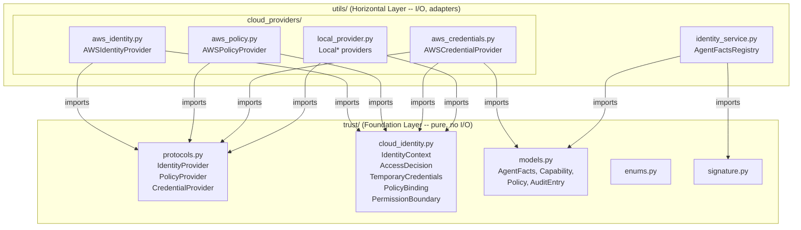

# Trust Foundation -- Cloud-Agnostic Protocol and AWS IAM PoC

**Analysis method:** Protocol-first design with Hexagonal Architecture (Ports and Adapters)
**Source documents:**

- `agent/docs/Architectures/FOUR_LAYER_ARCHITECTURE.md` (Four-layer grid with Trust Foundation)
- `agent/docs/TRUST_FRAMEWORK_ARCHITECTURE.md` (Seven-layer trust framework)
- `agent/docs/LAYER1_IDENTITY_ANALYSIS.md` (Layer 1 structured analysis)
- `agent/docs/STYLE_GUIDE_LAYERING.md` (Composable layering architecture)
- `agent/docs/STYLE_GUIDE_PATTERNS.md` (Design patterns catalog)

**External references:**

- [Python `typing.Protocol` (PEP 544)](https://peps.python.org/pep-0544/) -- Structural subtyping for interface definitions
- [boto3 IAM Reference](https://docs.aws.amazon.com/boto3/latest/reference/services/iam.html)
- [boto3 STS Reference](https://docs.aws.amazon.com/boto3/latest/reference/services/sts.html)
- [NIST SP 800-207 Zero Trust Architecture](https://csrc.nist.gov/publications/detail/sp/800-207/final) -- PEP/PDP/PIP model
- Hexagonal Architecture (Ports and Adapters) -- Alistair Cockburn

---

## Governing Thought

The Trust Foundation layer defines **cloud-agnostic protocols** (ports) for identity, policy, and credential operations. Cloud-specific implementations (adapters) live in the horizontal services layer. This separation follows the same architectural principle as the foundation itself: **types and contracts go in `trust/`, behavior and I/O go in the layer above**. The protocols use Python's `typing.Protocol` (structural subtyping) rather than `abc.ABC` (nominal subtyping) because the adapters wrap third-party SDKs (`boto3`, Azure SDK, GCP client) that we do not control, and structural typing does not require inheritance from a base class.

---

## Context

The [FOUR_LAYER_ARCHITECTURE.md](../../Architectures/FOUR_LAYER_ARCHITECTURE.md) defines the `trust/` directory as the bottom-most layer: pure types, zero I/O, zero outward dependencies. Cloud provider integrations are horizontal services that import from `trust/` -- never the reverse.

This plan adds two new modules to `trust/` (protocols + cloud identity value objects) and a new `utils/cloud_providers/` package with an AWS adapter using boto3.

---

## Architecture




---

## Design Decision: Protocol vs ABC


| Dimension                 | `typing.Protocol` (chosen)                                      | `abc.ABC`                                       |
| ------------------------- | --------------------------------------------------------------- | ----------------------------------------------- |
| Subtyping                 | Structural ("duck typing")                                      | Nominal (requires `class X(ABC)`)               |
| Coupling to SDK           | None -- adapter classes satisfy the protocol without inheriting | Requires subclassing, couples to our base       |
| Third-party compatibility | Works with classes we don't own                                 | Cannot retrofit inheritance onto `boto3` client |
| Runtime enforcement       | Optional via `@runtime_checkable`                               | Native on instantiation                         |
| Static analysis           | Full `mypy` support (PEP 544)                                   | Full `mypy` support                             |
| Code reuse                | No shared base methods                                          | Supports default/template methods               |


**Decision:** `Protocol` for all three interfaces. If shared helper logic emerges (e.g., common retry/backoff), it goes into a separate utility function, not into the protocol itself.

---

## File-by-File Plan

### 1. `trust/cloud_identity.py` -- Cloud-Agnostic Value Objects

Pydantic `BaseModel` classes that represent cloud identity data in a provider-neutral form. Every adapter converts cloud-native responses into these types.


| Model                  | Fields                                                                                                        | Purpose                                              |
| ---------------------- | ------------------------------------------------------------------------------------------------------------- | ---------------------------------------------------- |
| `IdentityContext`      | `provider`, `principal_id`, `display_name`, `account_id`, `roles`, `tags`, `session_expiry`, `raw_attributes` | Cloud-agnostic representation of a resolved identity |
| `VerificationResult`   | `verified`, `reason`, `provider`, `checked_at`                                                                | Outcome of identity verification                     |
| `AccessDecision`       | `allowed`, `reason`, `evaluated_policies`, `provider`                                                         | Allow/deny result from policy evaluation             |
| `TemporaryCredentials` | `provider`, `access_token`, `expiry`, `scope`, `agent_id`, `raw_credentials`                                  | Scoped, time-bounded credentials                     |
| `PolicyBinding`        | `policy_id`, `policy_name`, `policy_type`, `provider`, `attached_to`                                          | A single policy attached to an identity              |
| `PermissionBoundary`   | `boundary_id`, `max_permissions`, `provider`                                                                  | Maximum permission set for an identity               |


All models use `model_config = ConfigDict(frozen=True)` for immutability.

**Dependency:** None outside `trust/`. Only Pydantic and stdlib.

---

### 2. `trust/protocols.py` -- Cloud-Agnostic Protocol Definitions

Three `typing.Protocol` interfaces, each `@runtime_checkable`:

#### `IdentityProvider` -- Resolve and verify cloud-native identities


| Method                | Signature                                           | Responsibility                                                          |
| --------------------- | --------------------------------------------------- | ----------------------------------------------------------------------- |
| `get_caller_identity` | `() -> IdentityContext`                             | Retrieve the identity of the current execution context                  |
| `resolve_identity`    | `(identifier: str) -> IdentityContext`              | Resolve a cloud-native identity (e.g. role ARN) into an IdentityContext |
| `verify_identity`     | `(identity: IdentityContext) -> VerificationResult` | Validate that the identity is authentic and not expired                 |


#### `PolicyProvider` -- Query cloud IAM policies


| Method                    | Signature                                                                   | Responsibility                                   |
| ------------------------- | --------------------------------------------------------------------------- | ------------------------------------------------ |
| `list_policies`           | `(identity: IdentityContext) -> list[PolicyBinding]`                        | List all policies attached to this identity      |
| `evaluate_access`         | `(identity: IdentityContext, action: str, resource: str) -> AccessDecision` | Ask the cloud IAM "can this identity do X on Y?" |
| `get_permission_boundary` | `(identity: IdentityContext) -> PermissionBoundary                          | None`                                            |


#### `CredentialProvider` -- Issue, refresh, and revoke credentials


| Method                | Signature                                                             | Responsibility                                     |
| --------------------- | --------------------------------------------------------------------- | -------------------------------------------------- |
| `issue_credentials`   | `(agent_facts: AgentFacts, scope: list[str]) -> TemporaryCredentials` | Issue short-lived, scoped credentials for an agent |
| `refresh_credentials` | `(credentials: TemporaryCredentials) -> TemporaryCredentials`         | Extend or replace expiring credentials             |
| `revoke_credentials`  | `(credentials: TemporaryCredentials) -> None`                         | Invalidate credentials immediately                 |


**Dependency:** `trust.cloud_identity` and `trust.models` -- within the foundation.

---

### 3. `trust/__init__.py` -- Update Re-exports

Add re-exports for the new protocol types and cloud identity models so consumers can write:

```python
from trust import IdentityProvider, IdentityContext, AccessDecision
```

---

### 4. `utils/cloud_providers/__init__.py` -- Provider Factory

Expose a `get_provider(provider_name: str)` factory function that returns the correct trio:

```python
def get_provider(provider_name: str) -> tuple[IdentityProvider, PolicyProvider, CredentialProvider]:
    ...
```

Supported values: `"aws"`, `"local"`. Default: `"local"`.

---

### 5. `utils/cloud_providers/aws_identity.py` -- AWS IdentityProvider

Uses `boto3.client("sts")` and `boto3.client("iam")`.


| Protocol Method       | boto3 Call                                                                 | Notes                                            |
| --------------------- | -------------------------------------------------------------------------- | ------------------------------------------------ |
| `get_caller_identity` | `sts.get_caller_identity()`                                                | Maps ARN, Account, UserId to IdentityContext     |
| `resolve_identity`    | `sts.assume_role()` then `iam.get_role()` + `iam.list_role_tags()`         | Token is the RoleArn; resolves full role details |
| `verify_identity`     | Validate session expiry, call `sts.get_caller_identity()` with credentials | Confirm credentials are still valid              |


**ARN Parsing:** The AWS ARN (`arn:aws:iam::123456789012:role/AgentRole`) is parsed to extract account_id and role name. The role name maps to `IdentityContext.display_name`. Tags from `list_role_tags()` map to `IdentityContext.tags`.

---

### 6. `utils/cloud_providers/aws_policy.py` -- AWS PolicyProvider

Uses `boto3.client("iam")`.


| Protocol Method           | boto3 Call                                                                  | Notes                                |
| ------------------------- | --------------------------------------------------------------------------- | ------------------------------------ |
| `list_policies`           | `iam.list_attached_role_policies()` + `iam.list_role_policies()`            | Combines managed and inline policies |
| `evaluate_access`         | `iam.simulate_principal_policy(PolicySourceArn, ActionNames, ResourceArns)` | Uses IAM Policy Simulator API        |
| `get_permission_boundary` | `iam.get_role()` -> `PermissionsBoundary` field                             | Returns None if no boundary set      |


**Pagination:** `list_attached_role_policies` may return paginated results. Use `get_paginator()` for fleets with many policies.

---

### 7. `utils/cloud_providers/aws_credentials.py` -- AWS CredentialProvider

Uses `boto3.client("sts")`.


| Protocol Method       | boto3 Call                                                                          | Notes                                             |
| --------------------- | ----------------------------------------------------------------------------------- | ------------------------------------------------- |
| `issue_credentials`   | `sts.assume_role(RoleArn, RoleSessionName=agent_id, DurationSeconds, Policy=scope)` | Inline session policy scopes down permissions     |
| `refresh_credentials` | Re-call `sts.assume_role()`                                                         | STS tokens are re-issued, not refreshed           |
| `revoke_credentials`  | Phase 1: raise `NotImplementedError`                                                | Full impl requires deny-all inline policy pattern |


**Session Naming Convention:** `RoleSessionName` is set to `agent_id` from `AgentFacts`, enabling CloudTrail attribution back to the specific agent.

---

### 8. `utils/cloud_providers/local_provider.py` -- Local Testing Providers

In-memory implementations of all three protocols for testing without AWS credentials:

- `LocalIdentityProvider` -- returns configurable `IdentityContext` from an in-memory dict
- `LocalPolicyProvider` -- returns configurable `PolicyBinding` lists and `AccessDecision` results
- `LocalCredentialProvider` -- returns mock `TemporaryCredentials` with configurable expiry

**Configurability:** Each provider accepts a `config: dict` in its constructor to control behavior:

```python
local_identity = LocalIdentityProvider(config={
    "agent-001": {"verified": True, "roles": ["writer"]},
    "agent-002": {"verified": False, "reason": "expired"},
})
```

This is the default provider when no cloud config is set.

---

### 9. `composable_app/requirements.txt` -- Add boto3 Dependency

Add `boto3` as an optional dependency. The local provider has zero external dependencies; only the AWS adapter requires boto3.

---

## Dependency Rule Compliance


| Rule                                                 | Status | Evidence                                                                       |
| ---------------------------------------------------- | ------ | ------------------------------------------------------------------------------ |
| Trust Foundation has zero outward dependencies       | Pass   | `protocols.py` and `cloud_identity.py` import only from `trust/`               |
| Horizontal imports from Trust Foundation             | Pass   | `utils/cloud_providers/*` imports `trust.protocols` and `trust.cloud_identity` |
| No module in `trust/` imports from `utils/`          | Pass   | Protocols define the shape; adapters fill it in                                |
| AWS adapters never import from `identity_service.py` | Pass   | Peer isolation preserved per Trust Service Dependency Rules                    |
| Horizontal does not import from Vertical             | Pass   | No adapter references `agents/` code                                           |


---

## AgentFacts-to-AWS-IAM Mapping Strategy (Role-per-Agent)

For the PoC, each registered `AgentFacts` maps to one IAM Role:


| AgentFacts Field        | AWS IAM Equivalent                    | Mapping                                            |
| ----------------------- | ------------------------------------- | -------------------------------------------------- |
| `agent_id`              | IAM Role name or Role Tag `agent_id`  | 1:1 role per agent                                 |
| `owner`                 | Role Tag `owner`                      | AWS resource tags                                  |
| `capabilities`          | Attached managed policies             | Each Capability maps to a policy ARN               |
| `policies` (behavioral) | IAM inline policies or SCP conditions | Behavioral policies become IAM condition keys      |
| `status`                | Role active/deactivated               | Suspend = attach deny-all; Revoke = delete role    |
| `valid_until`           | STS `DurationSeconds`                 | Credential expiry aligns with agent expiry         |
| `signed_metadata`       | Role Tags (governance-grade)          | Immutable tags requiring re-registration to change |


**Alternative (Phase 2):** Shared role + STS session tags. Agents share roles by category; `aws:PrincipalTag/agent_id` enables fine-grained access. More scalable but more complex.

---

## Updated Directory Structure

```
project/
├── trust/                              # TRUST FOUNDATION (extended)
│   ├── __init__.py                     # Re-exports key types (updated)
│   ├── models.py                       # AgentFacts, Capability, Policy, AuditEntry
│   ├── enums.py                        # IdentityStatus, CertificationStatus, LifecycleState
│   ├── trace_schema.py                 # TrustTraceRecord
│   ├── signature.py                    # compute_signature(), verify_signature()
│   ├── cloud_identity.py              # NEW: IdentityContext, AccessDecision, etc.
│   └── protocols.py                   # NEW: IdentityProvider, PolicyProvider, CredentialProvider
│
├── utils/                              # HORIZONTAL SERVICES (extended)
│   ├── identity_service.py             # AgentFactsRegistry
│   ├── authorization_service.py        # Access decisions (L2, future)
│   ├── trace_service.py                # TrustTraceRecord emission (L5, future)
│   ├── cloud_providers/               # NEW: Cloud-specific adapters
│   │   ├── __init__.py                 # get_provider() factory
│   │   ├── aws_identity.py            # AWSIdentityProvider (boto3 sts+iam)
│   │   ├── aws_policy.py              # AWSPolicyProvider (boto3 iam)
│   │   ├── aws_credentials.py         # AWSCredentialProvider (boto3 sts)
│   │   └── local_provider.py          # Local* providers (testing, no cloud)
│   ├── prompt_service.py               # (existing, unchanged)
│   ├── llms.py                         # (existing, unchanged)
│   ├── guardrails.py                   # (existing, unchanged)
│   ├── long_term_memory.py             # (existing, unchanged)
│   ├── save_for_eval.py                # (existing, unchanged)
│   └── human_feedback.py               # (existing, unchanged)
│
├── agents/                             # VERTICAL COMPONENTS (unchanged)
├── governance/                         # META-LAYER (unchanged)
├── prompts/                            # Prompt templates (unchanged)
├── data/                               # Pre-built indexes (unchanged)
└── evals/                              # Evaluation scripts (unchanged)
```

---

## Implementation Order


| Step | Module                                     | Rationale                                                           |
| ---- | ------------------------------------------ | ------------------------------------------------------------------- |
| 1    | `trust/cloud_identity.py`                  | Value objects first -- protocols and adapters depend on these types |
| 2    | `trust/protocols.py`                       | Protocol definitions depend on cloud_identity models                |
| 3    | `trust/__init__.py`                        | Re-export new types for clean imports                               |
| 4    | `utils/cloud_providers/local_provider.py`  | Local providers first -- enables testing without AWS                |
| 5    | `utils/cloud_providers/__init__.py`        | Factory wiring                                                      |
| 6    | `utils/cloud_providers/aws_identity.py`    | AWS identity adapter                                                |
| 7    | `utils/cloud_providers/aws_policy.py`      | AWS policy adapter                                                  |
| 8    | `utils/cloud_providers/aws_credentials.py` | AWS credential adapter                                              |
| 9    | `composable_app/requirements.txt`          | Add boto3                                                           |


---

## Out of Scope (Phase 2)


| Feature                                           | Reason for Deferral                     |
| ------------------------------------------------- | --------------------------------------- |
| Azure Active Directory / Entra ID adapter         | Different SDK, same protocols           |
| GCP IAM adapter                                   | Different SDK, same protocols           |
| OIDC federation (`assume_role_with_web_identity`) | Requires external IdP setup             |
| Shared-role-with-session-tags strategy            | More complex, needed at scale           |
| `revoke_credentials` full implementation          | Requires deny-all inline policy pattern |
| Permission boundaries integration                 | Additive, not foundational              |


---

## Relationship to Existing Documents

This document extends the Trust Foundation layer defined in [FOUR_LAYER_ARCHITECTURE.md](../../Architectures/FOUR_LAYER_ARCHITECTURE.md) by adding cloud-agnostic protocol definitions and cloud-specific adapter specifications. The protocols serve as the bridge between the internal trust framework (AgentFacts, identity verification, authorization) and external cloud IAM systems.


| Existing Document                 | Relationship                                                                                                                        |
| --------------------------------- | ----------------------------------------------------------------------------------------------------------------------------------- |
| `Architectures/FOUR_LAYER_ARCHITECTURE.md` | This plan adds `cloud_identity.py` and `protocols.py` to the Trust Foundation layer, and `cloud_providers/` to the Horizontal layer |
| `TRUST_FRAMEWORK_ARCHITECTURE.md` | The three protocols map to L1 (IdentityProvider), L2 (PolicyProvider), and L1+L2 (CredentialProvider)                               |
| `LAYER1_IDENTITY_ANALYSIS.md`     | The AgentFacts-to-IAM mapping builds on the Phase 1 data model defined there                                                        |
| `STYLE_GUIDE_LAYERING.md`         | Cloud adapters follow horizontal service rules (H1-H4), especially H4 (parameterized)                                               |


