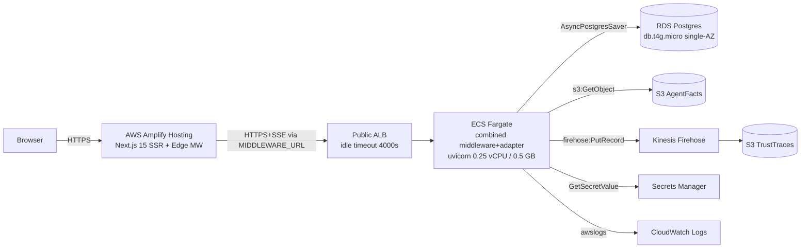

# Deploy AgentsFramework to AWS — Component-by-Component Recipes

## Decisions locked in

- **IaC:** AWS CDK in Python (matches backend language; auto state via CloudFormation; automatic rollback; `cdk diff` preview for agent-driven flow).
- **Adapter strategy:** Build missing AWS adapters first (Recipe 0), then provision.
- **Workload tier:** Tier A — Dev / ~5 devs. Single-AZ, smallest instances, no autoscaling. Budget: ~$200–400/mo list.
- **Topology simplification for Tier A:** Single combined Fargate service (refactored [middleware/server.py](middleware/server.py) that mounts [agent_ui_adapter](agent_ui_adapter/) routes). The two-service BFF+Backend split documented in [docs/Architectures/AWS_DEPLOYMENT_ARCHITECTURE.md](docs/Architectures/AWS_DEPLOYMENT_ARCHITECTURE.md) §3.1 is deferred to Tier B.
- **Deliverables shape:** Each recipe is a markdown file under `docs/recipes/aws/`. New IaC code lives under `infra/aws/`. New adapter code lives in its layer-correct location.

## Target end-state (Tier A, single-AZ)

## Recipe layout convention (applies to all recipes)

Each recipe file follows the same structure:

1. **Goal** — one sentence.
2. **Prerequisites** — recipes that must run first; AWS quotas; local tools.
3. **For this workspace** — exact file paths, code snippets, commands.
4. **For a general audience** — what to substitute for a similar Next.js + Python + LangGraph stack.
5. **Verify** — pytest commands + `aws` CLI smoke checks + curl/ssh test.
6. **Rollback** — `cdk destroy` of the specific stack + cleanup notes.
7. **Cost note** — rough $/mo line items at Tier A.

## Recipes

### Recipe 0 — Build missing AWS runtime adapters (code only, no AWS resources yet)

**What:** Implement the three adapters called out in [docs/Architectures/AWS_DEPLOYMENT_ARCHITECTURE.md](docs/Architectures/AWS_DEPLOYMENT_ARCHITECTURE.md) §6 plus a small `AWS_EXECUTION_ENV` switch in composition roots. No AWS resources yet — pure code + unit tests with `moto`.

- New files (workspace-specific):
  - [agent_ui_adapter/adapters/runtime/postgres_saver.py](agent_ui_adapter/adapters/runtime/postgres_saver.py) — wraps `AsyncPostgresSaver` from `langgraph.checkpoint.postgres.aio`. Constructor takes a `DATABASE_URL`. Selected by composition root when `AWS_EXECUTION_ENV` is set.
  - [services/trace_sinks/kinesis_sink.py](services/trace_sinks/kinesis_sink.py) — `KinesisFirehoseTraceSink(stream_name, region)` implementing the existing `TraceSink` protocol from [services/trace_sinks/jsonl_sink.py](services/trace_sinks/jsonl_sink.py). `boto3.client("firehose").put_record(...)`.
  - [services/trace_sinks/s3_sink.py](services/trace_sinks/s3_sink.py) — fallback batched S3 PutObject sink (used by meta ring offline; agent path uses Firehose).
  - [services/governance/agent_facts_s3_registry.py](services/governance/agent_facts_s3_registry.py) — extends `AgentFactsRegistry` to read signed JSON blobs from `s3://`.
- Composition root edits:
  - [middleware/__main__.py](middleware/__main__.py) and [agent_ui_adapter/server.py](agent_ui_adapter/server.py): branch on `os.environ.get("AWS_EXECUTION_ENV")` to wire Postgres saver + Firehose sink instead of SQLite + JSONL sink.
- Tests:
  - `tests/services/trace_sinks/test_kinesis_sink.py` using `moto` to mock Firehose; assert PutRecord shape, retry behavior, no log leakage.
  - `tests/services/governance/test_agent_facts_s3_registry.py` using `moto` S3.
  - `tests/agent_ui_adapter/adapters/runtime/test_postgres_saver.py` using `pytest-postgresql` or a docker-compose-postgres fixture; assert `put`/`get_tuple` round-trip.
- Architecture tests stay green: `services/trace_sinks/kinesis_sink.py` may import `boto3` (services layer permits I/O); `agent_ui_adapter/adapters/runtime/postgres_saver.py` is the only place LangGraph + Postgres SDK meet.
- Add `boto3`, `moto`, `langgraph-checkpoint-postgres` to `pyproject.toml` under `[aws]` optional + `[dev]`. Run `pytest tests/architecture tests/services/trace_sinks tests/agent_ui_adapter/adapters/runtime -q`.

**For a general audience:** Any LangGraph app moving off SQLite needs (a) a Postgres checkpointer adapter behind the runtime port, (b) a streaming trace sink behind a `TraceSink` protocol, (c) an env-driven composition switch. Use `moto` to test without an AWS account.

---

### Recipe 1 — AWS account foundations (CDK bootstrap, VPC, IAM, ECR, Secrets Manager)

**What:** Establish the always-on base: CDK bootstrap, a small VPC with one NAT, ECR repo, Secrets Manager entries (empty values placeholders), an IAM task role baseline.

- New folder: `infra/aws/` containing:
  - `app.py` — CDK app entrypoint.
  - `cdk.json` — context flags, feature gates.
  - `requirements-cdk.txt` — `aws-cdk-lib>=2.150`, `constructs>=10`.
  - `stacks/foundations_stack.py` — `FoundationsStack`: VPC (2 AZs, 1 NAT), `ecr.Repository("agent-backend")`, `secretsmanager.Secret` entries for `OPENAI_API_KEY`, `WORKOS_API_KEY`, `WORKOS_CLIENT_ID`, `WORKOS_COOKIE_PASSWORD`, `AGENT_FACTS_SECRET`, `DATABASE_URL` (created empty; populated by ops out-of-band).
  - `tests/infra/aws/test_foundations_stack.py` — `cdk.assertions` snapshot + counts (1 VPC, 1 ECR repo, 6 secrets).
- Commands:
  - `python -m venv infra/aws/.venv && source infra/aws/.venv/bin/activate`
  - `pip install -r infra/aws/requirements-cdk.txt`
  - `cdk bootstrap aws://ACCOUNT/REGION`
  - `cdk synth FoundationsStack` then `cdk diff FoundationsStack` then `cdk deploy FoundationsStack`
- Verify: `aws ecr describe-repositories` shows the new repo; `aws secretsmanager list-secrets` shows the six placeholder secrets.

**For a general audience:** Any ECS Fargate stack needs (a) a CDK-bootstrapped account, (b) a VPC, (c) an ECR repo, (d) one Secrets Manager entry per `.env` variable. The single-NAT VPC keeps Tier A cost low at the price of single-AZ egress.

---

### Recipe 2 — Data tier (RDS Postgres + S3 buckets + Firehose)

**What:** Provision the stateful layer. RDS for checkpoints; S3 for AgentFacts + trust traces; Firehose for trace ingestion.

- New: `infra/aws/stacks/data_stack.py` — `DataStack`:
  - `rds.DatabaseInstance(engine=Postgres15, instance_type=t4g.micro, allocated_storage=20, multi_az=False, deletion_protection=False)` — Tier A dev only.
  - `s3.Bucket("agent-facts", versioned=True, blocked_public=True)`.
  - `s3.Bucket("trust-traces", lifecycle=[transition_to_glacier_after=90d])`.
  - `kinesisfirehose.CfnDeliveryStream(destination=trust-traces, buffer_interval=60s, buffer_size=1MiB)`.
  - IAM grants: Backend task role → `s3:GetObject` on facts, `firehose:PutRecord` on stream.
- After deploy, populate the `DATABASE_URL` secret with the RDS connection string (out-of-band via console or `aws secretsmanager put-secret-value`).
- Run a one-shot migration: `psql $DATABASE_URL < agent_ui_adapter/adapters/runtime/postgres_saver.sql` (the `setup_async()` from `AsyncPostgresSaver`).
- Tests: `tests/infra/aws/test_data_stack.py` asserts RDS engine, S3 versioning, Firehose buffer settings.
- Verify: `aws rds describe-db-instances`, `aws s3 ls`, `aws firehose describe-delivery-stream`.

**For a general audience:** Pin the Postgres major version to whatever your LangGraph checkpoint library tests against. Don't skip S3 versioning on the trust-traces bucket — your audit trail depends on it.

---

### Recipe 3 — Containerize the backend (Dockerfile + ECR push)

**What:** Replace the CLI-only [Dockerfile](Dockerfile) with a multi-stage image that runs `uvicorn` on the combined middleware app. Push to ECR via CDK `DockerImageAsset`.

- New file: `Dockerfile.backend` (alongside existing CLI Dockerfile) — multi-stage, slim Python 3.11, installs from `pyproject.toml [aws]` extra, exposes 8080, `CMD ["uvicorn", "middleware.__main__:build_dev_app", "--host", "0.0.0.0", "--port", "8080", "--factory"]` (or a new `middleware.app_prod:build_combined_app` if a thin prod composition is added).
- Add a small `middleware/app_prod.py` that composes [middleware/server.py](middleware/server.py)'s auth/ACL routes with [agent_ui_adapter/server.py](agent_ui_adapter/server.py)'s agent routes into one FastAPI app (Tier A simplification). Adds `/healthz`, `/me`, `/acl/decide`, `/agent/*` under a single ASGI app.
- Local smoke test: `docker build -f Dockerfile.backend -t agent-backend:dev .` then `docker run -p 8080:8080 -e OPENAI_API_KEY=... agent-backend:dev` then `curl localhost:8080/healthz`.

**For a general audience:** When you have multiple FastAPI surfaces (`auth`, `agent`), compose them with `app.mount("/agent", agent_app)` or `app.include_router(...)`. Don't ship a multi-process image; let ECS run one task per service if you ever split.

---

### Recipe 4 — Deploy backend on ECS Fargate behind public ALB (Tier A combined)

**What:** Run the single combined image on Fargate behind a public ALB with a 4000s idle timeout so SSE survives.

- New: `infra/aws/stacks/backend_stack.py` — `BackendStack`:
  - `ecs.Cluster("agent-cluster", vpc=foundations.vpc)`.
  - `ecs_patterns.ApplicationLoadBalancedFargateService` with `cpu=256, memory=512, desired_count=1, public_load_balancer=True, listener_port=443, certificate=acm_cert`.
  - Container env: `AWS_EXECUTION_ENV=fargate`, `MIDDLEWARE_PROFILE=v3`, secrets injected from Secrets Manager via `ecs.Secret.from_secrets_manager(...)`.
  - ALB attributes: `idle_timeout: Duration.seconds(4000)` (critical for SSE per arch doc §3).
  - Health check: `GET /healthz` 200, interval 30s.
- Tests: `tests/infra/aws/test_backend_stack.py` asserts the ALB idle timeout, single task, public ALB.
- Verify: `curl https://<alb-dns>/healthz`. Run an end-to-end SSE test from a local machine: `curl -N -H "Authorization: Bearer <token>" -d '{...}' https://<alb-dns>/agent/runs/stream`.

**For a general audience:** Any LangGraph SSE deploy on AWS must use ALB (not API Gateway — the 29s timeout breaks the stream). `ApplicationLoadBalancedFargateService` is the one-line construct.

---

### Recipe 5 — Deploy frontend on AWS Amplify Hosting

**What:** Connect the `frontend/` Next.js 15 app to Amplify; set env vars; point at the backend ALB.

- New file: `frontend/amplify.yml` — pnpm install + pnpm build, `baseDirectory: .next`. Honors monorepo: `appRoot: frontend`.
- Connect repo via `aws amplify create-app --name agent-frontend --repository ... --access-token ...` or CDK `amplify-alpha` constructs.
- Env vars to set in Amplify console (or CDK `BranchProps.environmentVariables`):
  - `MIDDLEWARE_URL=https://<backend-alb-dns>` (or `https://api.<your-domain>` once mapped)
  - `WORKOS_API_KEY`, `WORKOS_CLIENT_ID`, `WORKOS_COOKIE_PASSWORD`
  - `NEXT_PUBLIC_WORKOS_REDIRECT_URI=https://<amplify-domain>/api/auth/callback`
  - `ARCHITECTURE_PROFILE=v3`
  - Optional `NEXT_PUBLIC_FF_*` feature flags.
- Update WorkOS dashboard: add Amplify domain to allowed redirect URIs.
- Verify: open the Amplify URL, sign in via WorkOS, send a message, confirm SSE stream renders (CloudFront in front of Amplify must not buffer; the BFF already sets `X-Accel-Buffering: no` in [frontend/lib/transport/edge_proxy.ts](frontend/lib/transport/edge_proxy.ts)).

**For a general audience:** Amplify Hosting supports Next.js 15 SSR + Edge middleware + SSE passthrough. Validate SSE first on a non-streaming endpoint, then on the stream. If CloudFront buffers, fall back to ECS+Fargate hosting for the Next.js app behind ALB.

---

### Recipe 6 — Meta ring (optional for Tier A — recommended only if dev team will run nightly evals)

**What:** Schedule an ECS task that runs `meta/run_eval.py` against the trust-traces S3 bucket.

- New: `infra/aws/stacks/meta_stack.py` with `events.Rule(schedule=cron("0 6 * * ? *"))` triggering an `ecs.RunTask` action on a dedicated task definition with read-only S3 access to the traces bucket.
- For Tier A, you may skip this and run `python -m meta.run_eval` locally against an `aws s3 sync` snapshot — cheaper.

**For a general audience:** Long-running offline jobs belong on EventBridge → Batch/ECS, not on the live SSE service.

---

### Recipe 7 — Observability + smoke tests + budgets

**What:** Minimal Tier A observability: CloudWatch dashboards, three alarms (5xx rate, task CPU, RDS connections), a smoke test runner, a $300 budget alert.

- New: `infra/aws/stacks/observability_stack.py` — `cloudwatch.Dashboard`, `cloudwatch.Alarm` x3, `budgets.CfnBudget(amount=300)`.
- New: `scripts/smoke_aws.sh` — runs `/healthz`, creates a thread, posts a message, asserts SSE chunks arrive within 5s.
- Wire `scripts/smoke_aws.sh` into Amplify build's `customHeaders` or a separate CI job that runs post-deploy.

**For a general audience:** Before scaling, the single most useful alarm is `ALB 5xx rate > 1% over 5 minutes`. Add a budget alert before anything else — Tier A costs creep silently from NAT data transfer.

---

### Recipe 8 — Cleanup + teardown order

**What:** Document the safe destroy order so the agent can fully tear down a dev environment.

- Destroy order (reverse of provision):
  1. Amplify app (`aws amplify delete-app`).
  2. `cdk destroy ObservabilityStack`.
  3. `cdk destroy BackendStack` (drains ALB before deleting service).
  4. `cdk destroy DataStack` (snapshot RDS first if data matters; S3 buckets need empty before deletion).
  5. `cdk destroy FoundationsStack` (only if no other stacks reference the VPC).
- Don't destroy ECR + Secrets Manager between iterations — they are cheap and slow to recreate.

**For a general audience:** Teardown failures are usually "S3 bucket not empty" or "RDS deletion protection". Add `removalPolicy: RemovalPolicy.DESTROY` + `autoDeleteObjects: True` on dev-tier buckets only.

---

## Per-recipe deliverable for the user

Each recipe is delivered as:

- A markdown file under `docs/recipes/aws/NN_recipe_name.md` (8 files).
- New CDK stack files under `infra/aws/stacks/`.
- New adapter code under the layer-correct backend paths.
- New tests under `tests/infra/aws/` and the existing test trees.
- An updated [docs/Architectures/AWS_DEPLOYMENT_ARCHITECTURE.md](docs/Architectures/AWS_DEPLOYMENT_ARCHITECTURE.md) §6 noting "Recipes 0–8 are the implementation of this architecture."

## Out of scope (deferred to Tier B / future)

- Splitting the combined Fargate service into separate BFF and Backend services (architecture doc §3.1 long-form topology).
- WAF on the public ALB.
- Aurora Serverless v2 (Tier B upgrade).
- Multi-AZ + autoscaling.
- Frontend hosted on ECS+Fargate instead of Amplify (fallback if Amplify SSE buffering fails).
- Meta ring on AWS Batch (Tier B upgrade if traces > ~10 GB/day).
- Cross-region DR.

## Order of execution

The 9 todos below match the 9 recipes (0–8) in order. Recipe 0 must complete and tests must pass before Recipe 1 begins, because the data tier in Recipe 2 only makes sense if Recipe 0's `AsyncPostgresSaver` adapter is in place to consume it.
