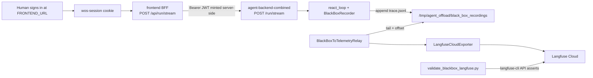

# BlackBox → Langfuse End-to-End Validation on GCP

**Status:** In Progress
**Last updated:** 2026-05-29

## Overview

Critically validate the completed BlackBox → Langfuse pipeline (Sprints A–G of [blackbox_to_langfuse.plan.md](blackbox_to_langfuse.plan.md)) running on the GCP-hosted backend. A synthetic dataset deterministically exercises all 9 BlackBox event types and the failure-outcome path; a CLI + pytest harness drives those scenarios through the authenticated frontend BFF and asserts the resulting traces, observations, scores, and compliance dataset items in Langfuse Cloud (`https://cloud.langfuse.com`) via both automated API assertions and a printed human UI checklist. A governance-triangle drift report flags where the docs disagree with the shipped code.

**Prerequisite deploy:** [blackbox_langfuse_gcp_deploy.plan.md](blackbox_langfuse_gcp_deploy.plan.md) (relay wiring + Terraform env vars) is included as gated Phase 1–2 of this plan.

---

## Locked decisions

| Decision | Choice |
|----------|--------|
| Deploy | Included as gated first steps (deploy plan still `Planned` with two unfixed blockers) |
| Langfuse verification | Automated API/CLI assertions **and** printed UI checklist per gate |
| Synthetic scope | All 9 event types + failure-outcome mode; broken-hash-chain deferred |
| Governance validation | Implemented behavior end-to-end **plus** doc/code drift report |
| Deliverables | Python CLI + pytest harness + runbook doc |
| Approval granularity | Every concrete action (command, deploy step, scenario run, Langfuse query batch) |
| Auth route | **Route A** — frontend BFF with `wos-session` cookie; no raw JWT handling |
| Langfuse host | `https://cloud.langfuse.com` (EU cloud) |
| LLM cost | OK to incur (~7 live runs per validation cycle) |

---

## Route A data flow

Per [frontend/app/api/run/stream/route.ts](../../frontend/app/api/run/stream/route.ts) (lines 39–49) the BFF authenticates the session cookie, calls `getAccessToken()`, and forwards `Authorization: Bearer` to the backend — so the harness only needs the `wos-session` cookie, never a raw JWT.

### Obtaining the session cookie (human step)

1. Open `$FRONTEND_URL` in a browser and sign in via WorkOS.
2. Open DevTools → Application → Cookies → select the frontend origin.
3. Copy the value of the `wos-session` cookie.
4. Export it for the harness: `export WOS_SESSION_COOKIE="<cookie value>"`.
5. Re-copy if the harness receives `401 unauthorized` (session expired).

---

## Synthetic dataset (active scenarios)

Each scenario is a crafted input chosen to force specific events, with its expected Langfuse footprint. `trace_id == workflow_id == event.workflow_id` (see [services/governance/black_box_publisher.py](../../services/governance/black_box_publisher.py) line 109), so all assertions key off one ID.

| # | Scenario | Forces | Expected Langfuse observations | Dataset / score |
|---|----------|--------|----------------------------------|-----------------|
| S1 | Simple Q&A | TASK_STARTED, STEP_PLANNED, MODEL_SELECTED, GUARDRAIL_CHECKED, STEP_EXECUTED, TASK_COMPLETED | `task.started`, `step.planned`, `model.selected`, `guardrail.checked`, `step.executed`, `task.completed` | `agent-compliance-audit`; `hash_chain_valid=1.0` |
| S2 | Tool-using task | + TOOL_CALLED | + `tool.called` (type=tool) | audit |
| S3 | Tool that errors but recovers | + ERROR_OCCURRED | + `error.occurred` (span, level=ERROR) | audit |
| S4 | Routing tier change | + PARAMETER_CHANGED | + `parameter.changed` (span) | audit |
| S5 | Forced failing workflow | TASK_COMPLETED(outcome=failure) | `task.completed` + `error.occurred` | **`agent-incident-replay`** |
| S6 | PII/API-key in input | redaction path | details show redacted markers, no raw secrets | audit |
| S8 | Two concurrent workflows | multi-workflow isolation | two distinct trace_ids, independent offsets/bundles | two audit items |

All 9 BlackBox event types are covered across S1–S6. S7 (broken hash chain → `score=0.0`) is **deferred** — see Out of scope.

---

## Deliverable file layout

| Path | Purpose |
|------|---------|
| [scripts/validate_blackbox_langfuse.py](../../scripts/validate_blackbox_langfuse.py) | CLI driver: `--scenario`, `--frontend-url`, `--cookie-env WOS_SESSION_COOKIE`, `--gate per-action`, `--report` |
| `tests/synthetic/blackbox/dataset.py` | S1–S6, S8 scenario definitions (single source of truth) |
| `tests/synthetic/blackbox/langfuse_assertions.py` | Langfuse CLI/REST query + assert helpers |
| `tests/integration/test_blackbox_langfuse_gcp.py` | Pytest harness (`@pytest.mark.live_llm` + `@pytest.mark.simulation`; never in CI) |
| [docs/recipes/governance/04_e2e_validation_runbook.md](../recipes/governance/04_e2e_validation_runbook.md) | Runbook + per-scenario UI checklist + drift findings |
| [docs/plans/blackbox_e2e_validation.plan.md](blackbox_e2e_validation.plan.md) | This plan |

---

## Phases (each action is an individual approval gate)

### Phase 0 — Preconditions (read-only)

- Run `pytest tests/architecture/ -q` and existing BlackBox suites green.
- Confirm `npx langfuse-cli api __schema` works with `LANGFUSE_*` env present (`LANGFUSE_HOST=https://cloud.langfuse.com`).

### Phase 1 — Fix deploy blockers

From [blackbox_langfuse_gcp_deploy.plan.md](blackbox_langfuse_gcp_deploy.plan.md):

- [middleware/app_prod.py](../../middleware/app_prod.py): start `relay.run_forever(interval_s=1.0)` in lifespan; stop/cancel in `finally` (mirror [middleware/__main__.py](../../middleware/__main__.py)).
- [infra/gcp/cloud-run-backend.tf](../../infra/gcp/cloud-run-backend.tf): add `BLACKBOX_RELAY_MODE=in_process` and `BLACKBOX_STORAGE_DIR=/tmp/agent_offload/black_box_recordings`.
- Update [tests/middleware/test_app_prod.py](../../tests/middleware/test_app_prod.py) and [tests/infra/gcp/test_cloud_run_backend.py](../../tests/infra/gcp/test_cloud_run_backend.py); run them.

### Phase 2 — Build and deploy backend

Follow [LIVE_DEPLOYMENT.md §2.1](../recipes/gcp/LIVE_DEPLOYMENT.md):

- Build/tag/push `agent-backend:blackbox-langfuse-v1` by digest.
- Update `terraform.tfvars`; `tofu plan` + conftest + terraform-compliance + `tofu apply`.
- Verify revision health and `BlackBox→Langfuse relay started (in-process)` in Cloud Logging.

### Phase 3 — Author dataset + harness (no GCP calls)

- Write `dataset.py`, `langfuse_assertions.py`, `validate_blackbox_langfuse.py`, and the pytest harness.

### Phase 4 — Drive scenarios on GCP via BFF

For each S1–S6, S8:

1. Human signs in at `$FRONTEND_URL`; export `WOS_SESSION_COOKIE`.
2. POST scenario payload to `$FRONTEND_URL/api/run/stream`.
3. Capture `trace=<uuid>` from SSE stream or backend `stream_ended` log.
4. Run automated Langfuse assertions.
5. Print UI checklist; pause for human confirmation.

### Phase 5 — Compliance datasets + scores

- Assert `agent-compliance-audit` has items for S1–S4, S6, S8 with `hash_chain_valid=1.0`.
- Assert `agent-incident-replay` has the S5 item.

### Phase 6 — Governance-triangle drift report

Diff documented vs implemented event taxonomy and import paths in:

- [governanaceTriangle/02_black_box_recording_debugging.md](../../governanaceTriangle/02_black_box_recording_debugging.md)
- [governanaceTriangle/05_black_box_explanation.md](../../governanaceTriangle/05_black_box_explanation.md)

Against [services/governance/black_box.py](../../services/governance/black_box.py). Emit findings into the runbook + machine-readable drift JSON.

**Known drift:** docs describe `STEP_START/STEP_END/DECISION/CHECKPOINT/COLLABORATOR_JOIN/LEAVE/ROLLBACK` and `backend.explainability.black_box`; code ships `TASK_STARTED/STEP_PLANNED/STEP_EXECUTED/TOOL_CALLED/MODEL_SELECTED/ERROR_OCCURRED/GUARDRAIL_CHECKED/PARAMETER_CHANGED/TASK_COMPLETED` in `services.governance.black_box`.

### Phase 7 — Failure-path log checks + cleanup

- `gcloud logging read` for `langfuse client init failed` and `langfuse_failures|DLQ` (expect none).
- Produce pass/fail summary per scenario.
- Document rollback lever: `BLACKBOX_RELAY_MODE=off`.

---

## Task checklist

- [x] Phase 1: Fix relay in `app_prod.py` + Terraform env vars + tests *(172 tests pass)*
- [ ] Phase 2: Build/push backend image, apply Terraform, verify relay log *(requires GCP credentials)*
- [x] Phase 3: Author `dataset.py` (S1–S6, S8)
- [x] Phase 3: Author `langfuse_assertions.py`
- [x] Phase 3: Author `scripts/validate_blackbox_langfuse.py` (Route A BFF + per-action gates)
- [x] Phase 3: Author `tests/integration/test_blackbox_langfuse_gcp.py`
- [ ] Phase 4: Drive S1–S6, S8 through BFF; capture trace_ids; assert Langfuse *(requires deployed relay + session cookie)*
- [x] Phase 5: Verify compliance datasets + scores
- [x] Phase 6: Emit governance-triangle drift report + JSON *(drift JSON at `docs/drift/blackbox_event_taxonomy_drift.json`)*
- [x] Phase 7: Log checks + pass/fail summary *(pass/fail template + rollback in runbook; gcloud queries require GCP)*
- [x] Write `docs/recipes/governance/04_e2e_validation_runbook.md`

---

## Out of scope (documented, not implemented)

### Broken-hash-chain validation (deferred)

Validating `hash_chain_valid=0.0` → `agent-incident-replay` requires tampering with a `trace.jsonl` after recording, since `BlackBoxRecorder.record()` always writes a valid chained SHA-256. On Cloud Run the file lives on tmpfs (`/tmp/agent_offload/...`), so a future iteration needs a controlled hook — e.g. an env-gated test-only admin endpoint, a `gcloud run jobs exec` mutation, or a dedicated local-only integrity test. Until then this path is covered only by existing L2 unit tests of `export()`.

### Other deferred items

- Migrating BlackBox storage off Cloud Run tmpfs (Tier B).
- Wiring the relay as a separate Cloud Run sidecar container.

---

## References

- [blackbox_to_langfuse.plan.md](blackbox_to_langfuse.plan.md) — completed Sprints A–G
- [blackbox_langfuse_gcp_deploy.plan.md](blackbox_langfuse_gcp_deploy.plan.md) — GCP deploy prerequisites
- [LOG_PIPELINE_GUIDE.md § Step 12](../recipes/gcp/LOG_PIPELINE_GUIDE.md#step-12-langfuse-trace-verification) — existing Langfuse trace verification
- [governanaceTriangle/02_black_box_recording_debugging.md](../../governanaceTriangle/02_black_box_recording_debugging.md) — governance tutorial (drift source)
