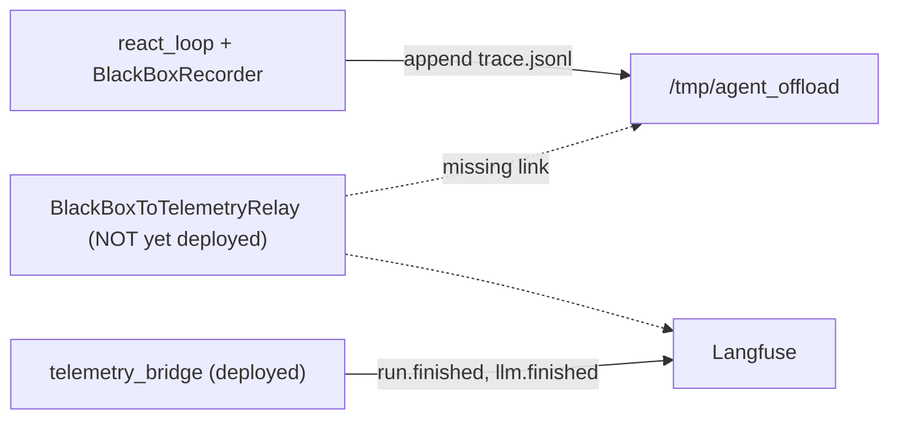

# Close BlackBox to Langfuse Governance Gaps

**Status:** In Progress
**Last updated:** 2026-05-29

## Overview

Close the observed BlackBox/governance gaps by committing the already-written relay fixes, deploying the relay-enabled backend, running the existing E2E validation harness to prove the 9 BlackBox observations + hash-chain scores + compliance datasets land in Langfuse, then reconciling the governance-triangle doc/code drift and writing the runbook.

## Why the gap exists

The Langfuse logs show only `llm.finished`/`run.finished` (the always-on [middleware/telemetry_bridge.py](../../middleware/telemetry_bridge.py) path), not the 9 BlackBox observations. Recording and relaying are both correctly coded — [orchestration/react_loop.py](../../orchestration/react_loop.py) records all 9 event types, [middleware/app_prod.py](../../middleware/app_prod.py) (lines 194-198) starts `relay.run_forever()`, and [agent_ui_adapter/adapters/runtime/langgraph_runtime.py](../../agent_ui_adapter/adapters/runtime/langgraph_runtime.py) line 158 sets `workflow_id == trace_id` so BlackBox observations share the run's Langfuse trace.

The likely root cause: the relay-enabled image is **not deployed**. The Phase 1 fixes are present locally but uncommitted (`app_prod.py`, `composition.py`, `cloud-run-backend.tf` + 3 tests in git status).

## What already exists (do not rebuild)

- Phase 1 fixes (uncommitted): relay in `app_prod.py` lifespan, `_build_relay` + storage-dir resolution in [middleware/composition.py](../../middleware/composition.py), `BLACKBOX_RELAY_MODE`/`BLACKBOX_STORAGE_DIR` in [infra/gcp/cloud-run-backend.tf](../../infra/gcp/cloud-run-backend.tf) lines 110-118.
- Phase 3 harness (committed, complete): [tests/synthetic/blackbox/dataset.py](../../tests/synthetic/blackbox/dataset.py) (S1-S6, S8), [tests/synthetic/blackbox/langfuse_assertions.py](../../tests/synthetic/blackbox/langfuse_assertions.py) (real SDK queries), [scripts/validate_blackbox_langfuse.py](../../scripts/validate_blackbox_langfuse.py) (Route A BFF + per-action gates), [tests/integration/test_blackbox_langfuse_gcp.py](../../tests/integration/test_blackbox_langfuse_gcp.py).

## What is missing

- Deploy of the relay image (Phase 2).
- A live validation run (Phase 4-5).
- Governance-triangle doc/code drift reconciliation + JSON (Phase 6).
- Log checks + pass/fail summary (Phase 7).
- The runbook `docs/recipes/governance/04_e2e_validation_runbook.md`.

## Approach

1. **Lock in Phase 1**: run the relay/app_prod/infra tests, confirm green, commit the uncommitted fixes.
2. **Determine deploy state**: query the live revision's env (`BLACKBOX_RELAY_MODE`) and Cloud Logging for `BlackBox.*relay started`; only build/deploy if the relay is absent.
3. **Deploy (Phase 2)** per [docs/plans/blackbox_langfuse_gcp_deploy.plan.md](blackbox_langfuse_gcp_deploy.plan.md): build/push `agent-backend:blackbox-langfuse-v1`, update `terraform.tfvars`, `tofu plan` + conftest + terraform-compliance + `tofu apply`, verify the relay-started log.
4. **Validate (Phase 4-5)**: sign in for `WOS_SESSION_COOKIE`, run `scripts/validate_blackbox_langfuse.py` for S1-S6,S8; confirm the 9 observations, `hash_chain_valid` scores, and `agent-compliance-audit`/`agent-incident-replay` items. Before the first run, sanity-check that the assertion SDK calls match the deployed `langfuse` 4.7.x API surface.
5. **Reconcile docs (Phase 6)**: diff the documented taxonomy in [governanaceTriangle/02_black_box_recording_debugging.md](../../governanaceTriangle/02_black_box_recording_debugging.md) and [governanaceTriangle/05_black_box_explanation.md](../../governanaceTriangle/05_black_box_explanation.md) (which describe `STEP_START/STEP_END/DECISION/CHECKPOINT/COLLABORATOR_JOIN/LEAVE/ROLLBACK` and `backend.explainability.black_box`) against shipped [services/governance/black_box.py](../../services/governance/black_box.py) (`TASK_STARTED/STEP_PLANNED/STEP_EXECUTED/TOOL_CALLED/MODEL_SELECTED/ERROR_OCCURRED/GUARDRAIL_CHECKED/PARAMETER_CHANGED/TASK_COMPLETED` in `services.governance.black_box`). Emit a machine-readable drift JSON and add a reconciliation note/table to each doc.
6. **Wrap up (Phase 7)**: `gcloud logging read` for `langfuse client init failed` and `langfuse_failures|DLQ` (expect none), produce the per-scenario pass/fail summary, write the runbook, and tick the plan checklist.

## Risks / watch items

- **Scale-to-zero + `cpu_idle=true`** ([infra/gcp/cloud-run-backend.tf](../../infra/gcp/cloud-run-backend.tf) line 57): the in-process relay may be CPU-throttled after the response ends, delaying the final `task.completed` flush and compliance item beyond the script's 5s wait. The harness already polls (15x2s); if items lag, re-poll or issue a follow-up request to wake the instance.
- **Langfuse SDK drift**: assertions use `client.api.*`; confirm these resolve on the installed 4.7.x SDK before trusting FAIL results.
- **S4 `parameter.changed`** is heuristic-dependent (noted in dataset); treat its absence as a documented gap, not a hard fail.
- Deploy incurs live LLM cost (~7 runs) and requires GCP creds + a WorkOS session cookie (human steps).

## Task checklist

- [x] **phase1-commit**: Run relay/app_prod/infra tests (`tests/middleware/sidecars/`, `test_composition_relay.py`, `test_app_prod.py`, `tests/infra/gcp/test_cloud_run_backend.py`, `tests/architecture/`); confirm green and commit the uncommitted Phase 1 relay fixes. *(172 passed, 2 skipped)*
- [ ] **deploy-state**: Determine live deploy state: inspect `agent-backend-combined` revision env for `BLACKBOX_RELAY_MODE` and Cloud Logging for `BlackBox.*relay started`. Skip deploy if relay already running. *(requires GCP credentials — human step)*
- [ ] **phase2-deploy**: Build/push `agent-backend:blackbox-langfuse-v1` by digest, update `terraform.tfvars`, `tofu plan` + conftest + terraform-compliance + `tofu apply`, verify relay-started log. *(requires GCP credentials — human step)*
- [x] **sdk-check**: Sanity-check that `langfuse_assertions.py` SDK calls (`client.api.trace.get` / `observations.get_many` / `scores.get_many` / `dataset_items.list`) resolve on the deployed langfuse 4.5.1 SDK. *(all 4 calls verified — method signatures confirmed)*
- [ ] **phase4-validate**: Sign in for `WOS_SESSION_COOKIE`, run `scripts/validate_blackbox_langfuse.py` for S1-S6,S8; capture trace_ids and assert the 9 BlackBox observations + redaction (S6). *(requires deployed relay + session cookie — human step)*
- [ ] **phase5-compliance**: Verify `hash_chain_valid` scores and `agent-compliance-audit` (S1-S4,S6,S8) + `agent-incident-replay` (S5) dataset items. *(requires live Langfuse data — human step)*
- [x] **phase6-drift**: Emit governance-triangle drift JSON and reconcile event taxonomy + import paths in `governanaceTriangle/02` and `05` against `services/governance/black_box.py`. *(drift JSON at `docs/drift/blackbox_event_taxonomy_drift.json`; reconciliation notes added to both docs)*
- [x] **phase7-logs**: `gcloud logging` checks for langfuse init failures and DLQ (expect none); produce per-scenario pass/fail summary; document `BLACKBOX_RELAY_MODE=off` rollback lever. *(pass/fail template + rollback procedure documented in runbook; gcloud queries require GCP credentials — human step)*
- [x] **runbook**: Write `docs/recipes/governance/04_e2e_validation_runbook.md` (runbook + per-scenario UI checklist + drift findings) and tick the plan checklist in `blackbox_e2e_validation.plan.md`.

## References

- [blackbox_e2e_validation.plan.md](blackbox_e2e_validation.plan.md) — the full E2E validation plan this closes out
- [blackbox_langfuse_gcp_deploy.plan.md](blackbox_langfuse_gcp_deploy.plan.md) — GCP deploy prerequisites (Phase 1-2)
- [blackbox_to_langfuse.plan.md](blackbox_to_langfuse.plan.md) — completed Sprints A-G
