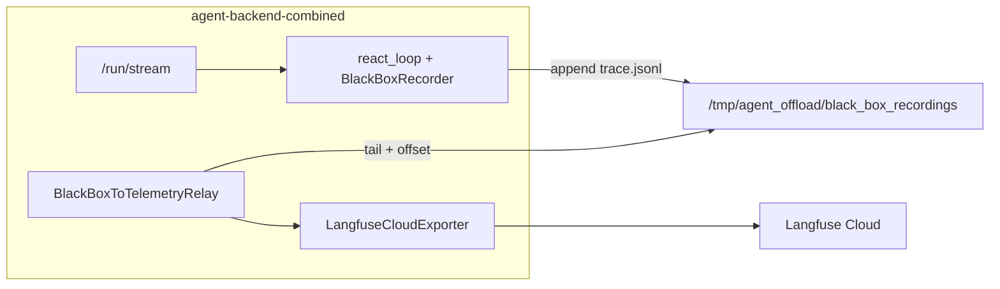

# Deploy BlackBox→Langfuse to Existing GCP Tier A

**Status:** Planned
**Last updated:** 2026-05-28

## Overview

Push the completed BlackBox→Langfuse pipeline to your existing Tier A GCP stack by fixing two production wiring gaps, rebuilding the backend image, applying a small Terraform env update, and verifying Langfuse traces plus compliance datasets.

## Context

Sprints A–G from [blackbox_to_langfuse.plan.md](blackbox_to_langfuse.plan.md) are merged locally (HEAD `4ad575e`). Your stack already follows [docs/recipes/gcp/LIVE_DEPLOYMENT.md](../recipes/gcp/LIVE_DEPLOYMENT.md) Day-2 §2.1 (incremental backend push).

**Recommended relay mode for Tier A:** `in_process` (default). The relay runs as an asyncio task inside `agent-backend-combined` — zero extra containers, matches the hybrid design in the plan, and avoids the out-of-scope Terraform sidecar work noted in plan §7.



---

## Blockers to fix before building the image

Two gaps prevent the pipeline from working on Cloud Run today, even though local dev (`middleware/__main__.py`) works.

### 1. Production lifespan never starts the relay

[middleware/app_prod.py](../../middleware/app_prod.py) calls `build_adapters()` (which creates `adapters.black_box_relay`) but its `lifespan` only compiles the graph — it never calls `relay.run_forever()` like dev does in [middleware/__main__.py](../../middleware/__main__.py) lines 385–460.

**Fix:** Mirror the dev pattern in `app_prod.py`:

- After `adapters = build_adapters()`, capture `relay = adapters.black_box_relay`
- In `lifespan`: `asyncio.create_task(relay.run_forever(interval_s=1.0))` when relay is not None
- In `finally`: `relay.stop()`, cancel task, await cancellation (same as dev)
- Log `BlackBox→Langfuse relay started/stopped (in-process)` for Cloud Logging verification

Add/adjust tests in [tests/middleware/test_app_prod.py](../../tests/middleware/test_app_prod.py) (lifespan starts relay when mode is `in_process`; no relay when `off`).

### 2. Storage path mismatch between recorder and relay

| Component | Path on Cloud Run |
|-----------|-------------------|
| `BlackBoxRecorder` (via `cache_dir`) | `/tmp/agent_offload/black_box_recordings/{workflow_id}/trace.jsonl` |
| Relay default ([composition.py](../../middleware/composition.py) `_DEFAULT_BB_STORAGE`) | `cache/black_box_recordings` (wrong cwd on Cloud Run) |

**Fix (Terraform + optional code hardening):**

Add plain env vars in [infra/gcp/cloud-run-backend.tf](../../infra/gcp/cloud-run-backend.tf):

```hcl
env {
  name  = "BLACKBOX_RELAY_MODE"
  value = "in_process"
}
env {
  name  = "BLACKBOX_STORAGE_DIR"
  value = "/tmp/agent_offload/black_box_recordings"
}
```

Update [tests/infra/gcp/test_cloud_run_backend.py](../../tests/infra/gcp/test_cloud_run_backend.py) to assert both vars are present and aligned with `AGENT_OFFLOAD_DIR`.

Optional hardening (nice-to-have, not required if Terraform sets the var): derive relay storage from `AGENT_OFFLOAD_DIR` in `_build_relay()` when `BLACKBOX_STORAGE_DIR` is unset and `GCP_EXECUTION_ENV=cloudrun`.

---

## Pre-flight (local, ~5 min)

From repo root:

```bash
source ./scripts/bootstrap_gcp_env.sh   # must show Preflight PASSED
pip install -e ".[dev]"

# Layer + pipeline tests for this feature
pytest tests/architecture/ -q
pytest tests/middleware/sidecars/ tests/middleware/test_composition_relay.py \
       tests/middleware/test_app_prod.py tests/services/governance/test_black_box_publisher.py -q
pytest tests/infra/gcp/test_cloud_run_backend.py -q -m infra_gcp
```

Confirm Langfuse secrets are live (not placeholders):

```bash
for s in langfuse-public-key langfuse-secret-key; do
  gcloud secrets versions list "$s" --project="$PROJECT" --limit=1
done
```

---

## Deploy steps (backend only)

Frontend image unchanged — BlackBox relay is backend-only.

Follow [LIVE_DEPLOYMENT.md §2.1](../recipes/gcp/LIVE_DEPLOYMENT.md):

```bash
export VERSION="blackbox-langfuse-v1"   # bump intentionally
export AR_URL="$(tofu -chdir=infra/gcp output -raw artifact_registry_url)"

# 1. Build + push backend by digest
docker build -f Dockerfile.backend -t "agent-backend:${VERSION}" .
docker tag "agent-backend:${VERSION}" "${AR_URL}/agent-backend:${VERSION}"
docker push "${AR_URL}/agent-backend:${VERSION}"

export BACKEND_IMAGE_DIGEST="$(gcloud artifacts docker images describe \
  "${AR_URL}/agent-backend:${VERSION}" \
  --project="$PROJECT" --format='value(image_summary.digest)')"
```

Update [infra/gcp/terraform.tfvars](../../infra/gcp/terraform.tfvars) (gitignored):

```hcl
backend_image = "REGION-docker.pkg.dev/PROJECT/agent-backend/agent-backend@sha256:BACKEND_DIGEST"
```

Apply:

```bash
cd infra/gcp
tofu plan -out=tfplan -var-file=terraform.tfvars
conftest test --policy policies/ --parser hcl2 --all-namespaces *.tf
tofu show -json tfplan > tfplan.json
terraform-compliance -p tfplan.json -f features/
tofu apply tfplan
```

Cloud Run shifts 100% traffic to the new revision automatically (`TRAFFIC_TARGET_ALLOCATION_TYPE_LATEST`).

---

## Post-deploy verification

### A. Health + smoke (existing)

```bash
export BACKEND_URL="$(tofu -chdir=infra/gcp output -raw backend_url)"
# Prefer /health for external checks: GFE may return HTML 404 for /healthz on
# some revisions while Cloud Run probes still succeed on /healthz internally.
curl -sf "${BACKEND_URL}/health" || curl -sf "${BACKEND_URL}/healthz"

export BEARER_TOKEN="<WorkOS JWT>"
./scripts/smoke_gcp.sh
```

### B. Relay started in logs (new)

```bash
gcloud logging read \
  'resource.labels.service_name="agent-backend-combined"
   AND textPayload=~"BlackBox.*relay started"' \
  --project="$PROJECT" --limit=5 --freshness=30m
```

Expect at least one `BlackBox→Langfuse relay started (in-process)` after revision boot.

### C. Langfuse trace — domain events (existing Step 12)

From [LOG_PIPELINE_GUIDE.md § Step 12](../recipes/gcp/LOG_PIPELINE_GUIDE.md#step-12-langfuse-trace-verification):

1. Run one authenticated chat via frontend or `./scripts/smoke_gcp.sh`
2. Copy `trace=<uuid>` from `stream_ended` log
3. Langfuse UI → Traces → search by that ID
4. Confirm existing spans: `run.started`, `tool.*`, `llm.*`, `run.finished`

### D. Langfuse trace — BlackBox observations (new acceptance)

Same trace should now also contain up to 9 BlackBox-mapped observations (same trace ID = `workflow_id`):

| Observation name | Type |
|------------------|------|
| `task.started` | agent |
| `guardrail.checked` | guardrail |
| `model.selected` | generation |
| `step.planned` / `step.executed` | chain / span |
| `tool.called` | tool |
| `parameter.changed` | span (if routing changed tier) |
| `error.occurred` | span + ERROR (failure runs only) |
| `task.completed` | agent |

Also check trace score `hash_chain_valid` = `1.0` on successful runs.

### E. Compliance datasets (new acceptance)

In Langfuse → Datasets:

- `agent-compliance-audit` — item added after successful workflow completion
- `agent-incident-replay` — item added only on failure / broken hash chain

### F. Failure-path log checks

```bash
# No Langfuse init failures
gcloud logging read \
  'resource.labels.service_name="agent-backend-combined"
   AND textPayload=~"langfuse client init failed"' \
  --project="$PROJECT" --limit=3 --freshness=1h

# No DLQ poison lines (healthy deploy)
gcloud logging read \
  'resource.labels.service_name="agent-backend-combined"
   AND textPayload=~"langfuse_failures|DLQ"' \
  --project="$PROJECT" --limit=5 --freshness=1h
```

---

## Rollback

If BlackBox export causes issues, rollback without touching data tier:

| Priority | Action |
|----------|--------|
| 1 | `gcloud run services update-traffic agent-backend-combined --to-revisions=PREV_REV=100` |
| 2 | Re-apply prior `@sha256:…` digest in `terraform.tfvars` → `tofu apply` |
| 3 | Emergency off-switch: set `BLACKBOX_RELAY_MODE=off` in Terraform and redeploy (agent runs continue; relay disabled) |

Langfuse telemetry from domain events (`telemetry_bridge`) is independent — disabling relay does not stop run/tool/llm spans.

---

## Known Tier A limitations (document, do not block deploy)

From plan §2.4 and §7:

- **tmpfs durability:** BlackBox JSONL lives on `/tmp/agent_offload` (ephemeral). Relay polls every 1s, so loss window is small but not outbox-grade. GCS FUSE / Pub/Sub is Tier B.
- **Langfuse quota:** Hobby tier = 50K observation units/month. BlackBox adds ~9 observations per run on top of existing ~10–20 domain-event units. At 5–20 chats/day this stays within budget; monitor in Langfuse usage dashboard.
- **In-process relay + scale-to-zero:** Relay runs only while the Cloud Run instance is alive (during SSE streams). Events written mid-request are flushed within 1s; events after instance scale-down rely on tmpfs surviving until next request — acceptable for Tier A dev.

---

## Optional follow-ups (out of this deploy scope)

- Extend [scripts/smoke_gcp.sh](../../scripts/smoke_gcp.sh) with warn-only check for `relay started` log line
- Add LOG_PIPELINE_GUIDE Step 13 for BlackBox observation verification
- Tier B: external sidecar via `python -m middleware.sidecars` + multi-container Cloud Run (plan §7)
