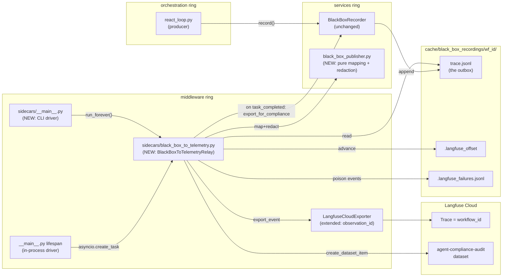

# BlackBox → Langfuse Implementation Plan

**Status:** In Progress | Sprints A, B, C, D complete
**Last updated:** 2026-05-28

## Overview

Forward all 9 `BlackBoxRecorder` event types to Langfuse Cloud via an outbox-style relay that tails the existing JSONL audit log, then publish the compliance bundle (`export_for_compliance`) as a Langfuse dataset item on workflow completion. Ship a three-recipe story-narrative tutorial series under [docs/recipes/governance/](../recipes/) so beginner AI engineers can learn and maintain the code.

---

## 1. Why this is straightforward to build

Two facts unlock the design:

- **`workflow_id` IS the Langfuse `trace_id`.** Per [agent_ui_adapter/adapters/runtime/langgraph_runtime.py](../../agent_ui_adapter/adapters/runtime/langgraph_runtime.py) lines 122 and 156-161, the runtime mints one UUID and seeds it as both `trace_id` (on every `DomainEvent`) and `workflow_id` (into the LangGraph state). BlackBox events keyed by `workflow_id` therefore land under the same Langfuse trace as `run.started`/`tool.started`/`llm.started` automatically — no mapping table required.
- **The append-only JSONL is already a textbook transactional outbox.** [services/governance/black_box.py](../../services/governance/black_box.py) writes durable, SHA-256-chained events to `cache/black_box_recordings/{workflow_id}/trace.jsonl`. A relay that tails that file, publishes via the existing `TelemetryExporter` port, and tracks per-workflow byte offsets gives at-least-once delivery to Langfuse with no dual-write risk.

---

## 2. Design decisions and trade-offs

### 2.1 Timing — live tee vs batch vs async outbox

| Concern | Pure live (sync) | Pure batch (on completion) | Async live + DLQ retry (chosen) |
|---|---|---|---|
| Latency impact on agent run | Worst — exporter in hot path | Best — zero | Best — fire-and-forget |
| Visibility in Langfuse | Real-time | Only after `task_completed` | Real-time |
| Survives Langfuse outage | Loses events unless wrapped | Survives (chain replayed on retry) | Survives (file is the durable buffer) |
| Integrity verification | Per-event only | Pre-publish (chain checked once) | Per-event + final chain assertion |
| Architectural risk | Dual-write — disk write succeeds, API call fails, silent divergence | None | Resolved by outbox semantics |
| Implementation cost | Cheap but fragile | Cheap but no live UX | Modest — sidecar relay |
| Delivery guarantee | Tries exactly-once, fails open | At-least-once on retry | At-least-once (idempotent via `event_id`) |

**Decision:** async live tee + DLQ retry. Backed by external research:

- Langfuse's [own docs on queuing/batching](https://langfuse.com/docs/observability/features/queuing-batching) confirm the Python SDK already batches asynchronously in a background thread; `client.flush()` "never throws — logs an error and retries." So live tee adds zero runtime latency.
- The [dual-write problem](https://www.abstractalgorithms.dev/dual-write-problem-and-solutions) is well-documented as the leading cause of silent observability divergence; the industry-standard fix is the [Transactional Outbox pattern](https://docs.aws.amazon.com/prescriptive-guidance/latest/cloud-design-patterns/transactional-outbox.html), where one durable store is written atomically and a separate relay publishes to the external system. The BlackBox JSONL is already that store.
- [Baaz 2026 data integration guidance](https://baaz.pro/blog/reliable-data-integration-events-cdc-outbox): "Never dual-write… use outbox or CDC; rely on idempotent handlers because brokers typically guarantee at-least-once."

### 2.2 Trace mapping — same trace vs sibling trace

**Decision:** same Langfuse trace. The runtime adapter already seeds `workflow_id = trace_id` (verified at [agent_ui_adapter/adapters/runtime/langgraph_runtime.py:158](../../agent_ui_adapter/adapters/runtime/langgraph_runtime.py)), so BlackBox events and the existing run/tool/llm domain events naturally share one Langfuse trace. No mapping table; no separate compliance trace.

### 2.3 Producer shape — recorder direct vs orchestrator tee vs sidecar

**Decision:** **sidecar tailing the JSONL**, with the recorder unchanged.

- `BlackBoxRecorder` stays pure and framework-agnostic (zero SDK imports), satisfying the [AGENTS.md](../../AGENTS.md) layering rules for `services/`.
- The 7 `record()` call sites in [orchestration/react_loop.py](../../orchestration/react_loop.py) stay focused on a single side effect (write to disk).
- The sidecar is a natural outbox relay, decoupled from the agent's hot path.

### 2.4 Sidecar deployment shape — in-process vs out-of-process vs hybrid

| Option | A. In-process asyncio task | B. Out-of-process sidecar | C. Hybrid (chosen) |
|---|---|---|---|
| Local dev DX | Excellent — zero new process | Friction — second terminal | Excellent (defaults to in-process) |
| Cloud Run lifecycle reliability | Risky — [GCP docs warn](https://cloud.google.com/run/docs/triggering/using-tasks) that "background tasks outside the request lifecycle aren't a pattern Cloud Run reliably supports"; works while streams are open, can stall during scale-to-zero unless CPU-always-allocated (~3× cost) | Strong — multi-container Cloud Run isolates lifecycle; survives main-app crashes | Defaults to A locally, flips to B in prod via one env var |
| Failure isolation | Relay crash can affect agent process | Main crash doesn't stop relay (and vice versa); independent limits | Configurable |
| Backpressure / buffer | Relies on JSONL file | Same | Same |
| Resource overhead | Negligible — one asyncio task | Another container | Negligible default; pay container only when graduated |
| Industry guidance | OK for ≤100 events/sec/pod; "start simple" ([Markaicode 2026](https://markaicode.com/architecture/opentelemetry-agent-architecture-production/)) | Required at >500 events/sec or strict isolation | [OneUptime 2026](https://oneuptime.com/blog/post/2026-01-30-log-shipping-strategies/view): "Start simple, add complexity only when measured demand requires it" |

**Decision:** hybrid. Build `BlackBoxToTelemetryRelay` as a reusable class with two driver shells: in-process driver in `middleware/__main__.py` lifespan (default), and a CLI driver at `python -m middleware.sidecars.black_box_to_telemetry` (future-proofs production graduation without rewriting code).

**Documented caveat:** BlackBox JSONL currently lives in `/tmp/agent_offload` on Cloud Run (per [middleware/__main__.py:289-293](../../middleware/__main__.py)), which is tmpfs and dies with the container. The relay reduces the loss window by flushing on every poll (default 1 s), but truly durable outbox-grade storage on Cloud Run would need GCS FUSE or a switch to Pub/Sub. Out of scope; flagged for Tier B graduation.

---

## 3. Architecture



Key layering invariants (enforced by `tests/architecture/test_middleware_layer.py`):

- `services/governance/black_box_publisher.py` has zero SDK imports — only `services.guardrails` and `services.governance.black_box`.
- `middleware/sidecars/black_box_to_telemetry.py` imports the `TelemetryExporter` port, never `langfuse` directly.
- `BlackBoxRecorder` is unchanged.

---

## 4. Event-type → Langfuse observation mapping (all 9)

Implemented in `services/governance/black_box_publisher.py`:

```python
_EVENT_TYPE_TO_OBSERVATION = {
    EventType.TASK_STARTED:      ("agent",      "task.started"),
    EventType.TASK_COMPLETED:    ("agent",      "task.completed"),
    EventType.STEP_PLANNED:      ("chain",      "step.planned"),
    EventType.STEP_EXECUTED:     ("span",       "step.executed"),
    EventType.TOOL_CALLED:       ("tool",       "tool.called"),
    EventType.MODEL_SELECTED:    ("generation", "model.selected"),
    EventType.GUARDRAIL_CHECKED: ("guardrail",  "guardrail.checked"),
    EventType.PARAMETER_CHANGED: ("span",       "parameter.changed"),
    EventType.ERROR_OCCURRED:    ("span",       "error.occurred"),   # + level=ERROR
}
```

Attributes per event include `event_id`, `workflow_id`, `step`, `timestamp`, `integrity_hash`, plus a redacted `details` projection (200-char cap per value, PII/api-key stripped via `services.guardrails.output_guardrail_scan`).

---

## 5. Sprint breakdown

### Sprint A — Publisher kernel (services layer) ✅ Complete

- New: `services/governance/black_box_publisher.py` — pure functions `to_export_kwargs(event) -> (name, type, attrs, level)` and `redact_details(details) -> dict[str, str]`.
- New: `tests/services/governance/test_black_box_publisher.py` — 34 L2 contract tests: all 9 event types map correctly; redaction strips PII (emails, SSNs, phones) and API keys (OpenAI, AWS, GitHub); details longer than 200 chars are truncated; architecture invariants (no SDK imports) AST-checked. All passing in <1s.

### Sprint B — Wire the missing 4 event emissions in [orchestration/react_loop.py](../../orchestration/react_loop.py)

Current state: only 5 of 9 event types are emitted (`TASK_STARTED`, `GUARDRAIL_CHECKED`, `MODEL_SELECTED`, `STEP_EXECUTED`, `TOOL_CALLED`). Adding:

| Missing event | Emission site |
|---|---|
| `STEP_PLANNED` | Plan/planning node where `build_plan_artifact` returns |
| `PARAMETER_CHANGED` | Runtime-mutable threshold/tier sites (router rollback, model tier override) |
| `ERROR_OCCURRED` | `_execute_tools_impl` exception handler; `call_llm_node` LLM-error branch |
| `TASK_COMPLETED` | Terminal edge before `END`, both success and failure paths, outcome in `details` |

- Modify: `orchestration/react_loop.py`
- Extend: `tests/orchestration/test_react_loop.py` to assert each new emission.

### Sprint C — Relay class + idempotency hook ✅ Complete

- New: `middleware/sidecars/__init__.py`
- New: `middleware/sidecars/black_box_to_telemetry.py` — `BlackBoxToTelemetryRelay` with:
  - `run_once()` — scan `cache/black_box_recordings/*/trace.jsonl`, resume from `.langfuse_offset`, publish new lines, advance offset.
  - `run_forever(interval_s=1.0)` — async loop wrapping `run_once`.
  - DLQ: configurable jittered exponential-backoff retries before writing to `.langfuse_failures.jsonl` and advancing past the poison line.
  - File-watch method: simple `mtime` poll at 1 s (no new deps; `watchdog` swap deferred).
  - Forward-only on startup (absent `.langfuse_offset` = seek to end-of-file).
  - Partial-line safety: incomplete JSONL tails deferred to next poll.
- Modify: [middleware/adapters/observability/langfuse_cloud_exporter.py](../../middleware/adapters/observability/langfuse_cloud_exporter.py) — extended `export_event` to extract `__bb_observation_id`, `__bb_observation_type`, `__bb_level` from attributes; passes observation `id` for idempotent retries and overrides `as_type`/`level` when present.  Port Protocol (`TelemetryExporter`) unchanged — relay hints passed through the existing `attributes` dict.
- New: `tests/middleware/sidecars/test_black_box_to_telemetry.py` — 24 L2 contract tests: DLQ promotion (corrupt JSON, exporter failure, offset advance past poison), offset bookkeeping (publish + advance, resume from saved, multi-workflow independence), forward-only startup (absent offset → EOF, new events after startup), mtime-based pickup, idempotent export (observation_id/type/level in attributes), run_forever lifecycle, partial-line safety, architecture invariants (no langfuse/langgraph imports). All passing in <0.5s.

### Sprint D — Composition + drivers ✅ Complete

- Modify: [middleware/composition.py](../../middleware/composition.py) — added `black_box_relay: BlackBoxToTelemetryRelay | None` to `MiddlewareAdapters`; honors `BLACKBOX_RELAY_MODE` env (`in_process` default, `off`, `external`). Helper `_build_relay()` reads `BLACKBOX_STORAGE_DIR` for custom paths.
- Modify: [middleware/__main__.py](../../middleware/__main__.py) — inside `lifespan`, when relay mode is `in_process` starts `asyncio.create_task(relay.run_forever())`; cancels + stops on lifespan exit via `finally` block.
- New: `middleware/sidecars/__main__.py` — CLI entrypoint for out-of-process deployment, reuses `build_adapters()`. Signal handling for SIGINT/SIGTERM. Usage: `python -m middleware.sidecars`.
- Extended: `tests/architecture/test_middleware_layer.py` — `TestSidecarMainLayering` class asserts sidecar __main__ never imports `langfuse`/`langgraph`/forbidden layers.
- New: `tests/middleware/test_composition_relay.py` — 14 L2 contract tests: relay mode handling (in_process/off/external/unknown), composition integration (field exists, correct type, shared exporter), lifespan lifecycle (start+stop, cancellation). All passing.
- New: `tests/middleware/sidecars/test_sidecar_cli.py` — 6 L2 contract tests: failure paths (missing env), CLI structure (main function, __name__ guard), reuse of build_adapters. All passing.

### Sprint E — Compliance bundle as Langfuse dataset item

- Add `publish_compliance_bundle(workflow_id, dataset_name)` to the relay, triggered on observing a `TASK_COMPLETED` event for a workflow.
- Calls `BlackBoxRecorder.export_for_compliance(...)` to get the integrity-verified bundle, then uses the Langfuse SDK to upsert a dataset item in `agent-compliance-audit` (failures go to a second `agent-incident-replay` dataset).
- Attach `hash_chain_valid` as a Langfuse score on the trace.
- New: `tests/middleware/sidecars/test_compliance_dataset.py` — success-path and broken-chain-path both upload with the correct status.

### Sprint F — Three-recipe governance tutorial series

Create `docs/recipes/governance/` mirroring the [docs/recipes/gcp/](../recipes/gcp/) style: vivid "Before We Start: A Story" intro, numbered lessons, "Checkpoint question" + answer per lesson, "Why not X?" sidebars, mermaid diagrams, code snippets headed with file paths, status banner at top.

| File | Working title | Narrative arc | Code covered |
|---|---|---|---|
| `00_overview.md` | *The Black Box Hidden in Your Cache Folder* | Series intro. Aviation analogy from [governanaceTriangle/02_black_box_recording_debugging.md](../../governanaceTriangle/02_black_box_recording_debugging.md), but ends with: "If your flight recorder is invisible until you crash, did it ever really exist?" | none — sets the arc |
| `01_outbox_relay.md` | *The Dual-Write Bug That Could Have Stayed Hidden Forever* | The 2 AM pager scenario; the dual-write trap; the transactional outbox pattern; why the JSONL already is one; how the relay tails it. Lessons: (1) the dual-write trap, (2) JSONL-as-outbox, (3) offset bookkeeping for at-least-once delivery, (4) in-process vs out-of-process drivers — when to graduate. | Sprints A, C, D |
| `02_event_mapping.md` | *Translating Nine Languages Into One Timeline* | The nine event types and why Langfuse's observation types are the right Rosetta Stone. Lessons: (1) the 9-to-9 mapping, (2) idempotency via `observation_id`, (3) redaction reusing existing guardrails (the "PII leaking into vendor UIs" cautionary tale), (4) wiring the 4 missing producers. | Sprint A publisher + Sprint B emissions |
| `03_compliance_dataset.md` | *Turning Every Failed Workflow Into a Lesson Plan* | The auditor visit; the compliance bundle and its hash chain as Langfuse dataset items; the `agent-incident-replay` dataset for regression testing. Lessons: (1) why Langfuse datasets (not metadata) for audit-grade payloads, (2) the integrity chain as a Langfuse score, (3) replaying failed workflows for evals. | Sprint E |

Each recipe ends with a status banner ("Complete | N contract tests passing | ~$0/mo Langfuse incremental at dev tier"), a "Run it yourself" section, and links to the next recipe.

---

## 6. Defaults that ship in this work

- File-watch method: `mtime` polling, 1 s interval. (`watchdog` flagged as future swap.)
- DLQ retry policy: 5 attempts, jittered exponential backoff (1, 2, 4, 8, 16 s), then `.langfuse_failures.jsonl` and advance offset.
- Datasets: `agent-compliance-audit` (all completions) + `agent-incident-replay` (failures only).
- Backfill on startup: forward-only — absent `.langfuse_offset` seeks to end-of-file.
- Sidecar runner: in-process default; CLI mode available, not wired into deployment.
- Idempotency: pass `event_id` UUID as Langfuse observation `id` (verify v4 SDK accepts; fallback is metadata-only dedupe).

---

## 7. Out of scope (documented, not implemented)

- Migrating BlackBox storage off Cloud Run tmpfs to GCS FUSE or Pub/Sub for true cross-instance durability.
- Sampling for ultra-high-volume production (>500 events/sec); current default sends everything.
- Backfill CLI for historical recordings (forward-only by choice).
- Wiring the relay as a Cloud Run sidecar container in Terraform; the CLI driver exists so this can be added later without code changes.

---

## 8. References

- [services/governance/black_box.py](../../services/governance/black_box.py) — the unchanged recorder.
- [middleware/adapters/observability/langfuse_cloud_exporter.py](../../middleware/adapters/observability/langfuse_cloud_exporter.py) — existing exporter to be extended with `observation_id`.
- [middleware/telemetry_bridge.py](../../middleware/telemetry_bridge.py) — the structural template the new publisher mirrors (pure mapping, no SDK imports).
- [agent_ui_adapter/adapters/runtime/langgraph_runtime.py](../../agent_ui_adapter/adapters/runtime/langgraph_runtime.py) — proof that `workflow_id == trace_id`.
- [governanaceTriangle/02_black_box_recording_debugging.md](../../governanaceTriangle/02_black_box_recording_debugging.md) — the user-facing BlackBox tutorial whose investigation workflow this work amplifies.
- [docs/recipes/gcp/00_adapters.md](../recipes/gcp/00_adapters.md), [docs/recipes/gcp/07_observability.md](../recipes/gcp/07_observability.md) — the story-narrative tutorial style the governance recipes will mirror.
- [Langfuse event queuing/batching docs](https://langfuse.com/docs/observability/features/queuing-batching).
- [AWS Prescriptive Guidance — Transactional outbox pattern](https://docs.aws.amazon.com/prescriptive-guidance/latest/cloud-design-patterns/transactional-outbox.html).
- [OneUptime 2026 — Log shipping strategies](https://oneuptime.com/blog/post/2026-01-30-log-shipping-strategies/view).
- [Markaicode 2026 — OpenTelemetry agent architecture](https://markaicode.com/architecture/opentelemetry-agent-architecture-production/).
- [Cloud Run async task guidance](https://cloud.google.com/run/docs/triggering/using-tasks).
