# C1 — Detailed Design: Deterministic Message-History Compaction + B2 Pinned-Facts Floor

> **What this is.** The detailed, build-ready design doc for **C1** from [`context_compression_runtime_pipeline.plan.md`](context_compression_runtime_pipeline.plan.md) §4 / §8 — the deterministic (no-LLM) message-history compaction slice (observation-clearing → oldest→summary fold → keep-last-K) plus the B2 anti-truncation floor. The companion plan doc holds the design-space map (§1–§7) and the external-research scans (§B1-R, §B2-R); **this doc is the C1 implementation spec.**
> **Status:** design ready, default-OFF, prod byte-identical when off. Not built. Two human-decided ambiguities resolved (see §0).

---

## 0. Decisions locked (the two real forks)

Both resolved with the user; they shape the rest of the design:

- **Turn unit = `step_count`.** All window sizes (mask-after-M, keep-last-K, cooldown-K, re-inject-every-N) are counted in the existing `step_count` clock (`orchestration/state.py:58`, `Annotated[int, operator.add]` — monotonic across the run and across checkpoint reload). Zero new cadence state; deterministic; checkpoint-safe. It ticks once per LLM evaluation (not per human message), which is *intended*: masking targets **old tool observations** — exactly the verbose, fan-out-heavy content where token cost accumulates.
- **Tail re-injection: seam designed, default OFF (`N=0`); persisted append-only when on.** The B2 anti-dilution floor (§B2-R S1/S2) is built as a real seam but ships with `context_constraint_reinject_turns=0` (off). By default the floor lives only in the **leading system prompt + the fold's PINNED block** (cache-stable). When opt-in (`N>0`), the tail floor is **appended to the checkpointer's `messages` (persisted, append-only)** on cadence turns — *not* re-derived transiently each read. A transient tail would appear on turn T and vanish on T+1, diverging the prompt prefix at the tail and **invalidating the KV-cache suffix every cadence turn** (negating compaction's savings — the §B1-R R6 tension made concrete). A small persisted `SystemMessage` instead keeps the prefix append-only between folds, and the next write-side fold (§5.1) absorbs/refreshes it. Re-injection is still calibrated live against prompt-cache-hit-rate; this honors both findings and defers the on/off tradeoff to eval data rather than guessing.

**Diagram — the two locked forks.**

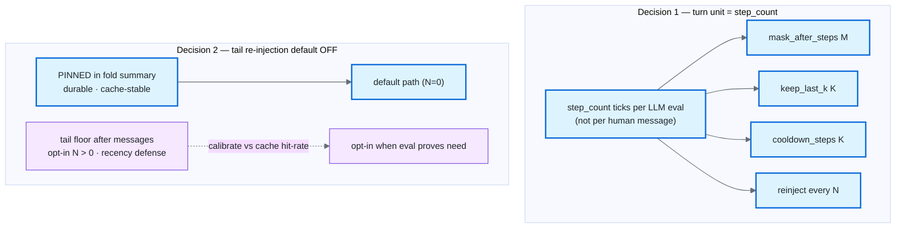

---

## 1. Context (why this change)

`services/summarizer.py` compacts `reasoning_trace` (cheap, append-only, ~bounded) and **never touches `state["messages"]`** — the dominant token driver, re-sent in full every lap (`react_loop.py:1583`). The external evidence (§B1-R) says the highest-leverage, lowest-risk first move is **not** prose summarization but **clearing old tool-observation content** (The Complexity Trap, NeurIPS 2025: ~half the cost, *beats* LLM-summary on solve rate, fully deterministic). Two correctness traps must be respected or the work is net-negative: compaction **must rewrite checkpointed state** (append-only `messages` re-bloats on resume — documented LangChain bug deepagents#2876, §B1-R R4) and must fire **rarely in big batches** (per-turn trimming shatters the KV-cache prefix and can negate the savings, §B1-R R6). B2 adds: pinning a do-not constraint into context does **not** keep it obeyed — omission constraints decay to ~20% by turn ~25 from attentional dilution (§B2-R S1), needing a *separate* recency defense from the compaction-loss defense.

**Diagram — the gap today vs what C1 targets.** Solid boxes are what the model sees each lap; dashed boxes are compacted elsewhere and *not* re-sent on the message path.

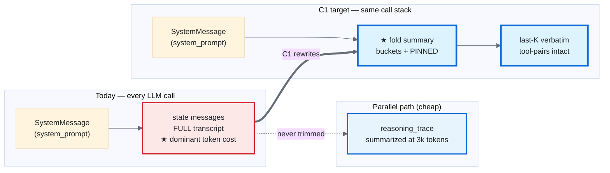

---

## 2. Verified live anchors (ground truth, re-checked this session)

| Anchor | Fact |
|---|---|
| `react_loop.py:1580-1588` | `call_llm_node` reads `state["messages"]`, stacks `[SystemMessage(system_prompt)] + list(existing_messages)`. **No trimming today. READ-side seam.** |
| `react_loop.py:2044-2059` | Inside `evaluate_node` (`async def` → plain `dict result`), the *only* compaction trigger. Sets `result["files"]`, `result["reasoning_trace"]=[summary_text]`, `result["truncation_applied"]=True`. **Never sets `result["messages"]`. WRITE-side seam.** |
| `react_loop.py:2061` | `updated_step_count = state.get("step_count", 0) + 1` — right after the compaction block, same return path. The cooldown gate + `last_compaction_step` stamp go here. |
| `react_loop.py:349, 477` | Both ToolMessages are `ToolMessage(content=message_output, tool_call_id=tool_id)` (in `_execute_tools_impl`). `content` + `tool_call_id` are what observation-masking targets. |
| `state.py:58` | `step_count: Annotated[int, operator.add]` — the turn clock (decision §0). |
| `state.py:69-70` | `current_token_count: int`, `truncation_applied: bool` (plain, last-write-wins). **No `last_compaction_step` field exists.** |
| `state.py:50` | `messages` uses `add_messages` (inherited `MessagesState`). **Verified against the installed `langgraph 0.6.11`** (`message.py:207-211`): `add_messages` short-circuits on `REMOVE_ALL_MESSAGES` — `if isinstance(m, RemoveMessage) and m.id == REMOVE_ALL_MESSAGES: … return right[remove_all_idx + 1:]` — so the update list after the sentinel is taken **verbatim**, ids auto-assigned. Clean-rewrite semantics. `messages` is the **only** channel using `add_messages`; every other channel uses an independent reducer (`operator.add` / `_append_list` / `_merge_dict`, `state.py:56-176`), so the rewrite **cannot** interact with them. **This sentinel path is exercised nowhere in the repo today** (`RemoveMessage`/`REMOVE_ALL_MESSAGES` appear in no current source) — so build step 5's round-trip test (§11) is *load-bearing ground truth*, not a formality, and it pins the behavior to this langgraph version. |
| `services/summarizer.py` | Framework-clean (pydantic only, no langchain). `should_compact_trajectory`, `build_compaction_summary`. **Extend additively.** |
| `base_config.py:20, 39` | `ModelProfile.context_window: int` (=128000 capable); `AgentConfig.trajectory_compaction_token_threshold: int = 3000`. |
| `composition.py` | env→`AgentRuntimeSettings` via `Field(default=…, validation_alias="ENV")`; bool flags in `from_mapping` bool-list (`:509-520`) via `_env_flag_from_mapping`; ints in the coercion arm (`:521-522`); copied into `AgentConfig(...)` (`:629`). `carrier_gate_enforce_mode` is the derive-at-root precedent; C1 needs only direct copies. |
| `schemas.py:220` | `TaskUnderstanding.success_conditions: list[str]`, `source: Literal["deterministic","generated","user_edited"]`. In state as `task_understanding: dict`; read at `evaluate_node:2091-2098`. **Pinned-set source.** |
| `services/governance/memory_consolidation_carrier.py` | `emit_consolidation_carrier(black_box, *, workflow_id, user_id, mem_type, outcome)` → `TraceEvent(EventType.MEMORY_CONSOLIDATED, details={counts only})`. Content-free clone target. Not changing `default_spec()` (`trust/governance_carrier_spec.py`) keeps the drift-guard green. |
| `tests/architecture/test_dependency_rules.py:104,117` | AST scan: I-4 `services/` no `langchain_core`; I-5 `services/` no `components`. Enforced automatically on the new code. |
| `services/governance/guardrail_validator.py:56` | Per-category `ValidationResult` (`guardrail_name`/`passed`/`details`/`severity`/`matches`) — the C2 **L1** hard-gate clone target. |
| `services/eval_capture.py:20` + `services/eval_telemetry.py:176` | `eval_capture.record(target=…, ai_input, ai_response, config)` → `observation_name_for_target` auto-maps `target` to the `eval.{target}` Langfuse observation. **L2 shadow capture seam** (target=`compaction_fidelity`). |
| `services/governance/goaljudge_calibration.py` / `memory_enable_policy.py:77,202` | GoalJudge calibration metrics (`precision_recall_fd`, `judge_gold_kappa`, `flip_rate`, ECE) + `EnablePolicyCertificate` + `resolve_write_back` composition-root guard. **Reuse targets for the DEFERRED L2 graduation** (§8.4); C1 documents, doesn't build. |

---

## 3. Architecture: where each piece lives (four-layer clean)

```
services/summarizer.py        ← PURE compaction logic, operates on MessageView only (I-4: no langchain)
orchestration/message_view.py ← NEW: the ONLY BaseMessage↔view boundary (orchestration may import langchain)
orchestration/react_loop.py   ← thin wiring: read-side mask+tail (1583), write-side fold+rewrite (2044) (I-7)
services/base_config.py       ← new context_* config fields (pure data)
middleware/composition.py     ← env→settings→config threading for CONTEXT_* flags
services/governance/context_compaction_carrier.py ← NEW: counts+hash carrier (Recording; clone consolidation shape) (§7)
services/governance/black_box.py          ← +1 EventType.CONTEXT_COMPACTED enum member (§7)
services/governance/black_box_publisher.py ← +1 _EVENT_TYPE_TO_OBSERVATION entry (→ "context.compacted") (§7)
orchestration/state.py        ← ONE new field: last_compaction_step (plain int, last-write-wins)
orchestration/react_loop.py   ← +1 typed ContextWindowExhaustedError (raised at the §5.4 terminal gate, where profile is in scope; classified `terminal`, sets last_error_type — §5.4)
```

**The boundary rule.** `services/summarizer.py` cannot import `langchain_core` (I-4, `test_dependency_rules.py:104`). So every pure function takes and returns a **stdlib `MessageView` + plain-data plan** — never a `BaseMessage`. The new `orchestration/message_view.py` is the *only* place the two meet.

> **Directory-naming note.** This doc uses the **live** repo package names — `services/`, `components/`, `services/governance/` (per [AGENTS.md §Key Directories](../../AGENTS.md)). The companion [FOUR_LAYER_ARCHITECTURE.md](../Architectures/FOUR_LAYER_ARCHITECTURE.md) illustrates the same four-layer grid with the *aspirational* trust-foundation names (`utils/`, `agents/`, `governance/`); the **dependency rules are identical** under either naming (Orchestration → Components → Services → Trust, never upward). When cross-checking a FOUR_LAYER grid-placement table, read `utils/`≈`services/`, `agents/`≈`components/`, `governance/`≈`services/governance/`.

**Diagram — four-layer placement and the MessageView boundary.** Solid arrows are allowed imports (outer → inner). The dashed box is the *only* langchain touchpoint.

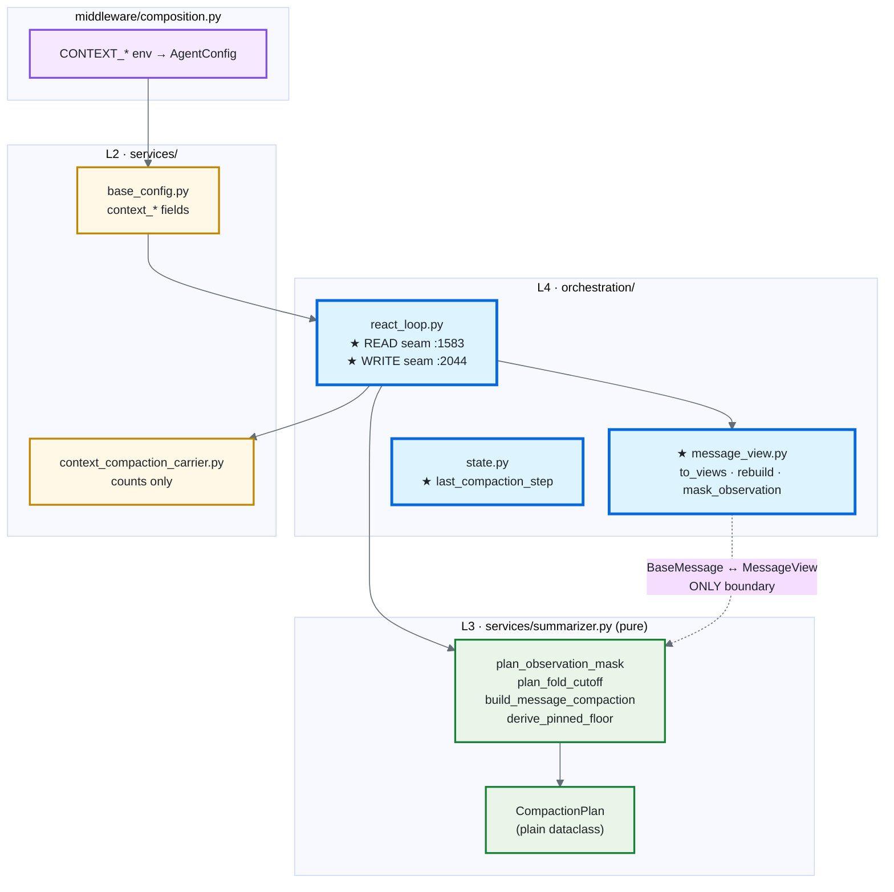

### 3.1 The `MessageView` (stdlib, in `orchestration/message_view.py`)

```python
@dataclass(frozen=True)
class MessageView:
    role: Literal["system", "human", "ai", "tool"]
    content: str
    tool_call_id: str | None = None     # set on tool observations (the masking key)
    tool_calls: tuple[str, ...] = ()     # tool_call_ids an AI msg requested (orphan-safety)
```

`tool_calls` carries only ids — enough for the safe-cutoff to compute **Interaction Block** membership: an AI view's `tool_calls` (issued ids) match the `tool_call_id`s of the tool views that answer it. Block membership is therefore derived purely from id-matching — the pure planner needs **no new field** to keep a parallel-tool-call block intact. No `id` field: the rewrite rematerializes fresh `BaseMessage`s and `add_messages` assigns ids.

### 3.2 Adapter functions (`orchestration/message_view.py`)

- `to_views(msgs: list[BaseMessage]) -> list[MessageView]`
- `rebuild(*, summary: str | None, preserved: list[BaseMessage], tail: str | None) -> list[BaseMessage]` — rematerializes the compacted transcript (summary `SystemMessage`, the verbatim preserved tail, optional tail-floor `SystemMessage`).
- `mask_observation(msg: BaseMessage, placeholder: str) -> BaseMessage` — returns a ToolMessage copy with `content` replaced, `tool_call_id` kept.

### 3.3 Pure functions return a **plan**, orchestration does the slicing

The pure layer returns plain data (a `CompactionPlan`); orchestration maps plan→`BaseMessage`s and emits the `RemoveMessage`. Rationale: determinism + golden-testability with **zero langchain in the test**, and I-7 thinness (orchestration makes no compaction *decisions*, only materializes the plan). Returning a rebuilt view list instead would couple the pure layer to the rebuild contract and still force re-materialization — no gain.

---

## 4. C1 — the pure functions (`services/summarizer.py`, additive)

All pure, deterministic, no LLM, no langchain. Existing trajectory functions untouched.

1. **`plan_observation_mask(views, *, mask_after_steps=10) -> frozenset[int]`** — indices of tool-observation views older than the last `M` steps whose `content` should become the placeholder. Reasoning/AI/human views never selected. `M=10` is the §B1-R R1 ablated optimum. Content-free by construction (we drop text; we don't relocate it into a carrier).
2. **`plan_fold_cutoff(views, *, keep_last_k) -> int`** — the safe cutoff index (port of LangChain `_find_safe_cutoff_point`, §B1-R R3). The indivisible unit is an **Interaction Block** = one AI view **plus *all* the tool views answering its `tool_call_id`s** (an `AIMessage` can issue *parallel* tool calls). The cutoff may land **only on a block boundary, never mid-block**: if it would split a block, walk back to the block's AI view *and* pull **every** answering tool view into the preserved suffix. This is bidirectional — it is not enough to keep the issuing AI view; a parallel tool result left in the dropped prefix would orphan its call and produce a frontier-API 400 (Anthropic/OpenAI reject an assistant `tool_calls` turn with an unanswered call). System views preserved.
3. **`build_message_compaction(views, *, keep_last_k, pinned) -> str`** — the structured fold for the dropped prefix, bucket schema (§B1-R R3/R7, *keep structure, no opaque blob*): `SESSION INTENT / SUMMARY (decisions, rejected options) / ARTIFACTS (files+paths) / NEXT STEPS`, plus a **PINNED** block of atomic, polarity-tagged constraint strings copied **verbatim** and never summarized. Deterministic (B1-det); LLM variant deferred to v1.5 via a pluggable-summarizer arg.
4. **`derive_pinned_floor(success_conditions, user_constraints) -> list[PinnedConstraint]`** — atomic, verbatim, polarity-tagged (`must-do` / `must-not`) constraint objects from `task_understanding.success_conditions` (`schemas.py:220`) + explicit user constraints. Compound rules split so the C2 gate is per-constraint (§B2-R S3).
5. **`build_constraint_floor(pinned, *, polarity_filter="must-not") -> str`** — a compact verbatim string for **tail re-injection** (recency defense, §B2-R S2/S5), filtered to the fragile `must-not` class by default (§B2-R S1). Pure; rendered independent of compaction.

`CompactionPlan` (plain dataclass, the pure→orchestration handoff): `mask_indices: frozenset[int]`, `cutoff: int`, `summary: str`, `pinned: list[PinnedConstraint]`, `floor_exceeded: bool`.

**Diagram — pure compaction pipeline (deterministic, no LLM).** Orchestration converts `BaseMessage`s → views, runs the plan, materializes the result.

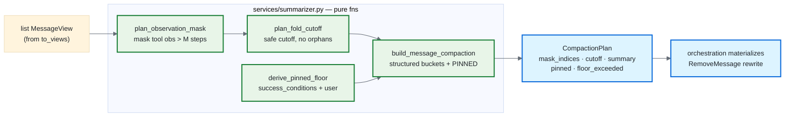

**Diagram — safe cutoff (Interaction-Block integrity).** If the cutoff would split a block, walk back to the block's AI message *and* keep **all** its parallel tool observations in the suffix — never just the AI message.

```mermaid
%%{init: {
  'theme': 'base',
  'themeVariables': {
    'primaryTextColor': '#1f2328',
    'lineColor': '#656d76',
    'fontSize': '13px'
  },
  'flowchart': { 'padding': 16, 'nodeSpacing': 20, 'rankSpacing': 32, 'htmlLabels': true }
}}%%
flowchart LR
    subgraph DROPPED["Prefix → folded into summary"]
        H1["Human"]
        A1["AI + tool_calls"]
        T1["Tool obs<br/>(maskable)"]
        H2["Human"]
        A2["AI + tool_calls"]
        T2["Tool obs<br/>(maskable)"]
        H1 --> A1 --> T1 --> H2 --> A2 --> T2
    end

    CUT{{"cutoff<br/>(keep_last_k)"}}

    subgraph KEPT["Suffix → verbatim tail"]
        A3["AI + tool_calls"]
        T3["Tool obs<br/>recent"]
        H3["Human"]
        A3 --> T3 --> H3
    end

    T2 --> CUT
    CUT -->|"lands on Tool → walk back"| A2
    A2 -. "include pair" .-> T2
    CUT --> A3

    classDef drop fill:#fff8e6,stroke:#bf8700,stroke-width:1px,color:#1f2328
    classDef keep fill:#e8f5e8,stroke:#1a7f37,stroke-width:2px,color:#1f2328
    classDef gate fill:#ddf4ff,stroke:#0969da,stroke-width:2px,color:#1f2328
    class H1,A1,T1,H2 drop
    class A2,T2 drop
    class A3,T3,H3 keep
    class CUT gate
```

---

## 5. C1 — the wiring (`orchestration/react_loop.py`)

**Diagram — the two seams on the react loop.** READ is transient (per-call); WRITE persists to the checkpointer. Both gate on `context_compact_messages_enabled`.

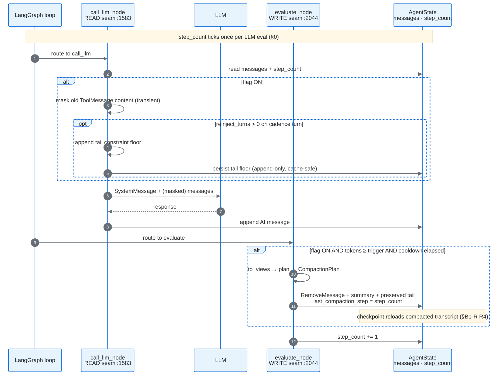

### 5.1 WRITE side — the fold + state rewrite (`evaluate_node`, at `:2044-2061`)

Gate on `context_compact_messages_enabled` AND token-count ≥ fraction trigger AND **cooldown elapsed** (`step_count - state.get("last_compaction_step", 0) >= cooldown_steps`):

1. `views = to_views(state["messages"])`.
2. `plan = ...` (mask → safe-cutoff → fold; cheap mask path may suffice and skip the fold).
3. `preserved = state["messages"][plan.cutoff:]` (slice the live BaseMessages — pairs intact by construction).
4. Emit the **state rewrite** (the §B1-R R4 fix the LangChain bug missed):
   ```python
   result["messages"] = [
       RemoveMessage(id=REMOVE_ALL_MESSAGES),    # langgraph.graph.message
       SystemMessage(content=plan.summary),       # buckets + PINNED floor (head/durable copy)
       *preserved,                                 # last-K verbatim, tool-pairs intact
   ]
   result["last_compaction_step"] = state.get("step_count", 0)   # stamp for cooldown (see §6)
   ```
   `add_messages` short-circuits on the sentinel → checkpointer reloads the **compacted** transcript, no resume re-bloat. The PINNED block is the *durability* copy (survives reload even on non-cadence turns). Keep the existing `reasoning_trace`/`files` offload writes for the dropped prose (file offload, not a carrier).
5. Set `truncation_applied=True`; stamp counts for the carrier (§7).

**Diagram — message list shape before and after a fold.** The PINNED block lives in the summary `SystemMessage` (durable); the tail stays verbatim with tool-pairs intact.

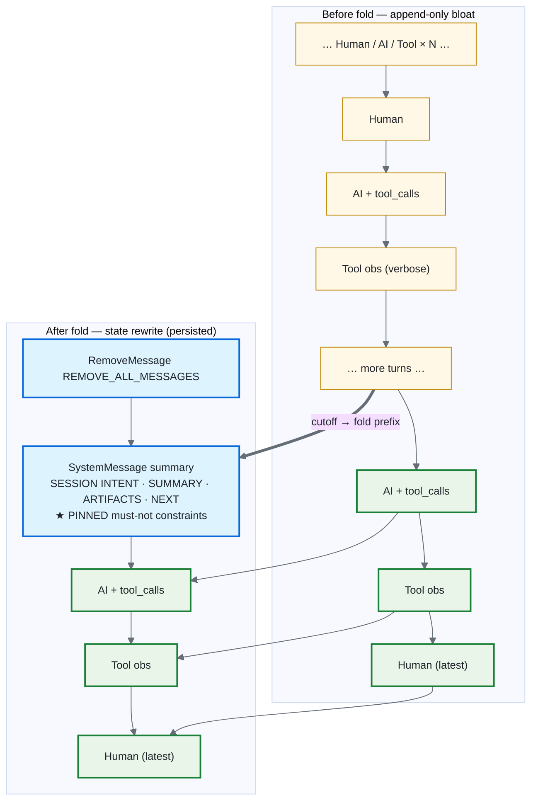

**Imports to add** (orchestration only): `from langgraph.graph.message import REMOVE_ALL_MESSAGES`, `from langchain_core.messages import RemoveMessage`.

### 5.2 READ side — observation masking + tail floor (`call_llm_node`, at `:1583`)

Gate on `context_compact_messages_enabled`:
- **Observation masking** (transient, per-call): mask the `content` of ToolMessages older than `M` steps before stacking. (The persisted fold in 5.1 is the durable counterpart; this read-side mask keeps cost down between folds.)
- **Tail floor** (**default OFF**, persisted append-only when on): when `context_constraint_reinject_turns > 0` and `step_count % N == 0`, append `SystemMessage(build_constraint_floor(pinned))` *after* `existing_messages` (recency slot) **and write it into the checkpointer's `messages`** (so it survives to the next turn). This is the cache-safe choice: a *transient* (recomputed-each-read, not persisted) tail would appear on cadence turn T and disappear on T+1, diverging the prefix at the tail position and **busting the KV-cache suffix every cadence turn** — exactly the §B1-R R6 cost-negation trap. A small persisted `SystemMessage` keeps the prefix append-only; the next write-side fold (§5.1) folds it away/refreshes it. **Wiring detail:** the persisted tail rides the existing `result["messages"]` append in `call_llm_node` (`react_loop.py:1733-1734`, the same return that appends the AI message), so it flows through `add_messages` like any other write — *but* a stale tail from a prior cadence turn must be removed (drop the previous tail-floor `SystemMessage` before re-appending, or skip re-append when the floor is unchanged) so the floor does not accumulate one copy per cadence turn. The fold's PINNED block is the durability layer (head); the persisted tail is the recency layer (tail). Re-injection still defaults off and is calibrated live (§0); the carrier's `floor_reinjected` flag (§7.2) makes each re-injection auditable.

**Diagram — B2 two-layer constraint defense.** Durability (head, cache-stable) vs recency (tail, opt-in). Observation masking is a third, orthogonal layer (cost, not constraint fidelity).

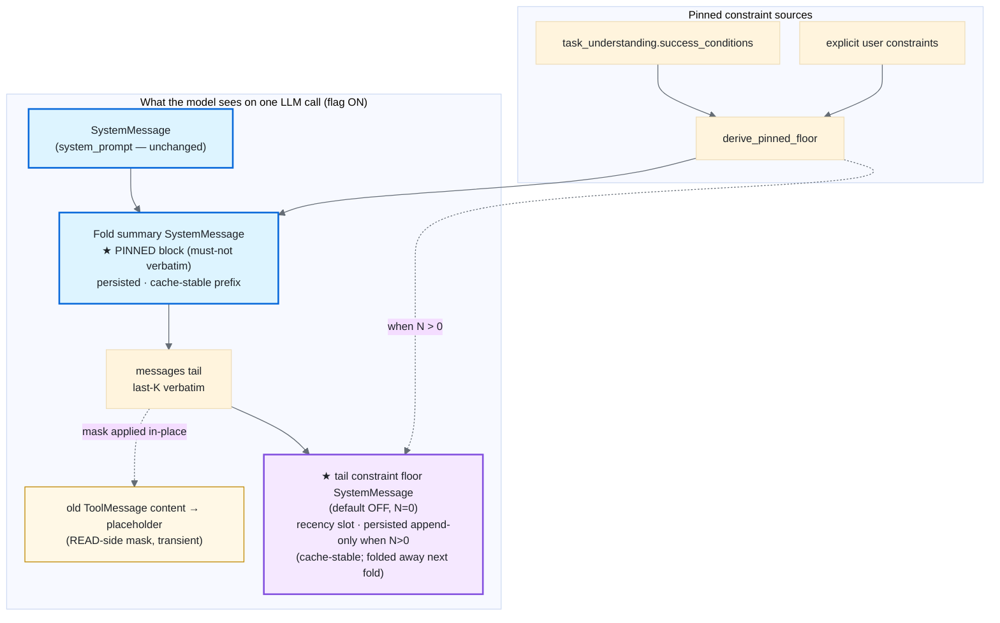

### 5.3 Fail-loud floor (§B2-R S4, CWL)

If last-K verbatim + the pinned floor still exceed budget, do **not** silently drop a constraint — set `plan.floor_exceeded=True`, surface it on the carrier (§7), and **decline to over-compact** (keep the floor, accept the overrun). User-authored constraints + success-conditions are the inviolable tier.

**Diagram — fail-loud vs silent drop.** C1 always prefers overrun over constraint loss; C2 L1 gates enforce this in CI.

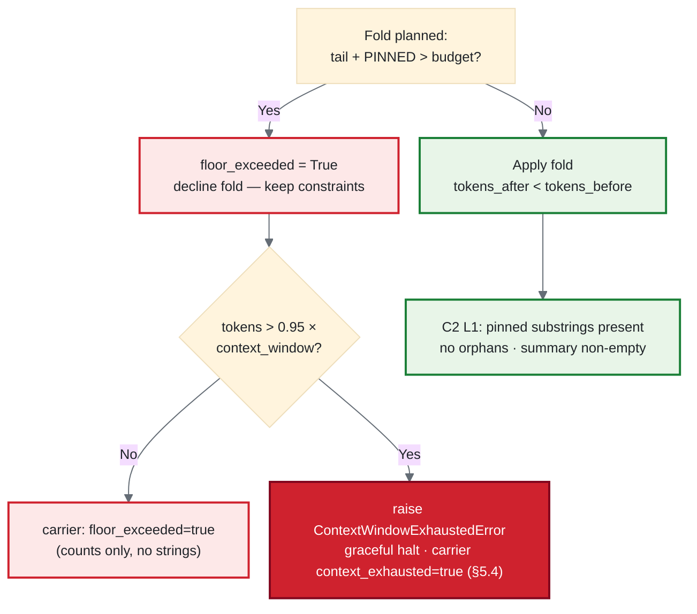

### 5.4 Terminal gate — hard-window exhaustion (the overrun has a ceiling)

§5.3 fail-loud accepts an overrun **to protect the floor** — but an overrun is not infinitely safe. If the thread keeps growing while folds are declined, the transcript eventually exceeds the model's **hard context window** (`profile.context_window`, =128000), and the *next* LLM call crashes at the API/transport layer — an **un-instrumented** failure, strictly worse than a declined fold (the governance triangle sees only silence). C1 caps the overrun:

- **Gate:** when `plan.floor_exceeded` **and** `current_token_count > 0.95 * profile.context_window`, do not return the no-compaction path — raise a typed **`ContextWindowExhaustedError`** to halt the run gracefully and surface a clear message to the user ("this conversation's inviolable constraints no longer fit the model's context") instead of letting the raw API 400/413 land.
- **`context_window` is in scope:** read the active `profile.context_window` via the existing `select_model(...)` / `agent_config.models` path already used inside the loop (`react_loop.py:934`, `:1397`) — no new plumbing.
- **Error classification = `terminal` (AGENTS.md §Dev Conventions).** The loop routes on a `last_error_type: str` state field ([`state.py:64`](../../orchestration/state.py)); the route node branches `if error_type == "retryable"` ([`react_loop.py:1997`](../../orchestration/react_loop.py)) with `alternatives=["retry","escalate","terminal"]` ([`:2024`](../../orchestration/react_loop.py)). `ContextWindowExhaustedError` is **`terminal`** (non-retryable — *not retrying* is the entire point; a retry re-sends the same over-budget transcript and crashes identically), so the gate sets `last_error_type="context_window_exhausted"` and the existing route node **escalates** instead of backing off. There is no shared typed-error base in the repo (errors are per-service `Exception` subclasses — `AuthorizationError`, `TraceServiceError`, …), so homing this one in `orchestration/` (where `profile` is in scope) is the consistent choice.
- **Still auditable, never silent:** stamp `context_exhausted=true` on the §7 carrier (a boolean, counts-only — still content-free) so the halt is a first-class Recording+Validation event, not a missing carrier. The 0.95 headroom leaves room for the system prompt + the final assistant turn the error message itself needs.
- **Order vs §5.3:** §5.3 (decline-to-protect) is the common case; §5.4 (terminal halt) fires only when declining still can't fit the floor under the hard ceiling — the last line of defense.
- **Interaction with the stale `current_token_count` (§6.1) — the bias is safe.** The terminal gate reads the same one-LLM-call-stale `current_token_count` that the trigger does (§6.1), so two staleness modes must be checked against this hard ceiling:

  | Staleness mode | What the gate sees | Outcome | Safe? |
  |---|---|---|---|
  | **stale-high** — count reflects a *pre-fold* turn, reads higher than the true post-fold size | `tokens > 0.95×window` may be true one turn before the transcript truly crosses it | terminal halt fires **one turn early** | **Yes** — a *slightly-early* graceful, instrumented halt; the 0.95 headroom already buffers it. Erring early is the correct direction. |
  | **stale-after-fold** — a fold just ran this turn, count not yet refreshed | inflated count *could* re-trip the gate | the **cooldown** (`step_count − last_compaction_step < cooldown_steps`, §6) holds the next fold, and the next LLM call refreshes the count *before* the gate is re-evaluated under a fired cooldown | **Yes** — the gate cannot trip on the stale value within the same turn |

  Net: the only reachable error is a *slightly-early* graceful halt; the gate can **never** *miss* the ceiling and let a raw API 413 land. That is exactly the bias C1 wants — fail toward an instrumented halt, never toward an un-instrumented crash.

---

## 6. State: one new field (`orchestration/state.py`)

Add exactly one: `last_compaction_step: int` — a **plain int** (NOT `Annotated`), so it is last-write-wins on checkpoint reload (the additive `step_count` cannot serve as a cooldown marker). Default/absent = 0 = "never folded" → first fold always allowed. Cooldown gate: `step_count - last_compaction_step >= cooldown_steps`. Re-injection cadence reuses `step_count` directly (`% N`), no field needed.

### 6.1 Multiturn semantics (verified against the live runtime)

`step_count`, `last_compaction_step`, and the (folded) `messages` are **checkpointer channels keyed by `thread_id`**, and the prod checkpointer is `PostgresCheckpointer` ([`app_prod.py:228`](../../middleware/app_prod.py)) — durable, so all three survive process restarts and arbitrarily long dormancy. The clock is therefore **thread-cumulative, not per-turn**: a fresh user message on an existing thread enters via `LangGraphRuntime.run` ([`langgraph_runtime.py:188-245`](../../agent_ui_adapter/adapters/runtime/langgraph_runtime.py)) on the **non-resume `else` branch** (fresh `trace_id`/`task_id`), and its `stream_input` dict carries **no `step_count`** → the additive reducer never fires → the prior cumulative value carries forward. The BFF sends only the *latest* message as `task_input` ([`run_stream_context.py:30-38`](../../middleware/run_stream_context.py)); the **full history comes from the checkpointer**, merged onto the saved `messages` channel via `add_messages`.

Consequences C1 depends on (no design change — these are invariants to honor in the tests):

- **The fold persists across turns and across dormancy.** Because §5.1 rewrites `messages` with `RemoveMessage`, the checkpointer holds the *compacted* transcript. A next turn — whether seconds or months later — loads the already-folded list and appends to it. This is the same R4 re-bloat guard as resume, but it fires on the **common** fresh-turn-same-thread path, not just paused-run resume. Without it, every returning turn would reload the un-folded transcript and re-bloat.
- **`step_count` units ≠ message count.** Windows (`keep_last_k`, `mask_after_steps`) are measured in `step_count`, which ticks once per `evaluate_node` ([`react_loop.py:2061`](../../orchestration/react_loop.py)) even though one step can append several messages (AI + tool_calls + tool obs). "Keep last K steps" is therefore *more* messages than K; the safe-cutoff walk-back (§4.2) operates on message indices and already absorbs this, but tests must assert on the message-pair boundary, not a raw step-to-message identity.
- **First turn after long dormancy may pay full cost once.** If a thread grew large but never crossed the trigger before going dormant (or was last touched pre-C1), its first resumed `call_llm_node` re-sends the full un-folded transcript (the READ seam only *masks*; the fold runs at turn end in `evaluate_node`). One expensive turn, then compaction kicks in. Acceptable, but stated so it is not mistaken for an instantaneous-on-resume fold.
- **Backward-compat for pre-C1 threads is the `.get(…, 0)` default.** A checkpoint written before this field existed has no `last_compaction_step` channel; `state.get("last_compaction_step", 0)` returns 0 = "never folded" → the first fold on that legacy thread is allowed immediately. No migration needed.
- **Scope is the conversation, not the session.** `step_count` resets to 0 only on a genuinely new `thread_id`; an old chat keeps its `thread_id` and its accumulated clock. Compaction is correctly thread-scoped — never user-scoped, never reset by a new login session.
- **`current_token_count` is intentionally one LLM-call stale (designed invariant, not a bug).** The trigger reads `state["current_token_count"]` ([`react_loop.py:2044`](../../orchestration/react_loop.py)), which holds **only the last LLM call's** `tokens_in + tokens_out` (written in `call_llm_node` at [`:1738`](../../orchestration/react_loop.py) — a per-call value, not a running total). After a fold rewrites `messages`, this value stays at the **pre-fold** count until the next LLM call writes a fresh one — so for the remainder of that single turn the state advertises an inflated token count. The **only** non-test consumers are the `:1738` write and the `:2044` read, so nothing else can mis-trigger on the stale value, and the **cooldown gate** (`step_count - last_compaction_step >= cooldown_steps`, §6) is exactly what prevents a second fold (or a compaction loop) inside that one-turn latency window: the fold that just ran stamped `last_compaction_step = step_count`, so the cooldown predicate is false until `cooldown_steps` more evaluations elapse — by which point at least one new LLM call has refreshed the count. No code change; the guard already exists. The **§5.4 terminal gate inherits this same staleness** — see the §5.4 failure-mode matrix for why the inherited staleness biases that gate *safe* (a slightly-early instrumented halt, never a missed ceiling).

**Diagram — step_count clock drives all cadence knobs (§0).** One monotonic counter; no new cadence state.

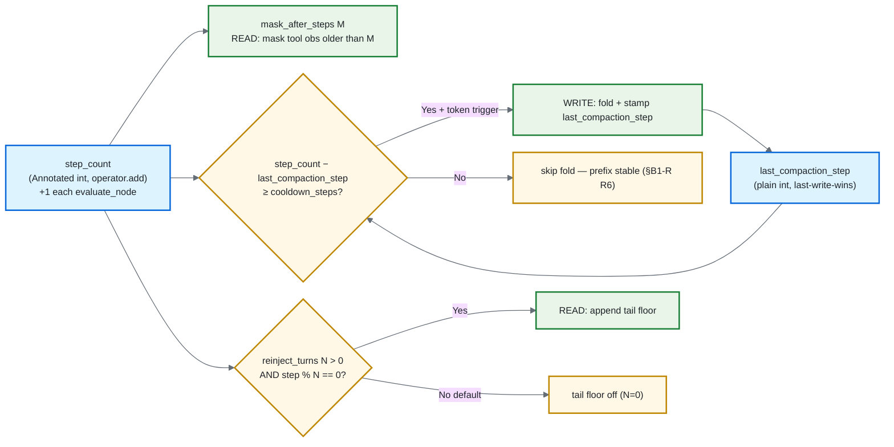

---

## 7. Governance-triangle integration (the audit must see every fold)

**The requirement.** The [`governance-trace-audit`](../skills/governance-trace-audit.skill) skill enforces one contract: a Langfuse trace must let a reader answer four questions *from the trace alone* — **Recording** (what happened) / **Identity** (who) / **Validation** (what was checked) / **Reasoning** (why) — and **every fact must have exactly one reliable carrier; a fact with zero carriers is the worst-class defect (CRITICAL → NON-COMPLIANT).** C1 silently rewrites the agent's `messages` channel via `RemoveMessage` (§5.1). Without a carrier, that fold is an **invisible mutation of the model's context** — precisely the silent-mutation class the triangle exists to catch. So compaction is not "telemetry nice-to-have"; it is a governance obligation: *the fold must announce itself, justify itself, and prove it kept the inviolable floor — all content-free.*

### 7.0 Decisions locked (three governance forks, resolved with the user)

- **Dual carrier (Recording + Reasoning), joined by `decision_id`.** The fold emits BOTH a black_box `CONTEXT_COMPACTED` event (Recording: *what* was dropped, counts-only) AND a `PhaseLogger` `Decision` (Reasoning: *why* — the trigger + the rejected `keep_full` alternative). This mirrors the `MODEL_SELECTED` dual-sink precedent (`react_loop.py:1450-1461`), not the single-carrier `MEMORY_CONSOLIDATED` shape — because a context rewrite is a *decision*, and the audit's headline check is whether decisions are justified, not just recorded.
- **Enrichment, NOT in `default_spec()`.** `CONTEXT_COMPACTED` is added to the `EventType` enum + the observation map, but **not** to `trust/governance_carrier_spec.py:default_spec()`. Compaction is conditional (most turns don't fold); a per-phase *required* rule would false-alarm on every no-compaction turn. The drift-guard (`tests/trust/test_governance_carrier_spec.py`, asserts `spec.pillars == {RECORDING,IDENTITY,VALIDATION,REASONING}` + every phase mapped) stays **green with no `spec_version` bump**. Same enrichment status as the four memory carriers.
- **Counts + content-free integrity hash.** The carrier verifies the pinned floor *survived* the fold without ever putting constraint text on the wire: it carries `constraint_floor_hash` (SHA-256 of the rendered floor block) alongside counts. The audit (and the C2 gate) can confirm the floor is intact by hash; the strings never leave the process. This is the §B2-R / privacy invariant applied to telemetry.
- **EventCategory = `execution`, sibling to `trajectory_compacted`.** FOUR_LAYER's EventCategory taxonomy ([FOUR_LAYER_ARCHITECTURE.md §Event Type Taxonomy](../Architectures/FOUR_LAYER_ARCHITECTURE.md), line 153) already lists `trajectory_compacted` under the **`execution`** category — that slot is the *reasoning_trace* compaction path (`services/summarizer.py`'s existing trajectory fold), **not** the `messages` path. `CONTEXT_COMPACTED` is its **sibling**: same `execution` category (classify-by-originating-layer convention → emitted from L4 orchestration), but it rewrites the `messages` channel, not `reasoning_trace`. Stating both keeps an auditor from conflating the two compaction events on one trace. **Reality note:** the `EventCategory` enum is *aspirational* — it is **not** yet shipped in `trust/enums.py`, and the live `EventType` enum lives in `services/governance/black_box.py` (not `trust/`), which is exactly where C1 places the new `CONTEXT_COMPACTED` member. The category label is descriptive (audit-readability), not a wiring change.

### 7.1 Verified governance anchors (re-checked this session)

| Anchor | Fact |
|---|---|
| `services/governance/black_box.py:40-86` | `EventType(str, Enum)` (13 members) + `TraceEvent` (`event_id`, `workflow_id`, `event_type`, `timestamp`, `step`, `details`, `integrity_hash`). `.value` strings are the observation names. **Add `CONTEXT_COMPACTED = "context_compacted"` here.** Note the enum lives in `services/governance/`, **not** `trust/` — so FOUR_LAYER's "EventType maps to one EventCategory in `trust/enums.py`" rule is aspirational; the new member is placed where the live enum actually is. |
| [`FOUR_LAYER_ARCHITECTURE.md` line 153](../Architectures/FOUR_LAYER_ARCHITECTURE.md) | EventCategory taxonomy already registers `trajectory_compacted` under **`execution`** (the *reasoning_trace* fold). `context_compacted` is its **sibling** in the same `execution` category for the *messages* path (§7.0). Descriptive label only — no `EventCategory` enum is shipped to honor. |
| `services/governance/black_box.py:116-130` | `BlackBoxRecorder.record(event)` computes `integrity_hash` (SHA-256 chained on prev hash) **at record time**; `timestamp` is caller-stamped `datetime.now(UTC)`. Satisfies the skill's relayed-observation integrity check (§3e) automatically. |
| `services/governance/black_box_publisher.py:86-112` | `_EVENT_TYPE_TO_OBSERVATION: dict[EventType, (obs_type, name)]`. **Add `EventType.CONTEXT_COMPACTED: ("span", "context.compacted")`** so the relay names the observation. Without this entry the event exports unnamed. |
| `trust/governance_carrier_spec.py:178-218` | `default_spec()` keys on **wire strings** (trust/ can't import services/). Pillars: RECORDING←`step_executed`, IDENTITY←`task_started`, VALIDATION←`guardrail_checked`/`error_occurred`, REASONING←`model_selected`/`step_planned`/`eval.goal_judge`. **Not touched** (enrichment decision). |
| `services/governance/memory_consolidation_carrier.py:36-66` | `emit_consolidation_carrier(black_box, *, workflow_id, user_id, mem_type, outcome)` → counts-only `details` (`kept`/`evicted`/`deduped`). **Clone shape** for `emit_compaction_carrier`. |
| `services/governance/phase_logger.py:45-67` | `PhaseLogger.log_decision(workflow_id, Decision(phase, description, alternatives, rationale, confidence, decision_id))` → `decisions.jsonl` (Reasoning pillar). Returns a `Decision` whose `decision_id` is the cross-pillar join key. |
| `react_loop.py:1450-1461` | `MODEL_SELECTED` dual-sink precedent: `phase_logger.log_decision(...)` THEN `black_box.record(TraceEvent(... details={... "decision_id": decision.decision_id}))`. **Exact pattern to mirror for the fold.** |
| `react_loop.py:620, 898, 1529, 1946` | `black_box` and `phase_logger` are **closure variables** in `build_graph()` — directly callable inside `evaluate_node` (no plumbing through state/config). `workflow_id = state.get("workflow_id","")` is populated by evaluate-time. |
| `middleware/sidecars/black_box_to_telemetry.py:258,322` | `_CURATED_SUPPRESSED = {"tool_called"}`; `LANGFUSE_RELAY_CURATED` default on. `CONTEXT_COMPACTED` is **not** suppressed → it always exports to the curated trace. |

### 7.2 The two carriers (emitted together at the fold, `react_loop.py` evaluate_node ~:2044)

Inside the WRITE-side fold block (§5.1), *after* the plan is built and *before* the `result["messages"]` rewrite is returned, emit the dual carrier — Reasoning first so its `decision_id` flows into the Recording event:

**(a) Reasoning — `PhaseLogger.Decision` (the *why*):**
```python
compaction_decision = phase_logger.log_decision(
    workflow_id,
    Decision(
        phase=WorkflowPhase.EVALUATION,
        description="message-history compaction (fold)",
        alternatives=["keep_full"],                      # the rejected option — audit wants this
        rationale=(                                      # counts/knobs only, NO dropped text
            f"tokens={tokens_before}>=trigger={trigger_tokens} "
            f"cooldown_ok step={step_count}-{last_compaction_step}>={cooldown_steps}"
        ),
        confidence=1.0,                                  # deterministic decision
    ),
)
```

**(b) Recording — `emit_compaction_carrier` (the *what*), new file `services/governance/context_compaction_carrier.py`** (clone `memory_consolidation_carrier.py`):
```python
def emit_compaction_carrier(
    black_box: BlackBoxRecorder,
    *,
    workflow_id: str,
    step: int,
    decision_id: str | None,          # ← join key to the Reasoning decision
    outcome: _CompactionOutcome,      # Protocol: counts + hash + flags, NEVER content
) -> None:
    black_box.record(TraceEvent(
        event_id=str(uuid.uuid4()),
        workflow_id=workflow_id,
        event_type=EventType.CONTEXT_COMPACTED,
        timestamp=datetime.now(UTC),
        step=step,
        details={
            "decision_id": decision_id,            # joins Recording↔Reasoning
            # cost (the "what happened")
            "tokens_before": outcome.tokens_before,
            "tokens_after": outcome.tokens_after,
            "turns_folded": outcome.turns_folded,
            "observations_cleared": outcome.observations_cleared,
            "keep_last_k": outcome.keep_last_k,
            # B2 floor integrity (content-free)
            "pinned_kept": outcome.pinned_kept,
            "must_not_count": outcome.must_not_count,
            "constraint_floor_hash": outcome.constraint_floor_hash,  # SHA-256 of floor block
            "floor_reinjected": outcome.floor_reinjected,
            "floor_exceeded": outcome.floor_exceeded,                # §5.3 fail-loud
            "context_exhausted": outcome.context_exhausted,          # §5.4 terminal halt (bool)
        },
    ))
```
`_CompactionOutcome` is a `Protocol` (like `_Outcome` in the consolidation carrier) exposing only the scalar/hash fields above — structurally impossible to pass dropped text or constraint strings through it.

**Diagram — the dual carrier and its join.** Recording answers *what*; Reasoning answers *why*; `decision_id` ties them. Both content-free.

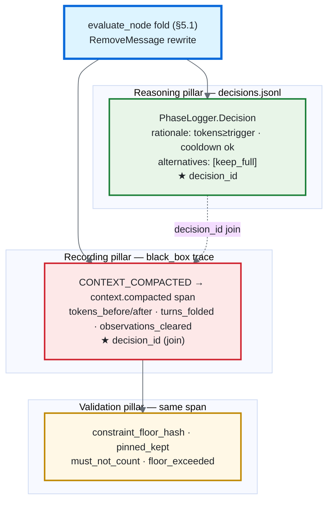

### 7.3 Pillar-by-pillar: how the audit reads a folded run

| Pillar | Audit question | What C1 provides | Verdict path |
|---|---|---|---|
| **Recording** | "What happened to the context?" | `context.compacted` span with `tokens_before/after`, `turns_folded`, `observations_cleared` — the fold is visible as a first-class event with `integrity_hash` (record-time). | PASS — fold has exactly one carrier. Zero-carrier ⇒ the CRITICAL defect this section prevents. |
| **Reasoning** | "Why was the context rewritten?" | `model.selected`-style decision in `decisions.jsonl`: trigger rationale + rejected `keep_full`, joined to the Recording event by `decision_id`. | PASS — the rewrite is a *justified* decision, not a silent mutation. |
| **Validation** | "Was the inviolable floor checked?" | `floor_exceeded` flag + `constraint_floor_hash` + `pinned_kept`/`must_not_count`, plus `context_exhausted` (§5.4 terminal halt). `floor_exceeded:true` is the §5.3 fail-loud signal (compaction declined); `context_exhausted:true` is the §5.4 graceful halt at the hard window. | PASS — the floor check and the terminal halt are both recorded; a dropped constraint would show as `floor_exceeded` or a hash mismatch, and an over-budget halt as `context_exhausted`, never as silence. |
| **Identity** | "Who did it?" | Unchanged — `task.started` already carries it; compaction adds nothing and breaks nothing. | Inherited PASS / resumed-run UNVERIFIABLE per existing rules. |

The Validation row is the subtle one: the triangle's archetypal failure is the *silent* drop (the private-keys grep that failed quietly). C1's analogue is silently dropping a `must-not` constraint during a fold. The `constraint_floor_hash` + `floor_exceeded` flag convert that into a **loud, auditable** fact — the floor's survival is provable from the trace without the floor's content ever being on the wire.

**What `constraint_floor_hash` does and does *not* let an auditor do (read this before assuming the trace is self-verifying).** The hash is **tamper-evidence**, *not* a value an auditor can independently recompute from trace observations alone:

- It is recorded **inside** the `CONTEXT_COMPACTED` event, whose `integrity_hash` is SHA-256-**chained** on the prior event at record time ([`black_box.py:116-130`](../../services/governance/black_box.py)). Altering the floor hash after the fact breaks the chain — that is the tamper signal.
- To *re-derive* the hash you need the constraint **strings**, and those are deliberately **not** in the content-free governance trace. `STEP_PLANNED` records `len(success_conditions)` — a **count**, with the explicit "join keys, not content" rule ([`react_loop.py:1352-1358`](../../orchestration/react_loop.py)); `TASK_STARTED` carries `task_input[:200]` + identity, not the conditions ([`react_loop.py:762-767`](../../orchestration/react_loop.py)). The strings live in the **plan payload** (`files` channel via `plan_ref`) and the **`eval.task_understanding`** observation — a privileged, content-bearing path (the §8.3 privacy boundary), reachable by an auditor with data access but **not** by a reader of the curated trace.
- So the integrity model is: *the trace proves the floor was checked and not tampered (hash + chain); a privileged auditor re-derives the hash in-process from the plan payload where the strings actually exist.* The content-free trace is intentionally **not** self-verifying for floor *content* — claiming otherwise would mean leaking constraint strings onto the wire, which §7.0 forbids.

**Checkpoint access is a higher-privilege view than the curated trace (the tail-floor caveat).** The §7 carrier is content-free, but the *opt-in* persisted tail floor is not. When `context_constraint_reinject_turns > 0` (§5.2), the tail-floor `SystemMessage` — which **does** carry constraint text — is written into the checkpointer's `messages` channel so it survives to the next turn. Consequence: a reader **with checkpoint access** (a thread-store query, a debug state dump, a DB inspector on `PostgresCheckpointer`) transiently sees the floor *text*, even though a reader of the curated Langfuse trace never does. This is the same "the trace is not the full story" asymmetry as above, applied to the *write* path: the **curated trace stays content-free; the checkpoint is a privileged, content-bearing store.** Two points keep this a *designed* boundary, not a leak: (1) it is **default-OFF** — at `N=0` (the ship default) the floor is **never** persisted to `messages`, so the checkpoint carries no constraint text at all; (2) checkpoint access is already a privileged tier (it holds the full conversation `messages`, including the user's verbatim turns), so the floor text is no more sensitive than what that reader can already see. Stated so the privacy contract reads precisely: *governance carrier → content-free; checkpoint → privileged store; the two are different wires (§8.3).*

### 7.4 What does NOT change (and why that keeps the audit green)

- **No `default_spec()` edit, no `spec_version` bump** → the drift-guard (`tests/services/governance/test_carrier_gate.py`, `tests/trust/test_governance_carrier_spec.py`) stays green untouched. Enrichment carriers are invisible to the per-phase carrier-gate by design.
- **No new suppression** → `CONTEXT_COMPACTED` isn't in `_CURATED_SUPPRESSED`, so it always reaches the curated trace; the audit's "no fact with zero carriers" rule is satisfied on every folded run.
- **Mechanics invariants inherited free**: `integrity_hash`/`event_time` stamped by `record()`; `service.name: agent-runtime`, lean metadata allowlist, honest-time relay — all handled by the existing relay path the carrier flows through. No new mechanics surface.
- **Carrier-gate enforce-mode is irrelevant here** — that gate governs *required* pillar carriers; an enrichment event neither trips nor is checked by it. (Contrast with the C1 *config* threading in §9, which also needs no derive-at-root.)
- **No new `logging.json` stream (H4 satisfied by the carrier, not a log file).** `services/summarizer.py` has no dedicated logger and C1 adds none. AGENTS.md H4's intent — *each concern is independently observable* — is met here by the governance **carrier** (the `context.compacted` span + `decisions.jsonl` decision), which is a richer, content-free, auditable channel than a rotating log file. The fold's observability lives in the trace, by design; the absence of a `compaction.log` is deliberate, not an oversight.

### 7.5 Governance verification (also in §11)

- **Carrier presence**: a folded run's black_box JSONL contains exactly one `context_compacted` event with non-empty `decision_id`, and `decisions.jsonl` contains the matching `keep_full`-alternative decision with the same `decision_id`. (Join test.)
- **Content-free proof**: assert the `details` dict and the `Decision.rationale` contain **no** substring of any dropped message or constraint — the `_CompactionOutcome` Protocol makes this structurally true, but a guard test pins it (mirrors the memory carriers' content-free tests).
- **Floor-integrity proof**: fold a transcript with a known `must-not` floor; assert `constraint_floor_hash` equals the SHA of the floor rendered **in-process** (where the strings exist — *not* recomputed from trace observations, which carry only counts, §7.3), that a deliberately corrupted floor flips the hash, and that tampering with the recorded event breaks the black-box `integrity_hash` chain. This pins the §7.3 integrity model: tamper-evidence in the trace, re-derivation only on the privileged plan-payload path.
- **Drift-guard untouched**: `test_governance_carrier_spec.py` + `test_carrier_gate.py` pass with no diff (proves the enrichment decision held).
- **End-to-end audit**: run the `governance-trace-audit` skill on a tagged folded trace → expect **COMPLIANT** with the fold visible across Recording+Reasoning+Validation, zero zero-carrier findings.

---

## 8. C2 — eval gate, per the `llm-eval-grounded-theory` pipeline

**The frame.** The [`llm-eval-grounded-theory`](../skills/llm-eval-grounded-theory/SKILL.md) skill governs how a fold is judged trustworthy. Its cardinal rules pin the C1 eval shape: *trace is ground truth, narration is suspect* (R10); *class-specific P/R on the action-triggering class, not global accuracy* (AP-3); *default-off until calibrated — shadow first* (cardinal-6, AP-7). The repo **already ships the entire machinery** for GoalJudge (`eval_capture.record`, `ValidationResult`, the calibration metrics, the gold-set dataset, `EnablePolicyCertificate` + composition-root guard, and `target=`→`eval.{target}` auto-mapping) — so C2 is **reuse along this pipeline, not greenfield**. The key structural fact: C1 has **two eval layers with different epistemics**, and the skill applies to each differently.

### 8.0 Decisions locked (three eval forks, resolved with the user)

- **L2 ships shadow-only, no gold set in v1.** The subjective summary-fidelity judge runs and reports; it does **not** gate. The full Stage 0–6 calibration ladder (open-code → taxonomy → gold set → IAA → calibrate → certificate) is **deferred** — the skill's trace-first rule (R3, AP-1) forbids open-coding folds that don't exist until C1 ships. C1 ships **L1 hard gates + L2 telemetry**.
- **L1 fail-safe: decline the fold.** An L1 failure on a live fold ⇒ fall back to no-compaction for that turn (keep the full transcript), record the failure on the carrier (§7). L1 gates are **deterministic structural invariants**, not judge verdicts — so they gate **from day one without a certificate** (the certificate machinery is only for the subjective L2 when it graduates).
- **Action-triggering class = "unsafe fold".** A fold that **dropped a pinned `must-not` constraint or a load-bearing decision**. All class-specific P/R centers here (AP-3). Red-team stratum = folds engineered to drop a constraint (the CoT-gaming analogue, R10 / bias-catalog).

**Diagram — the two eval layers and where the grounded-theory pipeline lands.** L1 gates now (deterministic); L2 reports now, gates only after the deferred calibration ladder clears.

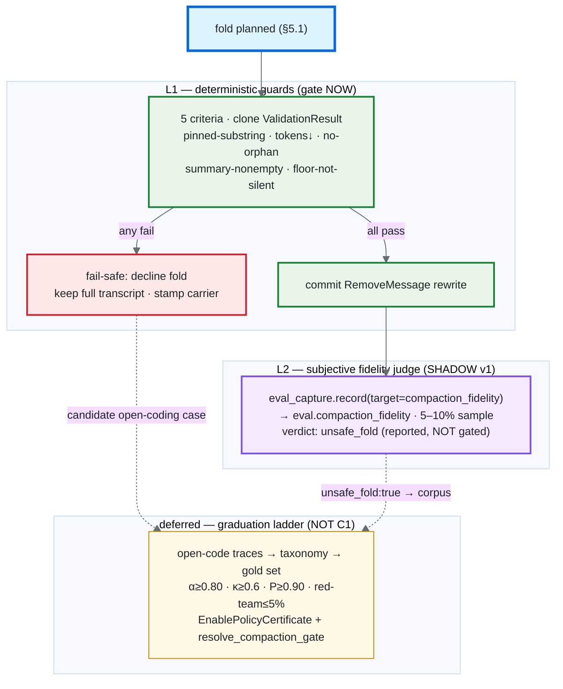

### 8.1 The two layers mapped to the skill's pipeline

| | **L1 — deterministic guards** | **L2 — subjective fidelity judge** |
|---|---|---|
| Epistemics | Structural invariant (substring, count, graph-shape) — provable | Subjective ("did the summary silently lose a decision?") — needs a judge |
| Skill home | Stage 7 "L1 sync checks, 100% traffic" + the L1 testing-pyramid tier (pure schema/guard validation) | Stages 1–6 (open-code → rubric → gold set → calibrate) + Stage 7 "L2 async judge, 5–10% sample" |
| Gates a fold? | **YES** — fail-safe decline (8.0) | **NO in v1** — shadow/telemetry only (AP-7) |
| Needs gold set / cert? | No (deterministic) | Yes — *when it graduates*; deferred |
| Carrier tie-in | The L1 verdict is the §7 `floor_exceeded` / safety signal | `eval.compaction_fidelity` Langfuse observation (reported) |

### 8.2 L1 — deterministic gates (clone `ValidationResult`, gate from day one)

Per-criterion results modeled on `services/governance/guardrail_validator.py:56` `ValidationResult` (`guardrail_name`/`passed`/`details`/`severity`/`matches`) — rename the discriminator to `criterion`. Each check is a pure function over the pre-fold views + the post-fold messages (no LLM, runs in CI + inline on every live fold):

| # | Criterion | Check | Skill anchor |
|---|---|---|---|
| L1-a | `pinned_substring_present` | every pinned constraint is a substring post-fold under **whitespace-normalized** comparison (collapse internal whitespace runs + strip, applied to *both* the rendered PINNED block and the constraint string), **per-constraint & polarity-aware**; `must-not` additionally in the tail floor when re-injection on. **Case-sensitive** (see note) | analytic per-criterion (R5); trace-is-ground-truth (R10) |
| L1-b | `summary_non_empty` | fold summary non-empty (Gemini-CLI `COMPRESSION_FAILED_EMPTY_SUMMARY`, §B1-R R5) | conservative binarization (Stage 4) |
| L1-c | `tokens_reduced` | `tokens_after < tokens_before` strictly | observable span (R10) |
| L1-d | `no_orphaned_tool` | **bidirectional** Interaction-Block check post-fold: neither (a) a ToolMessage without its issuing AI tool_call, **nor** (b) an AI tool_call whose answering ToolMessage was dropped (a split parallel block, §4 fn 2) | structural invariant |
| L1-e | `floor_not_exceeded_silently` | `floor_exceeded ⇒ fold declined` (§5.3 fail-loud), never a dropped constraint | the inviolable-floor gate (§B2-R S4) |

**Live wiring:** the L1 result is computed inside the §5.1 fold block *before* the `RemoveMessage` rewrite is committed. Any `passed=False` ⇒ **decline the fold** (return today's no-compaction path) and stamp the failing criterion on the §7 carrier. This is the skill's "deterministic guards gate at L1" applied to a write that mutates context.

> **L1-a normalization — whitespace yes, case NO (deliberate).** Constraints are copied **verbatim** (no markdown re-render, §4 fn 3), so exact-substring *should* hold — but trailing-newline / tab-vs-space drift between the rendered PINNED block and the floor string is a plausible **false-reject**, so L1-a normalizes whitespace on both sides. It does **not** case-fold. A case flip in a `must-not` (`DO NOT DELETE` → `do not delete`, or a case-sensitive path/identifier token) is exactly the silent corruption this gate exists to catch; folding case would weaken a safety invariant to buy cosmetic robustness. Do not "fix" this to case-insensitive later — it is intentional.

> **L1-d / `plan_fold_cutoff` golden-case table (the Interaction-Block surface is bigger than one bullet — make it a checklist).** The bidirectional no-orphan check (L1-d) and the safe-cutoff walk-back (§4 fn 2) have a real combinatorial surface; each case below is a **first-class golden test** asserting the post-fold suffix keeps every Interaction Block intact (no orphan on *either* side):
>
> | Case | Shape | Expected suffix-membership assertion |
> |---|---|---|
> | empty history | `[]` | no fold; plan is a no-op |
> | single turn | one Human (+ optional AI, no tools) | cutoff keeps the whole turn; nothing to fold |
> | all-pinned | every message carries a pinned constraint | fold declines or keeps all (no constraint dropped); §5.3 path |
> | no tool results | Human/AI prose only, no ToolMessages | cutoff is a plain message boundary; no block logic engaged |
> | cutoff-on-tool-pair | cutoff lands between an AI and its single ToolMessage | walk back to the AI; keep the pair together in the suffix |
> | **parallel-tool-calls straddling cutoff** | one AI view with ≥2 `tool_calls` whose answering ToolMessages span the cutoff | pull the **whole block** (AI + *all* its ToolMessages) into the suffix — no orphan on either side |
> | **multiple parallel blocks at the boundary** | two back-to-back AI views, each with parallel tool_calls, around the cutoff | each block resolved independently; cutoff lands only on a block boundary |
> | system-messages interleaved | `SystemMessage`s among the turns (e.g. a persisted tail floor) | system views preserved; they never count as block members |
>
> These extend §11's edge list; the parallel-straddle and multiple-parallel-block rows are the genuine footguns (a single dropped half-block is a frontier-API 400).

### 8.3 L2 — subjective fidelity judge (shadow-only telemetry in v1)

Capture seam: `await eval_capture.record(target="compaction_fidelity", ai_input=…, ai_response=…, config=…)` (`services/eval_capture.py:20`) → auto-maps to the `eval.compaction_fidelity` Langfuse observation via `observation_name_for_target` (`services/eval_telemetry.py:176`) and the `LangfuseEvalTelemetrySink` (add a `publish_compaction_fidelity` mirroring `publish_goal_judge`). **Reported, never gated** (AP-7).

> **Compliance — the L2 judge is an LLM call, so two AGENTS.md rules bind it.** (1) **H1 / AP-3 — no hardcoded prompts.** The fidelity rubric is authored as a Jinja2 template `prompts/compaction_fidelity_judge.j2` (mirroring the existing `prompts/goal_judge_system_prompt.j2`) and rendered via `PromptService.render_prompt()` — **never** an inline Python f-string. (2) **Mandatory eval-capture identity fields.** The `eval_capture.record(...)` call MUST carry `user_id` and `task_id` through `config.configurable` — `record()` reads them from `configurable` (`services/eval_capture.py:37-38`) and AGENTS.md §Always requires every LLM call to record with both. The §6.1 multiturn note already establishes `task_id`/`user_id` are in scope on the eval path; thread them here.

- `ai_input` (counts/structure + the dropped-prefix digest for the judge, content-bearing but **dev/telemetry only**, never on a governance carrier): `task_input`, `dropped_prefix_digest`, `pinned_constraints`, `summary`.
- `ai_response` (the judge verdict, analytic/binary per R5/R15): `decision_loss: bool`, `constraint_loss: bool`, `unsafe_fold: bool` (the trigger class), `evidence_span`, `token_reduction_ratio`.
- **Sampling (NEW infra, not an existing knob):** 5–10% of folds (Stage 7 L2), async, off the hot path. **No sampling exists today** — `eval_capture.record()` is a bare `logger.info` (`services/eval_capture.py:49`) and neither `eval_capture` nor `eval_telemetry` has a sample-rate. So C1 adds a **new caller-side gate** — e.g. `if random() < context_compaction_fidelity_sample_rate:` wrapping the `await eval_capture.record(...)` call — config-driven (a `context_compaction_fidelity_sample_rate` field, default low) and deliberately off the hot path. This is new code on the L2 capture seam, *not* reuse of an existing sampler; flag it in build step 8 so it isn't assumed free.

The judge prompt is a Stage-4 PROVISIONAL rubric: **analytic** (per-criterion: decision-loss vs constraint-loss, never one holistic score), **evidence-grounded** (cite the dropped span), **binary**. It is *not* calibrated in v1 — it produces telemetry that, once folds accumulate, seeds the Stage-1 open-coding corpus (§8.5).

> **Privacy boundary — note the asymmetry with §7.** The §7 governance carrier is **content-free** (counts + hash only). The L2 `ai_input` here *does* carry the dropped-prefix digest + constraint strings — because it feeds a judge, and the eval-capture sink is a **dev/telemetry** path, not a governance audit carrier. These are two different wires: the audit trail never sees content; the eval telemetry may. Keep them distinct so the §7 content-free invariant is never weakened to "help the judge."

### 8.4 Metrics & the deferred enable-policy (the graduation path)

When L2 graduates from shadow to gating (a **later slice**, not C1), it follows the skill's Stage 5–6 exactly, reusing the GoalJudge calibration code:

- **Class-specific P/R on `unsafe_fold`** (`services/governance/goaljudge_calibration.py` `confusion_counts`/`precision_recall_fd`) — never global accuracy (AP-3).
- **Judge–human κ** (`judge_gold_kappa`) ≥ 0.6 prerequisite before trusting P/R; **gold-set α ≥ 0.80** on the `unsafe_fold` label.
- **Red-team flip rate** (`flip_rate`) on constraint-drop-engineered folds ≤ 5% (R10).
- **ECE reported, never gated** (R18).
- **Enable-policy certificate** modeled on `EnablePolicyCertificate` (`services/governance/memory_enable_policy.py:77`) — `schema="compaction-fidelity-enable-cert-v1"`, `split="test"`, per-gate map — and a `resolve_compaction_gate(flag, cert)` guard at the composition root mirroring `resolve_write_back` (`composition.py:524`). **C1 documents this seam; it does not build the cert** (no gold set yet).

**Enable-policy table (the bar L2 must clear to ever gate — deferred):**

| Gate | Threshold | Source |
|---|---|---|
| Precision on `unsafe_fold` | ≥ 0.90 | reference.md precision-first profile |
| False-decline rate on safe folds | ≤ 2% | population-harm bound |
| Recall on `unsafe_fold` | ≥ 0.70 | catches enough real losses |
| Red-team flip rate | ≤ 5% | R10 gaming ceiling |
| Judge–human κ | ≥ 0.6 | labels trustworthy |
| Posture | **shadow/off until all met** | AP-7 |

### 8.5 Trace-to-corpus loop (Stage 7 → Stage 1, the only thing C1 actively feeds)

C1's job toward the eval pipeline is to **emit the raw material**: every L1-declined fold and every L2 `unsafe_fold:true` is a candidate open-coding case (Stage 7 "every production failure → candidate golden entry after human review"). The §7 carrier counts + the `eval.compaction_fidelity` observations are the trace substrate the future Stage-1 open-coding reads. **No gold set, no axial taxonomy, no calibration in C1** — those wait until real folded traces exist, exactly as the skill's trace-first ordering demands.

> **The first N real folded traces are a *prerequisite*, not a nice-to-have.** The graduation ladder (§8.4) is gated on data that does not exist until C1 ships and folds run: the skill's trace-first rule (R3, AP-1) **forbids** open-coding folds that haven't happened. So the Stage-1 open-coding corpus cannot even begin until a meaningful population of real folds (`unsafe_fold` candidates + L1-declines) has accumulated in the trace substrate. Two new build pieces make those traces *exist* — both named elsewhere but listed together here so the soft spot isn't underweighted: (1) the **`publish_compaction_fidelity`** sink method (§8.3 — mirrors `publish_goal_judge`; the `eval.compaction_fidelity` *name* auto-maps via `observation_name_for_target`, but the Langfuse *observation* needs this method), and (2) the **new caller-side sampling gate** (§8.3 / Fix D — sampling is not an existing knob). Until both ship and folds run at sample rate, L2 is genuinely shadow with nothing yet to calibrate against. Treat "accumulate N real folded traces" as the explicit precondition on the §8.4 ladder, not an implicit assumption.

### 8.6 Testing pyramid (the skill's L1–L4, applied)

- **L1 (pure):** schema/guard validation of the five L1 criteria + the `unsafe_fold` verdict type — golden unit tests, no I/O (extends §11's summarizer tests).
- **L2 (record/replay):** `eval_capture.record(target="compaction_fidelity")` round-trip → `eval.compaction_fidelity` observation contract (mock sink, mirror `tests/middleware/adapters/observability/test_langfuse_eval_telemetry_sink.py`).
- **L3 (mocked judge):** fixed-fixture folds (constraint-dropped, decision-dropped, clean) through a mocked fidelity judge; assert verdict shape + the `unsafe_fold` flag. Red-team fixtures marked slow.
- **L4 (gate matrix):** the deferred `resolve_compaction_gate` decision matrix (flag × cert → posture), rejection-tests-before-acceptance — built only when L2 graduates. **No live LLM calls in default CI** (skill rule).

---

## 9. Config + flags (`base_config.py` + `composition.py`)

`AgentConfig` fields (all defaults **no-op when off** ⇒ prod byte-identical):

| field | type | default | env alias | thread |
|---|---|---|---|---|
| `context_compact_messages_enabled` | bool | `False` | `CONTEXT_COMPACT_MESSAGES` | add to `from_mapping` bool-list, direct copy |
| `context_compact_trigger_fraction` | float | `0.6` | `CONTEXT_COMPACT_TRIGGER_FRACTION` | coercion arm, direct copy |
| `context_observation_clear_fraction` | float | `0.3` | `CONTEXT_OBSERVATION_CLEAR_FRACTION` | coercion arm, direct copy |
| `context_keep_last_k` | int | `10` | `CONTEXT_KEEP_LAST_K` | coercion arm, direct copy |
| `context_mask_after_steps` | int | `10` | `CONTEXT_MASK_AFTER_STEPS` | coercion arm, direct copy |
| `context_compact_cooldown_steps` | int | `5` | `CONTEXT_COMPACT_COOLDOWN_STEPS` | coercion arm, direct copy |
| `context_constraint_reinject_turns` | int | `0` | `CONTEXT_CONSTRAINT_REINJECT_TURNS` | coercion arm, direct copy (**0 = tail off**) |

Plus a pure helper `compaction_trigger_tokens(context_window, fraction)`. All **direct copies** at `composition.py:629` (no derive-at-root needed — the `carrier_gate_enforce_mode` derivation precedent doesn't apply). **Mechanical-surface note (not zero-work):** "direct copy" is true but each of the 7 fields is still a **three-site** change — (1) declare on `AgentRuntimeSettings` with a `validation_alias=ENV` (`composition.py`), (2) add to the `from_mapping` bool-list (`:520`, via `_env_flag_from_mapping` `:368`) for the one bool or the int/float coercion arm (`:521-522`) for the six numerics, and (3) copy into `AgentConfig(...)` at `:629`. Seven fields × three sites + the helper = real mechanical surface; it is *simpler* than `carrier_gate_enforce_mode` (which derives a tri-state from two env flags) but not free. Budget it as such in build step 4. Calibration note: `context_compact_trigger_fraction` and `context_constraint_reinject_turns` should be set at/below the model's empirical **Safe Turn Depth** (§B2-R S1/S6: ~7 Qwen-class, ~10 Mistral-class) — an eval task, not a guess. Keep `trajectory_compaction_token_threshold` for the unchanged trajectory path.

**Byte-identical-when-off proof:** with the master flag `False`, both seams early-return before any mask/fold/tail logic; `result["messages"]` is never set (today's behavior), `last_compaction_step` never written.

---

## 10. Build order (smallest reversible steps; pure-first, inert until the last wire)

1. `services/summarizer.py` pure fns + `CompactionPlan`/`PinnedConstraint` + golden unit tests (mask → safe-cutoff → fold → pinned → constraint-floor). **No caller — inert.**
2. `orchestration/message_view.py` (new): `MessageView`, `to_views`, `rebuild`, `mask_observation` + unit tests against the two ToolMessage shapes (`:349,477`). **No caller — inert.**
3. `state.py`: add `last_compaction_step: int` (plain). Reducer-canary test it survives reload last-write-wins.
4. `base_config.py` + `composition.py`: the 7 fields + helper, all default-OFF/no-op. Test empty-env ⇒ `AgentConfig` unchanged.
5. WRITE-side wire (`evaluate_node:2044`) behind the flag: plan → **Interaction-Block-safe** cutoff (§4 fn 2) → `RemoveMessage` rewrite + `last_compaction_step` stamp + cooldown gate + the §5.4 terminal gate (`ContextWindowExhaustedError` when `floor_exceeded` and tokens > 0.95×`profile.context_window`). **Write the §11 state-rewrite round-trip test FIRST** — the `RemoveMessage(REMOVE_ALL_MESSAGES)` rewrite is unexercised in-repo today, so its checkpoint-round-trip + version-guard test establishes the behavior before any wiring depends on it.
6. READ-side wire (`call_llm_node:1583`) behind the flag: observation mask + (default-off) tail floor.
7. Governance-triangle dual carrier (§7): `EventType.CONTEXT_COMPACTED` + observation-map entry + `context_compaction_carrier.py` (Recording, counts+`constraint_floor_hash`+`floor_exceeded`+`context_exhausted`) + the `PhaseLogger.Decision` (Reasoning, `keep_full` alternative) wired in the §5.1 fold, joined by `decision_id`. Content-free guard test + floor-hash-tamper test + `context_exhausted` terminal-halt carrier test + drift-guard-untouched assertion. **Enrichment — no `default_spec()` edit.**
8. C2 eval (§8, per `llm-eval-grounded-theory`): **L1** five deterministic gates (clone `ValidationResult`, fail-safe decline wired into the §5.1 fold) + **L2** shadow fidelity judge — author `prompts/compaction_fidelity_judge.j2` (H1, rendered via `PromptService`, §8.3) and `eval_capture.record(target="compaction_fidelity", …)` (carrying `user_id`/`task_id` via `config.configurable`) → `eval.compaction_fidelity`, reported never gated. **New L2 infra (not reuse):** a `publish_compaction_fidelity` sink method (mirror `publish_goal_judge`) **and** a new caller-side sampling gate (`random() < context_compaction_fidelity_sample_rate`, §8.3 / Fix D — no sampler exists today). Testing pyramid L1–L3; L4 gate-matrix + calibration certificate **deferred** to L2 graduation. Trace-to-corpus loop emits the future open-coding substrate.
9. (Separate, on request) tagged `--no-traffic` live validation.

Steps 1–4 independently mergeable and provably inert; behavior changes only at 5–6, both flag-gated.

**Diagram — build order dependency graph.** Steps 1–4 merge independently; 5–6 are the first behavior-changing wires (both flag-gated).

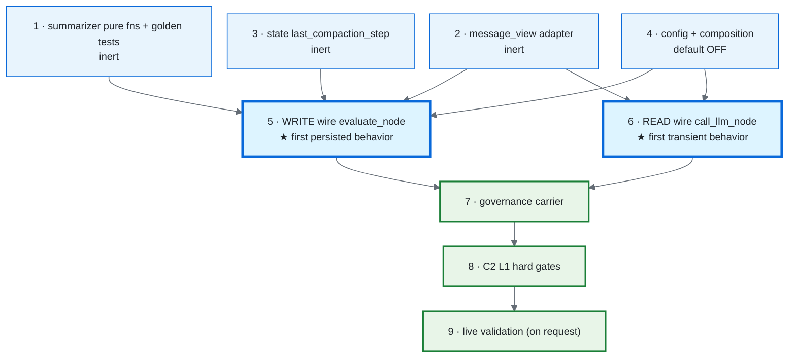

---

## 11. Verification

> **`test_summarizer.py` and `test_message_view.py` do not exist yet — they are NEW files created in build steps 1–2.** Neither path is present in the repo today (there is no summarizer test at all). The commands below describe the **target** suite once those steps land, not a suite you can run before C1 is built. `test_dependency_rules.py` and `test_react_loop.py` already exist.

```bash
OTEL_SDK_DISABLED=true LANGFUSE_PUBLIC_KEY="" LANGFUSE_SECRET_KEY="" \
  .venv/bin/python -m pytest tests/services/test_summarizer.py -q          # NEW (step 1): mask/cutoff/fold/pinned/floor
.venv/bin/python -m pytest tests/orchestration/test_message_view.py -q     # NEW (step 2): adapter round-trip
.venv/bin/python -m pytest tests/architecture/test_dependency_rules.py -q  # existing: I-4/I-5/I-7 hold for new services/ + thin orchestration
.venv/bin/python -m pytest tests/orchestration/test_react_loop.py -q       # existing: flag OFF ⇒ byte-identical
```
- **Determinism:** mask/cutoff/fold run 10× identical; edges: empty history, single-turn, all-pinned, no-tool-results, cutoff-on-tool-pair, **`parallel-tool-calls-straddling-cutoff`** (one AI view with ≥2 tool_calls whose answers span the cutoff → assert the whole block is pulled into the suffix, no orphan on either side).
- **State-rewrite proof — the load-bearing test, written FIRST in build step 5** (model on `tests/orchestration/test_state_reducers.py` canary). The `RemoveMessage(REMOVE_ALL_MESSAGES)` rewrite is the single mechanism the whole §5.1 fix rests on, and it is **exercised nowhere in the repo today** — so this test *establishes* the behavior rather than re-confirming it. It must **execute** the round-trip (not assume the §2 anchor): pass `[RemoveMessage(id=REMOVE_ALL_MESSAGES), SystemMessage(summary), *preserved]` through `add_messages` / a checkpoint round-trip and assert (a) the post-sentinel list is taken **verbatim** (the old prefix is gone, length drops), (b) the rematerialized messages get **fresh auto-assigned ids**, (c) a checkpoint round-trip reloads the *compacted* list (directly guards the §B1-R R4 re-bloat bug), and (d) a **langgraph-version guard** (assert the installed version is the one this semantics was verified against — `0.6.11`) so a future dependency bump re-runs and re-validates this path instead of silently inheriting a changed reducer.
- **Multiturn / dormant-resume proof** (§6.1): fold on turn 1 → checkpoint round-trip → start a *fresh* turn (no `step_count` in the input delta) and assert (a) `step_count`/`last_compaction_step` carried forward (cooldown continuous), (b) the reloaded `messages` is the **compacted** list, not the original, and the new turn appends to it (no re-bloat across the boundary), (c) a pre-C1 checkpoint with no `last_compaction_step` channel resolves to 0 and permits the first fold. Use the in-memory saver in the test; the prod path is `PostgresCheckpointer` but the channel semantics are identical.
- **Terminal gate (§5.4):** a transcript whose floor exceeds `0.95 × context_window` raises `ContextWindowExhaustedError` (no raw API call attempted), sets `last_error_type="context_window_exhausted"` so the route node escalates (not retry — assert the error is *not* classified `retryable`), and the carrier carries `context_exhausted=true`; a transcript at `floor_exceeded` but *under* 0.95×window declines the fold (no raise). Use a small synthetic `context_window` in the test so the boundary is cheap to hit.
- **Governance (§7.5):** a folded run emits exactly one `context_compacted` event joined by `decision_id` to a matching `keep_full`-alternative decision in `decisions.jsonl`; `details`/`rationale` carry no dropped-text/constraint substring (Protocol-enforced + guard test); `constraint_floor_hash` matches the independently-rendered floor and flips on tamper; drift-guard green (no `default_spec()` change); end-to-end `governance-trace-audit` on a tagged trace → COMPLIANT, zero zero-carrier findings.
- **Live (on-demand, separate):** tagged `--no-traffic` rev, `CONTEXT_COMPACT_MESSAGES=true`, long multi-turn corpus (extend the multi-session harness); assert tokens-per-run drops, prompt-cache hit-rate doesn't collapse (§B1-R R6), zero pinned-constraint loss.

---

## 12. Out of scope for C1 (seams left, deferred)

- **B1-llm** cheap/distilled summarizer — `build_message_compaction` takes a pluggable summarizer arg so it's a swap, not a rewrite (§B1-R R8).
- **B3 tiered assembly / B4 decay / B5 in-loop retrieval** — unchanged from the companion plan §4.
- The BFF thread store stays untouched — see **§12.1** (promoted to its own subsection because it is the most likely user-visible divergence).
- Promoting any flag to live-traffic prod; committing.

### 12.1 BFF thread store stays full-fidelity (the most likely user-visible divergence)

C1 compacts only the **checkpointer's** `messages` channel — the model's working context. The **BFF thread store** ([`app_prod.py:391`](../../middleware/app_prod.py), the durable transcript-of-record the user reads in the sidebar) is a *separate* persistence layer and is **not** rewritten. This is deliberate: the user's visible history stays full-fidelity while the model's context compacts.

**Why this gets its own subsection (not a deferred-list footnote):** it is the single most probable source of *user-facing* surprise from C1 — "the model doesn't remember what I just said." Once a fold drops a turn from the model's context, the model genuinely no longer sees it, **while the user still reads it verbatim in the sidebar**. The two transcripts diverge by design, and the only signal the user has is the model's behavior. So this is not a telemetry edge case; it is the failure mode most likely to generate a support report, and it should be planned for, not discovered.

**Mitigation (a B-series follow-on, not C1):** surface the compaction in the UI — a "this conversation was compacted for the model" marker on the affected turns, or an explicit affordance to let the two transcripts diverge knowingly. Flagged here so the divergence between what the model sees and what the user reads is a *known, designed* gap with a named mitigation path, never a silent one.

---

## 13. Compliance posture (AGENTS.md + FOUR_LAYER, validated against live code)

This design was validated against the two governing compliance docs — [`AGENTS.md`](../../AGENTS.md) (boundaries, anti-patterns, testing, dev conventions) and [`FOUR_LAYER_ARCHITECTURE.md`](../Architectures/FOUR_LAYER_ARCHITECTURE.md) (trust-foundation layering, EventCategory taxonomy, grid placement). Every claim below was checked against the live code, not the doc's own anchors. C1 was already clean on the load-bearing invariants; the table records both what holds and the spec additions made so a builder following this doc cannot drift out of compliance.

**Already compliant — load-bearing invariants (no change needed):**

| Rule (source) | How C1 honors it |
|---|---|
| Rule 1/6 dependency flow + I-7 thin orchestration (AGENTS.md) | Pure logic in `services/summarizer.py`; orchestration only materializes the plan + emits `RemoveMessage` (§3, §3.3). |
| Rule 4 / I-4 — `services/` no `langchain` (AGENTS.md; `test_dependency_rules.py:104`) | Pure fns operate on stdlib `MessageView`; the **only** langchain touchpoint is `orchestration/message_view.py` (orchestration legitimately imports langchain — precedent `react_loop.py`/`state.py`/`checkpointer_wrapper.py`). |
| Rule 7 / I-5 — `services/` no `components` (AGENTS.md) | C1 adds nothing under `services/` that reaches into `components/`. |
| Content-free governance carrier (governance-trace-audit contract, §7) | `_CompactionOutcome` Protocol exposes only scalars/hash/flags; `constraint_floor_hash` proves floor survival without strings on the wire (§7.0, §7.3). |
| Default-OFF byte-identical (prod safety) | Master flag `False` ⇒ both seams early-return; `messages`/`last_compaction_step` never written (§9). |
| TAP-4 / failure-paths-first (AGENTS.md Testing) | §8.0 L1 fail-safe decline + §11 rejection tests (orphan-straddle, terminal-gate, floor-tamper) precede acceptance tests. |

**Spec additions made this validation (doc-only; the rule applied but the doc was silent):**

| # | Rule | Section edited |
|---|---|---|
| C-1 | EventCategory taxonomy — `context_compacted` ∈ `execution`, sibling to `trajectory_compacted` | §7.0, §7.1 |
| C-2 | Error classification — `ContextWindowExhaustedError` is `terminal`, sets `last_error_type` | §5.4, §3 |
| C-3 | H1 / AP-3 — L2 judge rubric is `prompts/compaction_fidelity_judge.j2` via `PromptService` | §8.3, §10 |
| C-4 | Mandatory eval-capture `user_id`/`task_id` on the L2 record call | §8.3 |
| C-5 | Directory-naming note — doc uses real package names; FOUR_LAYER paths aspirational | §3 |
| C-6 | H4 — audit channel is the carrier, not a `logging.json` stream (deliberate) | §7.4 |

**Third review pass (findings A–H + governance §4 soft spot) — all VALID, all doc-only (no design change):** A `add_messages`/`REMOVE_ALL_MESSAGES` premise true / behavior verified safe on langgraph 0.6.11 → §2 anchor + load-bearing §11 round-trip test (§10 step 5); B config-threading three-site surface trued up → §9; C terminal-gate × token-staleness failure-mode matrix → §5.4/§6.1; D L2 sampling is **new** caller-side infra not a knob → §8.3 (§10 step 8); E `test_summarizer.py`/`test_message_view.py` are **new** files → §11/§10; F L1-d Interaction-Block golden-case table → §8.2; G checkpoint-access ≠ curated-trace-access asymmetry (opt-in tail floor) → §7.3; H BFF thread-store divergence promoted to its own subsection → §12.1; §4 soft spot — first N real folds are a **prerequisite** for the gold-set path → §8.5. No locked decision changed; C1 stays design-ready / default-OFF / not-built.
