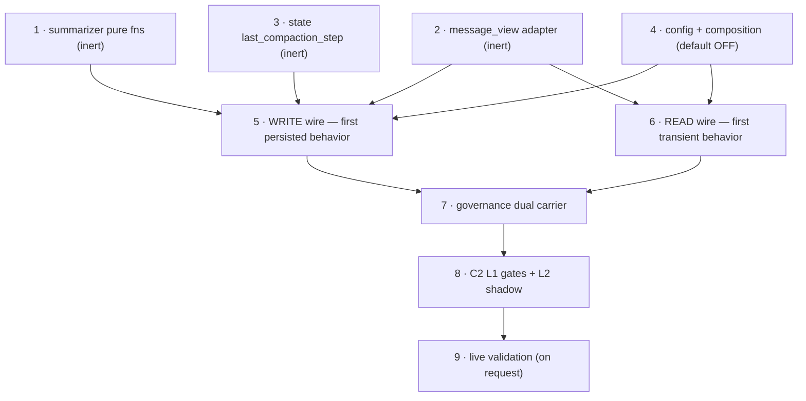

# C1 — Message-History Compaction + B2 Pinned-Facts Floor: Implementation Plan

> **Status.** Implementation companion to [`c1_message_compaction.design.md`](c1_message_compaction.design.md)
> (*why & how*) and [`context_compression_runtime_pipeline.plan.md`](context_compression_runtime_pipeline.plan.md)
> (*design-space map + research scans*). This doc answers **"what file, what function, what line, what test"** —
> it is the doc an engineer (or coding agent) builds from directly. **It changes no source itself**; it specifies
> the changes. Default-OFF, prod byte-identical when off. **Not built.**
>
> **Date:** 2026-06-21. **Reads with:** the design doc — every phase below cites a design § rather than
> re-deriving rationale, diagrams, or the research basis.
>
> **Locked decisions (carried from the design, not re-opened):** turn-unit = `step_count` (design §0);
> tail re-injection default-OFF, persisted append-only when on (§0); dual carrier joined by `decision_id`
> (§7.0); `CONTEXT_COMPACTED` is **enrichment**, NOT in `default_spec()` (§7.0); L2 fidelity judge ships
> **shadow-only**, never gates in v1 (§8.0); L1 deterministic gates gate **from day one**, fail-safe decline (§8.0).
>
> **Line references are a snapshot of today's tree** (verified at authoring time). They are navigation aids;
> the **contract is the function name + behaviour**, not the line number.

---

## Table of contents

- [1. Source ground-truth map (verified)](#1-source-ground-truth-map-verified)
- [2. New & touched files at a glance](#2-new--touched-files-at-a-glance)
- [3. Phase 1 — summarizer pure functions (inert)](#3-phase-1--summarizer-pure-functions-inert)
- [4. Phase 2 — MessageView adapter (inert)](#4-phase-2--messageview-adapter-inert)
- [5. Phase 3 — state field (inert)](#5-phase-3--state-field-inert)
- [6. Phase 4 — config + flags (default-OFF)](#6-phase-4--config--flags-default-off)
- [7. Phase 5 — WRITE wire (first persisted behavior)](#7-phase-5--write-wire-first-persisted-behavior)
- [8. Phase 6 — READ wire (first transient behavior)](#8-phase-6--read-wire-first-transient-behavior)
- [9. Phase 7 — governance dual carrier](#9-phase-7--governance-dual-carrier)
- [10. Phase 8 — C2 eval gates (L1 now, L2 shadow)](#10-phase-8--c2-eval-gates-l1-now-l2-shadow)
- [11. Phase 9 — live validation (on request)](#11-phase-9--live-validation-on-request)
- [12. Cross-phase gates (run every phase)](#12-cross-phase-gates-run-every-phase)
- [13. Build order & dependency graph](#13-build-order--dependency-graph)

---

## 1. Source ground-truth map (verified)

Every anchor the phases below read or edit, confirmed against the current tree at authoring time. Consolidated
from design §2 / §7.1 / §8.2 so a builder has one table instead of three scattered ones.

| What | File:line (verified) | Shape today | Phase |
|---|---|---|---|
| READ seam | [`react_loop.py:1580-1588`](../../orchestration/react_loop.py) | `call_llm_node` stacks `[SystemMessage(system_prompt)] + list(existing_messages)`. **No trimming today.** | 6 |
| WRITE seam | [`react_loop.py:2044-2061`](../../orchestration/react_loop.py) | `evaluate_node` compaction trigger; sets `files`/`reasoning_trace`/`truncation_applied`. **Never sets `messages` today.** `:2061` = `step_count += 1` (cooldown stamp goes here). | 5 |
| ToolMessage shapes | [`react_loop.py:349,477`](../../orchestration/react_loop.py) | `ToolMessage(content=…, tool_call_id=…)` — masking target. | 2 |
| `messages` reducer | [`state.py:50`](../../orchestration/state.py) | inherited `MessagesState` → `add_messages`. **Verified langgraph 0.6.11** (`message.py:207-211`): `REMOVE_ALL_MESSAGES` short-circuits `return right[remove_all_idx+1:]`; **only** `add_messages` channel (others independent reducers); **exercised nowhere in-repo** → Phase-5 round-trip test is load-bearing (design §2, Fix A). | 5 |
| turn clock | [`state.py:58`](../../orchestration/state.py) | `step_count: Annotated[int, operator.add]`. | 3,5,6 |
| token + truncation state | [`state.py:69-70`](../../orchestration/state.py) | `current_token_count: int`, `truncation_applied: bool`. **No `last_compaction_step` field exists** (Phase 3 adds it). Write `:1738` / read `:2044` are the only `current_token_count` consumers (design §6.1). | 3,5 |
| error routing | [`state.py:64`](../../orchestration/state.py), [`react_loop.py:1997`](../../orchestration/react_loop.py), [`:2024`](../../orchestration/react_loop.py) | `last_error_type: str`; route branches `if error_type=="retryable"`; `alternatives=["retry","escalate","terminal"]`. Terminal gate sets `last_error_type="context_window_exhausted"` (design §5.4, Fix C). | 5 |
| pure compaction module | [`services/summarizer.py`](../../services/summarizer.py) | pydantic only, no langchain; `should_compact_trajectory`/`build_compaction_summary`. **Extend additively.** | 1 |
| model profile | [`base_config.py:20,39`](../../services/base_config.py) | `ModelProfile.context_window: int`; `AgentConfig.trajectory_compaction_token_threshold: int`. | 4,5 |
| config threading | [`composition.py:368,520,629`](../../middleware/composition.py) | `_env_flag_from_mapping` (`:368`), bool-list (`:520`), int/float coercion arm (`:521-522`), `AgentConfig(...)` copy (`:629`). **Three sites per field** (design §9, Fix B). | 4 |
| pinned source | [`components/schemas.py:220`](../../components/schemas.py) | `TaskUnderstanding.success_conditions: list[str]`; read at `evaluate_node:2091-2098`. | 1,5 |
| carrier clone target | [`memory_consolidation_carrier.py:36-66`](../../services/governance/memory_consolidation_carrier.py) | `emit_consolidation_carrier(... counts-only)` — content-free clone shape. | 7 |
| EventType enum | [`black_box.py:40-86`](../../services/governance/black_box.py) | `EventType(str,Enum)` + `TraceEvent`; `record()` chains `integrity_hash`. **Add `CONTEXT_COMPACTED="context_compacted"`.** | 7 |
| observation map | [`black_box_publisher.py:86-112`](../../services/governance/black_box_publisher.py) | `_EVENT_TYPE_TO_OBSERVATION`. **Add `CONTEXT_COMPACTED: ("span","context.compacted")`.** | 7 |
| spec drift-guard | [`trust/governance_carrier_spec.py:178-218`](../../trust/governance_carrier_spec.py) | `default_spec()` keys on wire strings. **NOT touched** (enrichment, design §7.0/§7.4). | 7 |
| dual-sink precedent | [`react_loop.py:1450-1461`](../../orchestration/react_loop.py) | `MODEL_SELECTED`: `phase_logger.log_decision(...)` THEN `black_box.record(... decision_id ...)`. **Mirror for the fold.** | 7 |
| Reasoning sink | [`phase_logger.py:45-67`](../../services/governance/phase_logger.py) | `log_decision(workflow_id, Decision(...)) -> Decision` (`decision_id` = join key). | 7 |
| L1 clone target | [`guardrail_validator.py:56`](../../services/governance/guardrail_validator.py) | `ValidationResult(guardrail_name/passed/details/severity/matches)` — rename discriminator to `criterion`. | 8 |
| eval capture | [`eval_capture.py:20`](../../services/eval_capture.py) | `record(target, ai_input, ai_response, config, …)`; reads `task_id`/`user_id` from `config["configurable"]` (`:37-38`); bare `logger.info` (**no sampler** — Fix D). | 8 |
| observation naming | [`eval_telemetry.py:176-180`](../../services/eval_telemetry.py) | `observation_name_for_target(target)` → `eval.{target}` (auto-maps `compaction_fidelity`, no registry edit). | 8 |
| telemetry sink | [`langfuse_eval_telemetry_sink.py:20`](../../middleware/adapters/observability/langfuse_eval_telemetry_sink.py) | `publish_goal_judge`/`publish_task_understanding`. **Add `publish_compaction_fidelity`** (mirror). | 8 |
| dependency-rule tests | [`test_dependency_rules.py:104,117`](../../tests/architecture/test_dependency_rules.py) | I-4 `services/` no `langchain_core`; I-5 `services/` no `components`. Auto-enforced. | all |

---

## 2. New & touched files at a glance

**New files (source + tests):**

| File | Layer | Purpose | Created in |
|---|---|---|---|
| `services/summarizer.py` *(extended)* | Service (pure) | 5 pure fns + `CompactionPlan`/`PinnedConstraint` (additive — existing trajectory fns untouched) | Phase 1 |
| `orchestration/message_view.py` | Orchestration | `MessageView` + `to_views`/`rebuild`/`mask_observation` — the **only** BaseMessage↔view boundary | Phase 2 |
| `services/governance/context_compaction_carrier.py` | Governance service | `emit_compaction_carrier(...)` (Recording, counts+hash+flags, `_CompactionOutcome` Protocol) | Phase 7 |
| `prompts/compaction_fidelity_judge.j2` | Prompt | L2 fidelity rubric (H1 — rendered via `PromptService`, never an f-string) | Phase 8 |
| `tests/services/test_summarizer.py` | Test | **NEW** (Fix E) — mask/cutoff/fold/pinned/floor golden tests + L1-d golden-case matrix | Phase 1, 8 |
| `tests/orchestration/test_message_view.py` | Test | **NEW** (Fix E) — adapter round-trip against the two ToolMessage shapes | Phase 2 |

**Touched source files (all edits additive / flag-gated / independently revertible):**

| File | Phase(s) | Change summary |
|---|---|---|
| `orchestration/react_loop.py` | 5, 6, 7 | WRITE wire (fold + `RemoveMessage` rewrite + terminal gate); READ wire (mask + tail); dual carrier in the fold. |
| `orchestration/state.py` | 3 | `+ last_compaction_step: int` (plain, last-write-wins). |
| `services/base_config.py` | 4 | `+ 7 context_* fields` + `compaction_trigger_tokens(...)` helper. |
| `middleware/composition.py` | 4 | Three-site threading per field (Fix B). |
| `services/governance/black_box.py` | 7 | `+ EventType.CONTEXT_COMPACTED`. |
| `services/governance/black_box_publisher.py` | 7 | `+ _EVENT_TYPE_TO_OBSERVATION` entry → `context.compacted`. |
| `middleware/adapters/observability/langfuse_eval_telemetry_sink.py` | 8 | `+ publish_compaction_fidelity` (mirror `publish_goal_judge`). |

**Not touched (deliberate):** `trust/governance_carrier_spec.py` (`default_spec()` — enrichment, §7.0/§7.4);
`c1_message_compaction.design.md` (read-only source of truth).

---

## 3. Phase 1 — summarizer pure functions (inert)

- **Goal:** the deterministic, no-LLM, no-langchain compaction core, callable but unwired.
- **Files/functions:** `services/summarizer.py` (additive) — `plan_observation_mask(views, *, mask_after_steps)`,
  `plan_fold_cutoff(views, *, keep_last_k)` (Interaction-Block-safe, bidirectional orphan walk-back),
  `build_message_compaction(views, *, keep_last_k, pinned)`, `derive_pinned_floor(success_conditions, user_constraints)`,
  `build_constraint_floor(pinned, *, polarity_filter)`; `CompactionPlan` + `PinnedConstraint` dataclasses
  (design §4).
- **Tests** (`tests/services/test_summarizer.py`, NEW): determinism (10× identical) + the **L1-d golden-case
  matrix** (design §8.2 table — empty / single-turn / all-pinned / no-tool-results / cutoff-on-tool-pair /
  **parallel-tool-calls-straddling-cutoff** / **multiple-parallel-blocks** / system-interleaved).
- **Done-when:** golden tests green; `test_dependency_rules.py` confirms **no `langchain_core` import** (I-4).

## 4. Phase 2 — MessageView adapter (inert)

- **Goal:** the single place `BaseMessage` and the stdlib view meet (so the pure layer stays langchain-free).
- **Files/functions:** new `orchestration/message_view.py` — `MessageView` (frozen dataclass: `role`,
  `content`, `tool_call_id`, `tool_calls`), `to_views`, `rebuild`, `mask_observation` (design §3.1-§3.2).
- **Tests** (`tests/orchestration/test_message_view.py`, NEW): round-trip against the two ToolMessage shapes
  (`react_loop.py:349,477`); `mask_observation` keeps `tool_call_id`, replaces `content`.
- **Done-when:** adapter round-trip tests green.

## 5. Phase 3 — state field (inert)

- **Goal:** one cooldown marker that survives reload last-write-wins.
- **Files/functions:** `orchestration/state.py` — add `last_compaction_step: int` (**plain int, NOT
  `Annotated`**; default/absent = 0 = "never folded", design §6).
- **Tests:** reducer canary (model on `test_state_reducers.py`): survives checkpoint round-trip last-write-wins;
  a pre-C1 checkpoint with no channel resolves to 0 and permits the first fold (backward-compat, design §6.1).
- **Done-when:** canary green.

## 6. Phase 4 — config + flags (default-OFF)

- **Goal:** the 7 `context_*` knobs + trigger helper, all no-op when off ⇒ prod byte-identical.
- **Files/functions:** `services/base_config.py` (7 fields, design §9 table + `compaction_trigger_tokens`);
  `middleware/composition.py` — **three sites per field** (Fix B): declare on `AgentRuntimeSettings` with
  `validation_alias`, add to the `from_mapping` bool-list (`:520`) / coercion arm (`:521-522`), copy into
  `AgentConfig(...)` (`:629`). All **direct copies** — no derive-at-root.
- **Tests:** empty-env ⇒ `AgentConfig` unchanged; each field reads its `CONTEXT_*` alias.
- **Done-when:** byte-identical-when-off proof holds (design §9).

## 7. Phase 5 — WRITE wire (first persisted behavior)

- **Goal:** the fold + checkpointed state rewrite — the §B1-R R4 fix.
- **⚠ Write the state-rewrite round-trip test FIRST** (Fix A — the `RemoveMessage(REMOVE_ALL_MESSAGES)` rewrite
  is exercised nowhere in-repo; this test *establishes* the behavior). Assert: (a) post-sentinel list taken
  verbatim (prefix gone, length drops), (b) fresh auto-assigned ids, (c) checkpoint round-trip reloads the
  *compacted* list (guards R4 re-bloat), (d) a **langgraph-version guard** (`0.6.11`) so a future bump re-runs.
- **Files/functions:** `react_loop.py` `evaluate_node` (`:2044-2061`) behind `context_compact_messages_enabled`
  + token-trigger + cooldown — `to_views` → plan → `result["messages"] = [RemoveMessage(REMOVE_ALL_MESSAGES),
  SystemMessage(summary), *preserved]` + `last_compaction_step` stamp; the **§5.4 terminal gate**
  (`ContextWindowExhaustedError` when `floor_exceeded` and `tokens > 0.95*profile.context_window`; classified
  `terminal`, sets `last_error_type` so the route escalates). Imports: `from langgraph.graph.message import
  REMOVE_ALL_MESSAGES`, `from langchain_core.messages import RemoveMessage`.
- **Tests:** state-rewrite proof (above); multiturn/dormant-resume proof (design §6.1); terminal gate — floor
  > `0.95×window` raises (no raw API call), sets `last_error_type="context_window_exhausted"`, asserts the error
  is **not** `retryable`, carrier `context_exhausted=true`; at `floor_exceeded` but under 0.95× → declines, no
  raise (design §11). Honor the **§5.4 staleness matrix** (the stale-high / stale-after-fold cases — design §5.4).
- **Done-when:** all the above green; flag-OFF leaves `messages` unset.

## 8. Phase 6 — READ wire (first transient behavior)

- **Goal:** observation masking between folds + the default-OFF persisted tail floor.
- **Files/functions:** `react_loop.py` `call_llm_node` (`:1583`) behind the flag — mask ToolMessage `content`
  older than `M` steps (transient); when `context_constraint_reinject_turns > 0` and `step_count % N == 0`,
  append `build_constraint_floor(pinned)` and **persist it append-only** (drop the prior tail-floor before
  re-appending so it doesn't accumulate — design §5.2). **Note the §7.3 checkpoint-privilege caveat**: when
  `N>0` the floor text lands in the checkpointer `messages` channel (privileged store; default `N=0` = not
  persisted).
- **Tests:** flag-OFF byte-identical (`test_react_loop.py`); mask applies past `M`; tail floor persists +
  doesn't accumulate across cadence turns.
- **Done-when:** flag-OFF byte-identical; mask + tail tests green.

## 9. Phase 7 — governance dual carrier

- **Goal:** every fold announces, justifies, and proves-floor-intact — content-free.
- **Files/functions:** `black_box.py` (`+ CONTEXT_COMPACTED`); `black_box_publisher.py` (`+` observation-map
  entry → `context.compacted`); new `services/governance/context_compaction_carrier.py`
  (`emit_compaction_carrier(... outcome: _CompactionOutcome)` — counts + `constraint_floor_hash` + `floor_exceeded`
  + `context_exhausted`, **Protocol exposes only scalars/hash/flags**); the `PhaseLogger.Decision` (Reasoning,
  `alternatives=["keep_full"]`, rationale = counts/knobs only) wired in the §5.1 fold, joined by `decision_id`
  (mirror `react_loop.py:1450-1461`). **Enrichment — NO `default_spec()` edit** (design §7.0/§7.4).
- **Tests:** carrier-presence join (one `context_compacted` ⨝ `decision_id` ⨝ `keep_full` decision); **content-free
  guard** (no dropped-text/constraint substring in `details`/`rationale`); floor-hash matches in-process render +
  flips on tamper + black-box `integrity_hash` chain breaks on event tamper; **drift-guard untouched** (no
  `default_spec()` diff); end-to-end `governance-trace-audit` → **COMPLIANT**, zero zero-carrier findings.
- **Done-when:** all green; drift-guard diff is empty.

## 10. Phase 8 — C2 eval gates (L1 now, L2 shadow)

- **Goal:** L1 deterministic gates that gate from day one (fail-safe decline) + L2 fidelity telemetry (shadow).
- **Files/functions — L1:** five per-criterion checks cloning `ValidationResult` (`guardrail_validator.py:56`,
  discriminator → `criterion`): `pinned_substring_present` (whitespace-normalized, **case-sensitive** — design
  §8.2 note), `summary_non_empty`, `tokens_reduced`, `no_orphaned_tool` (bidirectional), `floor_not_exceeded_silently`.
  Computed in the §5.1 fold **before** the rewrite commits; any `passed=False` ⇒ **decline the fold** + stamp the
  carrier.
- **Files/functions — L2 (shadow):** `prompts/compaction_fidelity_judge.j2` (H1, via `PromptService`);
  `publish_compaction_fidelity` on `langfuse_eval_telemetry_sink.py` (mirror `publish_goal_judge`); a **NEW
  caller-side sampling gate** (`if random() < context_compaction_fidelity_sample_rate:` — no sampler exists today,
  Fix D); `eval_capture.record(target="compaction_fidelity", …, config=…)` carrying `user_id`/`task_id` via
  `config.configurable` (design §8.3). **Reported, never gated** (AP-7).
- **Tests:** L1 golden unit tests (extends Phase 1); fail-safe decline path; L2 record→`eval.compaction_fidelity`
  observation contract (mock sink); mocked-judge fixtures (constraint-dropped/decision-dropped/clean). L4
  gate-matrix + calibration cert **deferred** (design §8.4) — the **first N real folded traces are a prerequisite**
  for the gold-set path (design §8.5).
- **Done-when:** L1 gates green and wired into the fold; L2 contract green; no live LLM in default CI.

## 11. Phase 9 — live validation (on request)

- **Goal:** prove the savings without touching prod.
- **Files/functions:** tagged `--no-traffic` rev, `CONTEXT_COMPACT_MESSAGES=true`, long multi-turn corpus
  (extend the multi-session harness, design §11).
- **Tests/asserts:** tokens-per-run drops; prompt-cache hit-rate doesn't collapse (§B1-R R6); zero
  pinned-constraint loss.
- **Done-when:** live run green; prod traffic untouched. **Separate, on explicit request.**

---

## 12. Cross-phase gates (run every phase)

```bash
.venv/bin/python -m pytest tests/architecture/test_dependency_rules.py -q   # I-4/I-5/I-7 hold for new services/ + thin orchestration
.venv/bin/python -m pytest tests/orchestration/test_react_loop.py -q        # flag OFF ⇒ byte-identical
```
- **Layering:** I-4 (`services/summarizer.py` no `langchain_core`), I-5 (no `components` import), I-7 (orchestration
  thin — materializes the plan, makes no compaction decisions).
- **Default-OFF byte-identical:** master flag `False` ⇒ both seams early-return; `messages`/`last_compaction_step`
  never written.
- **Drift-guard untouched:** `test_governance_carrier_spec.py` + `test_carrier_gate.py` pass with no diff
  (proves the enrichment decision held).
- **Security invariants (gate, never weaken):** the governance carrier is **counts/hash/flags only** — never
  dropped text or constraint strings (the `_CompactionOutcome` Protocol makes this structural, a guard test pins
  it); the pinned-floor source is `task_understanding`/identity-scoped — **never a client-supplied user_id**; the
  L2 `ai_input` content-bearing digest stays on the **dev/telemetry** wire and never crosses onto a governance
  carrier or a log line (design §7.3/§8.3 privacy boundary; §7.3 checkpoint-privilege caveat for the opt-in tail).

## 13. Build order & dependency graph

Steps 1–4 are independently mergeable and provably inert; behavior changes only at 5–6 (both flag-gated);
7–8 add governance + eval; 9 is live, on request. The `todos` ids map 1:1 to these.



> **Reads with the design.** Every rationale, diagram, and research citation lives in
> [`c1_message_compaction.design.md`](c1_message_compaction.design.md): the two locked forks (§0), the pure
> pipeline (§4), the two seams (§5), the staleness matrix (§5.4), state semantics (§6.1), the governance triangle
> (§7), the eval pipeline (§8), config (§9), the original build order (§10), full verification (§11), out-of-scope
> + the BFF divergence (§12/§12.1), and the compliance posture (§13). This impl doc is the execution projection of
> that spec — it adds no new design.
