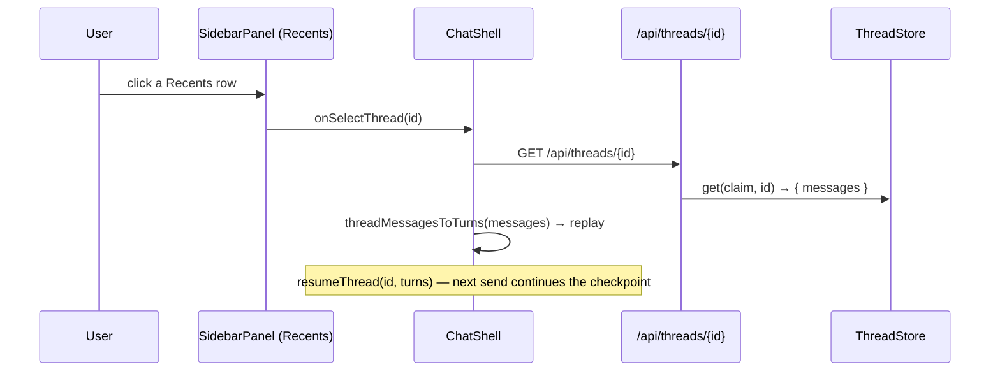

# Chat Persistence + Memory Integration: Design

> **Status.** Design document — companion to
> [`chat_persistence_memory_integration.plan.md`](chat_persistence_memory_integration.plan.md)
> (*what & why*). This doc answers *how*: the durable-vs-runtime data model, the
> hybrid trade-off (with sourced research), the persist/resume/recall sequences,
> and the `data-testid` contract. Changes no source.
>
> **Date:** 2026-06-19. **Reads with:** the plan, the BFF thread store
> (`frontend/lib/adapters/thread_store/`), the DB schema
> (`db/schema.ts` — `threads.messages` JSONB already exists), and AGENTS.md
> frontend invariants (F-R1 dumb leaves, F-R2 SDK confinement, F-R9 no BFF creds).

---

## Table of contents
- [1. Two stores, two jobs (the mental model)](#1-two-stores-two-jobs-the-mental-model)
- [2. The hybrid decision — trade-off table + research](#2-the-hybrid-decision--trade-off-table--research)
- [3. Data model](#3-data-model)
- [4. Sequences: create, persist, resume, recall, reject](#4-sequences-create-persist-resume-recall-reject)
- [5. Layering & seam placement](#5-layering--seam-placement)
- [6. data-testid contract](#6-data-testid-contract)
- [7. Failure modes](#7-failure-modes)

---

## 1. Two stores, two jobs (the mental model)

```
   ┌──────────────────────────┐         ┌────────────────────────────┐
   │  LangGraph CHECKPOINTER   │         │  BFF THREAD STORE (durable) │
   │  keyed by thread_id       │         │  threads table (Neon/CloudSQL)│
   │                          │         │                            │
   │  • full graph state      │         │  • thread_id, user_id      │
   │  • for RESUME / replay   │         │  • title, timestamps       │
   │    of the agent run      │         │  • messages JSONB ← NEW use │
   │  • PRUNED for volume     │         │  • metadata (recalled keys)│
   │    (NOT durable history) │         │  • the LISTABLE Recents src │
   └──────────────────────────┘         └────────────────────────────┘
            ▲   resume                              ▲   list + display
            │   (next send continues)               │   (Recents, transcript)
            └───────────── agent run ───────────────┘
                                                     ▲   distilled facts
   ┌──────────────────────────┐                      │
   │  MEMORY STORE (mem0/sqlite)│  ◄── autocapture extracts from chats
   │  • typed facts per user   │      recalled keys linked back per thread
   │  • suppressed flag ← NEW   │      (Phase B), reject = soft-suppress
   └──────────────────────────┘
```

"What the model needs" (checkpointer state) is separated from "what the UI
needs" (small, query-optimized rows) — the production hybrid pattern. The
memory store is a **third**, independent store of distilled facts; Phase B only
*links* recalled facts back to a thread for evaluation, it does not merge stores.

## 2. The hybrid decision — trade-off table + research

**Research consensus** (sources below): checkpointers are short-term,
thread-scoped state for resume/time-travel — *not* the long-term source for a
history UI; a separate index/transcript table is the production pattern;
reading full history back from the checkpointer for *display* is a perf concern;
and **checkpoints get pruned for volume**, so checkpointer-only history is not
durable.

| Axis | A. Checkpointer = SoT | B. BFF store = SoT (no checkpointer display) | **C. Hybrid (chosen)** |
|------|----------------------|----------|------------------------|
| Matches research | partial | ✗ | ✓ |
| Durable "ALL history" (goal) | ✗ pruned | ✓ | ✓ |
| Sidebar listing | needs an index anyway → C | ✓ | ✓ |
| Transcript display | read-back per click (perf caveat) | ✓ | ✓ (no checkpointer round-trip) |
| Resume correctness | ✓ | ✗ divergence risk | ✓ checkpointer authoritative |
| New code | least | medium | most (per-turn dual-write) |

**Chosen: C.** The user's explicit goal — *persist all chat history* — plus the
pruning caveat rules out A as the durable record. C keeps the checkpointer
authoritative for resume (no divergence risk) and makes the BFF store the
durable, listable, displayable record. Cost: one per-turn write seam.

The repo is already 80% at C: `threads.messages` JSONB exists and is documented
as the resume-replay source; the resume path (`GET /threads/[id]` →
`threadMessagesToTurns`) already reads it. The gap is that nothing **writes** it
and rows aren't auto-created.

Sources:
[LangChain Persistence docs](https://docs.langchain.com/oss/python/langgraph/persistence) ·
[LangGraph Persistence Guide 2026 (Fastio)](https://fast.io/resources/langgraph-persistence/) ·
[Managing Threads & Conversation History (Medium)](https://medium.com/@m.naufalrizqullah17/managing-threads-and-conversation-history-in-langchain-with-checkpoints-df7b02beb321) ·
[Mastering LangGraph Checkpointing 2025 (Sparkco)](https://sparkco.ai/blog/mastering-langgraph-checkpointing-best-practices-for-2025).

## 3. Data model

`threads` (existing table — no migration needed for Phase A):

```
 thread_id  text PK          ← the SAME id the agent mints (D1)
 user_id    text
 title      text             ← provisional = first user line, trimmed
 messages   jsonb  []        ← NOW WRITTEN: append {role, content} per turn (D2)
 metadata   jsonb  {}        ← Phase B: { recalled_memory_keys: {turnId: [key]} }
 created_at / updated_at / archived_at
```

`appendTurn` vs `saveMessages`: **append-only** (`appendTurn`) is chosen — it
mirrors the checkpointer's append reducer and avoids a full-array clobber if two
turns race. Each appended message carries a stable `turn_id` so a retried POST
dedupes (idempotency).

Memory store gains a **`suppressed`** boolean (Phase B, D5): recall excludes
suppressed keys; the row is retained for audit; un-suppress restores.

## 4. Sequences: create, persist, resume, recall, reject

**First send of a new chat — auto-create then persist (D1–D2):**

```mermaid
sequenceDiagram
  participant U as User
  participant UAR as useAgentRun
  participant BFF as /api/threads
  participant RT as agent runtime (stream)
  participant TS as ThreadStore (durable)
  U->>UAR: send("Plan my trip")
  Note over UAR: first send → mint thread_id (once)
  UAR->>BFF: POST /api/threads { thread_id, title: "Plan my trip" }
  BFF->>TS: create(claim, {thread_id, title})
  UAR->>RT: streamRun({thread_id, body})
  RT-->>UAR: …tokens… run complete
  UAR->>BFF: POST /api/threads/{id}/messages { user, assistant, turn_id }
  BFF->>TS: appendTurn(claim, id, turn)
  Note over UAR: both writes fire-and-forget; failure ≠ broken chat
```

**Resume from the durable store (D3 — already the code path):**



**Recall + reject (Phase B, D4–D5):**

```mermaid
sequenceDiagram
  participant RT as runtime (recall gate)
  participant UAR as run view
  participant EV as eval disclosure
  participant MEM as /api/memory
  RT-->>UAR: memory_recalled { keys:[k1,k2] }  (NEW: keys, not just count)
  UAR-->>EV: recalled items (key+type+content), per turn
  Note over EV: gated to eval/dev surface
  EV->>MEM: PATCH /api/memory/{k1} { suppressed: true }  (Reject)
  MEM-->>EV: k1 leaves the list; recall gate excludes it next run
```

## 5. Layering & seam placement

- **Port:** `appendTurn` added to the `ThreadStore` interface (`lib/ports/`).
  The drizzle/pg write stays in `lib/adapters/thread_store/**` (F-R2). The
  in-memory repo implements it for node tests (TAP-2: real impl, not mocks).
- **BFF handler:** `makeThreadAppendHandler` in `lib/bff/handlers.ts` — auth +
  Zod + port call only, no logic (FE-AP-3). Route: `app/api/threads/[id]/messages/route.ts`.
- **Client:** the create + persist calls live in `useAgentRun` (it owns run
  lifecycle, F-R1); `SidebarPanel`/`ThreadSidebar` stay dumb. Persistence is
  same-origin cookie-auth, **no bearer** (F-R9 — the credential hop is
  BFF→middleware).
- **Phase B recall keys:** wire event extension in `lib/wire/` (pure Zod) +
  `run_view_reducer`; the suppress flag is a memory-store concern behind
  `/api/memory`. No trust-kernel change.

## 6. data-testid contract

| testid | Element | Phase |
|--------|---------|-------|
| `thread-row-{id}` | Recents row (existing; now backed by a real saved chat) | A |
| `recall-indicator` | per-turn recalled count (existing) | A |
| `recalled-memories` | per-chat eval disclosure listing recalled items | B |
| `recalled-memory-{key}` | one recalled item row | B |
| `reject-memory-{key}` | Reject (soft-suppress) button on an item | B |

## 7. Failure modes

| Failure | Behavior |
|---------|----------|
| Auto-create POST fails | Run still streams; the chat just isn't in Recents yet — surfaced via the non-blocking sidebar error; a later turn-persist retries create-or-append. Never blocks the live answer. |
| Turn-persist POST fails | Transcript for that turn isn't durable yet; retried on next turn / reload. Live chat unaffected. |
| Resume GET 404 (pruned/not-owned) | Degrades to "nothing happened" (existing behavior in `loadThreadTurns` — returns `[]`, surfaces error). |
| Reject on a missing key | Typed memory error, surfaced; list unchanged. |
| Concurrent turns | `appendTurn` is append-only + turn-id-deduped → no clobber. |
