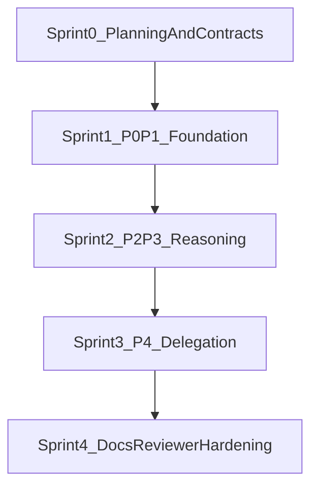

# Deep Agent Capabilities Sprint Board

This document is the execution board for the deep-agent capability ladder (P0-P4). It converts the roadmap into sprints, user stories, and quality gates aligned to architecture, style, and TDD requirements.

## Objective

Implement the full P0-P4 capability ladder in the four-layer architecture, ship reviewer prompt v2 in parallel with existing prompts, update architecture and workspace documentation, and complete migration cleanup.

## Delivery Sequence

## Story Card Template (used in every sprint)

- Story ID and title
- User story (`As a..., I want..., so that...`)
- Scope (`in` / `out`)
- Files and modules touched
- Dependencies
- Acceptance criteria
- TDD strategy by layer (L1/L2/L3/L4)
- Evidence required (tests/docs/traces)

## Shared Definition of Done (applies to every story)

- `code_reviewer` acceptance is documented for touched concern areas.
- Four-layer dependency rules hold per `docs/Architectures/FOUR_LAYER_ARCHITECTURE.md`.
- Coding and layering conventions match `docs/STYLE_GUIDE_LAYERING.md`.
- TDD follows `research/tdd_agentic_systems_prompt.md`:
  - failure paths first for all gates and guards
  - layer-aligned strategy (L1 red-green, L2 contract, L3 eval, L4 simulation)
  - no live-LLM dependency in deterministic CI lanes
- Required tests pass for impacted layer(s), including architecture boundary tests.
- Story evidence includes:
  - changed file list
  - test evidence (which suites ran and passed)
  - docs updates if behavior/interfaces changed

## Sprint 0: Planning and Contracts

### Goal
Lock story decomposition, architecture boundaries, and test contracts before implementation-heavy changes.

### Stories

#### S0-US1: Capability decomposition and sequencing
- User story: As a maintainer, I want explicit P0-P4 decomposition so implementation can be parallelized without dependency confusion.
- Files/modules: `docs/plans/deep_agent_capabilities_793b5c9b.plan.md`
- Dependencies: None
- Acceptance criteria:
  - Sprint-level dependency graph is documented.
  - P0/P1 prerequisites for P2/P3/P4 are explicit.
  - Risks and mitigations are captured.
- TDD strategy: N/A (planning artifact)
- Evidence: plan updates committed in repo docs.

#### S0-US2: Architecture and test contract baseline
- User story: As a reviewer, I want a clear contract for layer boundaries and test types so later stories are rejected if they drift.
- Files/modules: `docs/Architectures/FOUR_LAYER_ARCHITECTURE.md`, `docs/STYLE_GUIDE_LAYERING.md`, `research/tdd_agentic_systems_prompt.md` (reference alignment)
- Dependencies: S0-US1
- Acceptance criteria:
  - Story template includes L1-L4 testing guidance.
  - Boundary invariants are referenced in all implementation sprints.
  - DoD gates are defined and reused across all stories.
- TDD strategy: N/A (contract definition)
- Evidence: cross-doc references from this sprint board.

## Sprint 1: P0/P0.5/P1 Foundation (State + Tools + Offload)

### Goal
Establish runtime foundations: state shape, tool result contract, state-aware tools, and compaction/offloading primitives.

### Stories

#### S1-US1: Extend runtime state for files/todos/plan references
- User story: As an agent runtime, I want persistent state slots for files/todos/plan refs so long tasks remain coherent across turns.
- Files/modules: `orchestration/state.py`, `trust/models.py` (if shared types required)
- Dependencies: Sprint 0 complete
- Acceptance criteria:
  - State includes `files`, `todos`, `plan_ref` with typed schema.
  - Backward compatibility/migration defaults are defined.
  - Serialization/deserialization remains stable.
- TDD strategy:
  - L1 schema validation for new trust/shared types.
  - L2 contract tests for state persistence behavior.
- Evidence: tests under `tests/...` for state schema and compatibility.

#### S1-US2: ToolResult contract and state-aware execution
- User story: As a tool executor, I want a strict ToolResult contract so every tool emits bounded, state-compatible outputs.
- Files/modules: `services/tools/registry.py`, `components/evaluator.py`, `trust/trace_schema.py`
- Dependencies: S1-US1
- Acceptance criteria:
  - ToolResult schema/versioning is explicit.
  - Evaluator continuation consumes plan/state references deterministically.
  - Tool emissions are trace-compatible for explainability.
- TDD strategy:
  - L1 model/envelope tests.
  - L2 contract tests for registry + evaluator integration.
  - L4 failure-mode tests for malformed tool outputs.
- Evidence: contract tests and failure-path tests.

#### S1-US3: File/Todo tool families + offload/clearing policy
- User story: As a developer, I want first-class file/todo tools with auto-offload so long sessions remain context-safe.
- Files/modules: `services/tools/file_tools.py`, `services/tools/todo_tools.py`, `services/tools/registry.py`
- Dependencies: S1-US2
- Acceptance criteria:
  - File/todo tools support read/write/list/update operations as designed.
  - Offload policy triggers at configured thresholds.
  - Cleared tool results keep authoritative references in state.
- TDD strategy:
  - L2 contract tests for tool APIs and edge cases.
  - L4 simulation for offload thresholds and degraded paths.
- Evidence: tool contract tests + offload simulations.

## Sprint 2: P2/P3 Reasoning (Planning Depth + Reflection + Synthesis)

### Goal
Add reasoning controls: planning depth routing, plan quality checks, reflection, compaction, and synthesis validation.

### Stories

#### S2-US1: Planning depth routing (`L0/L1/L2`)
- User story: As a router, I want depth-aware planning modes so simple tasks stay fast and complex tasks get structured planning.
- Files/modules: `components/router.py`, `prompts/system_prompt.j2`, `prompts/includes/*`
- Dependencies: Sprint 1 complete
- Acceptance criteria:
  - Deterministic routing criteria for L0/L1/L2 are documented and tested.
  - Prompt assembly includes depth-specific behavior.
  - Telemetry indicates selected planning depth.
- TDD strategy:
  - L2 deterministic routing tests.
  - L3 eval tests for depth quality on representative tasks.
- Evidence: routing tests + eval artifacts.

#### S2-US2: Plan builder + MECE validation
- User story: As an agent, I want plans validated for structure and coverage so execution is less brittle.
- Files/modules: `components/plan_builder.py`, `components/synthesis_validator.py`, `prompts/includes/*`
- Dependencies: S2-US1
- Acceptance criteria:
  - Plan schema includes ordered steps, constraints, and success conditions.
  - MECE validator flags overlap/gaps with actionable feedback.
  - Invalid plans trigger retry/escalation behavior.
- TDD strategy:
  - L1 schema tests for plan artifacts (if in trust/shared layer).
  - L2 validator contract tests.
  - L3 rubric/trajectory checks for plan quality.
- Evidence: schema + validator tests + eval checks.

#### S2-US3: Reflection (`think`) + compaction + synthesis validator wiring
- User story: As an agent, I want controlled reflection and context compaction so long trajectories stay coherent and verifiable.
- Files/modules: `services/tools/think_tool.py`, `services/summarizer.py`, `orchestration/react_loop.py`, `components/evaluator.py`
- Dependencies: S2-US2
- Acceptance criteria:
  - Reflection entries are structured and bounded.
  - Compaction node triggers on token threshold and preserves critical context.
  - Synthesis validator gates unsafe/low-confidence synthesis.
- TDD strategy:
  - L2 contract tests for think/summarizer outputs.
  - L4 simulation tests for compaction trigger paths and fallback.
- Evidence: compaction simulations + validator failure-path tests.

## Sprint 3: P4 Delegation (Sub-agents + Budget Gate + Handoff)

### Goal
Introduce safe delegation with explicit specs, budget control, and auditable handoff boundaries.

### Stories

#### S3-US1: Sub-agent specification and dispatch
- User story: As an orchestrator, I want explicit sub-agent specs and dispatch contracts so delegation is predictable and auditable.
- Files/modules: `services/tools/task_tool.py`, `orchestration/react_loop.py`, `prompts/subagents/*`
- Dependencies: Sprint 2 complete
- Acceptance criteria:
  - Delegation request includes objective, constraints, and expected output schema.
  - Dispatch lifecycle events are traceable.
  - Parent/child correlation IDs are preserved end-to-end.
- TDD strategy:
  - L2 contract tests for task tool envelope.
  - L4 orchestration simulations for multi-step delegation.
- Evidence: delegation contract tests + orchestration scenario tests.

#### S3-US2: Delegation budget gate and policy enforcement
- User story: As a safety owner, I want budget and policy gates before delegation so runaway delegation and risk escalation are prevented.
- Files/modules: `orchestration/react_loop.py`, `services/tools/task_tool.py`, `trust/trace_schema.py`
- Dependencies: S3-US1
- Acceptance criteria:
  - Budget checks run before sub-agent creation.
  - Denied delegations emit explicit reason codes.
  - Gate outcomes are visible in explainability traces.
- TDD strategy:
  - L2 gate contract tests.
  - L4 failure-mode matrix for allow/deny/throttle/require-approval.
- Evidence: parametrized failure matrix tests.

#### S3-US3: Filesystem-based handoff and reconciliation
- User story: As a runtime, I want filesystem-backed handoffs so delegated outputs can be resumed, audited, and reconciled.
- Files/modules: `services/tools/file_tools.py`, `services/tools/task_tool.py`, `components/evaluator.py`
- Dependencies: S3-US2
- Acceptance criteria:
  - Child outputs are persisted with deterministic references.
  - Parent reconciles child outputs idempotently.
  - Recovery flow exists for partial/failed child runs.
- TDD strategy:
  - L2 contract tests for persistence/reconciliation.
  - L4 crash-recovery simulations.
- Evidence: replayable integration fixtures + recovery tests.

## Sprint 4: Docs, Reviewer Prompt V2, and Hardening

### Goal
Finalize architecture documentation, reviewer policy, and migration cleanup once runtime behavior stabilizes.

### Stories

#### S4-US1: Architecture docs integration
- User story: As an architect, I want architecture docs updated in-place so implemented runtime capabilities are accurately documented.
- Files/modules: `docs/Architectures/FOUR_LAYER_ARCHITECTURE.md`, explainability architecture docs as needed
- Dependencies: Sprints 1-3 complete
- Acceptance criteria:
  - Runtime capabilities section reflects new state/tool/planning/delegation features.
  - Event taxonomy and extension points include new execution events.
  - Trust model tables include new artifacts where shared.
- TDD strategy: N/A (documentation correctness)
- Evidence: doc diffs linked to implemented stories.

#### S4-US2: Reviewer prompt v2 rollout (non-breaking)
- User story: As a reviewer, I want a versioned prompt family so new checks can be introduced without breaking historical evaluation continuity.
- Files/modules: `prompts/codeReviewer/v2/*`, `AGENTS.md` (review guidance)
- Dependencies: S4-US1
- Acceptance criteria:
  - v2 prompts exist alongside current prompts.
  - v2 criteria explicitly include layer/style/TDD checks for deep-agent changes.
  - Prompt versioning strategy supports A/B or staged adoption.
- TDD strategy:
  - L2 prompt-loading contract tests where applicable.
  - L3 rubric checks for review output structure/coverage.
- Evidence: prompt snapshots/tests and reviewer examples.

#### S4-US3: Migration cleanup and architecture hardening
- User story: As a maintainer, I want scratch artifacts removed after migration so the codebase has a single source of truth.
- Files/modules: `deep_agents_from_scratch/` removal, architecture tests under `tests/architecture/`
- Dependencies: S4-US2
- Acceptance criteria:
  - No remaining imports or runtime references to scratch folder.
  - Architecture boundary tests pass after cleanup.
  - Plan/story references point to canonical module locations.
- TDD strategy:
  - L2/L4 regression and architecture-boundary tests.
- Evidence: passing `tests/architecture/` and usage search cleanup evidence.

## Dependency and Risk Board

### Dependency summary
- Sprint 0 must complete before implementation stories start.
- Sprint 1 is a hard prerequisite for Sprint 2 and Sprint 3.
- Sprint 2 reasoning primitives should be stable before Sprint 3 final integration.
- Sprint 4 runs after runtime features reach green baselines.

### Risks and mitigations
- Risk: layer boundary drift during rapid feature development.
  - Mitigation: enforce architecture tests and story-level import checks.
- Risk: non-deterministic tests leaking into commit-time pipelines.
  - Mitigation: strict L1/L2 CI lane and marker policy for L3/L4.
- Risk: reviewer/docs mismatch with delivered behavior.
  - Mitigation: v2 reviewer prompts map directly to sprint acceptance criteria.

## Execution Checklist

- [ ] Sprint board maintained as source of truth during implementation.
- [ ] Every merged story references this board and marks evidence.
- [ ] Shared Definition of Done is evaluated before story closure.
- [ ] Architecture, style, and TDD references are kept current with changes.

