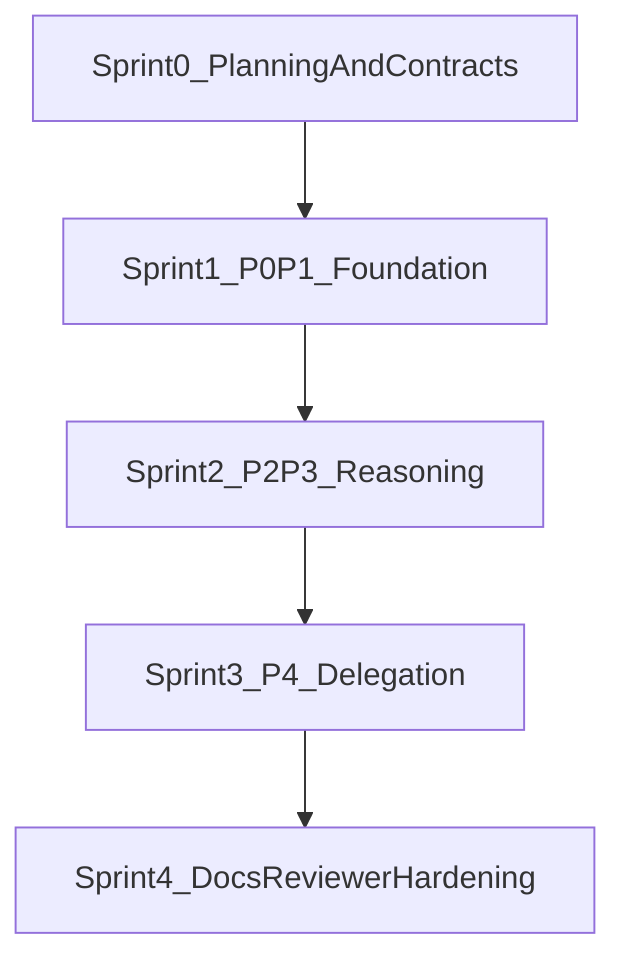

# Deep Agent Sprint Board

## Objective

Build a sprint board for the deep-agent capability roadmap in `docs/plans/deep_agent_capabilities_793b5c9b.plan.md`, with clear sprint scopes, user stories, and a strict Definition of Done aligned with:

- `docs/Architectures/FOUR_LAYER_ARCHITECTURE.md`
- `docs/STYLE_GUIDE_LAYERING.md`
- `research/tdd_agentic_systems_prompt.md`

## Sprint Breakdown




- **Sprint 0: Planning and Contracts**
  - User stories
    - As a maintainer, I want traceable story decomposition for P0-P4 so we can execute incrementally.
    - As a reviewer, I want architecture boundary checks defined up front so layering regressions are prevented.
  - Deliverables
    - Sprint board sections with capacity assumptions, dependencies, and risk flags.
    - Story template including scope, tests, and architecture impact.

## Sprint 0 Execution Board (Planning and Contracts)

### Sprint Goal

Lock delivery contracts for Sprint 1-4 so implementation can proceed without ambiguity on scope, layering, tests, and traceability.

### Capacity Assumptions

- Sprint length: 5 working days.
- Team allocation: 2 engineer-days/day total (one primary implementer, one rotating reviewer).
- Planned allocation:
  - 40% story decomposition and slicing (P0-P4)
  - 30% architecture/testing contract definition
  - 20% acceptance and evidence framework
  - 10% risk and dependency alignment

### Dependency Checkpoints

- D0.1: Architecture and layering references agreed (`FOUR_LAYER_ARCHITECTURE`, `STYLE_GUIDE_LAYERING`).
- D0.2: TDD strategy baseline agreed (`tdd_agentic_systems_prompt`).
- D0.3: Story IDs mapped to target modules before Sprint 1 kickoff.

### Risk Flags (Sprint 0-Specific)

- R0.1: Stories too large to complete in one sprint slice.
  - Mitigation: enforce vertical slicing with explicit out-of-scope notes per story.
  - Owner: Sprint Lead
- R0.2: Test expectations unclear by layer.
  - Mitigation: each story must include L1/L2/L3/L4 test intent, even when marked N/A.
  - Owner: Test Lead
- R0.3: Architecture constraints interpreted inconsistently.
  - Mitigation: include a boundary checklist in every story acceptance section.
  - Owner: Architecture Reviewer

### Story Board


| Story                              | Goal                                                            | Scope                                                                                           | Dependencies | Acceptance and Evidence                                                                                                      |
| ---------------------------------- | --------------------------------------------------------------- | ----------------------------------------------------------------------------------------------- | ------------ | ---------------------------------------------------------------------------------------------------------------------------- |
| S0-1 Deep-Agent Epic Decomposition | Decompose P0-P4 into reviewable sprint stories                  | `docs/plans/deep_agent_capabilities_793b5c9b.plan.md`, this board                               | D0.1         | Each capability mapped to a sprint story with ID, owner, and acceptance criteria; evidence: updated board and plan doc links |
| S0-2 Layer Boundary Contract       | Define and freeze allowed dependency flows for targeted modules | `docs/Architectures/FOUR_LAYER_ARCHITECTURE.md`, `docs/STYLE_GUIDE_LAYERING.md`                 | D0.1         | Boundary checklist added and referenced by all sprint stories; evidence: checklist section committed                         |
| S0-3 Test Strategy Contract        | Define per-layer test strategy for deep-agent changes           | `research/tdd_agentic_systems_prompt.md`, `tests/architecture/` conventions                     | D0.2         | Each story has failure-first test notes and required test layer tags; evidence: story entries include explicit L1-L4 plan    |
| S0-4 Story Template Finalization   | Finalize reusable story card format for all sprints             | this board                                                                                      | D0.1, D0.2   | Template includes scope, blockers, TDD plan, architecture impact, and evidence links; evidence: template section updated     |
| S0-5 Sprint 1 Readiness Gate       | Confirm Sprint 1 can start with no contract ambiguities         | Sprint 1 mapped files (`orchestration/state.py`, `services/tools/`*, `components/evaluator.py`) | S0-1 to S0-4 | Sprint 1 stories are marked ready with dependencies/risk flags and DoD traceability; evidence: readiness checklist complete  |


### Sprint 0 Status Tracker


| Story                              | Status   | Evidence                                                                                                        |
| ---------------------------------- | -------- | --------------------------------------------------------------------------------------------------------------- |
| S0-1 Deep-Agent Epic Decomposition | Complete | `docs/plans/deep_agent_capabilities_793b5c9b.plan.md` sprint decomposition and dependency mapping               |
| S0-2 Layer Boundary Contract       | Complete | this board references `FOUR_LAYER_ARCHITECTURE` and `STYLE_GUIDE_LAYERING`; shared DoD enforces boundary checks |
| S0-3 Test Strategy Contract        | Complete | this board and capability plan require L1-L4 strategy and failure-first guidance                                |
| S0-4 Story Template Finalization   | Complete | `User Story Template` section now includes architecture boundary checklist                                      |
| S0-5 Sprint 1 Readiness Gate       | Complete | readiness checklist complete; kickoff review recorded in `Sprint 1 Kickoff Review Record`                       |


### Sprint 0 Readiness Checklist

- All Sprint 1 stories have IDs, module scopes, and explicit non-goals.
- Every story includes an architecture boundary checklist item.
- Every story includes a failure-first test entry and impacted test layer(s).
- Risks and blockers are declared with mitigation owners.
- DoD evidence format is agreed (test output + docs update note).
- Sprint 1 kickoff review completed and recorded.

### Sprint 1 Kickoff Review Record

- Date: 2026-04-28
- Participants (roles): Sprint Lead, Architecture Reviewer, Test Lead
- Decision: Sprint 1 is approved to start with current story decomposition and contracts.
- Confirmations:
  - `S1-US1`, `S1-US2`, and `S1-US3` have explicit module scope and dependencies.
  - Architecture boundary checks are mandatory per story.
  - Failure-first and layer-tagged test strategy is required before story closure.
- Follow-ups:
  - Sprint Lead tracks any scope expansion as new story IDs (no silent scope creep).
  - Test Lead enforces L1/L2 deterministic lane first, with L3/L4 markers scoped appropriately.
- **Sprint 1: P0/P0.5/P1 Foundation (state + tools + offload)**
  - User stories
    - As an agent runtime, I want state to persist files/todos/plan references so long tasks remain coherent.
    - As a tool executor, I want state-aware tool results and offloading so context remains bounded.
    - As a developer, I want file/todo tool families so workflows are first-class.
  - Deliverables
    - Stories mapped to `orchestration/state.py`, `services/tools/`*, `components/evaluator.py`.
    - TDD-first test stories for L1/L2 deterministic and contract coverage.

### Sprint 1 Status Tracker


| Story                                                          | Status   | Evidence                                                                                                                              |
| -------------------------------------------------------------- | -------- | ------------------------------------------------------------------------------------------------------------------------------------- |
| S1-US1 Runtime state extensions (`files`, `todos`, `plan_ref`) | Complete | `orchestration/state.py` reducers + typed fields; `_execute_tools_impl` state propagation                                             |
| S1-US2 ToolResult contract + state-aware execution path        | Complete | `services/tools/registry.py` (`ToolExecutionResult`, `execute_with_result`) and orchestration consumption                             |
| S1-US3 File/Todo tool families + offload/clearing thresholds   | Complete | Added stateful tools, explicit `AgentConfig` thresholds, and `_execute_tools_impl` offload/clearing enforcement with regression tests |


### Sprint 1 Test Evidence (Current Slice)

- `pytest tests/services/test_base_config.py tests/services/test_tools.py tests/services/test_stateful_tools.py tests/orchestration/test_react_loop.py -q` passed (`59 passed`).
- Full-suite blocker (pre-existing environment gap): `pytest tests/ -q` fails during collection in `tests/orchestration/test_checkpoint_wiring.py` because `langgraph.checkpoint.sqlite` is unavailable.

### Sprint 1 Implementation Walkthrough (Todo, Virtual Filesystem, Planning)

This section documents what shipped in Sprint 1/Sprint 2 for stateful execution and how the runtime behaves at run time.

#### 1) Todo state (task tracking inside AgentState)

- Implemented in:
  - `orchestration/state.py` (`todos`, `plan_ref`)
  - `services/tools/todo_tools.py` (`execute_state_todo_tool`)
  - `orchestration/react_loop.py` (`_execute_tools_impl` state-delta merge)
- Contract:
  - Todo items are structured objects: `{id, content, status}` where status is one of `pending | in_progress | completed | cancelled`.
  - Todo tool supports `read`, `set`, `append`, `update_status`, and `set_plan_ref`.
  - Tool calls return `state_delta`; orchestration merges that into live state so later steps see updated todos.
- Why this exists:
  - Keeps long tasks coherent across multiple model/tool turns.
  - Lets synthesis validation check whether planned work was actually completed.

Example flow:

1. Agent appends todo: "collect requirements" (`pending`).
2. Agent marks it `in_progress` while calling tools.
3. Agent marks it `completed` before final synthesis.
4. Final evaluator validates response against task + todos.

Example todo tool payload:

```json
{
  "operation": "update_status",
  "todo_id": "t1",
  "status": "completed"
}
```

#### 2) Virtual filesystem (in-state artifact storage, not disk I/O)

- Implemented in:
  - `orchestration/state.py` (`files: dict[str, str]`)
  - `services/tools/file_tools.py` (`execute_state_file_tool`)
  - `orchestration/react_loop.py` (`_apply_tool_output_thresholds`, `_execute_tools_impl`)
- Contract:
  - File tool supports `list`, `read`, and `write` over `state["files"]`.
  - Large tool outputs are auto-offloaded into virtual files under `.agent_offload/...` and replaced by compact preview text in messages.
  - Reducer behavior merges file dictionaries, so newly written artifacts survive subsequent turns/checkpoints.
- Why this exists:
  - Prevents context-window blowups from large tool outputs.
  - Preserves auditability (output still stored and referenceable).
  - Enables plan and summary artifacts to be referenced via stable keys.

Example flow:

1. A tool returns 20k chars (above offload threshold).
2. Runtime stores full payload at `.agent_offload/<tool>_<hash>.txt` in `state["files"]`.
3. Model sees compact message: `[offloaded:... ] ... Preview:`.
4. Agent can later read the offloaded content through file tool `read`.

Example file tool payload:

```json
{
  "operation": "read",
  "file_path": ".agent_offload/shell_ab12cd34ef56.txt"
}
```

#### 3) Planning implementation (depth routing + persisted plan artifact)

- Implemented in:
  - `components/router.py` (`select_planning_depth`)
  - `components/plan_builder.py` (`build_plan_artifact`, `validate_plan_mece`, `build_planning_instructions`)
  - `orchestration/react_loop.py` (`route_node`, `call_llm_node`)
- Contract:
  - Router selects depth `L0 | L1 | L2` from task complexity + execution context.
  - Plan builder creates deterministic `PlanArtifact` (`ordered_steps`, `constraints`, `success_conditions`).
  - Validator enforces structural checks (contiguous step IDs, no overlapping goals, required success conditions).
  - Route node persists plan JSON into virtual files under `.agent_plans/...` and sets `plan_ref`.
  - Call node injects depth-specific planning instructions into the system prompt.
- Why this exists:
  - Right-sizes reasoning cost to task complexity.
  - Gives deterministic, inspectable planning artifacts for traceability.
  - Provides a stable bridge from planning to execution and synthesis checks.

Example flow:

1. User asks for multi-part implementation + tests.
2. Router selects `L2` and records `planning_depth_reason`.
3. Runtime writes `.agent_plans/<workflow>_step_<n>.json` and updates `plan_ref`.
4. Model receives "Planning depth L2..." instruction and executes with explicit staged reasoning.
5. Later steps can reference `plan_ref` and/or todos to verify completion before final output.

Example plan artifact shape:

```json
{
  "planning_depth": "L2",
  "planning_depth_reason": "high-complexity multi-branch task",
  "artifact": {
    "ordered_steps": [
      {"step_id": 1, "title": "Step 1", "goal": "Implement state changes"},
      {"step_id": 2, "title": "Step 2", "goal": "Add tests"}
    ],
    "constraints": ["Preserve user intent and requested constraints."],
    "success_conditions": ["All planned branches are addressed in the final synthesis."]
  },
  "validation": {
    "is_valid": true,
    "issues": []
  }
}
```

#### 4) How these three pieces work together in one run

End-to-end sequence:

1. `route_node` selects planning depth and writes plan artifact (`files` + `plan_ref`).
2. `call_llm_node` runs with depth-specific planning instructions.
3. Model emits tool calls (todo/file/tooling).
4. `_execute_tools_impl` executes tools with `_state`, applies `state_delta` to `todos/files/plan_ref`, and offloads oversized outputs.
5. `evaluate_node` validates synthesis quality using task + planning depth + todo completion context.
6. If token load is high, trajectory compaction writes a summary to virtual files and trims active reasoning trace.

Operational result: planning remains explicit, task progress remains structured, and large artifacts remain available without blowing prompt context.
- **Sprint 2: P2/P3 Reasoning (planning depth + reflection + synthesis)**
  - User stories
    - As a router, I want planning depth levels (`L0/L1/L2`) so complexity matches task needs.
    - As an agent, I want reflection and compaction so long trajectories remain accurate.
    - As a governance reviewer, I want synthesis validation so outputs are structurally reliable.
  - Deliverables
    - Stories mapped to `components/router.py`, `components/plan_builder.py`, `services/tools/think_tool.py`, `components/synthesis_validator.py`, `services/summarizer.py`.
    - Eval/simulation story slices for non-deterministic behavior coverage.

### Sprint 2 Status Tracker


| Story                                                      | Status      | Evidence                                                                                                                                                                           |
| ---------------------------------------------------------- | ----------- | ---------------------------------------------------------------------------------------------------------------------------------------------------------------------------------- |
| S2-US1 Planning depth routing (`L0/L1/L2`) + prompt wiring | In Progress | Added deterministic depth selector in `components/router.py`, depth instruction builder in `components/plan_builder.py`, and orchestration wiring in `orchestration/react_loop.py` |
| S2-US2 Reflection + trajectory compaction                  | In Progress | Added `services/tools/think_tool.py`, `services/summarizer.py`, token-threshold compaction wiring in `orchestration/react_loop.py`, and service/orchestration tests                |
| S2-US3 Synthesis validation contracts                      | In Progress | Added `components/synthesis_validator.py` and contract tests in `tests/components/test_synthesis_validator.py` with evaluate-node gating                                           |


- **Sprint 3: P4 Delegation (sub-agents + budget gates + handoff)**
  - User stories
    - As an orchestrator, I want sub-agent delegation with explicit specs so complex tasks can parallelize safely.
    - As a safety owner, I want delegation budget gates so cost and risk stay bounded.
    - As a runtime, I want filesystem-based handoff so delegated outputs are auditable.
  - Deliverables
    - Stories mapped to `services/tools/task_tool.py`, `orchestration/react_loop.py`, trust/trace integration.
    - Failure-mode matrix stories for delegation denial and fallback paths.

### Sprint 3 Status Tracker


| Story                                                      | Status   | Evidence                                                                                                                                                                    |
| ---------------------------------------------------------- | -------- | --------------------------------------------------------------------------------------------------------------------------------------------------------------------------- |
| S3-US1 Sub-agent specification + dispatch contract         | Complete | Added `services/tools/task_tool.py` delegation envelope and bound live dispatcher callback via `services/tools/delegation_dispatcher.py` + runtime registry wiring          |
| S3-US2 Delegation budget gate + policy enforcement         | Complete | Added policy/budget/call-count gate reason codes in `task_tool`, wired orchestration state budget inputs in `_execute_tools_impl`, and added allow/deny/throttle tests      |
| S3-US3 Filesystem handoff + reconciliation + trace linkage | Complete | Added request/result/reconcile artifact persistence in `.agent_handoff/`*, idempotent reconcile path, and TrustTraceRecord emission wiring in `orchestration/react_loop.py` |


### Sprint 3 Test Evidence (Current Slice)

- `pytest tests/services/test_stateful_tools.py tests/services/test_tools.py tests/services/test_base_config.py tests/orchestration/test_react_loop.py -q` passed (`67 passed`).
- `pytest tests/architecture/ -q` passed (`75 passed, 2 skipped`).
- `pytest tests/ -q` passed (`1439 passed, 11 skipped, 43 deselected`).
- **Sprint 4: Docs, Reviewer Prompt V2, and Hardening**
  - User stories
    - As an architect, I want architecture docs updated in-place so runtime changes remain explainable.
    - As a reviewer, I want versioned code-reviewer prompts so deep-agent reviews are standardized.
    - As a maintainer, I want migration cleanup complete so scratch artifacts are removed safely.
  - Deliverables
    - Stories mapped to `docs/Architectures/FOUR_LAYER_ARCHITECTURE.md`, `AGENTS.md`, `prompts/codeReviewer/v2/`*, cleanup of `deep_agents_from_scratch/`.
    - Final architecture test and documentation consistency stories.

### Sprint 4 Status Tracker

| Story | Status | Evidence |
| --- | --- | --- |
| S4-US1 Architecture docs integration | Complete | Updated deep-agent capability and execution taxonomy coverage in `docs/Architectures/FOUR_LAYER_ARCHITECTURE.md` |
| S4-US2 Reviewer prompt v2 rollout (non-breaking) | Complete | Added `prompts/codeReviewer/v2/*`, prompt version selection (`prompt_version` / `--prompt-version`), and prompt rendering tests |
| S4-US3 Migration cleanup and architecture hardening | Complete | Removed `deep_agents_from_scratch/*.py`; added cleanup guard test in `tests/architecture/test_deep_agent_cleanup.py` |

### Sprint 4 Test Evidence (Current Slice)

- `pytest tests/prompts/test_code_reviewer_v2_renders.py tests/meta/test_code_reviewer.py tests/architecture/test_deep_agent_cleanup.py tests/architecture/test_dependency_rules.py -q`
- `pytest tests/architecture/ -q`

### Sprint 5: Explainability Runtime Hardening and Closeout
  - User stories
    - As an operator, I want log filtering and streaming to remain truthful under real UI usage so diagnostics are reliable.
    - As an architecture reviewer, I want replay boundaries enforced by tests so no runtime re-execution path can leak into the explainability UI.
    - As a maintainer, I want Sprint 4 review findings captured with explicit closeout evidence so release decisions are auditable.
  - Deliverables
    - Stories mapped to `services/explainability_service.py`, `frontend-explainability/components/logs/LogViewer.tsx`, `frontend-explainability/lib/transport/sse_client.ts`, `frontend-explainability/tests/architecture/test_replay_no_runtime_calls.test.ts`.
    - Focused tests for stream failure paths and filter/query contract correctness.

### Sprint 5 Status Tracker

| Story | Status | Evidence |
| --- | --- | --- |
| S5-US1 Log query and tail hardening (`since` timezone, concern allowlist, WARN/WARNING normalization) | Complete | `services/explainability_service.py` adds UTC-normalized comparisons, concern allowlist filtering, and level alias handling with regression tests in `tests/services/test_explainability_service.py` |
| S5-US2 Replay boundary test tightening | Complete | `frontend-explainability/tests/architecture/test_replay_no_runtime_calls.test.ts` now scans replay entry files and restricts replay surface calls to `getWorkflowEvents` |
| S5-US3 LogViewer filter/truthfulness + stream error contract tests | Complete | Added `frontend-explainability/components/logs/LogViewer.test.tsx` to validate URL filter application, URL-sourced tail filters, stream error frame rendering, and stream close behavior |

### Sprint 5 Test Evidence (Current Slice)

- `cd frontend-explainability && npm run test -- components/logs/LogViewer.test.tsx lib/transport/sse_client.test.ts tests/architecture/test_replay_no_runtime_calls.test.ts`
- `pytest tests/services/test_explainability_service.py -q -k "query_logs_with_aware_since_does_not_raise or query_logs_rejects_path_traversal_concerns or query_logs_warning_alias_matches_python_logging"`

## User Story Template

For each story in each sprint:

- Story ID and title
- Persona + intent ("As a..., I want..., so that...")
- Scope (files/modules)
- Dependencies and blockers
- TDD plan by layer (L1/L2/L3/L4)
- Architecture boundary checklist
  - Allowed imports and forbidden import directions
  - Whether trust-kernel types are impacted
  - Whether architecture tests must be added or updated
- Acceptance criteria
- Evidence links (tests/docs)

## Shared Definition of Done

- `code_reviewer` criteria are satisfied for the touched concern area (runtime/tools/docs/prompts).
- Four-layer dependency rules remain compliant per `docs/Architectures/FOUR_LAYER_ARCHITECTURE.md`.
- Coding/layering conventions match `docs/STYLE_GUIDE_LAYERING.md`.
- TDD execution follows `research/tdd_agentic_systems_prompt.md`:
  - failure paths first
  - layer-appropriate strategy (L1 Red-Green, L2 contract, L3 eval, L4 simulation)
  - no live-LLM CI path for deterministic layers
- Required tests pass for impacted layer(s), including architecture boundary tests where relevant.
- Traceability: each story includes test evidence and documentation update notes.

## Sequencing and Dependencies

- Sprint 0 output is required before Sprint 1 implementation stories are considered ready.
- Sprint 1 state/tool primitives are prerequisites for Sprint 2 and Sprint 3 stories.
- Sprint 2 reasoning primitives should land before final Sprint 3 delegation integration.
- Sprint 4 hardening runs after core behavior is stable and test baselines are green.

## Risks and Mitigations

- **Risk:** Layer boundary drift during rapid capability additions.
  - **Mitigation:** enforce architecture tests and story-level boundary checklist.
- **Risk:** Non-deterministic test creep into commit-time suite.
  - **Mitigation:** enforce layer-tagged test strategy from TDD guide.
- **Risk:** Prompt/reviewer updates diverge from implementation behavior.
  - **Mitigation:** keep reviewer v2 prompts versioned and mapped to explicit story acceptance criteria.

