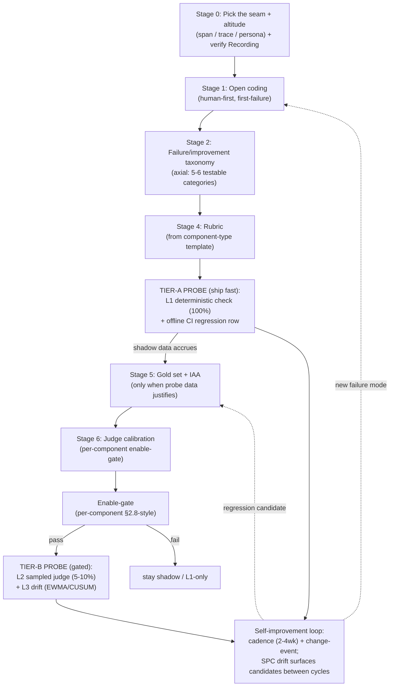

# Generalized Eval + Probe Pipeline Skill — Plan

> **Status:** PLAN (authored 2026-06-13). Companion to
> [`llm_eval_pipeline_skill.plan.md`](llm_eval_pipeline_skill.plan.md). This plan defines a
> **third** eval skill, `agentsframework-eval-probe`, whose intent is **continuous monitoring and
> self-improvement**: take *any* LLM-call seam in this workspace through
> open-coding → failure/improvement taxonomy → axial coding → rubric → judge → **a registered
> probe in the pipeline**, and keep it healthy with drift + per-category fail-rate triggers that
> re-open the loop.
>
> **Decided scope (user, 2026-06-13):** probes = all four kinds (online L1/L2/L3 monitors +
> offline CI regression + per-component enable-gate + self-improvement loop); unit = **any
> LLM-call seam**; default path = **tiered (light probe first, full rigor on-demand)**; loop
> trigger = **cadence (2–4 wk) + change-event, with EWMA/CUSUM drift on the bias-corrected
> per-category fail-rate (θ̂) as between-cycle early warning** (corrected against the Hamel/Shreya
> canon — see grounding section). Seam-to-probe-next is prioritized by the **transition failure
> matrix**.
>
> **Grounded against:** the Hamel Husain & Shreya Shankar eval canon and their full course PDF
> (11-chapter coverage audit). Sibling of the generic `llm-eval-grounded-theory` skill and the
> workspace-bound `agentsframework-eval` skill.

---

## The decisive finding: the monitoring spine already exists

The deep read found this repo is **not** missing eval infrastructure — it is missing a
*repeatable, generalized recipe* to plug a new component into the infrastructure that is already
here. The skill's real job is generalization, not greenfield construction.

| Already in repo | What it gives the probe workflow |
|---|---|
| [`meta/drift.py`](../../meta/drift.py) | **The entire 3-level drift model already implemented:** L1 performance-vs-baseline (2σ), L2 judge-calibration κ drift (`detect_calibration_drift`, `compute_cohens_kappa`), L3 governance-artifact drift; `DriftAlert`/`DriftReport`/`run_full_drift_check` + a CLI. A "probe" is largely *registering a component into this harness*. |
| [`meta/judge.py`](../../meta/judge.py) + [`meta/analysis.py`](../../meta/analysis.py) + [`meta/run_eval.py`](../../meta/run_eval.py) | The **offline judge + metrics + taxonomy-scoring harness**: `load_taxonomy`, `build_judge_prompt`, `parse_judge_response`, `compute_metrics`, `build_optimizer_input`. |
| [`services/eval_capture.py`](../../services/eval_capture.py) + [`eval_telemetry.py`](../../services/eval_telemetry.py) | The **Recording-pillar substrate** every probe writes to (same `trace_id`); the 8192-char `eval.*` exemption. |
| [`services/observability.py`](../../services/observability.py) | `save_telemetry`/`load_telemetry` — the score-emission seam the drift CLI reads. |
| [`services/governance/guardrail_validator.py`](../../services/governance/guardrail_validator.py) | The **deterministic L1-probe precedent** (regex PII/key/length, `ValidationResult`, severity/fail-action). |
| [`services/governance/goaljudge_calibration.py`](../../services/governance/goaljudge_calibration.py) | The **per-component enable-gate precedent** (§2.8 thresholds, fail-closed `GateDecision`). |

**Two worked examples, not one.** GoalJudge (LLM judge → gold set → §2.8 calibration) *and*
Guardrails (`guardrail_dataset` + `guardrail_validator` → live runtime probe) both already walked
this path. The skill generalizes the **pattern they share**, citing both — which is far stronger
evidence than a single instance that the recipe is real and repeatable here.

---

## External research integrated (2026 best practices)

| Practice | Source | How it shapes the workflow |
|---|---|---|
| **Three evaluation altitudes — span / trace / persona** | Confident AI agent-eval guide; component vs trajectory vs end-to-end (CodeAnt) | Stage 0 adds an **altitude-choice** step: the agent picks span (one LLM call), trace (multi-step run), or persona (simulated user) *before* coding. Most seams are span-level; some (router, plan_builder) need trace-level. |
| **100% cheap heuristics + 5–10% LLM-judge sampling** | OpenObserve; Galtea; Adaline | Probe taxonomy: **L1 = 100% deterministic**, **L2 = 5–10% sampled judge**, **L3 = drift over the L1/L2 stream**. Matches the repo's `precheck_input` (100%) + `InputGuardrail` (LLM) split. |
| **"Tracing is the backbone; online surfaces failure modes you don't have metrics for yet"** | Confident AI | **Reverses a loop arrow:** online monitoring feeds back into **Stage 1 open coding** (new failure modes), not only into the gold set. This is the key refinement over the generic skill's diagram. |
| **Turn every production failure into a regression test** | Confident AI; the repo's own "closed evaluation loop" rule | The self-improvement loop's default output is an **offline CI regression row** (the cheap probe), with gold-set promotion gated on human review. |
| **Component-type metric templates** | Confident AI | Stage 4 starts from a **rubric template keyed by component type** (below), not a blank page. |
| **Eval → guardrail promotion, human-in-the-loop before automation** | Confident AI; Galtea runtime-guardrail bridge | The per-component enable-gate IS the promotion gate: an offline-validated rubric becomes a live L2 probe only after its §2.8-style gates clear; acting (blocking/downgrading) waits behind the flag. |
| **EWMA for average drift; CUSUM superior for very small drifts / batch** | JMP; adaptive-CUSUM (Wiley); SPC OOD (arXiv 2402.08088) | Stage 7 specifies **which** detector per signal: EWMA on the L2 judge-score stream (catches gradual quality decay), CUSUM on the L1 per-category fail-rate (catches small persistent shifts in batch). `meta/drift.py` currently uses 2σ + κ; the skill notes EWMA/CUSUM as the documented upgrade path, not a rewrite. |
| **Judge ↔ human 85–90% agreement before scaling** | Galtea; Adaline (2026 reaffirms the Stage 6 number) | Unchanged from the existing pipeline; the skill keeps κ ≥ 0.6 as the measurement-prerequisite gate. |

Sources: [Confident AI agent-eval guide](https://www.confident-ai.com/blog/llm-agent-evaluation-complete-guide),
[CodeAnt multi-step agent evals](https://www.codeant.ai/blogs/evaluate-llm-agentic-workflows),
[OpenObserve monitoring guide](https://openobserve.ai/blog/llm-monitoring-best-practices/),
[Galtea complete guide](https://galtea.ai/blog/llm-evaluation-complete-guide),
[Adaline 2026 guide](https://www.adaline.ai/blog/complete-guide-llm-ai-agent-evaluation-2026),
[Galileo drift platforms](https://galileo.ai/blog/best-llm-output-drift-monitoring-platforms),
[JMP CUSUM/EWMA](https://www.jmp.com/en/statistics-knowledge-portal/quality-and-reliability-methods/control-charts/cusum-and-ewma-control-charts),
[SPC for OOD/drift (arXiv 2402.08088)](https://arxiv.org/pdf/2402.08088).

---

## Grounding against the Hamel Husain & Shreya Shankar canon

The 2026 vendor research above is **secondary**. The **primary, foundational** source for this
domain — and the one the repo's own GoalJudge research already cites heavily (generic-skill
bibliography R1, R2, R3, R4=EvalGen, R12, R14=SPADE, R16) — is the Hamel Husain & Shreya Shankar
eval methodology (the "analyze → measure → improve" loop, error-analysis-first, code-vs-judge,
binary verdicts). The probe plan must not drift from it. Reconciling the two:

### Where the canon *confirms* the plan (no change)

| Plan element | Hamel/Shreya canon | Verdict |
|---|---|---|
| **Tiered ramp** (cheap L1 probe first; gold-set + judge on-demand) | *"Only build expensive evaluators for problems you'll iterate on repeatedly… save [LLM-as-Judge] for persistent generalization failures."* Decision hierarchy: assertions/regex → reference checks → LLM-judge, by cost. | **Strongly confirmed** — the tiered ramp *is* their code-first rule. The Tier-A/Tier-B split is their cost hierarchy made concrete. |
| **Online → open-coding feedback arrow** | *"Re-run error analysis on fresh traces every 2–4 weeks (100+ traces/cycle), weekly spot-checks of 10–20 outliers… when production monitoring reveals new failure patterns, add representative examples to your CI dataset."* | **Confirmed** — my "reversed arrow" is exactly their continuous re-analysis loop. The vendor framing ("surfaces failure modes you don't have metrics for yet") restates it. |
| **Binary, analytic, evidence-grounded rubric** | *"Binary evaluations force clearer thinking… Likert hides uncertainty in middle values."* | Confirmed (already a cardinal rule in the generic skill). |
| **Offline CI vs online split** | *"CI uses small curated datasets, favor deterministic checks; production samples live traces async, may use heavier LLM-judge."* | Confirmed — this is the L1/offline vs L2/online probe split verbatim. |
| **Component-specific, not generic, metrics** | *"Generic evaluations waste time and create false confidence… the abuse of generic metrics is endemic… generic metrics are worse than useless."* | Confirmed — the component-type rubric *templates* are starting points the agent must specialize per seam, **never** ship as-is. The skill must say this loudly. |
| **Don't pre-write evals** | *"Write evaluators for errors you discover, not errors you imagine."* | Confirmed — Stage 1 (open coding) strictly precedes Stage 4 (rubric); a probe is never registered before its failure mode is observed. |

### Where the canon *corrects* the plan (two changes)

1. **Judge-validation metric: add TPR/TNR, don't lead with κ.** The plan (inherited from the
   GoalJudge §2.8 gate) leads with precision/recall + κ ≥ 0.6. Hamel/Shreya's explicit judge-
   alignment metric is **True Positive Rate and True Negative Rate on a held-out labeled set**:
   *"Focus on achieving high TPR and TNR with your judge on a held-out labeled test set."* These
   are not in conflict — TPR = recall; on the not-met-positive convention, TNR is the complement
   of the false-downgrade rate. **Change:** the per-component enable-gate reports **TPR/TNR as the
   headline judge-alignment pair** (the canon's vocabulary), with precision/FD/κ as the §2.8
   refinement. κ stays a *measurement prerequisite*, not the headline. The skill states the
   TPR↔recall / TNR↔(1−FD) mapping so the two vocabularies don't confuse a reader.

2. **Drift trigger: cadence-and-change is primary; EWMA/CUSUM is the automatable augmentation.**
   The plan leaned on statistical SPC (EWMA/CUSUM) as the loop trigger. The practitioner canon's
   actual trigger is **calendar cadence + significant-change events**: *"Re-run error analysis…
   every 2–4 weeks… when making significant changes: new features, prompt updates, model switches,
   major bug fixes."* SPC charts are the **vendor/platform** view, not the Hamel/Shreya default.
   **Change:** Stage 7 makes the **primary trigger** (a) the 2–4-week re-analysis cadence and
   (b) the change-event hook (prompt/model/feature change → re-run that seam's offline probe);
   EWMA on the L2 score stream and CUSUM on per-category fail-rate become the **automatable
   early-warning layer** that *surfaces candidates between cadence cycles* — reducing mean-time-
   to-detect — but a human re-analysis cycle is still the authority. This also fits `meta/drift.py`,
   whose own comments are cadence-based (L1 weekly / L2 monthly).

### Hard numbers the canon pins (adopt verbatim into the skill)

| Quantity | Value | Source |
|---|---|---|
| Traces to open-code before first taxonomy | **≥ 100** (review at least 100 to start) | evals-FAQ |
| Saturation stop rule | **~20 consecutive traces with no new category** | evals-FAQ |
| Labeled examples to validate a judge | **≥ 100** | evals-FAQ |
| Production re-analysis cadence | **100+ fresh traces every 2–4 weeks** | evals-FAQ |
| Between-cycle spot-checks | **10–20 outliers weekly** | evals-FAQ |
| Pass-rate sanity band | **100% ⇒ evals too easy; ~70% ⇒ meaningfully stress-testing** | evals-FAQ |
| Effort allocation | **60–80% of dev time on error analysis / eval** | Field Guide |
| Proof the loop works | NurtureBoss date-handling **33% → 95%** via analyze→measure→improve | Field Guide |

These replace the plan's vaguer "in days" / generic sizing with the canon's specific figures.

Primary sources: [Hamel — Evals FAQ (2026)](https://hamel.dev/blog/posts/evals-faq/),
[Hamel — Field Guide to Rapidly Improving AI Products](https://hamel.dev/blog/posts/field-guide/),
[Husain & Shankar — AI Evals course (Maven)](https://maven.com/parlance-labs/evals),
[EvalGen — Shankar et al., UIST 2024 (arXiv 2404.12272)](https://arxiv.org/abs/2404.12272),
[SPADE — Shankar et al., VLDB 2024 (arXiv 2401.03038)](https://arxiv.org/abs/2401.03038),
[LLM Evals Lesson 2: Error Analysis](https://thingsithinkithink.blog/posts/2025/06-21-llm-evals-lesson-2-error-analysis/).

**Net:** the canon *ratifies* the plan's architecture (tiered, error-analysis-first, binary,
component-specific, online-feeds-coding) and *sharpens* it (TPR/TNR headline; cadence-first with
SPC as augmentation; specific sample sizes). The vendor 2026 research adds only the
altitude vocabulary (span/trace/persona) and the SPC method detail — both compatible.

---

## Coverage audit against the Hamel/Shreya course PDF

Topic-by-topic audit of the plan against the full course guide (`llm_eval_course_hamel.pdf`,
"Application-Centric AI Evals for Engineers and Technical PMs", 11 chapters). Status: **Covered**
(plan already encodes it), **Thin** (mentioned but under-specified), **Gap** (missing — folded in
below).

| PDF chapter / topic | Plan status | Note |
|---|---|---|
| §1.2 **Three Gulfs** (Comprehension / Specification / Generalization) | Thin → **fold in** | Useful framing for *why a seam fails*; added as the open-coding lens (below). |
| §3.1 What is a Trace (full chain, not surface output) | Covered | Stage 0 already requires full trajectories; matches the Recording pillar. |
| §3.2 **Starting dataset** — synthetic (tuple method) **vs** stratified log sampling | Thin → **fold in** | The plan had altitude choice but not the *log-volume branch* + the dimension→tuple→query method. Added as Stage 0–3 detail (per-seam, reference-grade, not gospel — per user). |
| §3.3 **Open coding** (first-failure, ~100 traces, ~20-saturation) | Covered | Cardinal rule + canon numbers already embedded. |
| §3.4 **Axial coding** (LLM proposes clusters, human renames) | Covered | Stage 2. |
| §3.5–3.6 Re-label after structuring; **taxonomy iteration / criteria drift** | Covered | Criteria-drift loop arrow present. |
| §4.3 **IAA** (κ / α, alignment sessions) | Covered | Reuses `services/governance/iaa.py`; κ-as-prerequisite. |
| §4.5 Connecting human labels → automated evaluators | Covered | The gold-set → judge handoff. |
| §5.1 **Defining the right metrics** (specific not generic; "when everything is important, nothing is") | Covered | "Generic metrics worse than useless" warning added to the template table. |
| §5.2–5.3 Code-eval vs LLM-judge; **judge prompt design** | Covered | Tiered ramp = the code-vs-judge rule; rubric templates per seam. |
| §5.4 **Data splits** (dev / test; freeze test; never tune on test) | Thin → **fold in** | The plan inherited "frozen baseline" but never stated the dev/test split rule per seam. Added to the enable-gate section. |
| §5.5 Iterative judge-prompt refinement | Covered | Human-corrections → few-shot loop (R24). |
| §5.6 **Estimating true success rate with an imperfect judge** (bias correction θ̂ = (p_obs+TNR−1)/(TPR+TNR−1) + bootstrap 95% CI) | **GAP → fold in** | The single biggest math gap. The loop's "per-category fail-rate breach" trigger must fire on the **bias-corrected** rate with CI, not a raw judge count. Specified below. |
| §6 Multi-turn conversation evals | Thin | Flagged for the trace-altitude branch; most current seams are span-level. Noted, not built. |
| §7 RAG evals (contextual precision/recall/faithfulness) | Covered | Already a row in the rubric-template table (retrieval/RAG). |
| §8.3 **Transition failure matrix** (= the user's "error-propagation index": first-failure × pipeline-state heatmap) | **GAP → fold in** | No equivalent in the plan. This is the tool that decides *which seam to probe next*. Specified below, using the repo's real `WorkflowPhase` states. |
| §9 **CI/CD** (deterministic checks in CI; regression gating) | Covered | Offline CI regression probe tier. |
| §10 Human-review interfaces / annotation queues | Thin | Langfuse annotation queues (R17) cited; building a custom viewer is out of scope for the skill. |
| §11 **Improvement** (analyze→measure→improve; prompt deltas) | Covered | The self-improvement loop. |

**Two genuine gaps fold in below; the rest are confirmations or pointers.**

### Gap 1 — Transition failure matrix ("error-propagation index"), §8.3

Aggregate first-failures into a **state-transition matrix**: rows = "From State" (last
successfully-completed state), columns = "In State" (state where the first failure occurred),
cell (i,j) = count of failed traces whose first failure happened in state j right after state i
completed. A heatmap localizes the hotspots (the PDF's example: `GenSQL→ExecSQL = 12`).

**Why it belongs in a *probe* skill:** the plan already adds probes *per seam*, but nothing told
the agent **which seam to instrument next**. The transition matrix is precisely that prioritizer —
the highest-intensity cell is where the next probe earns its keep.

**Repo wiring (zero new instrumentation):** the matrix's states are this repo's **`WorkflowPhase`
enum**, already logged by [`services/governance/phase_logger.py`](../../services/governance/phase_logger.py)
to `phases.jsonl`:
`INITIALIZATION → INPUT_VALIDATION → ROUTING → MODEL_INVOCATION → OUTPUT_VALIDATION →
TOOL_EXECUTION → EVALUATION` (graph nodes `guard_input → route → call_llm → execute_tool →
evaluate`, [`orchestration/react_loop.py:1778`](../../orchestration/react_loop.py)). First-failure
attribution reuses the existing component-level checks (synthesis_validator, guardrail_validator,
goal_judge `goal_met=false`). So the matrix is a **pure offline aggregation** over `phases.jsonl`
+ first-failure labels — a natural new function in `meta/analysis.py` or `meta/drift.py`, L1-pure.

### Gap 2 — Bias-corrected true success rate with an imperfect judge, §5.6

A judge with TPR < 1 or TNR < 1 gives a **biased** raw pass-rate on unlabeled production traces.
The canon's correction:

```
θ̂ = (p_obs + TNR − 1) / (TPR + TNR − 1)     # p_obs = k/m raw judge pass-rate on m new traces
```

with a **bootstrap 95% CI** (resample test labels B times; 2.5th/97.5th percentiles). *"If the
interval is wide, improve the judge's TPR/TNR"* — not the prompt alone.

**Why it belongs in the *loop trigger*:** the self-improvement loop fires on a "per-category
fail-rate breach." A raw judge count is the wrong number to threshold — it's biased by judge
error. The trigger must compute **θ̂ and its CI** per failure-category and fire when the corrected
rate's CI clears the budget. This also gives the enable-gate a population-level claim, not just
test-split P/R.

**Repo wiring:** a pure function alongside the §2.8 evaluator in
[`services/governance/goaljudge_calibration.py`](../../services/governance/goaljudge_calibration.py)
(or a generalized sibling) — it already computes TPR(=recall)/TNR; add `corrected_success_rate()`
+ `bootstrap_ci()`. L1-pure, golden-number tested. The PDF ships reference Python (§5.7) to port.

---

## The refined workflow (per LLM-call seam)

The generic methodology gets two repo-specific upgrades: a **tiered rigor ramp** (light probe
ships first) and an **online→open-coding feedback arrow** (drift surfaces new failure modes).



**The tiered ramp (the user's chosen default):** Stage 0 → 2 → 4 → **Tier-A probe ships fast**
(a 100% deterministic L1 check + one offline CI benchmark row). The expensive
gold-set + calibration track (Stages 5–6 → Tier-B probe) is invoked **only when the Tier-A
probe's shadow data shows the seam is worth a gating judge** — the Hamel/Shreya rule *"save
LLM-as-Judge for persistent generalization failures you'll iterate on repeatedly."* This is
exactly how the repo got here: `precheck_input`/`guardrail_validator` (cheap, live) preceded the
GoalJudge gold set.

**The self-improvement trigger (chosen, canon-grounded):** the **primary** trigger is the
practitioner cadence — **re-run error analysis on 100+ fresh traces every 2–4 weeks**, plus a
**change-event hook** (prompt/model/feature change → re-run that seam's offline probe). The
**automatable early-warning layer** (EWMA on the L2 score stream; CUSUM on per-category
fail-rate) *surfaces candidates between cadence cycles* to cut mean-time-to-detect, but a human
re-analysis cycle remains the authority. The per-category fail-rate that gets thresholded is the
**bias-corrected θ̂ with its bootstrap 95% CI** (§5.6 above), never the raw judge count. Either
path's default action is to mint an **offline regression row**; **gold-set promotion is
human-gated**. This reuses `meta/drift.py`'s alert plumbing (whose own L1-weekly / L2-monthly
comments are already cadence-based).

**Which seam to probe next** is decided by the **transition failure matrix** (§8.3 above): the
highest-intensity first-failure cell over `WorkflowPhase` transitions points at the seam where a
new probe earns the most. This is the prioritizer the workflow runs *before* picking the next
Stage-0 target.

---

## Component-type rubric templates (Stage 4 starting points)

The skill ships a lookup so the rubric stage is never blank. Each maps to the metrics 2026
practice converged on, expressed as the repo's binary/analytic, evidence-grounded criteria.

| Seam type | Example here | Tier-A L1 check (100%) | Tier-B rubric criteria (sampled judge) |
|---|---|---|---|
| **Goal / outcome judge** | `components/goal_judge.py` | deterministic process floor ("ran cleanly") | goal_met, criteria_met, evidence-grounded per-criterion |
| **Input/output guardrail** | `services/guardrails.py`, `guardrail_validator.py` | regex PII/key/length, entropy injection check | policy-compliance, over/under-blocking on benign vs adversarial |
| **Tool-calling** | (future tool seams) | tool selected from allowed set; args schema-valid | Tool Correctness, Argument Correctness, Step Efficiency |
| **Planning / routing** | `components/plan_builder.py`, router | plan non-empty; depth in range | Plan Quality (complete+realistic), Plan Adherence (execution matched) |
| **Summarization / compaction** | `services/summarizer.py` | length bound; no empty output | Faithfulness (no fabrication vs source), coverage of key spans |
| **Condition generation** | `components/task_understanding.py` | grounding budget (≤1 ungrounded), ≥N conditions | conditions topical + answer-shape-aware, non-fabricated |
| **Pre-judge deterministic gate** | `components/synthesis_validator.py` | **must ship a must-accept/must-reject benchmark BEFORE it gates** (process rule #2) | n/a (deterministic) — benchmark IS the probe |

---

## Probe taxonomy (what gets registered, and where)

| Probe tier | Coverage | Lives in | Reuses | Cost |
|---|---|---|---|---|
| **L1 deterministic** | 100% of traffic | the component itself (pure check) + `eval_capture.record` | `guardrail_validator` pattern; `ValidationResult` shape | ~0 |
| **L2 sampled judge** | 5–10% | `meta/judge.py` scorer over sampled `EvalRecord`s | `load_taxonomy`, `score_eval_record`, `compute_metrics` | per-sample LLM |
| **L3 drift** | over the L1/L2 stream | `meta/drift.py` (`run_full_drift_check`) | `DriftAlert`/`DriftReport`; EWMA/CUSUM upgrade path | scheduled batch |
| **Offline CI regression** | every PR | `tests/.../<component>_benchmark_v1.json` + replay test | the `gate_benchmark_v1.json` pattern | CI |
| **Per-component enable-gate** | decision artifact | a §2.8-style evaluator (generalize `goaljudge_calibration`) | `evaluate_section_2_8_gates`, `GateDecision` | none (pure) |
| **Seam prioritizer** (which seam to probe next) | offline analysis | transition failure matrix over `phases.jsonl` | `phase_logger` `WorkflowPhase`; new fn in `meta/analysis.py` | scheduled batch |

**Enable-gate headline metrics (canon-grounded):** report **TPR / TNR on a held-out labeled set**
as the judge-alignment headline (Hamel/Shreya vocabulary), with precision / false-downgrade-rate /
κ as the §2.8 refinement. Mapping for readers: **TPR = recall**; **TNR = 1 − false-downgrade-rate**
(on the not-met-positive convention); **κ ≥ 0.6 is the measurement prerequisite**, not the
headline. The gate also reports the **bias-corrected production success rate θ̂ with a bootstrap
95% CI** (§5.6) — the population-level claim, not just the test-split P/R.

**Data-split rule (§5.4):** every seam's labeled set is split **dev / test**; the judge prompt and
rubric are tuned on **dev only**, the test split is **frozen** (hashed) and never tuned on — the
same discipline the GoalJudge 2b α baseline already enforces.

**Layer discipline (binds to [FOUR_LAYER_ARCHITECTURE.md](../Architectures/FOUR_LAYER_ARCHITECTURE.md)):**
L1 checks and pure metrics are L1/L2 Horizontal (`services/`, stdlib+pydantic, no framework
imports); the judge is L3 Vertical (`components/`); the live replay/scoring harness is
`scripts/`/`meta/` (never in CI). Same rules the existing eval code obeys.

---

## Skill metadata (proposed)

```yaml
name: agentsframework-eval-probe
description: >-
  Add and operate continuous-evaluation PROBES on any LLM-call seam in THIS repository (the
  AgentsFramework agent monorepo). Walks a component from open coding -> failure/improvement
  taxonomy -> axial coding -> rubric -> judge -> a registered probe (L1 deterministic 100%, L2
  sampled judge 5-10%, L3 drift, offline CI regression, per-component enable-gate), then keeps it
  healthy with drift + per-category fail-rate triggers that re-open the loop. Tiered: a light
  shadow probe ships first; full gold-set calibration is on-demand. Use when instrumenting a new
  component for monitoring, adding a regression benchmark, wiring drift detection, defining a
  per-component judge/rubric, or closing the production-failure -> regression-row loop. Builds on
  meta/drift.py, meta/judge.py, eval_capture, observability, and the guardrail/GoalJudge
  precedents. For the GoalJudge-specific calibration flip path defer to agentsframework-eval; for
  generic methodology defer to llm-eval-grounded-theory; for trace-pillar audits defer to
  governance-trace-audit.
disable-model-invocation: false
```

---

## Deliverables (skill build — follow-up turn)

| Item | Path | Target |
|---|---|---|
| Handbook (workflow + tiered ramp + altitude choice) | `.claude/skills/agentsframework-eval-probe/SKILL.md` | < 400 lines |
| Reference (probe taxonomy, drift methods, rubric templates, layer rules) | `reference.md` | < 350 |
| Command cookbook (register a probe, run drift CLI, replay a benchmark) | `commands.md` | < 200 |
| Two worked examples (GoalJudge + Guardrails as the generalization anchors) | `examples.md` | < 200 |
| Mirror + README row | `docs/skills/agentsframework-eval-probe/` | — |

---

## Open questions deferred to skill-build time

1. **Should L2 sampling be uniform or stratified?** Lean stratified by failure-mode (oversample
   the action-trigger class), matching the gold-set stratification rule — confirm at build.
2. **Drift cadence per level** — `meta/drift.py` comments say L1 weekly / L2 monthly; the skill
   should make cadence a per-component config, not a global constant.
3. **Where the per-component enable-gate thresholds live** — generalize `SECTION_2_8_THRESHOLDS`
   into a per-component config block, or keep one shared default profile with overrides.

---

## Verification checklist (for the skill build)

- [ ] Workflow diagram includes the tiered ramp + the online→open-coding feedback arrow
- [ ] Probe taxonomy maps each tier to an EXISTING repo primitive (no invented infra)
- [ ] Component-type rubric template table present
- [ ] Loop-trigger section leads with cadence (2–4wk) + change-event; EWMA/CUSUM framed as between-cycle early warning, not the authority
- [ ] Enable-gate reports TPR/TNR headline + the TPR↔recall / TNR↔(1−FD) mapping; κ as prerequisite
- [ ] Hamel/Shreya hard numbers embedded (100 traces start, 20-no-new saturation, 100+ labeled judge, ~70% pass-rate sanity, 60–80% effort)
- [ ] "Generic metrics are worse than useless" warning on the rubric-template table (templates are starting points, never shipped as-is)
- [ ] Transition failure matrix (§8.3) present as the seam prioritizer, wired to `WorkflowPhase`/`phases.jsonl` (no new instrumentation)
- [ ] Bias-corrected θ̂ + bootstrap 95% CI (§5.6) is the loop-trigger threshold metric, not raw judge counts
- [ ] Dev/test split rule (§5.4) stated per seam (tune on dev, freeze + hash test)
- [ ] Three Gulfs (§1.2) used as the open-coding lens
- [ ] Synthetic dimension→tuple→query method (§3.2) referenced (per-seam, not gospel) + log-volume branch (synthesize vs stratified-sample)
- [ ] Layer discipline table matches FOUR_LAYER_ARCHITECTURE dependency rules
- [ ] Both worked examples (GoalJudge + Guardrails) cited as generalization anchors
- [ ] Defers correctly to the three sibling skills; no methodology restated
- [ ] Process rules in force carried over (benchmark-before-gating, one-variable, no-blind-diagnosis, binomial power, frozen baseline)
- [ ] `disable-model-invocation: false` (auto-trigger on eval/probe edits)

---

## Implementation order (skill build)

1. `reference.md` — probe taxonomy + drift methods + rubric templates + layer rules (facts first).
2. `examples.md` — distill the GoalJudge and Guardrails paths into the shared 6-stage pattern.
3. `SKILL.md` — the tiered workflow, altitude choice, loop triggers, defer-to lines.
4. `commands.md` — register-a-probe, `meta/drift.py` CLI, benchmark replay (CI-safe; live fenced).
5. Install `.claude/` + `.cursor/`; mirror to `docs/skills/`; add README row.
6. Validate: trigger phrases; re-verify every file:line; run the documented CI-safe sweep.
