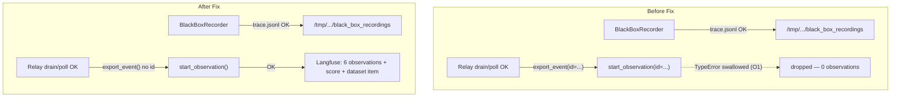

# Fix S1 BlackBox Relay Observations

**Status:** Root cause fixed in code (verified locally + in Langfuse UI). Cloud Run redeploy pending.
**Last updated:** 2026-05-29
**Parent plan:** [blackbox_e2e_validation.plan.md](blackbox_e2e_validation.plan.md)

---

## Problem

S1 validation shows only **4 telemetry-bridge events** (`run.started`, `llm.started`, `llm.finished`, `run.finished`) from the AG-UI domain event pipeline. The **6 BlackBox relay events** expected by the synthetic dataset (`task.started`, `step.planned`, `model.selected`, `guardrail.checked`, `step.executed`, `task.completed`) are completely absent, along with the `hash_chain_valid` score and the `agent-compliance-audit` dataset item.

---

## Root Cause (CONFIRMED via runtime evidence — 2026-05-29)

> **Superseded:** The earlier theory (Cloud Run env vars / relay-not-running / CPU
> throttling) was a **red herring**. The relay *was* running, recordings *were*
> being written, and `drain_workflow` *was* finding and processing them. The bug
> was one layer deeper, in the exporter's SDK call.

**`LangfuseCloudExporter.export_event()` passed an unsupported `id` keyword to the Langfuse SDK v4 `start_observation()`, so every BlackBox observation raised `TypeError` and was silently swallowed.**

The relay annotates each event with `__bb_observation_id` (the BlackBox `event_id`) for "idempotent retries". The exporter then did:

```python
if bb_observation_id is not None:
    obs_kwargs["id"] = str(bb_observation_id)
...
client.start_observation(**obs_kwargs)   # raises in SDK v4
```

But Langfuse SDK **v4.5.1** `start_observation()` has **no `id` parameter** (observation IDs are auto-generated OTel span IDs). Its signature is:

```
start_observation(trace_context, name, as_type, input, output, metadata,
                  version, level, status_message, completion_start_time,
                  model, model_parameters, usage_details, cost_details, prompt)
```

So **100% of BlackBox observations** threw `TypeError: Langfuse.start_observation() got an unexpected keyword argument 'id'`, which `export_event()` catches and swallows per rule **O1** (telemetry never blocks). The 4 telemetry-bridge events survived only because they never set `id`.

### Why it hid for so long

- The relay's `_process_line()` treated `export_event()` returning `None` (it swallows, never re-raises) as success — it even logged "exported_ok" and advanced the byte offset.
- The exporter's unit test used a `FakeLangfuseClient.start_observation(**kwargs)` that silently absorbed the invalid `id`, so no test exercised the real SDK's stricter signature. **Test gap.**

### Runtime evidence

Reproduced locally via `python -m middleware` (identical recorder → relay → exporter path as Cloud Run), instrumented with NDJSON debug logs:

**Before fix** (trace `fb2eec95…`):
```
export_event_exception  name=task.started      error_type=TypeError  "unexpected keyword argument 'id'"
export_event_exception  name=guardrail.checked error_type=TypeError  "unexpected keyword argument 'id'"
export_event_exception  name=step.planned      error_type=TypeError  "unexpected keyword argument 'id'"
export_event_exception  name=model.selected    error_type=TypeError  "unexpected keyword argument 'id'"
```
Recorder wrote JSONL fine; `_process_workflow` published bytes; `drain_workflow` found the dir/file — **only the SDK call failed.**

**After fix** (trace `86162c34…`): zero exceptions; all 6 observations exported; compliance bundle fired (`chain_valid=true, outcome=success, event_count=7`). Confirmed in the Langfuse UI — the trace shows all 6 BlackBox observations with correct types (AGENT / GUARDRAIL / CHAIN / GENERATION / SPAN).



---

## The Fix (already applied)

**File:** [middleware/adapters/observability/langfuse_cloud_exporter.py](../../middleware/adapters/observability/langfuse_cloud_exporter.py)

Dropped the unsupported `id` kwarg. `__bb_observation_id` is still popped from
`attrs` so it never leaks into the metadata blob; at-least-once delivery /
idempotency is already guaranteed by the relay's byte-offset outbox
(`.langfuse_offset`) and the `_published_compliance` dedup set — not by a
caller-supplied observation id.

```python
# BlackBox relay hints — extract before building metadata so they
# don't leak into the Langfuse metadata blob.
attrs.pop("__bb_observation_id", None)  # not settable in SDK v4
bb_observation_type = attrs.pop("__bb_observation_type", None)
...
# NOTE: Langfuse SDK v4 start_observation() does not accept an `id` kwarg
# (observation IDs are auto-generated OTel span IDs). Idempotency is enforced
# by the relay's byte-offset outbox, not by a caller-supplied observation id.
if bb_level is not None and bb_level != "DEFAULT":
    obs_kwargs["level"] = bb_level
```

**Tests:** `tests/middleware/adapters/observability/test_langfuse_cloud_exporter.py`,
`tests/middleware/sidecars/test_black_box_to_telemetry.py`, and
`tests/services/governance/test_black_box_publisher.py` all pass (80/80).

### Follow-up hardening (DONE — 2026-05-29)

1. **Close the test gap (TAP-3 / failure-path) — DONE.** `FakeLangfuseClient`
   now mirrors the real SDK v4.5.1 `start_observation()` keyword set exactly
   (no `**kwargs` catch-all) and raises `TypeError` on any unknown kwarg. New
   regression tests assert (a) the fake rejects an `id` kwarg and (b)
   `__bb_observation_id` never reaches the SDK/metadata. A future bad kwarg now
   fails CI instead of silently passing.
2. **Relay success signal — DONE.** `export_event()` now returns `bool`:
   `True` on a real publish (or an intentional no-op such as the kill-switch),
   `False` when a genuine SDK error is swallowed per O1. The `TelemetryExporter`
   Protocol return type is updated accordingly (a missing/`None` return is still
   treated as success for backward compatibility). `_process_line()` dead-letters
   a `False` return to `.langfuse_failures.jsonl` instead of counting it as
   "published", so the original "drop everything silently" bug class is now
   recoverable and observable — without breaking O1 (the relay never raises).

---

## Redeploy Steps (Cloud Run — Tier A combined backend)

The fix is in backend code, so the live S1 validation (which runs against the
deployed `agent-backend-combined` service) requires a redeploy. Follow the
canonical procedure in [LIVE_DEPLOYMENT.md](../recipes/gcp/LIVE_DEPLOYMENT.md)
§Build/Push/Apply (or the automated [SKILL_DEPLOY_GUIDE.md](../recipes/gcp/SKILL_DEPLOY_GUIDE.md)).

### Step 1 — Build & push the backend image

```bash
export VERSION="blackbox-id-fix-v1"
export AR_URL="us-central1-docker.pkg.dev/$GCP_PROJECT/agent-backend"

docker build -f Dockerfile.backend -t "agent-backend:${VERSION}" .
docker tag  "agent-backend:${VERSION}" "${AR_URL}/agent-backend:${VERSION}"
docker push "${AR_URL}/agent-backend:${VERSION}"
```

### Step 2 — Pin the digest and apply Terraform

Capture the pushed digest and set `backend_image` in `infra/gcp/terraform.tfvars`
(digest-pinned), then apply:

```bash
cd infra/gcp
# backend_image = "us-central1-docker.pkg.dev/$GCP_PROJECT/agent-backend/agent-backend@sha256:<DIGEST>"
tofu plan -out=tfplan
tofu apply tfplan
```

> Or use the deploy skill with `WRITE_TFVARS=1` to auto-write the digest-pinned
> `backend_image` (creates a `terraform.tfvars.bak`).

### Step 3 — Confirm the new revision is serving

```bash
gcloud run services describe agent-backend-combined \
  --project=$GCP_PROJECT --region=$GCP_REGION \
  --format='value(status.latestReadyRevisionName, status.traffic)'
```

Confirm the latest ready revision points at the `blackbox-id-fix-v1` digest and
serves 100% traffic. The relay env vars (`BLACKBOX_RELAY_MODE=in_process`,
`BLACKBOX_STORAGE_DIR=/tmp/agent_offload/black_box_recordings`) are already in
[infra/gcp/cloud-run-backend.tf](../../infra/gcp/cloud-run-backend.tf) and stay
unchanged.

### Step 4 — Verify the relay starts (sanity)

```bash
gcloud logging read \
  'resource.type="cloud_run_revision" AND textPayload=~"relay started"' \
  --project=$GCP_PROJECT --limit=5 --format='table(timestamp,textPayload)'
```

Expected: `BlackBox→Langfuse relay started (in-process)`. With the fix, you
should **no longer** see `langfuse export_event swallowed: TypeError ...
unexpected keyword argument 'id'` WARNINGs after a run.

---

## Re-validation

### Step 5 — Re-run S1 against the deployed backend

```bash
python scripts/validate_blackbox_langfuse.py \
  --frontend-url "$FRONTEND_URL" \
  --cookie-env WOS_SESSION_COOKIE \
  --scenario S1 \
  --gate per-action
```

Then walk the [S1 checklist](../recipes/governance/05_manual_langfuse_validation_walkthrough.md).
The trace should now show:
- The original 4 telemetry-bridge observations (unchanged)
- **+ the 6 BlackBox relay observations** (`task.started`/agent, `guardrail.checked`/guardrail, `step.planned`/chain, `model.selected`/generation, `step.executed`/span, `task.completed`/agent)
- `hash_chain_valid` score = **1.0**
- An item in the `agent-compliance-audit` dataset

### Step 6 — Run the remaining scenarios

The same bug affected **all** scenarios (every BlackBox observation was dropped).
After the redeploy, re-run S2–S6 and S8 and complete the walkthrough. Expected:
- S2: + `tool.called` (tool)
- S3: + `tool.called` + `error.occurred` (span, level=ERROR)
- S4: optional `parameter.changed` (SOFT pass if absent)
- S5: outcome=failure on `task.completed`, item in `agent-incident-replay`
- S6: PII/API-key redaction markers (`[REDACTED]`), zero raw secrets
- S8: two distinct traces, each 6/6, no cross-contamination

### Step 7 — Confirm datasets exist

In the Langfuse UI under **Datasets**, confirm `agent-compliance-audit` and
`agent-incident-replay` exist (SDK auto-creates on first `create_dataset_item`;
create manually if absent).

---

## Task Checklist

- [x] Reproduce S1 locally (`python -m middleware`) with the identical relay path
- [x] Instrument recorder → relay → exporter; capture before/after runtime logs
- [x] **Root cause:** `start_observation(id=...)` TypeError swallowed by O1 (CONFIRMED)
- [x] Apply fix: drop unsupported `id` kwarg in `langfuse_cloud_exporter.py`
- [x] Verify fix locally (zero exceptions, all 6 observations) + in Langfuse UI (trace `86162c34…`)
- [x] Affected test suites pass (88/88 after follow-ups; +8 new tests)
- [x] Follow-up: close exporter test gap (fake client rejects unknown kwargs + `id`/`__bb_observation_id` regression tests)
- [x] Follow-up: relay distinguishes real publish vs swallowed export failure (`export_event() -> bool`; swallowed → DLQ)
- [ ] Build/push `agent-backend:blackbox-id-fix-v1` and `tofu apply` (Cloud Run redeploy)
- [ ] Re-run S1 against deployed backend; complete walkthrough checklist
- [ ] Re-run S2–S6, S8 against deployed backend
- [ ] Confirm `agent-compliance-audit` + `agent-incident-replay` datasets in Langfuse
