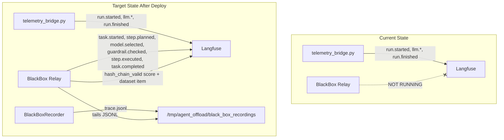

# Fix S1 BlackBox Relay Observations

**Status:** In Progress
**Last updated:** 2026-05-29
**Parent plan:** [blackbox_e2e_validation.plan.md](blackbox_e2e_validation.plan.md)

---

## Problem

S1 validation shows only **4 telemetry-bridge events** (`run.started`, `llm.started`, `llm.finished`, `run.finished`) from the AG-UI domain event pipeline. The **6 BlackBox relay events** expected by the synthetic dataset (`task.started`, `step.planned`, `model.selected`, `guardrail.checked`, `step.executed`, `task.completed`) are completely absent, along with the `hash_chain_valid` score and the `agent-compliance-audit` dataset item.

## Root Cause

**Phase 2 of the validation plan (build/push/deploy) has not been completed.** The Terraform config in [infra/gcp/cloud-run-backend.tf](../../infra/gcp/cloud-run-backend.tf) (lines 108-118) already has the correct env vars:

```
BLACKBOX_RELAY_MODE  = "in_process"
BLACKBOX_STORAGE_DIR = "/tmp/agent_offload/black_box_recordings"
```

But these have not been applied to the running Cloud Run revision. The code is also correctly wired:

- `BlackBoxRecorder` is created in [orchestration/react_loop.py](../../orchestration/react_loop.py) line 393 with `storage_dir = cache_dir / "black_box_recordings"`, where `cache_dir` comes from `AGENT_OFFLOAD_DIR` (`/tmp/agent_offload`)
- The relay in [middleware/composition.py](../../middleware/composition.py) resolves the same path from `BLACKBOX_STORAGE_DIR`
- `LangfuseCloudExporter` satisfies both `TelemetryExporter` and `CompliancePublisher` (runtime_checkable Protocol), so scores and dataset items will be published
- [middleware/app_prod.py](../../middleware/app_prod.py) lines 194-198 start the relay as an asyncio task in the lifespan



---

## Fix Steps

### Step 1 — Confirm current Cloud Run revision env vars

Run a diagnostic gcloud command to check whether the current revision already has the relay env vars or not:

```bash
gcloud run services describe agent-backend-combined \
  --project=$GCP_PROJECT --region=$GCP_REGION \
  --format='yaml(spec.template.spec.containers[0].env)'
```

Look for `BLACKBOX_RELAY_MODE` and `BLACKBOX_STORAGE_DIR`. If absent, proceed to Step 2. If present, skip to Step 3 (the issue is elsewhere).

### Step 2 — Build, push, and deploy the relay-enabled revision

Follow the existing deploy procedure in [LIVE_DEPLOYMENT.md](../recipes/gcp/LIVE_DEPLOYMENT.md):

```bash
# Build and push the image
docker build -t $ARTIFACT_REGISTRY/agent-backend:blackbox-relay-v1 .
docker push $ARTIFACT_REGISTRY/agent-backend:blackbox-relay-v1

# Get the image digest and update terraform.tfvars backend_image
# Then apply Terraform
cd infra/gcp
tofu plan -out=tfplan
tofu apply tfplan
```

Or, if only env vars changed and the image is the same, a targeted Cloud Run update suffices:

```bash
gcloud run services update agent-backend-combined \
  --project=$GCP_PROJECT --region=$GCP_REGION \
  --set-env-vars="BLACKBOX_RELAY_MODE=in_process,BLACKBOX_STORAGE_DIR=/tmp/agent_offload/black_box_recordings"
```

### Step 3 — Verify the relay started

Check Cloud Logging for the relay startup message emitted at [app_prod.py line 198](../../middleware/app_prod.py):

```bash
gcloud logging read \
  'resource.type="cloud_run_revision" AND textPayload=~"relay started"' \
  --project=$GCP_PROJECT --limit=5 --format='table(timestamp,textPayload)'
```

Expected: `BlackBox→Langfuse relay started (in-process)`

If this log line is absent, the relay did not start. Check for:
- `Unknown BLACKBOX_RELAY_MODE=...` warnings (composition.py rejected the value)
- `langfuse client init failed` warnings (SDK credentials issue)

### Step 4 — Also verify the Langfuse datasets exist

The relay creates dataset items via `client.create_dataset_item(dataset_name=...)`. If the datasets `agent-compliance-audit` and `agent-incident-replay` don't exist in Langfuse yet, the SDK should auto-create them, but verify in the Langfuse UI under **Datasets**. If they don't exist, create them manually.

### Step 5 — Re-run S1 and re-validate

After confirming the relay is running, re-run the S1 scenario:

```bash
python scripts/validate_blackbox_langfuse.py \
  --frontend-url "$FRONTEND_URL" \
  --cookie-env WOS_SESSION_COOKIE \
  --scenario S1 \
  --gate per-action
```

Then validate in Langfuse UI using the [walkthrough](../recipes/governance/05_manual_langfuse_validation_walkthrough.md) checklist for S1. The trace should now show:
- The original 4 telemetry-bridge observations (unchanged)
- Plus the 6 BlackBox relay observations (new)
- `hash_chain_valid` score = 1.0 (new)
- Item in `agent-compliance-audit` dataset (new)

### Step 6 — If relay is running but observations still missing

If Step 3 confirms the relay started but observations are still absent, check:

1. **Are JSONL files being written?** SSH into the container or check logs for BlackBoxRecorder activity
2. **Is the storage path correct?** The recorder writes to `{AGENT_OFFLOAD_DIR}/black_box_recordings/{workflow_id}/trace.jsonl` and the relay tails from `BLACKBOX_STORAGE_DIR`. Both must resolve to the same absolute path.
3. **Is the relay polling?** The relay runs `run_once()` every 1 second. Check for DLQ warnings: `DLQ: poison event`
4. **CPU throttling on Cloud Run:** `cpu_idle=true` may throttle the relay after the HTTP response ends. A follow-up request to wake the instance and re-poll may help.

---

## Code Changes Required

Investigation on 2026-05-29 revealed that while the Terraform config and relay wiring
are correct (Steps 1–3 all pass), the relay has a **critical observability gap**:
`export_event()` swallows all exceptions at `DEBUG` level, and `run_once()` has zero
success logging. This makes it impossible to diagnose from Cloud Logging whether
events are being forwarded or silently dropped.

### Changes on branch `fix/s1-blackbox-relay`

1. **`middleware/sidecars/black_box_to_telemetry.py`** — Added INFO-level logging
   when `run_once()` publishes events (count + workflow ID), and DEBUG log when
   `storage_dir` does not exist.
2. **`middleware/adapters/observability/langfuse_cloud_exporter.py`** — Elevated
   all SDK exception logging from `DEBUG` to `WARNING` (`export_event`,
   `release_trace`, `create_dataset_item`, `score_trace`, `shutdown`).

These changes preserve rule **O1** (telemetry never blocks) while ensuring
failures are visible in Cloud Run logs at the default INFO level.

---

## Task Checklist

- [x] Step 1: Confirm current Cloud Run revision env vars via `gcloud run services describe`
- [x] Step 2: Build/push/deploy relay-enabled revision (env vars already present — skipped)
- [x] Step 3: Verify `BlackBox→Langfuse relay started (in-process)` in Cloud Logging
- [ ] Step 3b: Deploy logging fix, re-run S1, check for WARNING-level relay errors
- [ ] Step 4: Verify `agent-compliance-audit` and `agent-incident-replay` datasets exist in Langfuse
- [ ] Step 5: Re-run S1 and re-validate all walkthrough checks
- [ ] Step 6: Troubleshoot if relay running but observations still missing
