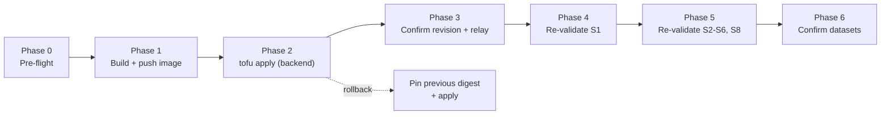

# Fix S1 BlackBox Relay — Deploy & Re-validation Plan

**Status:** Code fix + follow-up hardening complete (88/88 tests). Cloud Run redeploy and live re-validation pending.
**Last updated:** 2026-05-29
**Parent plan:** [fix_s1_blackbox_relay.plan.md](fix_s1_blackbox_relay.plan.md)
**Deploy reference:** [SKILL_DEPLOY_GUIDE.md](../recipes/gcp/SKILL_DEPLOY_GUIDE.md) · [LIVE_DEPLOYMENT.md](../recipes/gcp/LIVE_DEPLOYMENT.md)
**Validation reference:** [05_manual_langfuse_validation_walkthrough.md](../recipes/governance/05_manual_langfuse_validation_walkthrough.md)

---

## Goal

Ship the `start_observation(id=...)` fix to the live `agent-backend-combined`
Cloud Run service and prove, against the deployed backend, that all 6 BlackBox
relay observations (plus the `hash_chain_valid` score and the compliance dataset
items) now reach Langfuse for every scenario.

## Why this is a separate plan

Everything left is **operational**: it needs live GCP credentials, a deployed
frontend with a valid WorkOS session cookie, and the two human STOP gates baked
into the deploy skill (DB migration, WorkOS redirect). None of it can run as a
pure code change in CI. This plan sequences those steps with explicit
prerequisites, gates, and rollback.



---

## Prerequisites (confirm before starting)

- [ ] [HUMAN_SETUP.md](../recipes/gcp/HUMAN_SETUP.md) complete: billing-linked project, state bucket, `tofu-deployer` key in `GOOGLE_APPLICATION_CREDENTIALS`, `infra/gcp/terraform.tfvars` populated.
- [ ] Dev toolchain on PATH: `tofu`, `conftest`, `terraform-compliance`, `gcloud`, `docker` (from `pip install -e ".[dev]"`).
- [ ] Env exported: `GCP_PROJECT`, `GCP_REGION`, `FRONTEND_URL`, and a fresh `WOS_SESSION_COOKIE` (the wos-session cookie value from a logged-in browser session).
- [ ] On the branch carrying the fix (`fix/s1-blackbox-relay`); `git status` clean enough that `deploy_gcp.sh preview` reflects the intended change set.
- [ ] Note the **current** serving digest for rollback (Phase 0).

---

## Phase 0 — Pre-flight (no mutations)

Capture the rollback target and rehearse the legs that will run.

```bash
# Record the currently-serving digest (rollback anchor)
gcloud run services describe agent-backend-combined \
  --project="$GCP_PROJECT" --region="$GCP_REGION" \
  --format='value(spec.template.spec.containers[0].image)'

# Advisory diff + deploy identity (no cloud calls)
./scripts/deploy_gcp.sh preview

# Rehearse the gated legs (prints gate order, no apply/push)
DRY_RUN=1 ./scripts/deploy_gcp.sh images
DRY_RUN=1 ./scripts/deploy_gcp.sh backend
```

**Exit criteria:** `preview` shows `Rebuild backend image: 1` (backend code
changed); both dry-runs print `plan -> show -> conftest -> show-json ->
terraform-compliance` then `WARN: DRY_RUN=1 ... skipping tofu apply`.

---

## Phase 1 — Build & push the backend image

Use the deploy skill so the digest gets pinned for us.

```bash
VERSION=blackbox-id-fix-v1 WRITE_TFVARS=1 ./scripts/deploy_gcp.sh images
```

- Multi-tags `Dockerfile.backend`, pushes to Artifact Registry, resolves the
  `@sha256` digest, and writes a digest-pinned `backend_image` into
  `infra/gcp/terraform.tfvars` (creates `terraform.tfvars.bak`).
- **Manual fallback** (if not using `WRITE_TFVARS`): build/tag/push per parent
  plan §Step 1, then hand-edit `backend_image` to the `@sha256:<DIGEST>` line.

**Exit criteria:** `terraform.tfvars` `backend_image` ends with `@sha256:<digest>`
and the frontend image line is unchanged.

---

## Phase 2 — Apply (gated) to Cloud Run

```bash
./scripts/deploy_gcp.sh backend
```

Runs the non-negotiable gate (`plan -> conftest -> terraform-compliance ->
apply`) then curls `${backend_url}/healthz` and asserts `status=ok`.

- The relay env vars (`BLACKBOX_RELAY_MODE=in_process`,
  `BLACKBOX_STORAGE_DIR=/tmp/agent_offload/black_box_recordings`) are already in
  [cloud-run-backend.tf](../../infra/gcp/cloud-run-backend.tf) — **no change**.
- No DB/WorkOS STOP gate applies to a backend-only image bump.

**Exit criteria:** gate passes, apply succeeds, `/healthz` returns `status=ok`.

---

## Phase 3 — Confirm the new revision + relay health

```bash
# New revision serves 100% traffic on the fix digest
gcloud run services describe agent-backend-combined \
  --project="$GCP_PROJECT" --region="$GCP_REGION" \
  --format='value(status.latestReadyRevisionName, status.traffic)'

# Relay started
gcloud logging read \
  'resource.type="cloud_run_revision" AND textPayload=~"relay started"' \
  --project="$GCP_PROJECT" --limit=5 --format='table(timestamp,textPayload)'

# Negative check: the old TypeError WARNING must be GONE after a run
gcloud logging read \
  'resource.type="cloud_run_revision" AND textPayload=~"unexpected keyword argument .id."' \
  --project="$GCP_PROJECT" --limit=5 --format='table(timestamp,textPayload)'
```

**Exit criteria:** latest ready revision points at the `blackbox-id-fix-v1`
digest at 100% traffic; `BlackBox→Langfuse relay started (in-process)` present;
**zero** `unexpected keyword argument 'id'` warnings after a fresh run.

---

## Phase 4 — Re-validate S1 against the deployed backend

```bash
python scripts/validate_blackbox_langfuse.py \
  --frontend-url "$FRONTEND_URL" \
  --cookie-env WOS_SESSION_COOKIE \
  --scenario S1 \
  --gate per-action
```

Then walk the [S1 checklist](../recipes/governance/05_manual_langfuse_validation_walkthrough.md).

**Exit criteria (the Langfuse trace shows):**
- The original 4 telemetry-bridge observations (unchanged).
- **+ 6 BlackBox relay observations:** `task.started`/agent,
  `guardrail.checked`/guardrail, `step.planned`/chain, `model.selected`/generation,
  `step.executed`/span, `task.completed`/agent.
- `hash_chain_valid` score = **1.0**.
- One item in the `agent-compliance-audit` dataset.

---

## Phase 5 — Re-validate the remaining scenarios

The bug dropped **every** BlackBox observation, so all scenarios need a re-run.

```bash
# All scenarios, gated; or pass --scenario S2 ... S8 individually
python scripts/validate_blackbox_langfuse.py \
  --frontend-url "$FRONTEND_URL" \
  --cookie-env WOS_SESSION_COOKIE \
  --gate per-action
```

**Per-scenario expectations:**
- **S2:** + `tool.called` (tool).
- **S3:** + `tool.called` + `error.occurred` (span, level=ERROR).
- **S4:** optional `parameter.changed` (SOFT pass if absent).
- **S5:** `outcome=failure` on `task.completed`; item in `agent-incident-replay`.
- **S6:** PII/API-key redaction markers (`[REDACTED]`), zero raw secrets.
- **S8:** two distinct traces, each 6/6, no cross-contamination.

---

## Phase 6 — Confirm datasets exist

In the Langfuse UI under **Datasets**, confirm `agent-compliance-audit` and
`agent-incident-replay` exist (SDK auto-creates on first
`create_dataset_item`; create manually if absent).

**Exit criteria:** both datasets present with the expected new items from
Phases 4–5.

---

## Rollback

If any phase after apply regresses the live service, re-pin the previous digest
captured in Phase 0 and re-apply:

```bash
# In infra/gcp/terraform.tfvars set backend_image back to the prior @sha256 digest
cd infra/gcp
tofu plan -out=tfplan -var-file=terraform.tfvars
tofu apply tfplan
```

(Full teardown paths live in [SKILL_DEPLOY_GUIDE.md](../recipes/gcp/SKILL_DEPLOY_GUIDE.md) §Rollback — not needed for an image revert.)

---

## Risks & mitigations

| Risk | Mitigation |
|------|------------|
| Stale/expired `WOS_SESSION_COOKIE` → validator 401s | Refresh the cookie from a live logged-in session immediately before Phase 4. |
| Policy gate (`conftest`/`terraform-compliance`) blocks apply | Read the failing rule; the apply is *supposed* to be blocked. Fix the tfvars/plan, never bypass the gate. |
| Relay swallows a *different* SDK error | Phase 3 negative log check + the new DLQ (`.langfuse_failures.jsonl`) surface it; inspect the DLQ on the revision if counts are short. |
| CPU throttling delays in-process relay drain | Already ruled out as the S1 cause; if events lag, confirm `drain_workflow` runs in the SSE finally block. |
| Validator dirty state between scenarios (S8 cross-contamination) | Run S8 last; assert two distinct trace IDs per the walkthrough. |

---

## Task Checklist

- [ ] **Phase 0:** record rollback digest; `preview` + dry-run `images`/`backend` clean
- [x] **Phase 1:** backend-only build of fix commit `cfb981b`, pushed `blackbox-id-fix-v1` + `sha-cfb981b`, digest `sha256:5186971f…` pinned as `backend_image` in tfvars (frontend untouched)
- [x] **Phase 2:** gate passed (conftest 35/35, terraform-compliance 0 fail); applied `tfplan` (backend image bump + benign frontend `scaling`/dashboard drift); `/healthz` → `status=ok`. Rollback anchor: `sha256:62ef46f0…` (rev `00030-g8g`)
- [x] **Phase 3:** new revision `agent-backend-combined-00031-r4f` @ 100% traffic on `sha256:5186971f…`; relay started (in-process) at 21:56:34Z; zero `id` TypeError on the new revision (pre-fix warnings were all on old rev `00030`). Live workload check happens in Phase 4.
- [x] **Phase 4:** S1 trace (`145d5898…`) = 4 + 6 observations, `hash_chain_valid`=1.0, `agent-compliance-audit` item present — verified directly against `cloud.langfuse.com` with the **deployed** Secret Manager keys (project `cmpoo5ul3…`). Required a 2nd code fix + redeploy (commit `3757fe9`, image `blackbox-id-fix-v2` `sha256:9178fa30…`, rev `00032-qbn`).
  - **Two more SDK-v4 bugs found & fixed** (same swallow class as the `id` bug): `score_trace` used removed `client.score()` → `create_score()`; `create_dataset_item` 404'd (v4 doesn't auto-create) → now upserts the dataset first.
  - **Validator caveats:** (1) its 5s ingest wait races Langfuse — observations/score land within ~20s; (2) it must use the **deployed** Langfuse keys, not the `tfvars` keys (those are US-region keys for a different project).
- [ ] **Phase 5:** S2, S3, S4, S5, S6, S8 pass per expectations
- [x] **Phase 6 (partial):** `agent-compliance-audit` now auto-created and holds the S1 item. `agent-incident-replay` will be created on the first S5 failure-outcome run (Phase 5, pending).
- [ ] Tick the matching boxes in the [parent plan](fix_s1_blackbox_relay.plan.md) checklist
