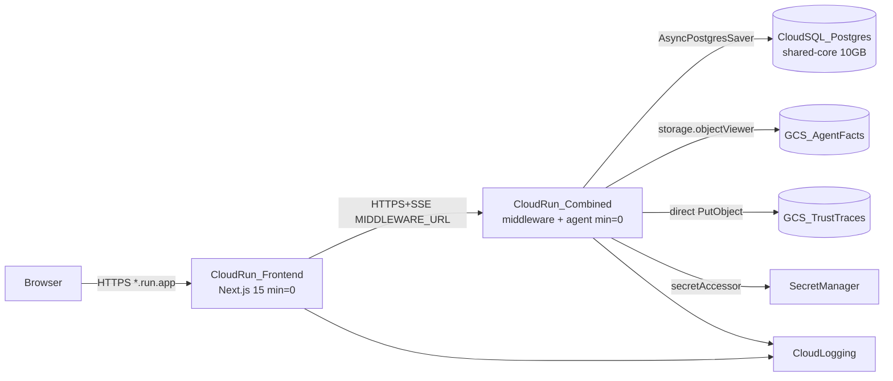

# Deploy AgentsFramework to GCP — Component-by-Component Recipes

## Status Tracker

| Recipe | Description | Status | Date Started | Date Completed | Notes |
|--------|-------------|--------|--------------|----------------|-------|
| 0 | GCP runtime adapters (code only) | **DONE** | 2026-05-22 | 2026-05-22 | 36 tests pass, all arch tests pass |
| 1 | GCP foundations (OpenTofu, IAM, AR, SM) | **DONE** | 2026-05-22 | 2026-05-22 | 33 tests pass, 1 skipped (tofu validate) |
| 2 | Data tier (Cloud SQL + GCS) | **DONE** | 2026-05-23 | 2026-05-23 | 30+ tests pass, data.tf + data.rego + test_data.py |
| 3 | Containerize (Dockerfiles + app_prod.py) | **DONE** | 2026-05-23 | 2026-05-23 | 16 tests pass, multi-stage builds |
| 4 | Backend Cloud Run deploy | **DONE** | 2026-05-23 | 2026-05-23 | cloud-run-backend.tf + test_cloud_run_backend.py (17 tests) + story doc rewrite (5 lessons, 2026-05-23) |
| 5 | Frontend Cloud Run deploy | **DONE** | 2026-05-24 | 2026-05-24 | cloud-run-frontend.tf + test_cloud_run_frontend.py (18 tests) + workos-cookie-password secret |
| 6 | Meta ring (optional) | **DONE** | 2026-05-24 | 2026-05-24 | meta.tf + test_meta.py (16 tests) + run_eval CLI; disabled by default |
| 7 | Observability + smoke tests | **DONE** | 2026-05-24 | 2026-05-24 | observability.tf + test_observability.py (14 tests) + smoke_gcp.sh |
| 8 | Cleanup + teardown | **DONE** | 2026-05-24 | 2026-05-24 | teardown_gcp.sh + test_cleanup.py (8 tests) |
| B | Tier B future doc | **DONE** | 2026-05-24 | 2026-05-24 | TIER_B_FUTURE.md — B1–B5 decision guide + cost model |
| — | Live deployment runbook | **DONE** | 2026-05-24 | 2026-05-24 | LIVE_DEPLOYMENT.md + bootstrap_gcp_env.sh — Day-0/1/2 operator walkthrough |

**Overall Progress:** 10/10 recipes + live runbook complete | **Estimated Tier A cost:** ~$12–15/mo

---

## Research-backed decisions (locked)

### Stack strategy: new `infra/gcp/` (GCP-native OpenTofu)

**Chosen over extending [`infra/dev-tier/`](infra/dev-tier/)** based on trade-offs:

| Factor | Extend `infra/dev-tier/` | New `infra/gcp/` (chosen) |
|--------|--------------------------|---------------------------|
| Tier A cost | Neon (~$0) helps, but Cloudflare Pro (~$25/mo) breaks GCP's ~$12–15/mo advantage per [`CLOUD_PROVIDER_COMPARISON.md`](docs/Architectures/CLOUD_PROVIDER_COMPARISON.md) §4.1 | Cloud SQL (~$12) + 2× Cloud Run (always-free tier) + GCS ≈ **~$12–15/mo** |
| Architecture alignment | V3-Dev-Tier substrate profile (Neon + Cloudflare); not [`GCP_DEPLOYMENT_ARCHITECTURE.md`](docs/Architectures/GCP_DEPLOYMENT_ARCHITECTURE.md) | Direct mapping to Cloud SQL, GCS, Secret Manager, Cloud Run |
| Agent automation | Proven Tofu test pipeline exists | **Reuse** dev-tier patterns: `pytest tests/infra/`, Conftest Rego, `terraform-compliance` BDD |
| AWS parity | Divergent from AWS recipe shape | Mirrors AWS plan: adapters in code layers + IaC in `infra/gcp/` + recipes in `docs/recipes/gcp/` |
| Lock-in | Same 4 adapter files | Same 4 adapter files (I-9 bounded) |

**IaC tool:** OpenTofu (not CDK). The repo already has a validated L2 IaC test pyramid under [`tests/infra/`](tests/infra/) and [`infra/dev-tier/policies/`](infra/dev-tier/policies/). Agent flow: `tofu plan -out=tfplan` → `tofu show -json tfplan` → `terraform-compliance` → `tofu apply`.

**Keep `infra/dev-tier/` unchanged** — it remains the V3-Dev-Tier substrate for composition-root swaps per [`infra/RUNBOOK.md`](infra/RUNBOOK.md).

### Tier A topology: Option A (single combined backend) + separate Cloud Run frontend

User confirmed Option A for Tier A implementation. Future decoupled recipes documented in appendix.

**Tier A target (~$12–15/mo, NFS dropped, no Global LB):**



**Key Tier A simplifications (matching AWS plan philosophy):**
- **Single combined backend container** — mount agent routes on middleware FastAPI (new `middleware/app_prod.py`), defer BFF+Backend split to Tier B recipes.
- **No Global HTTPS LB** — use built-in `*.run.app` URLs; Cloud Run supports SSE natively with `timeout=3600s` ([Cloud Run request timeout docs](https://cloud.google.com/run/docs/configuring/request-timeout)).
- **No Filestore** — use container-local ephemeral disk for `cache/.agent_offload/` at dev tier (conditional cost win per [`CLOUD_PROVIDER_COMPARISON.md`](docs/Architectures/CLOUD_PROVIDER_COMPARISON.md) §7.2).
- **No Pub/Sub at Tier A** — direct GCS writes for traces (~$0 at <1 GB/mo); Pub/Sub deferred to Tier B recipe.
- **Cloud SQL via Cloud Run built-in connector** — `cloud_sql_instances` annotation on the service template (no separate Auth Proxy sidecar).

---

## Topology options — pros and cons (for future tier decisions)

### Option A — Single combined Cloud Run backend (Tier A default)

| Pros | Cons |
|------|------|
| Cheapest (~$12–15/mo); no LB hours | No network isolation between middleware and agent rings |
| Simplest agent automation (1 backend deploy) | Single blast radius; can't scale rings independently |
| Scale-to-zero on both services | `allUsers` Cloud Run invoker at Tier A (auth at app layer only) |
| SSE works on `*.run.app` with 3600s timeout | Deviates from [`GCP_DEPLOYMENT_ARCHITECTURE.md`](docs/Architectures/GCP_DEPLOYMENT_ARCHITECTURE.md) §3.1 split topology |

### Option B — Split BFF + Backend + Internal LB (Tier B future)

| Pros | Cons |
|------|------|
| Matches architecture doc §3.1 fidelity | Global/Internal HTTPS LB ≈ **+$23/mo** even at low traffic |
| Backend `INGRESS_TRAFFIC_INTERNAL_ONLY` | Two backend services + LB wiring; harder agent automation |
| Independent scaling per ring | `min_instances >= 1` likely needed for SSE UX (~+$117/mo compute) |

### Option C — Combined backend + separate Cloud Run frontend (Tier A frontend choice)

| Pros | Cons |
|------|------|
| Fully GCP-native (no Cloudflare dependency) | Two Dockerfiles + two deploy pipelines |
| Frontend/backend deploy independently | CORS + `MIDDLEWARE_URL` wiring; two cold-start surfaces |
| Both services scale-to-zero within free tier | Still no internal LB for backend isolation |

**Tier A uses A (backend) + C (frontend).** Option B becomes [`docs/recipes/gcp/TIER_B_FUTURE.md`](docs/recipes/gcp/TIER_B_FUTURE.md).

---

## Agent vs human responsibilities

Each recipe markdown file includes two explicit sections:

### `## Agent steps` (automatable)
- Code changes, pytest, `tofu validate/plan/apply`, `docker build/push`, `gcloud run deploy`, smoke scripts
- Preconditions checked programmatically (APIs enabled, secrets exist, health checks pass)

### `## Human review gate` (manual)
Consolidated one-time setup in [`docs/recipes/gcp/HUMAN_SETUP.md`](docs/recipes/gcp/HUMAN_SETUP.md):

1. **GCP billing account + project creation** — agent cannot create billing-linked projects without org admin
2. **Download `tofu-deployer` SA JSON key** — store as `GOOGLE_APPLICATION_CREDENTIALS`; never commit
3. **Populate `infra/gcp/terraform.tfvars`** (gitignored) — API keys: OpenAI, WorkOS, Anthropic, etc.
4. **WorkOS dashboard** — add frontend `*.run.app` redirect URI after Recipe 5 outputs URL
5. **Optional custom domain** — DNS + domain mapping (deferred; Tier A uses `*.run.app`)
6. **Post-deploy review** — operator signs off on IAM bindings, budget alert, and smoke test output

Ongoing maintenance runbook extends [`infra/RUNBOOK.md`](infra/RUNBOOK.md) with GCP-native sections (secret rotation via `gcloud secrets versions add`, Cloud SQL backup review, budget monitoring).

---

## Recipe layout convention (same as AWS plan)

Each file under `docs/recipes/gcp/`:

1. **Goal**
2. **Prerequisites**
3. **Agent steps** — exact paths, commands, code snippets
4. **Human review gate** — what to verify before/after apply
5. **For a general audience** — substitutions for similar Next.js + LangGraph stacks
6. **Verify** — pytest + `gcloud`/`curl` smoke checks
7. **Rollback** — `tofu destroy` order + cleanup notes
8. **Cost note** — Tier A line items

---

## Recipes

### Recipe 0 — Build missing GCP runtime adapters (code only, no GCP resources)

**What:** Implement §6 of [`GCP_DEPLOYMENT_ARCHITECTURE.md`](docs/Architectures/GCP_DEPLOYMENT_ARCHITECTURE.md). No cloud resources yet.

New files:
- [`agent_ui_adapter/adapters/runtime/postgres_saver.py`](agent_ui_adapter/adapters/runtime/postgres_saver.py) — wraps `AsyncPostgresSaver`; shared with AWS/Azure recipes (one file, multiple env switches)
- [`services/trace_sinks/gcs_sink.py`](services/trace_sinks/gcs_sink.py) — direct GCS `PutObject` for Tier A (implements existing `TraceSink` protocol from [`services/trace_sinks/jsonl_sink.py`](services/trace_sinks/jsonl_sink.py))
- [`services/trace_sinks/pubsub_sink.py`](services/trace_sinks/pubsub_sink.py) — Tier B+ streaming sink (implement now, wire later)
- [`services/governance/agent_facts_gcs_registry.py`](services/governance/agent_facts_gcs_registry.py) — read signed JSON from `gs://`
- [`services/cloud_providers/gcp_identity.py`](services/cloud_providers/gcp_identity.py) — Workload Identity → AgentFacts mapping

Composition root edits:
- [`middleware/__main__.py`](middleware/__main__.py) and [`agent_ui_adapter/server.py`](agent_ui_adapter/server.py): branch on `os.environ.get("GCP_EXECUTION_ENV")` to wire Postgres saver + GCS sink instead of SQLite + JSONL
- Ephemeral offload path: set `AGENT_OFFLOAD_DIR=/tmp/agent_offload` when `GCP_EXECUTION_ENV` is set (no Filestore)

Tests:
- `tests/services/trace_sinks/test_gcs_sink.py` — mock `google.cloud.storage` client
- `tests/services/trace_sinks/test_pubsub_sink.py` — mock pubsub publisher
- `tests/services/governance/test_agent_facts_gcs_registry.py`
- `tests/agent_ui_adapter/adapters/runtime/test_postgres_saver.py` — docker postgres or pytest-postgresql fixture
- `tests/services/cloud_providers/test_gcp_identity.py`

Dependencies: add `[gcp]` optional extra in `pyproject.toml` (`google-cloud-storage`, `google-cloud-pubsub`, `langgraph-checkpoint-postgres`).

Gate: `pytest tests/architecture tests/services/trace_sinks tests/agent_ui_adapter/adapters/runtime tests/services/cloud_providers -q`

---

### Recipe 1 — GCP account foundations (OpenTofu bootstrap, IAM, Artifact Registry, Secret Manager)

**What:** Create `infra/gcp/` by adapting patterns from [`infra/dev-tier/`](infra/dev-tier/).

New folder structure:
```
infra/gcp/
  versions.tf          # google provider pin
  backend.tf           # GCS remote state
  variables.tf         # sensitive vars for secrets
  terraform.tfvars.example
  foundations.tf       # APIs, Artifact Registry, deployer + runtime SAs
  secret-manager.tf    # placeholder secrets (empty versions via tfvars)
  outputs.tf
  policies/*.rego      # copy + adapt from dev-tier
  features/*.feature     # terraform-compliance BDD
tests/infra/gcp/         # pytest snapshot tests (parse HCL)
```

Resources:
- Enable APIs: `run`, `sqladmin`, `secretmanager`, `artifactregistry`, `storage`, `iam`, `cloudbilling`, `monitoring`
- Artifact Registry repo `agent-backend`
- Secret Manager shells: `OPENAI_API_KEY`, `WORKOS_*`, `DATABASE_URL`, `AGENT_FACTS_SECRET`, etc.
- Runtime SA `agent-backend-runtime` with least-privilege baseline (expanded in Recipe 2)
- GCS state bucket (human creates once; documented in HUMAN_SETUP.md)

Commands:
```bash
cd infra/gcp && tofu init -backend-config="bucket=${PROJECT}-tofu-state"
tofu plan -out=tfplan && tofu apply tfplan
```

Verify: `gcloud artifacts repositories list`, `gcloud secrets list`

---

### Recipe 2 — Data tier (Cloud SQL + GCS buckets)

**What:** Stateful layer aligned with Tier A cost model.

New: `infra/gcp/data.tf`
- **Cloud SQL PostgreSQL 15** — smallest shared-core, 10 GB, single-AZ, `deletion_protection=false` for dev
- **GCS bucket `agent-facts`** — versioning enabled, uniform bucket-level access, public access prevention
- **GCS bucket `trust-traces`** — 90-day lifecycle to Nearline (Tier B pattern; cheap at Tier A volume)
- IAM: runtime SA → `roles/storage.objectViewer` on facts, `roles/storage.objectCreator` on traces
- Populate `DATABASE_URL` secret with Cloud SQL connection string (via Cloud Run connector format)
- One-shot: run `AsyncPostgresSaver.setup()` migration (agent script or documented `psql` step)

**Explicitly NOT provisioned at Tier A:** Filestore, Pub/Sub topic, Global LB

Verify: `gcloud sql instances describe`, `gsutil ls`, connect test via Cloud SQL Auth Proxy locally

---

### Recipe 3 — Containerize backend + frontend

**What:** Production Docker images for Cloud Run.

New files:
- `Dockerfile.backend` — multi-stage Python 3.11, installs `[gcp]` extra, exposes 8080, `CMD uvicorn middleware.app_prod:build_combined_app --factory`
- `Dockerfile.frontend` — multi-stage Node, `output: 'standalone'` added to [`frontend/next.config.ts`](frontend/next.config.ts)
- [`middleware/app_prod.py`](middleware/app_prod.py) — composes [`middleware/server.py`](middleware/server.py) auth/ACL routes with [`agent_ui_adapter/server.py`](agent_ui_adapter/server.py) agent routes; exposes `/healthz`

Local smoke:
```bash
docker build -f Dockerfile.backend -t agent-backend:dev .
docker run -p 8080:8080 -e GCP_EXECUTION_ENV=cloudrun -e OPENAI_API_KEY=... agent-backend:dev
curl localhost:8080/healthz
```

Push via Cloud Build or `docker push` to Artifact Registry (Recipe 4 wires image URL in Tofu).

---

### Recipe 4 — Deploy combined backend on Cloud Run (Tier A)

**What:** Single public Cloud Run v2 service with SSE-safe settings.

New: `infra/gcp/cloud-run-backend.tf`
- Service `agent-backend-combined`
- `timeout = "3600s"`, `min_instance_count = 0`, `max_instance_count = 10`, `cpu_idle = true`, `startup_cpu_boost = true`
- `cloud_sql_instances` connector to Recipe 2 instance
- Env: `GCP_EXECUTION_ENV=cloudrun`, `ARCHITECTURE_PROFILE=v3`, `GCS_FACTS_BUCKET`, `GCS_TRACES_BUCKET`
- Secrets via `value_source.secret_key_ref` (pattern from [`infra/dev-tier/cloud-run.tf`](infra/dev-tier/cloud-run.tf))
- Probes: `GET /healthz`
- IAM: `allUsers` → `roles/run.invoker` (Tier A dev; Tier B recipe tightens this)

Verify:
```bash
curl -s "$(tofu output -raw backend_url)/healthz"
curl -N -H "Authorization: Bearer $TOKEN" -d '{...}' "$(tofu output -raw backend_url)/agent/runs/stream"
```

---

### Recipe 5 — Deploy frontend on Cloud Run

**What:** Second Cloud Run service for Next.js 15 SSR + edge middleware.

New: `infra/gcp/cloud-run-frontend.tf`
- Service `agent-frontend`
- Env (public only on frontend): `MIDDLEWARE_URL=<backend_url>`, `NEXT_PUBLIC_WORKOS_REDIRECT_URI`, `ARCHITECTURE_PROFILE=v3`
- No secrets on frontend container (F-R / FE-AP-18)

**Human review gate:** Update WorkOS allowed redirect URIs to match frontend `*.run.app` URL.

Verify: browser sign-in flow + SSE message stream end-to-end.

---

### Recipe 6 — Meta ring (optional for Tier A)

**What:** Cloud Scheduler → Cloud Run Job running `meta/run_eval.py` against GCS traces bucket.

New: `infra/gcp/meta.tf` — cron `0 6 * * *`, read-only GCS access

**Default: skip for Tier A.** Document local alternative: `gsutil cp` snapshot + `python -m meta.run_eval`.

---

### Recipe 7 — Observability + smoke tests + budget

**What:** Minimal Tier A observability.

New:
- `infra/gcp/observability.tf` — Cloud Monitoring dashboard, 3 alert policies (Cloud Run 5xx rate, request latency, Cloud SQL connections), billing budget alert at **$50/mo**
- `scripts/smoke_gcp.sh` — `/healthz`, thread create, SSE chunk assertion within 5s

Wire smoke script as post-apply hook in recipe docs (CI job or manual operator step).

---

### Recipe 8 — Cleanup + teardown order

**What:** Safe destroy sequence for agent-driven teardown.

Destroy order:
1. Cloud Scheduler / Run Job (Recipe 6 if deployed)
2. `tofu destroy` frontend Cloud Run
3. `tofu destroy` backend Cloud Run
4. Empty GCS buckets → destroy data tier
5. Destroy foundations (keep Artifact Registry + secrets between iterations — cheap to retain)

Dev-only: `force_destroy = true` on GCS buckets; `deletion_protection = false` on Cloud SQL.

---

## Future recipes appendix — Tier B decoupled topology

Document in [`docs/recipes/gcp/TIER_B_FUTURE.md`](docs/recipes/gcp/TIER_B_FUTURE.md) (not implemented in initial pass):

| Future recipe | Trigger | Adds |
|---------------|---------|------|
| B1 Split services | Cold-start UX unacceptable OR security review requires isolation | Separate BFF + Backend Cloud Run, Internal HTTPS LB, backend `INGRESS_INTERNAL_ONLY` |
| B2 Pub/Sub trace pipeline | Trace volume > ~10 GB/mo | Pub/Sub topic + GCS subscription; switch sink from `gcs_sink` to `pubsub_sink` |
| B3 Cloud SQL HA | Tier B production (~$310/mo band) | Multi-AZ HA, `min_instances=1` on backend |
| B4 NFS / offload | Tool offload needs durable shared FS | GCS object offload (preferred) or Filestore Basic (cost warning: 1 TiB minimum) |
| B5 Edge hardening | Custom domain + WAF | Global HTTPS LB, Cloud Armor, managed SSL |

Include the Option B pros/cons table above as the decision guide for when to graduate.

---

## Per-recipe deliverables

| Deliverable | Location |
|-------------|----------|
| Recipe markdown (9 files) | `docs/recipes/gcp/00_adapters.md` … `08_cleanup.md` |
| Human setup + maintenance | `docs/recipes/gcp/HUMAN_SETUP.md` |
| Tier B future recipes | `docs/recipes/gcp/TIER_B_FUTURE.md` |
| OpenTofu stack | `infra/gcp/*.tf` |
| Adapter code | layer-correct paths per Recipe 0 |
| Infra tests | `tests/infra/gcp/` + reuse Conftest patterns |
| Smoke script | `scripts/smoke_gcp.sh` |
| Architecture doc cross-ref | Update [`GCP_DEPLOYMENT_ARCHITECTURE.md`](docs/Architectures/GCP_DEPLOYMENT_ARCHITECTURE.md) §6: "Recipes 0–8 implement Tier A; see TIER_B_FUTURE.md" |

---

## Out of scope (initial pass)

- Replacing or modifying [`infra/dev-tier/`](infra/dev-tier/) (V3-Dev-Tier substrate stays separate)
- Firebase App Hosting (alternative frontend path; Cloud Run chosen for agent parity with backend deploy pipeline)
- AlloyDB / Cloud SQL HA / cross-region DR
- Cloud Armor / VPC Service Controls
- Sharing Recipe 0 `postgres_saver.py` implementation with AWS plan — build once, both clouds consume (coordinate if AWS Recipe 0 lands first)

---

## Execution order

Recipe 0 must pass all tests before Recipe 1. Recipe 2 depends on Recipe 1. Recipes 3–5 are sequential (image → backend → frontend). Recipes 6–8 are optional/final.

Estimated Tier A monthly cost after full deploy: **~$12–15/mo list-price** (Cloud SQL ~$12 dominates; compute within Cloud Run always-free tier at dev traffic).
